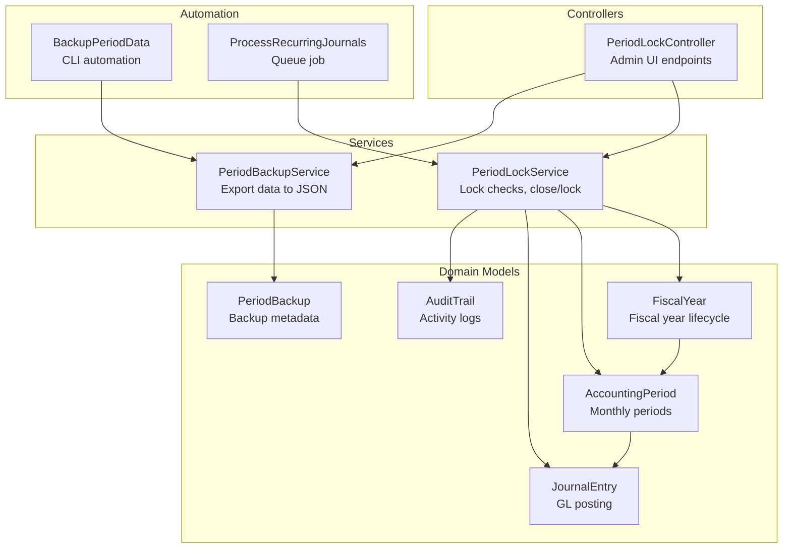
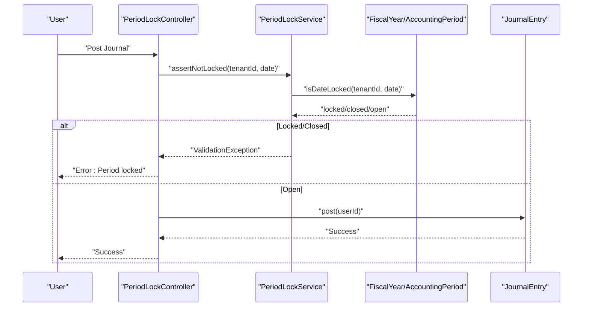
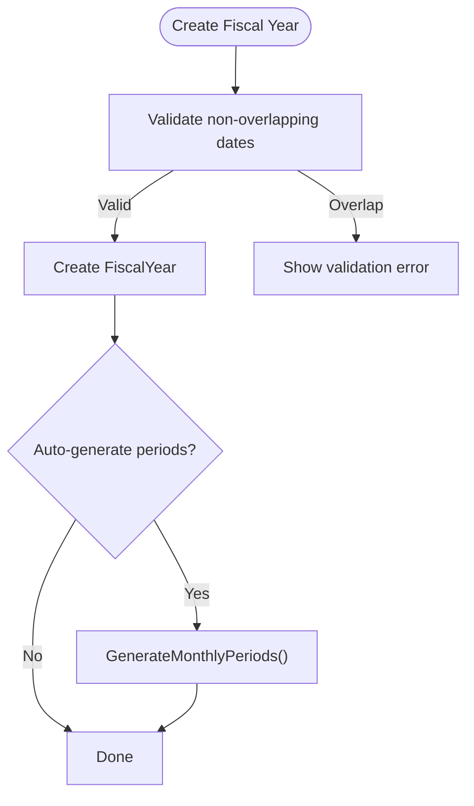
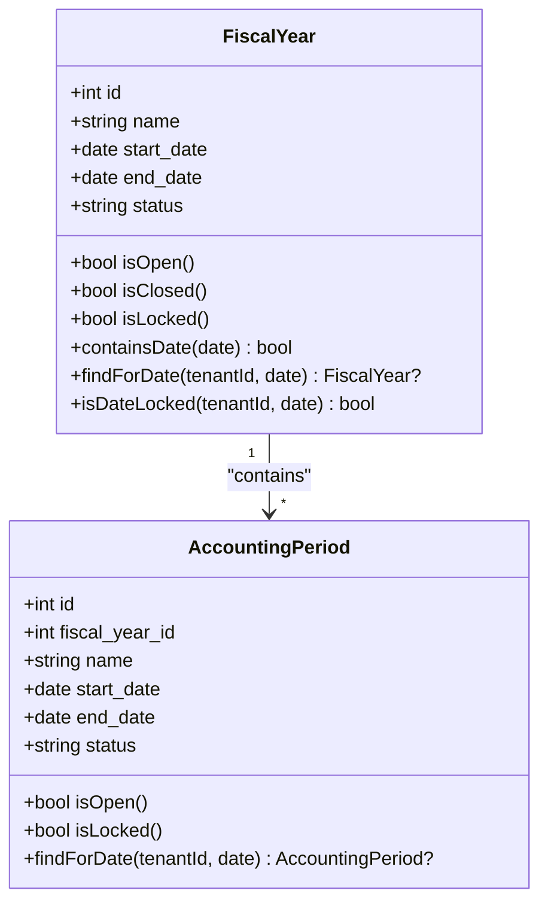
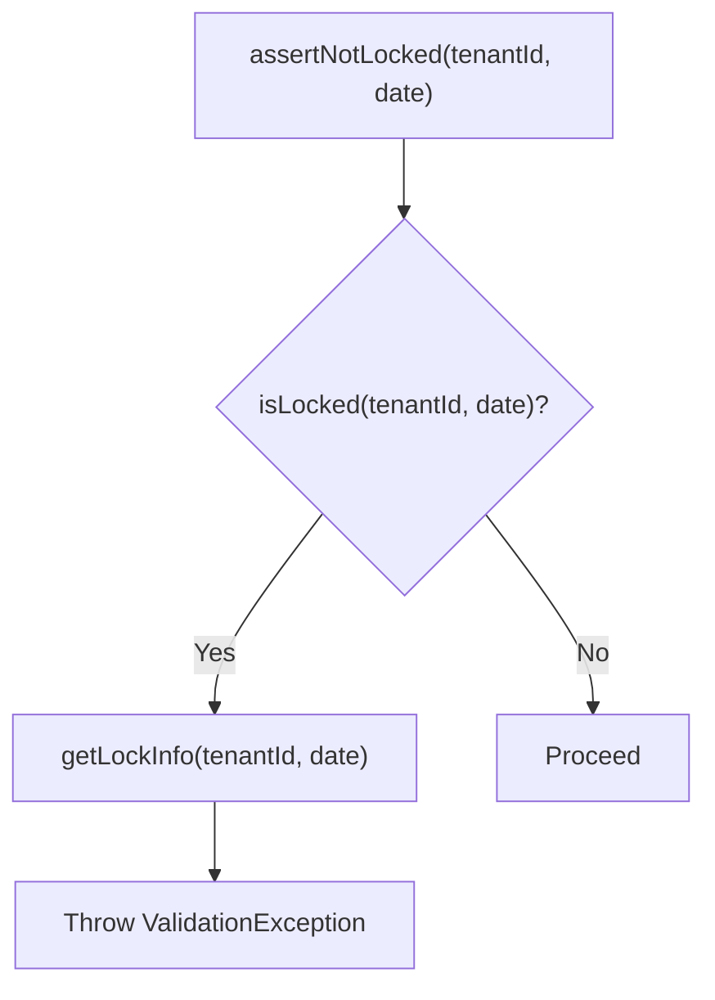
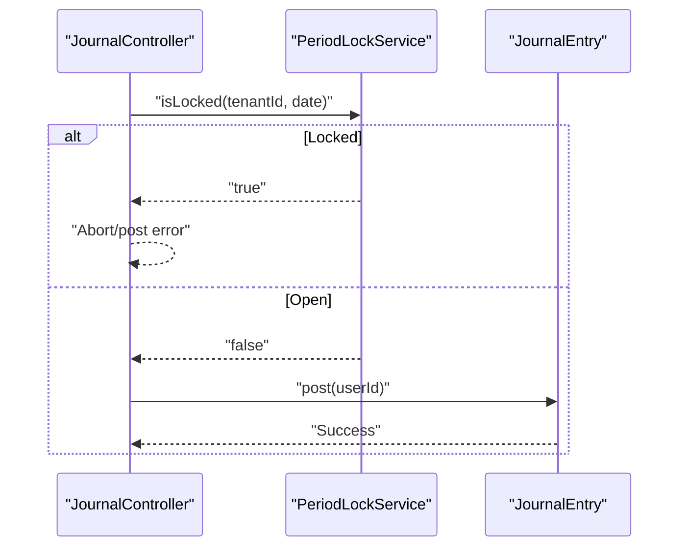
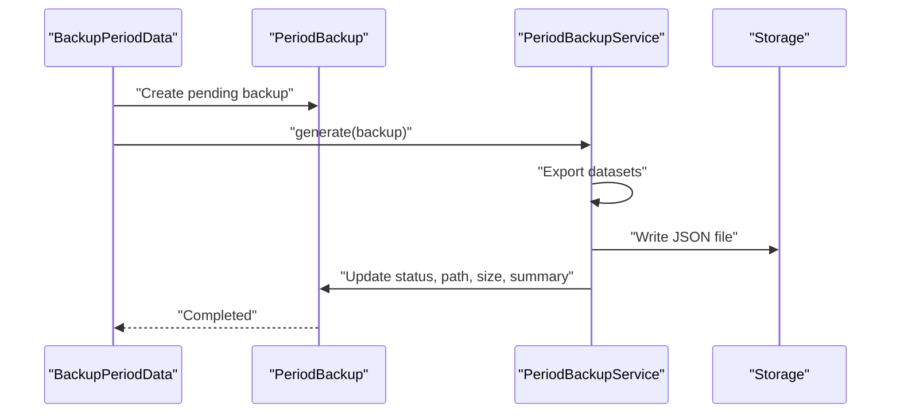
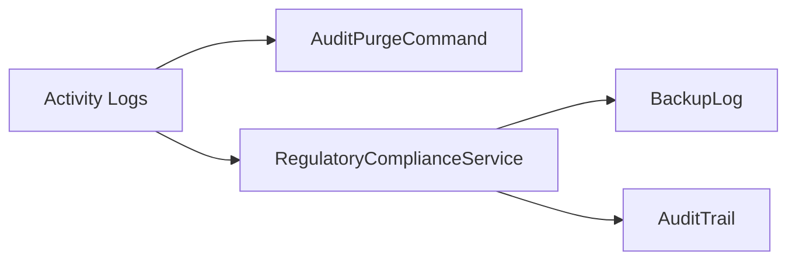
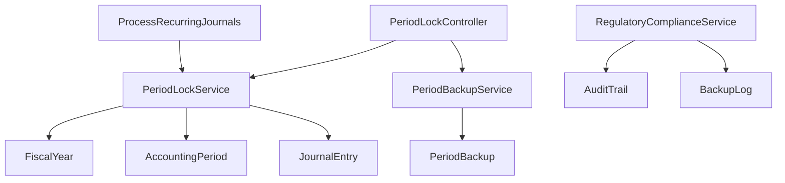

# Accounting Periods & Closing

<cite>
**Referenced Files in This Document**
- [AccountingPeriod.php](file://app/Models/AccountingPeriod.php)
- [FiscalYear.php](file://app/Models/FiscalYear.php)
- [PeriodBackup.php](file://app/Models/PeriodBackup.php)
- [PeriodLockService.php](file://app/Services/PeriodLockService.php)
- [PeriodBackupService.php](file://app/Services/PeriodBackupService.php)
- [PeriodLockController.php](file://app/Http/Controllers/PeriodLockController.php)
- [BackupPeriodData.php](file://app/Console/Commands/BackupPeriodData.php)
- [JournalEntry.php](file://app/Models/JournalEntry.php)
- [JournalController.php](file://app/Http/Controllers/JournalController.php)
- [ProcessRecurringJournals.php](file://app/Jobs/ProcessRecurringJournals.php)
- [AuditTrail.php](file://app/Models/AuditTrail.php)
- [AuditPurgeCommand.php](file://app/Console/Commands/AuditPurgeCommand.php)
- [RegulatoryComplianceService.php](file://app/Services/RegulatoryComplianceService.php)
</cite>

## Table of Contents
1. [Introduction](#introduction)
2. [Project Structure](#project-structure)
3. [Core Components](#core-components)
4. [Architecture Overview](#architecture-overview)
5. [Detailed Component Analysis](#detailed-component-analysis)
6. [Dependency Analysis](#dependency-analysis)
7. [Performance Considerations](#performance-considerations)
8. [Troubleshooting Guide](#troubleshooting-guide)
9. [Conclusion](#conclusion)
10. [Appendices](#appendices)

## Introduction
This document explains the accounting period management capabilities implemented in the system, including period creation, opening and closing procedures, fiscal year handling, and period locking. It covers period status management (open, closed, locked), validation rules, inter-period transaction restrictions, accounting cycle timing, period-end procedures, and integration with financial reporting. It also documents period locking mechanisms, audit trail preservation, and data integrity during period transitions. Finally, it includes examples of workflows and integration with automated backup and reporting systems.

## Project Structure
The accounting periods and closing functionality spans models, services, controllers, console commands, jobs, and audit/trail/logging components. The primary domain models are FiscalYear and AccountingPeriod, with supporting models for backups and audit trails. Services encapsulate period locking and backup generation logic, while controllers expose administrative UI endpoints. Console commands automate periodic backups, and jobs enforce period locks during recurring operations.

**Diagram sources**
- [FiscalYear.php:11-67](file://app/Models/FiscalYear.php#L11-L67)
- [AccountingPeriod.php:11-42](file://app/Models/AccountingPeriod.php#L11-L42)
- [JournalEntry.php:13-164](file://app/Models/JournalEntry.php#L13-L164)
- [PeriodBackup.php:10-41](file://app/Models/PeriodBackup.php#L10-L41)
- [PeriodLockService.php:24-185](file://app/Services/PeriodLockService.php#L24-L185)
- [PeriodBackupService.php:27-243](file://app/Services/PeriodBackupService.php#L27-L243)
- [PeriodLockController.php:13-176](file://app/Http/Controllers/PeriodLockController.php#L13-L176)
- [BackupPeriodData.php:10-79](file://app/Console/Commands/BackupPeriodData.php#L10-L79)
- [ProcessRecurringJournals.php:16-35](file://app/Jobs/ProcessRecurringJournals.php#L16-L35)
- [AuditTrail.php:8-245](file://app/Models/AuditTrail.php#L8-L245)

**Section sources**
- [FiscalYear.php:11-67](file://app/Models/FiscalYear.php#L11-L67)
- [AccountingPeriod.php:11-42](file://app/Models/AccountingPeriod.php#L11-L42)
- [PeriodLockService.php:24-185](file://app/Services/PeriodLockService.php#L24-L185)
- [PeriodBackupService.php:27-243](file://app/Services/PeriodBackupService.php#L27-L243)
- [PeriodLockController.php:13-176](file://app/Http/Controllers/PeriodLockController.php#L13-L176)
- [BackupPeriodData.php:10-79](file://app/Console/Commands/BackupPeriodData.php#L10-L79)
- [ProcessRecurringJournals.php:16-35](file://app/Jobs/ProcessRecurringJournals.php#L16-L35)
- [AuditTrail.php:8-245](file://app/Models/AuditTrail.php#L8-L245)

## Core Components
- FiscalYear: Defines fiscal year boundaries, status (open, closed, locked), and relationships to periods. Provides date containment and lock-check logic.
- AccountingPeriod: Represents monthly accounting periods within a fiscal year, with status and relationships to journal entries.
- PeriodLockService: Central enforcement service that validates whether a given date falls within a locked or closed period, and performs close/lock operations for fiscal years and individual periods.
- PeriodBackupService: Exports tenant data for a date range into a structured JSON file for archival and reporting.
- PeriodBackup: Metadata model for backup records, including status, summary, and file path.
- PeriodLockController: Administrative endpoints to manage fiscal years, periods, and backups.
- BackupPeriodData: CLI command to automatically generate monthly/yearly backups for tenants.
- JournalEntry: Enforces balanced postings and integrates with period selection and reversal logic.
- AuditTrail: Records user actions and supports compliance and audit needs.

**Section sources**
- [FiscalYear.php:11-67](file://app/Models/FiscalYear.php#L11-L67)
- [AccountingPeriod.php:11-42](file://app/Models/AccountingPeriod.php#L11-L42)
- [PeriodLockService.php:24-185](file://app/Services/PeriodLockService.php#L24-L185)
- [PeriodBackupService.php:27-243](file://app/Services/PeriodBackupService.php#L27-L243)
- [PeriodBackup.php:10-41](file://app/Models/PeriodBackup.php#L10-L41)
- [PeriodLockController.php:13-176](file://app/Http/Controllers/PeriodLockController.php#L13-L176)
- [BackupPeriodData.php:10-79](file://app/Console/Commands/BackupPeriodData.php#L10-L79)
- [JournalEntry.php:13-164](file://app/Models/JournalEntry.php#L13-L164)
- [AuditTrail.php:8-245](file://app/Models/AuditTrail.php#L8-L245)

## Architecture Overview
The system enforces period integrity through a layered approach:
- Controllers call PeriodLockService to validate dates before allowing modifications.
- FiscalYear and AccountingPeriod define the temporal boundaries and statuses.
- JournalEntry posts only when the target period is open; reversal logic selects the correct period for reversal dates.
- Backup automation generates archival snapshots for reporting and compliance.
- AuditTrail preserves immutable records of changes for compliance and forensic analysis.

**Diagram sources**
- [PeriodLockController.php:13-176](file://app/Http/Controllers/PeriodLockController.php#L13-L176)
- [PeriodLockService.php:24-185](file://app/Services/PeriodLockService.php#L24-L185)
- [FiscalYear.php:11-67](file://app/Models/FiscalYear.php#L11-L67)
- [AccountingPeriod.php:11-42](file://app/Models/AccountingPeriod.php#L11-L42)
- [JournalEntry.php:13-164](file://app/Models/JournalEntry.php#L13-L164)

## Detailed Component Analysis

### Fiscal Year Management
- Creation: FiscalYear supports creation with overlapping validation and optional automatic monthly period generation.
- Lifecycle: Supports closing (temporarily frozen) and locking (permanently frozen). Reopening is allowed only from closed state, not from locked.
- Lock detection: Provides centralized isDateLocked to check both fiscal year and period locks.

**Diagram sources**
- [PeriodLockController.php:46-78](file://app/Http/Controllers/PeriodLockController.php#L46-L78)
- [PeriodLockService.php:148-183](file://app/Services/PeriodLockService.php#L148-L183)
- [FiscalYear.php:11-67](file://app/Models/FiscalYear.php#L11-L67)

**Section sources**
- [PeriodLockController.php:46-78](file://app/Http/Controllers/PeriodLockController.php#L46-L78)
- [PeriodLockService.php:148-183](file://app/Services/PeriodLockService.php#L148-L183)
- [FiscalYear.php:11-67](file://app/Models/FiscalYear.php#L11-L67)

### Accounting Period Management
- Monthly generation: Automatically creates monthly periods within fiscal year bounds, clamping to FY limits.
- Status management: Individual periods can be locked; locked periods prevent modifications.
- Period lookup: findForDate resolves the active open period for a given date.

**Diagram sources**
- [FiscalYear.php:11-67](file://app/Models/FiscalYear.php#L11-L67)
- [AccountingPeriod.php:11-42](file://app/Models/AccountingPeriod.php#L11-L42)

**Section sources**
- [AccountingPeriod.php:11-42](file://app/Models/AccountingPeriod.php#L11-L42)
- [PeriodLockService.php:148-183](file://app/Services/PeriodLockService.php#L148-L183)
- [FiscalYear.php:11-67](file://app/Models/FiscalYear.php#L11-L67)

### Period Locking Enforcement
- Central assertion: PeriodLockService.assertNotLocked throws a validation error if the date is inside a locked or closed period.
- Lock info: getLockInfo returns human-readable context (e.g., “Fiscal Year FY2025” or “Period Jan 2025 (locked)”).
- Close/lock operations: closeFiscalYear and lockFiscalYear update all contained open periods and the fiscal year itself.
- Single period lock: lockPeriod updates a single period’s status.

**Diagram sources**
- [PeriodLockService.php:24-185](file://app/Services/PeriodLockService.php#L24-L185)

**Section sources**
- [PeriodLockService.php:24-185](file://app/Services/PeriodLockService.php#L24-L185)

### Journal Posting and Period Integrity
- Posting validation: JournalEntry.post validates balance and minimum debit/credit presence before posting.
- Period assignment: JournalEntry.reverse selects the correct period for reversal dates using findForDate.
- Controller guard: JournalController checks period lock before posting to prevent post-closing modifications.

**Diagram sources**
- [JournalController.php:135-152](file://app/Http/Controllers/JournalController.php#L135-L152)
- [PeriodLockService.php:43-46](file://app/Services/PeriodLockService.php#L43-L46)
- [JournalEntry.php:108-118](file://app/Models/JournalEntry.php#L108-L118)

**Section sources**
- [JournalEntry.php:65-118](file://app/Models/JournalEntry.php#L65-L118)
- [JournalController.php:135-152](file://app/Http/Controllers/JournalController.php#L135-L152)
- [ProcessRecurringJournals.php:33-35](file://app/Jobs/ProcessRecurringJournals.php#L33-L35)

### Backup and Reporting Integration
- On-demand backups: PeriodLockController.createBackup initiates a backup record and invokes PeriodBackupService.generate synchronously (can be queued in production).
- Automated backups: BackupPeriodData CLI creates monthly/yearly backups for active tenants, skipping duplicates.
- Backup data: PeriodBackupService exports sales orders, invoices, purchase orders, journal entries, transactions, stock movements, payroll runs, customers, and products for a date range.
- Backup metadata: PeriodBackup tracks status, file path, size, and summary counts.

**Diagram sources**
- [BackupPeriodData.php:18-79](file://app/Console/Commands/BackupPeriodData.php#L18-L79)
- [PeriodBackup.php:10-41](file://app/Models/PeriodBackup.php#L10-L41)
- [PeriodBackupService.php:32-92](file://app/Services/PeriodBackupService.php#L32-L92)
- [PeriodLockController.php:127-150](file://app/Http/Controllers/PeriodLockController.php#L127-L150)

**Section sources**
- [PeriodLockController.php:127-150](file://app/Http/Controllers/PeriodLockController.php#L127-L150)
- [BackupPeriodData.php:18-79](file://app/Console/Commands/BackupPeriodData.php#L18-L79)
- [PeriodBackupService.php:27-243](file://app/Services/PeriodBackupService.php#L27-L243)
- [PeriodBackup.php:10-41](file://app/Models/PeriodBackup.php#L10-L41)

### Audit Trail Preservation and Compliance
- AuditTrail captures user actions with rich metadata, including HIPAA relevance and risk levels.
- AuditPurgeCommand purges old entries beyond retention, optionally including compliance-held entries.
- RegulatoryComplianceService verifies backup and audit controls for compliance checks.

**Diagram sources**
- [AuditTrail.php:8-245](file://app/Models/AuditTrail.php#L8-L245)
- [AuditPurgeCommand.php:8-37](file://app/Console/Commands/AuditPurgeCommand.php#L8-L37)
- [RegulatoryComplianceService.php:462-467](file://app/Services/RegulatoryComplianceService.php#L462-L467)

**Section sources**
- [AuditTrail.php:8-245](file://app/Models/AuditTrail.php#L8-L245)
- [AuditPurgeCommand.php:8-37](file://app/Console/Commands/AuditPurgeCommand.php#L8-L37)
- [RegulatoryComplianceService.php:462-467](file://app/Services/RegulatoryComplianceService.php#L462-L467)

## Dependency Analysis
- Controllers depend on services for business logic (PeriodLockService, PeriodBackupService).
- Services depend on models for persistence and queries (FiscalYear, AccountingPeriod, JournalEntry, PeriodBackup).
- Jobs depend on services to enforce period locks during automated tasks.
- AuditTrail underpins compliance and regulatory checks.

**Diagram sources**
- [PeriodLockController.php:13-176](file://app/Http/Controllers/PeriodLockController.php#L13-L176)
- [PeriodLockService.php:24-185](file://app/Services/PeriodLockService.php#L24-L185)
- [PeriodBackupService.php:27-243](file://app/Services/PeriodBackupService.php#L27-L243)
- [ProcessRecurringJournals.php:16-35](file://app/Jobs/ProcessRecurringJournals.php#L16-L35)
- [AuditTrail.php:8-245](file://app/Models/AuditTrail.php#L8-L245)

**Section sources**
- [PeriodLockController.php:13-176](file://app/Http/Controllers/PeriodLockController.php#L13-L176)
- [PeriodLockService.php:24-185](file://app/Services/PeriodLockService.php#L24-L185)
- [PeriodBackupService.php:27-243](file://app/Services/PeriodBackupService.php#L27-L243)
- [ProcessRecurringJournals.php:16-35](file://app/Jobs/ProcessRecurringJournals.php#L16-L35)
- [AuditTrail.php:8-245](file://app/Models/AuditTrail.php#L8-L245)

## Performance Considerations
- Period generation: Monthly period creation iterates across the fiscal year; batching and indexing on tenant_id, start_date, and end_date improve performance.
- Backup generation: Exporting large datasets to JSON can be memory-intensive; consider streaming or chunked writes for very large tenants.
- Lock checks: isDateLocked queries are straightforward but should leverage appropriate database indexes on tenant_id and date ranges.
- Journal posting: validateBalance is lightweight but avoid repeated checks by gating posting with period lock assertions.

## Troubleshooting Guide
- Error: “Period already locked”
  - Cause: Attempting to modify data in a locked or closed period.
  - Resolution: Use a date within an open period or unlock/reopen the fiscal year/period as appropriate.
  - Evidence: PeriodLockService.assertNotLocked and getLockInfo.
- Error: “Journal not balanced”
  - Cause: Debit does not equal credit or missing debit/credit lines.
  - Resolution: Adjust journal lines to balance and ensure at least one debit and one credit.
  - Evidence: JournalEntry.validateBalance and post.
- Error: “Cannot reopen locked fiscal year”
  - Cause: lockFiscalYear was used instead of closeFiscalYear.
  - Resolution: Only reopen from closed state.
  - Evidence: PeriodLockService.reopenFiscalYear.
- Backup failure
  - Cause: Export errors or storage issues.
  - Resolution: Inspect error_message on PeriodBackup and retry; ensure storage permissions and disk space.
  - Evidence: PeriodBackupService.generate and PeriodLockController.downloadBackup.

**Section sources**
- [PeriodLockService.php:24-185](file://app/Services/PeriodLockService.php#L24-L185)
- [JournalEntry.php:83-118](file://app/Models/JournalEntry.php#L83-L118)
- [PeriodLockController.php:100-111](file://app/Http/Controllers/PeriodLockController.php#L100-L111)
- [PeriodBackupService.php:82-89](file://app/Services/PeriodBackupService.php#L82-L89)
- [PeriodLockController.php:152-161](file://app/Http/Controllers/PeriodLockController.php#L152-L161)

## Conclusion
The system provides robust accounting period management with clear separation of concerns:
- FiscalYear and AccountingPeriod define the temporal structure.
- PeriodLockService centralizes enforcement and lifecycle operations.
- JournalEntry ensures data integrity through balanced postings and period-aware reversals.
- PeriodBackupService and CLI automation support archival and reporting.
- AuditTrail and compliance services preserve auditability and enforce retention policies.

Together, these components enable secure, auditable, and compliant period transitions and reporting.

## Appendices

### Period Management Workflows

- Create Fiscal Year and Monthly Periods
  - Steps: Create FiscalYear → Optionally auto-generate monthly periods → Verify open periods.
  - Evidence: PeriodLockController.storeFiscalYear, PeriodLockService.generateMonthlyPeriods.

- Close and Lock Fiscal Year
  - Steps: Close fiscal year (temporary freeze) → Lock fiscal year (permanent freeze).
  - Evidence: PeriodLockController.closeFiscalYear, PeriodLockController.lockFiscalYear, PeriodLockService.closeFiscalYear, PeriodLockService.lockFiscalYear.

- Lock Individual Period
  - Steps: Select period → Lock period.
  - Evidence: PeriodLockController.lockPeriod, PeriodLockService.lockPeriod.

- Post Journal with Period Guard
  - Steps: Validate date not locked → Post journal → Record activity.
  - Evidence: JournalController.post, PeriodLockService.isLocked, JournalEntry.post.

- Automated Monthly Backup
  - Steps: CLI runs BackupPeriodData → Creates PeriodBackup → Generates JSON → Stores file.
  - Evidence: BackupPeriodData.handle, PeriodBackupService.generate, PeriodLockController.createBackup.

- Backup Download and Cleanup
  - Steps: Download completed backup → Delete backup file and record.
  - Evidence: PeriodLockController.downloadBackup, PeriodLockController.destroyBackup.

**Section sources**
- [PeriodLockController.php:46-111](file://app/Http/Controllers/PeriodLockController.php#L46-L111)
- [PeriodLockService.php:75-143](file://app/Services/PeriodLockService.php#L75-L143)
- [JournalController.php:135-152](file://app/Http/Controllers/JournalController.php#L135-L152)
- [JournalEntry.php:108-118](file://app/Models/JournalEntry.php#L108-L118)
- [BackupPeriodData.php:18-79](file://app/Console/Commands/BackupPeriodData.php#L18-L79)
- [PeriodBackupService.php:32-92](file://app/Services/PeriodBackupService.php#L32-L92)
- [PeriodLockController.php:127-174](file://app/Http/Controllers/PeriodLockController.php#L127-L174)