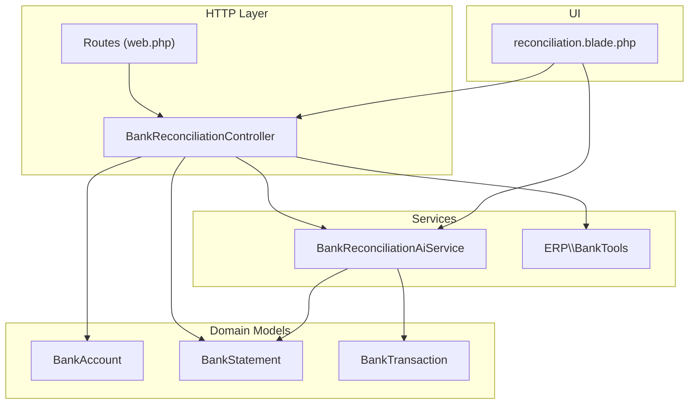
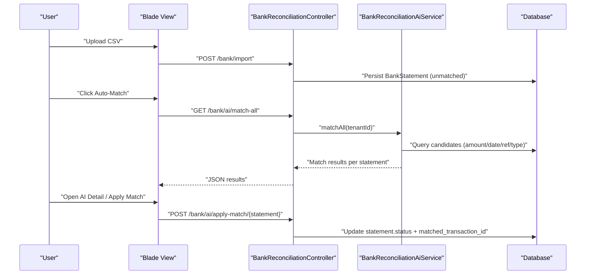
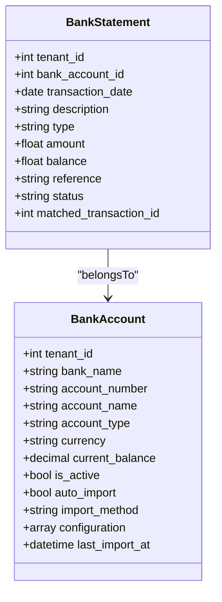
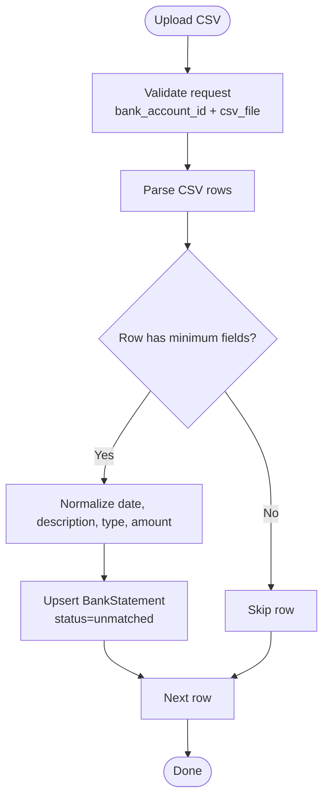
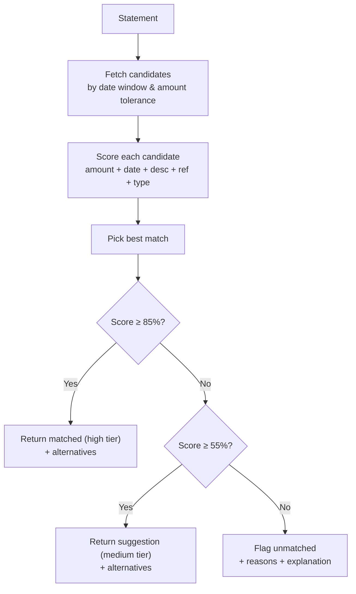
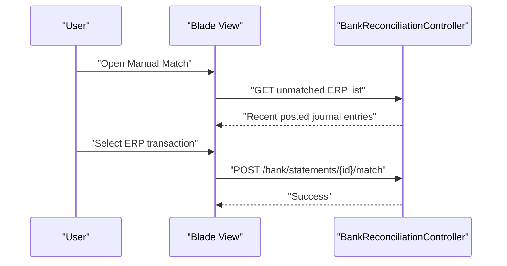
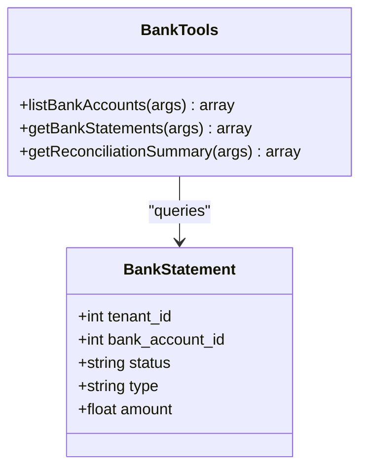
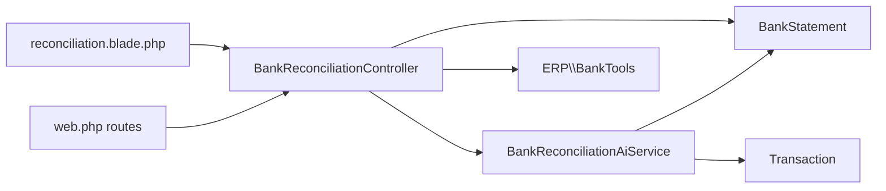

# Bank Reconciliation

<cite>
**Referenced Files in This Document**
- [BankReconciliationController.php](file://app/Http/Controllers/BankReconciliationController.php)
- [BankReconciliationAiService.php](file://app/Services/BankReconciliationAiService.php)
- [BankTools.php](file://app/Services/ERP/BankTools.php)
- [BankAccount.php](file://app/Models/BankAccount.php)
- [BankStatement.php](file://app/Models/BankStatement.php)
- [BankTransaction.php](file://app/Models/BankTransaction.php)
- [reconciliation.blade.php](file://resources/views/bank/reconciliation.blade.php)
- [web.php](file://routes/web.php)
- [TenantDemoSeeder.php](file://database/seeders/TenantDemoSeeder.php)
</cite>

## Table of Contents
1. [Introduction](#introduction)
2. [Project Structure](#project-structure)
3. [Core Components](#core-components)
4. [Architecture Overview](#architecture-overview)
5. [Detailed Component Analysis](#detailed-component-analysis)
6. [Dependency Analysis](#dependency-analysis)
7. [Performance Considerations](#performance-considerations)
8. [Troubleshooting Guide](#troubleshooting-guide)
9. [Conclusion](#conclusion)
10. [Appendices](#appendices)

## Introduction
This document explains the bank reconciliation functionality in the system, focusing on bank account management, statement import, automatic transaction matching, manual adjustments, and reconciliation workflows. It covers outstanding items awareness, unreconciled tracking, and integration touchpoints with cash management and payment processing. The goal is to help both technical and non-technical users understand how to set up bank accounts, import statements, leverage AI-powered matching, resolve mismatches, and produce reconciliation insights.

## Project Structure
The bank reconciliation feature spans controllers, services, models, Blade views, and routing. The primary entry points are:
- Web routes under the “bank” namespace
- A controller orchestrating reconciliation actions
- An AI service scoring candidate matches
- A tools service exposing reconciliation summaries
- Blade templates rendering the reconciliation dashboard and modals
- Domain models representing bank accounts, statements, and transactions

**Diagram sources**
- [web.php:487-496](file://routes/web.php#L487-L496)
- [BankReconciliationController.php:11-154](file://app/Http/Controllers/BankReconciliationController.php#L11-L154)
- [BankReconciliationAiService.php:10-272](file://app/Services/BankReconciliationAiService.php#L10-L272)
- [BankTools.php:8-76](file://app/Services/ERP/BankTools.php#L8-L76)
- [BankAccount.php:10-46](file://app/Models/BankAccount.php#L10-L46)
- [BankStatement.php:9-22](file://app/Models/BankStatement.php#L9-L22)
- [BankTransaction.php:10-57](file://app/Models/BankTransaction.php#L10-L57)
- [reconciliation.blade.php:1-469](file://resources/views/bank/reconciliation.blade.php#L1-L469)

**Section sources**
- [web.php:487-496](file://routes/web.php#L487-L496)
- [BankReconciliationController.php:15-154](file://app/Http/Controllers/BankReconciliationController.php#L15-L154)
- [BankReconciliationAiService.php:10-272](file://app/Services/BankReconciliationAiService.php#L10-L272)
- [BankTools.php:8-76](file://app/Services/ERP/BankTools.php#L8-L76)
- [BankAccount.php:10-46](file://app/Models/BankAccount.php#L10-L46)
- [BankStatement.php:9-22](file://app/Models/BankStatement.php#L9-L22)
- [BankTransaction.php:10-57](file://app/Models/BankTransaction.php#L10-L57)
- [reconciliation.blade.php:1-469](file://resources/views/bank/reconciliation.blade.php#L1-L469)

## Core Components
- Bank account management: CRUD and activation controls for bank accounts, including import configuration and balances.
- Statement import: CSV upload parser that creates unmatched bank statements.
- Automatic matching: AI scoring engine that compares statements to ERP transactions using amount tolerance, date window, description similarity, reference matching, and type consistency.
- Manual matching: UI-driven selection of ERP transactions for unmatched statements.
- Reconciliation summary: Dashboard statistics and filters for matched/unmatched counts and totals.
- Outstanding items awareness: AI flags and explanations for low-confidence matches and unusual conditions.

**Section sources**
- [BankAccount.php:14-35](file://app/Models/BankAccount.php#L14-L35)
- [BankStatement.php:12-17](file://app/Models/BankStatement.php#L12-L17)
- [BankReconciliationController.php:88-121](file://app/Http/Controllers/BankReconciliationController.php#L88-L121)
- [BankReconciliationAiService.php:22-97](file://app/Services/BankReconciliationAiService.php#L22-L97)
- [reconciliation.blade.php:66-110](file://resources/views/bank/reconciliation.blade.php#L66-L110)

## Architecture Overview
The reconciliation workflow integrates UI, backend, and AI services:
- Users import CSV statements via the reconciliation page.
- The controller parses and persists unmatched statements.
- The AI service scans ERP transactions to propose matches.
- Users confirm matches (automatic or manual).
- The dashboard updates matched/unmatched counts and highlights outstanding items.

**Diagram sources**
- [reconciliation.blade.php:266-317](file://resources/views/bank/reconciliation.blade.php#L266-L317)
- [BankReconciliationController.php:132-152](file://app/Http/Controllers/BankReconciliationController.php#L132-L152)
- [BankReconciliationAiService.php:75-97](file://app/Services/BankReconciliationAiService.php#L75-L97)

**Section sources**
- [BankReconciliationController.php:88-152](file://app/Http/Controllers/BankReconciliationController.php#L88-L152)
- [BankReconciliationAiService.php:22-97](file://app/Services/BankReconciliationAiService.php#L22-L97)
- [reconciliation.blade.php:266-317](file://resources/views/bank/reconciliation.blade.php#L266-L317)

## Detailed Component Analysis

### Bank Account Management
- Purpose: Maintain company bank accounts, enable/disable, track balances, and configure import preferences.
- Key attributes: bank name, account number/name, type, currency, current balance, active flag, auto-import, import method, configuration, last import timestamp.
- Integration: Used by reconciliation to filter statements by account and by tools service for summaries.

**Diagram sources**
- [BankAccount.php:14-35](file://app/Models/BankAccount.php#L14-L35)
- [BankStatement.php:12-17](file://app/Models/BankStatement.php#L12-L17)

**Section sources**
- [BankAccount.php:14-35](file://app/Models/BankAccount.php#L14-L35)
- [BankStatement.php:12-17](file://app/Models/BankStatement.php#L12-L17)

### Statement Import and Upload
- Supported format: CSV with columns for date, description, type (debit/credit), amount.
- Validation: Requires bank account and CSV file; enforces MIME types and size limits.
- Persistence: Creates BankStatement records with status “unmatched” and inferred type.

**Diagram sources**
- [BankReconciliationController.php:88-121](file://app/Http/Controllers/BankReconciliationController.php#L88-L121)

**Section sources**
- [BankReconciliationController.php:88-121](file://app/Http/Controllers/BankReconciliationController.php#L88-L121)

### Automatic Transaction Matching Algorithm
- Candidate fetch: Filters ERP transactions within a date window and amount tolerance, excluding already matched transactions.
- Scoring factors:
  - Amount match (up to 40 points)
  - Date proximity (up to 30 points)
  - Description similarity (up to 20 points)
  - Reference match (up to 10 points)
  - Type consistency (bonus/penalty)
- Confidence tiers: High (≥ 85%), Medium (≥ 55%), Low (< 55%).
- Alternatives: Returns top 2 alternative candidates for medium-tier matches.
- Flags and explanations: Provides diagnostic reasons when no good match is found.

**Diagram sources**
- [BankReconciliationAiService.php:22-97](file://app/Services/BankReconciliationAiService.php#L22-L97)
- [BankReconciliationAiService.php:101-125](file://app/Services/BankReconciliationAiService.php#L101-L125)
- [BankReconciliationAiService.php:127-192](file://app/Services/BankReconciliationAiService.php#L127-L192)
- [BankReconciliationAiService.php:218-270](file://app/Services/BankReconciliationAiService.php#L218-L270)

**Section sources**
- [BankReconciliationAiService.php:12-16](file://app/Services/BankReconciliationAiService.php#L12-L16)
- [BankReconciliationAiService.php:101-125](file://app/Services/BankReconciliationAiService.php#L101-L125)
- [BankReconciliationAiService.php:127-192](file://app/Services/BankReconciliationAiService.php#L127-L192)
- [BankReconciliationAiService.php:218-270](file://app/Services/BankReconciliationAiService.php#L218-L270)

### Manual Adjustment and UI
- Manual match modal lists recent posted journal entries linked to cash/bank accounts for selection.
- Users can apply a manual match via a form submission.
- Auto-match batch applies high-confidence matches automatically and updates UI cells.

**Diagram sources**
- [reconciliation.blade.php:228-264](file://resources/views/bank/reconciliation.blade.php#L228-L264)
- [BankReconciliationController.php:123-128](file://app/Http/Controllers/BankReconciliationController.php#L123-L128)

**Section sources**
- [reconciliation.blade.php:228-264](file://resources/views/bank/reconciliation.blade.php#L228-L264)
- [BankReconciliationController.php:57-83](file://app/Http/Controllers/BankReconciliationController.php#L57-L83)

### Reconciliation Summary and Reporting
- Dashboard provides:
  - Total statements, matched, unmatched counts
  - Credit/debit totals
  - Filters by account, status, and date range
- Tools service exposes:
  - List of bank accounts
  - Bank statements with optional status filter
  - Reconciliation summary (matched/unmatched counts and totals)

**Diagram sources**
- [BankTools.php:47-76](file://app/Services/ERP/BankTools.php#L47-L76)
- [BankStatement.php:12-17](file://app/Models/BankStatement.php#L12-L17)

**Section sources**
- [BankTools.php:47-76](file://app/Services/ERP/BankTools.php#L47-L76)
- [BankReconciliationController.php:43-55](file://app/Http/Controllers/BankReconciliationController.php#L43-L55)

### Outstanding Checks, Deposits in Transit, Fees, and Tracking
- Outstanding checks and deposits in transit are not modeled as separate entities in the provided code. The reconciliation interface focuses on matched/unmatched status and AI diagnostics. If needed, these can be tracked externally or extended by adding dedicated fields to BankStatement or introducing new models.
- Bank fees are not explicitly handled in the reconciliation module. They can be imported as regular statements or recorded as expenses/journal entries and later matched.

[No sources needed since this section synthesizes observations from the documented components]

## Dependency Analysis
- Controller depends on:
  - BankReconciliationAiService for AI matching
  - BankTools for summaries and account listings
  - Models for persistence and relations
- AI service depends on:
  - BankStatement for input
  - Transaction for candidate matching
- UI depends on:
  - Controller endpoints for data and actions
  - Routes under the “bank” namespace

**Diagram sources**
- [BankReconciliationController.php:13-154](file://app/Http/Controllers/BankReconciliationController.php#L13-L154)
- [BankReconciliationAiService.php:10-272](file://app/Services/BankReconciliationAiService.php#L10-L272)
- [BankTools.php:8-76](file://app/Services/ERP/BankTools.php#L8-L76)
- [web.php:487-496](file://routes/web.php#L487-L496)

**Section sources**
- [BankReconciliationController.php:13-154](file://app/Http/Controllers/BankReconciliationController.php#L13-L154)
- [BankReconciliationAiService.php:10-272](file://app/Services/BankReconciliationAiService.php#L10-L272)
- [BankTools.php:8-76](file://app/Services/ERP/BankTools.php#L8-L76)
- [web.php:487-496](file://routes/web.php#L487-L496)

## Performance Considerations
- Candidate fetching uses date and amount windows with a limit to constrain search space.
- Scoring is vectorized via collection mapping and sorting; keep candidate limits reasonable.
- UI polling for AI results should be throttled to avoid excessive requests.
- Consider indexing on BankStatement (tenant_id, bank_account_id, status, transaction_date) and Transaction (tenant_id, date, amount) for faster queries.

[No sources needed since this section provides general guidance]

## Troubleshooting Guide
Common issues and resolutions:
- No candidates found:
  - Cause: Amount/date mismatch or missing ERP transaction.
  - Resolution: Verify posting of related journal entries; adjust date/amount tolerance if appropriate.
- Low confidence match:
  - Cause: Partially matching description or reference.
  - Resolution: Manually review alternatives or refine description/reference.
- Weekend or large debits flagged:
  - Cause: Weekend transaction or high-value transaction requiring extra scrutiny.
  - Resolution: Review flags and confirm match manually.
- Import errors:
  - Cause: Incorrect CSV format or missing required fields.
  - Resolution: Ensure CSV contains date, description, type, amount and use supported MIME types.

**Section sources**
- [BankReconciliationAiService.php:218-270](file://app/Services/BankReconciliationAiService.php#L218-L270)
- [BankReconciliationController.php:88-121](file://app/Http/Controllers/BankReconciliationController.php#L88-L121)

## Conclusion
The bank reconciliation module provides a robust foundation for importing statements, auto-matching via AI, and manual resolution. It offers clear dashboards, filters, and diagnostic feedback to support accurate reconciliation. Extending the system to track outstanding checks/deposits in transit or integrate bank fees would further enhance the reconciliation lifecycle.

[No sources needed since this section summarizes without analyzing specific files]

## Appendices

### Example Reconciliation Procedures
- Setup:
  - Create and activate bank accounts.
  - Configure import settings if applicable.
- Import:
  - Upload CSV statements; verify unmatched records appear.
- Match:
  - Run Auto-Match to apply high-confidence matches.
  - Review flagged or suggested matches; apply manual matches as needed.
- Report:
  - Use filters to review matched/unmatched totals and variance.
- Variance Investigation:
  - Investigate flagged statements and reconcile differences by adjusting ERP entries or adding missing transactions.

**Section sources**
- [BankReconciliationController.php:88-121](file://app/Http/Controllers/BankReconciliationController.php#L88-L121)
- [BankReconciliationAiService.php:22-97](file://app/Services/BankReconciliationAiService.php#L22-L97)
- [reconciliation.blade.php:66-110](file://resources/views/bank/reconciliation.blade.php#L66-L110)

### Integration with Cash Management and Payments
- Cash/bank accounts are represented by chart of accounts codes; unmatched ERP entries are surfaced for manual matching.
- Payment processing integrations exist separately (e.g., Xendit connector), but reconciliation focuses on imported bank statements and ERP journal entries.

**Section sources**
- [BankReconciliationController.php:57-83](file://app/Http/Controllers/BankReconciliationController.php#L57-L83)

### Demo Data References
- Seed script inserts sample bank accounts and statements with mixed matched/unmatched statuses for demonstration.

**Section sources**
- [TenantDemoSeeder.php:1084-1106](file://database/seeders/TenantDemoSeeder.php#L1084-L1106)