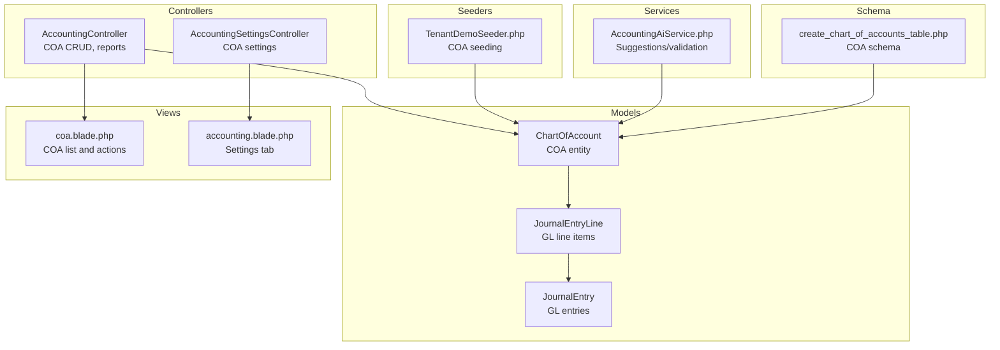
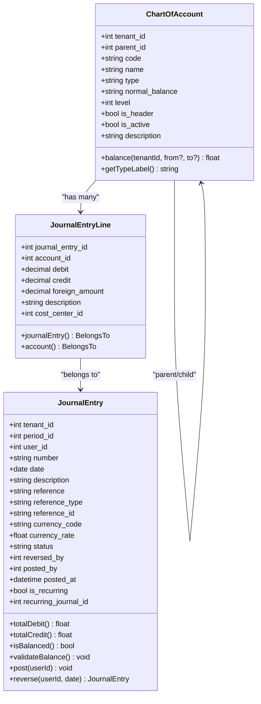
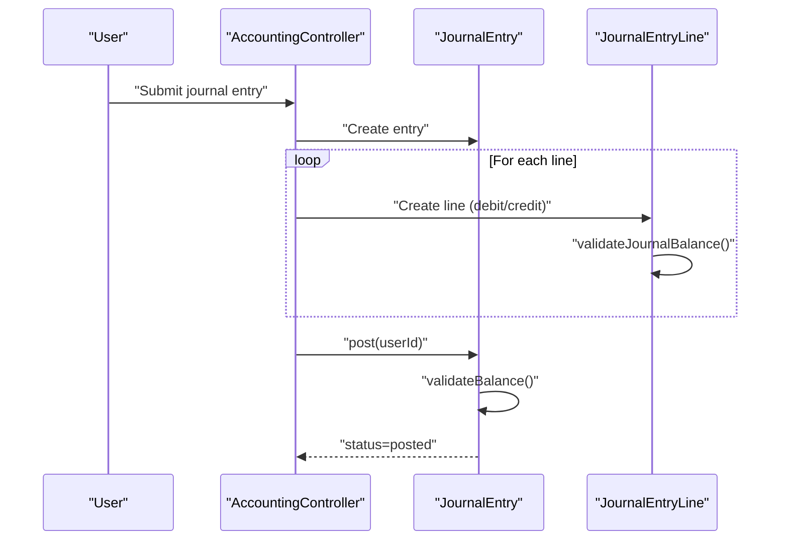
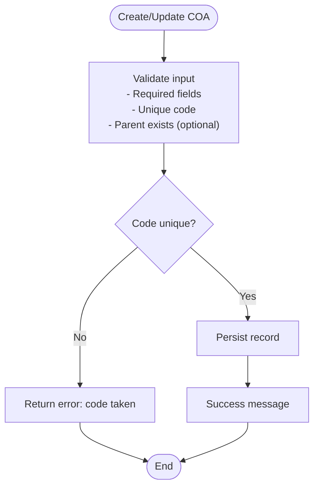
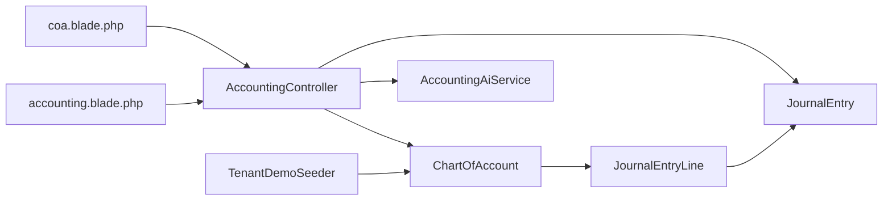

# Chart of Accounts Management

<cite>
**Referenced Files in This Document**
- [ChartOfAccount.php](file://app/Models/ChartOfAccount.php)
- [create_chart_of_accounts_table.php](file://database/migrations/2026_03_23_000027_create_chart_of_accounts_table.php)
- [JournalEntry.php](file://app/Models/JournalEntry.php)
- [JournalEntryLine.php](file://app/Models/JournalEntryLine.php)
- [AccountingController.php](file://app/Http/Controllers/AccountingController.php)
- [AccountingSettingsController.php](file://app/Http/Controllers/AccountingSettingsController.php)
- [coa.blade.php](file://resources/views/accounting/coa.blade.php)
- [accounting.blade.php](file://resources/views/settings/accounting.blade.php)
- [TenantDemoSeeder.php](file://database/seeders/TenantDemoSeeder.php)
- [TestCase.php](file://tests/TestCase.php)
- [AccountingAiService.php](file://app/Services/AccountingAiService.php)
</cite>

## Table of Contents
1. [Introduction](#introduction)
2. [Project Structure](#project-structure)
3. [Core Components](#core-components)
4. [Architecture Overview](#architecture-overview)
5. [Detailed Component Analysis](#detailed-component-analysis)
6. [Dependency Analysis](#dependency-analysis)
7. [Performance Considerations](#performance-considerations)
8. [Troubleshooting Guide](#troubleshooting-guide)
9. [Conclusion](#conclusion)
10. [Appendices](#appendices)

## Introduction
This document explains the Chart of Accounts (COA) management system in the ERP, focusing on account creation, hierarchy management, account types and classifications, and the double-entry accounting structure. It covers asset, liability, equity, revenue, and expense categories; account codes and normal balances; parent-child relationships; activation/deactivation workflows; Indonesian COA seeding; validation rules; integration with journal entries; practical examples for different business types; and the relationship between COA and financial reporting.

## Project Structure
The COA system spans models, controllers, views, migrations, seeders, and services:
- Models define the COA schema, relationships, and calculations.
- Controllers expose CRUD and operational endpoints for COA and financial reports.
- Views render COA lists, forms, and reporting pages.
- Migrations define the database schema.
- Seeders load default COA templates (including Indonesian standards).
- Services assist with AI-driven suggestions and validations.

**Diagram sources**
- [ChartOfAccount.php:14-84](file://app/Models/ChartOfAccount.php#L14-L84)
- [JournalEntry.php:13-163](file://app/Models/JournalEntry.php#L13-L163)
- [JournalEntryLine.php:8-90](file://app/Models/JournalEntryLine.php#L8-L90)
- [AccountingController.php:13-254](file://app/Http/Controllers/AccountingController.php#L13-L254)
- [AccountingSettingsController.php:11-115](file://app/Http/Controllers/AccountingSettingsController.php#L11-L115)
- [coa.blade.php:1-23](file://resources/views/accounting/coa.blade.php#L1-L23)
- [accounting.blade.php:72-95](file://resources/views/settings/accounting.blade.php#L72-L95)
- [create_chart_of_accounts_table.php:11-28](file://database/migrations/2026_03_23_000027_create_chart_of_accounts_table.php#L11-L28)
- [TenantDemoSeeder.php:190-250](file://database/seeders/TenantDemoSeeder.php#L190-L250)
- [AccountingAiService.php:116-135](file://app/Services/AccountingAiService.php#L116-L135)

**Section sources**
- [ChartOfAccount.php:14-84](file://app/Models/ChartOfAccount.php#L14-L84)
- [create_chart_of_accounts_table.php:11-28](file://database/migrations/2026_03_23_000027_create_chart_of_accounts_table.php#L11-L28)
- [AccountingController.php:22-102](file://app/Http/Controllers/AccountingController.php#L22-L102)
- [coa.blade.php:1-23](file://resources/views/accounting/coa.blade.php#L1-L23)
- [accounting.blade.php:72-95](file://resources/views/settings/accounting.blade.php#L72-L95)
- [TenantDemoSeeder.php:190-250](file://database/seeders/TenantDemoSeeder.php#L190-L250)
- [AccountingAiService.php:116-135](file://app/Services/AccountingAiService.php#L116-L135)

## Core Components
- ChartOfAccount model encapsulates COA records, relationships, and balance calculation.
- JournalEntry and JournalEntryLine enforce double-entry integrity.
- Controllers manage COA CRUD, activation/deactivation, and financial statements.
- Seeders provide default COA templates aligned with Indonesian standards.
- Views present COA lists, filters, and actions.

Key capabilities:
- Account creation with validation for unique codes and required fields.
- Parent-child hierarchy with optional header nodes.
- Type-based normal balance enforcement.
- Activation/deactivation workflow.
- Integration with journal entries ensuring balanced postings.
- Reporting integrations (trial balance, balance sheet, income statement, cash flow).

**Section sources**
- [ChartOfAccount.php:18-35](file://app/Models/ChartOfAccount.php#L18-L35)
- [JournalEntry.php:65-118](file://app/Models/JournalEntry.php#L65-L118)
- [JournalEntryLine.php:51-80](file://app/Models/JournalEntryLine.php#L51-L80)
- [AccountingController.php:44-96](file://app/Http/Controllers/AccountingController.php#L44-L96)
- [TenantDemoSeeder.php:190-250](file://database/seeders/TenantDemoSeeder.php#L190-L250)

## Architecture Overview
The COA architecture follows a layered design:
- Presentation: Blade views for COA management and reporting.
- Application: Controllers orchestrate requests, validations, and service calls.
- Domain: Models represent entities and enforce business rules.
- Persistence: Migrations define schema; seeders populate defaults.
- Integration: Services support AI-driven suggestions and validations.

**Diagram sources**
- [ChartOfAccount.php:14-84](file://app/Models/ChartOfAccount.php#L14-L84)
- [JournalEntryLine.php:8-90](file://app/Models/JournalEntryLine.php#L8-L90)
- [JournalEntry.php:13-163](file://app/Models/JournalEntry.php#L13-L163)

## Detailed Component Analysis

### ChartOfAccount Model
Responsibilities:
- Define fillable attributes and casts.
- Relationships: belongs to tenant, parent, children, journal lines.
- Balance computation considering normal balance and posted journal entries.
- Type label translation for Indonesian display.

Design highlights:
- Hierarchical self-referencing via parent_id with nullable cascade delete.
- Unique constraint on tenant_id + code ensures code uniqueness per tenant.
- Index on tenant_id + type supports efficient filtering by account type.

**Section sources**
- [ChartOfAccount.php:18-35](file://app/Models/ChartOfAccount.php#L18-L35)
- [ChartOfAccount.php:41-52](file://app/Models/ChartOfAccount.php#L41-L52)
- [ChartOfAccount.php:54-71](file://app/Models/ChartOfAccount.php#L54-L71)
- [ChartOfAccount.php:73-83](file://app/Models/ChartOfAccount.php#L73-L83)
- [create_chart_of_accounts_table.php:11-28](file://database/migrations/2026_03_23_000027_create_chart_of_accounts_table.php#L11-L28)

### JournalEntry and JournalEntryLine
Double-entry enforcement:
- JournalEntry computes totals and validates balance before posting.
- JournalEntryLine triggers validation on create/update/delete to warn imbalances for drafts.
- Posting requires balanced debits and credits and at least one debit and one credit line.

**Diagram sources**
- [JournalEntry.php:108-118](file://app/Models/JournalEntry.php#L108-L118)
- [JournalEntry.php:83-105](file://app/Models/JournalEntry.php#L83-L105)
- [JournalEntryLine.php:29-45](file://app/Models/JournalEntryLine.php#L29-L45)
- [JournalEntryLine.php:51-80](file://app/Models/JournalEntryLine.php#L51-L80)

**Section sources**
- [JournalEntry.php:65-118](file://app/Models/JournalEntry.php#L65-L118)
- [JournalEntryLine.php:51-80](file://app/Models/JournalEntryLine.php#L51-L80)

### COA Creation, Validation, and Activation
Endpoints and validations:
- Store COA endpoint validates required fields, unique code, and optional parent existence.
- Update COA endpoint updates name, activity status, and description.
- Deletion disallows accounts with journal lines or child accounts.
- Activation/deactivation controlled via is_active flag.

**Diagram sources**
- [AccountingController.php:44-66](file://app/Http/Controllers/AccountingController.php#L44-L66)
- [AccountingController.php:18-29](file://app/Models/ChartOfAccount.php#L18-L29)

**Section sources**
- [AccountingController.php:44-96](file://app/Http/Controllers/AccountingController.php#L44-L96)

### Hierarchy Management and Classification
- Levels: configurable numeric levels supporting headers, sub-headers, and detail accounts.
- Headers: non-postable accounts used for grouping; identified by is_header.
- Types: asset, liability, equity, revenue, expense.
- Normal balances: debit or credit determined by account type.
- Parent-child relationships: parent_id references chart_of_accounts.id with null-on-delete behavior.

Practical guidance:
- Use level 1 for major categories (headers), level 2 for subcategories, and level 3+ for detail accounts.
- Mark grouping nodes as headers to prevent posting while enabling drill-down reporting.

**Section sources**
- [create_chart_of_accounts_table.php:17-20](file://database/migrations/2026_03_23_000027_create_chart_of_accounts_table.php#L17-L20)
- [ChartOfAccount.php:41-48](file://app/Models/ChartOfAccount.php#L41-L48)

### COA Seeding for Indonesian Standards
The system includes seeded templates aligned with Indonesian accounting standards:
- Parent-child relationships defined via parent_code mapping during seeding.
- Typical categories include current assets, receivables, inventory, liabilities, taxes payable, revenues, and expenses.
- Demo seeder creates hierarchical COA for demonstration and testing.

Example categories seeded:
- Assets: cash, bank, receivables, inventory.
- Liabilities: trade payables, output VAT.
- Revenues: sales income.
- Expenses: cost of goods sold, depreciation.

**Section sources**
- [TenantDemoSeeder.php:190-250](file://database/seeders/TenantDemoSeeder.php#L190-L250)

### Integration with Journal Entries
- JournalEntryLine belongs to ChartOfAccount; each line posts to a specific account.
- Balance validation occurs at the journal level; posting fails if unbalanced.
- COA-level balances computed from posted journal lines, respecting normal balance direction.

**Section sources**
- [JournalEntryLine.php:86-89](file://app/Models/JournalEntryLine.php#L86-L89)
- [ChartOfAccount.php:54-71](file://app/Models/ChartOfAccount.php#L54-L71)
- [JournalEntry.php:83-105](file://app/Models/JournalEntry.php#L83-L105)

### AI-Assisted COA Suggestions
The AI service provides:
- Keyword-based mapping to standard Indonesian COA pairings.
- Unusual type pair warnings for journal entries.
- Bank statement categorization with confidence and basis.

These features help ensure correct account selection during journal entry creation and reconciliation.

**Section sources**
- [AccountingAiService.php:116-135](file://app/Services/AccountingAiService.php#L116-L135)
- [AccountingAiService.php:373-387](file://app/Services/AccountingAiService.php#L373-L387)
- [AccountingAiService.php:471-523](file://app/Services/AccountingAiService.php#L471-L523)

### Financial Reporting Relationships
COA underpins financial statements:
- Trial Balance: aggregates account totals for a period.
- Balance Sheet: constructs assets, liabilities, equity as of a date.
- Income Statement: computes revenues and expenses over a period.
- Cash Flow Statement: derived from ledger movements.

Controllers expose endpoints and PDF exports for these statements.

**Section sources**
- [AccountingController.php:157-188](file://app/Http/Controllers/AccountingController.php#L157-L188)
- [AccountingController.php:192-230](file://app/Http/Controllers/AccountingController.php#L192-L230)
- [AccountingController.php:234-252](file://app/Http/Controllers/AccountingController.php#L234-L252)

## Dependency Analysis
- ChartOfAccount depends on JournalEntryLine for balance computation.
- JournalEntryLine depends on JournalEntry for balance validation.
- Controllers depend on models and services for business operations.
- Seeders depend on ChartOfAccount to create hierarchical structures.
- Views depend on controllers for rendering data and actions.

**Diagram sources**
- [AccountingController.php:13-254](file://app/Http/Controllers/AccountingController.php#L13-L254)
- [ChartOfAccount.php:14-84](file://app/Models/ChartOfAccount.php#L14-L84)
- [JournalEntry.php:13-163](file://app/Models/JournalEntry.php#L13-L163)
- [JournalEntryLine.php:8-90](file://app/Models/JournalEntryLine.php#L8-L90)
- [TenantDemoSeeder.php:190-250](file://database/seeders/TenantDemoSeeder.php#L190-L250)
- [coa.blade.php:1-23](file://resources/views/accounting/coa.blade.php#L1-L23)
- [accounting.blade.php:72-95](file://resources/views/settings/accounting.blade.php#L72-L95)

**Section sources**
- [AccountingController.php:22-102](file://app/Http/Controllers/AccountingController.php#L22-L102)
- [ChartOfAccount.php:41-52](file://app/Models/ChartOfAccount.php#L41-L52)
- [JournalEntryLine.php:82-90](file://app/Models/JournalEntryLine.php#L82-L90)

## Performance Considerations
- Index on tenant_id + type accelerates filtering by account type.
- Unique index on tenant_id + code prevents duplicate codes and supports fast lookups.
- Balance computations filter only posted journal entries to avoid draft inconsistencies.
- Use level-based hierarchy to limit deep joins and improve report performance.
- Prefer batch operations for seeding large hierarchies.

[No sources needed since this section provides general guidance]

## Troubleshooting Guide
Common issues and resolutions:
- Imbalanced journal entry: Ensure equal total debit and credit; each entry must have at least one debit and one credit line.
- Cannot delete account: Remove child accounts or unlink journal lines; inactive accounts can still block deletion if used.
- Duplicate account code: Choose a unique code per tenant; validation prevents duplicates.
- Incorrect normal balance: Verify account type aligns with debit/credit normal balance expectations.
- Header accounts posting: Confirm is_header is set appropriately; header accounts are not allowed to post directly.

**Section sources**
- [JournalEntry.php:83-105](file://app/Models/JournalEntry.php#L83-L105)
- [AccountingController.php:83-96](file://app/Http/Controllers/AccountingController.php#L83-L96)
- [AccountingController.php:44-66](file://app/Http/Controllers/AccountingController.php#L44-L66)

## Conclusion
The COA module provides a robust foundation for managing chart of accounts with hierarchical structure, type-based normal balances, and strict double-entry validation. It integrates tightly with journal entries and financial reporting, supports Indonesian COA templates, and offers AI-assisted suggestions to improve accuracy and speed. Proper use of headers, levels, and activation flags ensures clean reporting and compliance.

[No sources needed since this section summarizes without analyzing specific files]

## Appendices

### Example Account Setup for Different Business Types
- Retailer:
  - Assets: cash, bank, accounts receivable, inventory.
  - Liabilities: trade payables, output VAT.
  - Revenues: sales income.
  - Expenses: cost of goods sold, operating expenses.
- Manufacturer:
  - Assets: raw materials, work-in-progress, finished goods.
  - Expenses: cost of goods sold, production overhead, depreciation.
- Service Provider:
  - Assets: cash, bank, accounts receivable.
  - Revenues: service income.
  - Expenses: cost of services, payroll, office expenses.

[No sources needed since this section provides general guidance]