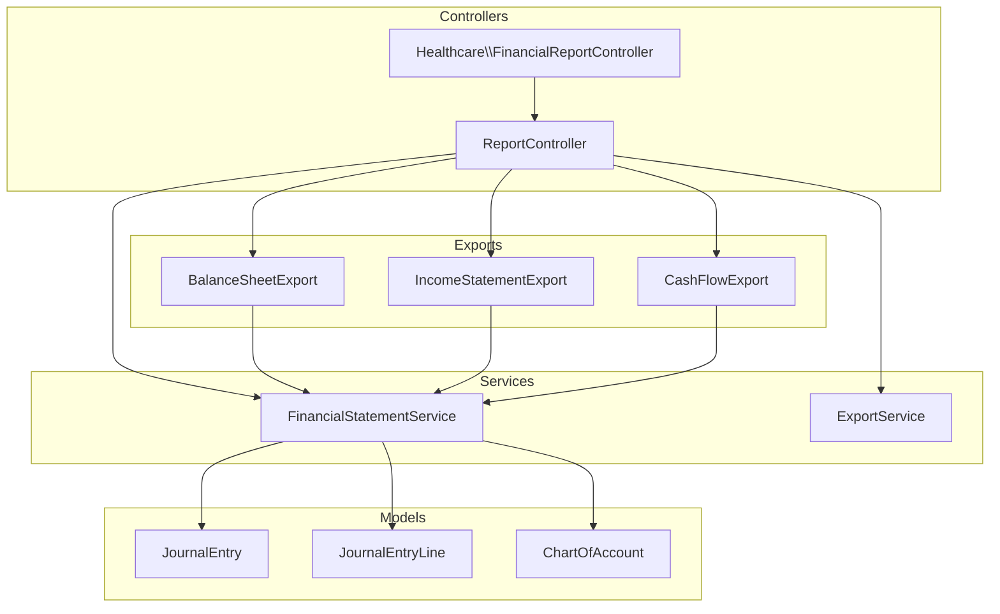
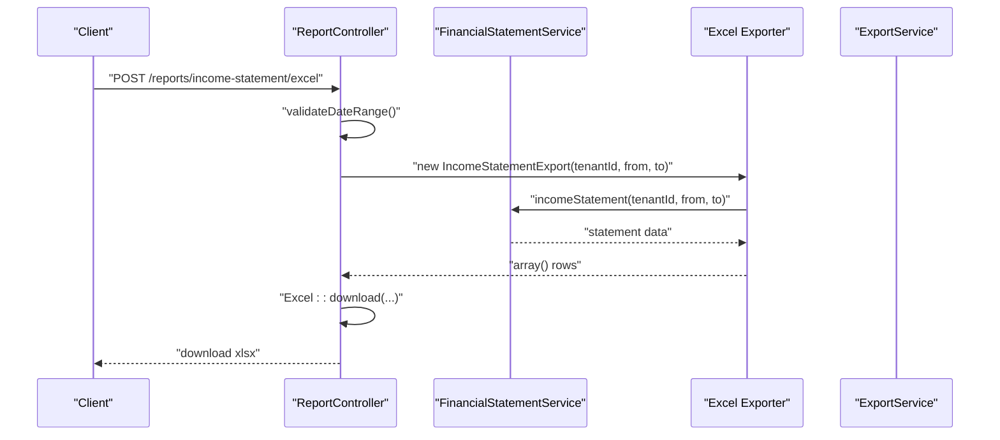
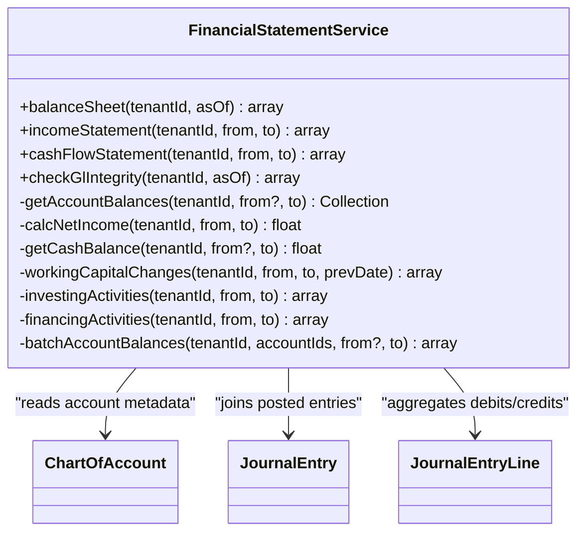
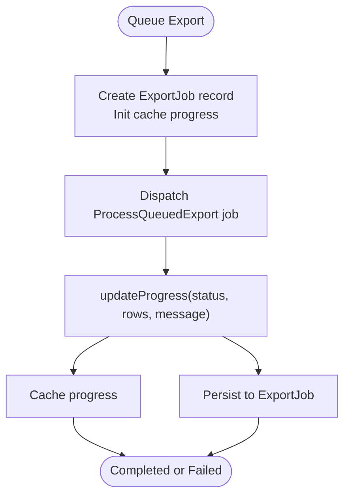
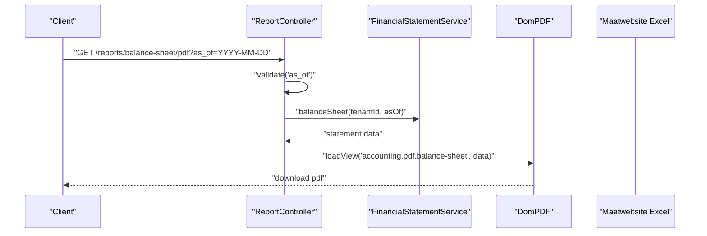
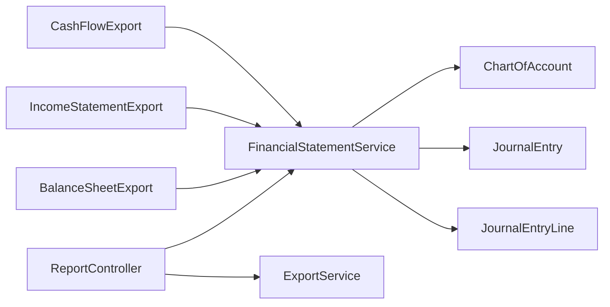

# Financial Statements & Reporting

<cite>
**Referenced Files in This Document**
- [FinancialStatementService.php](file://app/Services/FinancialStatementService.php)
- [BalanceSheetExport.php](file://app/Exports/BalanceSheetExport.php)
- [IncomeStatementExport.php](file://app/Exports/IncomeStatementExport.php)
- [CashFlowExport.php](file://app/Exports/CashFlowExport.php)
- [ExportService.php](file://app/Services/ExportService.php)
- [ReportController.php](file://app/Http/Controllers/ReportController.php)
- [JournalEntry.php](file://app/Models/JournalEntry.php)
- [JournalEntryLine.php](file://app/Models/JournalEntryLine.php)
- [ChartOfAccount.php](file://app/Models/ChartOfAccount.php)
- [FinancialReportController.php](file://app/Http/Controllers/Healthcare/FinancialReportController.php)
</cite>

## Table of Contents
1. [Introduction](#introduction)
2. [Project Structure](#project-structure)
3. [Core Components](#core-components)
4. [Architecture Overview](#architecture-overview)
5. [Detailed Component Analysis](#detailed-component-analysis)
6. [Dependency Analysis](#dependency-analysis)
7. [Performance Considerations](#performance-considerations)
8. [Troubleshooting Guide](#troubleshooting-guide)
9. [Conclusion](#conclusion)
10. [Appendices](#appendices)

## Introduction
This document explains the financial statement generation and reporting system, covering the creation of the balance sheet, income statement, and cash flow statement. It documents the service architecture, data aggregation from journal entries, formatting for exports, statement date ranges and comparative periods, PDF export functionality, validation mechanisms, drill-down capabilities, and integration with management reporting. It also includes examples of customization, multi-period comparisons, and regulatory reporting considerations.

## Project Structure
The financial reporting stack is organized around:
- A central service that computes financial statements from double-entry journal data
- Export adapters that format statements for Excel and PDF
- Controllers that orchestrate requests, validations, and downloads
- Models that define the accounting foundation (journal entries, lines, and chart of accounts)
- A robust export service supporting large-volume, queued exports

**Diagram sources**
- [ReportController.php:26-534](file://app/Http/Controllers/ReportController.php#L26-L534)
- [FinancialStatementService.php:22-435](file://app/Services/FinancialStatementService.php#L22-L435)
- [BalanceSheetExport.php:16-117](file://app/Exports/BalanceSheetExport.php#L16-L117)
- [IncomeStatementExport.php:12-86](file://app/Exports/IncomeStatementExport.php#L12-L86)
- [CashFlowExport.php:15-116](file://app/Exports/CashFlowExport.php#L15-L116)
- [ExportService.php:17-244](file://app/Services/ExportService.php#L17-L244)
- [JournalEntry.php:13-164](file://app/Models/JournalEntry.php#L13-L164)
- [JournalEntryLine.php:8-91](file://app/Models/JournalEntryLine.php#L8-L91)
- [ChartOfAccount.php:14-85](file://app/Models/ChartOfAccount.php#L14-L85)

**Section sources**
- [ReportController.php:26-534](file://app/Http/Controllers/ReportController.php#L26-L534)
- [FinancialStatementService.php:22-435](file://app/Services/FinancialStatementService.php#L22-L435)

## Core Components
- FinancialStatementService: Computes balance sheet, income statement, and cash flow statement from posted journal entries and chart of accounts. Implements integrity checks and batched queries for performance.
- Export adapters: Excel exporters for balance sheet, income statement, and cash flow statement with formatting and styling.
- ExportService: Queues large exports, tracks progress, and supports download of generated files.
- Controllers: Validate date ranges, route requests to services and exporters, and produce Excel and PDF outputs.
- Models: Define the accounting data model and enforce journal balancing.

Key responsibilities:
- Data aggregation: Uses a single aggregate query per period to compute account balances efficiently.
- Statement formatting: Provides structured rows for Excel exports and PDF templates.
- Validation: Ensures GL integrity and journal entry balance.
- Comparative periods: Supports “as of” and “from-to” periods for statements.

**Section sources**
- [FinancialStatementService.php:22-435](file://app/Services/FinancialStatementService.php#L22-L435)
- [BalanceSheetExport.php:16-117](file://app/Exports/BalanceSheetExport.php#L16-L117)
- [IncomeStatementExport.php:12-86](file://app/Exports/IncomeStatementExport.php#L12-L86)
- [CashFlowExport.php:15-116](file://app/Exports/CashFlowExport.php#L15-L116)
- [ExportService.php:17-244](file://app/Services/ExportService.php#L17-L244)
- [ReportController.php:26-534](file://app/Http/Controllers/ReportController.php#L26-L534)
- [JournalEntry.php:13-164](file://app/Models/JournalEntry.php#L13-L164)
- [JournalEntryLine.php:8-91](file://app/Models/JournalEntryLine.php#L8-L91)
- [ChartOfAccount.php:14-85](file://app/Models/ChartOfAccount.php#L14-L85)

## Architecture Overview
The system follows a layered architecture:
- Presentation: Controllers expose endpoints for exporting statements in Excel and PDF.
- Application: ExportService manages large exports with progress tracking.
- Domain: FinancialStatementService encapsulates financial computation logic.
- Persistence: Models represent journal entries, lines, and chart of accounts.

**Diagram sources**
- [ReportController.php:306-316](file://app/Http/Controllers/ReportController.php#L306-L316)
- [IncomeStatementExport.php:12-86](file://app/Exports/IncomeStatementExport.php#L12-L86)
- [FinancialStatementService.php:79-109](file://app/Services/FinancialStatementService.php#L79-L109)

## Detailed Component Analysis

### FinancialStatementService
Responsibilities:
- Balance Sheet: Aggregates account balances as of a specific date, categorizes assets/liabilities/equity, computes totals, and validates GL integrity.
- Income Statement: Computes revenues, cost of goods sold, operating expenses, and net income for a period.
- Cash Flow Statement: Applies the indirect method, computing operating cash flow from net income and working capital changes, and captures investing and financing activities.
- Data aggregation: Performs a single aggregate query across journal lines joined to posted journal entries, scoped by tenant and date ranges, then maps to chart of accounts.
- Integrity checks: Verifies total debits equal credits across posted journals and identifies unbalanced journals.

**Diagram sources**
- [FinancialStatementService.php:22-435](file://app/Services/FinancialStatementService.php#L22-L435)
- [ChartOfAccount.php:14-85](file://app/Models/ChartOfAccount.php#L14-L85)
- [JournalEntry.php:13-164](file://app/Models/JournalEntry.php#L13-L164)
- [JournalEntryLine.php:8-91](file://app/Models/JournalEntryLine.php#L8-L91)

**Section sources**
- [FinancialStatementService.php:22-435](file://app/Services/FinancialStatementService.php#L22-L435)

### Export Adapters
- BalanceSheetExport: Produces a single worksheet with assets, liabilities, equity, totals, and GL integrity status.
- IncomeStatementExport: Produces a single worksheet with revenue, COGS, gross profit, operating expenses, and net income.
- CashFlowExport: Produces a single worksheet with operating, investing, and financing sections, reconciling opening/closing cash balances.

Formatting and styling:
- Column widths tailored to content
- Bold headers and custom fills
- Right-aligned numeric values

**Section sources**
- [BalanceSheetExport.php:16-117](file://app/Exports/BalanceSheetExport.php#L16-L117)
- [IncomeStatementExport.php:12-86](file://app/Exports/IncomeStatementExport.php#L12-L86)
- [CashFlowExport.php:15-116](file://app/Exports/CashFlowExport.php#L15-L116)

### ExportService
Capabilities:
- Queues exports with UUID job identifiers
- Tracks progress in cache and persists to database
- Estimates row counts and decides whether to queue based on thresholds
- Provides download URLs upon completion and cleans up old exports

**Diagram sources**
- [ExportService.php:17-244](file://app/Services/ExportService.php#L17-L244)

**Section sources**
- [ExportService.php:17-244](file://app/Services/ExportService.php#L17-L244)

### Controllers
- ReportController: Validates date ranges, orchestrates Excel and PDF exports for financial statements, and integrates with management reporting features (cash flow projection, budget vs actual).
- Healthcare FinancialReportController: Provides departmental revenue and insurance claims analytics for healthcare reporting.

**Diagram sources**
- [ReportController.php:393-418](file://app/Http/Controllers/ReportController.php#L393-L418)

**Section sources**
- [ReportController.php:26-534](file://app/Http/Controllers/ReportController.php#L26-L534)
- [FinancialReportController.php:11-73](file://app/Http/Controllers/Healthcare/FinancialReportController.php#L11-L73)

## Dependency Analysis
- Controllers depend on FinancialStatementService and ExportService for computations and exports.
- Export adapters depend on FinancialStatementService for statement data.
- FinancialStatementService depends on ChartOfAccount, JournalEntry, and JournalEntryLine for data retrieval and integrity checks.
- ExportService depends on storage and caching for progress tracking.

**Diagram sources**
- [ReportController.php:26-534](file://app/Http/Controllers/ReportController.php#L26-L534)
- [FinancialStatementService.php:22-435](file://app/Services/FinancialStatementService.php#L22-L435)
- [BalanceSheetExport.php:16-117](file://app/Exports/BalanceSheetExport.php#L16-L117)
- [IncomeStatementExport.php:12-86](file://app/Exports/IncomeStatementExport.php#L12-L86)
- [CashFlowExport.php:15-116](file://app/Exports/CashFlowExport.php#L15-L116)
- [ChartOfAccount.php:14-85](file://app/Models/ChartOfAccount.php#L14-L85)
- [JournalEntry.php:13-164](file://app/Models/JournalEntry.php#L13-L164)
- [JournalEntryLine.php:8-91](file://app/Models/JournalEntryLine.php#L8-L91)

**Section sources**
- [ReportController.php:26-534](file://app/Http/Controllers/ReportController.php#L26-L534)
- [FinancialStatementService.php:22-435](file://app/Services/FinancialStatementService.php#L22-L435)

## Performance Considerations
- Single aggregate queries: FinancialStatementService performs a single grouped query per period to compute balances, avoiding N+1 account queries.
- Batched balances: BatchAccountBalances and batched working capital queries reduce repeated round trips.
- Tenant scoping: All queries are scoped by tenant_id to prevent cross-tenant data leakage and maintain isolation.
- Export queuing: ExportService queues large exports and tracks progress to avoid timeouts and improve UX.

[No sources needed since this section provides general guidance]

## Troubleshooting Guide
Common issues and resolutions:
- Unbalanced journals: JournalEntry.validateBalance ensures posted journals remain balanced; errors indicate invalid journal entries.
- Imbalanced drafts: JournalEntryLine boot validates journals while in draft; warnings are logged to aid correction.
- GL integrity failures: FinancialStatementService.checkGlIntegrity reports total debits/credits and unbalanced counts for diagnosis.
- Export timeouts: Use ExportService.queueExport and progress APIs to handle large exports asynchronously.

**Section sources**
- [JournalEntry.php:74-105](file://app/Models/JournalEntry.php#L74-L105)
- [JournalEntryLine.php:47-80](file://app/Models/JournalEntryLine.php#L47-L80)
- [FinancialStatementService.php:398-433](file://app/Services/FinancialStatementService.php#L398-L433)
- [ExportService.php:28-69](file://app/Services/ExportService.php#L28-L69)

## Conclusion
The financial reporting system centers on a robust FinancialStatementService that computes standardized statements from double-entry data, ensuring accuracy and integrity. Export adapters and controllers provide flexible delivery channels (Excel and PDF), while ExportService enables scalable, asynchronous processing. The architecture supports date-range reporting, comparative periods, drill-down via chart of accounts, and integration with broader management reporting.

[No sources needed since this section summarizes without analyzing specific files]

## Appendices

### Statement Date Ranges and Comparative Periods
- Balance Sheet: “As of” date aggregates balances up to that date.
- Income Statement and Cash Flow: “From-to” period computes activity over the interval.
- Controllers validate date ranges to prevent invalid inputs.

**Section sources**
- [ReportController.php:46-58](file://app/Http/Controllers/ReportController.php#L46-L58)
- [ReportController.php:395-404](file://app/Http/Controllers/ReportController.php#L395-L404)
- [ReportController.php:424-433](file://app/Http/Controllers/ReportController.php#L424-L433)

### PDF Export Functionality
- Controllers render PDFs using DomPDF with dedicated templates for balance sheet and cash flow.
- Export endpoints accept required date parameters and return downloadable PDFs.

**Section sources**
- [ReportController.php:406-418](file://app/Http/Controllers/ReportController.php#L406-L418)
- [ReportController.php:435-448](file://app/Http/Controllers/ReportController.php#L435-L448)

### Statement Validation and Drill-Down
- GL integrity: FinancialStatementService.checkGlIntegrity verifies total debits equal credits and counts unbalanced journals.
- Journal validation: JournalEntry.validateBalance and JournalEntryLine boot-time validation ensure correctness.
- Drill-down: Export adapters present line-item detail by account code/name; controllers can route to transaction-level views.

**Section sources**
- [FinancialStatementService.php:398-433](file://app/Services/FinancialStatementService.php#L398-L433)
- [JournalEntry.php:74-105](file://app/Models/JournalEntry.php#L74-L105)
- [JournalEntryLine.php:47-80](file://app/Models/JournalEntryLine.php#L47-L80)

### Examples and Customization
- Customizing statement layout: Modify export adapters to reorder sections or add notes.
- Multi-period comparisons: Compute multiple statements (e.g., month-over-month) and compare totals programmatically.
- Regulatory reporting: Use ExportService to queue large exports for compliance submissions; leverage GL integrity checks for audit trails.

**Section sources**
- [BalanceSheetExport.php:39-96](file://app/Exports/BalanceSheetExport.php#L39-L96)
- [IncomeStatementExport.php:33-83](file://app/Exports/IncomeStatementExport.php#L33-L83)
- [CashFlowExport.php:40-95](file://app/Exports/CashFlowExport.php#L40-L95)
- [ExportService.php:167-187](file://app/Services/ExportService.php#L167-L187)