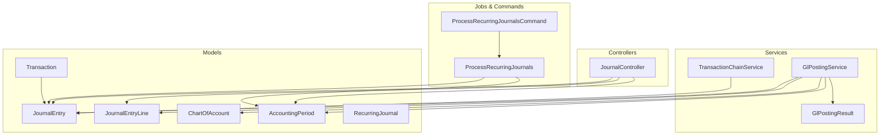
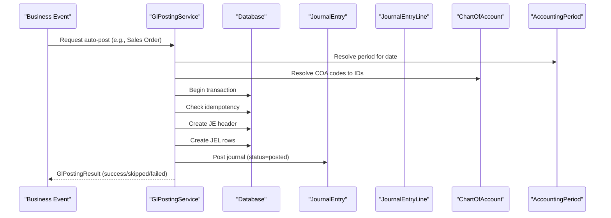
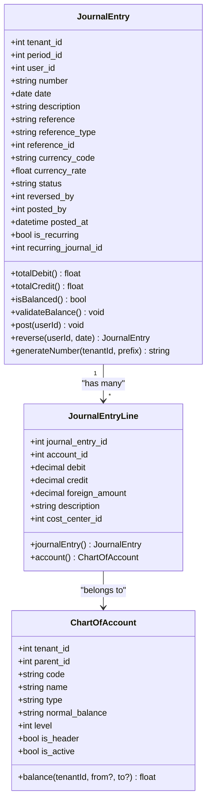
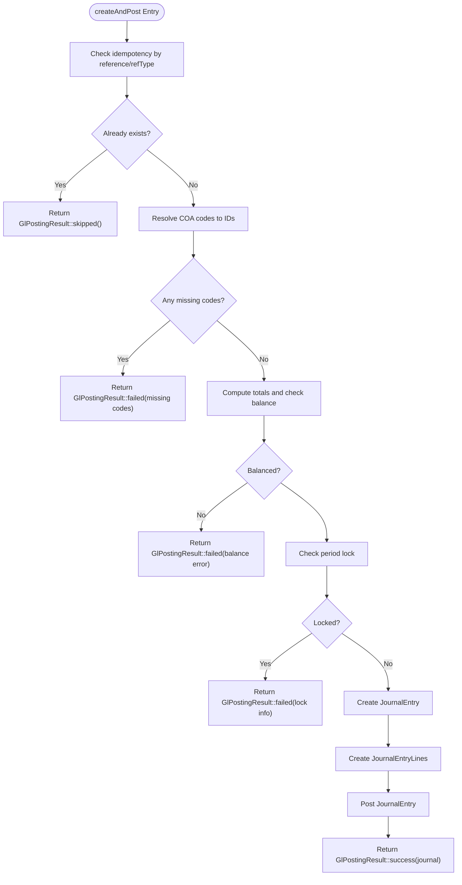
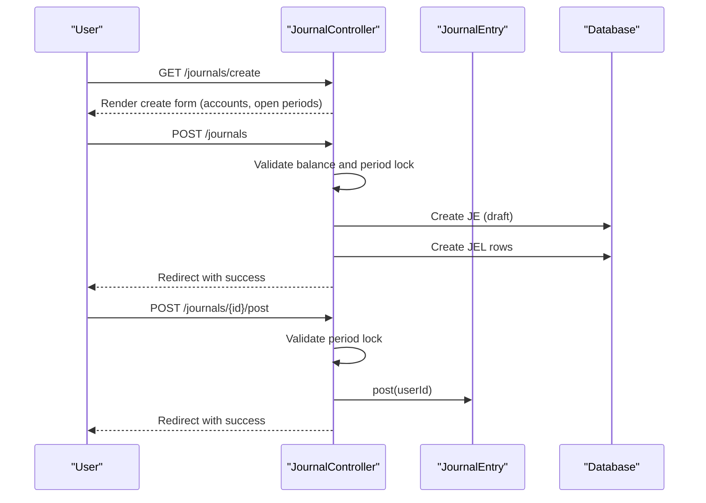
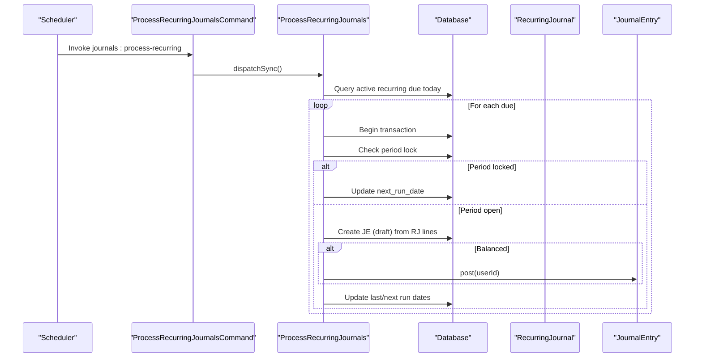
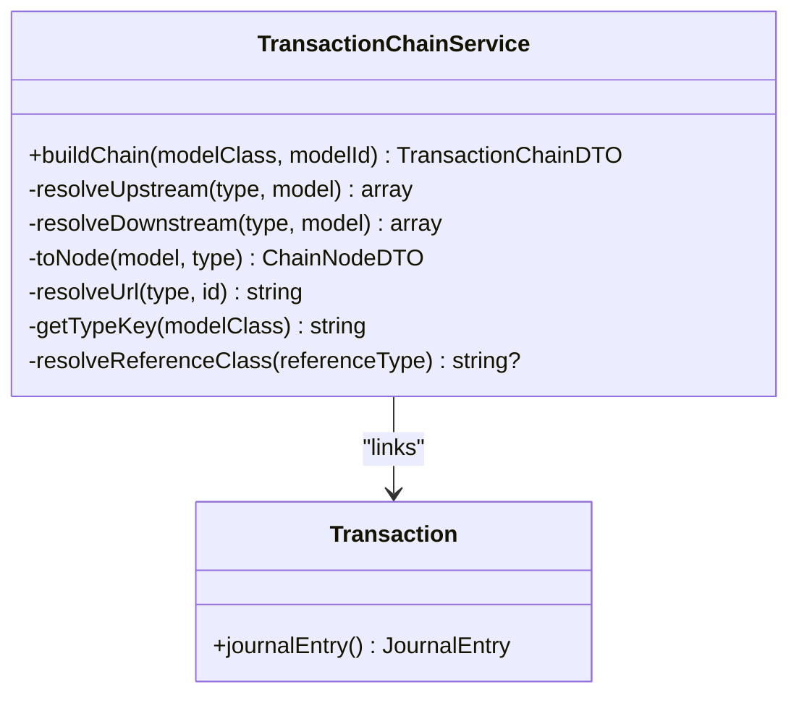
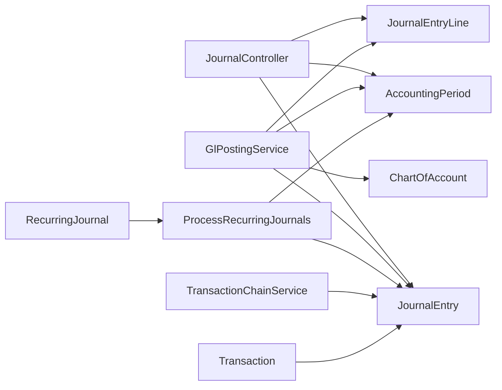

# Journal Entries & GL Posting

<cite>
**Referenced Files in This Document**
- [JournalEntry.php](file://app/Models/JournalEntry.php)
- [JournalEntryLine.php](file://app/Models/JournalEntryLine.php)
- [GlPostingService.php](file://app/Services/GlPostingService.php)
- [GlPostingResult.php](file://app/Services/GlPostingResult.php)
- [JournalController.php](file://app/Http/Controllers/JournalController.php)
- [ChartOfAccount.php](file://app/Models/ChartOfAccount.php)
- [AccountingPeriod.php](file://app/Models/AccountingPeriod.php)
- [RecurringJournal.php](file://app/Models/RecurringJournal.php)
- [ProcessRecurringJournalsCommand.php](file://app/Console/Commands/ProcessRecurringJournalsCommand.php)
- [ProcessRecurringJournals.php](file://app/Jobs/ProcessRecurringJournals.php)
- [TransactionChainService.php](file://app/Services/TransactionChainService.php)
- [Transaction.php](file://app/Models/Transaction.php)
</cite>

## Table of Contents
1. [Introduction](#introduction)
2. [Project Structure](#project-structure)
3. [Core Components](#core-components)
4. [Architecture Overview](#architecture-overview)
5. [Detailed Component Analysis](#detailed-component-analysis)
6. [Dependency Analysis](#dependency-analysis)
7. [Performance Considerations](#performance-considerations)
8. [Troubleshooting Guide](#troubleshooting-guide)
9. [Conclusion](#conclusion)
10. [Appendices](#appendices)

## Introduction
This document explains the journal entry processing and general ledger (GL) posting system. It covers the double-entry accounting workflow, creation and approval of journal entries, automated posting from business transactions, journal entry types, line-item processing, debit/credit validation, posting to the chart of accounts, transaction chains, audit trails, and integration with other modules. It also includes examples of common journal entries, batch processing, error handling, and reconciliation workflows, along with the GL posting engine and transaction validation rules.

## Project Structure
The journal and GL subsystem spans models, services, controllers, jobs, commands, and supporting domain models:
- Models define the accounting entities: JournalEntry, JournalEntryLine, ChartOfAccount, AccountingPeriod, RecurringJournal, and Transaction.
- Services encapsulate GL posting logic and result handling.
- Controllers manage manual journal entry creation, posting, reversal, and recurring journal administration.
- Jobs and commands automate recurring journal generation and execution.
- TransactionChainService links documents to their GL journals to support audit trails and reconciliation.

**Diagram sources**
- [JournalController.php:13-231](file://app/Http/Controllers/JournalController.php#L13-L231)
- [GlPostingService.php:26-996](file://app/Services/GlPostingService.php#L26-L996)
- [GlPostingResult.php:16-61](file://app/Services/GlPostingResult.php#L16-L61)
- [JournalEntry.php:13-164](file://app/Models/JournalEntry.php#L13-L164)
- [JournalEntryLine.php:8-91](file://app/Models/JournalEntryLine.php#L8-L91)
- [ChartOfAccount.php:14-85](file://app/Models/ChartOfAccount.php#L14-L85)
- [AccountingPeriod.php:11-42](file://app/Models/AccountingPeriod.php#L11-L42)
- [RecurringJournal.php:10-45](file://app/Models/RecurringJournal.php#L10-L45)
- [ProcessRecurringJournals.php:16-90](file://app/Jobs/ProcessRecurringJournals.php#L16-L90)
- [ProcessRecurringJournalsCommand.php:8-23](file://app/Console/Commands/ProcessRecurringJournalsCommand.php#L8-L23)
- [TransactionChainService.php:18-249](file://app/Services/TransactionChainService.php#L18-L249)
- [Transaction.php:11-58](file://app/Models/Transaction.php#L11-L58)

**Section sources**
- [JournalEntry.php:13-164](file://app/Models/JournalEntry.php#L13-L164)
- [JournalEntryLine.php:8-91](file://app/Models/JournalEntryLine.php#L8-L91)
- [GlPostingService.php:26-996](file://app/Services/GlPostingService.php#L26-L996)
- [GlPostingResult.php:16-61](file://app/Services/GlPostingResult.php#L16-L61)
- [JournalController.php:13-231](file://app/Http/Controllers/JournalController.php#L13-L231)
- [ChartOfAccount.php:14-85](file://app/Models/ChartOfAccount.php#L14-L85)
- [AccountingPeriod.php:11-42](file://app/Models/AccountingPeriod.php#L11-L42)
- [RecurringJournal.php:10-45](file://app/Models/RecurringJournal.php#L10-L45)
- [ProcessRecurringJournals.php:16-90](file://app/Jobs/ProcessRecurringJournals.php#L16-L90)
- [ProcessRecurringJournalsCommand.php:8-23](file://app/Console/Commands/ProcessRecurringJournalsCommand.php#L8-L23)
- [TransactionChainService.php:18-249](file://app/Services/TransactionChainService.php#L18-L249)
- [Transaction.php:11-58](file://app/Models/Transaction.php#L11-L58)

## Core Components
- JournalEntry: Represents a GL journal header with validation, posting, reversal, and numbering.
- JournalEntryLine: Represents line items with automatic balance warnings and COA linkage.
- GlPostingService: Central engine for automated GL postings from business events; returns structured results.
- GlPostingResult: Encapsulates success/skipped/failed outcomes with user-facing messages.
- JournalController: Manages manual journal lifecycle (create, post, reverse) and recurring journal admin.
- ChartOfAccount: Defines chart of accounts and balances per normal balance direction.
- AccountingPeriod: Period scoping and locking for posting controls.
- RecurringJournal and ProcessRecurringJournals: Automates recurring journal generation and posting.
- TransactionChainService: Builds transaction chains linking documents to GL journals for audit/reconciliation.
- Transaction: Links an originating transaction to its generated GL journal.

**Section sources**
- [JournalEntry.php:13-164](file://app/Models/JournalEntry.php#L13-L164)
- [JournalEntryLine.php:8-91](file://app/Models/JournalEntryLine.php#L8-L91)
- [GlPostingService.php:26-996](file://app/Services/GlPostingService.php#L26-L996)
- [GlPostingResult.php:16-61](file://app/Services/GlPostingResult.php#L16-L61)
- [JournalController.php:13-231](file://app/Http/Controllers/JournalController.php#L13-L231)
- [ChartOfAccount.php:14-85](file://app/Models/ChartOfAccount.php#L14-L85)
- [AccountingPeriod.php:11-42](file://app/Models/AccountingPeriod.php#L11-L42)
- [RecurringJournal.php:10-45](file://app/Models/RecurringJournal.php#L10-L45)
- [ProcessRecurringJournals.php:16-90](file://app/Jobs/ProcessRecurringJournals.php#L16-L90)
- [TransactionChainService.php:18-249](file://app/Services/TransactionChainService.php#L18-L249)
- [Transaction.php:11-58](file://app/Models/Transaction.php#L11-L58)

## Architecture Overview
The system enforces double-entry accounting with strict validation and immutability upon posting. Automated posting occurs from business events via GlPostingService, while manual journals are handled through JournalController. Recurring journals are scheduled and executed by a queued job. TransactionChainService connects documents to GL journals for audit trails and reconciliation.

**Diagram sources**
- [GlPostingService.php:865-975](file://app/Services/GlPostingService.php#L865-L975)
- [JournalEntry.php:107-118](file://app/Models/JournalEntry.php#L107-L118)
- [ChartOfAccount.php:14-85](file://app/Models/ChartOfAccount.php#L14-L85)
- [AccountingPeriod.php:11-42](file://app/Models/AccountingPeriod.php#L11-L42)

## Detailed Component Analysis

### JournalEntry and JournalEntryLine
- JournalEntry holds header data, relationships to period and user, and provides:
  - Total debit/credit computation and balance checks.
  - Validation ensuring balanced entries and minimum one debit and one credit line.
  - Posting routine that sets status and metadata.
  - Reversal creation with swapped debit/credit per line and linkage to original.
  - Number generation via DocumentNumberService with prefixes for auto-generated and reversals.
- JournalEntryLine:
  - Casts monetary fields to decimals.
  - Registers model events to warn on imbalances during direct DB changes (draft-only).
  - Links to ChartOfAccount and JournalEntry.

**Diagram sources**
- [JournalEntry.php:13-164](file://app/Models/JournalEntry.php#L13-L164)
- [JournalEntryLine.php:8-91](file://app/Models/JournalEntryLine.php#L8-L91)
- [ChartOfAccount.php:14-85](file://app/Models/ChartOfAccount.php#L14-L85)

**Section sources**
- [JournalEntry.php:65-162](file://app/Models/JournalEntry.php#L65-L162)
- [JournalEntryLine.php:26-91](file://app/Models/JournalEntryLine.php#L26-L91)

### GlPostingService and GlPostingResult
- GlPostingService centralizes automated GL posting from business events:
  - Provides methods for Sales Order, Invoice, Purchase Order, Returns, Payments, Expenses, Commissions, Consignment, Landed Cost, Contracts, Fleet, and Production workflows.
  - Uses a shared engine (createAndPost) that:
    - Enforces idempotency by reference and reference_type.
    - Resolves COA codes to IDs with caching and collects missing codes.
    - Validates totals are balanced.
    - Checks period locks before creating journals.
    - Creates JE header and lines inside a DB transaction.
    - Posts the journal and returns a structured GlPostingResult.
- GlPostingResult:
  - Encodes status (success/skipped/failed), optional journal, human-readable reason, and missing COA codes.
  - Supplies a warningMessage tailored for user feedback.

**Diagram sources**
- [GlPostingService.php:865-975](file://app/Services/GlPostingService.php#L865-L975)
- [GlPostingResult.php:16-61](file://app/Services/GlPostingResult.php#L16-L61)

**Section sources**
- [GlPostingService.php:26-996](file://app/Services/GlPostingService.php#L26-L996)
- [GlPostingResult.php:16-61](file://app/Services/GlPostingResult.php#L16-L61)

### JournalController: Manual Journals, Posting, Reversal, Recurring Admin
- Index/Search/Pagination of journals filtered by status/date/search.
- Create form with account selection and open periods.
- Store validates balance and period locks, creates draft journal with numbered reference.
- Post action posts a draft journal after period lock validation.
- Reverse action validates posted status, creates reversal journal, and posts it.
- Recurring index and store manage recurring journal templates with balance validation.
- Toggle activation of recurring journals.

**Diagram sources**
- [JournalController.php:45-152](file://app/Http/Controllers/JournalController.php#L45-L152)
- [JournalEntry.php:107-118](file://app/Models/JournalEntry.php#L107-L118)

**Section sources**
- [JournalController.php:20-152](file://app/Http/Controllers/JournalController.php#L20-L152)

### Recurring Journals: Generation and Execution
- RecurringJournal stores template lines and scheduling parameters.
- ProcessRecurringJournalsCommand triggers job execution.
- ProcessRecurringJournals:
  - Selects active recurring journals due today and within end_date.
  - Checks period lock; if locked, logs and advances next_run_date.
  - Creates a draft journal from template lines and auto-posts if balanced.
  - Updates last_run_date and computes next_run_date based on frequency.

**Diagram sources**
- [ProcessRecurringJournalsCommand.php:8-23](file://app/Console/Commands/ProcessRecurringJournalsCommand.php#L8-L23)
- [ProcessRecurringJournals.php:20-88](file://app/Jobs/ProcessRecurringJournals.php#L20-L88)
- [RecurringJournal.php:10-45](file://app/Models/RecurringJournal.php#L10-L45)
- [JournalEntry.php:107-118](file://app/Models/JournalEntry.php#L107-L118)

**Section sources**
- [ProcessRecurringJournalsCommand.php:8-23](file://app/Console/Commands/ProcessRecurringJournalsCommand.php#L8-L23)
- [ProcessRecurringJournals.php:20-88](file://app/Jobs/ProcessRecurringJournals.php#L20-L88)
- [RecurringJournal.php:10-45](file://app/Models/RecurringJournal.php#L10-L45)

### Transaction Chains and Audit Trails
- TransactionChainService builds upstream and downstream chains for a given model (e.g., Invoice, Sales Order, Payment).
- Downstream includes GL journals linked by reference_type/reference_id.
- Provides URLs and metadata for navigation and audit trail construction.

**Diagram sources**
- [TransactionChainService.php:18-249](file://app/Services/TransactionChainService.php#L18-L249)
- [Transaction.php:52-57](file://app/Models/Transaction.php#L52-L57)

**Section sources**
- [TransactionChainService.php:27-193](file://app/Services/TransactionChainService.php#L27-L193)
- [Transaction.php:52-57](file://app/Models/Transaction.php#L52-L57)

### Chart of Accounts and Balances
- ChartOfAccount defines COA structure, hierarchy, and normal balance direction.
- Provides a balance calculation over posted journal lines within optional date ranges.

**Section sources**
- [ChartOfAccount.php:54-71](file://app/Models/ChartOfAccount.php#L54-L71)

### Accounting Periods and Locking
- AccountingPeriod scopes journals to open periods and enforces locks to prevent postings in closed periods.
- Both manual posting and automated posting check period locks.

**Section sources**
- [AccountingPeriod.php:32-40](file://app/Models/AccountingPeriod.php#L32-L40)
- [GlPostingService.php:926-933](file://app/Services/GlPostingService.php#L926-L933)
- [JournalController.php:136-142](file://app/Http/Controllers/JournalController.php#L136-L142)

## Dependency Analysis
- Controllers depend on Models and Services for persistence and business logic.
- GlPostingService depends on ChartOfAccount for COA resolution, AccountingPeriod for period scoping, and JournalEntry/JournalEntryLine for persistence.
- RecurringJournal drives ProcessRecurringJournals, which interacts with JournalEntry and AccountingPeriod.
- TransactionChainService depends on multiple domain models and JournalEntry for cross-document linking.

**Diagram sources**
- [JournalController.php:13-231](file://app/Http/Controllers/JournalController.php#L13-L231)
- [GlPostingService.php:26-996](file://app/Services/GlPostingService.php#L26-L996)
- [ProcessRecurringJournals.php:16-90](file://app/Jobs/ProcessRecurringJournals.php#L16-L90)
- [RecurringJournal.php:10-45](file://app/Models/RecurringJournal.php#L10-L45)
- [TransactionChainService.php:18-249](file://app/Services/TransactionChainService.php#L18-L249)
- [Transaction.php:11-58](file://app/Models/Transaction.php#L11-L58)

**Section sources**
- [JournalController.php:13-231](file://app/Http/Controllers/JournalController.php#L13-L231)
- [GlPostingService.php:26-996](file://app/Services/GlPostingService.php#L26-L996)
- [ProcessRecurringJournals.php:16-90](file://app/Jobs/ProcessRecurringJournals.php#L16-L90)
- [RecurringJournal.php:10-45](file://app/Models/RecurringJournal.php#L10-L45)
- [TransactionChainService.php:18-249](file://app/Services/TransactionChainService.php#L18-L249)
- [Transaction.php:11-58](file://app/Models/Transaction.php#L11-L58)

## Performance Considerations
- COA resolution caching: GlPostingService caches resolved account IDs per tenant/code to reduce repeated lookups.
- Atomic transactions: All automated postings occur inside database transactions to ensure consistency.
- Idempotency checks: Prevent redundant journal creation for the same reference/refType.
- Period lock checks: Avoid unnecessary work when periods are locked.
- Batch-friendly design: Methods accept arrays of lines and compute totals efficiently.

[No sources needed since this section provides general guidance]

## Troubleshooting Guide
Common issues and resolutions:
- Imbalanced journals:
  - Automatic validation throws runtime exceptions during posting; manual creation warns via logs but allows draft creation.
  - Ensure equal total debits and credits across all lines.
- Missing COA codes:
  - Automated posting fails with a list of missing codes; load default COA or create manual journals.
- Period locked:
  - Posting is blocked if the journal date falls in a locked period; adjust date or unlock the period.
- Reversal errors:
  - Only posted journals can be reversed; ensure the original is posted and choose a valid reversal date within an open period.
- Recurring journal skips:
  - If the target period is locked, the run is skipped and next_run_date is advanced; unlock the period or reschedule.

**Section sources**
- [JournalEntry.php:83-105](file://app/Models/JournalEntry.php#L83-L105)
- [JournalEntryLine.php:51-80](file://app/Models/JournalEntryLine.php#L51-L80)
- [GlPostingService.php:908-933](file://app/Services/GlPostingService.php#L908-L933)
- [JournalController.php:136-149](file://app/Http/Controllers/JournalController.php#L136-L149)
- [ProcessRecurringJournals.php:33-47](file://app/Jobs/ProcessRecurringJournals.php#L33-L47)

## Conclusion
The system implements robust double-entry accounting with strong validation, immutability upon posting, and comprehensive automation from business events. Manual journals, approvals, and reversals are supported alongside recurring journal automation. Transaction chains and audit-ready references enable reconciliation and compliance.

[No sources needed since this section summarizes without analyzing specific files]

## Appendices

### Journal Entry Types and Examples
- Sales Order: Dr Accounts Receivable / Cr Sales; optionally Dr COGS and Cr Inventory.
- Invoice: Dr Accounts Receivable / Cr Sales; tax lines as applicable.
- Sales Payment: Dr Cash/Bank / Cr Accounts Receivable.
- Purchase Order Received: Dr Inventory / Cr Accounts Payable (+ tax input if applicable).
- Purchase Payment: Dr Accounts Payable / Cr Cash/Bank.
- Expense: Dr Expense Account / Cr Cash/Bank.
- Depreciation: Dr Depreciation Expense / Cr Accumulated Depreciation.
- Sales Return: Cr Accounts Receivable / Dr Sales Returns; tax and COGS adjustments.
- Purchase Return: Cr Accounts Payable / Dr Inventory; tax and COGS adjustments.
- Down Payment Received/Paid/Applied: Variants of receivable/payable and cash/bank.
- Bulk Payment: Dr Cash/Bank; Cr Multiple Receivables; optional Overpayment Reserve.
- Reimbursement: Dr Expense / Cr Cash/Bank.
- Sales Commission: Dr Commission Expense / Cr Cash.
- Consignment Sales/Settlement: Dr Trade Receivable / Cr Sales and Commission; settlement reverses receivable.
- Landed Cost: Dr Inventory (increase COGS) / Cr Accounts Payable.
- Contract Billing (Customer/Supplier): Dr AR / Cr Revenue or Dr Expense / Cr AP.
- Fleet Fuel/Maintenance: Dr Transportation/Expense / Cr Cash.
- Production Consumption/Output: Dr WIP / Cr Raw Materials and reverse for output.

[No sources needed since this section provides general guidance]

### Batch Processing and Idempotency
- Automated posting uses idempotency checks keyed by reference and reference_type to avoid duplicates.
- Recurring journals are batch-run daily; each due journal is processed atomically.

**Section sources**
- [GlPostingService.php:878-888](file://app/Services/GlPostingService.php#L878-L888)
- [ProcessRecurringJournals.php:24-27](file://app/Jobs/ProcessRecurringJournals.php#L24-L27)

### Transaction Validation Rules
- Balance validation: Total debit equals total credit within rounding threshold.
- Minimum composition: At least one debit and one credit line.
- Period lock validation: No posting in locked periods.
- COA availability: All codes must resolve to active accounts.

**Section sources**
- [JournalEntry.php:74-105](file://app/Models/JournalEntry.php#L74-L105)
- [GlPostingService.php:917-933](file://app/Services/GlPostingService.php#L917-L933)

### Financial Impact Tracking
- JournalEntry maintains reference_type/reference_id to link back to source documents.
- TransactionChainService aggregates upstream/downstream documents and GL journals for audit trails.
- ChartOfAccount.balance supports drill-down reporting by normal balance direction.

**Section sources**
- [TransactionChainService.php:133-149](file://app/Services/TransactionChainService.php#L133-L149)
- [ChartOfAccount.php:54-71](file://app/Models/ChartOfAccount.php#L54-L71)