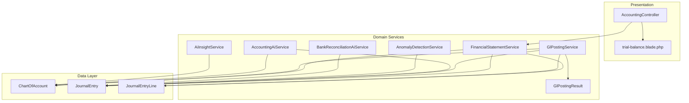
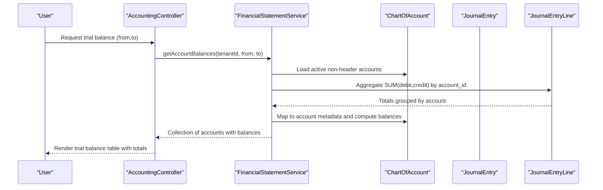
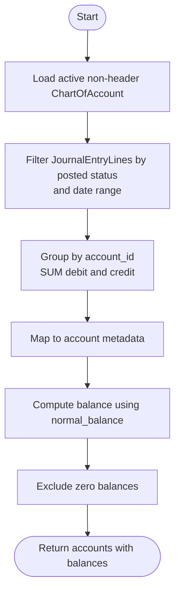
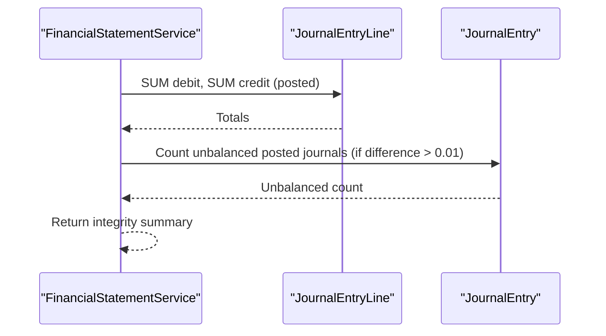
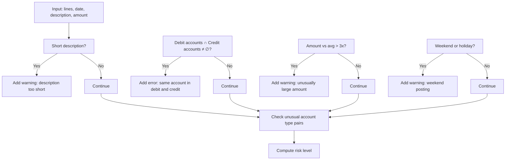
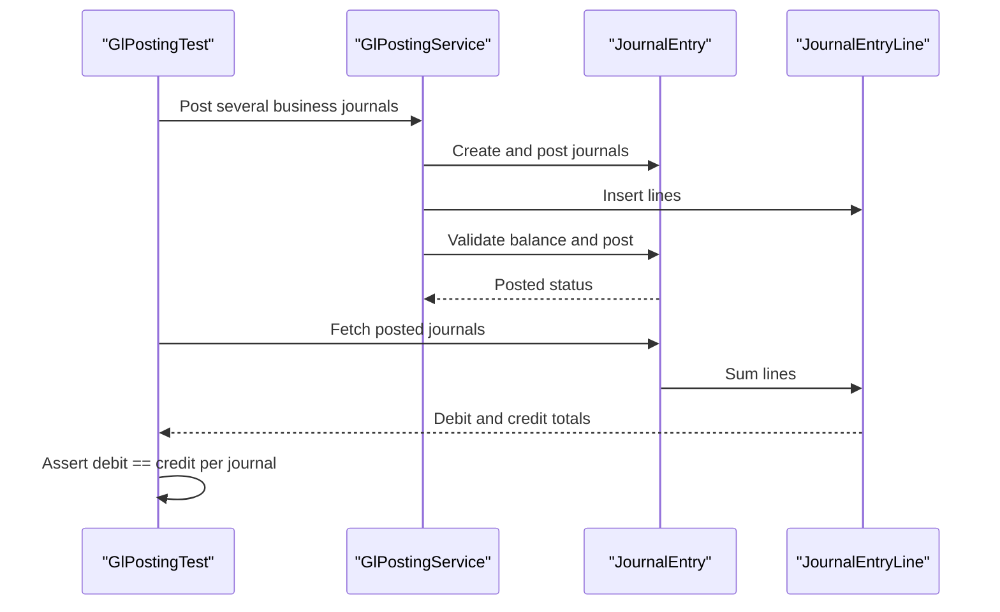
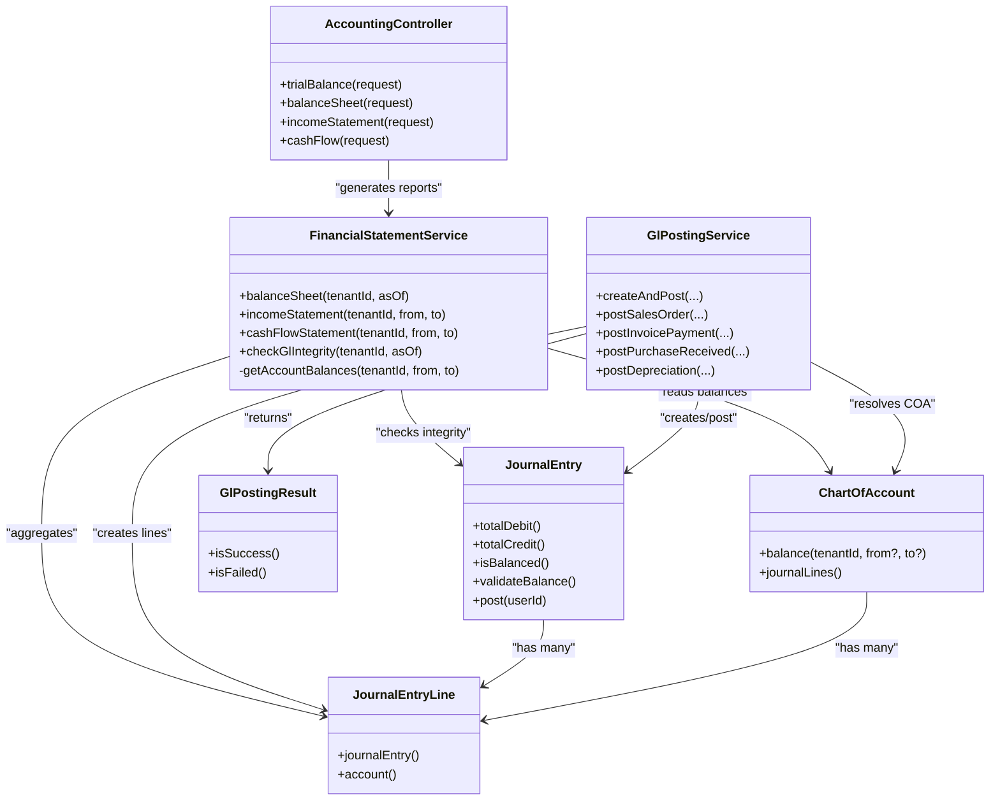

# Trial Balance & Account Analysis

<cite>
**Referenced Files in This Document**
- [AccountingController.php](file://app/Http/Controllers/AccountingController.php)
- [FinancialStatementService.php](file://app/Services/FinancialStatementService.php)
- [GlPostingService.php](file://app/Services/GlPostingService.php)
- [GlPostingResult.php](file://app/Services/GlPostingResult.php)
- [ChartOfAccount.php](file://app/Models/ChartOfAccount.php)
- [JournalEntry.php](file://app/Models/JournalEntry.php)
- [JournalEntryLine.php](file://app/Models/JournalEntryLine.php)
- [trial-balance.blade.php](file://resources/views/accounting/trial-balance.blade.php)
- [GlPostingTest.php](file://tests/Feature/GlPostingTest.php)
- [AccountingAiService.php](file://app/Services/AccountingAiService.php)
- [AiInsightService.php](file://app/Services/AiInsightService.php)
- [AnomalyDetectionService.php](file://app/Services/AnomalyDetectionService.php)
- [BankReconciliationAiService.php](file://app/Services/BankReconciliationAiService.php)
- [BalanceSheetExport.php](file://app/Exports/BalanceSheetExport.php)
</cite>

## Table of Contents
1. [Introduction](#introduction)
2. [Project Structure](#project-structure)
3. [Core Components](#core-components)
4. [Architecture Overview](#architecture-overview)
5. [Detailed Component Analysis](#detailed-component-analysis)
6. [Dependency Analysis](#dependency-analysis)
7. [Performance Considerations](#performance-considerations)
8. [Troubleshooting Guide](#troubleshooting-guide)
9. [Conclusion](#conclusion)
10. [Appendices](#appendices)

## Introduction
This document explains the trial balance generation and account analysis capabilities in the system. It covers how trial balances are calculated, how accounts are aggregated by date ranges, and how balances are verified. It also documents debit/credit analysis, account activity tracking, variance detection, validation workflows, and integration with financial analysis tools. Practical examples and automated checks are included to guide interpretation and reconciliation.

## Project Structure
The trial balance and account analysis features span controllers, services, models, views, and tests:
- Controllers expose endpoints for trial balance and financial statements.
- Services encapsulate GL integrity checks, account aggregation, and auto-posting.
- Models define the chart of accounts, journal entries, and lines.
- Views render trial balance tables with totals and balance indicators.
- Tests validate journal balancing and service behavior.
- AI and anomaly services provide warnings and insights for unusual account pairs and GL anomalies.

**Diagram sources**
- [AccountingController.php:155-188](file://app/Http/Controllers/AccountingController.php#L155-L188)
- [FinancialStatementService.php:26-203](file://app/Services/FinancialStatementService.php#L26-L203)
- [GlPostingService.php:865-975](file://app/Services/GlPostingService.php#L865-L975)
- [GlPostingResult.php:16-40](file://app/Services/GlPostingResult.php#L16-L40)
- [ChartOfAccount.php:14-84](file://app/Models/ChartOfAccount.php#L14-L84)
- [JournalEntry.php:13-118](file://app/Models/JournalEntry.php#L13-L118)
- [JournalEntryLine.php:8-90](file://app/Models/JournalEntryLine.php#L8-L90)
- [trial-balance.blade.php:1-69](file://resources/views/accounting/trial-balance.blade.php#L1-L69)
- [AccountingAiService.php:259-327](file://app/Services/AccountingAiService.php#L259-L327)
- [AnomalyDetectionService.php:22-66](file://app/Services/AnomalyDetectionService.php#L22-L66)
- [AiInsightService.php:1182-1237](file://app/Services/AiInsightService.php#L1182-L1237)
- [BankReconciliationAiService.php:38-252](file://app/Services/BankReconciliationAiService.php#L38-L252)

**Section sources**
- [AccountingController.php:155-188](file://app/Http/Controllers/AccountingController.php#L155-L188)
- [FinancialStatementService.php:26-203](file://app/Services/FinancialStatementService.php#L26-L203)
- [GlPostingService.php:865-975](file://app/Services/GlPostingService.php#L865-L975)
- [ChartOfAccount.php:14-84](file://app/Models/ChartOfAccount.php#L14-L84)
- [JournalEntry.php:13-118](file://app/Models/JournalEntry.php#L13-L118)
- [JournalEntryLine.php:8-90](file://app/Models/JournalEntryLine.php#L8-L90)
- [trial-balance.blade.php:1-69](file://resources/views/accounting/trial-balance.blade.php#L1-L69)

## Core Components
- Trial Balance Controller: Generates trial balance for a selected date range, aggregates debits/credits per account, and displays totals and balance indicator.
- Financial Statement Service: Computes account balances via a single aggregate query, supports date-range filtering, and performs GL integrity checks.
- Chart of Account Model: Provides per-account balance computation using posted journal lines and normal balance semantics.
- Journal Entry and Lines: Enforce balance validation and immutability upon posting; provide per-journal totals and validation helpers.
- GL Posting Service: Creates and posts journal entries with idempotency, resolves COA accounts, validates totals, and posts immutable records.
- AI and Anomaly Services: Detect unusual account pairings, GL anomalies, negative cash balances, and inactive GL periods.

**Section sources**
- [AccountingController.php:155-188](file://app/Http/Controllers/AccountingController.php#L155-L188)
- [FinancialStatementService.php:156-203](file://app/Services/FinancialStatementService.php#L156-L203)
- [ChartOfAccount.php:54-71](file://app/Models/ChartOfAccount.php#L54-L71)
- [JournalEntry.php:65-118](file://app/Models/JournalEntry.php#L65-L118)
- [JournalEntryLine.php:26-80](file://app/Models/JournalEntryLine.php#L26-L80)
- [GlPostingService.php:865-975](file://app/Services/GlPostingService.php#L865-L975)
- [AccountingAiService.php:259-368](file://app/Services/AccountingAiService.php#L259-L368)
- [AnomalyDetectionService.php:22-66](file://app/Services/AnomalyDetectionService.php#L22-L66)
- [AiInsightService.php:1182-1237](file://app/Services/AiInsightService.php#L1182-L1237)

## Architecture Overview
The trial balance pipeline integrates controller-driven filters, service-level aggregation, and model validations. The GL posting pipeline ensures each journal is balanced and posted immutably, while financial reporting services compute balances and integrity metrics.

**Diagram sources**
- [AccountingController.php:155-188](file://app/Http/Controllers/AccountingController.php#L155-L188)
- [FinancialStatementService.php:156-203](file://app/Services/FinancialStatementService.php#L156-L203)
- [ChartOfAccount.php:14-84](file://app/Models/ChartOfAccount.php#L14-L84)
- [JournalEntryLine.php:8-90](file://app/Models/JournalEntryLine.php#L8-L90)

## Detailed Component Analysis

### Trial Balance Generation
- Aggregation by date range: The service fetches posted journal lines within the requested date window and groups by account_id, computing total debit and credit per account.
- Balance calculation: Uses the account’s normal balance convention to derive signed balances.
- Filtering: Only active non-header accounts are considered; zero balances are excluded.
- Controller rendering: The view displays debits, credits, and computed balances, and shows whether the total debit equals total credit.

**Diagram sources**
- [FinancialStatementService.php:156-203](file://app/Services/FinancialStatementService.php#L156-L203)
- [ChartOfAccount.php:54-71](file://app/Models/ChartOfAccount.php#L54-L71)

**Section sources**
- [AccountingController.php:155-188](file://app/Http/Controllers/AccountingController.php#L155-L188)
- [FinancialStatementService.php:156-203](file://app/Services/FinancialStatementService.php#L156-L203)
- [trial-balance.blade.php:21-66](file://resources/views/accounting/trial-balance.blade.php#L21-L66)

### Account Aggregation by Date Ranges
- The service accepts optional from and to parameters to constrain the date window.
- It queries only posted journal entries to ensure historical accuracy.
- A single aggregate query avoids N+1 selects and improves performance.

**Section sources**
- [FinancialStatementService.php:156-182](file://app/Services/FinancialStatementService.php#L156-L182)
- [JournalEntry.php:17-42](file://app/Models/JournalEntry.php#L17-L42)

### Balance Verification Processes
- GL Integrity Check: Computes total debit and credit across all posted journals up to a given date and reports differences and unbalanced counts.
- Journal-level validation: Ensures each journal’s debit equals credit before posting and throws descriptive errors otherwise.
- Real-time warnings: Draft journals log warnings when imbalanced to prevent invalid drafts.

**Diagram sources**
- [FinancialStatementService.php:398-433](file://app/Services/FinancialStatementService.php#L398-L433)
- [JournalEntry.php:65-105](file://app/Models/JournalEntry.php#L65-L105)

**Section sources**
- [FinancialStatementService.php:398-433](file://app/Services/FinancialStatementService.php#L398-L433)
- [JournalEntry.php:83-105](file://app/Models/JournalEntry.php#L83-L105)
- [JournalEntryLine.php:51-80](file://app/Models/JournalEntryLine.php#L51-L80)

### Debit/Credit Analysis and Account Activity Tracking
- Per-account totals: The service computes total debit and credit per account within the date range.
- Normal balance semantics: Balances reflect whether the account typically has debit or credit normal balances.
- Activity tracking: The controller view lists accounts with activity during the selected period and highlights total debits and credits.

**Section sources**
- [FinancialStatementService.php:186-202](file://app/Services/FinancialStatementService.php#L186-L202)
- [ChartOfAccount.php:54-71](file://app/Models/ChartOfAccount.php#L54-L71)
- [AccountingController.php:155-188](file://app/Http/Controllers/AccountingController.php#L155-L188)

### Variance Detection and Anomaly Alerts
- Unusual account pairs: AI service detects uncommon debit-credit pairings by type and validates against recent history.
- Journal anomalies: Checks for large amounts, overlapping debit/credit accounts, weekend postings, and short descriptions.
- GL insights: Flags inactive GL (no posts in 7 days), negative cash balances, and unexpected expense spikes.
- Duplicate transactions and stock mismatches: Anomaly detection service identifies suspicious patterns across transactions.

**Diagram sources**
- [AccountingAiService.php:259-327](file://app/Services/AccountingAiService.php#L259-L327)
- [AccountingAiService.php:332-387](file://app/Services/AccountingAiService.php#L332-L387)
- [AiInsightService.php:1182-1237](file://app/Services/AiInsightService.php#L1182-L1237)
- [AnomalyDetectionService.php:22-66](file://app/Services/AnomalyDetectionService.php#L22-L66)

**Section sources**
- [AccountingAiService.php:259-368](file://app/Services/AccountingAiService.php#L259-L368)
- [AiInsightService.php:1182-1237](file://app/Services/AiInsightService.php#L1182-L1237)
- [AnomalyDetectionService.php:22-66](file://app/Services/AnomalyDetectionService.php#L22-L66)

### Trial Balance Validation and Discrepancy Investigation
- GL Integrity Summary: Reports total debits, credits, difference, and unbalanced journal counts.
- Discrepancy investigation: Use the integrity summary to locate journals with mismatched totals; review journal lines and COA mappings.
- Automated checks: The GL posting service enforces balance and period locks before posting; tests assert all posted journals remain balanced.

**Diagram sources**
- [GlPostingTest.php:283-303](file://tests/Feature/GlPostingTest.php#L283-L303)
- [GlPostingService.php:865-975](file://app/Services/GlPostingService.php#L865-L975)
- [JournalEntry.php:83-118](file://app/Models/JournalEntry.php#L83-L118)
- [JournalEntryLine.php:64-79](file://app/Models/JournalEntryLine.php#L64-L79)

**Section sources**
- [FinancialStatementService.php:398-433](file://app/Services/FinancialStatementService.php#L398-L433)
- [GlPostingTest.php:283-303](file://tests/Feature/GlPostingTest.php#L283-L303)
- [GlPostingService.php:917-933](file://app/Services/GlPostingService.php#L917-L933)

### Integration with Financial Analysis Tools
- FinancialStatementService integrates with balance sheet, income statement, and cash flow calculations, ensuring GL integrity is checked before generating reports.
- Export integrations: Balance sheet export formats report rows for liability and equity sections, reflecting balances computed from GL.
- AI insights: AiInsightService leverages GL data to surface risks and trends, complementing trial balance analysis.

**Section sources**
- [FinancialStatementService.php:26-148](file://app/Services/FinancialStatementService.php#L26-L148)
- [BalanceSheetExport.php:67-93](file://app/Exports/BalanceSheetExport.php#L67-L93)
- [AiInsightService.php:1182-1237](file://app/Services/AiInsightService.php#L1182-L1237)

## Dependency Analysis
The following diagram shows key dependencies among components involved in trial balance and account analysis:

**Diagram sources**
- [AccountingController.php:155-252](file://app/Http/Controllers/AccountingController.php#L155-L252)
- [FinancialStatementService.php:26-433](file://app/Services/FinancialStatementService.php#L26-L433)
- [GlPostingService.php:865-996](file://app/Services/GlPostingService.php#L865-L996)
- [GlPostingResult.php:16-40](file://app/Services/GlPostingResult.php#L16-L40)
- [ChartOfAccount.php:14-84](file://app/Models/ChartOfAccount.php#L14-L84)
- [JournalEntry.php:13-118](file://app/Models/JournalEntry.php#L13-L118)
- [JournalEntryLine.php:8-90](file://app/Models/JournalEntryLine.php#L8-L90)

**Section sources**
- [AccountingController.php:155-252](file://app/Http/Controllers/AccountingController.php#L155-L252)
- [FinancialStatementService.php:26-433](file://app/Services/FinancialStatementService.php#L26-L433)
- [GlPostingService.php:865-996](file://app/Services/GlPostingService.php#L865-L996)
- [ChartOfAccount.php:14-84](file://app/Models/ChartOfAccount.php#L14-L84)
- [JournalEntry.php:13-118](file://app/Models/JournalEntry.php#L13-L118)
- [JournalEntryLine.php:8-90](file://app/Models/JournalEntryLine.php#L8-L90)

## Performance Considerations
- Single aggregate query: The service uses a single grouped query to compute totals per account, avoiding N+1 queries and improving scalability.
- Efficient filtering: Filters by posted status and date range minimize scanned rows.
- Idempotent posting: The GL posting service checks for existing references to avoid redundant writes.
- Batch operations: FinancialStatementService includes batch helpers to compute balances for multiple accounts efficiently.

[No sources needed since this section provides general guidance]

## Troubleshooting Guide
Common issues and resolutions:
- Imbalanced journals: Review journal lines for rounding discrepancies or missing counterpart entries; ensure total debit equals total credit.
- Negative cash balances: Investigate postings that reduce cash below zero; reconcile with bank statements and pending receipts.
- Inactive GL: If no journals posted in the last 7 days, investigate missing transaction capture or posting failures.
- Unusual account pairs: Validate that debit and credit accounts align with typical business flows; adjust COA mappings if needed.
- Period locked: Journals cannot be created for locked periods; unlock the period or adjust the posting date.

**Section sources**
- [JournalEntry.php:83-118](file://app/Models/JournalEntry.php#L83-L118)
- [AiInsightService.php:1182-1237](file://app/Services/AiInsightService.php#L1182-L1237)
- [GlPostingService.php:926-933](file://app/Services/GlPostingService.php#L926-L933)
- [AccountingAiService.php:332-387](file://app/Services/AccountingAiService.php#L332-L387)

## Conclusion
The system provides robust trial balance generation and account analysis through centralized services, strict journal validation, and integrated AI/insights. Trial balances are computed efficiently with date-range filtering, verified via GL integrity checks, and supported by anomaly detection and reconciliation tools. These capabilities enable accurate financial reporting, timely variance detection, and automated balance verification.

[No sources needed since this section summarizes without analyzing specific files]

## Appendices

### Examples of Trial Balance Interpretation
- Balanced totals: When total debits equal total credits, the ledger is balanced; review individual accounts for unusual movements.
- Unbalanced totals: Investigate journals with differing totals; correct missing or incorrect lines.
- Negative balances: Highlight accounts with negative balances (e.g., cash) and reconcile with supporting documents.

**Section sources**
- [trial-balance.blade.php:53-64](file://resources/views/accounting/trial-balance.blade.php#L53-L64)
- [FinancialStatementService.php:398-433](file://app/Services/FinancialStatementService.php#L398-L433)

### Account Reconciliation Procedures
- Match trial balance accounts to general ledger entries.
- Reconcile cash accounts against bank statements.
- Investigate suspense accounts and adjustments.
- Use AI suggestions and anomaly alerts to identify potential misclassifications.

**Section sources**
- [BankReconciliationAiService.php:38-252](file://app/Services/BankReconciliationAiService.php#L38-L252)
- [AccountingAiService.php:259-368](file://app/Services/AccountingAiService.php#L259-L368)

### Automated Balance Checking Mechanisms
- GL integrity summary: Continuous monitoring of total debits vs credits.
- Journal validation: Pre-posting checks for balance and period locks.
- Test suite: Regression tests ensure posted journals remain balanced.

**Section sources**
- [FinancialStatementService.php:398-433](file://app/Services/FinancialStatementService.php#L398-L433)
- [GlPostingService.php:917-933](file://app/Services/GlPostingService.php#L917-L933)
- [GlPostingTest.php:283-303](file://tests/Feature/GlPostingTest.php#L283-L303)