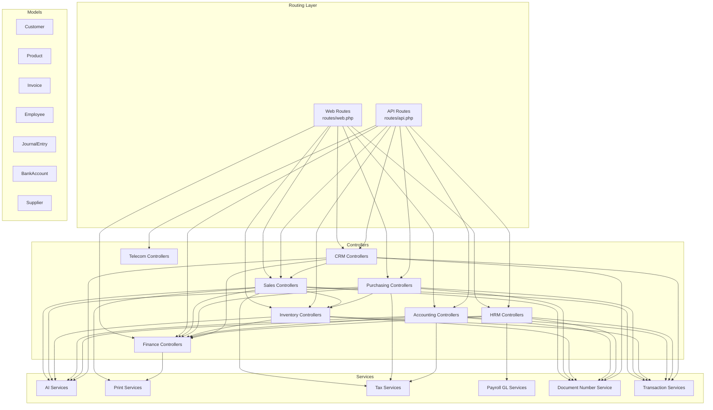
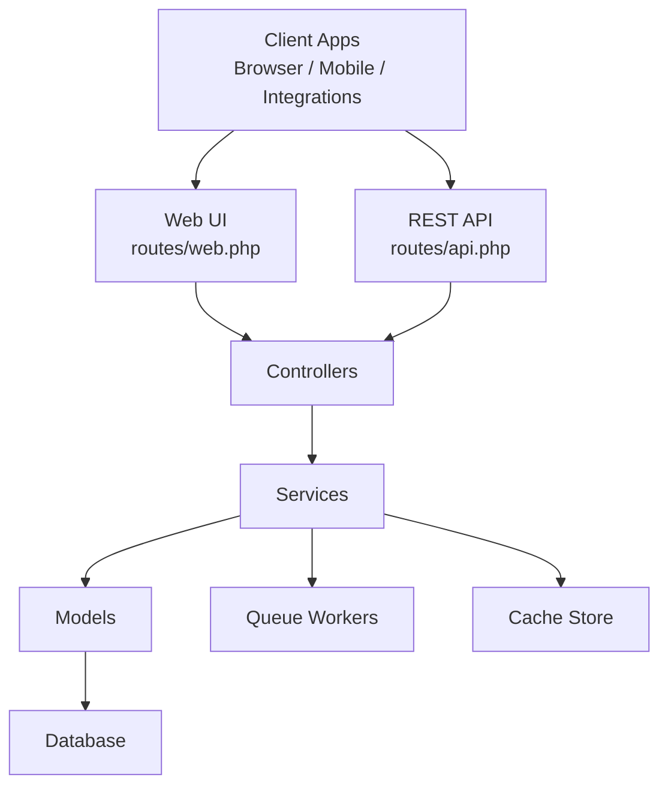
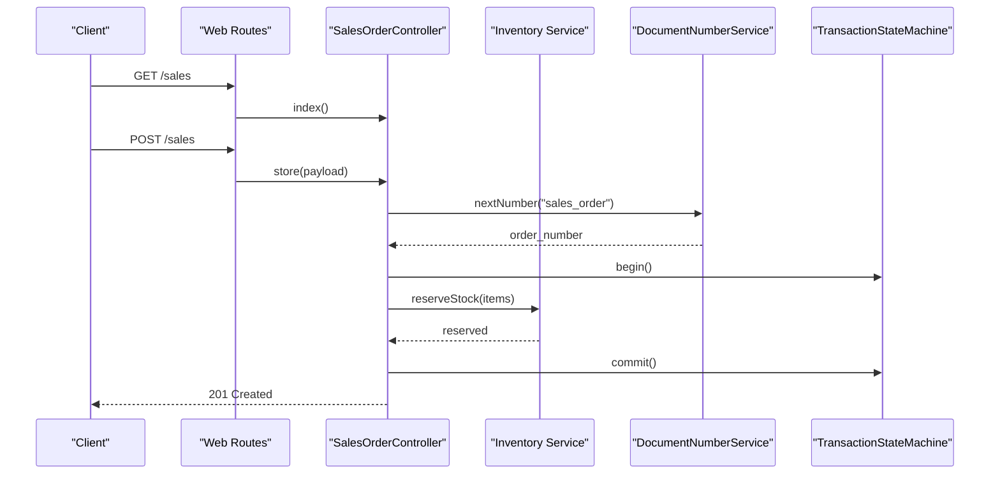
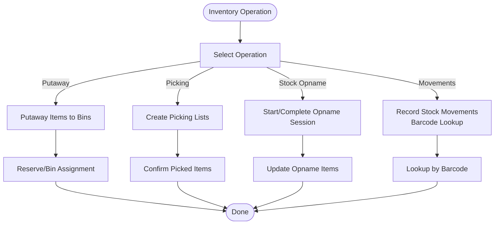
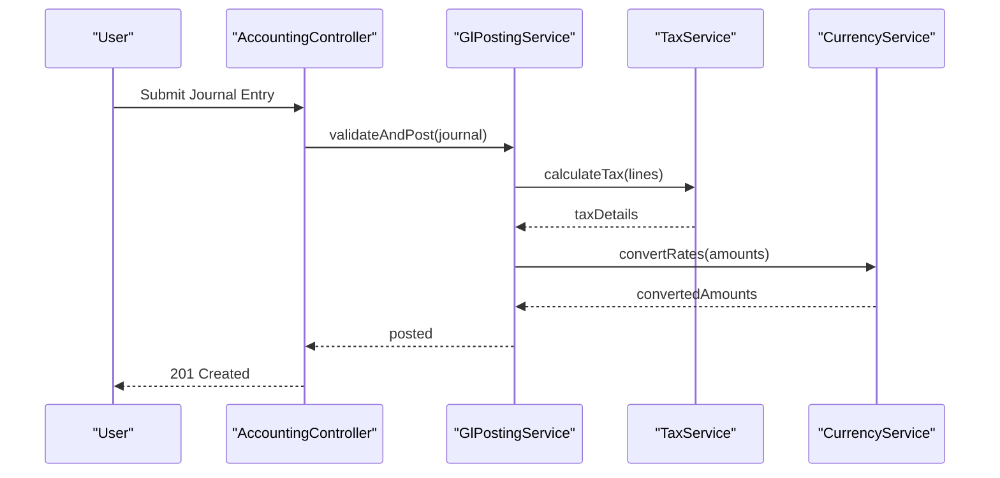
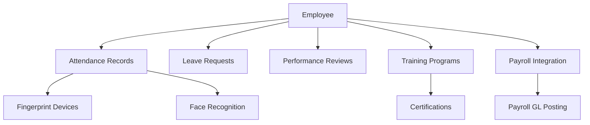
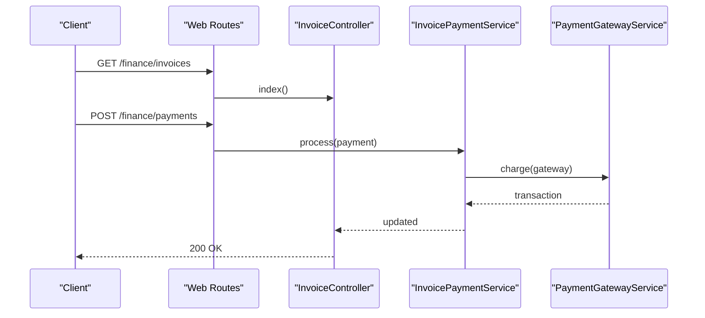
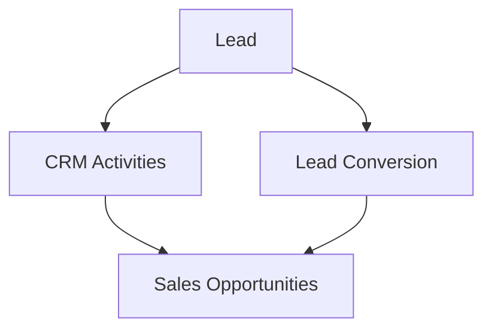
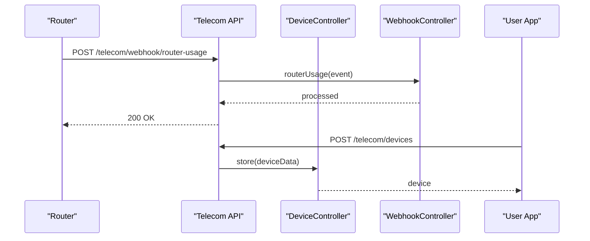
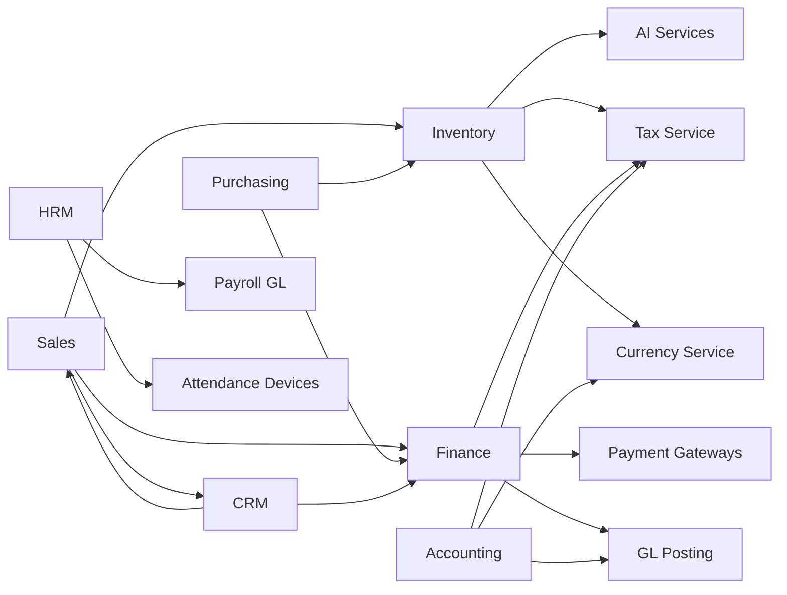

# Core Modules

<cite>
**Referenced Files in This Document**
- [README.md](file://README.md)
- [composer.json](file://composer.json)
- [app/Providers/AppServiceProvider.php](file://app/Providers/AppServiceProvider.php)
- [routes/api.php](file://routes/api.php)
- [routes/web.php](file://routes/web.php)
</cite>

## Table of Contents
1. [Introduction](#introduction)
2. [Project Structure](#project-structure)
3. [Core Components](#core-components)
4. [Architecture Overview](#architecture-overview)
5. [Detailed Component Analysis](#detailed-component-analysis)
6. [Dependency Analysis](#dependency-analysis)
7. [Performance Considerations](#performance-considerations)
8. [Troubleshooting Guide](#troubleshooting-guide)
9. [Conclusion](#conclusion)
10. [Appendices](#appendices)

## Introduction
This document describes the core business modules of Qalcuity ERP and how they are organized, integrated, and selectively deployable. The system is built on Laravel 13 with PHP 8.3+, and exposes both web and REST APIs. Modules include Sales, Purchasing, Inventory, Accounting, Human Resources (HRM), Finance, CRM, and a dedicated Telecom module. Shared services, tenant isolation, rate limiting, and common data models underpin cross-module workflows. The modular architecture supports enabling or disabling modules via settings and cleanup endpoints, while maintaining multi-tenant isolation and robust integration patterns.

## Project Structure
Qalcuity ERP follows a layered Laravel structure:
- Application entry points: web routes and API routes
- Controllers: grouped by functional domains (Sales, Purchasing, Inventory, Accounting, HRM, Finance, CRM, etc.)
- Services: reusable business services (e.g., AI, analytics, printing, tax, payroll GL posting)
- Models: extensive domain models representing entities such as customers, products, journal entries, employees, invoices, etc.
- Commands and Jobs: scheduled tasks and queued jobs for automation and background processing
- Providers: service container bindings and global behaviors (observers, rate limiters, blade directives)
- Routes: web and API route groups for each module and integration endpoints

**Diagram sources**
- [routes/web.php:1-800](file://routes/web.php#L1-L800)
- [routes/api.php:1-165](file://routes/api.php#L1-L165)
- [app/Providers/AppServiceProvider.php:26-255](file://app/Providers/AppServiceProvider.php#L26-L255)

**Section sources**
- [README.md:1-576](file://README.md#L1-L576)
- [composer.json:1-99](file://composer.json#L1-L99)
- [routes/web.php:1-800](file://routes/web.php#L1-L800)
- [routes/api.php:1-165](file://routes/api.php#L1-L165)
- [app/Providers/AppServiceProvider.php:26-255](file://app/Providers/AppServiceProvider.php#L26-L255)

## Core Components
- Multi-tenant isolation: tenant-aware routing and model traits ensure data separation across tenants.
- Shared services:
  - Document numbering service for consistent sequential document IDs
  - Transaction state machine and transaction link services for cross-module atomicity
  - Permission service and Blade directives for granular UI controls
  - AI services (Gemini) with request-scoped bindings and rate limits
  - Print services for POS receipts and kitchen tickets
  - Tax calculation and currency services
  - Payroll GL posting service
- Rate limiting: per-endpoint and per-plan throttling for API reads/writes, webhooks, POS checkout, export/import, and AI quotas
- Observers: automatic cache invalidation and side effects for key settings and product/product stock models
- Module settings: endpoints to analyze impact, cleanup, and restore data when toggling modules

**Section sources**
- [app/Providers/AppServiceProvider.php:26-255](file://app/Providers/AppServiceProvider.php#L26-L255)
- [routes/web.php:408-418](file://routes/web.php#L408-L418)

## Architecture Overview
Qalcuity ERP employs a layered architecture:
- Presentation: web UI and REST API
- Routing: web routes for dashboards and module screens; API routes for integrations and clients
- Controllers: orchestrate requests, delegate to services, and render responses
- Services: encapsulate business logic and cross-cutting concerns
- Models: domain entities with tenant isolation traits and observers
- Infrastructure: queues for background jobs, caches for performance, and scheduled tasks

**Diagram sources**
- [routes/web.php:1-800](file://routes/web.php#L1-L800)
- [routes/api.php:1-165](file://routes/api.php#L1-L165)
- [app/Providers/AppServiceProvider.php:26-255](file://app/Providers/AppServiceProvider.php#L26-L255)

## Detailed Component Analysis

### Sales/Purchase Operations
- Sales orders: create, update status, link to invoices, and integrate with CRM and inventory
- Purchase orders: create, approve workflows, and track goods receipt
- Price suggestion AI and late payment risk assessment
- POS checkout with payment initiation and completion
- E-commerce channel synchronization for stock/prices/mappings

**Diagram sources**
- [routes/web.php:576-585](file://routes/web.php#L576-L585)
- [app/Providers/AppServiceProvider.php:40-44](file://app/Providers/AppServiceProvider.php#L40-L44)

**Section sources**
- [routes/web.php:576-585](file://routes/web.php#L576-L585)
- [routes/web.php:548-560](file://routes/web.php#L548-L560)
- [routes/web.php:562-567](file://routes/web.php#L562-L567)
- [routes/web.php:445-456](file://routes/web.php#L445-L456)

### Inventory Management
- Warehouses, bins, putaway rules, picking lists, stock opname sessions
- Batch tracking, expiry alerts, cost valuation, COGS computation
- Smart scales integration and barcode scanning workflows
- Movement tracking and barcode lookup

**Diagram sources**
- [routes/web.php:616-638](file://routes/web.php#L616-L638)
- [routes/web.php:639-679](file://routes/web.php#L639-L679)

**Section sources**
- [routes/web.php:616-638](file://routes/web.php#L616-L638)
- [routes/web.php:639-679](file://routes/web.php#L639-L679)

### Accounting
- Chart of accounts, journals, GL posting, period locking, bank reconciliation
- Accounting AI for account suggestions, journal checks, and statement categorization
- Tax records and currency rates
- Recurring journals and consolidation support

**Diagram sources**
- [routes/web.php:53-60](file://routes/web.php#L53-L60)
- [app/Providers/AppServiceProvider.php:26-44](file://app/Providers/AppServiceProvider.php#L26-L44)

**Section sources**
- [routes/web.php:53-60](file://routes/web.php#L53-L60)
- [routes/web.php:523-537](file://routes/web.php#L523-L537)

### Human Resources (HRM)
- Employee master data, attendance, leave, performance reviews, org chart
- Recruitment and onboarding workflows
- Shift scheduling, overtime approvals
- Fingerprint and face recognition attendance
- Training programs and certifications
- Payroll integration via GL posting service

**Diagram sources**
- [routes/web.php:681-800](file://routes/web.php#L681-L800)

**Section sources**
- [routes/web.php:681-800](file://routes/web.php#L681-L800)

### Finance
- Invoicing, receivables, payments, bank reconciliation, cash flow projection
- Budget vs actual reporting, aging reports, profit/loss, balance sheet, cash flow statements
- Subscription billing and payment gateway integrations
- Forecasting and KPI dashboards

**Diagram sources**
- [routes/web.php:365-398](file://routes/web.php#L365-L398)
- [routes/web.php:53-60](file://routes/web.php#L53-L60)

**Section sources**
- [routes/web.php:365-398](file://routes/web.php#L365-L398)
- [routes/web.php:53-60](file://routes/web.php#L53-L60)

### CRM
- Leads, activities, lead conversion AI
- Campaigns and opportunity tracking
- Integration with sales and marketing channels

**Diagram sources**
- [routes/web.php:26-28](file://routes/web.php#L26-L28)
- [app/Providers/AppServiceProvider.php:26-44](file://app/Providers/AppServiceProvider.php#L26-L44)

**Section sources**
- [routes/web.php:26-28](file://routes/web.php#L26-L28)

### Telecom Module
- Device management, hotspot user lifecycle, usage tracking, voucher management
- Router usage webhooks and device alert webhooks
- REST API endpoints for authenticated telecom operations

**Diagram sources**
- [routes/api.php:87-91](file://routes/api.php#L87-L91)
- [routes/api.php:63-85](file://routes/api.php#L63-L85)

**Section sources**
- [routes/api.php:63-91](file://routes/api.php#L63-L91)
- [README.md:5-31](file://README.md#L5-L31)

## Dependency Analysis
- Module coupling:
  - Sales depends on Inventory (stock reservation), Finance (invoicing/payments), CRM (leads/opportunities)
  - Purchasing depends on Inventory (goods receipt), Finance (payables)
  - Inventory integrates with AI services for stockout prediction and reorder suggestions
  - Accounting integrates with Tax and Currency services and posts to GL
  - HRM integrates with Payroll GL posting and attendance devices
  - CRM integrates with Sales and Finance for revenue tracking
- Shared services:
  - DocumentNumberService ensures sequential numbering across modules
  - TransactionStateMachine and TransactionLinkService coordinate atomic operations
  - PermissionService and Blade directives enforce module-level permissions
  - AI services (Gemini) are bound per-request to avoid state leakage
- External integrations:
  - Payment gateways (via API)
  - Webhooks (marketplaces, routers, attendance devices)
  - POS printing and barcode generation
  - AI assistants and analytics dashboards

**Diagram sources**
- [routes/web.php:1-800](file://routes/web.php#L1-L800)
- [routes/api.php:1-165](file://routes/api.php#L1-L165)
- [app/Providers/AppServiceProvider.php:26-255](file://app/Providers/AppServiceProvider.php#L26-L255)

**Section sources**
- [routes/web.php:1-800](file://routes/web.php#L1-L800)
- [routes/api.php:1-165](file://routes/api.php#L1-L165)
- [app/Providers/AppServiceProvider.php:26-255](file://app/Providers/AppServiceProvider.php#L26-L255)

## Performance Considerations
- Use queue workers for background jobs (e.g., notifications, exports, AI processing)
- Enable Laravel route, config, and view caching in production
- Apply rate limiting per endpoint and per tenant plan to prevent abuse
- Cache frequently accessed settings and AI responses
- Use database session and cache stores for scalability
- Monitor slow queries and enable query logging during profiling

[No sources needed since this section provides general guidance]

## Troubleshooting Guide
- 500 errors after deploy: check Laravel logs, regenerate APP_KEY, clear caches
- Queue workers not running: verify supervisor configuration, check worker logs, inspect failed jobs
- Permission denied: fix storage and cache directory ownership and permissions
- Composer memory limit: increase memory limit during installation
- Nginx 404 on routes: ensure try_files directive and public root are configured correctly
- Scheduler not running: confirm cron job executes schedule:run

**Section sources**
- [README.md:508-576](file://README.md#L508-L576)

## Conclusion
Qalcuity ERP’s modular architecture enables selective deployment of business functions while sharing common services, tenant isolation, and robust integration patterns. The system leverages Laravel’s routing, controllers, services, and models to deliver cohesive workflows across Sales, Purchasing, Inventory, Accounting, HRM, Finance, CRM, and Telecom. With module settings and cleanup endpoints, administrators can tailor the system to organizational needs, ensuring scalability and maintainability.

[No sources needed since this section summarizes without analyzing specific files]

## Appendices

### Module Activation/Deactivation Mechanisms
- Module settings controller exposes endpoints to analyze impact, cleanup, and restore data when toggling modules.
- These endpoints support safe deactivation and reactivation of modules without losing critical data.

**Section sources**
- [routes/web.php:408-418](file://routes/web.php#L408-L418)

### Shared Utilities and Cross-Module Data Flows
- DocumentNumberService: ensures sequential document IDs across modules
- TransactionStateMachine and TransactionLinkService: coordinate atomic operations across modules
- PermissionService and Blade directives: enforce granular permissions per module
- AI services: request-scoped bindings with quotas and rate limits
- Print services: POS receipts and kitchen tickets
- Tax and Currency services: applied consistently across invoicing and financial modules
- Payroll GL posting service: integrates HRM payroll outputs into accounting

**Section sources**
- [app/Providers/AppServiceProvider.php:26-255](file://app/Providers/AppServiceProvider.php#L26-L255)