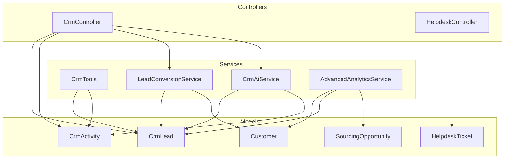
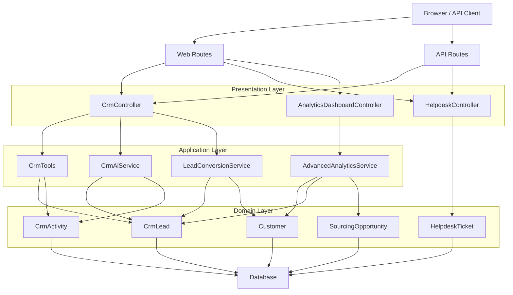
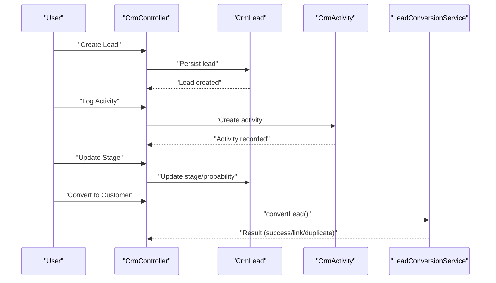
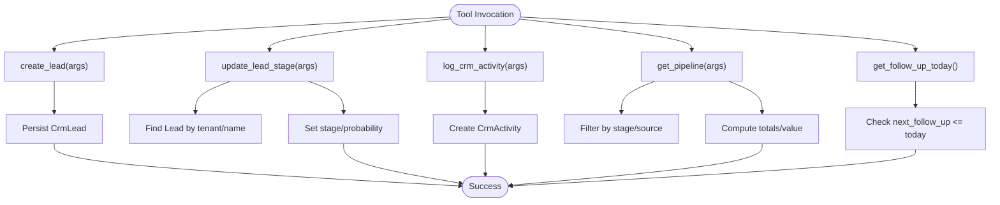
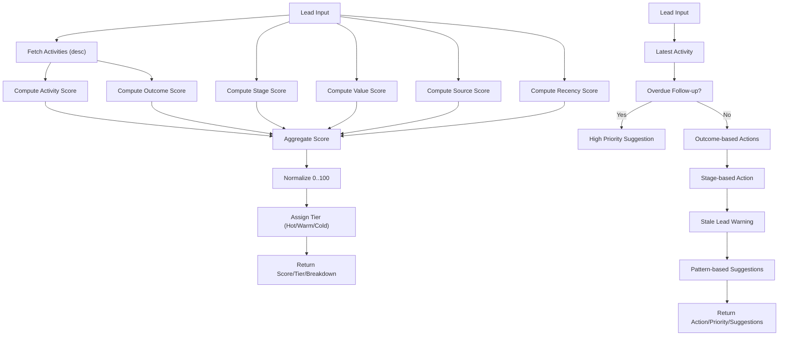
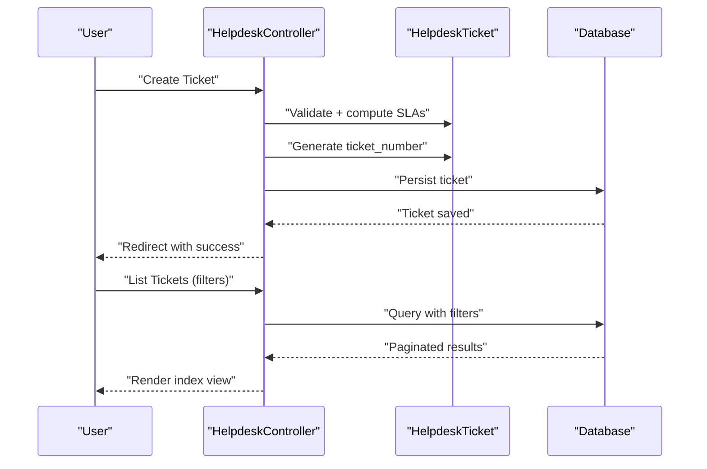
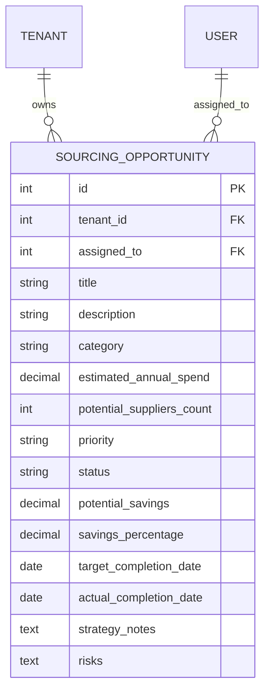
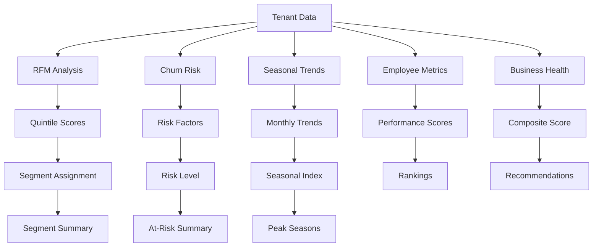
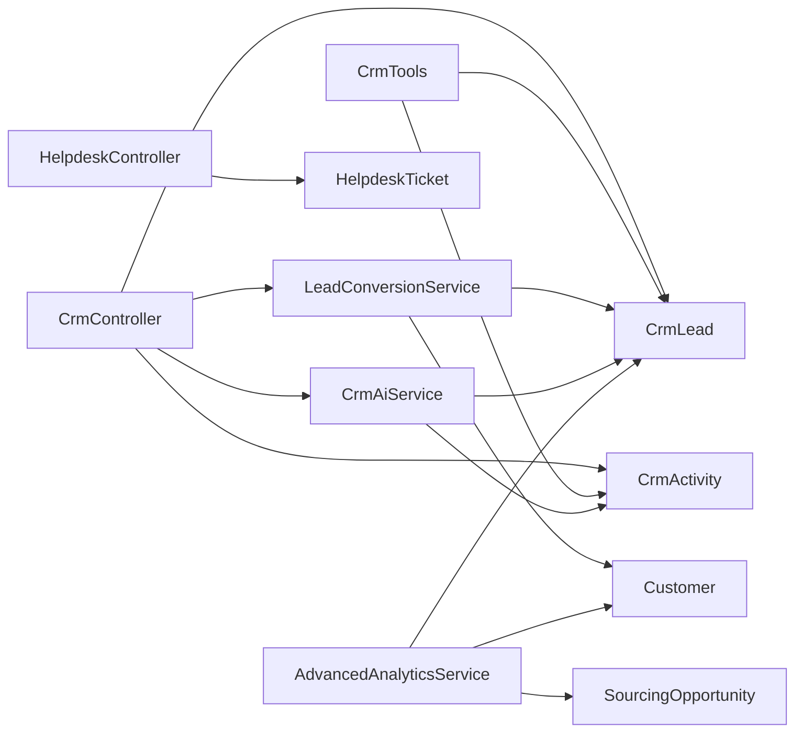

# Customer Relationship Management (CRM)

<cite>
**Referenced Files in This Document**
- [CrmController.php](file://app/Http/Controllers/CrmController.php)
- [CrmTools.php](file://app/Services/ERP/CrmTools.php)
- [CrmAiService.php](file://app/Services/CrmAiService.php)
- [LeadConversionService.php](file://app/Services/LeadConversionService.php)
- [CrmLead.php](file://app/Models/CrmLead.php)
- [CrmActivity.php](file://app/Models/CrmActivity.php)
- [HelpdeskTicket.php](file://app/Models/HelpdeskTicket.php)
- [HelpdeskController.php](file://app/Http/Controllers/HelpdeskController.php)
- [2026_03_25_000007_create_helpdesk_tables.php](file://database/migrations/2026_03_25_000007_create_helpdesk_tables.php)
- [SourcingOpportunity.php](file://app/Models/SourcingOpportunity.php)
- [AdvancedAnalyticsService.php](file://app/Services/AdvancedAnalyticsService.php)
- [AnalyticsDashboardController.php](file://app/Http/Controllers/Analytics/AnalyticsDashboardController.php)
- [Customer.php](file://app/Models/Customer.php)
</cite>

## Table of Contents
1. [Introduction](#introduction)
2. [Project Structure](#project-structure)
3. [Core Components](#core-components)
4. [Architecture Overview](#architecture-overview)
5. [Detailed Component Analysis](#detailed-component-analysis)
6. [Dependency Analysis](#dependency-analysis)
7. [Performance Considerations](#performance-considerations)
8. [Troubleshooting Guide](#troubleshooting-guide)
9. [Conclusion](#conclusion)
10. [Appendices](#appendices)

## Introduction
This document describes the CRM capabilities implemented in the system, focusing on lead management, opportunity tracking, customer service tickets, and sales pipeline management. It also covers AI-powered sales insights, customer segmentation, campaign management, and relationship analytics. The CRM features include lead lifecycle tracking, activity logging, stage-based scoring, automated duplicate detection during conversion, a helpdesk ticketing system with SLA tracking, sourcing opportunities aligned with procurement strategy, and advanced analytics for customer insights and forecasting.

## Project Structure
The CRM system spans models, controllers, services, and migrations:
- Models define domain entities such as leads, activities, customers, and helpdesk tickets.
- Controllers expose HTTP endpoints for lead management, ticketing, and analytics.
- Services encapsulate business logic including AI scoring, lead conversion, and CRM tooling.
- Migrations establish the underlying schema for helpdesk and related entities.

**Diagram sources**
- [CrmController.php:10-233](file://app/Http/Controllers/CrmController.php#L10-L233)
- [HelpdeskController.php:14-88](file://app/Http/Controllers/HelpdeskController.php#L14-L88)
- [CrmTools.php:9-188](file://app/Services/ERP/CrmTools.php#L9-L188)
- [CrmAiService.php:9-185](file://app/Services/CrmAiService.php#L9-L185)
- [LeadConversionService.php:21-331](file://app/Services/LeadConversionService.php#L21-L331)
- [CrmLead.php:9-24](file://app/Models/CrmLead.php#L9-L24)
- [CrmActivity.php:9-22](file://app/Models/CrmActivity.php#L9-L22)
- [HelpdeskTicket.php:11-56](file://app/Models/HelpdeskTicket.php#L11-L56)
- [SourcingOpportunity.php:11-60](file://app/Models/SourcingOpportunity.php#L11-L60)
- [AdvancedAnalyticsService.php:13-811](file://app/Services/AdvancedAnalyticsService.php#L13-L811)

**Section sources**
- [CrmController.php:10-233](file://app/Http/Controllers/CrmController.php#L10-L233)
- [CrmTools.php:9-188](file://app/Services/ERP/CrmTools.php#L9-L188)
- [CrmAiService.php:9-185](file://app/Services/CrmAiService.php#L9-L185)
- [LeadConversionService.php:21-331](file://app/Services/LeadConversionService.php#L21-L331)
- [CrmLead.php:9-24](file://app/Models/CrmLead.php#L9-L24)
- [CrmActivity.php:9-22](file://app/Models/CrmActivity.php#L9-L22)
- [HelpdeskTicket.php:11-56](file://app/Models/HelpdeskTicket.php#L11-L56)
- [HelpdeskController.php:14-88](file://app/Http/Controllers/HelpdeskController.php#L14-L88)
- [2026_03_25_000007_create_helpdesk_tables.php:27-71](file://database/migrations/2026_03_25_000007_create_helpdesk_tables.php#L27-L71)
- [SourcingOpportunity.php:11-60](file://app/Models/SourcingOpportunity.php#L11-L60)
- [AdvancedAnalyticsService.php:13-811](file://app/Services/AdvancedAnalyticsService.php#L13-L811)
- [AnalyticsDashboardController.php:10-48](file://app/Http/Controllers/Analytics/AnalyticsDashboardController.php#L10-L48)
- [Customer.php:14-91](file://app/Models/Customer.php#L14-L91)

## Core Components
- Lead Management
  - Lead lifecycle tracking across stages: new, contacted, qualified, proposal, negotiation, won, lost.
  - Activity logging with outcomes and follow-up scheduling.
  - Stage probability auto-assignment and last contact timestamp updates.
- Opportunity Tracking
  - Sourcing opportunities with status, priority, savings targets, and completion dates.
  - Progress tracking and status updates with strategy notes.
- Customer Service Tickets
  - Helpdesk tickets with SLA tracking, categorization, priority, and assignment.
  - Knowledge base integration and reply/comment threads.
- Sales Pipeline Management
  - Pipeline statistics by stage, weighted value, and monthly won value.
  - Drag-and-drop stage updates and Kanban view support.
- AI-Powered Sales Insights
  - Lead scoring model considering activity volume, recency, outcomes, stage, estimated value, and source.
  - Next action recommendations based on stage and historical patterns.
  - Batch scoring across active leads for tenant-wide prioritization.
- Customer Segmentation and Relationship Analytics
  - RFM analysis for customer segmentation.
  - Churn risk prediction and seasonal trend analysis.
  - Employee performance metrics and business health score.
- Lead Conversion and Duplicate Prevention
  - Comprehensive duplicate detection across email, phone, name+company, and fuzzy matching.
  - Options to link to existing customer or force creation with safety checks.

**Section sources**
- [CrmController.php:17-52](file://app/Http/Controllers/CrmController.php#L17-L52)
- [CrmController.php:81-104](file://app/Http/Controllers/CrmController.php#L81-L104)
- [CrmController.php:106-126](file://app/Http/Controllers/CrmController.php#L106-L126)
- [CrmController.php:128-170](file://app/Http/Controllers/CrmController.php#L128-L170)
- [CrmController.php:193-231](file://app/Http/Controllers/CrmController.php#L193-L231)
- [CrmTools.php:83-107](file://app/Services/ERP/CrmTools.php#L83-L107)
- [CrmTools.php:109-126](file://app/Services/ERP/CrmTools.php#L109-L126)
- [CrmTools.php:150-168](file://app/Services/ERP/CrmTools.php#L150-L168)
- [CrmTools.php:170-188](file://app/Services/ERP/CrmTools.php#L170-L188)
- [CrmAiService.php:14-70](file://app/Services/CrmAiService.php#L14-L70)
- [CrmAiService.php:75-165](file://app/Services/CrmAiService.php#L75-L165)
- [CrmAiService.php:170-183](file://app/Services/CrmAiService.php#L170-L183)
- [LeadConversionService.php:29-181](file://app/Services/LeadConversionService.php#L29-L181)
- [LeadConversionService.php:191-293](file://app/Services/LeadConversionService.php#L191-L293)
- [HelpdeskController.php:20-36](file://app/Http/Controllers/HelpdeskController.php#L20-L36)
- [HelpdeskController.php:67-88](file://app/Http/Controllers/HelpdeskController.php#L67-L88)
- [HelpdeskTicket.php:44-48](file://app/Models/HelpdeskTicket.php#L44-L48)
- [HelpdeskTicket.php:50-54](file://app/Models/HelpdeskTicket.php#L50-L54)
- [SourcingOpportunity.php:15-31](file://app/Models/SourcingOpportunity.php#L15-L31)
- [AdvancedAnalyticsService.php:68-144](file://app/Services/AdvancedAnalyticsService.php#L68-L144)
- [AdvancedAnalyticsService.php:297-355](file://app/Services/AdvancedAnalyticsService.php#L297-L355)
- [AdvancedAnalyticsService.php:360-398](file://app/Services/AdvancedAnalyticsService.php#L360-L398)
- [AdvancedAnalyticsService.php:19-63](file://app/Services/AdvancedAnalyticsService.php#L19-L63)

## Architecture Overview
The CRM system follows a layered architecture:
- Presentation: Controllers handle HTTP requests and render views or JSON responses.
- Application: Services orchestrate business logic, including AI scoring, conversion workflows, and CRM tooling.
- Domain: Models represent entities and enforce relationships and constraints.
- Persistence: Migrations define schema for CRM, helpdesk, and analytics data.

**Diagram sources**
- [CrmController.php:10-233](file://app/Http/Controllers/CrmController.php#L10-L233)
- [HelpdeskController.php:14-88](file://app/Http/Controllers/HelpdeskController.php#L14-L88)
- [AnalyticsDashboardController.php:10-48](file://app/Http/Controllers/Analytics/AnalyticsDashboardController.php#L10-L48)
- [CrmTools.php:9-188](file://app/Services/ERP/CrmTools.php#L9-L188)
- [CrmAiService.php:9-185](file://app/Services/CrmAiService.php#L9-L185)
- [LeadConversionService.php:21-331](file://app/Services/LeadConversionService.php#L21-L331)
- [AdvancedAnalyticsService.php:13-811](file://app/Services/AdvancedAnalyticsService.php#L13-L811)
- [CrmLead.php:9-24](file://app/Models/CrmLead.php#L9-L24)
- [CrmActivity.php:9-22](file://app/Models/CrmActivity.php#L9-L22)
- [HelpdeskTicket.php:11-56](file://app/Models/HelpdeskTicket.php#L11-L56)
- [SourcingOpportunity.php:11-60](file://app/Models/SourcingOpportunity.php#L11-L60)
- [Customer.php:14-91](file://app/Models/Customer.php#L14-L91)

## Detailed Component Analysis

### Lead Management and Pipeline
Lead lifecycle is managed through dedicated controller actions and services:
- Creation validates and persists leads with initial stage and probability.
- Stage updates automatically compute probability and update timestamps.
- Activity logging records interactions, outcomes, and follow-ups.
- Conversion ensures no duplicates and supports linking to existing customers.

**Diagram sources**
- [CrmController.php:54-104](file://app/Http/Controllers/CrmController.php#L54-L104)
- [CrmController.php:106-126](file://app/Http/Controllers/CrmController.php#L106-L126)
- [CrmController.php:128-170](file://app/Http/Controllers/CrmController.php#L128-L170)
- [LeadConversionService.php:191-293](file://app/Services/LeadConversionService.php#L191-L293)

**Section sources**
- [CrmController.php:17-52](file://app/Http/Controllers/CrmController.php#L17-L52)
- [CrmController.php:54-104](file://app/Http/Controllers/CrmController.php#L54-L104)
- [CrmController.php:106-126](file://app/Http/Controllers/CrmController.php#L106-L126)
- [CrmController.php:128-170](file://app/Http/Controllers/CrmController.php#L128-L170)
- [CrmController.php:193-231](file://app/Http/Controllers/CrmController.php#L193-L231)
- [CrmLead.php:9-24](file://app/Models/CrmLead.php#L9-L24)
- [CrmActivity.php:9-22](file://app/Models/CrmActivity.php#L9-L22)
- [LeadConversionService.php:29-181](file://app/Services/LeadConversionService.php#L29-L181)
- [LeadConversionService.php:191-293](file://app/Services/LeadConversionService.php#L191-L293)

### CRM Tools and Pipeline Operations
The CRM tools service exposes commands for creating leads, updating stages, logging activities, retrieving pipeline metrics, and identifying follow-ups.

**Diagram sources**
- [CrmTools.php:13-81](file://app/Services/ERP/CrmTools.php#L13-L81)
- [CrmTools.php:83-107](file://app/Services/ERP/CrmTools.php#L83-L107)
- [CrmTools.php:109-126](file://app/Services/ERP/CrmTools.php#L109-L126)
- [CrmTools.php:150-168](file://app/Services/ERP/CrmTools.php#L150-L168)
- [CrmTools.php:170-188](file://app/Services/ERP/CrmTools.php#L170-L188)

**Section sources**
- [CrmTools.php:13-81](file://app/Services/ERP/CrmTools.php#L13-L81)
- [CrmTools.php:83-107](file://app/Services/ERP/CrmTools.php#L83-L107)
- [CrmTools.php:109-126](file://app/Services/ERP/CrmTools.php#L109-L126)
- [CrmTools.php:150-168](file://app/Services/ERP/CrmTools.php#L150-L168)
- [CrmTools.php:170-188](file://app/Services/ERP/CrmTools.php#L170-L188)

### AI-Powered Sales Insights
The CRM AI service computes lead scores and suggests next actions:
- Scoring considers activity volume, recency, outcomes, stage, estimated value, and source.
- Recommendations adapt to stage, recent activity, and successful patterns observed across tenants.
- Batch scoring enables tenant-wide prioritization.

**Diagram sources**
- [CrmAiService.php:14-70](file://app/Services/CrmAiService.php#L14-L70)
- [CrmAiService.php:75-165](file://app/Services/CrmAiService.php#L75-L165)

**Section sources**
- [CrmAiService.php:14-70](file://app/Services/CrmAiService.php#L14-L70)
- [CrmAiService.php:75-165](file://app/Services/CrmAiService.php#L75-L165)
- [CrmAiService.php:170-183](file://app/Services/CrmAiService.php#L170-L183)

### Customer Service Tickets (Helpdesk)
The helpdesk module manages tickets with SLA tracking, categorization, and assignment:
- Tickets are created with automatic numbering and default SLAs, adjusted by contract priority.
- Index and filtering by status, priority, assignee, and search terms.
- Overdue detection and status indicators.

**Diagram sources**
- [HelpdeskController.php:20-36](file://app/Http/Controllers/HelpdeskController.php#L20-L36)
- [HelpdeskController.php:67-88](file://app/Http/Controllers/HelpdeskController.php#L67-L88)
- [HelpdeskTicket.php:44-48](file://app/Models/HelpdeskTicket.php#L44-L48)
- [HelpdeskTicket.php:50-54](file://app/Models/HelpdeskTicket.php#L50-L54)
- [2026_03_25_000007_create_helpdesk_tables.php:27-71](file://database/migrations/2026_03_25_000007_create_helpdesk_tables.php#L27-L71)

**Section sources**
- [HelpdeskController.php:20-36](file://app/Http/Controllers/HelpdeskController.php#L20-L36)
- [HelpdeskController.php:67-88](file://app/Http/Controllers/HelpdeskController.php#L67-L88)
- [HelpdeskTicket.php:44-48](file://app/Models/HelpdeskTicket.php#L44-L48)
- [HelpdeskTicket.php:50-54](file://app/Models/HelpdeskTicket.php#L50-L54)
- [2026_03_25_000007_create_helpdesk_tables.php:27-71](file://database/migrations/2026_03_25_000007_create_helpdesk_tables.php#L27-L71)

### Opportunity Tracking (Sourcing)
Sourcing opportunities align with procurement strategy:
- Entities track title, category, annual spend, potential savings, priority, status, and completion dates.
- Status updates and strategy notes enable progress tracking.

**Diagram sources**
- [SourcingOpportunity.php:11-60](file://app/Models/SourcingOpportunity.php#L11-L60)

**Section sources**
- [SourcingOpportunity.php:15-31](file://app/Models/SourcingOpportunity.php#L15-L31)
- [SourcingOpportunity.php:41-49](file://app/Models/SourcingOpportunity.php#L41-L49)
- [SourcingOpportunity.php:50-59](file://app/Models/SourcingOpportunity.php#L50-L59)

### Customer Segmentation and Relationship Analytics
Advanced analytics provide:
- RFM analysis for customer segmentation across recency, frequency, and monetary metrics.
- Churn risk prediction with risk factors and summaries.
- Seasonal trend analysis with peak seasons and YoY comparisons.
- Employee performance metrics and business health score.

**Diagram sources**
- [AdvancedAnalyticsService.php:68-144](file://app/Services/AdvancedAnalyticsService.php#L68-L144)
- [AdvancedAnalyticsService.php:297-355](file://app/Services/AdvancedAnalyticsService.php#L297-L355)
- [AdvancedAnalyticsService.php:360-398](file://app/Services/AdvancedAnalyticsService.php#L360-L398)
- [AdvancedAnalyticsService.php:19-63](file://app/Services/AdvancedAnalyticsService.php#L19-L63)

**Section sources**
- [AdvancedAnalyticsService.php:68-144](file://app/Services/AdvancedAnalyticsService.php#L68-L144)
- [AdvancedAnalyticsService.php:297-355](file://app/Services/AdvancedAnalyticsService.php#L297-L355)
- [AdvancedAnalyticsService.php:360-398](file://app/Services/AdvancedAnalyticsService.php#L360-L398)
- [AdvancedAnalyticsService.php:19-63](file://app/Services/AdvancedAnalyticsService.php#L19-L63)
- [AnalyticsDashboardController.php:42-48](file://app/Http/Controllers/Analytics/AnalyticsDashboardController.php#L42-L48)
- [Customer.php:69-89](file://app/Models/Customer.php#L69-L89)

## Dependency Analysis
The CRM system exhibits clear separation of concerns:
- Controllers depend on models and services.
- Services encapsulate business logic and coordinate with models.
- Models define relationships and constraints.
- Migrations define schema boundaries.

**Diagram sources**
- [CrmController.php:10-233](file://app/Http/Controllers/CrmController.php#L10-L233)
- [HelpdeskController.php:14-88](file://app/Http/Controllers/HelpdeskController.php#L14-L88)
- [CrmTools.php:9-188](file://app/Services/ERP/CrmTools.php#L9-L188)
- [CrmAiService.php:9-185](file://app/Services/CrmAiService.php#L9-L185)
- [LeadConversionService.php:21-331](file://app/Services/LeadConversionService.php#L21-L331)
- [AdvancedAnalyticsService.php:13-811](file://app/Services/AdvancedAnalyticsService.php#L13-L811)
- [CrmLead.php:9-24](file://app/Models/CrmLead.php#L9-L24)
- [CrmActivity.php:9-22](file://app/Models/CrmActivity.php#L9-L22)
- [HelpdeskTicket.php:11-56](file://app/Models/HelpdeskTicket.php#L11-L56)
- [SourcingOpportunity.php:11-60](file://app/Models/SourcingOpportunity.php#L11-L60)
- [Customer.php:14-91](file://app/Models/Customer.php#L14-L91)

**Section sources**
- [CrmController.php:10-233](file://app/Http/Controllers/CrmController.php#L10-L233)
- [HelpdeskController.php:14-88](file://app/Http/Controllers/HelpdeskController.php#L14-L88)
- [CrmTools.php:9-188](file://app/Services/ERP/CrmTools.php#L9-L188)
- [CrmAiService.php:9-185](file://app/Services/CrmAiService.php#L9-L185)
- [LeadConversionService.php:21-331](file://app/Services/LeadConversionService.php#L21-L331)
- [AdvancedAnalyticsService.php:13-811](file://app/Services/AdvancedAnalyticsService.php#L13-L811)

## Performance Considerations
- Use pagination for lead and ticket listings to avoid large result sets.
- Indexes on tenant_id, status, and assignee improve query performance.
- Batch operations for AI scoring reduce repeated queries.
- Denormalized pipeline aggregations minimize complex joins on dashboards.
- SLA computations rely on datetime comparisons; ensure proper timezone handling.

## Troubleshooting Guide
- Unauthorized Access
  - Controllers enforce tenant scoping; mismatches return forbidden errors.
  - Ticket portal access checks ensure tickets belong to the authenticated customer and tenant.
- Duplicate Leads During Conversion
  - Use the duplicate-check endpoint prior to conversion to review potential duplicates.
  - Choose to link to existing customer or force creation with warnings.
- Overdue Tickets
  - Overdue detection evaluates SLA resolve due dates; overdue tickets are flagged in views.
- Stage Probability Defaults
  - Automatic probability assignments occur when not provided; verify stage mappings align with expectations.

**Section sources**
- [CrmController.php:81-104](file://app/Http/Controllers/CrmController.php#L81-L104)
- [CrmController.php:172-183](file://app/Http/Controllers/CrmController.php#L172-L183)
- [LeadConversionService.php:201-225](file://app/Services/LeadConversionService.php#L201-L225)
- [HelpdeskTicket.php:44-48](file://app/Models/HelpdeskTicket.php#L44-L48)
- [HelpdeskController.php:29-33](file://app/Http/Controllers/HelpdeskController.php#L29-L33)

## Conclusion
The CRM system provides a robust foundation for managing leads, tracking opportunities, servicing customers via tickets, and leveraging AI-driven insights. It integrates analytics for segmentation, churn prediction, and forecasting, while ensuring data integrity through tenant isolation, duplicate prevention, and SLA-aware workflows. The modular design allows for incremental enhancements to campaigns, segmentation strategies, and pipeline automation.

## Appendices
- API and Endpoint Notes
  - Lead endpoints include listing, creation, stage updates, activity logging, conversion, duplicate checks, and Kanban view.
  - Helpdesk endpoints include listing with filters, creation with SLA computation, and ticket retrieval.
  - Analytics endpoints expose segmentation, churn risk, seasonal trends, and performance metrics.
- Data Model Notes
  - Tenant isolation is enforced via tenant_id on all CRM and helpdesk entities.
  - SLA fields support response and resolution due dates with boolean flags for compliance.
  - Activity outcomes and follow-up scheduling support intelligent next-action recommendations.