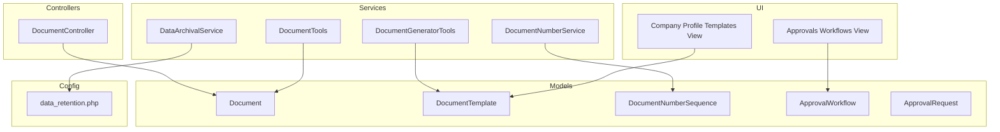
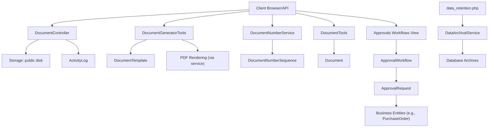
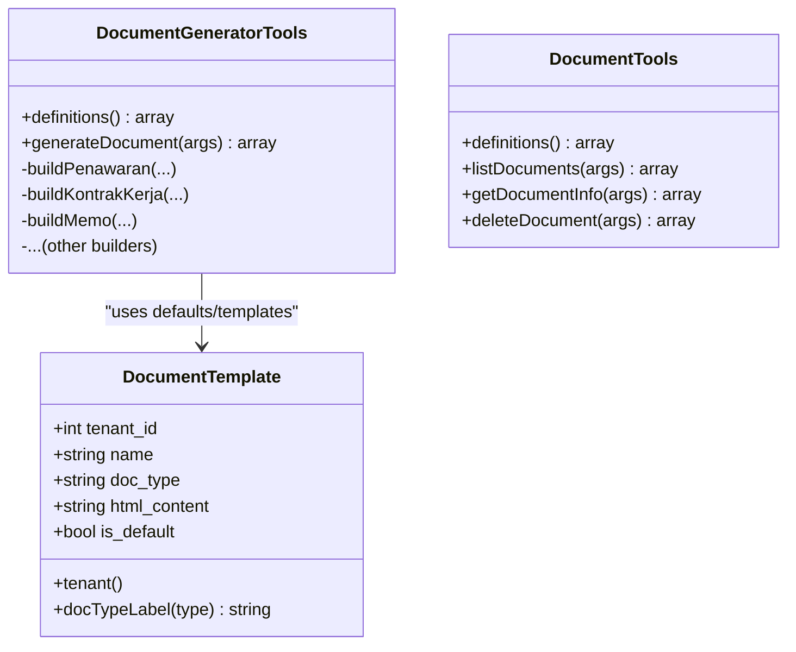
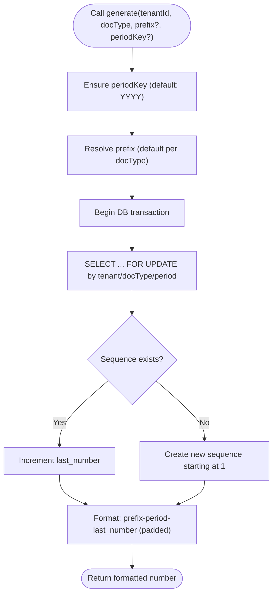
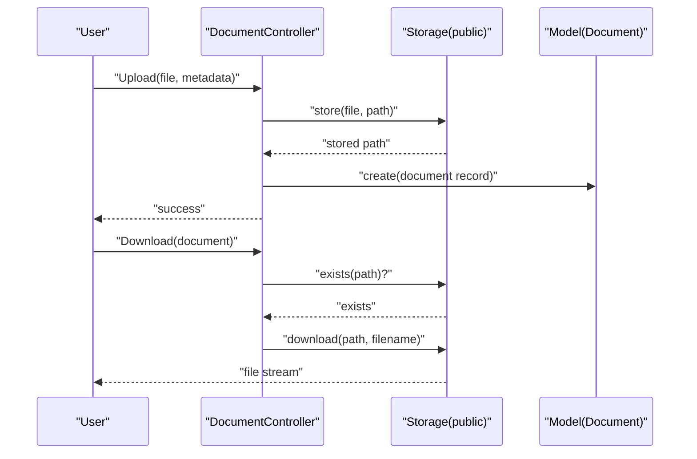
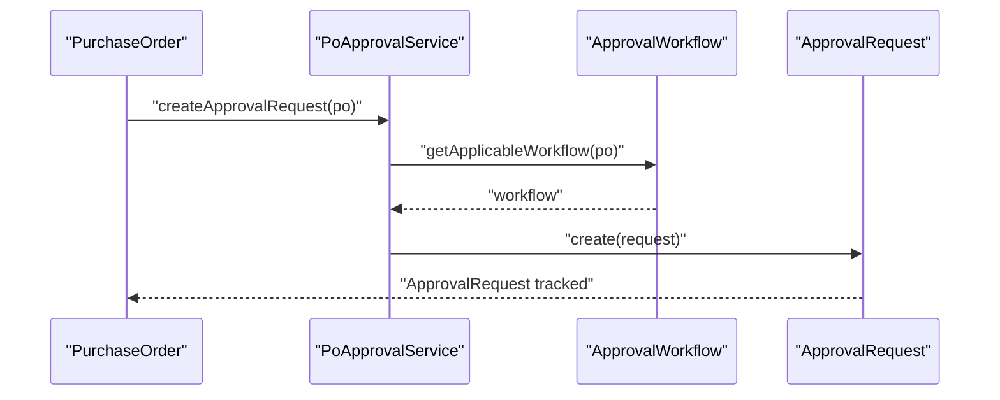
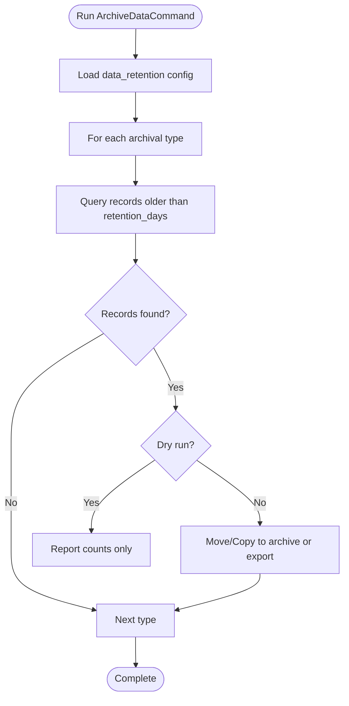
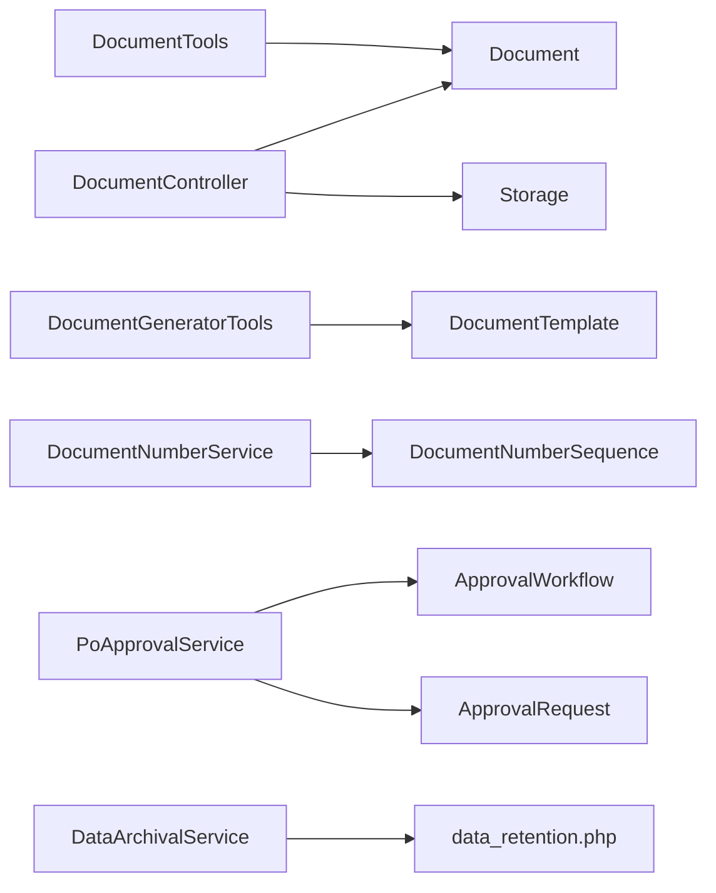

# Document Management

<cite>
**Referenced Files in This Document**
- [Document.php](file://app/Models/Document.php)
- [DocumentTemplate.php](file://app/Models/DocumentTemplate.php)
- [DocumentNumberSequence.php](file://app/Models/DocumentNumberSequence.php)
- [DocumentController.php](file://app/Http/Controllers/DocumentController.php)
- [DocumentNumberService.php](file://app/Services/DocumentNumberService.php)
- [DocumentGeneratorTools.php](file://app/Services/ERP/DocumentGeneratorTools.php)
- [DocumentTools.php](file://app/Services/ERP/DocumentTools.php)
- [PoApprovalService.php](file://app/Services/PoApprovalService.php)
- [ApprovalWorkflow.php](file://app/Models/ApprovalWorkflow.php)
- [ApprovalRequest.php](file://app/Models/ApprovalRequest.php)
- [DataArchivalService.php](file://app/Services/DataArchivalService.php)
- [data_retention.php](file://config/data_retention.php)
- [ArchiveDataCommand.php](file://app/Console/Commands/ArchiveDataCommand.php)
- [CompanyProfileController.php](file://app/Http/Controllers/CompanyProfileController.php)
- [workflows.blade.php](file://resources/views/approvals/workflows.blade.php)
- [company-profile.blade.php](file://resources/views/settings/company-profile.blade.php)
</cite>

## Table of Contents
1. [Introduction](#introduction)
2. [Project Structure](#project-structure)
3. [Core Components](#core-components)
4. [Architecture Overview](#architecture-overview)
5. [Detailed Component Analysis](#detailed-component-analysis)
6. [Dependency Analysis](#dependency-analysis)
7. [Performance Considerations](#performance-considerations)
8. [Troubleshooting Guide](#troubleshooting-guide)
9. [Conclusion](#conclusion)
10. [Appendices](#appendices)

## Introduction
This document describes the Document Management capabilities implemented in the system, focusing on:
- Document templates and automated generation
- Centralized document numbering and versioning
- Approval workflows and integration with business processes
- Storage, retrieval, and archival policies

It is designed for both technical and non-technical audiences to understand how documents are modeled, generated, numbered, approved, stored, retrieved, and archived.

## Project Structure
Document Management spans models, services, controllers, configuration, and views:
- Models define document metadata, templates, and numbering sequences
- Services implement generation, numbering, and archival logic
- Controllers manage upload, download, and deletion
- Configuration defines retention and archival schedules
- Views enable template management and workflow creation

**Diagram sources**
- [Document.php:1-29](file://app/Models/Document.php#L1-L29)
- [DocumentTemplate.php:1-39](file://app/Models/DocumentTemplate.php#L1-L39)
- [DocumentNumberSequence.php:1-20](file://app/Models/DocumentNumberSequence.php#L1-L20)
- [DocumentController.php:1-90](file://app/Http/Controllers/DocumentController.php#L1-L90)
- [DocumentGeneratorTools.php:1-218](file://app/Services/ERP/DocumentGeneratorTools.php#L1-L218)
- [DocumentTools.php:1-132](file://app/Services/ERP/DocumentTools.php#L1-L132)
- [DocumentNumberService.php:1-133](file://app/Services/DocumentNumberService.php#L1-L133)
- [DataArchivalService.php:104-187](file://app/Services/DataArchivalService.php#L104-L187)
- [data_retention.php:1-293](file://config/data_retention.php#L1-L293)
- [workflows.blade.php:1-21](file://resources/views/approvals/workflows.blade.php#L1-L21)
- [company-profile.blade.php:212-249](file://resources/views/settings/company-profile.blade.php#L212-L249)

**Section sources**
- [Document.php:1-29](file://app/Models/Document.php#L1-L29)
- [DocumentTemplate.php:1-39](file://app/Models/DocumentTemplate.php#L1-L39)
- [DocumentNumberSequence.php:1-20](file://app/Models/DocumentNumberSequence.php#L1-L20)
- [DocumentController.php:1-90](file://app/Http/Controllers/DocumentController.php#L1-L90)
- [DocumentGeneratorTools.php:1-218](file://app/Services/ERP/DocumentGeneratorTools.php#L1-L218)
- [DocumentTools.php:1-132](file://app/Services/ERP/DocumentTools.php#L1-L132)
- [DocumentNumberService.php:1-133](file://app/Services/DocumentNumberService.php#L1-L133)
- [DataArchivalService.php:104-187](file://app/Services/DataArchivalService.php#L104-L187)
- [data_retention.php:1-293](file://config/data_retention.php#L1-L293)
- [workflows.blade.php:1-21](file://resources/views/approvals/workflows.blade.php#L1-L21)
- [company-profile.blade.php:212-249](file://resources/views/settings/company-profile.blade.php#L212-L249)

## Core Components
- Document model: stores metadata for uploaded files and supports morph relations to business entities
- DocumentTemplate model: manages reusable HTML templates per tenant and document type
- DocumentNumberSequence model and DocumentNumberService: centralized, sequential numbering with configurable prefixes and periods
- DocumentController: handles upload, download, and deletion with tenant scoping and activity logging
- DocumentGeneratorTools and DocumentTools: generate printable documents and manage stored documents
- ApprovalWorkflow and ApprovalRequest: define and track approval workflows and requests
- DataArchivalService and configuration: enforce retention and archival policies

**Section sources**
- [Document.php:1-29](file://app/Models/Document.php#L1-L29)
- [DocumentTemplate.php:1-39](file://app/Models/DocumentTemplate.php#L1-L39)
- [DocumentNumberSequence.php:1-20](file://app/Models/DocumentNumberSequence.php#L1-L20)
- [DocumentController.php:1-90](file://app/Http/Controllers/DocumentController.php#L1-L90)
- [DocumentGeneratorTools.php:1-218](file://app/Services/ERP/DocumentGeneratorTools.php#L1-L218)
- [DocumentTools.php:1-132](file://app/Services/ERP/DocumentTools.php#L1-L132)
- [DocumentNumberService.php:1-133](file://app/Services/DocumentNumberService.php#L1-L133)
- [ApprovalWorkflow.php:1-33](file://app/Models/ApprovalWorkflow.php#L1-L33)
- [ApprovalRequest.php:1-25](file://app/Models/ApprovalRequest.php#L1-L25)
- [DataArchivalService.php:104-187](file://app/Services/DataArchivalService.php#L104-L187)
- [data_retention.php:1-293](file://config/data_retention.php#L1-L293)

## Architecture Overview
The system separates concerns across models, services, and controllers:
- Controllers orchestrate user actions and delegate to services
- Services encapsulate business logic (generation, numbering, archival)
- Models persist data with tenant scoping and morph relations
- Configuration governs retention and compliance policies

**Diagram sources**
- [DocumentController.php:1-90](file://app/Http/Controllers/DocumentController.php#L1-L90)
- [DocumentGeneratorTools.php:1-218](file://app/Services/ERP/DocumentGeneratorTools.php#L1-L218)
- [DocumentNumberService.php:1-133](file://app/Services/DocumentNumberService.php#L1-L133)
- [DocumentTools.php:1-132](file://app/Services/ERP/DocumentTools.php#L1-L132)
- [Document.php:1-29](file://app/Models/Document.php#L1-L29)
- [DocumentTemplate.php:1-39](file://app/Models/DocumentTemplate.php#L1-L39)
- [DocumentNumberSequence.php:1-20](file://app/Models/DocumentNumberSequence.php#L1-L20)
- [ApprovalWorkflow.php:1-33](file://app/Models/ApprovalWorkflow.php#L1-L33)
- [ApprovalRequest.php:1-25](file://app/Models/ApprovalRequest.php#L1-L25)
- [data_retention.php:1-293](file://config/data_retention.php#L1-L293)
- [DataArchivalService.php:104-187](file://app/Services/DataArchivalService.php#L104-L187)

## Detailed Component Analysis

### Document Templates and Automated Generation
- Templates: stored per tenant and document type, with a default flag per type
- Generation: tools produce structured document bodies (e.g., quotations, contracts, memos) based on inputs and tenant profile
- Retrieval: stored documents can be listed, searched, and deleted

**Diagram sources**
- [DocumentTemplate.php:1-39](file://app/Models/DocumentTemplate.php#L1-L39)
- [DocumentGeneratorTools.php:1-218](file://app/Services/ERP/DocumentGeneratorTools.php#L1-L218)
- [DocumentTools.php:1-132](file://app/Services/ERP/DocumentTools.php#L1-L132)

**Section sources**
- [DocumentTemplate.php:1-39](file://app/Models/DocumentTemplate.php#L1-L39)
- [DocumentGeneratorTools.php:1-218](file://app/Services/ERP/DocumentGeneratorTools.php#L1-L218)
- [DocumentTools.php:1-132](file://app/Services/ERP/DocumentTools.php#L1-L132)
- [company-profile.blade.php:212-249](file://resources/views/settings/company-profile.blade.php#L212-L249)

### Document Numbering and Version Control
- Centralized sequences per tenant, document type, and period
- Atomic increments with database locks to prevent race conditions
- Default prefixes per document type; optional monthly period variant
- No built-in document versioning; numbering is sequential and non-repeating

**Diagram sources**
- [DocumentNumberService.php:39-76](file://app/Services/DocumentNumberService.php#L39-L76)
- [DocumentNumberSequence.php:1-20](file://app/Models/DocumentNumberSequence.php#L1-L20)

**Section sources**
- [DocumentNumberService.php:1-133](file://app/Services/DocumentNumberService.php#L1-L133)
- [DocumentNumberSequence.php:1-20](file://app/Models/DocumentNumberSequence.php#L1-L20)

### Document Lifecycle Management (Storage, Retrieval, Deletion)
- Upload: validated, stored on public disk under tenant-specific path, metadata persisted
- Download: tenant-scoped access check, file existence verification, download with activity log
- Delete: tenant-scoped access check, file removal from storage, record deletion with activity log
- Search and filtering: by category and free-text search on title/description/tags

**Diagram sources**
- [DocumentController.php:37-77](file://app/Http/Controllers/DocumentController.php#L37-L77)
- [Document.php:1-29](file://app/Models/Document.php#L1-L29)

**Section sources**
- [DocumentController.php:1-90](file://app/Http/Controllers/DocumentController.php#L1-L90)
- [Document.php:1-29](file://app/Models/Document.php#L1-L29)
- [DocumentTools.php:52-131](file://app/Services/ERP/DocumentTools.php#L52-L131)

### Approval Workflows and Integration with Business Processes
- Approval workflows define approver roles and amount thresholds per tenant and model type
- Approval requests are created against business entities (e.g., PurchaseOrder), tracked with status and audit
- Integration: purchase orders trigger approval requests based on workflow applicability

**Diagram sources**
- [PoApprovalService.php:119-350](file://app/Services/PoApprovalService.php#L119-L350)
- [ApprovalWorkflow.php:1-33](file://app/Models/ApprovalWorkflow.php#L1-L33)
- [ApprovalRequest.php:1-25](file://app/Models/ApprovalRequest.php#L1-L25)

**Section sources**
- [PoApprovalService.php:119-350](file://app/Services/PoApprovalService.php#L119-L350)
- [ApprovalWorkflow.php:1-33](file://app/Models/ApprovalWorkflow.php#L1-L33)
- [ApprovalRequest.php:1-25](file://app/Models/ApprovalRequest.php#L1-L25)
- [workflows.blade.php:1-21](file://resources/views/approvals/workflows.blade.php#L1-L21)

### Archival Policies and Data Retention
- Retention periods configured per data type
- Archival service moves eligible records to archive tables or exports based on configuration
- Compliance holds and soft-delete options for sensitive data
- Scheduled runs via console command and cron

**Diagram sources**
- [ArchiveDataCommand.php:1-195](file://app/Console/Commands/ArchiveDataCommand.php#L1-L195)
- [DataArchivalService.php:104-187](file://app/Services/DataArchivalService.php#L104-L187)
- [data_retention.php:1-293](file://config/data_retention.php#L1-L293)

**Section sources**
- [ArchiveDataCommand.php:1-195](file://app/Console/Commands/ArchiveDataCommand.php#L1-L195)
- [DataArchivalService.php:104-187](file://app/Services/DataArchivalService.php#L104-L187)
- [data_retention.php:1-293](file://config/data_retention.php#L1-L293)

## Dependency Analysis
- Controllers depend on models and storage
- Services encapsulate domain logic and are reused across controllers and commands
- Models depend on tenant scoping traits and Eloquent relationships
- Configuration drives archival behavior and compliance handling

**Diagram sources**
- [DocumentController.php:1-90](file://app/Http/Controllers/DocumentController.php#L1-L90)
- [Document.php:1-29](file://app/Models/Document.php#L1-L29)
- [DocumentGeneratorTools.php:1-218](file://app/Services/ERP/DocumentGeneratorTools.php#L1-L218)
- [DocumentTools.php:1-132](file://app/Services/ERP/DocumentTools.php#L1-L132)
- [DocumentNumberService.php:1-133](file://app/Services/DocumentNumberService.php#L1-L133)
- [DocumentNumberSequence.php:1-20](file://app/Models/DocumentNumberSequence.php#L1-L20)
- [PoApprovalService.php:119-350](file://app/Services/PoApprovalService.php#L119-L350)
- [ApprovalWorkflow.php:1-33](file://app/Models/ApprovalWorkflow.php#L1-L33)
- [ApprovalRequest.php:1-25](file://app/Models/ApprovalRequest.php#L1-L25)
- [DataArchivalService.php:104-187](file://app/Services/DataArchivalService.php#L104-L187)
- [data_retention.php:1-293](file://config/data_retention.php#L1-L293)

**Section sources**
- [DocumentController.php:1-90](file://app/Http/Controllers/DocumentController.php#L1-L90)
- [Document.php:1-29](file://app/Models/Document.php#L1-L29)
- [DocumentGeneratorTools.php:1-218](file://app/Services/ERP/DocumentGeneratorTools.php#L1-L218)
- [DocumentTools.php:1-132](file://app/Services/ERP/DocumentTools.php#L1-L132)
- [DocumentNumberService.php:1-133](file://app/Services/DocumentNumberService.php#L1-L133)
- [DocumentNumberSequence.php:1-20](file://app/Models/DocumentNumberSequence.php#L1-L20)
- [PoApprovalService.php:119-350](file://app/Services/PoApprovalService.php#L119-L350)
- [ApprovalWorkflow.php:1-33](file://app/Models/ApprovalWorkflow.php#L1-L33)
- [ApprovalRequest.php:1-25](file://app/Models/ApprovalRequest.php#L1-L25)
- [DataArchivalService.php:104-187](file://app/Services/DataArchivalService.php#L104-L187)
- [data_retention.php:1-293](file://config/data_retention.php#L1-L293)

## Performance Considerations
- Numbering service uses row-level locking to avoid race conditions; keep transaction durations short
- Archival operations process in batches; tune batch size and timeout for large datasets
- Storage operations are I/O bound; ensure adequate disk throughput and consider CDN for downloads
- Indexing on tenant_id, doc_type, and period_key improves numbering and archival queries

## Troubleshooting Guide
- Upload fails: verify file size limits and MIME type validation; confirm storage permissions
- Download returns 404: ensure file exists on public disk and path matches stored file_path
- Approval request not created: confirm applicable workflow exists and amount thresholds match
- Archival not running: check scheduled frequency and environment variables; inspect command output

**Section sources**
- [DocumentController.php:37-90](file://app/Http/Controllers/DocumentController.php#L37-L90)
- [PoApprovalService.php:119-350](file://app/Services/PoApprovalService.php#L119-L350)
- [ArchiveDataCommand.php:1-195](file://app/Console/Commands/ArchiveDataCommand.php#L1-L195)

## Conclusion
The Document Management subsystem provides a robust foundation for templates, automated generation, centralized numbering, approval workflows, and archival. It emphasizes tenant isolation, compliance-aware retention, and scalable storage operations.

## Appendices
- Template management UI enables creation, editing, and deletion of document templates per tenant and type
- Workflow management UI supports creation and activation of approval workflows

**Section sources**
- [company-profile.blade.php:212-249](file://resources/views/settings/company-profile.blade.php#L212-L249)
- [workflows.blade.php:1-21](file://resources/views/approvals/workflows.blade.php#L1-L21)