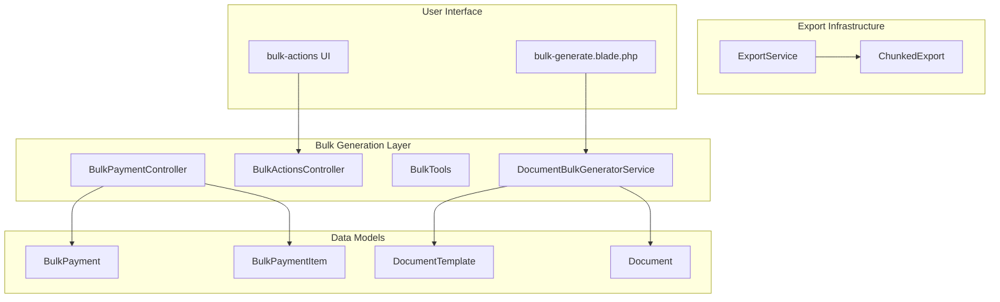
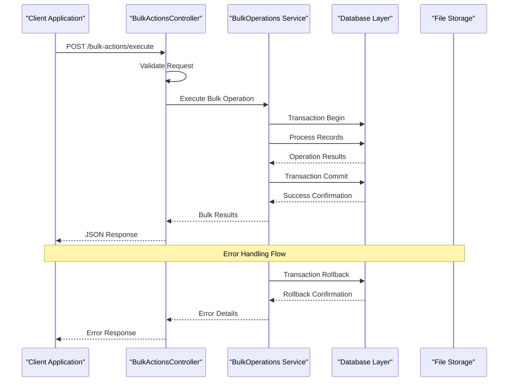
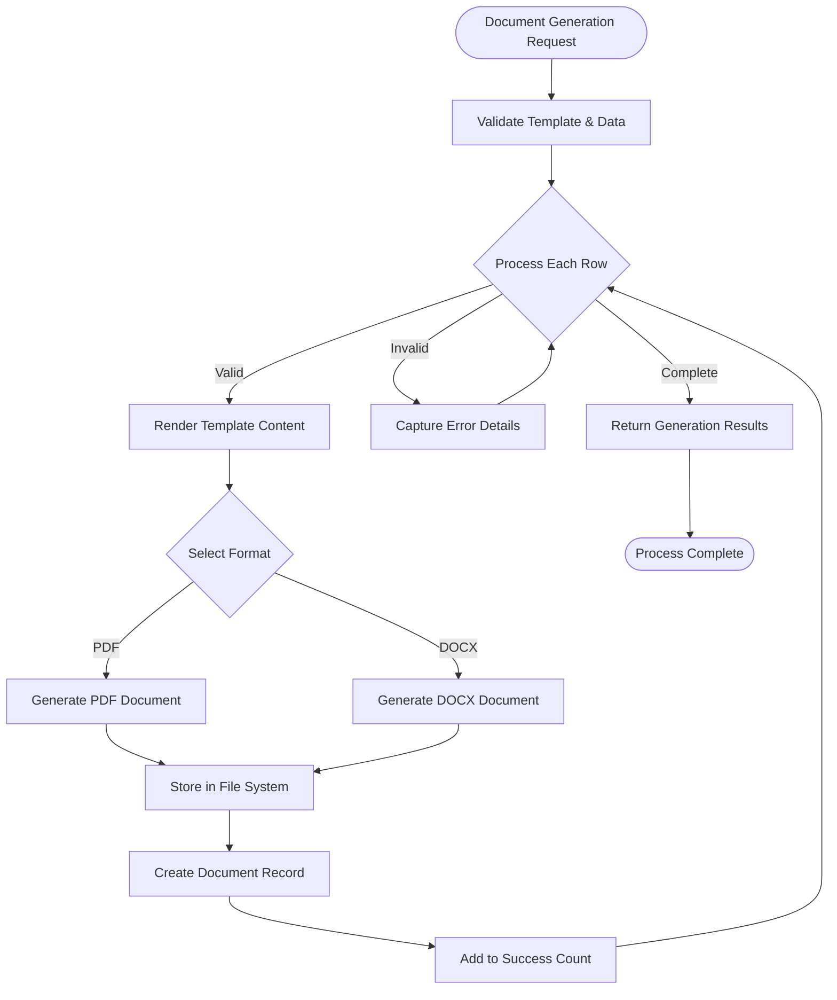
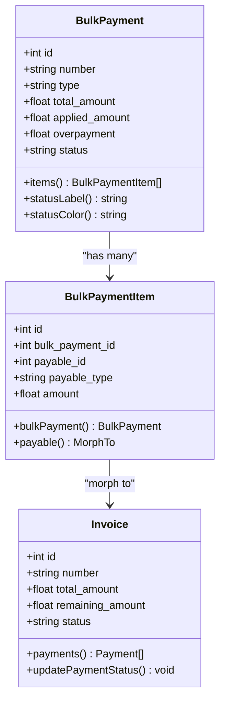
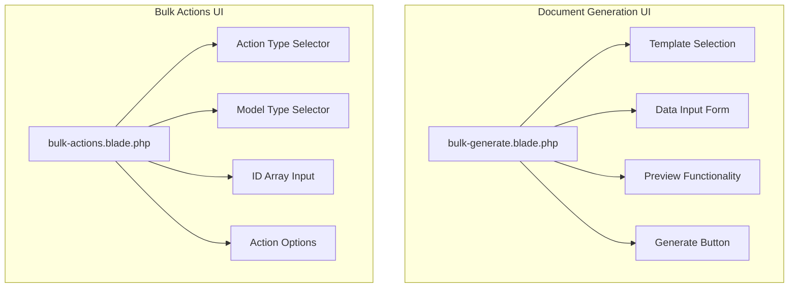

# Document Bulk Generation

<cite>
**Referenced Files in This Document**
- [DocumentBulkGeneratorService.php](file://app/Services/DocumentBulkGeneratorService.php)
- [BulkActionsController.php](file://app/Http/Controllers/BulkActionsController.php)
- [BulkTools.php](file://app/Services/ERP/BulkTools.php)
- [BulkPayment.php](file://app/Models/BulkPayment.php)
- [BulkPaymentItem.php](file://app/Models/BulkPaymentItem.php)
- [BulkPaymentController.php](file://app/Http/Controllers/BulkPaymentController.php)
- [ExportService.php](file://app/Services/ExportService.php)
- [ChunkedExport.php](file://app/Exports/ChunkedExport.php)
- [web.php](file://routes/web.php)
- [bulk-generate.blade.php](file://resources/views/documents/bulk-generate.blade.php)
</cite>

## Table of Contents
1. [Introduction](#introduction)
2. [Project Structure](#project-structure)
3. [Core Components](#core-components)
4. [Architecture Overview](#architecture-overview)
5. [Detailed Component Analysis](#detailed-component-analysis)
6. [Bulk Operations Ecosystem](#bulk-operations-ecosystem)
7. [Performance Considerations](#performance-considerations)
8. [Troubleshooting Guide](#troubleshooting-guide)
9. [Conclusion](#conclusion)

## Introduction

The qalcuityERP system provides comprehensive bulk generation capabilities through multiple specialized services and controllers. This documentation focuses on the document bulk generation system, which enables organizations to efficiently create multiple documents from templates, process bulk payment operations, and manage large-scale data exports. The system is designed to handle high-volume operations while maintaining data integrity and providing robust error handling mechanisms.

The bulk generation ecosystem consists of three primary components: document template processing, bulk payment automation, and scalable export services. Each component is built with enterprise-grade reliability, supporting thousands of concurrent operations through optimized database queries, transaction management, and asynchronous processing.

## Project Structure

The bulk generation functionality is distributed across several key areas of the application architecture:

**Diagram sources**
- [DocumentBulkGeneratorService.php:18-255](file://app/Services/DocumentBulkGeneratorService.php#L18-L255)
- [BulkActionsController.php:9-223](file://app/Http/Controllers/BulkActionsController.php#L9-L223)
- [BulkTools.php:7-122](file://app/Services/ERP/BulkTools.php#L7-L122)

**Section sources**
- [DocumentBulkGeneratorService.php:1-255](file://app/Services/DocumentBulkGeneratorService.php#L1-L255)
- [BulkActionsController.php:1-223](file://app/Http/Controllers/BulkActionsController.php#L1-L223)
- [BulkTools.php:1-122](file://app/Services/ERP/BulkTools.php#L1-L122)

## Core Components

### Document Bulk Generator Service

The DocumentBulkGeneratorService serves as the central orchestrator for document template processing and batch generation operations. It provides comprehensive support for creating multiple documents from templates with advanced formatting options and error handling.

**Key Features:**
- Template-based document generation with placeholder substitution
- Support for PDF and DOCX output formats
- Batch processing with individual error isolation
- Tenant-aware document creation
- Statistics tracking and monitoring capabilities

**Section sources**
- [DocumentBulkGeneratorService.php:18-255](file://app/Services/DocumentBulkGeneratorService.php#L18-L255)

### Bulk Actions Controller

The BulkActionsController manages general-purpose bulk operations across multiple entity types, providing a unified interface for mass data manipulation with transaction safety and validation.

**Supported Operations:**
- Bulk deletion with soft-delete capability
- Status updates across multiple records
- Data export generation
- Field assignment operations

**Section sources**
- [BulkActionsController.php:9-223](file://app/Http/Controllers/BulkActionsController.php#L9-L223)

### Bulk Tools Service

The BulkTools service specializes in product inventory management operations, enabling mass product updates with configurable actions and dry-run capabilities for validation.

**Available Actions:**
- Price adjustments (increase/decrease percentages)
- Stock management (zero-stock deactivation)
- Category-based filtering
- Bulk activation/deactivation

**Section sources**
- [BulkTools.php:7-122](file://app/Services/ERP/BulkTools.php#L7-L122)

## Architecture Overview

The bulk generation system follows a layered architecture pattern with clear separation of concerns:

**Diagram sources**
- [BulkActionsController.php:14-60](file://app/Http/Controllers/BulkActionsController.php#L14-L60)

The architecture ensures atomic operations through database transactions, comprehensive error handling, and rollback mechanisms for failed operations.

**Section sources**
- [BulkActionsController.php:30-59](file://app/Http/Controllers/BulkActionsController.php#L30-L59)

## Detailed Component Analysis

### Document Generation Pipeline

The document generation process follows a structured pipeline with multiple validation and processing stages:

**Diagram sources**
- [DocumentBulkGeneratorService.php:23-45](file://app/Services/DocumentBulkGeneratorService.php#L23-L45)

**Section sources**
- [DocumentBulkGeneratorService.php:47-76](file://app/Services/DocumentBulkGeneratorService.php#L47-L76)

### Bulk Payment Processing

The bulk payment system handles complex financial operations with comprehensive validation and accounting integration:

**Diagram sources**
- [BulkPayment.php:12-52](file://app/Models/BulkPayment.php#L12-L52)
- [BulkPaymentItem.php:9-17](file://app/Models/BulkPaymentItem.php#L9-L17)

**Section sources**
- [BulkPayment.php:14-31](file://app/Models/BulkPayment.php#L14-L31)
- [BulkPaymentItem.php:10-16](file://app/Models/BulkPaymentItem.php#L10-L16)

### Export Processing Infrastructure

The export system provides scalable data extraction with chunked processing and progress tracking:

**Diagram sources**
- [ExportService.php:28-69](file://app/Services/ExportService.php#L28-L69)

**Section sources**
- [ExportService.php:17-171](file://app/Services/ExportService.php#L17-L171)

## Bulk Operations Ecosystem

### Route Configuration

The bulk generation functionality is exposed through dedicated routes with proper middleware protection:

| Route | Method | Controller | Action | Purpose |
|-------|--------|------------|--------|---------|
| `/bulk-actions/execute` | POST | BulkActionsController | execute | Execute bulk operations |
| `/bulk-actions/export-download` | GET | BulkActionsController | exportDownload | Download bulk export |
| `documents.bulk-generate` | POST | DocumentController | bulkGenerate | Generate documents from template |

**Section sources**
- [web.php:126-130](file://routes/web.php#L126-L130)

### User Interface Components

The frontend provides intuitive interfaces for bulk operation management:

**Diagram sources**
- [bulk-generate.blade.php:20-84](file://resources/views/documents/bulk-generate.blade.php#L20-L84)

**Section sources**
- [bulk-generate.blade.php:12-84](file://resources/views/documents/bulk-generate.blade.php#L12-L84)

## Performance Considerations

### Scalability Optimizations

The bulk generation system implements several performance optimization strategies:

**Database Efficiency:**
- Batch operations using `whereIn` clauses
- Transaction batching for reduced overhead
- Proper indexing on tenant_id and status fields
- Efficient query construction with model scopes

**Memory Management:**
- Chunked processing for large datasets
- Temporary file handling for document generation
- Progress tracking with cache optimization
- Stream-based CSV generation

**Processing Patterns:**
- Asynchronous job processing for long-running operations
- Configurable chunk sizes for optimal memory usage
- Error isolation preventing cascade failures
- Progress monitoring with real-time updates

### Resource Management

The system employs intelligent resource allocation:

- **Memory Limits:** Configurable chunk sizes prevent memory exhaustion
- **Timeout Handling:** Asynchronous processing avoids request timeouts
- **Storage Optimization:** Efficient file naming and organization
- **Connection Pooling:** Database connection reuse for batch operations

## Troubleshooting Guide

### Common Issues and Solutions

**Document Generation Failures:**
- Template placeholder mismatches cause rendering errors
- File system permission issues prevent document storage
- Memory constraints during PDF generation for large documents
- Invalid data types causing template substitution failures

**Bulk Operation Errors:**
- Validation failures due to invalid model references
- Transaction rollbacks from constraint violations
- Timeout errors for large batch operations
- Permission denied errors for unauthorized operations

**Export Processing Problems:**
- Large dataset timeouts requiring chunked processing
- Memory exhaustion during CSV generation
- File system quota exceeded errors
- Progress tracking inconsistencies

**Section sources**
- [DocumentBulkGeneratorService.php:38-41](file://app/Services/DocumentBulkGeneratorService.php#L38-L41)
- [BulkActionsController.php:47-58](file://app/Http/Controllers/BulkActionsController.php#L47-L58)

### Monitoring and Debugging

The system provides comprehensive monitoring capabilities:

- **Progress Tracking:** Real-time operation status updates
- **Error Logging:** Detailed error capture with stack traces
- **Statistics Collection:** Usage metrics and performance analytics
- **Audit Trails:** Complete operation history for compliance

**Section sources**
- [ExportService.php:77-107](file://app/Services/ExportService.php#L77-L107)
- [DocumentBulkGeneratorService.php:227-243](file://app/Services/DocumentBulkGeneratorService.php#L227-L243)

## Conclusion

The qalcuityERP bulk generation system represents a comprehensive solution for enterprise-scale document processing, bulk operations, and data export management. The system's architecture emphasizes reliability, scalability, and maintainability through:

**Enterprise-Grade Features:**
- Atomic transaction processing ensuring data consistency
- Comprehensive error handling with rollback capabilities
- Scalable architecture supporting thousands of concurrent operations
- Tenant isolation for multi-tenant deployments
- Configurable performance optimizations

**Developer-Friendly Design:**
- Clear separation of concerns across specialized services
- Extensible template system supporting various document formats
- Unified interface for diverse bulk operation types
- Robust testing and validation frameworks
- Comprehensive documentation and examples

The bulk generation capabilities enable organizations to streamline repetitive tasks, reduce manual processing errors, and improve operational efficiency while maintaining strict data governance and compliance standards.