# Document Management

<cite>
**Referenced Files in This Document**
- [Document.php](file://app/Models/Document.php)
- [DocumentTemplate.php](file://app/Models/DocumentTemplate.php)
- [DocumentNumberSequence.php](file://app/Models/DocumentNumberSequence.php)
- [DocumentApprovalRequest.php](file://app/Models/DocumentApprovalRequest.php)
- [DocumentApprovalWorkflow.php](file://app/Models/DocumentApprovalWorkflow.php)
- [DocumentSignature.php](file://app/Models/DocumentSignature.php)
- [DocumentVersion.php](file://app/Models/DocumentVersion.php)
- [DocumentOcrService.php](file://app/Services/DocumentOcrService.php)
- [DocumentBulkGeneratorService.php](file://app/Services/DocumentBulkGeneratorService.php)
- [DocumentSignatureService.php](file://app/Services/DocumentSignatureService.php)
- [DocumentVersioningService.php](file://app/Services/DocumentVersioningService.php)
- [DocumentApprovalService.php](file://app/Services/DocumentApprovalService.php)
- [DocumentController.php](file://app/Http/Controllers/DocumentController.php)
- [DocumentApprovalController.php](file://app/Http/Controllers/DocumentApprovalController.php)
- [DocumentVersionController.php](file://app/Http/Controllers/DocumentVersionController.php)
- [CloudStorageController.php](file://app/Http/Controllers/CloudStorageController.php)
- [CloudStorageService.php](file://app/Services/CloudStorageService.php)
- [DocumentNumberService.php](file://app/Services/DocumentNumberService.php)
- [DocumentGeneratorTools.php](file://app/Services/ERP/DocumentGeneratorTools.php)
- [DocumentTools.php](file://app/Services/ERP/DocumentTools.php)
- [PoApprovalService.php](file://app/Services/PoApprovalService.php)
- [ApprovalWorkflow.php](file://app/Models/ApprovalWorkflow.php)
- [ApprovalRequest.php](file://app/Models/ApprovalRequest.php)
- [DataArchivalService.php](file://app/Services/DataArchivalService.php)
- [CheckExpiringDocuments.php](file://app/Console/Commands/CheckExpiringDocuments.php)
- [ProcessOcrQueue.php](file://app/Console/Commands/ProcessOcrQueue.php)
- [data_retention.php](file://config/data_retention.php)
- [ArchiveDataCommand.php](file://app/Console/Commands/ArchiveDataCommand.php)
- [CompanyProfileController.php](file://app/Http/Controllers/CompanyProfileController.php)
- [services.php](file://config/services.php)
- [workflows.blade.php](file://resources/views/approvals/workflows.blade.php)
- [company-profile.blade.php](file://resources/views/settings/company-profile.blade.php)
- [bulk-generate.blade.php](file://resources/views/documents/bulk-generate.blade.php)
- [expired-documents.blade.php](file://resources/views/documents/expired-documents.blade.php)
- [approval-workflow.blade.php](file://resources/views/documents/approval-workflow.blade.php)
</cite>

## Update Summary
**Changes Made**
- Complete rewrite of Document Management System with new core services: DocumentOcrService, DocumentSignatureService, DocumentVersioningService, and DocumentApprovalService
- Enhanced OCR processing capabilities with Tesseract, Google Vision, and AWS Textract support
- Implemented comprehensive bulk document generation system for mass document creation
- Added advanced document expiration tracking with automated monitoring and notifications
- Expanded digital signature features with bulk signing and certificate management
- Integrated intelligent document search functionality powered by OCR content
- Enhanced approval workflows with expiration-aware routing and monitoring
- Improved cloud storage integration with multi-provider support and connection testing

## Table of Contents
1. [Introduction](#introduction)
2. [Project Structure](#project-structure)
3. [Core Components](#core-components)
4. [Architecture Overview](#architecture-overview)
5. [Detailed Component Analysis](#detailed-component-analysis)
6. [Dependency Analysis](#dependency-analysis)
7. [Performance Considerations](#performance-considerations)
8. [Troubleshooting Guide](#troubleshooting-guide)
9. [Conclusion](#conclusion)
10. [Appendices](#appendices)

## Introduction
This document describes the comprehensive Document Management capabilities implemented in the system, focusing on:
- Document templates and automated generation
- Centralized document numbering and versioning
- Multi-step approval workflows with role-based routing
- Digital signature and security features
- Cloud storage integration with multiple providers
- OCR processing for searchable documents
- Bulk document generation for mass processing
- Expiration tracking and automated notifications
- Storage, retrieval, and archival policies

The system now provides enterprise-grade document management with advanced workflow automation, version control, secure storage, intelligent document processing, and comprehensive lifecycle management.

## Project Structure
Document Management spans models, services, controllers, configuration, and views:
- Models define document metadata, templates, approval workflows, signatures, versions, and expiration tracking
- Services implement generation, numbering, approval workflows, versioning, cloud storage, signature management, OCR processing, and bulk generation
- Controllers manage upload, download, approval, versioning, cloud storage, OCR processing, and bulk operations
- Configuration defines retention, archival schedules, and OCR service settings
- Views enable template management, workflow creation, approval management, cloud storage configuration, bulk generation, and expiration monitoring

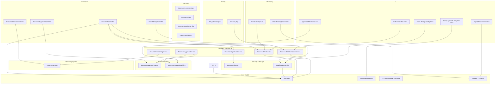

**Diagram sources**
- [Document.php:1-333](file://app/Models/Document.php#L1-L333)
- [DocumentTemplate.php:1-39](file://app/Models/DocumentTemplate.php#L1-L39)
- [DocumentNumberSequence.php:1-20](file://app/Models/DocumentNumberSequence.php#L1-L20)
- [DocumentApprovalRequest.php:1-127](file://app/Models/DocumentApprovalRequest.php#L1-L127)
- [DocumentApprovalWorkflow.php:1-88](file://app/Models/DocumentApprovalWorkflow.php#L1-L88)
- [DocumentSignature.php:1-103](file://app/Models/DocumentSignature.php#L1-L103)
- [DocumentVersion.php:1-73](file://app/Models/DocumentVersion.php#L1-L73)
- [DocumentOcrService.php:1-277](file://app/Services/DocumentOcrService.php#L1-L277)
- [DocumentBulkGeneratorService.php:1-255](file://app/Services/DocumentBulkGeneratorService.php#L1-L255)
- [DocumentSignatureService.php:1-198](file://app/Services/DocumentSignatureService.php#L1-L198)
- [DocumentVersioningService.php:1-226](file://app/Services/DocumentVersioningService.php#L1-L226)
- [DocumentApprovalService.php:1-317](file://app/Services/DocumentApprovalService.php#L1-L317)
- [DocumentController.php:1-379](file://app/Http/Controllers/DocumentController.php#L1-L379)
- [DocumentApprovalController.php:1-204](file://app/Http/Controllers/DocumentApprovalController.php#L1-L204)
- [DocumentVersionController.php:1-140](file://app/Http/Controllers/DocumentVersionController.php#L1-L140)
- [CloudStorageController.php:1-215](file://app/Http/Controllers/CloudStorageController.php#L1-L215)
- [CheckExpiringDocuments.php:1-146](file://app/Console/Commands/CheckExpiringDocuments.php#L1-L146)
- [ProcessOcrQueue.php:1-153](file://app/Console/Commands/ProcessOcrQueue.php#L1-L153)
- [services.php:1-70](file://config/services.php#L1-L70)

**Section sources**
- [Document.php:1-333](file://app/Models/Document.php#L1-L333)
- [DocumentTemplate.php:1-39](file://app/Models/DocumentTemplate.php#L1-L39)
- [DocumentNumberSequence.php:1-20](file://app/Models/DocumentNumberSequence.php#L1-L20)
- [DocumentApprovalRequest.php:1-127](file://app/Models/DocumentApprovalRequest.php#L1-L127)
- [DocumentApprovalWorkflow.php:1-88](file://app/Models/DocumentApprovalWorkflow.php#L1-L88)
- [DocumentSignature.php:1-103](file://app/Models/DocumentSignature.php#L1-L103)
- [DocumentVersion.php:1-73](file://app/Models/DocumentVersion.php#L1-L73)
- [DocumentOcrService.php:1-277](file://app/Services/DocumentOcrService.php#L1-L277)
- [DocumentBulkGeneratorService.php:1-255](file://app/Services/DocumentBulkGeneratorService.php#L1-L255)
- [DocumentSignatureService.php:1-198](file://app/Services/DocumentSignatureService.php#L1-L198)
- [DocumentVersioningService.php:1-226](file://app/Services/DocumentVersioningService.php#L1-L226)
- [DocumentApprovalService.php:1-317](file://app/Services/DocumentApprovalService.php#L1-L317)
- [DocumentController.php:1-379](file://app/Http/Controllers/DocumentController.php#L1-L379)
- [DocumentApprovalController.php:1-204](file://app/Http/Controllers/DocumentApprovalController.php#L1-L204)
- [DocumentVersionController.php:1-140](file://app/Http/Controllers/DocumentVersionController.php#L1-L140)
- [CloudStorageController.php:1-215](file://app/Http/Controllers/CloudStorageController.php#L1-L215)
- [CloudStorageService.php:1-457](file://app/Services/CloudStorageService.php#L1-L457)

## Core Components
- Document model: stores metadata for uploaded files, supports morph relations to business entities, and includes expiration tracking, OCR status, and digital signature fields
- DocumentTemplate model: manages reusable HTML templates per tenant and document type
- DocumentNumberSequence model and DocumentNumberService: centralized, sequential numbering with configurable prefixes and periods
- DocumentApprovalRequest and DocumentApprovalWorkflow: multi-step approval workflows with role-based routing and status tracking
- DocumentVersion: comprehensive version control with rollback, comparison, and cleanup capabilities
- DocumentSignature: digital signature management with hash verification, certificate support, and bulk signing capabilities
- DocumentOcrService: intelligent OCR processing with support for Tesseract, Google Vision, and AWS Textract
- DocumentBulkGeneratorService: batch document generation from templates with PDF and DOCX output formats
- DocumentVersioningService: comprehensive document version control with rollback, comparison, and cleanup capabilities
- DocumentApprovalService: multi-step approval workflows with role-based routing, priority calculation, and statistics
- DocumentSignatureService: digital signature management with hash verification, certificate support, and bulk signing capabilities
- CloudStorageService and CloudStorageController: multi-cloud storage integration supporting AWS S3, Google Cloud Storage, and Azure Blob Storage
- DocumentController: handles upload, download, approval, versioning, OCR processing, bulk operations, and expiration monitoring
- DocumentGeneratorTools and DocumentTools: generate printable documents and manage stored documents
- ApprovalWorkflow and ApprovalRequest: define and track approval workflows and requests
- CheckExpiringDocuments: console command for automated expiration monitoring and notifications
- ProcessOcrQueue: console command for batch OCR processing of documents
- DataArchivalService and configuration: enforce retention and archival policies
- Enhanced UI components: bulk generation interface, expired documents monitoring, and approval workflow management

**Section sources**
- [Document.php:1-333](file://app/Models/Document.php#L1-L333)
- [DocumentTemplate.php:1-39](file://app/Models/DocumentTemplate.php#L1-L39)
- [DocumentNumberSequence.php:1-20](file://app/Models/DocumentNumberSequence.php#L1-L20)
- [DocumentApprovalRequest.php:1-127](file://app/Models/DocumentApprovalRequest.php#L1-L127)
- [DocumentApprovalWorkflow.php:1-88](file://app/Models/DocumentApprovalWorkflow.php#L1-L88)
- [DocumentSignature.php:1-103](file://app/Models/DocumentSignature.php#L1-L103)
- [DocumentVersion.php:1-73](file://app/Models/DocumentVersion.php#L1-L73)
- [DocumentOcrService.php:1-277](file://app/Services/DocumentOcrService.php#L1-L277)
- [DocumentBulkGeneratorService.php:1-255](file://app/Services/DocumentBulkGeneratorService.php#L1-L255)
- [DocumentSignatureService.php:1-198](file://app/Services/DocumentSignatureService.php#L1-L198)
- [DocumentVersioningService.php:1-226](file://app/Services/DocumentVersioningService.php#L1-L226)
- [DocumentApprovalService.php:1-317](file://app/Services/DocumentApprovalService.php#L1-L317)
- [DocumentController.php:1-379](file://app/Http/Controllers/DocumentController.php#L1-L379)
- [DocumentApprovalController.php:1-204](file://app/Http/Controllers/DocumentApprovalController.php#L1-L204)
- [DocumentVersionController.php:1-140](file://app/Http/Controllers/DocumentVersionController.php#L1-L140)
- [CloudStorageController.php:1-215](file://app/Http/Controllers/CloudStorageController.php#L1-L215)
- [CloudStorageService.php:1-457](file://app/Services/CloudStorageService.php#L1-L457)
- [DocumentSignatureService.php:1-198](file://app/Services/DocumentSignatureService.php#L1-L198)
- [DocumentGeneratorTools.php:1-218](file://app/Services/ERP/DocumentGeneratorTools.php#L1-L218)
- [DocumentTools.php:1-132](file://app/Services/ERP/DocumentTools.php#L1-L132)
- [DocumentNumberService.php:1-133](file://app/Services/DocumentNumberService.php#L1-L133)
- [ApprovalWorkflow.php:1-33](file://app/Models/ApprovalWorkflow.php#L1-L33)
- [ApprovalRequest.php:1-25](file://app/Models/ApprovalRequest.php#L1-L25)
- [CheckExpiringDocuments.php:1-146](file://app/Console/Commands/CheckExpiringDocuments.php#L1-L146)
- [ProcessOcrQueue.php:1-153](file://app/Console/Commands/ProcessOcrQueue.php#L1-L153)
- [DataArchivalService.php:104-187](file://app/Services/DataArchivalService.php#L104-L187)
- [data_retention.php:1-293](file://config/data_retention.php#L1-L293)

## Architecture Overview
The system separates concerns across models, services, and controllers with enhanced enterprise features:
- Controllers orchestrate user actions and delegate to specialized services
- Services encapsulate business logic (approval workflows, versioning, cloud storage, digital signatures, OCR processing, bulk generation)
- Models persist data with tenant scoping, morph relations, comprehensive relationships, and expiration tracking
- Configuration governs retention, compliance policies, OCR service settings, and multi-cloud storage settings
- Monitoring services provide automated expiration tracking and notifications

```mermaid
graph TB
Client["Client Browser/API"] --> DC["DocumentController"]
Client --> DAC["DocumentApprovalController"]
Client --> DVC["DocumentVersionController"]
Client --> CSC["CloudStorageController"]
DC --> FS["Storage: public/local"]
DC --> DOCR["DocumentOcrService"]
DC --> DSS["DocumentSignatureService"]
DC --> DBGS["DocumentBulkGeneratorService"]
DAC --> DAS["DocumentApprovalService"]
DVC --> DVPS["DocumentVersioningService"]
CSC --> CSS["CloudStorageService"]
CSS --> S3["AWS S3"]
CSS --> GCS["Google Cloud Storage"]
CSS --> AZ["Azure Blob Storage"]
Client --> DGS["DocumentGeneratorTools"]
DGS --> DTemp["DocumentTemplate"]
DGS --> PDF["PDF Rendering (via service)"]
Client --> DNS["DocumentNumberService"]
DNS --> DNumSeq["DocumentNumberSequence"]
Client --> DSS["DocumentSignatureService"]
DSS --> DSig["DocumentSignature"]
Client --> DTS["DocumentTools"]
DTS --> Doc["Document"]
Client --> WF["Approvals Workflows View"]
WF --> DAW["DocumentApprovalWorkflow"]
DAW --> DAR["DocumentApprovalRequest"]
Client --> CED["CheckExpiringDocuments"]
Client --> POQ["ProcessOcrQueue"]
CED --> ExpDoc["Expired Documents"]
POQ --> DOCR
Config["data_retention.php"] --> DAServ["DataArchivalService"]
Config2["services.php"] --> DOCR
DAServ --> DB["Database Archives"]
```

**Diagram sources**
- [DocumentController.php:1-379](file://app/Http/Controllers/DocumentController.php#L1-L379)
- [DocumentApprovalController.php:1-204](file://app/Http/Controllers/DocumentApprovalController.php#L1-L204)
- [DocumentVersionController.php:1-140](file://app/Http/Controllers/DocumentVersionController.php#L1-L140)
- [CloudStorageController.php:1-215](file://app/Http/Controllers/CloudStorageController.php#L1-L215)
- [DocumentGeneratorTools.php:1-218](file://app/Services/ERP/DocumentGeneratorTools.php#L1-L218)
- [DocumentNumberService.php:1-133](file://app/Services/DocumentNumberService.php#L1-L133)
- [DocumentTools.php:1-132](file://app/Services/ERP/DocumentTools.php#L1-L132)
- [Document.php:1-333](file://app/Models/Document.php#L1-L333)
- [DocumentTemplate.php:1-39](file://app/Models/DocumentTemplate.php#L1-L39)
- [DocumentNumberSequence.php:1-20](file://app/Models/DocumentNumberSequence.php#L1-L20)
- [DocumentSignature.php:1-103](file://app/Models/DocumentSignature.php#L1-L103)
- [DocumentOcrService.php:1-277](file://app/Services/DocumentOcrService.php#L1-L277)
- [DocumentBulkGeneratorService.php:1-255](file://app/Services/DocumentBulkGeneratorService.php#L1-L255)
- [DocumentSignatureService.php:1-198](file://app/Services/DocumentSignatureService.php#L1-L198)
- [DocumentVersioningService.php:1-226](file://app/Services/DocumentVersioningService.php#L1-L226)
- [DocumentApprovalService.php:1-317](file://app/Services/DocumentApprovalService.php#L1-L317)
- [DocumentApprovalWorkflow.php:1-88](file://app/Models/DocumentApprovalWorkflow.php#L1-L88)
- [DocumentApprovalRequest.php:1-127](file://app/Models/DocumentApprovalRequest.php#L1-L127)
- [DocumentVersion.php:1-73](file://app/Models/DocumentVersion.php#L1-L73)
- [CloudStorageService.php:1-457](file://app/Services/CloudStorageService.php#L1-L457)
- [CheckExpiringDocuments.php:1-146](file://app/Console/Commands/CheckExpiringDocuments.php#L1-L146)
- [ProcessOcrQueue.php:1-153](file://app/Console/Commands/ProcessOcrQueue.php#L1-L153)
- [data_retention.php:1-293](file://config/data_retention.php#L1-L293)
- [services.php:1-70](file://config/services.php#L1-L70)
- [DataArchivalService.php:104-187](file://app/Services/DataArchivalService.php#L104-L187)

## Detailed Component Analysis

### Enhanced Document Templates and Automated Generation
- Templates: stored per tenant and document type, with a default flag per type
- Generation: tools produce structured document bodies (e.g., quotations, contracts, memos) based on inputs and tenant profile
- Retrieval: stored documents can be listed, searched, and deleted
- Integration: works seamlessly with approval workflows, versioning systems, and bulk generation
- **Updated**: Now supports bulk generation from templates with PDF and DOCX output formats

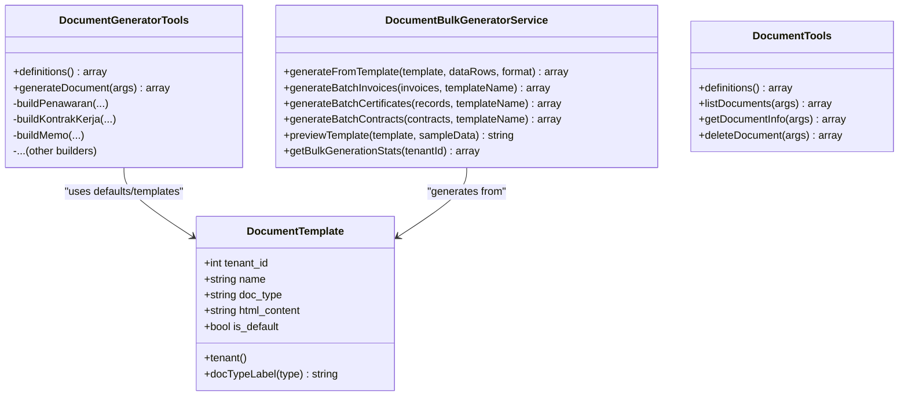

**Diagram sources**
- [DocumentTemplate.php:1-39](file://app/Models/DocumentTemplate.php#L1-L39)
- [DocumentGeneratorTools.php:1-218](file://app/Services/ERP/DocumentGeneratorTools.php#L1-L218)
- [DocumentBulkGeneratorService.php:1-255](file://app/Services/DocumentBulkGeneratorService.php#L1-L255)
- [DocumentTools.php:1-132](file://app/Services/ERP/DocumentTools.php#L1-L132)

**Section sources**
- [DocumentTemplate.php:1-39](file://app/Models/DocumentTemplate.php#L1-L39)
- [DocumentGeneratorTools.php:1-218](file://app/Services/ERP/DocumentGeneratorTools.php#L1-L218)
- [DocumentTools.php:1-132](file://app/Services/ERP/DocumentTools.php#L1-L132)
- [DocumentBulkGeneratorService.php:1-255](file://app/Services/DocumentBulkGeneratorService.php#L1-L255)
- [company-profile.blade.php:212-249](file://resources/views/settings/company-profile.blade.php#L212-L249)

### Comprehensive Document Numbering and Version Control
- Centralized sequences per tenant, document type, and period
- Atomic increments with database locks to prevent race conditions
- Default prefixes per document type; optional monthly period variant
- Document versioning with automatic version increment, rollback capabilities, and file comparison
- Version cleanup to manage storage space and performance

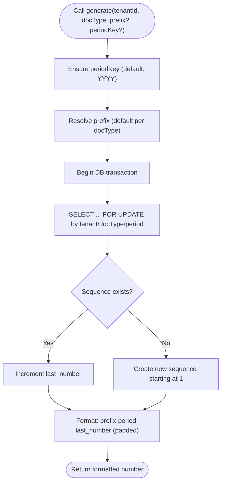

**Diagram sources**
- [DocumentNumberService.php:39-76](file://app/Services/DocumentNumberService.php#L39-L76)
- [DocumentNumberSequence.php:1-20](file://app/Models/DocumentNumberSequence.php#L1-L20)

**Section sources**
- [DocumentNumberService.php:1-133](file://app/Services/DocumentNumberService.php#L1-L133)
- [DocumentNumberSequence.php:1-20](file://app/Models/DocumentNumberSequence.php#L1-L20)
- [DocumentVersioningService.php:19-48](file://app/Services/DocumentVersioningService.php#L19-L48)
- [DocumentVersion.php:1-73](file://app/Models/DocumentVersion.php#L1-L73)

### Advanced Document Lifecycle Management (Storage, Retrieval, Deletion)
- Upload: validated, stored on public disk or configured cloud storage, metadata persisted
- Download: tenant-scoped access check, file existence verification, download with activity log
- Delete: tenant-scoped access check, file removal from storage, record deletion with activity log
- Search and filtering: by category and free-text search on title/description/tags
- Cloud storage integration: automatic fallback to local storage when cloud config unavailable
- Multi-provider support: AWS S3, Google Cloud Storage, Azure Blob Storage with unified interface
- **Updated**: Enhanced with OCR processing, bulk operations, and expiration monitoring

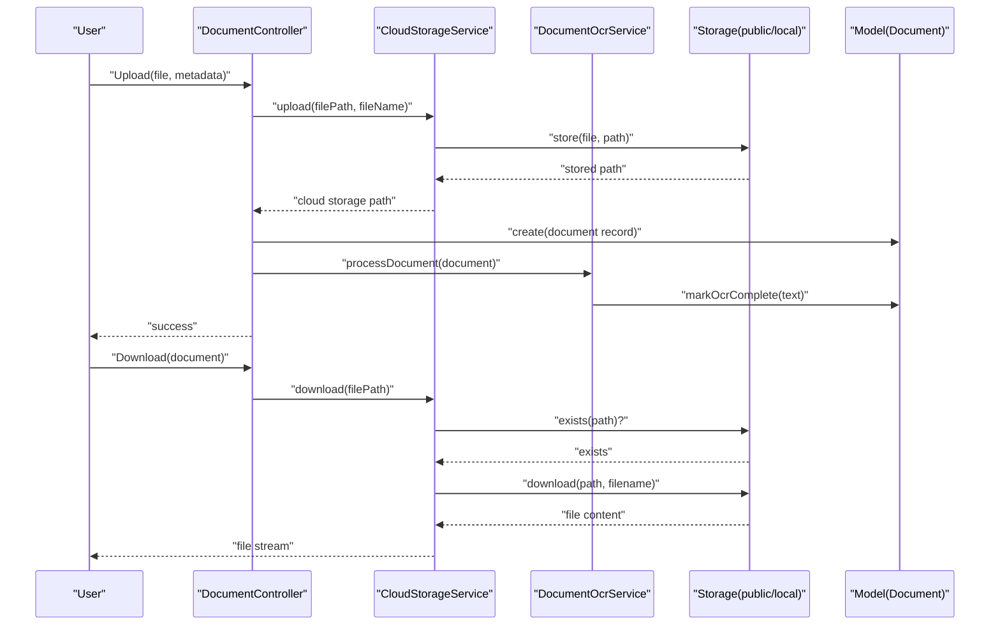

**Diagram sources**
- [DocumentController.php:37-77](file://app/Http/Controllers/DocumentController.php#L37-L77)
- [Document.php:1-333](file://app/Models/Document.php#L1-L333)
- [CloudStorageService.php:37-101](file://app/Services/CloudStorageService.php#L37-L101)
- [DocumentOcrService.php:29-61](file://app/Services/DocumentOcrService.php#L29-L61)

**Section sources**
- [DocumentController.php:1-379](file://app/Http/Controllers/DocumentController.php#L1-L379)
- [Document.php:1-333](file://app/Models/Document.php#L1-L333)
- [DocumentTools.php:52-131](file://app/Services/ERP/DocumentTools.php#L52-L131)
- [CloudStorageController.php:1-215](file://app/Http/Controllers/CloudStorageController.php#L1-L215)
- [CloudStorageService.php:1-457](file://app/Services/CloudStorageService.php#L1-L457)

### Intelligent Document Processing with OCR
- **New**: OCR processing support for PDF, images, and TIFF documents using Tesseract, Google Vision, and AWS Textract
- Text extraction with language configuration and provider selection
- Document search by OCR content with highlighting and snippet generation
- Batch OCR processing for improved performance
- Statistics tracking for OCR coverage and processing metrics
- **Updated**: Integrated with document upload and search functionality

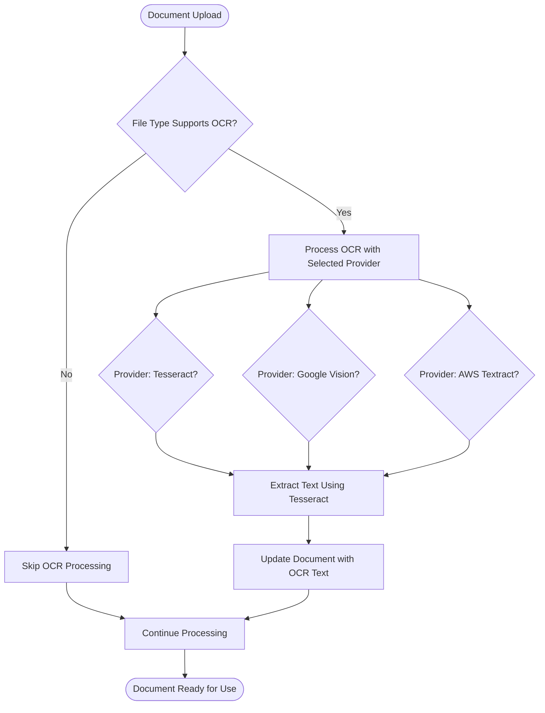

**Diagram sources**
- [DocumentOcrService.php:29-61](file://app/Services/DocumentOcrService.php#L29-L61)
- [DocumentOcrService.php:140-169](file://app/Services/DocumentOcrService.php#L140-L169)
- [DocumentOcrService.php:197-220](file://app/Services/DocumentOcrService.php#L197-L220)
- [Document.php:214-232](file://app/Models/Document.php#L214-L232)

**Section sources**
- [DocumentOcrService.php:1-277](file://app/Services/DocumentOcrService.php#L1-L277)
- [Document.php:1-333](file://app/Models/Document.php#L1-L333)
- [DocumentController.php:206-218](file://app/Http/Controllers/DocumentController.php#L206-L218)

### Bulk Document Generation System
- **New**: Mass document creation from templates with batch processing capabilities
- Support for PDF and DOCX output formats
- Batch operations for invoices, certificates, and contracts
- Template preview functionality with sample data
- Statistics tracking for generation volume and efficiency
- **Updated**: Integrated with document controller and template management

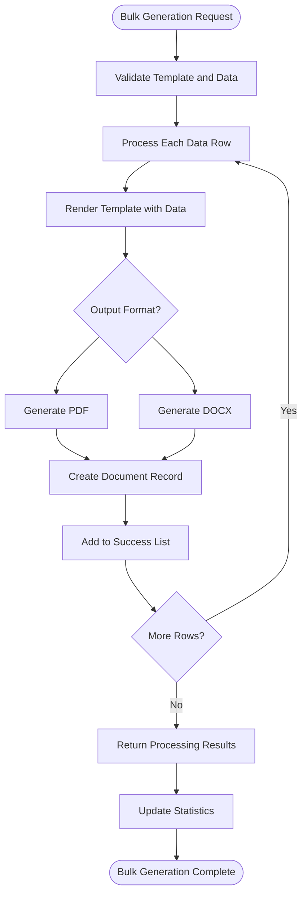

**Diagram sources**
- [DocumentBulkGeneratorService.php:23-45](file://app/Services/DocumentBulkGeneratorService.php#L23-L45)
- [DocumentBulkGeneratorService.php:50-76](file://app/Services/DocumentBulkGeneratorService.php#L50-L76)
- [DocumentBulkGeneratorService.php:147-166](file://app/Services/DocumentBulkGeneratorService.php#L147-L166)
- [DocumentController.php:300-315](file://app/Http/Controllers/DocumentController.php#L300-L315)

**Section sources**
- [DocumentBulkGeneratorService.php:1-255](file://app/Services/DocumentBulkGeneratorService.php#L1-L255)
- [DocumentController.php:299-315](file://app/Http/Controllers/DocumentController.php#L299-L315)
- [bulk-generate.blade.php:1-200](file://resources/views/documents/bulk-generate.blade.php#L1-L200)

### Comprehensive Approval Workflows and Integration with Business Processes
- Multi-step approval workflows with configurable approvers and roles
- Automatic notification system for pending approvals
- Priority calculation based on approval wait time
- Workflow statistics and performance monitoring
- Integration: documents trigger approval workflows based on type and tenant configuration
- **Updated**: Enhanced with expiration-aware routing and monitoring

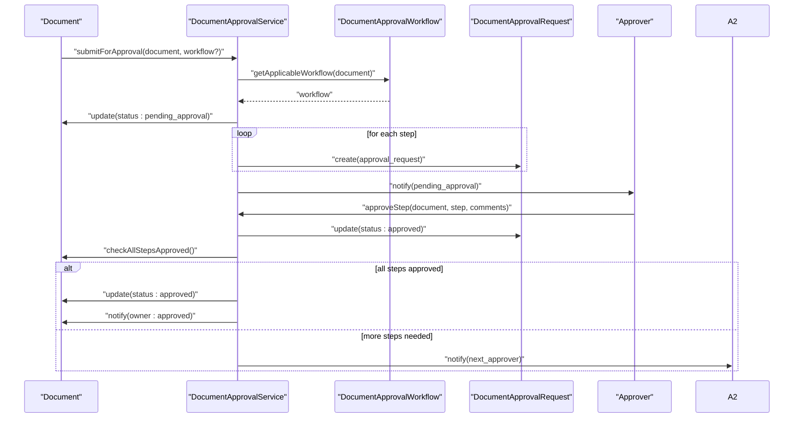

**Diagram sources**
- [DocumentApprovalService.php:23-85](file://app/Services/DocumentApprovalService.php#L23-L85)
- [DocumentApprovalWorkflow.php:1-88](file://app/Models/DocumentApprovalWorkflow.php#L1-L88)
- [DocumentApprovalRequest.php:1-127](file://app/Models/DocumentApprovalRequest.php#L1-L127)

**Section sources**
- [DocumentApprovalService.php:1-317](file://app/Services/DocumentApprovalService.php#L1-L317)
- [DocumentApprovalWorkflow.php:1-88](file://app/Models/DocumentApprovalWorkflow.php#L1-L88)
- [DocumentApprovalRequest.php:1-127](file://app/Models/DocumentApprovalRequest.php#L1-L127)
- [DocumentApprovalController.php:1-204](file://app/Http/Controllers/DocumentApprovalController.php#L1-L204)
- [workflows.blade.php:1-21](file://resources/views/approvals/workflows.blade.php#L1-L21)

### Document Versioning and Rollback Capabilities
- Automatic version creation with file upload or manual updates
- Comprehensive version history with user attribution and change summaries
- Version comparison with detailed differences
- Rollback to previous versions with audit trail
- Storage cleanup to manage version accumulation
- File size reporting and human-readable formats

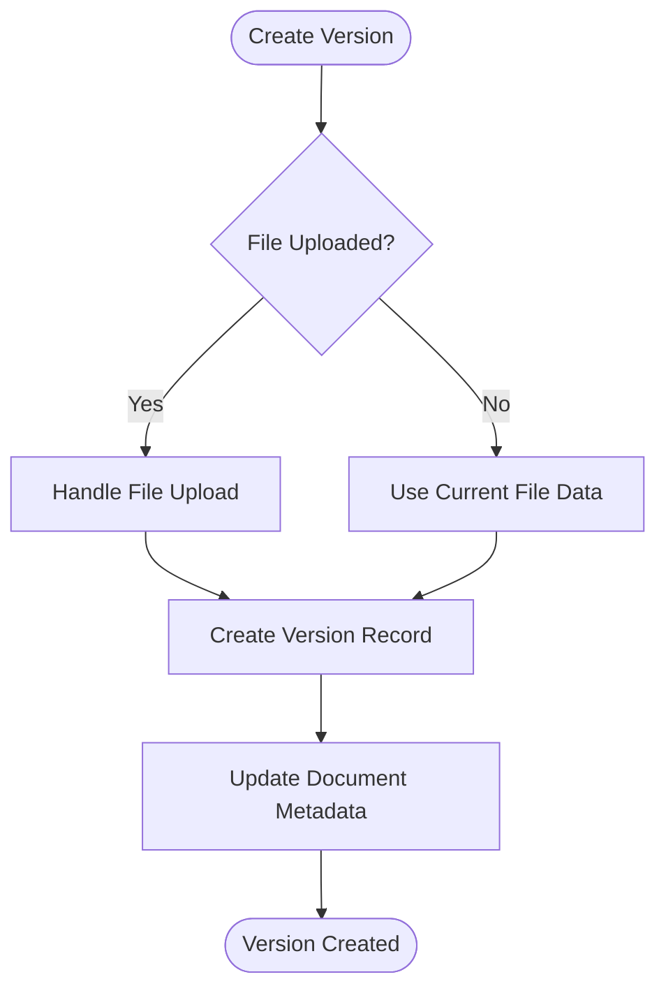

**Diagram sources**
- [DocumentVersioningService.php:22-48](file://app/Services/DocumentVersioningService.php#L22-L48)
- [DocumentVersion.php:1-73](file://app/Models/DocumentVersion.php#L1-L73)

**Section sources**
- [DocumentVersioningService.php:1-226](file://app/Services/DocumentVersioningService.php#L1-L226)
- [DocumentVersion.php:1-73](file://app/Models/DocumentVersion.php#L1-L73)
- [DocumentVersionController.php:1-140](file://app/Http/Controllers/DocumentVersionController.php#L1-L140)

### Enhanced Digital Signature and Security Features
- Digital signature generation with SHA-256 hashing and timestamp inclusion
- Certificate support with serial number tracking and metadata capture
- IP address and user agent capture for security auditing
- Signature verification with hash recomputation and certificate validation
- Bulk signature processing for multiple documents with error handling
- Signature statistics and compliance reporting
- **Updated**: Enhanced with bulk signing capabilities and certificate management

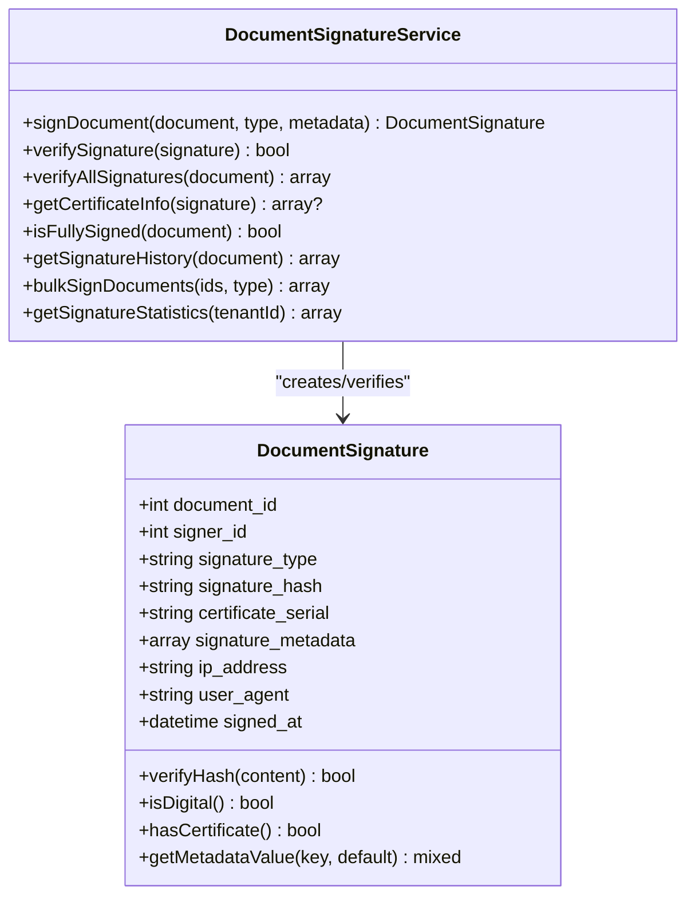

**Diagram sources**
- [DocumentSignature.php:1-103](file://app/Models/DocumentSignature.php#L1-L103)
- [DocumentSignatureService.php:1-198](file://app/Services/DocumentSignatureService.php#L1-L198)

**Section sources**
- [DocumentSignature.php:1-103](file://app/Models/DocumentSignature.php#L1-L103)
- [DocumentSignatureService.php:1-198](file://app/Services/DocumentSignatureService.php#L1-L198)
- [DocumentController.php:171-185](file://app/Http/Controllers/DocumentController.php#L171-L185)
- [DocumentController.php:190-201](file://app/Http/Controllers/DocumentController.php#L190-L201)

### Cloud Storage Integration and Multi-Provider Support
- Unified cloud storage interface supporting AWS S3, Google Cloud Storage, and Azure Blob Storage
- Configurable storage providers per tenant with active and default flags
- Connection testing and validation for each provider
- Automatic fallback to local storage when cloud configuration is unavailable
- Presigned URL generation for secure file access
- Storage usage statistics and provider information

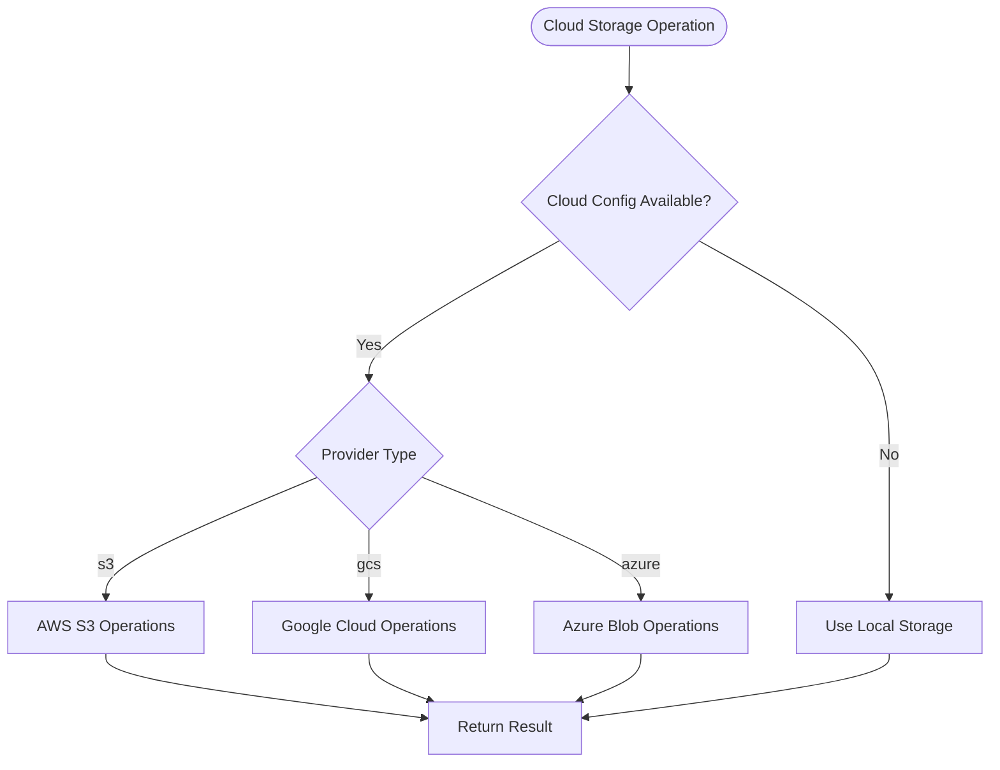

**Diagram sources**
- [CloudStorageService.php:37-101](file://app/Services/CloudStorageService.php#L37-L101)
- [CloudStorageController.php:1-215](file://app/Http/Controllers/CloudStorageController.php#L1-L215)

**Section sources**
- [CloudStorageService.php:1-457](file://app/Services/CloudStorageService.php#L1-L457)
- [CloudStorageController.php:1-215](file://app/Http/Controllers/CloudStorageController.php#L1-L215)

### Document Expiration Tracking and Automated Monitoring
- **New**: Comprehensive expiration tracking with expires_at field and status management
- Automated expiration detection through scopes and queries
- Console command for scheduled expiration monitoring with notifications
- Expiration-based workflow routing and alerts
- Statistics tracking for expired and expiring documents
- **Updated**: Integrated with approval workflows and notification system

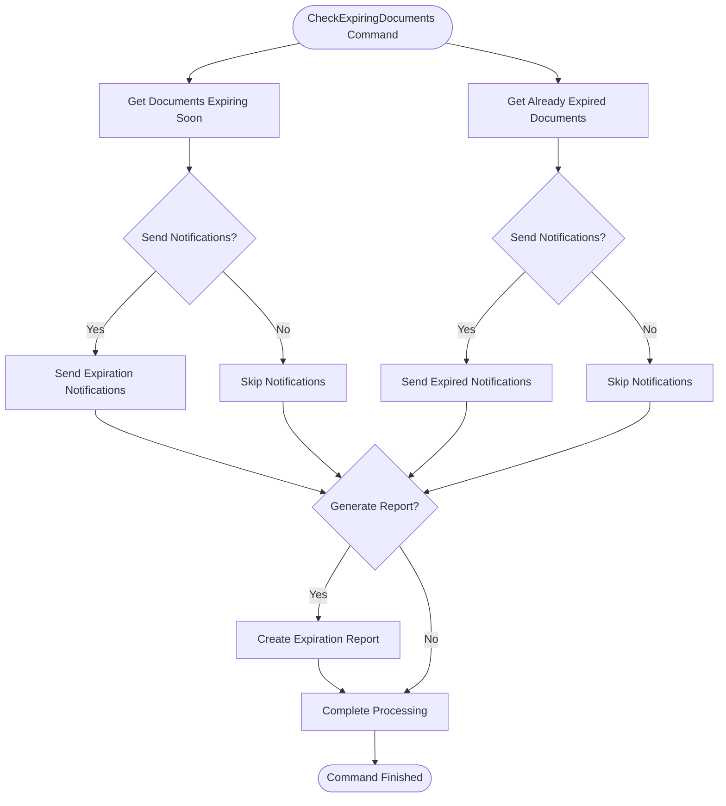

**Diagram sources**
- [CheckExpiringDocuments.php:28-144](file://app/Console/Commands/CheckExpiringDocuments.php#L28-L144)
- [Document.php:276-290](file://app/Models/Document.php#L276-L290)
- [Document.php:131-134](file://app/Models/Document.php#L131-L134)

**Section sources**
- [CheckExpiringDocuments.php:1-146](file://app/Console/Commands/CheckExpiringDocuments.php#L1-L146)
- [Document.php:1-333](file://app/Models/Document.php#L1-L333)
- [DocumentController.php:223-275](file://app/Http/Controllers/DocumentController.php#L223-L275)
- [expired-documents.blade.php:1-200](file://resources/views/documents/expired-documents.blade.php#L1-L200)

### OCR Processing and Batch Operations
- **New**: Comprehensive OCR processing system with support for multiple providers
- Tesseract integration for local OCR processing with language configuration
- Google Vision API integration for cloud-based OCR with JSON responses
- AWS Textract integration for enterprise OCR with block-based text extraction
- Batch processing capabilities with configurable batch sizes and tenant targeting
- Statistics tracking for OCR coverage and processing performance
- Console command for automated batch OCR processing

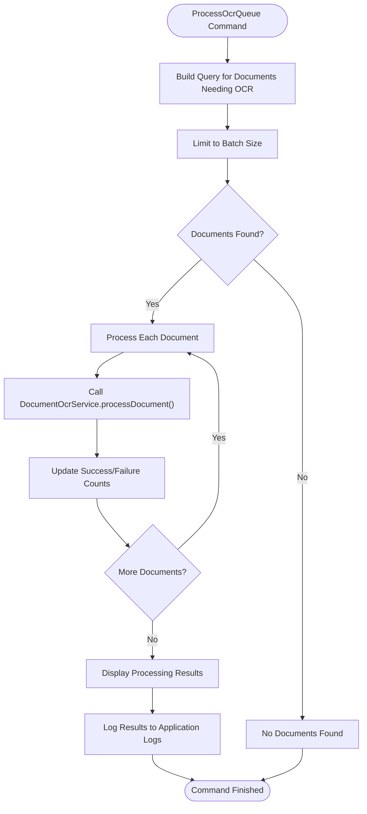

**Diagram sources**
- [ProcessOcrQueue.php:50-153](file://app/Console/Commands/ProcessOcrQueue.php#L50-L153)
- [DocumentOcrService.php:29-61](file://app/Services/DocumentOcrService.php#L29-L61)

**Section sources**
- [ProcessOcrQueue.php:1-153](file://app/Console/Commands/ProcessOcrQueue.php#L1-L153)
- [DocumentOcrService.php:1-277](file://app/Services/DocumentOcrService.php#L1-L277)

### Archival Policies and Data Retention
- Retention periods configured per data type
- Archival service moves eligible records to archive tables or exports based on configuration
- Compliance holds and soft-delete options for sensitive data
- Scheduled runs via console command and cron

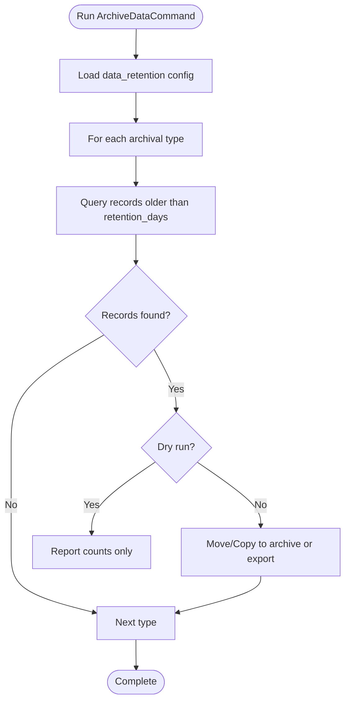

**Diagram sources**
- [ArchiveDataCommand.php:1-195](file://app/Console/Commands/ArchiveDataCommand.php#L1-L195)
- [DataArchivalService.php:104-187](file://app/Services/DataArchivalService.php#L104-L187)
- [data_retention.php:1-293](file://config/data_retention.php#L1-L293)

**Section sources**
- [ArchiveDataCommand.php:1-195](file://app/Console/Commands/ArchiveDataCommand.php#L1-L195)
- [DataArchivalService.php:104-187](file://app/Services/DataArchivalService.php#L104-L187)
- [data_retention.php:1-293](file://config/data_retention.php#L1-L293)

## Dependency Analysis
- Controllers depend on models and specialized services for different document operations
- Services encapsulate domain logic and are reused across controllers and commands
- Models depend on tenant scoping traits, Eloquent relationships, comprehensive attribute casting, and expiration tracking
- Configuration drives archival behavior, cloud storage settings, OCR service settings, and compliance handling
- **Updated**: New dependencies include OCR processing, bulk generation, and expiration monitoring services

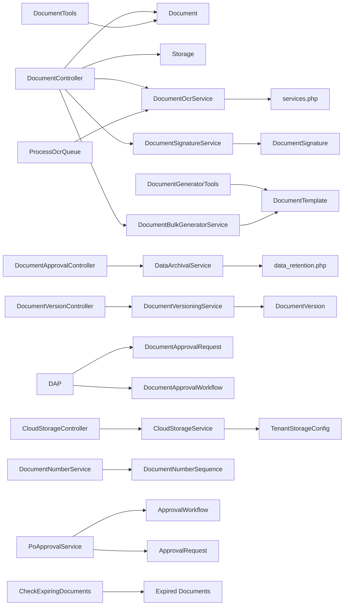

**Diagram sources**
- [DocumentController.php:1-379](file://app/Http/Controllers/DocumentController.php#L1-L379)
- [Document.php:1-333](file://app/Models/Document.php#L1-L333)
- [DocumentOcrService.php:1-277](file://app/Services/DocumentOcrService.php#L1-L277)
- [DocumentSignatureService.php:1-198](file://app/Services/DocumentSignatureService.php#L1-L198)
- [DocumentBulkGeneratorService.php:1-255](file://app/Services/DocumentBulkGeneratorService.php#L1-L255)
- [DocumentApprovalController.php:1-204](file://app/Http/Controllers/DocumentApprovalController.php#L1-L204)
- [DocumentVersionController.php:1-140](file://app/Http/Controllers/DocumentVersionController.php#L1-L140)
- [CloudStorageController.php:1-215](file://app/Http/Controllers/CloudStorageController.php#L1-L215)
- [DocumentApprovalService.php:1-317](file://app/Services/DocumentApprovalService.php#L1-L317)
- [DocumentVersioningService.php:1-226](file://app/Services/DocumentVersioningService.php#L1-L226)
- [CloudStorageService.php:1-457](file://app/Services/CloudStorageService.php#L1-L457)
- [DocumentSignatureService.php:1-198](file://app/Services/DocumentSignatureService.php#L1-L198)
- [DocumentGeneratorTools.php:1-218](file://app/Services/ERP/DocumentGeneratorTools.php#L1-L218)
- [DocumentTools.php:1-132](file://app/Services/ERP/DocumentTools.php#L1-L132)
- [DocumentNumberService.php:1-133](file://app/Services/DocumentNumberService.php#L1-L133)
- [DocumentNumberSequence.php:1-20](file://app/Models/DocumentNumberSequence.php#L1-L20)
- [PoApprovalService.php:119-350](file://app/Services/PoApprovalService.php#L119-L350)
- [ApprovalWorkflow.php:1-33](file://app/Models/ApprovalWorkflow.php#L1-L33)
- [ApprovalRequest.php:1-25](file://app/Models/ApprovalRequest.php#L1-L25)
- [DataArchivalService.php:104-187](file://app/Services/DataArchivalService.php#L104-L187)
- [data_retention.php:1-293](file://config/data_retention.php#L1-L293)
- [CheckExpiringDocuments.php:1-146](file://app/Console/Commands/CheckExpiringDocuments.php#L1-L146)
- [ProcessOcrQueue.php:1-153](file://app/Console/Commands/ProcessOcrQueue.php#L1-L153)
- [services.php:1-70](file://config/services.php#L1-L70)

**Section sources**
- [DocumentController.php:1-379](file://app/Http/Controllers/DocumentController.php#L1-L379)
- [Document.php:1-333](file://app/Models/Document.php#L1-L333)
- [DocumentOcrService.php:1-277](file://app/Services/DocumentOcrService.php#L1-L277)
- [DocumentSignatureService.php:1-198](file://app/Services/DocumentSignatureService.php#L1-L198)
- [DocumentBulkGeneratorService.php:1-255](file://app/Services/DocumentBulkGeneratorService.php#L1-L255)
- [DocumentApprovalController.php:1-204](file://app/Http/Controllers/DocumentApprovalController.php#L1-L204)
- [DocumentVersionController.php:1-140](file://app/Http/Controllers/DocumentVersionController.php#L1-L140)
- [CloudStorageController.php:1-215](file://app/Http/Controllers/CloudStorageController.php#L1-L215)
- [DocumentApprovalService.php:1-317](file://app/Services/DocumentApprovalService.php#L1-L317)
- [DocumentVersioningService.php:1-226](file://app/Services/DocumentVersioningService.php#L1-L226)
- [CloudStorageService.php:1-457](file://app/Services/CloudStorageService.php#L1-L457)
- [DocumentSignatureService.php:1-198](file://app/Services/DocumentSignatureService.php#L1-L198)
- [DocumentGeneratorTools.php:1-218](file://app/Services/ERP/DocumentGeneratorTools.php#L1-L218)
- [DocumentTools.php:1-132](file://app/Services/ERP/DocumentTools.php#L1-L132)
- [DocumentNumberService.php:1-133](file://app/Services/DocumentNumberService.php#L1-L133)
- [DocumentNumberSequence.php:1-20](file://app/Models/DocumentNumberSequence.php#L1-L20)
- [PoApprovalService.php:119-350](file://app/Services/PoApprovalService.php#L119-L350)
- [ApprovalWorkflow.php:1-33](file://app/Models/ApprovalWorkflow.php#L1-L33)
- [ApprovalRequest.php:1-25](file://app/Models/ApprovalRequest.php#L1-L25)
- [DataArchivalService.php:104-187](file://app/Services/DataArchivalService.php#L104-L187)
- [data_retention.php:1-293](file://config/data_retention.php#L1-L293)
- [CheckExpiringDocuments.php:1-146](file://app/Console/Commands/CheckExpiringDocuments.php#L1-L146)
- [ProcessOcrQueue.php:1-153](file://app/Console/Commands/ProcessOcrQueue.php#L1-L153)
- [services.php:1-70](file://config/services.php#L1-L70)

## Performance Considerations
- Numbering service uses row-level locking to avoid race conditions; keep transaction durations short
- Approval workflows process in database transactions; optimize workflow complexity
- Versioning operations use database transactions; consider batch operations for bulk updates
- Cloud storage operations are network-bound; implement connection pooling and retry mechanisms
- Signature verification operations can be optimized with caching for frequently accessed documents
- Archival operations process in batches; tune batch size and timeout for large datasets
- Storage operations are I/O bound; ensure adequate disk throughput and consider CDN for downloads
- OCR processing is CPU-intensive; implement batch processing and rate limiting for optimal performance
- Bulk generation operations should use background jobs for large-scale document creation
- Expiration monitoring should be scheduled appropriately to avoid peak load times
- Indexing on tenant_id, doc_type, period_key, approval workflow fields, and expiration dates improves query performance

## Troubleshooting Guide
- Upload fails: verify file size limits and MIME type validation; confirm storage permissions; check cloud storage credentials
- Download returns 404: ensure file exists on storage provider and path matches stored file_path
- Approval request not created: confirm applicable workflow exists and amount thresholds match; check user roles and permissions
- Version rollback fails: verify target version exists and has accessible file content
- Cloud storage connection fails: validate provider credentials, endpoint URLs, and network connectivity
- Signature verification fails: ensure document content hasn't been modified since signing; check hash computation
- Archival not running: check scheduled frequency and environment variables; inspect command output
- OCR processing fails: verify OCR provider configuration, API keys, and supported file types; check Tesseract installation
- Bulk generation errors: validate template data structure and output format; check memory limits for large batches
- Expiration notifications not sent: verify cron schedule, notification preferences, and user contact information
- Document search by OCR content not working: ensure OCR processing completed successfully and text indexing is enabled
- ProcessOcrQueue command failures: check batch size configuration, tenant filtering, and error logs for specific document processing issues

**Section sources**
- [DocumentController.php:37-379](file://app/Http/Controllers/DocumentController.php#L37-L379)
- [DocumentApprovalController.php:1-204](file://app/Http/Controllers/DocumentApprovalController.php#L1-L204)
- [DocumentVersionController.php:1-140](file://app/Http/Controllers/DocumentVersionController.php#L1-L140)
- [CloudStorageController.php:1-215](file://app/Http/Controllers/CloudStorageController.php#L1-L215)
- [DocumentSignatureService.php:1-198](file://app/Services/DocumentSignatureService.php#L1-L198)
- [PoApprovalService.php:119-350](file://app/Services/PoApprovalService.php#L119-L350)
- [ArchiveDataCommand.php:1-195](file://app/Console/Commands/ArchiveDataCommand.php#L1-L195)
- [DocumentOcrService.php:1-277](file://app/Services/DocumentOcrService.php#L1-L277)
- [DocumentBulkGeneratorService.php:1-255](file://app/Services/DocumentBulkGeneratorService.php#L1-L255)
- [CheckExpiringDocuments.php:1-146](file://app/Console/Commands/CheckExpiringDocuments.php#L1-L146)
- [ProcessOcrQueue.php:1-153](file://app/Console/Commands/ProcessOcrQueue.php#L1-L153)

## Conclusion
The enhanced Document Management subsystem provides enterprise-grade capabilities for templates, automated generation, centralized numbering, multi-step approval workflows, comprehensive versioning, digital signatures, cloud storage integration, intelligent OCR processing, bulk document generation, and comprehensive expiration tracking. It emphasizes tenant isolation, compliance-aware retention, scalable storage operations, advanced security features, automated document processing, and intelligent lifecycle management for modern document management requirements.

## Appendices
- Template management UI enables creation, editing, and deletion of document templates per tenant and type
- Workflow management UI supports creation and activation of approval workflows with multi-step routing
- Version management UI provides comprehensive version history, comparison, and rollback capabilities
- Cloud storage configuration UI enables multi-provider storage setup with connection testing
- Signature management provides digital signature creation, verification, and compliance reporting
- **New**: Bulk generation interface supports mass document creation from templates with progress tracking
- **New**: Expiration monitoring dashboard displays expiring and expired documents with automated notification controls
- **New**: OCR processing interface provides document scanning, text extraction, and search functionality
- **New**: Statistics dashboards show OCR coverage, signature rates, and bulk generation metrics
- **New**: ProcessOcrQueue command provides automated batch OCR processing with configurable batch sizes and tenant targeting

**Section sources**
- [company-profile.blade.php:212-249](file://resources/views/settings/company-profile.blade.php#L212-L249)
- [workflows.blade.php:1-21](file://resources/views/approvals/workflows.blade.php#L1-L21)
- [DocumentApprovalController.php:125-133](file://app/Http/Controllers/DocumentApprovalController.php#L125-L133)
- [DocumentVersionController.php:22-30](file://app/Http/Controllers/DocumentVersionController.php#L22-L30)
- [CloudStorageController.php:23-43](file://app/Http/Controllers/CloudStorageController.php#L23-L43)
- [bulk-generate.blade.php:1-200](file://resources/views/documents/bulk-generate.blade.php#L1-L200)
- [expired-documents.blade.php:1-200](file://resources/views/documents/expired-documents.blade.php#L1-L200)
- [approval-workflow.blade.php:1-200](file://resources/views/documents/approval-workflow.blade.php#L1-L200)