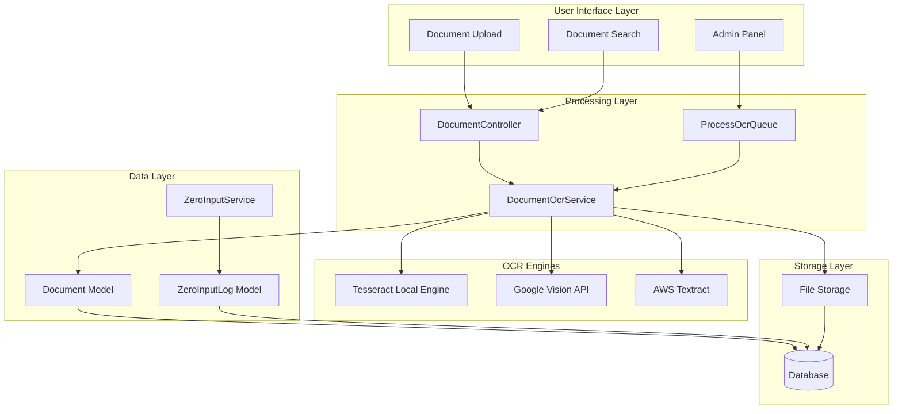
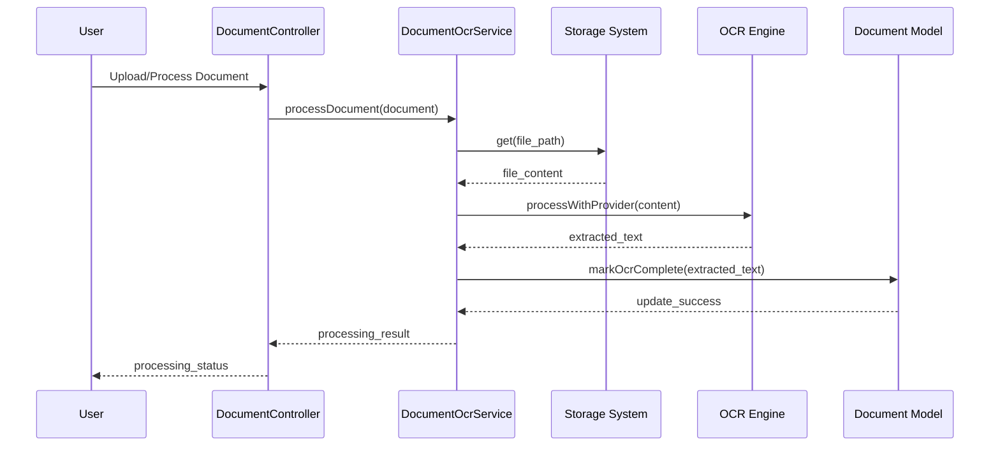
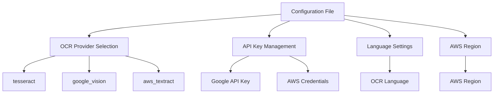
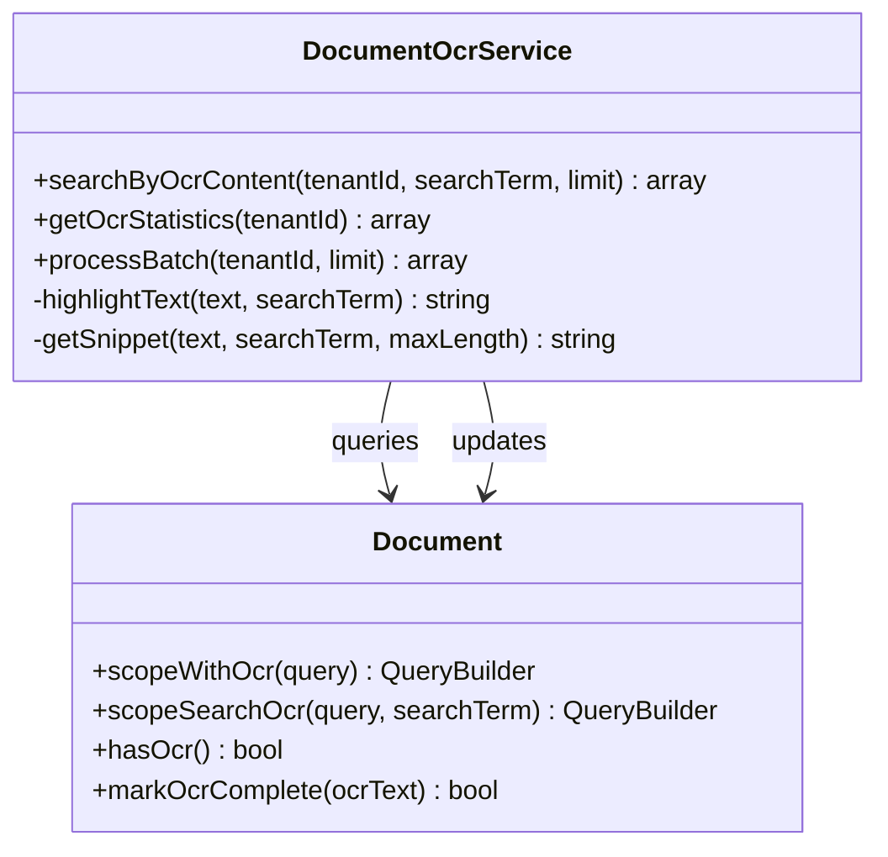
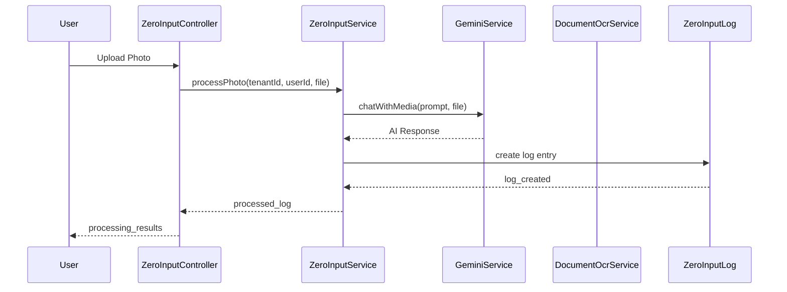
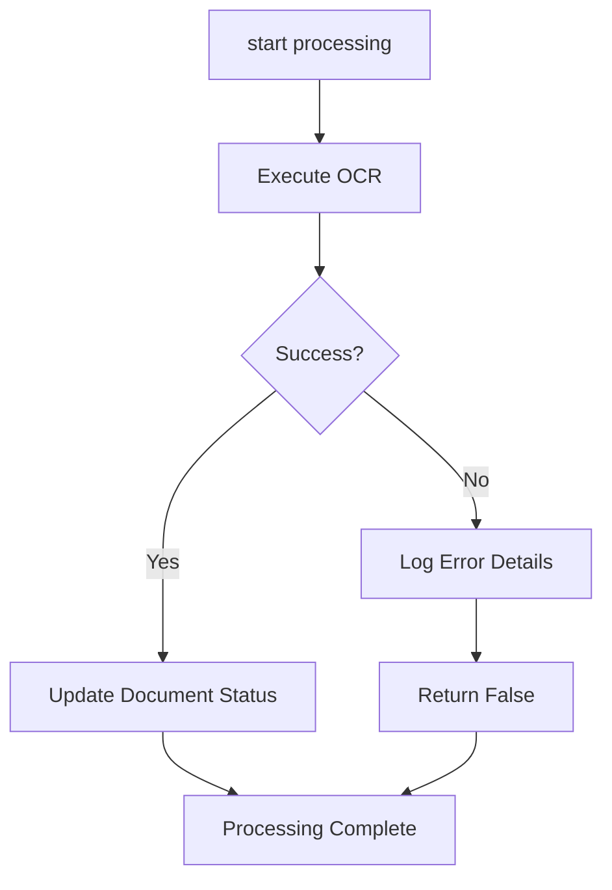

# Document OCR Processing

<cite>
**Referenced Files in This Document**
- [DocumentOcrService.php](file://app/Services/DocumentOcrService.php)
- [ProcessOcrQueue.php](file://app/Console/Commands/ProcessOcrQueue.php)
- [Document.php](file://app/Models/Document.php)
- [DocumentController.php](file://app/Http/Controllers/DocumentController.php)
- [ZeroInputController.php](file://app/Http/Controllers/ZeroInputController.php)
- [ZeroInputService.php](file://app/Services/ZeroInputService.php)
- [ZeroInputLog.php](file://app/Models/ZeroInputLog.php)
- [2026_03_23_000056_create_zero_input_logs_table.php](file://database/migrations/2026_03_23_000056_create_zero_input_logs_table.php)
- [services.php](file://config/services.php)
</cite>

## Table of Contents
1. [Introduction](#introduction)
2. [System Architecture](#system-architecture)
3. [Core Components](#core-components)
4. [OCR Processing Pipeline](#ocr-processing-pipeline)
5. [Configuration Management](#configuration-management)
6. [Search and Analytics](#search-and-analytics)
7. [Zero Input OCR Integration](#zero-input-ocr-integration)
8. [Error Handling and Monitoring](#error-handling-and-monitoring)
9. [Performance Considerations](#performance-considerations)
10. [Troubleshooting Guide](#troubleshooting-guide)
11. [Conclusion](#conclusion)

## Introduction

The Document OCR Processing system in qalcuityERP provides comprehensive optical character recognition capabilities for extracting text from various document types including PDFs, images (JPEG, PNG, TIFF), and scanned documents. This system enables intelligent document processing, search functionality, and automated data extraction for ERP integration.

The OCR system supports multiple processing engines including local Tesseract OCR, Google Vision API, and AWS Textract, providing flexibility for different deployment scenarios and accuracy requirements. The system integrates seamlessly with the document management workflow, enabling automatic text extraction during document upload and manual processing capabilities for existing documents.

## System Architecture

The OCR processing system follows a modular architecture with clear separation of concerns:

**Diagram sources**
- [DocumentOcrService.php:15-61](file://app/Services/DocumentOcrService.php#L15-L61)
- [ProcessOcrQueue.php:10-34](file://app/Console/Commands/ProcessOcrQueue.php#L10-L34)
- [DocumentController.php:145-161](file://app/Http/Controllers/DocumentController.php#L145-L161)

## Core Components

### DocumentOcrService

The central orchestrator for all OCR operations, providing unified interface for document text extraction across multiple providers.

**Key Features:**
- Multi-provider OCR support (Tesseract, Google Vision, AWS Textract)
- Batch processing capabilities
- Text search functionality
- Statistics generation
- Error handling and logging

**Section sources**
- [DocumentOcrService.php:15-61](file://app/Services/DocumentOcrService.php#L15-L61)
- [DocumentOcrService.php:29-61](file://app/Services/DocumentOcrService.php#L29-L61)

### ProcessOcrQueue Command

Console command for automated batch processing of documents requiring OCR.

**Capabilities:**
- Configurable batch size processing
- Tenant-specific filtering
- Dry-run mode for testing
- Progress indication and reporting
- Error collection and logging

**Section sources**
- [ProcessOcrQueue.php:10-34](file://app/Console/Commands/ProcessOcrQueue.php#L10-L34)
- [ProcessOcrQueue.php:39-151](file://app/Console/Commands/ProcessOcrQueue.php#L39-L151)

### Document Model Integration

Seamless integration with the Document model for OCR status management and text storage.

**Features:**
- Automatic OCR status tracking
- Text content storage
- Query scopes for OCR-enabled documents
- Search capability integration

**Section sources**
- [Document.php:211-220](file://app/Models/Document.php#L211-L220)
- [Document.php:316-331](file://app/Models/Document.php#L316-L331)

## OCR Processing Pipeline

The OCR processing pipeline handles document text extraction through multiple stages:

**Diagram sources**
- [DocumentOcrService.php:29-61](file://app/Services/DocumentOcrService.php#L29-L61)
- [DocumentController.php:148-161](file://app/Http/Controllers/DocumentController.php#L148-L161)

### Provider-Specific Processing

Each OCR provider follows a standardized interface while maintaining provider-specific optimizations:

**Tesseract Engine:**
- Local processing for privacy and performance
- Configurable language support
- Temporary file management
- Shell command execution

**Google Vision API:**
- Cloud-based processing with high accuracy
- Base64-encoded image transmission
- JSON response parsing
- API key authentication

**AWS Textract:**
- Enterprise-grade document analysis
- Structured data extraction
- Form and table recognition
- Region-specific endpoint configuration

**Section sources**
- [DocumentOcrService.php:66-81](file://app/Services/DocumentOcrService.php#L66-L81)
- [DocumentOcrService.php:86-109](file://app/Services/DocumentOcrService.php#L86-L109)
- [DocumentOcrService.php:114-135](file://app/Services/DocumentOcrService.php#L114-L135)

## Configuration Management

The OCR system utilizes Laravel's configuration system for flexible deployment scenarios:

### Service Configuration

**Diagram sources**
- [DocumentOcrService.php:20-24](file://app/Services/DocumentOcrService.php#L20-L24)
- [services.php:1-70](file://config/services.php#L1-L70)

### Environment Variables

The system supports multiple configuration approaches:

**Local Tesseract Setup:**
- No external API keys required
- Direct system integration
- Configurable language packs
- Performance depends on system resources

**Cloud Provider Setup:**
- API key configuration
- Network connectivity requirements
- Cost considerations per request
- Enhanced accuracy capabilities

**Section sources**
- [DocumentOcrService.php:22-23](file://app/Services/DocumentOcrService.php#L22-L23)
- [services.php:63-67](file://config/services.php#L63-L67)

## Search and Analytics

The OCR system provides comprehensive search and analytics capabilities:

### Text Search Functionality

**Diagram sources**
- [DocumentOcrService.php:140-169](file://app/Services/DocumentOcrService.php#L140-L169)
- [DocumentOcrService.php:174-192](file://app/Services/DocumentOcrService.php#L174-L192)
- [Document.php:316-331](file://app/Models/Document.php#L316-L331)

### Search Implementation

The search functionality provides:
- Full-text search across OCR-extracted content
- Term highlighting for better user experience
- Snippet generation for context display
- Tenant-scoped filtering
- Performance-optimized database queries

**Section sources**
- [DocumentOcrService.php:140-169](file://app/Services/DocumentOcrService.php#L140-L169)
- [DocumentOcrService.php:224-249](file://app/Services/DocumentOcrService.php#L224-L249)

## Zero Input OCR Integration

The system integrates with the Zero Input feature for automated document processing:

**Diagram sources**
- [ZeroInputController.php:27-52](file://app/Http/Controllers/ZeroInputController.php#L27-L52)
- [ZeroInputService.php:24-65](file://app/Services/ZeroInputService.php#L24-L65)

### Zero Input Log Management

The Zero Input system maintains detailed processing logs:

**Log Fields:**
- Processing status tracking
- Extracted data preservation
- Confidence score recording
- Error handling and recovery
- User feedback collection

**Section sources**
- [ZeroInputService.php:24-65](file://app/Services/ZeroInputService.php#L24-L65)
- [ZeroInputLog.php:10-31](file://app/Models/ZeroInputLog.php#L10-L31)
- [2026_03_23_000056_create_zero_input_logs_table.php:10-25](file://database/migrations/2026_03_23_000056_create_zero_input_logs_table.php#L10-L25)

## Error Handling and Monitoring

The OCR system implements comprehensive error handling and monitoring:

### Error Management Strategy

**Diagram sources**
- [DocumentOcrService.php:31-60](file://app/Services/DocumentOcrService.php#L31-L60)
- [ProcessOcrQueue.php:99-120](file://app/Console/Commands/ProcessOcrQueue.php#L99-L120)

### Logging and Monitoring

The system provides detailed logging for:
- Processing success/failure tracking
- Error message capture with context
- Performance metrics collection
- Provider-specific error handling
- Batch processing progress monitoring

**Section sources**
- [DocumentOcrService.php:46-58](file://app/Services/DocumentOcrService.php#L46-L58)
- [ProcessOcrQueue.php:113-117](file://app/Console/Commands/ProcessOcrQueue.php#L113-L117)

## Performance Considerations

### Processing Optimization

The OCR system implements several performance optimization strategies:

**Batch Processing:**
- Configurable batch sizes for memory management
- Progress indicators for long-running operations
- Error isolation to prevent cascade failures
- Resource cleanup after processing

**Storage Efficiency:**
- Lazy loading of file content
- Temporary file management
- Optimized database queries
- Index utilization for search operations

**Provider Selection:**
- Local Tesseract for privacy and speed
- Cloud providers for enhanced accuracy
- Cost-benefit analysis for enterprise deployment
- Scalability considerations for high-volume processing

### Memory and Resource Management

The system handles resource-intensive operations efficiently:
- Temporary file cleanup after Tesseract processing
- Stream-based file handling for large documents
- Database query optimization for search operations
- Progress tracking for user feedback

## Troubleshooting Guide

### Common Issues and Solutions

**Tesseract Not Found:**
- Verify Tesseract installation on system
- Check PATH environment variable configuration
- Confirm language pack availability
- Validate file permissions for temporary directory

**API Authentication Failures:**
- Verify API key configuration in environment variables
- Check network connectivity to external services
- Validate service quotas and limits
- Review API response error messages

**Performance Issues:**
- Adjust batch processing size based on system resources
- Monitor memory usage during processing
- Consider local vs. cloud provider trade-offs
- Optimize database indexing for search operations

**Search Not Working:**
- Verify OCR processing completion status
- Check database field population for OCR text
- Validate search term length requirements
- Review database connection and query performance

### Diagnostic Commands

The system provides diagnostic capabilities:
- Dry-run mode for testing without actual processing
- Batch processing results reporting
- Error detail collection and display
- Processing statistics and coverage metrics

**Section sources**
- [ProcessOcrQueue.php:68-84](file://app/Console/Commands/ProcessOcrQueue.php#L68-L84)
- [DocumentOcrService.php:174-192](file://app/Services/DocumentOcrService.php#L174-L192)

## Conclusion

The Document OCR Processing system in qalcuityERP provides a robust, scalable solution for document text extraction and intelligent processing. The system's modular architecture supports multiple OCR providers, ensuring flexibility for different deployment scenarios and accuracy requirements.

Key strengths of the system include:
- Comprehensive multi-provider OCR support
- Seamless integration with document management workflows
- Advanced search and analytics capabilities
- Robust error handling and monitoring
- Performance optimization for large-scale deployments
- Integration with automated processing workflows

The system successfully bridges the gap between traditional document management and modern AI-powered processing, enabling organizations to unlock the full potential of their document repositories while maintaining security, performance, and scalability.

Future enhancements could include additional OCR providers, advanced document classification, and enhanced analytics capabilities to further improve the document processing experience.