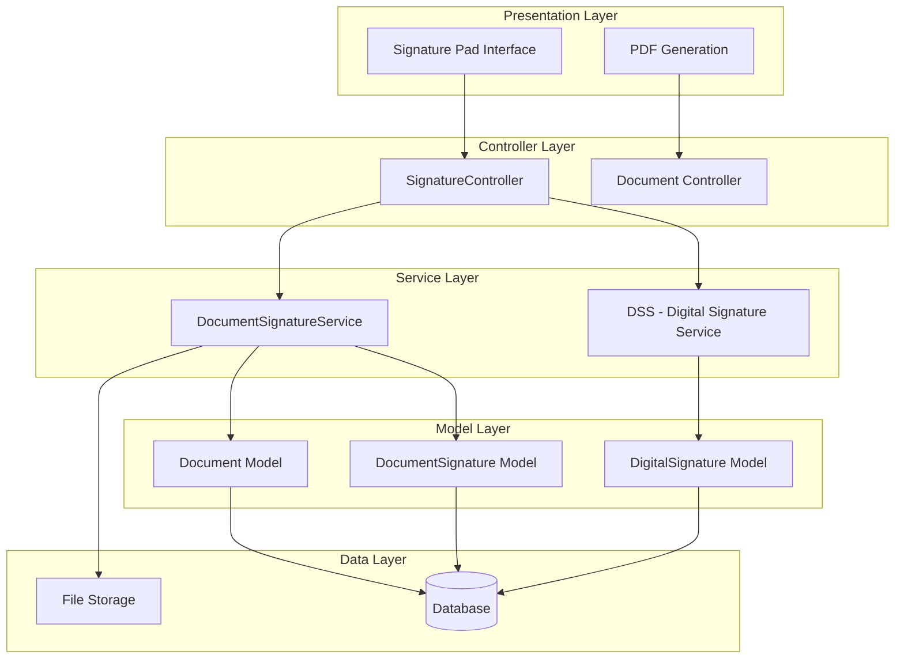
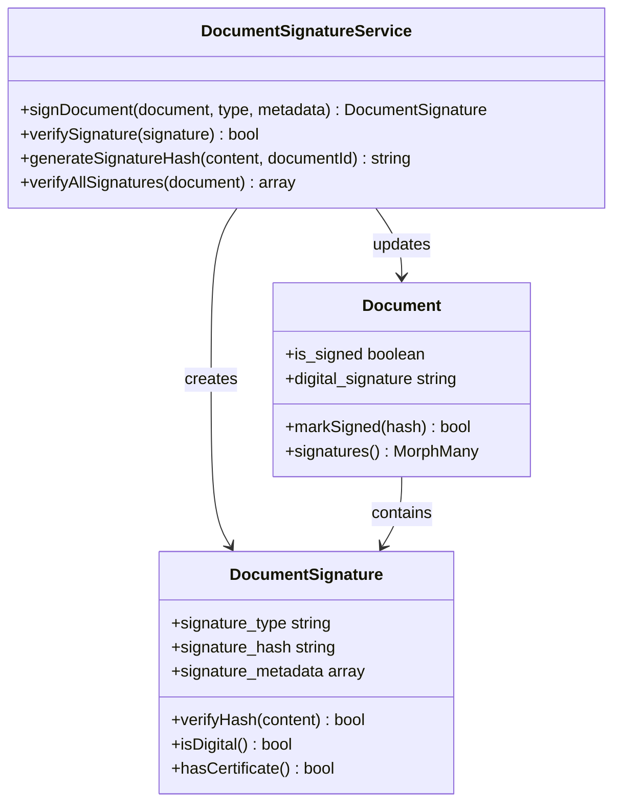
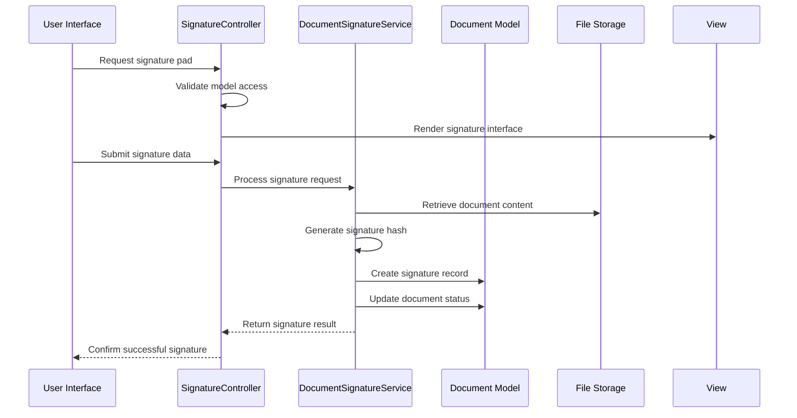
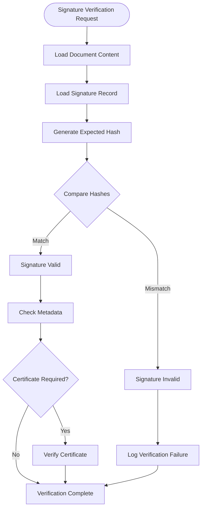
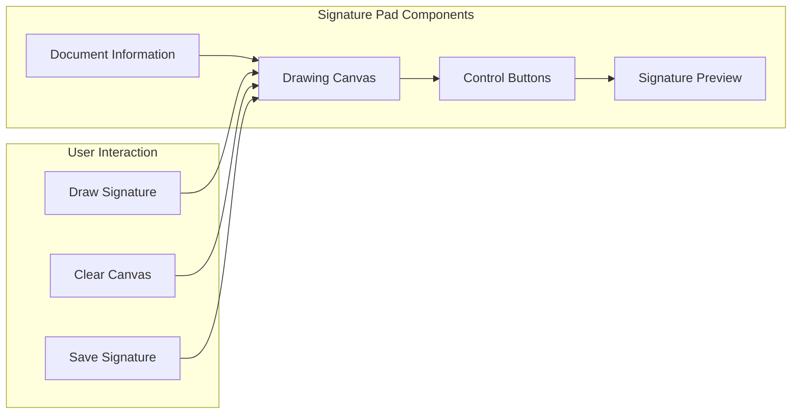

# Document Signature Management

<cite>
**Referenced Files in This Document**
- [DocumentSignatureService.php](file://app/Services/DocumentSignatureService.php)
- [DocumentSignature.php](file://app/Models/DocumentSignature.php)
- [DigitalSignature.php](file://app/Models/DigitalSignature.php)
- [Document.php](file://app/Models/Document.php)
- [SignatureController.php](file://app/Http/Controllers/SignatureController.php)
- [pad.blade.php](file://resources/views/signature/pad.blade.php)
- [pdf.blade.php](file://resources/views/invoices/pdf.blade.php)
- [web.php](file://routes/web.php)
</cite>

## Table of Contents
1. [Introduction](#introduction)
2. [System Architecture](#system-architecture)
3. [Core Components](#core-components)
4. [Signature Types and Implementation](#signature-types-and-implementation)
5. [Document Signing Process](#document-signing-process)
6. [Verification and Validation](#verification-and-validation)
7. [UI/UX Implementation](#uiux-implementation)
8. [Security Features](#security-features)
9. [Performance Considerations](#performance-considerations)
10. [Troubleshooting Guide](#troubleshooting-guide)
11. [Conclusion](#conclusion)

## Introduction

The Document Signature Management system in qalcuityERP provides a comprehensive solution for digital document signing and verification. This system supports both electronic and digital signature types, enabling secure document authentication and tamper-evident verification. The implementation follows modern security practices with cryptographic hashing, timestamping, and comprehensive audit trails.

The system integrates seamlessly with the existing document management infrastructure, providing robust signature capabilities while maintaining compliance with enterprise security standards. It supports multi-tenant environments and offers both programmatic APIs and user-friendly interfaces for signature capture and verification.

## System Architecture

The signature management system follows a layered architecture pattern with clear separation of concerns:

**Diagram sources**
- [SignatureController.php:1-52](file://app/Http/Controllers/SignatureController.php#L1-L52)
- [DocumentSignatureService.php:15-198](file://app/Services/DocumentSignatureService.php#L15-L198)
- [Document.php:11-333](file://app/Models/Document.php#L11-L333)

## Core Components

### DocumentSignatureService

The central service responsible for managing document signing operations. It handles both electronic and digital signature creation, verification, and management.

**Key Responsibilities:**
- Document signing with cryptographic hash generation
- Signature verification and validation
- Bulk signature operations
- Signature statistics and reporting
- Certificate management integration

**Section sources**
- [DocumentSignatureService.php:15-198](file://app/Services/DocumentSignatureService.php#L15-L198)

### DocumentSignature Model

Represents individual signature records with comprehensive metadata tracking.

**Core Attributes:**
- `signature_type`: Electronic or Digital
- `signature_hash`: Cryptographic hash for verification
- `signature_metadata`: JSON containing IP, user agent, timestamps
- `certificate_serial`: Optional certificate information
- `signed_at`: Timestamp of signature creation

**Section sources**
- [DocumentSignature.php:8-103](file://app/Models/DocumentSignature.php#L8-L103)

### DigitalSignature Model

Handles digital signatures for arbitrary models within the system.

**Key Features:**
- Polymorphic relationship support
- Tenant isolation
- User association
- Signature data storage

**Section sources**
- [DigitalSignature.php:9-22](file://app/Models/DigitalSignature.php#L9-L22)

### Document Model Integration

The Document model serves as the primary container for signed documents, maintaining signature state and metadata.

**Signature-Related Methods:**
- `markSigned()`: Updates document with signature hash
- `isSigned()`: Checks signature status
- `signatures()`: Relationship to signature records
- Status tracking and validation

**Section sources**
- [Document.php:110-232](file://app/Models/Document.php#L110-L232)

## Signature Types and Implementation

### Electronic Signatures

Electronic signatures represent the most common form of digital authentication in the system. They utilize cryptographic hashing for integrity verification.

**Diagram sources**
- [DocumentSignatureService.php:20-93](file://app/Services/DocumentSignatureService.php#L20-L93)
- [DocumentSignature.php:33-101](file://app/Models/DocumentSignature.php#L33-L101)
- [Document.php:225-232](file://app/Models/Document.php#L225-L232)

### Digital Signatures

Digital signatures provide enhanced security through certificate-based authentication and legal compliance.

**Implementation Details:**
- Certificate serial number tracking
- Enhanced metadata collection
- Legal compliance features
- Advanced verification capabilities

**Section sources**
- [DocumentSignature.php:82-93](file://app/Models/DocumentSignature.php#L82-L93)
- [DocumentSignatureService.php:98-108](file://app/Services/DocumentSignatureService.php#L98-L108)

## Document Signing Process

The document signing process follows a structured workflow ensuring security and auditability:

**Diagram sources**
- [SignatureController.php:11-50](file://app/Http/Controllers/SignatureController.php#L11-L50)
- [DocumentSignatureService.php:20-49](file://app/Services/DocumentSignatureService.php#L20-L49)

### Step-by-Step Process

1. **Signature Pad Access**: Users access the signature interface through dedicated routes
2. **Model Validation**: System verifies user permissions and model existence
3. **Signature Capture**: Canvas-based signature capture with real-time preview
4. **Data Processing**: Signature converted to PNG format and transmitted securely
5. **Cryptographic Hashing**: Document content hashed with unique identifiers
6. **Record Creation**: Signature metadata stored with comprehensive audit trail
7. **Document Update**: Document marked as signed with integrity hash
8. **Confirmation**: User receives success confirmation with timestamp

**Section sources**
- [pad.blade.php:11-126](file://resources/views/signature/pad.blade.php#L11-L126)
- [SignatureController.php:27-50](file://app/Http/Controllers/SignatureController.php#L27-L50)

## Verification and Validation

### Signature Integrity Verification

The system implements robust verification mechanisms to ensure document authenticity and integrity:

**Diagram sources**
- [DocumentSignatureService.php:54-63](file://app/Services/DocumentSignatureService.php#L54-L63)
- [DocumentSignature.php:73-77](file://app/Models/DocumentSignature.php#L73-L77)

### Verification Scopes and Methods

**Available Verification Methods:**
- Individual signature verification
- Bulk signature validation
- Certificate-based verification
- Metadata integrity checks
- Timestamp validation

**Section sources**
- [DocumentSignatureService.php:68-84](file://app/Services/DocumentSignatureService.php#L68-L84)
- [DocumentSignature.php:49-68](file://app/Models/DocumentSignature.php#L49-L68)

## UI/UX Implementation

### Signature Pad Interface

The signature capture interface provides an intuitive and responsive experience across devices:

**Diagram sources**
- [pad.blade.php:35-47](file://resources/views/signature/pad.blade.php#L35-L47)

### Responsive Design Features

**Desktop Experience:**
- Mouse-based drawing with pressure sensitivity
- High-resolution canvas rendering
- Real-time signature preview
- Comprehensive error handling

**Mobile Experience:**
- Touch-optimized drawing interface
- Adaptive canvas sizing
- Gesture-based controls
- Optimized performance for mobile devices

**Section sources**
- [pad.blade.php:49-126](file://resources/views/signature/pad.blade.php#L49-L126)

### PDF Integration

Signed documents can be exported with embedded signatures for official documentation:

**PDF Signature Display:**
- Embedded signature images
- Timestamp and user information
- Secure watermark integration
- Compliance-ready formatting

**Section sources**
- [pdf.blade.php:275-280](file://resources/views/invoices/pdf.blade.php#L275-L280)

## Security Features

### Cryptographic Implementation

The system employs industry-standard security practices:

**Hash Generation:**
- SHA-256 cryptographic hashing
- Content concatenation with document ID
- Timestamp-based entropy injection
- Non-reversible hash computation

**Metadata Protection:**
- IP address and user agent capture
- Device fingerprinting
- Geographic location tracking
- Session-based correlation

### Access Control and Authorization

**Multi-Layer Security:**
- Tenant isolation enforcement
- Role-based access control
- CSRF protection implementation
- Request validation and sanitization

**Section sources**
- [DocumentSignatureService.php:89-93](file://app/Services/DocumentSignatureService.php#L89-L93)
- [SignatureController.php:13-35](file://app/Http/Controllers/SignatureController.php#L13-L35)

### Audit Trail and Compliance

**Comprehensive Logging:**
- All signature operations tracked
- User activity monitoring
- System access logs
- Compliance reporting capabilities

**Legal Compliance:**
- Digital signature certification
- Electronic evidence preservation
- Tamper-evident documentation
- Regulatory compliance frameworks

## Performance Considerations

### Scalability Features

**Database Optimization:**
- Efficient indexing strategies
- Query optimization techniques
- Connection pooling implementation
- Caching layer integration

**Storage Efficiency:**
- Optimized file storage patterns
- CDN integration capabilities
- Compression algorithms
- Bandwidth optimization

### Memory Management

**Resource Optimization:**
- Canvas memory management
- Image processing efficiency
- Temporary file handling
- Garbage collection strategies

## Troubleshooting Guide

### Common Issues and Solutions

**Signature Not Saving:**
- Verify CSRF token presence
- Check browser compatibility
- Validate file size limits
- Review server permissions

**Verification Failures:**
- Confirm document integrity
- Check hash computation accuracy
- Validate timestamp synchronization
- Review certificate validity

**Performance Issues:**
- Optimize canvas rendering
- Implement lazy loading
- Monitor database queries
- Review network connectivity

### Debugging Tools

**Development Utilities:**
- Signature validation tools
- Hash computation verification
- Metadata inspection interfaces
- Performance monitoring dashboards

## Conclusion

The Document Signature Management system provides a robust, secure, and scalable solution for digital document authentication within qalcuityERP. The implementation balances security requirements with user experience, offering both electronic and digital signature capabilities with comprehensive verification and audit trail functionality.

Key strengths include:
- Multi-tenant architecture support
- Comprehensive security implementation
- Flexible signature types and verification methods
- User-friendly interface design
- Scalable performance characteristics
- Legal compliance readiness

The system successfully integrates with existing document management workflows while providing the foundation for advanced document authentication and legal compliance requirements. Future enhancements could include advanced certificate management, blockchain integration, and enhanced mobile capabilities.