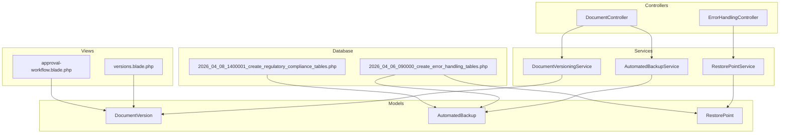
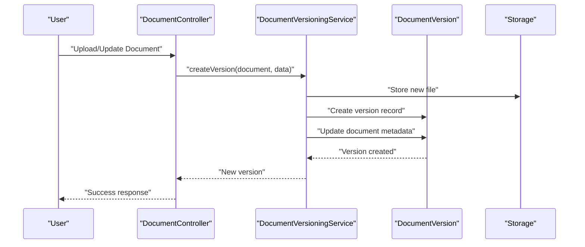
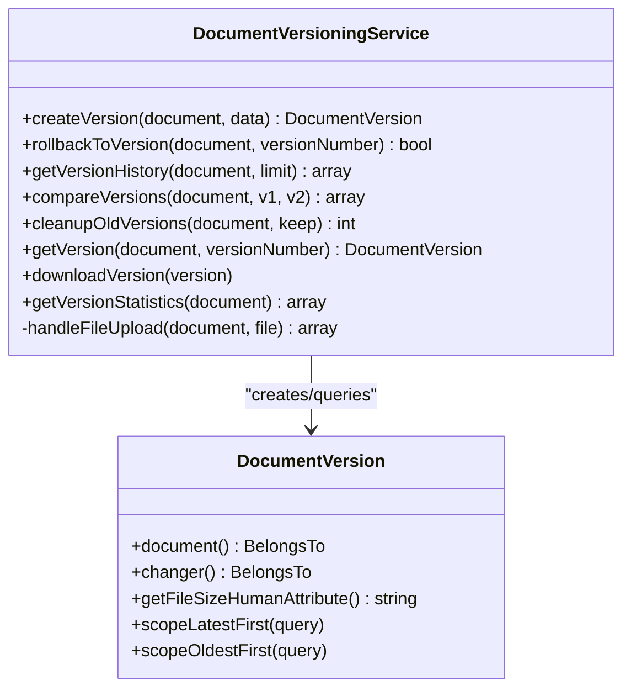
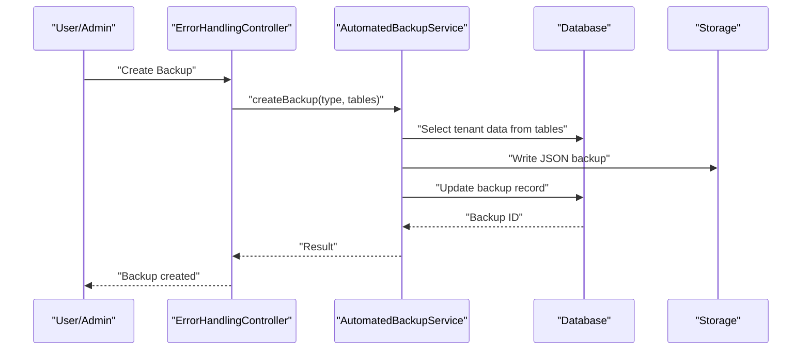
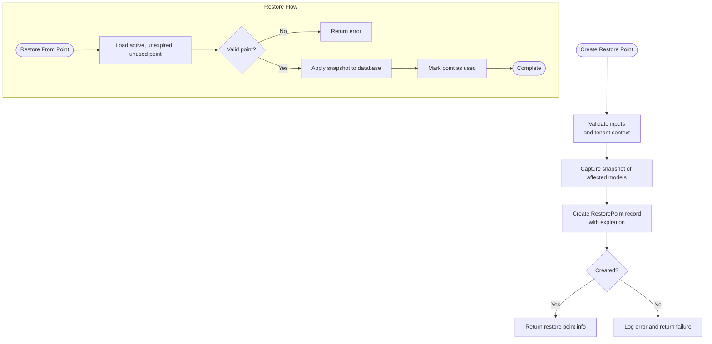
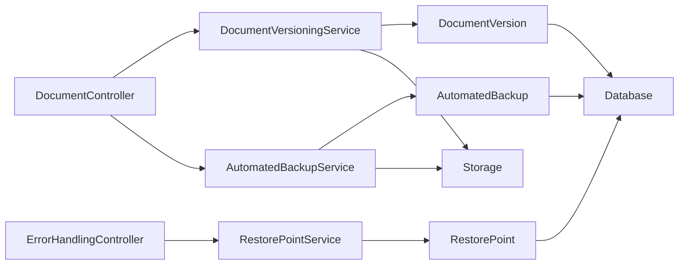

# Document Version Control

<cite>
**Referenced Files in This Document**
- [README.md](file://README.md)
- [composer.json](file://composer.json)
- [package.json](file://package.json)
- [DocumentVersioningService.php](file://app/Services/DocumentVersioningService.php)
- [DocumentVersion.php](file://app/Models/DocumentVersion.php)
- [DocumentController.php](file://app/Http/Controllers/DocumentController.php)
- [AutomatedBackupService.php](file://app/Services/AutomatedBackupService.php)
- [AutomatedBackup.php](file://app/Models/AutomatedBackup.php)
- [RestorePointService.php](file://app/Services/RestorePointService.php)
- [RestorePoint.php](file://app/Models/RestorePoint.php)
- [ErrorHandlingController.php](file://app/Http/Controllers/ErrorHandlingController.php)
- [2026_04_06_090000_create_error_handling_tables.php](file://database/migrations/2026_04_06_090000_create_error_handling_tables.php)
- [2026_04_08_1400001_create_regulatory_compliance_tables.php](file://database/migrations/2026_04_08_1400001_create_regulatory_compliance_tables.php)
- [versions.blade.php](file://resources/views/documents/versions.blade.php)
- [approval-workflow.blade.php](file://resources/views/documents/approval-workflow.blade.php)
</cite>

## Table of Contents
1. [Introduction](#introduction)
2. [Project Structure](#project-structure)
3. [Core Components](#core-components)
4. [Architecture Overview](#architecture-overview)
5. [Detailed Component Analysis](#detailed-component-analysis)
6. [Dependency Analysis](#dependency-analysis)
7. [Performance Considerations](#performance-considerations)
8. [Troubleshooting Guide](#troubleshooting-guide)
9. [Conclusion](#conclusion)

## Introduction
This document explains the version control capabilities implemented in the qalcuityERP system. The platform provides three complementary mechanisms for managing document and system state changes:
- Document Versioning: Tracks file revisions, enables rollbacks, and maintains version history with metadata.
- Automated Backups: Creates tenant-specific backups of critical data tables with retention policies.
- Restore Points: Captures snapshots of affected models before major operations for disaster recovery.

These features collectively support compliance, auditability, and operational continuity across multi-tenant deployments.

## Project Structure
The version control functionality spans services, models, controllers, views, and database migrations:

**Diagram sources**
- [DocumentController.php:1-379](file://app/Http/Controllers/DocumentController.php#L1-L379)
- [ErrorHandlingController.php:116-159](file://app/Http/Controllers/ErrorHandlingController.php#L116-L159)
- [DocumentVersioningService.php:1-226](file://app/Services/DocumentVersioningService.php#L1-L226)
- [AutomatedBackupService.php:1-224](file://app/Services/AutomatedBackupService.php#L1-L224)
- [RestorePointService.php:1-169](file://app/Services/RestorePointService.php#L1-L169)
- [DocumentVersion.php:1-73](file://app/Models/DocumentVersion.php#L1-L73)
- [AutomatedBackup.php:1-71](file://app/Models/AutomatedBackup.php#L1-L71)
- [RestorePoint.php:1-63](file://app/Models/RestorePoint.php#L1-L63)
- [versions.blade.php:63-79](file://resources/views/documents/versions.blade.php#L63-L79)
- [approval-workflow.blade.php:48-70](file://resources/views/documents/approval-workflow.blade.php#L48-L70)
- [2026_04_06_090000_create_error_handling_tables.php:120-159](file://database/migrations/2026_04_06_090000_create_error_handling_tables.php#L120-L159)
- [2026_04_08_1400001_create_regulatory_compliance_tables.php:232-265](file://database/migrations/2026_04_08_1400001_create_regulatory_compliance_tables.php#L232-L265)

**Section sources**
- [README.md:1-576](file://README.md#L1-L576)
- [composer.json:1-105](file://composer.json#L1-L105)
- [package.json:1-35](file://package.json#L1-L35)

## Core Components
- Document Versioning Service: Manages document file versions, rollback, comparison, cleanup, and statistics.
- Automated Backup Service: Creates tenant-scoped backups of selected tables, tracks metadata, and supports restoration.
- Restore Point Service: Captures model snapshots before major changes, enforces expiration, and restores data safely.
- Supporting Models: Define schema, relationships, and computed attributes for versions, backups, and restore points.
- Controllers and Views: Expose APIs and UI for version history, approvals, and recovery operations.

**Section sources**
- [DocumentVersioningService.php:1-226](file://app/Services/DocumentVersioningService.php#L1-L226)
- [AutomatedBackupService.php:1-224](file://app/Services/AutomatedBackupService.php#L1-L224)
- [RestorePointService.php:1-169](file://app/Services/RestorePointService.php#L1-L169)
- [DocumentVersion.php:1-73](file://app/Models/DocumentVersion.php#L1-L73)
- [AutomatedBackup.php:1-71](file://app/Models/AutomatedBackup.php#L1-L71)
- [RestorePoint.php:1-63](file://app/Models/RestorePoint.php#L1-L63)
- [DocumentController.php:1-379](file://app/Http/Controllers/DocumentController.php#L1-L379)
- [ErrorHandlingController.php:116-159](file://app/Http/Controllers/ErrorHandlingController.php#L116-L159)

## Architecture Overview
The version control architecture integrates user actions with persistence and recovery mechanisms:

**Diagram sources**
- [DocumentController.php:99-143](file://app/Http/Controllers/DocumentController.php#L99-L143)
- [DocumentVersioningService.php:22-48](file://app/Services/DocumentVersioningService.php#L22-L48)
- [DocumentVersion.php:1-73](file://app/Models/DocumentVersion.php#L1-L73)

## Detailed Component Analysis

### Document Versioning Service
Manages document lifecycle versions with atomic transactions, file storage, and metadata tracking.

**Diagram sources**
- [DocumentVersioningService.php:1-226](file://app/Services/DocumentVersioningService.php#L1-L226)
- [DocumentVersion.php:1-73](file://app/Models/DocumentVersion.php#L1-L73)

Key capabilities:
- Atomic version creation with file upload handling and document metadata updates.
- Rollback to any historical version with a new version entry.
- Version comparison with difference metrics.
- Cleanup policy to retain a configurable number of versions.
- Statistics aggregation for auditing and capacity planning.

**Section sources**
- [DocumentVersioningService.php:22-98](file://app/Services/DocumentVersioningService.php#L22-L98)
- [DocumentVersioningService.php:103-155](file://app/Services/DocumentVersioningService.php#L103-L155)
- [DocumentVersioningService.php:160-224](file://app/Services/DocumentVersioningService.php#L160-L224)
- [DocumentVersion.php:47-71](file://app/Models/DocumentVersion.php#L47-L71)

### Automated Backup Service
Provides tenant-aware backups of critical tables with retention and restoration.

**Diagram sources**
- [ErrorHandlingController.php:127-143](file://app/Http/Controllers/ErrorHandlingController.php#L127-L143)
- [AutomatedBackupService.php:15-92](file://app/Services/AutomatedBackupService.php#L15-L92)
- [AutomatedBackup.php:1-71](file://app/Models/AutomatedBackup.php#L1-L71)

Operational flow:
- Backup creation captures tenant-scoped records from configured tables.
- Backup metadata includes type, status, timestamps, file path, size, and expiration.
- Restoration replays backup data into the database with safety checks.
- Cleanup removes expired backups to control storage usage.

**Section sources**
- [AutomatedBackupService.php:15-92](file://app/Services/AutomatedBackupService.php#L15-L92)
- [AutomatedBackupService.php:97-157](file://app/Services/AutomatedBackupService.php#L97-L157)
- [AutomatedBackupService.php:162-222](file://app/Services/AutomatedBackupService.php#L162-L222)
- [AutomatedBackup.php:41-70](file://app/Models/AutomatedBackup.php#L41-L70)

### Restore Point Service
Captures model snapshots before major changes and supports safe restoration.

**Diagram sources**
- [RestorePointService.php:14-49](file://app/Services/RestorePointService.php#L14-L49)
- [RestorePointService.php:54-82](file://app/Services/RestorePointService.php#L54-L82)
- [RestorePointService.php:122-136](file://app/Services/RestorePointService.php#L122-L136)
- [RestorePoint.php:46-63](file://app/Models/RestorePoint.php#L46-L63)

**Section sources**
- [RestorePointService.php:14-49](file://app/Services/RestorePointService.php#L14-L49)
- [RestorePointService.php:54-82](file://app/Services/RestorePointService.php#L54-L82)
- [RestorePointService.php:122-169](file://app/Services/RestorePointService.php#L122-L169)
- [RestorePoint.php:14-63](file://app/Models/RestorePoint.php#L14-L63)

### UI Integration and Display
- Version History UI: Renders version metadata, change summaries, and editor attribution.
- Approval Workflow UI: Shows document version alongside approval steps and notes.

**Section sources**
- [versions.blade.php:63-79](file://resources/views/documents/versions.blade.php#L63-L79)
- [approval-workflow.blade.php:48-70](file://resources/views/documents/approval-workflow.blade.php#L48-L70)

## Dependency Analysis
The version control system relies on Laravel's Eloquent ORM, database transactions, and storage abstraction. Controllers delegate to services, which encapsulate business logic and persistence concerns.

**Diagram sources**
- [DocumentController.php:1-379](file://app/Http/Controllers/DocumentController.php#L1-L379)
- [ErrorHandlingController.php:116-159](file://app/Http/Controllers/ErrorHandlingController.php#L116-L159)
- [DocumentVersioningService.php:1-226](file://app/Services/DocumentVersioningService.php#L1-L226)
- [AutomatedBackupService.php:1-224](file://app/Services/AutomatedBackupService.php#L1-L224)
- [RestorePointService.php:1-169](file://app/Services/RestorePointService.php#L1-L169)
- [DocumentVersion.php:1-73](file://app/Models/DocumentVersion.php#L1-L73)
- [AutomatedBackup.php:1-71](file://app/Models/AutomatedBackup.php#L1-L71)
- [RestorePoint.php:1-63](file://app/Models/RestorePoint.php#L1-L63)

**Section sources**
- [composer.json:1-105](file://composer.json#L1-L105)
- [package.json:1-35](file://package.json#L1-L35)

## Performance Considerations
- Transactions: All versioning and backup operations use database transactions to maintain consistency.
- Storage Efficiency: Version cleanup and backup expiration prevent unlimited growth of stored artifacts.
- Indexing: Migration files define indexes on frequently queried columns (e.g., tenant_id, status, timestamps) to optimize lookups.
- Scalability: For large datasets, consider partitioning or external storage for backups and limiting the number of retained versions.

[No sources needed since this section provides general guidance]

## Troubleshooting Guide
Common issues and resolutions:
- Backup Creation Failure: Check error logs and verify storage availability and database connectivity.
- Restore Failure: Ensure backup status is completed and file integrity is intact; re-run with corrected credentials.
- Version Not Found: Confirm version number exists for the document and user permissions are sufficient.
- Restore Point Expired: Create a new restore point before proceeding with risky operations.

**Section sources**
- [AutomatedBackupService.php:76-91](file://app/Services/AutomatedBackupService.php#L76-L91)
- [AutomatedBackupService.php:149-156](file://app/Services/AutomatedBackupService.php#L149-L156)
- [DocumentVersioningService.php:173-178](file://app/Services/DocumentVersioningService.php#L173-L178)
- [RestorePointService.php:74-76](file://app/Services/RestorePointService.php#L74-L76)

## Conclusion
The qalcuityERP version control system provides robust mechanisms for document versioning, tenant backups, and pre-change snapshots. Together, these features enable compliance, auditability, and operational resilience across multi-tenant environments. Proper configuration of retention policies, storage, and monitoring ensures reliable long-term operation.