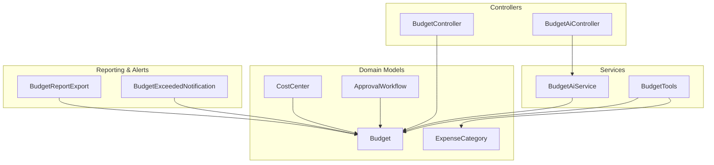
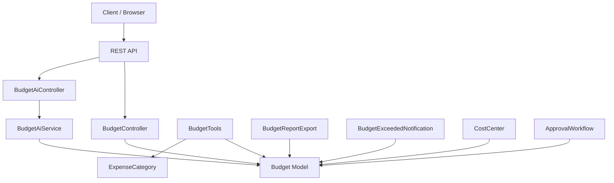
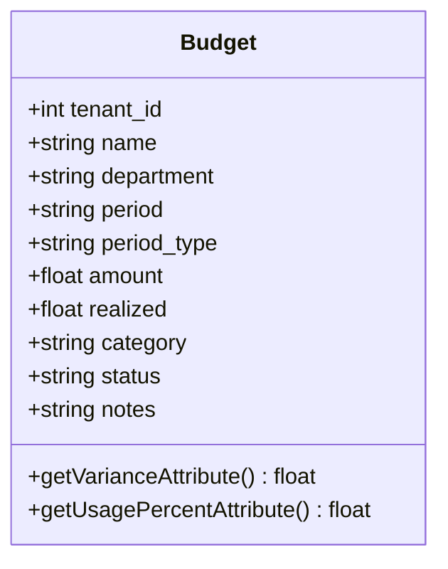
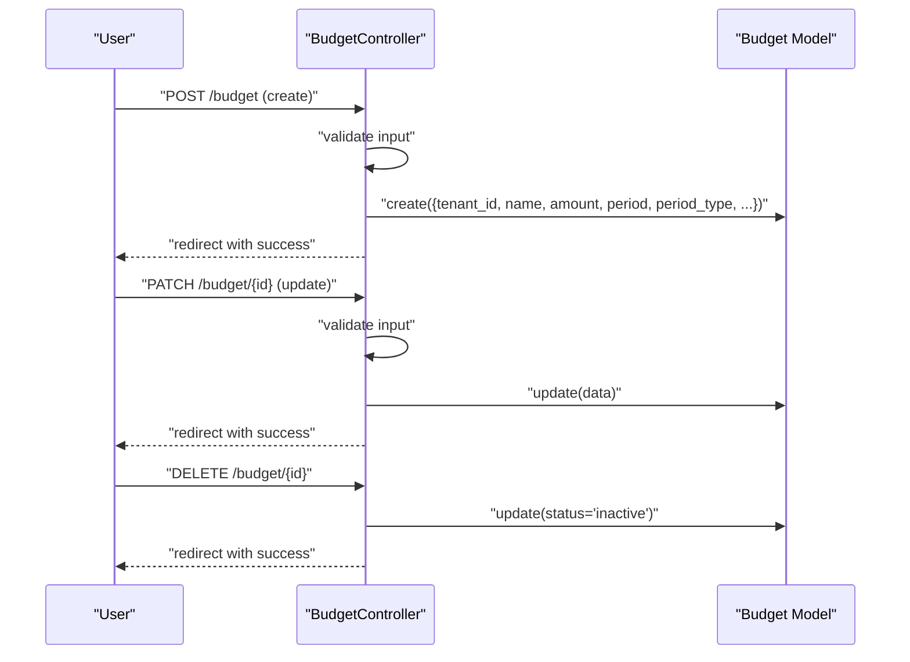
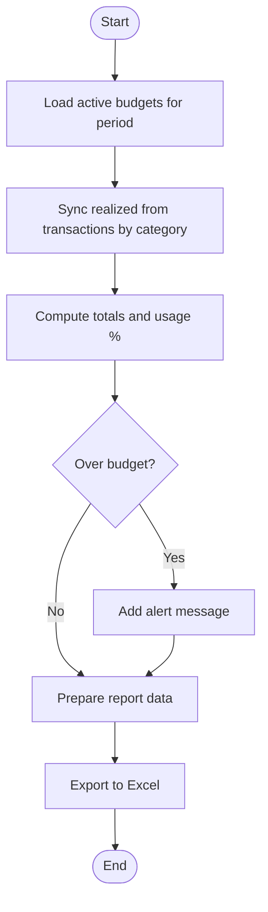
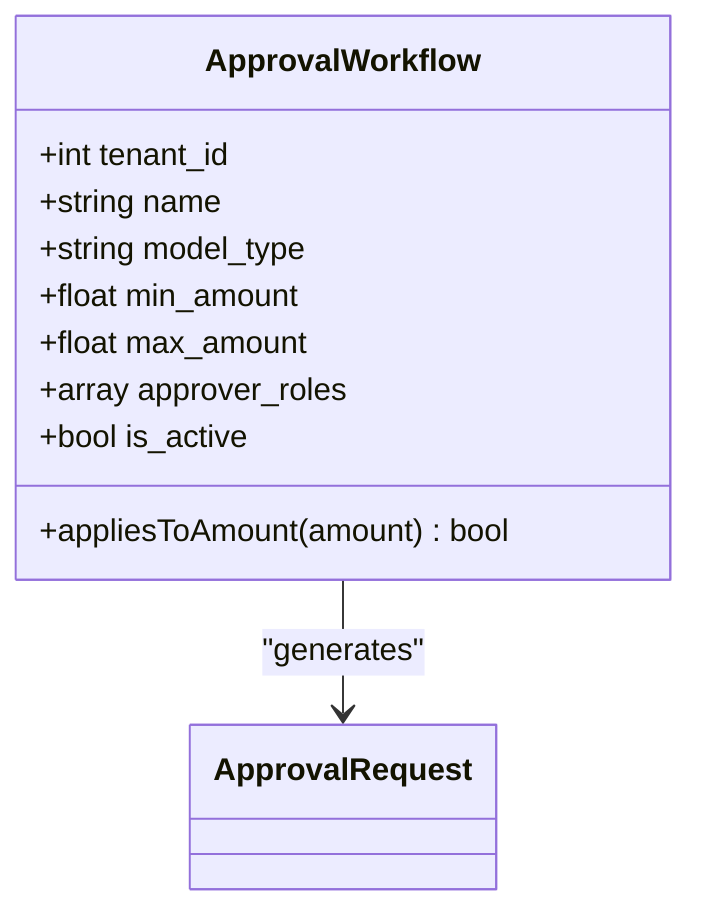
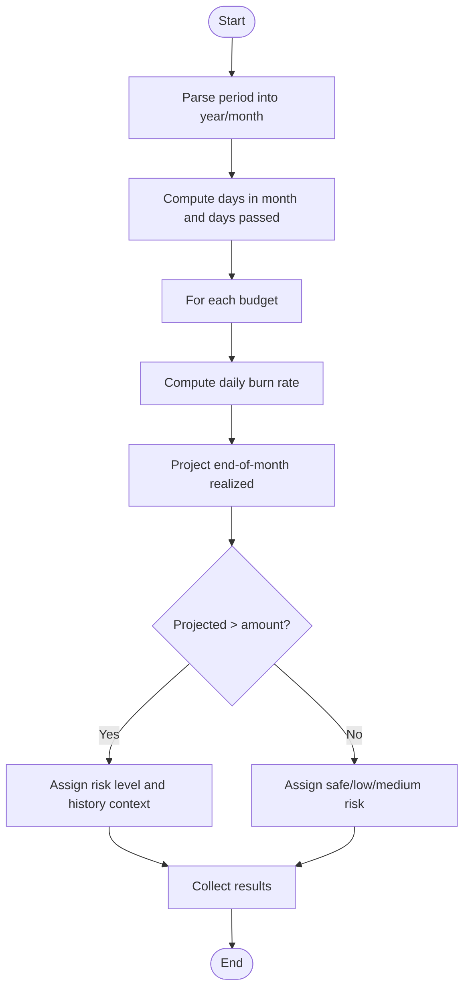
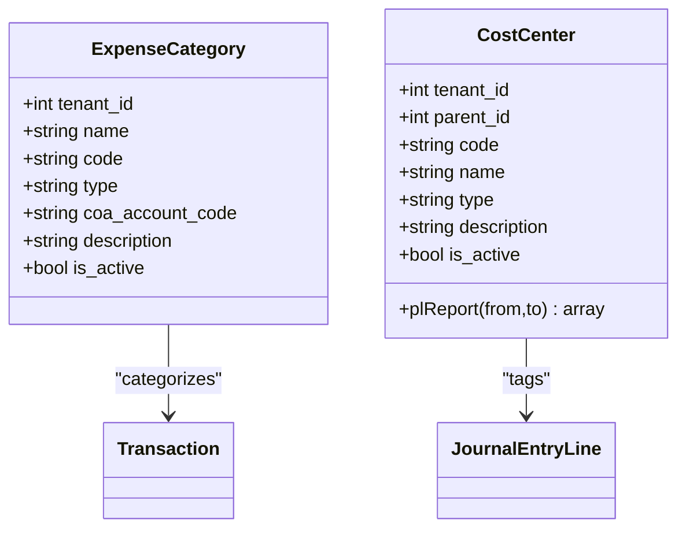
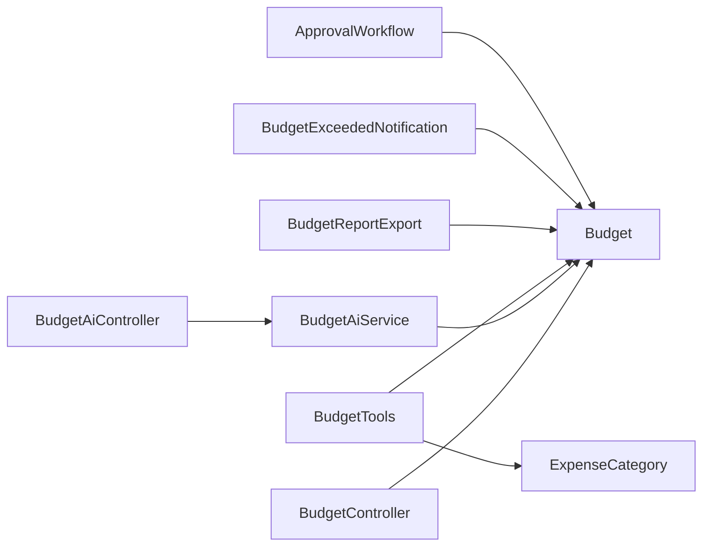

# Budget Management

<cite>
**Referenced Files in This Document**
- [Budget.php](file://app/Models/Budget.php)
- [BudgetController.php](file://app/Http/Controllers/BudgetController.php)
- [BudgetAiController.php](file://app/Http/Controllers/BudgetAiController.php)
- [BudgetAiService.php](file://app/Services/BudgetAiService.php)
- [BudgetTools.php](file://app/Services/ERP/BudgetTools.php)
- [BudgetReportExport.php](file://app/Exports/BudgetReportExport.php)
- [BudgetExceededNotification.php](file://app/Notifications/BudgetExceededNotification.php)
- [CostCenter.php](file://app/Models/CostCenter.php)
- [ExpenseCategory.php](file://app/Models/ExpenseCategory.php)
- [ApprovalWorkflow.php](file://app/Models/ApprovalWorkflow.php)
</cite>

## Table of Contents
1. [Introduction](#introduction)
2. [Project Structure](#project-structure)
3. [Core Components](#core-components)
4. [Architecture Overview](#architecture-overview)
5. [Detailed Component Analysis](#detailed-component-analysis)
6. [Dependency Analysis](#dependency-analysis)
7. [Performance Considerations](#performance-considerations)
8. [Troubleshooting Guide](#troubleshooting-guide)
9. [Conclusion](#conclusion)

## Introduction
This document describes the Budget Management system in qalcuityERP. It covers budget planning, allocation, tracking, and reporting; period-based budgeting (monthly, quarterly, annual); departmental budgeting; budget approval workflows; variance analysis, forecasting capabilities, and budget-to-actual comparisons; budget categories and cost centers integration; multi-dimensional budget reporting; budget modification procedures; rollover mechanisms; and budget status management.

## Project Structure
The Budget Management system spans models, controllers, services, exports, and notifications:
- Model: Budget stores budget records with amount, realized, category, department, period, period_type, and status.
- Controllers: BudgetController handles CRUD operations; BudgetAiController exposes AI-driven endpoints.
- Services: BudgetAiService performs overrun prediction and allocation suggestions; BudgetTools provides budget tooling for creation, comparison, and updates.
- Export: BudgetReportExport generates Excel reports for budget vs actual.
- Notification: BudgetExceededNotification emails alerts for budgets exceeding thresholds.
- Supporting models: CostCenter and ExpenseCategory integrate with cost centers and expense categories for richer reporting and categorization.
- Approval: ApprovalWorkflow supports budget-related approvals when integrated.

**Diagram sources**
- [BudgetController.php:1-74](file://app/Http/Controllers/BudgetController.php#L1-L74)
- [BudgetAiController.php:1-60](file://app/Http/Controllers/BudgetAiController.php#L1-L60)
- [BudgetAiService.php:1-245](file://app/Services/BudgetAiService.php#L1-L245)
- [BudgetTools.php:1-163](file://app/Services/ERP/BudgetTools.php#L1-L163)
- [BudgetReportExport.php:1-113](file://app/Exports/BudgetReportExport.php#L1-L113)
- [BudgetExceededNotification.php:1-60](file://app/Notifications/BudgetExceededNotification.php#L1-L60)
- [Budget.php:1-37](file://app/Models/Budget.php#L1-L37)
- [CostCenter.php:1-73](file://app/Models/CostCenter.php#L1-L73)
- [ExpenseCategory.php:1-24](file://app/Models/ExpenseCategory.php#L1-L24)
- [ApprovalWorkflow.php:1-33](file://app/Models/ApprovalWorkflow.php#L1-L33)

**Section sources**
- [Budget.php:1-37](file://app/Models/Budget.php#L1-L37)
- [BudgetController.php:1-74](file://app/Http/Controllers/BudgetController.php#L1-L74)
- [BudgetAiController.php:1-60](file://app/Http/Controllers/BudgetAiController.php#L1-L60)
- [BudgetAiService.php:1-245](file://app/Services/BudgetAiService.php#L1-L245)
- [BudgetTools.php:1-163](file://app/Services/ERP/BudgetTools.php#L1-L163)
- [BudgetReportExport.php:1-113](file://app/Exports/BudgetReportExport.php#L1-L113)
- [BudgetExceededNotification.php:1-60](file://app/Notifications/BudgetExceededNotification.php#L1-L60)
- [CostCenter.php:1-73](file://app/Models/CostCenter.php#L1-L73)
- [ExpenseCategory.php:1-24](file://app/Models/ExpenseCategory.php#L1-L24)
- [ApprovalWorkflow.php:1-33](file://app/Models/ApprovalWorkflow.php#L1-L33)

## Core Components
- Budget model: Holds budget metadata, amount, realized, category, department, period, period_type, and status. Provides variance and usage percent computed attributes.
- BudgetController: Manages listing, creation, updates, and deactivation of budgets for the current tenant and selected period.
- BudgetAiController: Exposes endpoints for overrun predictions and allocation suggestions powered by BudgetAiService.
- BudgetAiService: Implements overrun prediction using daily burn rate projection and historical overruns; suggests allocations using last year’s realized or recent averages.
- BudgetTools: Provides tooling to create budgets, compute budget vs actual, and update realized amounts; integrates with expense categories and transactions.
- BudgetReportExport: Generates an Excel report of budget vs actual with color-coded status and aligned numeric columns.
- BudgetExceededNotification: Sends email alerts when budgets exceed usage thresholds.
- CostCenter and ExpenseCategory: Support cost center hierarchy and expense categorization for deeper reporting and filtering.
- ApprovalWorkflow: Defines approval workflows that can be applied to budget-related transactions or changes.

**Section sources**
- [Budget.php:12-36](file://app/Models/Budget.php#L12-L36)
- [BudgetController.php:12-72](file://app/Http/Controllers/BudgetController.php#L12-L72)
- [BudgetAiController.php:25-58](file://app/Http/Controllers/BudgetAiController.php#L25-L58)
- [BudgetAiService.php:35-96](file://app/Services/BudgetAiService.php#L35-L96)
- [BudgetAiService.php:134-243](file://app/Services/BudgetAiService.php#L134-L243)
- [BudgetTools.php:58-161](file://app/Services/ERP/BudgetTools.php#L58-L161)
- [BudgetReportExport.php:28-88](file://app/Exports/BudgetReportExport.php#L28-L88)
- [BudgetExceededNotification.php:17-58](file://app/Notifications/BudgetExceededNotification.php#L17-L58)
- [CostCenter.php:14-33](file://app/Models/CostCenter.php#L14-L33)
- [ExpenseCategory.php:14-22](file://app/Models/ExpenseCategory.php#L14-L22)
- [ApprovalWorkflow.php:12-31](file://app/Models/ApprovalWorkflow.php#L12-L31)

## Architecture Overview
The system follows a layered architecture:
- Presentation: Controllers expose endpoints and render views.
- Application: Services encapsulate business logic (AI analysis, tooling).
- Domain: Models represent entities (Budget, CostCenter, ExpenseCategory).
- Reporting/Alerts: Export and notification components produce reports and alerts.

**Diagram sources**
- [BudgetController.php:1-74](file://app/Http/Controllers/BudgetController.php#L1-L74)
- [BudgetAiController.php:1-60](file://app/Http/Controllers/BudgetAiController.php#L1-L60)
- [BudgetAiService.php:1-245](file://app/Services/BudgetAiService.php#L1-L245)
- [BudgetTools.php:1-163](file://app/Services/ERP/BudgetTools.php#L1-L163)
- [BudgetReportExport.php:1-113](file://app/Exports/BudgetReportExport.php#L1-L113)
- [BudgetExceededNotification.php:1-60](file://app/Notifications/BudgetExceededNotification.php#L1-L60)
- [Budget.php:1-37](file://app/Models/Budget.php#L1-L37)
- [CostCenter.php:1-73](file://app/Models/CostCenter.php#L1-L73)
- [ExpenseCategory.php:1-24](file://app/Models/ExpenseCategory.php#L1-L24)
- [ApprovalWorkflow.php:1-33](file://app/Models/ApprovalWorkflow.php#L1-L33)

## Detailed Component Analysis

### Budget Model
The Budget model defines the persisted entity for budgets, including computed attributes for variance and usage percentage. It enforces tenant scoping and audits changes.

**Diagram sources**
- [Budget.php:10-36](file://app/Models/Budget.php#L10-L36)

**Section sources**
- [Budget.php:12-36](file://app/Models/Budget.php#L12-L36)

### Budget Creation and Modification
Budget creation and updates are handled by the BudgetController. Creation validates name, amount, period, period_type, and optional category/department/notes; updates allow edits to name, department, category, amount, realized, and notes. Deactivation sets status to inactive.

**Diagram sources**
- [BudgetController.php:34-72](file://app/Http/Controllers/BudgetController.php#L34-L72)
- [Budget.php:13-26](file://app/Models/Budget.php#L13-L26)

**Section sources**
- [BudgetController.php:12-72](file://app/Http/Controllers/BudgetController.php#L12-L72)

### Budget Variance Analysis and Budget-to-Actual Comparison
BudgetTools computes budget vs actual by syncing realized amounts from transactions filtered by category and period, then aggregates totals and flags over-budget items. BudgetReportExport produces a standardized Excel report with color-coded status and right-aligned numeric columns.

**Diagram sources**
- [BudgetTools.php:81-139](file://app/Services/ERP/BudgetTools.php#L81-L139)
- [BudgetReportExport.php:51-72](file://app/Exports/BudgetReportExport.php#L51-L72)

**Section sources**
- [BudgetTools.php:81-139](file://app/Services/ERP/BudgetTools.php#L81-L139)
- [BudgetReportExport.php:28-88](file://app/Exports/BudgetReportExport.php#L28-L88)

### Budget Approval Processes
ApprovalWorkflow defines approval rules by model type, amount range, and approver roles. While not directly tied to Budget creation in the examined code, it can be applied to budget-related transactions or changes when configured accordingly.

**Diagram sources**
- [ApprovalWorkflow.php:9-32](file://app/Models/ApprovalWorkflow.php#L9-L32)

**Section sources**
- [ApprovalWorkflow.php:12-31](file://app/Models/ApprovalWorkflow.php#L12-L31)

### Budget Variance Analysis and Forecasting
BudgetAiService predicts potential overruns using daily burn rate and projects monthly end realized; it also suggests allocations based on last year’s realized or recent averages with configurable buffers and confidence levels.

**Diagram sources**
- [BudgetAiService.php:35-96](file://app/Services/BudgetAiService.php#L35-L96)

**Section sources**
- [BudgetAiService.php:16-96](file://app/Services/BudgetAiService.php#L16-L96)
- [BudgetAiService.php:118-243](file://app/Services/BudgetAiService.php#L118-L243)

### Budget Categories and Cost Centers Integration
- ExpenseCategory: Links transactions to categories for accurate budget vs actual synchronization by category.
- CostCenter: Supports hierarchical cost centers and can be used for P&L reporting; while not directly used in BudgetTools in the examined code, it complements budget reporting by department/project/branch.

**Diagram sources**
- [ExpenseCategory.php:11-23](file://app/Models/ExpenseCategory.php#L11-L23)
- [CostCenter.php:11-72](file://app/Models/CostCenter.php#L11-L72)

**Section sources**
- [ExpenseCategory.php:14-22](file://app/Models/ExpenseCategory.php#L14-L22)
- [CostCenter.php:39-71](file://app/Models/CostCenter.php#L39-L71)

### Multi-Dimensional Budget Reporting
BudgetReportExport provides a standardized report with:
- Columns: Name, Department, Category, Budget, Actual, Variance, Usage %, Status
- Color-coded status (OVER BUDGET/HAMPIR HABIS/NORMAL)
- Right-aligned numeric columns
- Sheet styling and column widths

**Section sources**
- [BudgetReportExport.php:37-88](file://app/Exports/BudgetReportExport.php#L37-L88)

### Budget Alerts and Notifications
BudgetExceededNotification compiles exceeded and warning budgets (usage ≥ 100% and ≥ 80%) and sends an email summary with formatted values and action link.

**Section sources**
- [BudgetExceededNotification.php:17-58](file://app/Notifications/BudgetExceededNotification.php#L17-L58)

## Dependency Analysis
Key dependencies and relationships:
- BudgetController depends on Budget model and Laravel request validation.
- BudgetAiController depends on BudgetAiService and authenticates tenant context.
- BudgetAiService depends on Budget model and uses Carbon for date calculations.
- BudgetTools depends on Budget and Transaction models; integrates with ExpenseCategory for category-based sync.
- BudgetReportExport depends on Budget model and uses maatwebsite/excel.
- BudgetExceededNotification depends on Budget usage_percent computation and email transport.
- ApprovalWorkflow governs approval gating for budget-related transactions.

**Diagram sources**
- [BudgetController.php:1-74](file://app/Http/Controllers/BudgetController.php#L1-L74)
- [BudgetAiController.php:1-60](file://app/Http/Controllers/BudgetAiController.php#L1-L60)
- [BudgetAiService.php:1-245](file://app/Services/BudgetAiService.php#L1-L245)
- [BudgetTools.php:1-163](file://app/Services/ERP/BudgetTools.php#L1-L163)
- [BudgetReportExport.php:1-113](file://app/Exports/BudgetReportExport.php#L1-L113)
- [BudgetExceededNotification.php:1-60](file://app/Notifications/BudgetExceededNotification.php#L1-L60)
- [Budget.php:1-37](file://app/Models/Budget.php#L1-L37)
- [ExpenseCategory.php:1-24](file://app/Models/ExpenseCategory.php#L1-L24)
- [ApprovalWorkflow.php:1-33](file://app/Models/ApprovalWorkflow.php#L1-L33)

**Section sources**
- [BudgetController.php:10-32](file://app/Http/Controllers/BudgetController.php#L10-L32)
- [BudgetAiController.php:16-41](file://app/Http/Controllers/BudgetAiController.php#L16-L41)
- [BudgetAiService.php:35-96](file://app/Services/BudgetAiService.php#L35-L96)
- [BudgetTools.php:81-139](file://app/Services/ERP/BudgetTools.php#L81-L139)
- [BudgetReportExport.php:28-88](file://app/Exports/BudgetReportExport.php#L28-L88)
- [BudgetExceededNotification.php:17-58](file://app/Notifications/BudgetExceededNotification.php#L17-L58)
- [ApprovalWorkflow.php:24-31](file://app/Models/ApprovalWorkflow.php#L24-L31)

## Performance Considerations
- Query efficiency: BudgetTools aggregates realized per category per period; ensure appropriate indexing on tenant_id, period, category.name, and transaction date.
- AI projections: BudgetAiService loops over budgets; batch processing and caching of recent periods can reduce repeated computations.
- Export sizing: BudgetReportExport loads active budgets for a period; pagination or chunked export may be considered for very large datasets.
- Notifications: BudgetExceededNotification batches alerts; consider queuing for high-volume scenarios.

## Troubleshooting Guide
- Overrun prediction errors: BudgetAiController wraps AI calls and logs errors; check logs for transient failures and retry requests.
- Budget vs actual mismatch: Verify category names align with ExpenseCategory entries and that transactions are posted within the target period.
- Export formatting: Confirm column widths and styles are applied; ensure the sheet delegate is available during AfterSheet event.
- Approval workflow applicability: Ensure ApprovalWorkflow min/max ranges and model_type match the budget-related transaction amount and type.

**Section sources**
- [BudgetAiController.php:34-41](file://app/Http/Controllers/BudgetAiController.php#L34-L41)
- [BudgetTools.php:96-108](file://app/Services/ERP/BudgetTools.php#L96-L108)
- [BudgetReportExport.php:90-111](file://app/Exports/BudgetReportExport.php#L90-L111)
- [ApprovalWorkflow.php:26-31](file://app/Models/ApprovalWorkflow.php#L26-L31)

## Conclusion
The Budget Management system provides robust budget planning, allocation, tracking, and reporting capabilities. It supports period-based budgeting, departmental and categorical breakdowns, variance analysis, forecasting, and multi-dimensional reporting. Integration with cost centers and expense categories enables deeper insights, while approval workflows and notifications support governance and timely interventions. The modular design allows for future enhancements such as budget rollover, advanced forecasting, and expanded approval integrations.