# Cost Center Accounting

<cite>
**Referenced Files in This Document**
- [CostCenter.php](file://app/Models/CostCenter.php)
- [CostCenterService.php](file://app/Services/CostCenterService.php)
- [CostCenterController.php](file://app/Http/Controllers/CostCenterController.php)
- [Budget.php](file://app/Models/Budget.php)
- [BudgetReportExport.php](file://app/Exports/BudgetReportExport.php)
- [BudgetAiService.php](file://app/Services/BudgetAiService.php)
- [ConsolidationService.php](file://app/Services/ConsolidationService.php)
- [2026_04_02_000001_create_consolidation_tables.php](file://database/migrations/2026_04_02_000001_create_consolidation_tables.php)
- [JournalEntryLine.php](file://app/Models/JournalEntryLine.php)
- [ChartOfAccount.php](file://app/Models/ChartOfAccount.php)
- [IntercompanyTransaction.php](file://app/Models/IntercompanyTransaction.php)
</cite>

## Table of Contents
1. [Introduction](#introduction)
2. [Project Structure](#project-structure)
3. [Core Components](#core-components)
4. [Architecture Overview](#architecture-overview)
5. [Detailed Component Analysis](#detailed-component-analysis)
6. [Dependency Analysis](#dependency-analysis)
7. [Performance Considerations](#performance-considerations)
8. [Troubleshooting Guide](#troubleshooting-guide)
9. [Conclusion](#conclusion)
10. [Appendices](#appendices)

## Introduction
This document provides comprehensive documentation for Cost Center Accounting within the system. It covers cost center hierarchies, cost allocation methodologies, responsibility accounting, budgets and variance analysis, performance reporting, inter-cost center transactions, and consolidation. It also explains how cost center reporting integrates with profit center accounting and management reporting dashboards.

## Project Structure
The Cost Center Accounting functionality spans models, services, controllers, exports, and consolidation capabilities:
- Models define the cost center entity and its relationships to tenants, parents, children, chart of accounts, and journal entries.
- Services encapsulate business logic for creation, validation, reporting, and aggregation.
- Controllers expose CRUD operations and reporting views.
- Budget models and services support budgeting, variance analysis, and AI-driven suggestions.
- Consolidation services handle multi-entity financial reporting and intercompany eliminations.

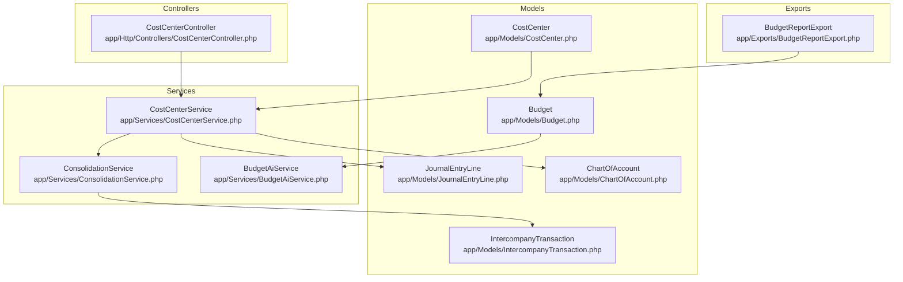

**Diagram sources**
- [CostCenter.php:11-33](file://app/Models/CostCenter.php#L11-L33)
- [CostCenterService.php:9-202](file://app/Services/CostCenterService.php#L9-L202)
- [CostCenterController.php:10-101](file://app/Http/Controllers/CostCenterController.php#L10-L101)
- [Budget.php:10-36](file://app/Models/Budget.php#L10-L36)
- [BudgetAiService.php:95-130](file://app/Services/BudgetAiService.php#L95-L130)
- [ConsolidationService.php:16-41](file://app/Services/ConsolidationService.php#L16-L41)
- [2026_04_02_000001_create_consolidation_tables.php:40-71](file://database/migrations/2026_04_02_000001_create_consolidation_tables.php#L40-L71)

**Section sources**
- [CostCenter.php:11-33](file://app/Models/CostCenter.php#L11-L33)
- [CostCenterService.php:9-202](file://app/Services/CostCenterService.php#L9-L202)
- [CostCenterController.php:10-101](file://app/Http/Controllers/CostCenterController.php#L10-L101)
- [Budget.php:10-36](file://app/Models/Budget.php#L10-L36)
- [BudgetAiService.php:95-130](file://app/Services/BudgetAiService.php#L95-L130)
- [ConsolidationService.php:16-41](file://app/Services/ConsolidationService.php#L16-L41)
- [2026_04_02_000001_create_consolidation_tables.php:40-71](file://database/migrations/2026_04_02_000001_create_consolidation_tables.php#L40-L71)

## Core Components
- CostCenter model: Defines cost center attributes, hierarchy relations, and per-period P&L computation for a single cost center.
- CostCenterService: Implements creation/validation, deletion checks, hierarchical aggregation, P&L and balance sheet segment reporting, and totals calculation.
- CostCenterController: Provides UI endpoints for listing, creating, updating, deleting, and generating P&L reports.
- Budget model and BudgetAiService: Support budget records, variance calculations, usage percentages, and AI-driven allocation suggestions.
- ConsolidationService and related consolidation tables: Enable multi-entity consolidated financial statements with intercompany elimination.

Key responsibilities:
- Hierarchical cost center management with depth validation and subtree traversal.
- Profit center accounting via aggregated P&L by cost center hierarchy.
- Responsibility accounting through cost center tagging on journal entries.
- Budgeting and variance analysis with export support.
- Consolidation of financial statements across entities with intercompany adjustments.

**Section sources**
- [CostCenter.php:11-72](file://app/Models/CostCenter.php#L11-L72)
- [CostCenterService.php:16-202](file://app/Services/CostCenterService.php#L16-L202)
- [CostCenterController.php:16-100](file://app/Http/Controllers/CostCenterController.php#L16-L100)
- [Budget.php:28-35](file://app/Models/Budget.php#L28-L35)
- [BudgetAiService.php:95-130](file://app/Services/BudgetAiService.php#L95-L130)
- [ConsolidationService.php:32-41](file://app/Services/ConsolidationService.php#L32-L41)
- [2026_04_02_000001_create_consolidation_tables.php:40-71](file://database/migrations/2026_04_02_000001_create_consolidation_tables.php#L40-L71)

## Architecture Overview
The system follows a layered architecture:
- Presentation: Controllers expose endpoints and render views for cost center management and reporting.
- Application: Services orchestrate business rules, validations, and aggregations.
- Domain: Models represent entities and encapsulate domain logic (e.g., P&L computation).
- Persistence: Eloquent models and migrations define schema and relationships.

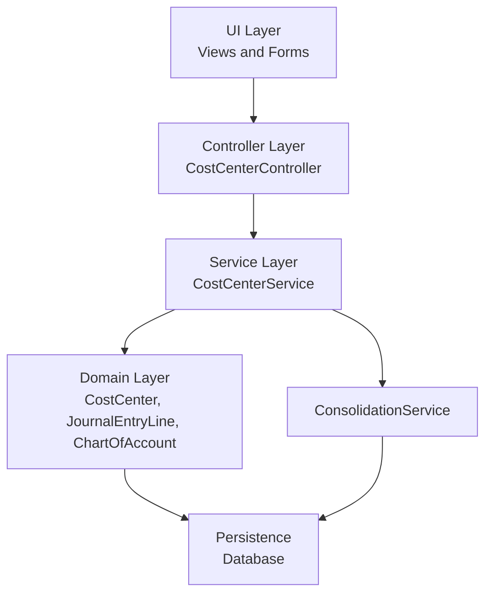

**Diagram sources**
- [CostCenterController.php:10-101](file://app/Http/Controllers/CostCenterController.php#L10-L101)
- [CostCenterService.php:9-202](file://app/Services/CostCenterService.php#L9-L202)
- [ConsolidationService.php:16-41](file://app/Services/ConsolidationService.php#L16-L41)
- [CostCenter.php:11-33](file://app/Models/CostCenter.php#L11-L33)
- [JournalEntryLine.php](file://app/Models/JournalEntryLine.php)
- [ChartOfAccount.php](file://app/Models/ChartOfAccount.php)

## Detailed Component Analysis

### Cost Center Model and Hierarchy
The CostCenter model defines:
- Attributes: tenant association, parent-child hierarchy, code, name, type, description, and activation flag.
- Relations: belongs to tenant, self-referencing parent, and has many children.
- Type labeling for localized display.
- Per-period P&L computation for a single cost center using journal entry lines.

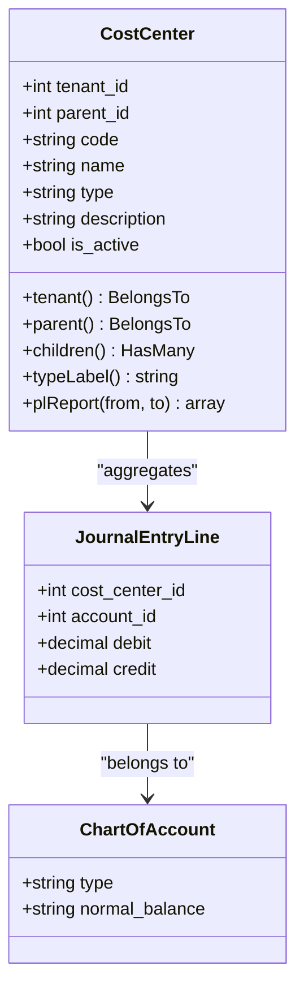

**Diagram sources**
- [CostCenter.php:11-72](file://app/Models/CostCenter.php#L11-L72)
- [JournalEntryLine.php](file://app/Models/JournalEntryLine.php)
- [ChartOfAccount.php](file://app/Models/ChartOfAccount.php)

**Section sources**
- [CostCenter.php:11-72](file://app/Models/CostCenter.php#L11-L72)

### Cost Center Service: Creation, Validation, and Reporting
Responsibilities:
- Create cost centers with duplicate code validation per tenant and depth validation (max 3 levels).
- Delete cost centers after checking for active children and existing journal entries.
- Build subtree IDs for hierarchical aggregation.
- Generate P&L reports by aggregating journal entry lines across a cost center subtree.
- Compute balance sheet segments up to a specific date.
- Summarize totals across the P&L report.

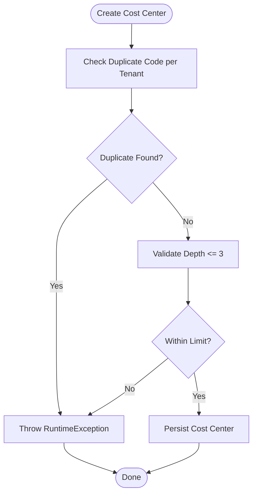

**Diagram sources**
- [CostCenterService.php:16-56](file://app/Services/CostCenterService.php#L16-L56)

**Section sources**
- [CostCenterService.php:16-81](file://app/Services/CostCenterService.php#L16-L81)

### Cost Center Controller: Management and Reporting
Endpoints:
- Index: List cost centers with optional search and type filters; preload parent options.
- Store: Validate and create a new cost center via service; log activity.
- Update: Update cost center metadata.
- Destroy: Delete cost center with validation via service.
- Report: Generate P&L report across active cost centers for a date range and show totals.

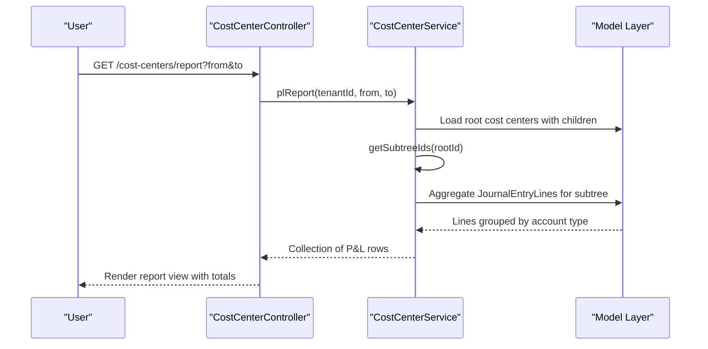

**Diagram sources**
- [CostCenterController.php:84-100](file://app/Http/Controllers/CostCenterController.php#L84-L100)
- [CostCenterService.php:100-113](file://app/Services/CostCenterService.php#L100-L113)
- [CostCenter.php:39-71](file://app/Models/CostCenter.php#L39-L71)

**Section sources**
- [CostCenterController.php:16-100](file://app/Http/Controllers/CostCenterController.php#L16-L100)
- [CostCenterService.php:83-113](file://app/Services/CostCenterService.php#L83-L113)

### Profitability Analysis and Responsibility Accounting
Profitability analysis is performed by:
- Filtering posted journal entries within a date range.
- Tagging lines to cost centers.
- Classifying account types (revenue/expense) and computing net amounts based on normal balances.
- Aggregating revenue and expense per cost center and deriving profit.

Responsibility accounting:
- Journal entries are linked to cost centers, enabling attribution of costs and revenues to responsible units.

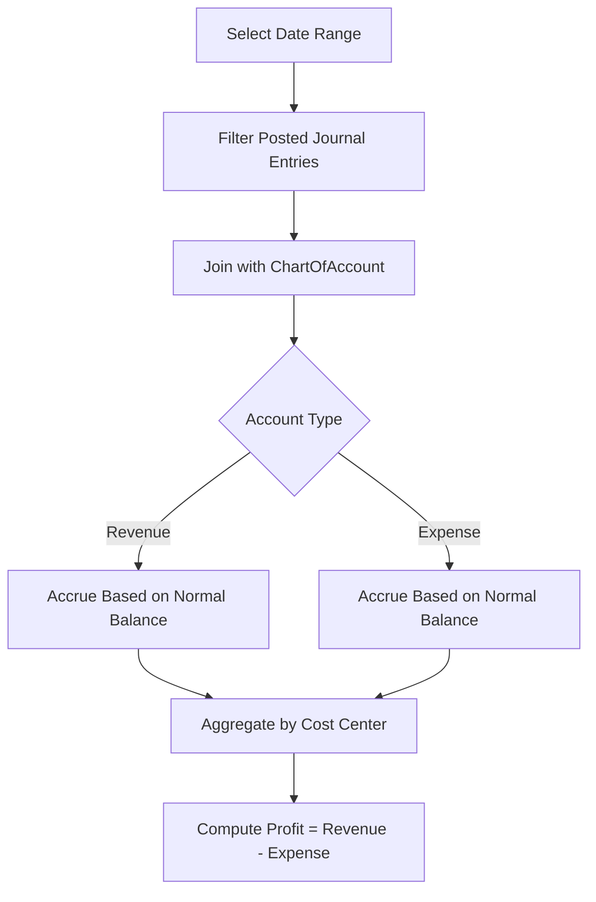

**Diagram sources**
- [CostCenter.php:39-71](file://app/Models/CostCenter.php#L39-L71)
- [CostCenterService.php:169-201](file://app/Services/CostCenterService.php#L169-L201)

**Section sources**
- [CostCenter.php:39-71](file://app/Models/CostCenter.php#L39-L71)
- [CostCenterService.php:169-201](file://app/Services/CostCenterService.php#L169-L201)

### Cost Center Hierarchies and Consolidation
Hierarchies:
- Self-referencing parent-child relationships with a maximum depth enforced at creation.
- Subtree traversal to aggregate financials across descendant nodes.

Consolidation:
- ConsolidationService generates consolidated P&L and Balance Sheet for a company group.
- Intercompany elimination entries are modeled and indexed for efficient processing.

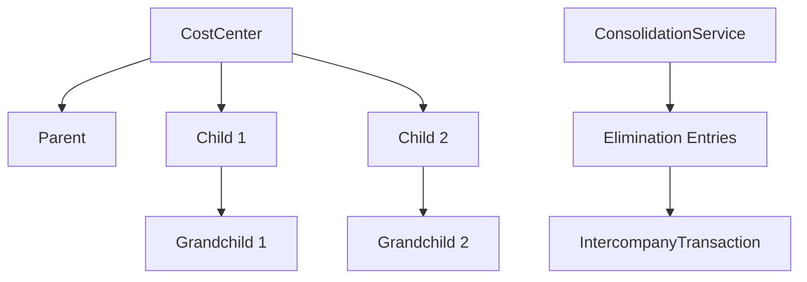

**Diagram sources**
- [CostCenter.php:20-22](file://app/Models/CostCenter.php#L20-L22)
- [CostCenterService.php:83-94](file://app/Services/CostCenterService.php#L83-L94)
- [ConsolidationService.php:32-41](file://app/Services/ConsolidationService.php#L32-L41)
- [2026_04_02_000001_create_consolidation_tables.php:40-71](file://database/migrations/2026_04_02_000001_create_consolidation_tables.php#L40-L71)

**Section sources**
- [CostCenter.php:20-22](file://app/Models/CostCenter.php#L20-L22)
- [CostCenterService.php:83-94](file://app/Services/CostCenterService.php#L83-L94)
- [ConsolidationService.php:32-41](file://app/Services/ConsolidationService.php#L32-L41)
- [2026_04_02_000001_create_consolidation_tables.php:40-71](file://database/migrations/2026_04_02_000001_create_consolidation_tables.php#L40-L71)

### Budgets, Variance Analysis, and Performance Reporting
Budget model:
- Stores budget records with realized amounts, categories, departments, periods, and statuses.
- Computes variance and usage percentage.

Variance analysis:
- Variance = amount - realized.
- Usage percentage = realized / amount (when amount > 0).

AI-driven suggestions:
- BudgetAiService provides historical-based allocation suggestions and overrun counts for recent periods.

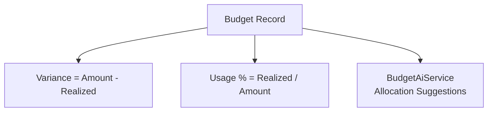

**Diagram sources**
- [Budget.php:28-35](file://app/Models/Budget.php#L28-L35)
- [BudgetAiService.php:95-130](file://app/Services/BudgetAiService.php#L95-L130)

**Section sources**
- [Budget.php:28-35](file://app/Models/Budget.php#L28-L35)
- [BudgetAiService.php:95-130](file://app/Services/BudgetAiService.php#L95-L130)

### Inter-Cost Center Transactions and Consolidation
Intercompany transactions:
- IntercompanyTransaction model supports elimination entries and related transaction linkage.
- Consolidation tables include elimination entries and lines for debits/credits.

Consolidation process:
- ConsolidationService computes consolidated statements and applies intercompany eliminations.

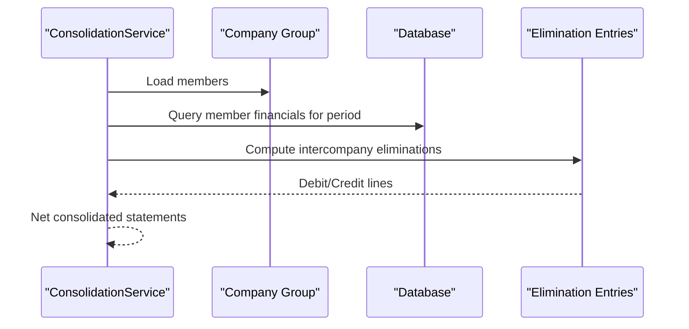

**Diagram sources**
- [ConsolidationService.php:32-41](file://app/Services/ConsolidationService.php#L32-L41)
- [2026_04_02_000001_create_consolidation_tables.php:40-71](file://database/migrations/2026_04_02_000001_create_consolidation_tables.php#L40-L71)
- [IntercompanyTransaction.php](file://app/Models/IntercompanyTransaction.php)

**Section sources**
- [ConsolidationService.php:32-41](file://app/Services/ConsolidationService.php#L32-L41)
- [2026_04_02_000001_create_consolidation_tables.php:40-71](file://database/migrations/2026_04_02_000001_create_consolidation_tables.php#L40-L71)
- [IntercompanyTransaction.php](file://app/Models/IntercompanyTransaction.php)

### Cost Driver Allocation and Management Reporting Dashboards
Current implementation focuses on:
- Responsibility accounting via cost center tagging on journal entries.
- Hierarchical aggregation for P&L and balance sheet segments.
- Budget variance and usage metrics.

Future enhancements could include:
- Cost driver models and allocation keys to distribute overheads.
- KPI widgets and dashboard components for management reporting.

[No sources needed since this section provides conceptual guidance]

## Dependency Analysis
The following diagram shows key dependencies among components:

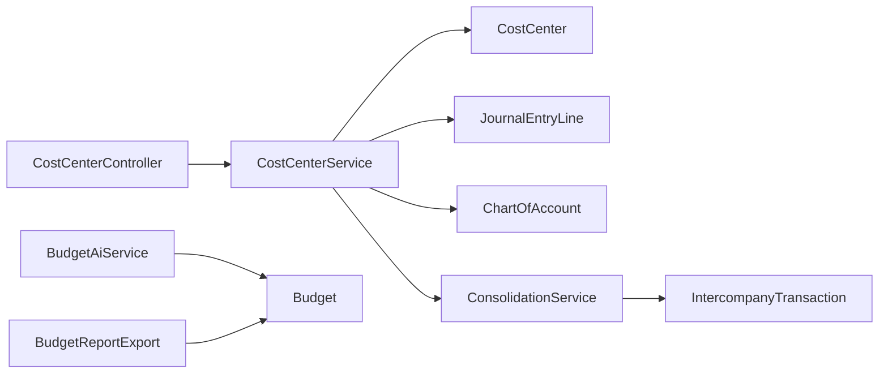

**Diagram sources**
- [CostCenterController.php:10-101](file://app/Http/Controllers/CostCenterController.php#L10-L101)
- [CostCenterService.php:9-202](file://app/Services/CostCenterService.php#L9-L202)
- [CostCenter.php:11-33](file://app/Models/CostCenter.php#L11-L33)
- [JournalEntryLine.php](file://app/Models/JournalEntryLine.php)
- [ChartOfAccount.php](file://app/Models/ChartOfAccount.php)
- [ConsolidationService.php:16-41](file://app/Services/ConsolidationService.php#L16-L41)
- [IntercompanyTransaction.php](file://app/Models/IntercompanyTransaction.php)
- [BudgetAiService.php:95-130](file://app/Services/BudgetAiService.php#L95-L130)
- [Budget.php:10-36](file://app/Models/Budget.php#L10-L36)
- [BudgetReportExport.php](file://app/Exports/BudgetReportExport.php)

**Section sources**
- [CostCenterController.php:10-101](file://app/Http/Controllers/CostCenterController.php#L10-L101)
- [CostCenterService.php:9-202](file://app/Services/CostCenterService.php#L9-L202)
- [ConsolidationService.php:16-41](file://app/Services/ConsolidationService.php#L16-L41)
- [BudgetAiService.php:95-130](file://app/Services/BudgetAiService.php#L95-L130)

## Performance Considerations
- Prefer indexed queries on cost_center_id and date ranges for journal entry aggregation.
- Limit hierarchical traversals to necessary depths (currently capped at 3).
- Use batch processing for large date ranges and subtree aggregations.
- Cache frequently accessed cost center hierarchies and COA classifications.

[No sources needed since this section provides general guidance]

## Troubleshooting Guide
Common issues and resolutions:
- Duplicate cost center code: Creation fails if the code exists for the tenant; change the code and retry.
- Depth limit exceeded: Creation fails if the hierarchy exceeds 3 levels; adjust parent assignment.
- Cannot delete cost center: Ensure no active children and no associated journal entries; clean up before deletion.
- Empty consolidation report: Verify company group members and period selection; confirm intercompany data availability.

**Section sources**
- [CostCenterService.php:18-56](file://app/Services/CostCenterService.php#L18-L56)
- [CostCenterService.php:63-81](file://app/Services/CostCenterService.php#L63-L81)
- [ConsolidationService.php:32-35](file://app/Services/ConsolidationService.php#L32-L35)

## Conclusion
The system provides a robust foundation for Cost Center Accounting with:
- Hierarchical cost center management and validation.
- Responsibility accounting via cost center-tagged journal entries.
- Profit center reporting through hierarchical P&L aggregation.
- Budget variance analysis and AI-driven allocation suggestions.
- Consolidation capabilities for multi-entity financial reporting with intercompany elimination.

[No sources needed since this section summarizes without analyzing specific files]

## Appendices

### Appendix A: Data Model Overview
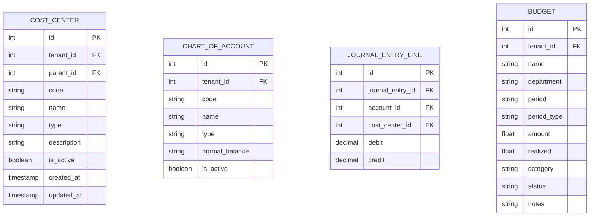

**Diagram sources**
- [CostCenter.php:14-18](file://app/Models/CostCenter.php#L14-L18)
- [ChartOfAccount.php](file://app/Models/ChartOfAccount.php)
- [JournalEntryLine.php](file://app/Models/JournalEntryLine.php)
- [Budget.php:13-26](file://app/Models/Budget.php#L13-L26)