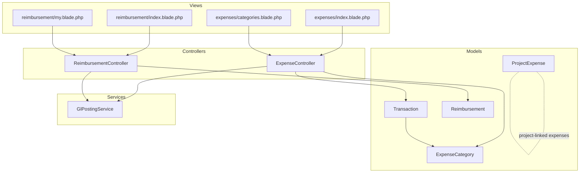
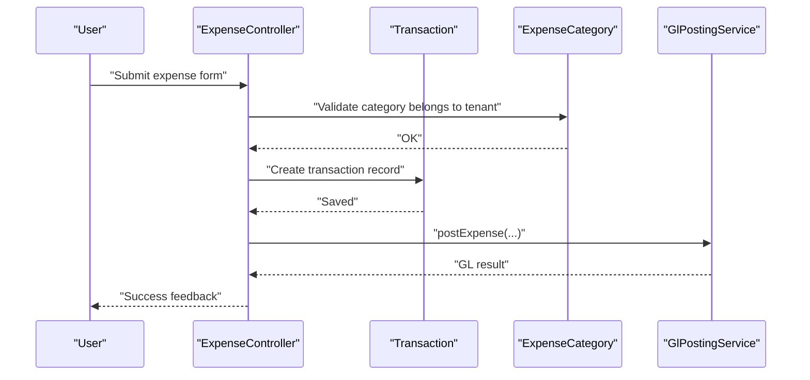
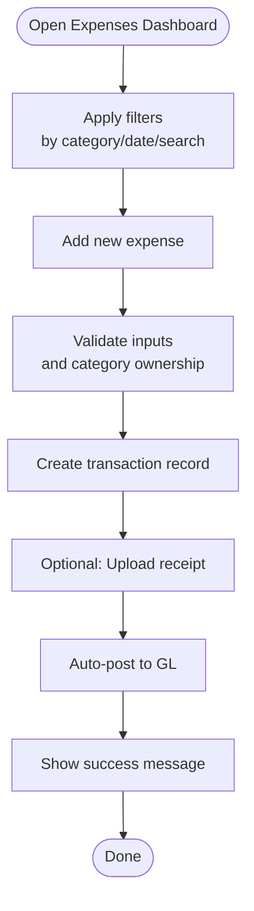
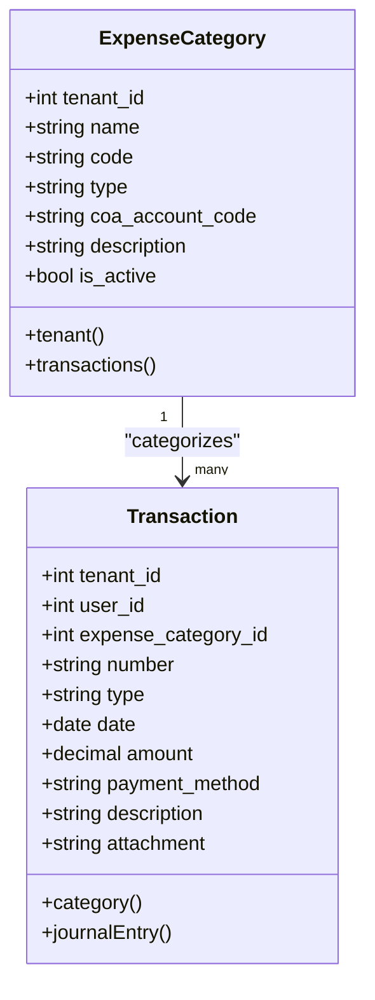
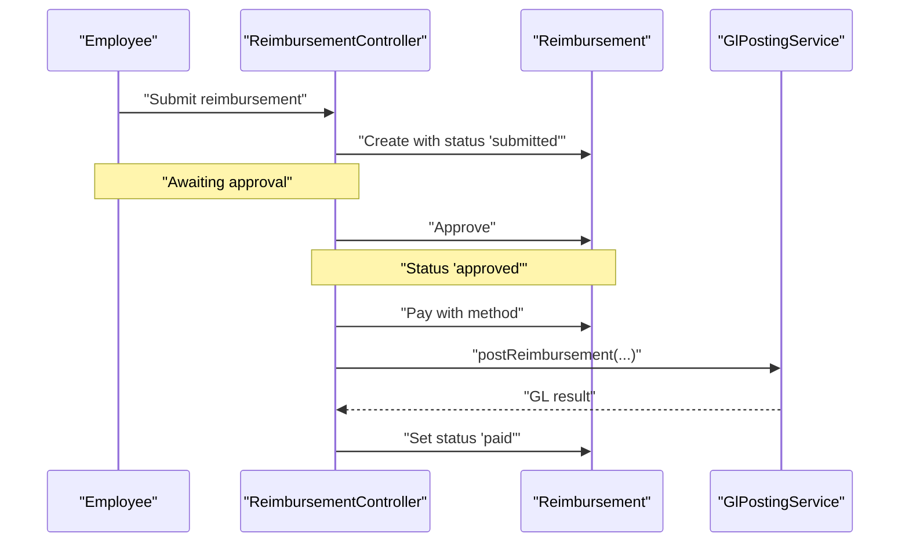
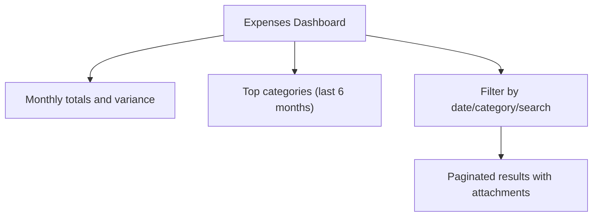
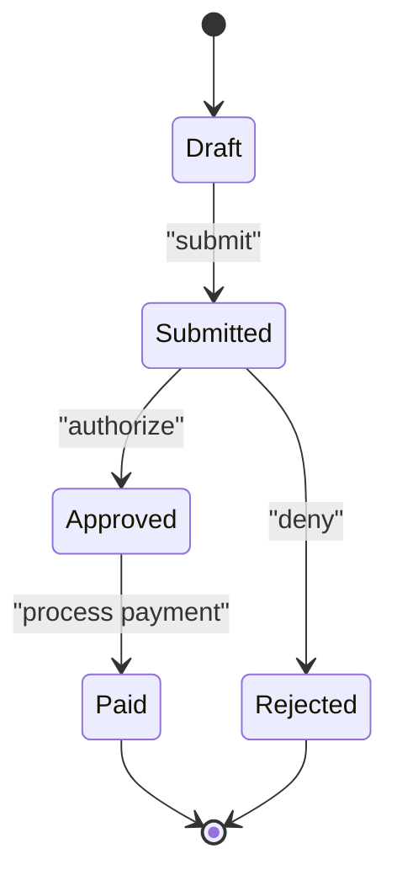
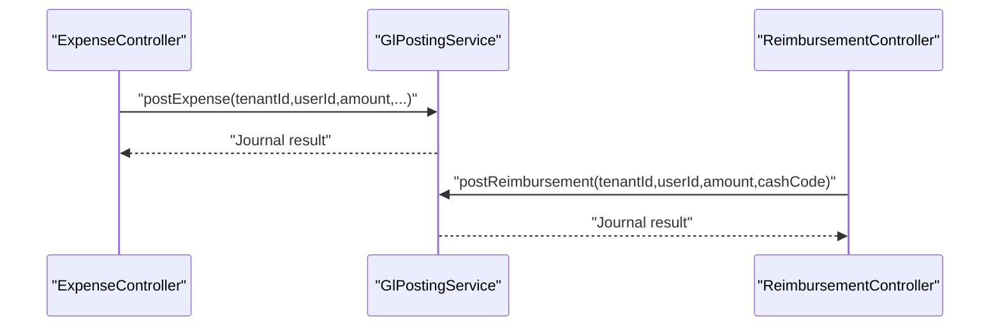
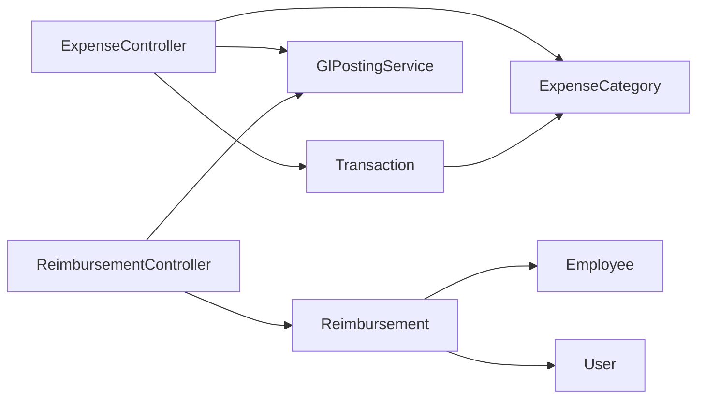

# Expense Tracking & Management

<cite>
**Referenced Files in This Document**
- [ExpenseController.php](file://app/Http/Controllers/ExpenseController.php)
- [ReimbursementController.php](file://app/Http/Controllers/ReimbursementController.php)
- [ExpenseCategory.php](file://app/Models/ExpenseCategory.php)
- [Transaction.php](file://app/Models/Transaction.php)
- [Reimbursement.php](file://app/Models/Reimbursement.php)
- [ProjectExpense.php](file://app/Models/ProjectExpense.php)
- [GlPostingService.php](file://app/Services/GlPostingService.php)
- [expenses/index.blade.php](file://resources/views/expenses/index.blade.php)
- [reimbursement/index.blade.php](file://resources/views/reimbursement/index.blade.php)
- [reimbursement/my.blade.php](file://resources/views/reimbursement/my.blade.php)
- [expenses/categories.blade.php](file://resources/views/expenses/categories.blade.php)
- [routes/web.php](file://routes/web.php)
</cite>

## Table of Contents
1. [Introduction](#introduction)
2. [Project Structure](#project-structure)
3. [Core Components](#core-components)
4. [Architecture Overview](#architecture-overview)
5. [Detailed Component Analysis](#detailed-component-analysis)
6. [Dependency Analysis](#dependency-analysis)
7. [Performance Considerations](#performance-considerations)
8. [Troubleshooting Guide](#troubleshooting-guide)
9. [Conclusion](#conclusion)

## Introduction
This document describes the Expense Tracking & Management capabilities implemented in the system. It covers expense entry and categorization, approval workflows, and reimbursement processing. It also documents receipt management, policy enforcement via category configuration, automated expense validation, reporting and analytics, approval hierarchies, policy rules, integration with accounting systems, expense types, and currency handling for multi-currency scenarios.

## Project Structure
The expense system spans controllers, models, views, and services:
- Controllers handle user interactions for expense recording and reimbursement requests/approval/payout.
- Models define domain entities such as Transactions, Expense Categories, Reimbursements, and Project Expenses.
- Views render forms, lists, and dashboards for expense and reimbursement management.
- Services integrate with the accounting system for automatic posting.

**Diagram sources**
- [ExpenseController.php:12-214](file://app/Http/Controllers/ExpenseController.php#L12-L214)
- [ReimbursementController.php:11-206](file://app/Http/Controllers/ReimbursementController.php#L11-L206)
- [ExpenseCategory.php:11-24](file://app/Models/ExpenseCategory.php#L11-L24)
- [Transaction.php:11-58](file://app/Models/Transaction.php#L11-L58)
- [Reimbursement.php:10-58](file://app/Models/Reimbursement.php#L10-L58)
- [ProjectExpense.php:10-30](file://app/Models/ProjectExpense.php#L10-L30)
- [GlPostingService.php](file://app/Services/GlPostingService.php)
- [expenses/index.blade.php:1-190](file://resources/views/expenses/index.blade.php#L1-L190)
- [reimbursement/index.blade.php:1-157](file://resources/views/reimbursement/index.blade.php#L1-L157)
- [reimbursement/my.blade.php:1-200](file://resources/views/reimbursement/my.blade.php#L1-L200)
- [expenses/categories.blade.php:1-120](file://resources/views/expenses/categories.blade.php#L1-L120)

**Section sources**
- [ExpenseController.php:12-214](file://app/Http/Controllers/ExpenseController.php#L12-L214)
- [ReimbursementController.php:11-206](file://app/Http/Controllers/ReimbursementController.php#L11-L206)
- [ExpenseCategory.php:11-24](file://app/Models/ExpenseCategory.php#L11-L24)
- [Transaction.php:11-58](file://app/Models/Transaction.php#L11-L58)
- [Reimbursement.php:10-58](file://app/Models/Reimbursement.php#L10-L58)
- [ProjectExpense.php:10-30](file://app/Models/ProjectExpense.php#L10-L30)
- [expenses/index.blade.php:1-190](file://resources/views/expenses/index.blade.php#L1-L190)
- [reimbursement/index.blade.php:1-157](file://resources/views/reimbursement/index.blade.php#L1-L157)
- [reimbursement/my.blade.php:1-200](file://resources/views/reimbursement/my.blade.php#L1-L200)
- [expenses/categories.blade.php:1-120](file://resources/views/expenses/categories.blade.php#L1-L120)

## Core Components
- Expense recording and categorization:
  - Controllers manage creation, filtering, and deletion of expenses.
  - Models define transaction records and category taxonomy.
  - Views provide forms and dashboards for expense entry and analytics.
- Reimbursement lifecycle:
  - Controllers support self-service submission, manager approvals, and payment posting with GL integration.
  - Models track employee, requester, approver, and payment metadata.
- Accounting integration:
  - GL posting service auto-posts expenses and reimbursements to chart of accounts.

Key implementation references:
- Expense entry and GL auto-posting: [ExpenseController.php:78-145](file://app/Http/Controllers/ExpenseController.php#L78-L145)
- Reimbursement lifecycle (approve/pay): [ReimbursementController.php:78-144](file://app/Http/Controllers/ReimbursementController.php#L78-L144)
- Category model and taxonomy: [ExpenseCategory.php:11-24](file://app/Models/ExpenseCategory.php#L11-L24)
- Transaction model and GL linkage: [Transaction.php:11-58](file://app/Models/Transaction.php#L11-L58)
- Reimbursement model and numbering: [Reimbursement.php:10-58](file://app/Models/Reimbursement.php#L10-L58)
- Project-linked expenses: [ProjectExpense.php:10-30](file://app/Models/ProjectExpense.php#L10-L30)

**Section sources**
- [ExpenseController.php:78-145](file://app/Http/Controllers/ExpenseController.php#L78-L145)
- [ReimbursementController.php:78-144](file://app/Http/Controllers/ReimbursementController.php#L78-L144)
- [ExpenseCategory.php:11-24](file://app/Models/ExpenseCategory.php#L11-L24)
- [Transaction.php:11-58](file://app/Models/Transaction.php#L11-L58)
- [Reimbursement.php:10-58](file://app/Models/Reimbursement.php#L10-L58)
- [ProjectExpense.php:10-30](file://app/Models/ProjectExpense.php#L10-L30)

## Architecture Overview
The system separates concerns across controllers, models, views, and services:
- Controllers orchestrate user actions and enforce tenant scoping.
- Models encapsulate business rules and relationships.
- Views present forms and dashboards with filtering and pagination.
- Services integrate with the accounting system for automatic postings.

**Diagram sources**
- [ExpenseController.php:78-145](file://app/Http/Controllers/ExpenseController.php#L78-L145)
- [Transaction.php:11-58](file://app/Models/Transaction.php#L11-L58)
- [ExpenseCategory.php:11-24](file://app/Models/ExpenseCategory.php#L11-L24)
- [GlPostingService.php](file://app/Services/GlPostingService.php)

**Section sources**
- [ExpenseController.php:78-145](file://app/Http/Controllers/ExpenseController.php#L78-L145)
- [Transaction.php:11-58](file://app/Models/Transaction.php#L11-L58)
- [ExpenseCategory.php:11-24](file://app/Models/ExpenseCategory.php#L11-L24)
- [GlPostingService.php](file://app/Services/GlPostingService.php)

## Detailed Component Analysis

### Expense Recording and Categorization
- Entry form supports category selection, date, amount, payment method, description, reference, and attachment upload.
- Validation ensures category belongs to the current tenant and amount is positive.
- Numbering scheme generates unique expense numbers per day.
- Automatic GL posting integrates with chart of accounts via category mapping.
- Analytics dashboard shows monthly totals, trends, and top categories.

**Diagram sources**
- [expenses/index.blade.php:38-95](file://resources/views/expenses/index.blade.php#L38-L95)
- [ExpenseController.php:78-145](file://app/Http/Controllers/ExpenseController.php#L78-L145)
- [Transaction.php:11-58](file://app/Models/Transaction.php#L11-L58)

**Section sources**
- [ExpenseController.php:21-76](file://app/Http/Controllers/ExpenseController.php#L21-L76)
- [ExpenseController.php:78-145](file://app/Http/Controllers/ExpenseController.php#L78-L145)
- [expenses/index.blade.php:1-190](file://resources/views/expenses/index.blade.php#L1-L190)
- [Transaction.php:11-58](file://app/Models/Transaction.php#L11-L58)

### Expense Categories and Policy Enforcement
- Categories are tenant-scoped, configurable with code, type, COA account mapping, and activity flag.
- Category management view displays counts and GL mappings.
- Policy enforcement occurs via category configuration:
  - Type classification (operational, COGS, marketing, HR, admin, other).
  - Optional COA account code for GL automation.
  - Activation/deactivation controls active usage.

**Diagram sources**
- [ExpenseCategory.php:11-24](file://app/Models/ExpenseCategory.php#L11-L24)
- [Transaction.php:11-58](file://app/Models/Transaction.php#L11-L58)

**Section sources**
- [ExpenseController.php:165-212](file://app/Http/Controllers/ExpenseController.php#L165-L212)
- [expenses/categories.blade.php:71-87](file://resources/views/expenses/categories.blade.php#L71-L87)
- [ExpenseCategory.php:11-24](file://app/Models/ExpenseCategory.php#L11-L24)

### Reimbursement Lifecycle (Self-Service and Approvals)
- Self-service employees can submit reimbursements with category, description, date, amount, and receipt image.
- Managers filter, approve, reject, and mark as paid.
- Payment posts to GL with cash/bank account mapping.
- Status transitions are enforced (submitted → approved → paid).

**Diagram sources**
- [ReimbursementController.php:44-144](file://app/Http/Controllers/ReimbursementController.php#L44-L144)
- [Reimbursement.php:10-58](file://app/Models/Reimbursement.php#L10-L58)
- [GlPostingService.php](file://app/Services/GlPostingService.php)

**Section sources**
- [ReimbursementController.php:15-76](file://app/Http/Controllers/ReimbursementController.php#L15-L76)
- [ReimbursementController.php:78-144](file://app/Http/Controllers/ReimbursementController.php#L78-L144)
- [reimbursement/my.blade.php:58-200](file://resources/views/reimbursement/my.blade.php#L58-L200)
- [Reimbursement.php:10-58](file://app/Models/Reimbursement.php#L10-L58)

### Reporting, Budget vs Actual, and Analytics
- Monthly expense totals and variance vs previous month.
- Top categories visualization for recent months.
- Filtering by date range, category, and free-text search.
- Receipt attachments visible in listings.

**Diagram sources**
- [expenses/index.blade.php:10-33](file://resources/views/expenses/index.blade.php#L10-L33)
- [ExpenseController.php:21-76](file://app/Http/Controllers/ExpenseController.php#L21-L76)

**Section sources**
- [ExpenseController.php:21-76](file://app/Http/Controllers/ExpenseController.php#L21-L76)
- [expenses/index.blade.php:1-190](file://resources/views/expenses/index.blade.php#L1-L190)

### Approval Hierarchies and Policy Rules
- Approval workflows are modeled elsewhere in the system (e.g., purchase orders), demonstrating a reusable pattern for policy enforcement and audit trails.
- While dedicated expense approval workflows are not present in the analyzed files, the reimbursement controller enforces status-based transitions and role checks via authorization gates.

**Diagram sources**
- [ReimbursementController.php:78-144](file://app/Http/Controllers/ReimbursementController.php#L78-L144)

**Section sources**
- [ReimbursementController.php:78-144](file://app/Http/Controllers/ReimbursementController.php#L78-L144)

### Integration with Accounting Systems
- Expenses: Auto-posting to GL using category type/name and optional COA code.
- Reimbursements: Auto-posting to GL using cash/bank mapping upon payment.
- Journal entries are linked back to respective records for traceability.

**Diagram sources**
- [ExpenseController.php:126-142](file://app/Http/Controllers/ExpenseController.php#L126-L142)
- [ReimbursementController.php:126-141](file://app/Http/Controllers/ReimbursementController.php#L126-L141)
- [GlPostingService.php](file://app/Services/GlPostingService.php)

**Section sources**
- [ExpenseController.php:126-142](file://app/Http/Controllers/ExpenseController.php#L126-L142)
- [ReimbursementController.php:126-141](file://app/Http/Controllers/ReimbursementController.php#L126-L141)
- [GlPostingService.php](file://app/Services/GlPostingService.php)

### Expense Types, Currency Handling, and Multi-Currency Processing
- Expense types:
  - General ledger expenses recorded as Transaction with type "expense".
  - Reimbursements tracked separately as Reimbursement with lifecycle statuses.
- Currency handling:
  - Amounts are stored as decimal with two places.
  - No explicit multi-currency fields observed in the analyzed models.
  - For multi-currency scenarios, introduce currency code and exchange rate fields on relevant models and adjust GL posting logic accordingly.

[No sources needed since this section provides general guidance]

## Dependency Analysis
- Controllers depend on models and services for persistence and GL integration.
- Models define relationships and constraints (tenant scoping, foreign keys).
- Views depend on controllers for data and routes for actions.
- Services encapsulate GL posting logic and can be extended for multi-currency conversions.

**Diagram sources**
- [ExpenseController.php:12-214](file://app/Http/Controllers/ExpenseController.php#L12-L214)
- [ReimbursementController.php:11-206](file://app/Http/Controllers/ReimbursementController.php#L11-L206)
- [Transaction.php:11-58](file://app/Models/Transaction.php#L11-L58)
- [ExpenseCategory.php:11-24](file://app/Models/ExpenseCategory.php#L11-L24)
- [Reimbursement.php:10-58](file://app/Models/Reimbursement.php#L10-L58)

**Section sources**
- [ExpenseController.php:12-214](file://app/Http/Controllers/ExpenseController.php#L12-L214)
- [ReimbursementController.php:11-206](file://app/Http/Controllers/ReimbursementController.php#L11-L206)
- [Transaction.php:11-58](file://app/Models/Transaction.php#L11-L58)
- [ExpenseCategory.php:11-24](file://app/Models/ExpenseCategory.php#L11-L24)
- [Reimbursement.php:10-58](file://app/Models/Reimbursement.php#L10-L58)

## Performance Considerations
- Pagination is used for expense and reimbursement lists to limit payload sizes.
- Aggregated queries compute monthly totals and top categories; consider caching for frequently accessed analytics.
- Attachment storage uses local public disk; for high volume, consider CDN-backed storage and asynchronous processing.

[No sources needed since this section provides general guidance]

## Troubleshooting Guide
- Expense creation fails validation:
  - Verify category belongs to the current tenant and amount is greater than zero.
  - Check file upload constraints for receipts.
- GL posting warnings:
  - Review category COA mapping and ensure chart of accounts is configured.
  - Confirm posting service connectivity and permissions.
- Reimbursement status errors:
  - Ensure status transitions follow the allowed flow (submitted → approved → paid).
  - Confirm payment method selection and required fields.

**Section sources**
- [ExpenseController.php:78-145](file://app/Http/Controllers/ExpenseController.php#L78-L145)
- [ReimbursementController.php:78-144](file://app/Http/Controllers/ReimbursementController.php#L78-L144)

## Conclusion
The system provides a robust foundation for expense tracking and management with:
- Intuitive expense entry and categorization.
- Receipt management and tenant-scoped policies via categories.
- Automated GL integration for both expenses and reimbursements.
- Self-service and manager-driven reimbursement workflows.
- Reporting and analytics dashboards.
For advanced needs, extend category policy rules, implement multi-currency fields, and formalize expense approval workflows aligned with existing patterns.