# Financial Services

<cite>
**Referenced Files in This Document**
- [Budget.php](file://app/Models/Budget.php)
- [CostCenter.php](file://app/Models/CostCenter.php)
- [TaxRecord.php](file://app/Models/TaxRecord.php)
- [PaymentGateway.php](file://app/Models/PaymentGateway.php)
- [ExpenseCategory.php](file://app/Models/ExpenseCategory.php)
- [ApprovalWorkflow.php](file://app/Models/ApprovalWorkflow.php)
- [CostCenterService.php](file://app/Services/CostCenterService.php)
- [TaxService.php](file://app/Services/TaxService.php)
- [PaymentGatewayService.php](file://app/Services/PaymentGatewayService.php)
- [ForecastService.php](file://app/Services/ForecastService.php)
- [BudgetAiService.php](file://app/Services/BudgetAiService.php)
- [GlPostingService.php](file://app/Services/GlPostingService.php)
- [BusinessConstraintService.php](file://app/Services/BusinessConstraintService.php)
- [PoApprovalService.php](file://app/Services/PoApprovalService.php)
- [WorkflowEngine.php](file://app/Services/WorkflowEngine.php)
- [AiInsightService.php](file://app/Services/AiInsightService.php)
- [AccountingController.php](file://app/Http/Controllers/AccountingController.php)
- [TenantDemoSeeder.php](file://database/seeders/TenantDemoSeeder.php)
- [payment-gateways.blade.php](file://resources/views/settings/payment-gateways.blade.php)
</cite>

## Table of Contents
1. [Introduction](#introduction)
2. [Project Structure](#project-structure)
3. [Core Components](#core-components)
4. [Architecture Overview](#architecture-overview)
5. [Detailed Component Analysis](#detailed-component-analysis)
6. [Dependency Analysis](#dependency-analysis)
7. [Performance Considerations](#performance-considerations)
8. [Troubleshooting Guide](#troubleshooting-guide)
9. [Conclusion](#conclusion)

## Introduction
This document describes the Financial Services module of the system with a focus on budget management, expense tracking, tax processing, cost center accounting, and payment gateway integration. It also covers budget planning and control, expense approval workflows, tax calculation engines, multi-currency payment processing, variance analysis, forecasting, and financial controls. The goal is to provide a comprehensive yet accessible guide for both technical and non-technical stakeholders.

## Project Structure
Financial services span models, services, controllers, and UI components:
- Models define domain entities such as budgets, cost centers, taxes, payment gateways, expense categories, and approval workflows.
- Services encapsulate business logic for tax calculations, payment processing, cost center reporting, forecasting, budget AI, general ledger posting, and workflow orchestration.
- Controllers expose endpoints for chart of accounts and related financial operations.
- Views provide configuration UI for payment gateways.

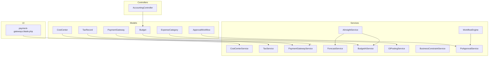

**Diagram sources**
- [Budget.php:10-36](file://app/Models/Budget.php#L10-L36)
- [CostCenter.php:11-72](file://app/Models/CostCenter.php#L11-L72)
- [TaxRecord.php:9-19](file://app/Models/TaxRecord.php#L9-L19)
- [PaymentGateway.php:10-54](file://app/Models/PaymentGateway.php#L10-L54)
- [ExpenseCategory.php:11-23](file://app/Models/ExpenseCategory.php#L11-L23)
- [ApprovalWorkflow.php:9-32](file://app/Models/ApprovalWorkflow.php#L9-L32)
- [CostCenterService.php:9-202](file://app/Services/CostCenterService.php#L9-L202)
- [TaxService.php:15-167](file://app/Services/TaxService.php#L15-L167)
- [PaymentGatewayService.php:13-636](file://app/Services/PaymentGatewayService.php#L13-L636)
- [ForecastService.php:11-219](file://app/Services/ForecastService.php#L11-L219)
- [BudgetAiService.php:14-244](file://app/Services/BudgetAiService.php#L14-L244)
- [GlPostingService.php:442-479](file://app/Services/GlPostingService.php#L442-L479)
- [BusinessConstraintService.php:79-114](file://app/Services/BusinessConstraintService.php#L79-L114)
- [WorkflowEngine.php:9-161](file://app/Services/WorkflowEngine.php#L9-L161)
- [PoApprovalService.php:39-350](file://app/Services/PoApprovalService.php#L39-L350)
- [AiInsightService.php:39-66](file://app/Services/AiInsightService.php#L39-L66)
- [AccountingController.php:13-36](file://app/Http/Controllers/AccountingController.php#L13-L36)
- [payment-gateways.blade.php:342-374](file://resources/views/settings/payment-gateways.blade.php#L342-L374)

**Section sources**
- [AccountingController.php:13-36](file://app/Http/Controllers/AccountingController.php#L13-L36)
- [payment-gateways.blade.php:342-374](file://resources/views/settings/payment-gateways.blade.php#L342-L374)

## Core Components
- Budget Management: Budget model with variance and usage percent attributes; BudgetAiService for overrun prediction and allocation suggestions.
- Cost Center Accounting: CostCenter model with hierarchical structure and PL/Balance Sheet aggregation via CostCenterService.
- Tax Processing: TaxService with PPN/PPH calculations and accounting-compliant rounding; TaxRecord model for tax entries.
- Expense Tracking: ExpenseCategory model and GlPostingService for expense posting.
- Payment Gateway Integration: PaymentGateway model and PaymentGatewayService supporting multiple providers and QRIS payments.
- Approval Workflows: ApprovalWorkflow model and PoApprovalService with WorkflowEngine orchestration.
- Forecasting and Variance: ForecastService for revenue/cash/demand aging; AiInsightService for budget variance insights.

**Section sources**
- [Budget.php:10-36](file://app/Models/Budget.php#L10-L36)
- [BudgetAiService.php:14-244](file://app/Services/BudgetAiService.php#L14-L244)
- [CostCenter.php:11-72](file://app/Models/CostCenter.php#L11-L72)
- [CostCenterService.php:9-202](file://app/Services/CostCenterService.php#L9-L202)
- [TaxService.php:15-167](file://app/Services/TaxService.php#L15-L167)
- [TaxRecord.php:9-19](file://app/Models/TaxRecord.php#L9-L19)
- [ExpenseCategory.php:11-23](file://app/Models/ExpenseCategory.php#L11-L23)
- [GlPostingService.php:442-479](file://app/Services/GlPostingService.php#L442-L479)
- [PaymentGateway.php:10-54](file://app/Models/PaymentGateway.php#L10-L54)
- [PaymentGatewayService.php:13-636](file://app/Services/PaymentGatewayService.php#L13-L636)
- [ApprovalWorkflow.php:9-32](file://app/Models/ApprovalWorkflow.php#L9-L32)
- [PoApprovalService.php:39-350](file://app/Services/PoApprovalService.php#L39-L350)
- [WorkflowEngine.php:9-161](file://app/Services/WorkflowEngine.php#L9-L161)
- [ForecastService.php:11-219](file://app/Services/ForecastService.php#L11-L219)
- [AiInsightService.php:39-66](file://app/Services/AiInsightService.php#L39-L66)

## Architecture Overview
The financial architecture follows a layered pattern:
- Presentation/UI: Blade templates and controller actions.
- Application Services: Orchestrating business logic and integrations.
- Domain Models: Persisted entities with domain attributes and computed fields.
- Integrations: Payment gateways, tax APIs, and external systems.

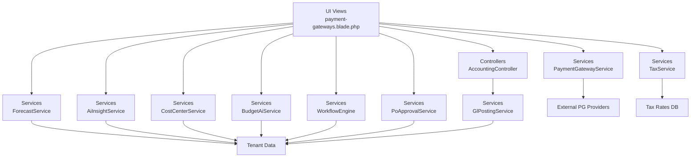

**Diagram sources**
- [AccountingController.php:13-36](file://app/Http/Controllers/AccountingController.php#L13-L36)
- [PaymentGatewayService.php:13-636](file://app/Services/PaymentGatewayService.php#L13-L636)
- [TaxService.php:15-167](file://app/Services/TaxService.php#L15-L167)
- [ForecastService.php:11-219](file://app/Services/ForecastService.php#L11-L219)
- [AiInsightService.php:39-66](file://app/Services/AiInsightService.php#L39-L66)
- [CostCenterService.php:9-202](file://app/Services/CostCenterService.php#L9-L202)
- [BudgetAiService.php:14-244](file://app/Services/BudgetAiService.php#L14-L244)
- [WorkflowEngine.php:9-161](file://app/Services/WorkflowEngine.php#L9-L161)
- [PoApprovalService.php:39-350](file://app/Services/PoApprovalService.php#L39-L350)
- [GlPostingService.php:442-479](file://app/Services/GlPostingService.php#L442-L479)

## Detailed Component Analysis

### Budget Management and Control
Budget planning and control include:
- Budget creation, updates, and variance computation.
- Overrun prediction using daily burn rate and historical trends.
- Allocation suggestions based on last year’s realized amounts plus buffer.

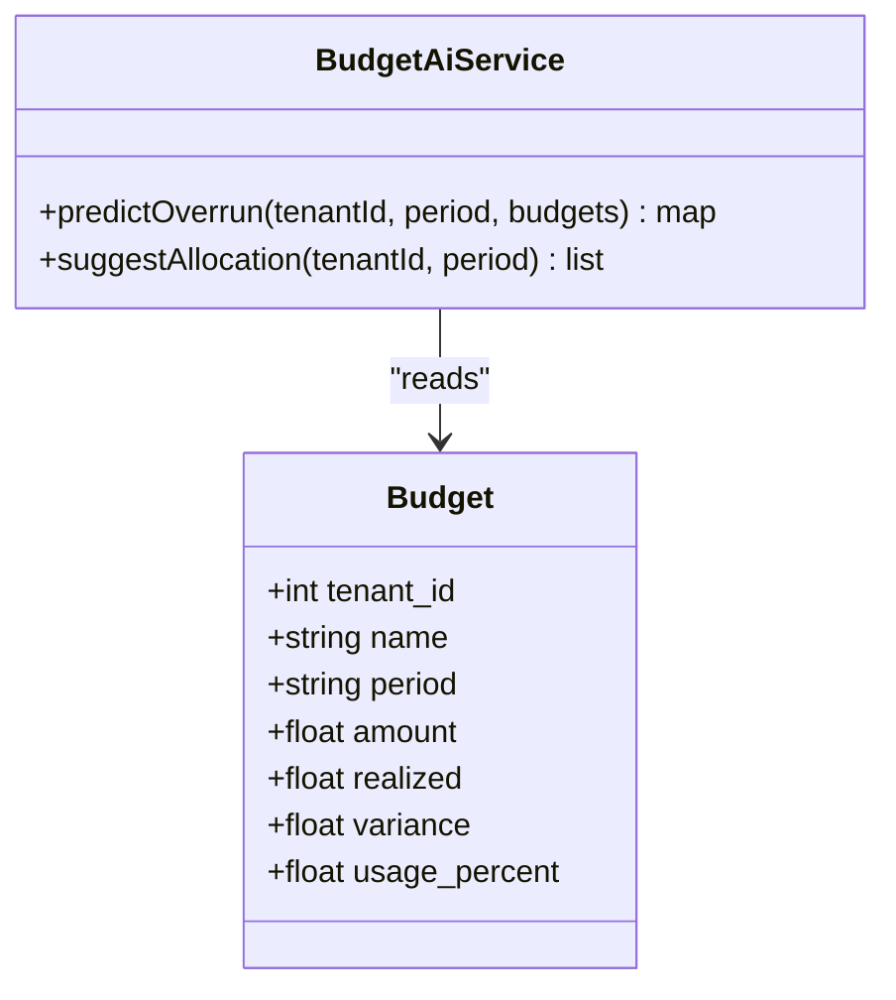

**Diagram sources**
- [Budget.php:10-36](file://app/Models/Budget.php#L10-L36)
- [BudgetAiService.php:14-244](file://app/Services/BudgetAiService.php#L14-L244)

**Section sources**
- [Budget.php:28-35](file://app/Models/Budget.php#L28-L35)
- [BudgetAiService.php:35-96](file://app/Services/BudgetAiService.php#L35-L96)
- [BudgetAiService.php:134-152](file://app/Services/BudgetAiService.php#L134-L152)

### Cost Center Accounting
Cost centers support hierarchical reporting and financial segment aggregation:
- Hierarchical validation and deletion constraints.
- Profit & Loss and Balance Sheet segment reporting.
- Subtree aggregation for roll-ups.

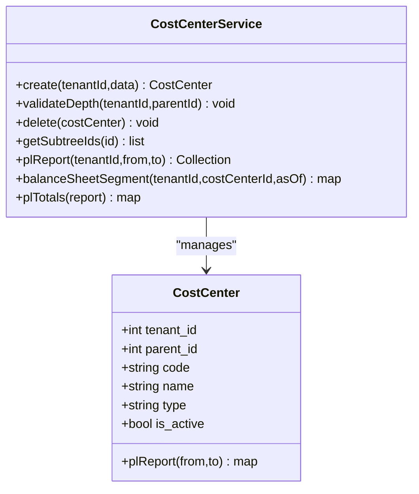

**Diagram sources**
- [CostCenter.php:11-72](file://app/Models/CostCenter.php#L11-L72)
- [CostCenterService.php:9-202](file://app/Services/CostCenterService.php#L9-L202)

**Section sources**
- [CostCenter.php:39-71](file://app/Models/CostCenter.php#L39-L71)
- [CostCenterService.php:16-81](file://app/Services/CostCenterService.php#L16-L81)
- [CostCenterService.php:100-152](file://app/Services/CostCenterService.php#L100-L152)

### Tax Processing Engine
Tax processing ensures accurate and consistent calculations:
- PPN and PPH computations with configurable rates.
- Accounting-compliant rounding to avoid discrepancies.
- TaxRecord persistence for auditability.

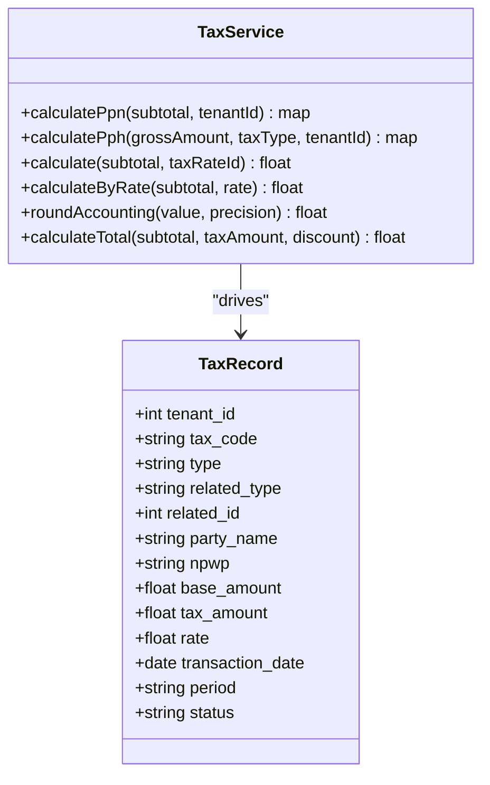

**Diagram sources**
- [TaxService.php:15-167](file://app/Services/TaxService.php#L15-L167)
- [TaxRecord.php:9-19](file://app/Models/TaxRecord.php#L9-L19)

**Section sources**
- [TaxService.php:25-96](file://app/Services/TaxService.php#L25-L96)
- [TaxService.php:117-144](file://app/Services/TaxService.php#L117-L144)
- [TaxRecord.php:12-18](file://app/Models/TaxRecord.php#L12-L18)

### Expense Tracking and Posting
Expenses are categorized and posted to the general ledger:
- ExpenseCategory defines classification and COA mapping.
- GlPostingService posts expense journals with cash/bank and vendor accounts.

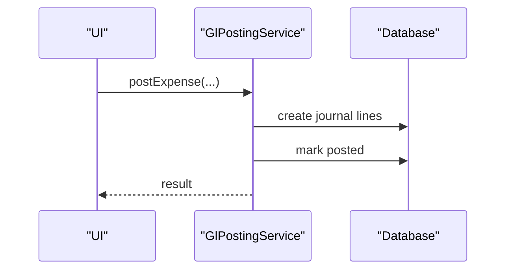

**Diagram sources**
- [GlPostingService.php:468-479](file://app/Services/GlPostingService.php#L468-L479)

**Section sources**
- [ExpenseCategory.php:11-23](file://app/Models/ExpenseCategory.php#L11-L23)
- [GlPostingService.php:468-479](file://app/Services/GlPostingService.php#L468-L479)

### Payment Gateway Integration
Multi-provider payment processing with QRIS support:
- Provider abstraction for Midtrans, Xendit, Duitku, TriPay.
- Transaction lifecycle: creation, status checks, webhooks, signature verification.
- Configuration UI and credential management.

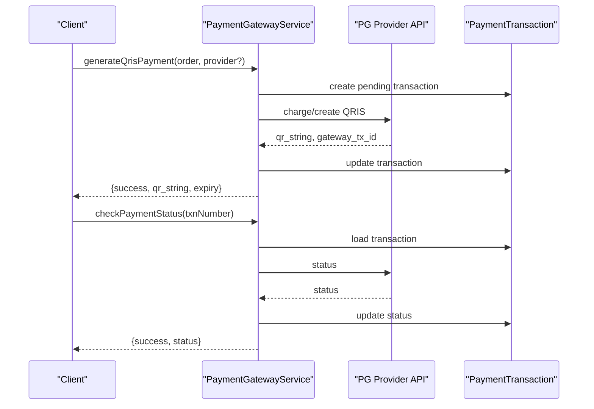

**Diagram sources**
- [PaymentGatewayService.php:31-161](file://app/Services/PaymentGatewayService.php#L31-L161)
- [PaymentGateway.php:10-54](file://app/Models/PaymentGateway.php#L10-L54)
- [payment-gateways.blade.php:342-374](file://resources/views/settings/payment-gateways.blade.php#L342-L374)

**Section sources**
- [PaymentGatewayService.php:18-26](file://app/Services/PaymentGatewayService.php#L18-L26)
- [PaymentGatewayService.php:591-620](file://app/Services/PaymentGatewayService.php#L591-L620)
- [PaymentGatewayService.php:622-635](file://app/Services/PaymentGatewayService.php#L622-L635)
- [PaymentGateway.php:14-33](file://app/Models/PaymentGateway.php#L14-L33)
- [payment-gateways.blade.php:342-374](file://resources/views/settings/payment-gateways.blade.php#L342-L374)

### Expense Approval Workflows
Approval workflows govern spending thresholds and routing:
- ApprovalWorkflow defines rules by amount ranges and approver roles.
- PoApprovalService determines if approval is required, creates requests, and validates approvers.
- WorkflowEngine executes event-driven and scheduled workflows.

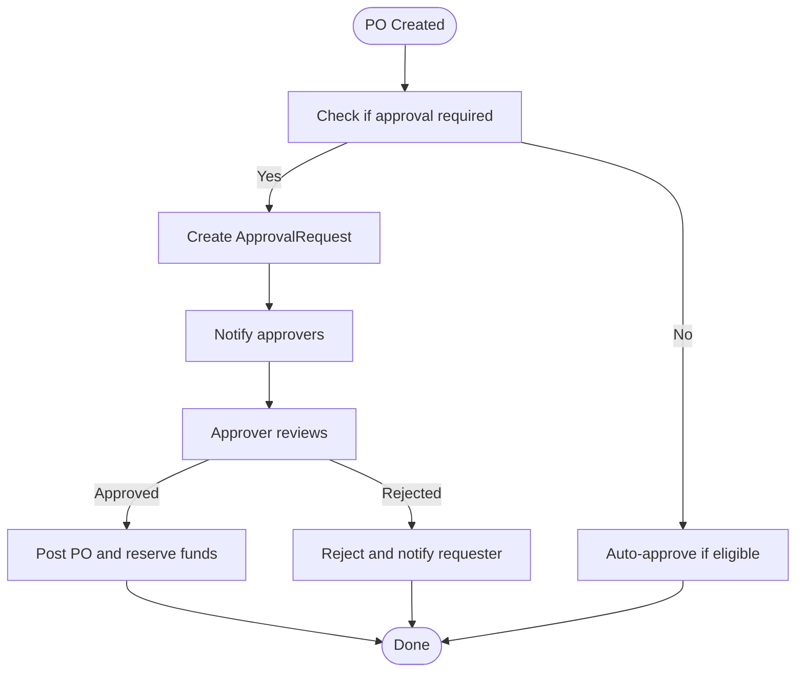

**Diagram sources**
- [PoApprovalService.php:39-80](file://app/Services/PoApprovalService.php#L39-L80)
- [PoApprovalService.php:119-155](file://app/Services/PoApprovalService.php#L119-L155)
- [ApprovalWorkflow.php:26-31](file://app/Models/ApprovalWorkflow.php#L26-L31)
- [WorkflowEngine.php:28-58](file://app/Services/WorkflowEngine.php#L28-L58)

**Section sources**
- [ApprovalWorkflow.php:12-24](file://app/Models/ApprovalWorkflow.php#L12-L24)
- [PoApprovalService.php:39-80](file://app/Services/PoApprovalService.php#L39-L80)
- [PoApprovalService.php:119-155](file://app/Services/PoApprovalService.php#L119-L155)
- [WorkflowEngine.php:28-58](file://app/Services/WorkflowEngine.php#L28-L58)

### Forecasting and Variance Analysis
Forecasting and variance insights:
- ForecastService computes revenue, cash flow, demand, and receivables aging forecasts.
- BudgetAiService provides variance risk scoring and allocation suggestions.
- AiInsightService aggregates financial insights including budget variance.

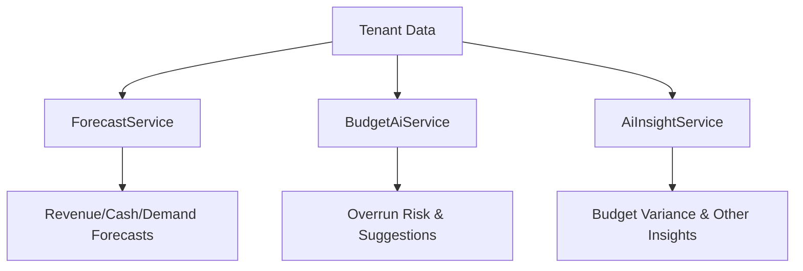

**Diagram sources**
- [ForecastService.php:17-122](file://app/Services/ForecastService.php#L17-L122)
- [ForecastService.php:127-184](file://app/Services/ForecastService.php#L127-L184)
- [ForecastService.php:190-218](file://app/Services/ForecastService.php#L190-L218)
- [BudgetAiService.php:35-96](file://app/Services/BudgetAiService.php#L35-L96)
- [AiInsightService.php:51-66](file://app/Services/AiInsightService.php#L51-L66)

**Section sources**
- [ForecastService.php:17-122](file://app/Services/ForecastService.php#L17-L122)
- [ForecastService.php:127-184](file://app/Services/ForecastService.php#L127-L184)
- [ForecastService.php:190-218](file://app/Services/ForecastService.php#L190-L218)
- [BudgetAiService.php:134-152](file://app/Services/BudgetAiService.php#L134-L152)
- [AiInsightService.php:51-66](file://app/Services/AiInsightService.php#L51-L66)

### Financial Controls
Controls ensure compliance and prevent errors:
- BusinessConstraintService enforces cash balance minimums, confirmation thresholds, and mandatory cost center usage.
- TenantDemoSeeder seeds default constraints for demo tenants.

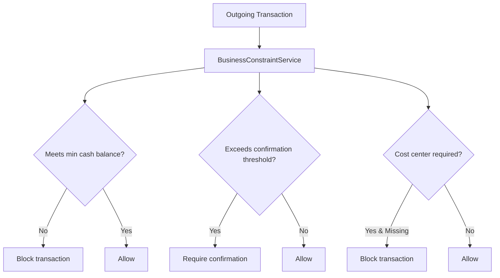

**Diagram sources**
- [BusinessConstraintService.php:79-114](file://app/Services/BusinessConstraintService.php#L79-L114)
- [TenantDemoSeeder.php:332-342](file://database/seeders/TenantDemoSeeder.php#L332-L342)

**Section sources**
- [BusinessConstraintService.php:79-114](file://app/Services/BusinessConstraintService.php#L79-L114)
- [TenantDemoSeeder.php:332-342](file://database/seeders/TenantDemoSeeder.php#L332-L342)

## Dependency Analysis
- Models depend on tenant scoping traits and Eloquent relationships.
- Services depend on models and external APIs (HTTP client).
- Controllers depend on services and models for presentation.
- UI depends on service endpoints and configuration.

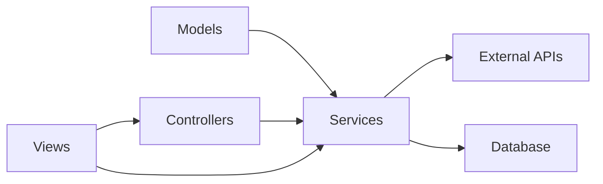

**Diagram sources**
- [PaymentGatewayService.php:9-11](file://app/Services/PaymentGatewayService.php#L9-L11)
- [TaxService.php:5-6](file://app/Services/TaxService.php#L5-L6)
- [ForecastService.php:5-9](file://app/Services/ForecastService.php#L5-L9)

**Section sources**
- [PaymentGatewayService.php:9-11](file://app/Services/PaymentGatewayService.php#L9-L11)
- [TaxService.php:5-6](file://app/Services/TaxService.php#L5-L6)
- [ForecastService.php:5-9](file://app/Services/ForecastService.php#L5-L9)

## Performance Considerations
- Prefer batched queries and aggregated reports for cost center and budget analytics.
- Cache frequently accessed tax rates and payment gateway configurations.
- Use database indexing on tenant_id, period, and status fields for efficient filtering.
- Apply pagination for large report exports.

## Troubleshooting Guide
- Payment gateway failures: Inspect gateway credentials, webhook signatures, and provider-specific error messages. Verify webhook URL configuration and secrets.
- Tax calculation discrepancies: Ensure accounting rounding mode and rate lookups are consistent; recompute totals to avoid floating-point drift.
- Budget overrun alerts: Validate recent realized data and historical periods used for projections.
- Approval workflow stuck: Check workflow triggers, scheduled execution logs, and approver role assignments.
- Cost center hierarchy errors: Confirm depth limits and absence of active children or linked transactions before deletion.

**Section sources**
- [PaymentGatewayService.php:166-217](file://app/Services/PaymentGatewayService.php#L166-L217)
- [PaymentGatewayService.php:622-635](file://app/Services/PaymentGatewayService.php#L622-L635)
- [TaxService.php:117-144](file://app/Services/TaxService.php#L117-L144)
- [BudgetAiService.php:35-96](file://app/Services/BudgetAiService.php#L35-L96)
- [WorkflowEngine.php:63-101](file://app/Services/WorkflowEngine.php#L63-L101)
- [CostCenterService.php:63-81](file://app/Services/CostCenterService.php#L63-L81)

## Conclusion
The Financial Services module integrates robust budgeting, cost center accounting, tax processing, expense workflows, and multi-provider payment capabilities. With built-in controls, forecasting, and variance insights, it supports accurate financial management and compliance across tenants and currencies.