# Payment Processing & Gateway Integration

<cite>
**Referenced Files in This Document**
- [PaymentGatewayService.php](file://app/Services/Integrations/PaymentGatewayService.php)
- [TelemedicinePaymentService.php](file://app/Services/Healthcare/TelemedicinePaymentService.php)
- [PaymentGatewayController.php](file://app/Http/Controllers/PaymentGatewayController.php)
- [PaymentController.php](file://app/Http/Controllers/Api/PaymentController.php)
- [WebhookHandlerService.php](file://app/Services/WebhookHandlerService.php)
- [PaymentGateway.php](file://app/Models/PaymentGateway.php)
- [TenantPaymentGateway.php](file://app/Models/TenantPaymentGateway.php)
- [PaymentTransaction.php](file://app/Models/PaymentTransaction.php)
- [PaymentCallback.php](file://app/Models/PaymentCallback.php)
- [Payment.php](file://app/Models/Payment.php)
- [InvoicePaymentService.php](file://app/Services/InvoicePaymentService.php)
- [GlPostingService.php](file://app/Services/GlPostingService.php)
- [BulkPaymentController.php](file://app/Http/Controllers/BulkPaymentController.php)
- [BulkPayment.php](file://app/Models/BulkPayment.php)
- [BulkPaymentItem.php](file://app/Models/BulkPaymentItem.php)
- [CurrencyService.php](file://app/Services/CurrencyService.php)
- [CurrencyTools.php](file://app/Services/ERP/CurrencyTools.php)
- [payment-gateways.blade.php](file://resources/views/settings/payment-gateways.blade.php)
- [payment-selection-modal.blade.php](file://resources/views/components/payment-selection-modal.blade.php)
- [TelemedicineController.php](file://app/Http/Controllers/Healthcare/TelemedicineController.php)
- [2026_04_04_900000_create_payment_gateway_tables.php](file://database/migrations/2026_04_04_900000_create_payment_gateway_tables.php)
</cite>

## Table of Contents
1. [Introduction](#introduction)
2. [Project Structure](#project-structure)
3. [Core Components](#core-components)
4. [Architecture Overview](#architecture-overview)
5. [Detailed Component Analysis](#detailed-component-analysis)
6. [Dependency Analysis](#dependency-analysis)
7. [Performance Considerations](#performance-considerations)
8. [Troubleshooting Guide](#troubleshooting-guide)
9. [Conclusion](#conclusion)
10. [Appendices](#appendices)

## Introduction
This document explains the payment processing and gateway integration capabilities implemented in the system. It covers multi-gateway payment handling, payment method management, transaction processing, reconciliation, refund processing, failure handling, multi-currency support, scheduling and automated collection, tokenization, PCI compliance considerations, and payment analytics. The goal is to help both technical and non-technical users understand how payments are configured, executed, tracked, and reconciled across supported providers.

## Project Structure
The payment subsystem is organized around:
- Models representing payment entities and gateway configurations
- Services orchestrating gateway API calls and payment lifecycle
- Controllers exposing endpoints for payment initiation, status checks, and webhooks
- Blade templates supporting admin configuration and user payment selection
- Migrations defining the persistence layer for transactions and callbacks

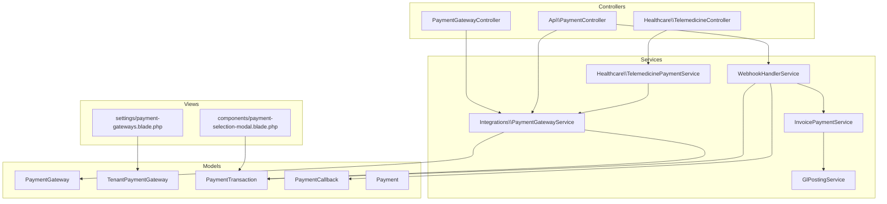

**Diagram sources**
- [PaymentGatewayController.php:1-275](file://app/Http/Controllers/PaymentGatewayController.php#L1-L275)
- [PaymentController.php:1-287](file://app/Http/Controllers/Api/PaymentController.php#L1-L287)
- [TelemedicineController.php:362-377](file://app/Http/Controllers/Healthcare/TelemedicineController.php#L362-L377)
- [PaymentGatewayService.php:1-284](file://app/Services/Integrations/PaymentGatewayService.php#L1-L284)
- [TelemedicinePaymentService.php:1-674](file://app/Services/Healthcare/TelemedicinePaymentService.php#L1-L674)
- [WebhookHandlerService.php:1-442](file://app/Services/WebhookHandlerService.php#L1-L442)
- [InvoicePaymentService.php:248-285](file://app/Services/InvoicePaymentService.php#L248-L285)
- [GlPostingService.php:434-445](file://app/Services/GlPostingService.php#L434-L445)
- [PaymentGateway.php:1-55](file://app/Models/PaymentGateway.php#L1-L55)
- [TenantPaymentGateway.php:1-152](file://app/Models/TenantPaymentGateway.php#L1-L152)
- [PaymentTransaction.php:1-60](file://app/Models/PaymentTransaction.php#L1-L60)
- [PaymentCallback.php:1-86](file://app/Models/PaymentCallback.php#L1-L86)
- [Payment.php:1-49](file://app/Models/Payment.php#L1-L49)
- [payment-gateways.blade.php:342-445](file://resources/views/settings/payment-gateways.blade.php#L342-L445)
- [payment-selection-modal.blade.php:195-217](file://resources/views/components/payment-selection-modal.blade.php#L195-L217)

**Section sources**
- [PaymentGatewayService.php:1-284](file://app/Services/Integrations/PaymentGatewayService.php#L1-L284)
- [TelemedicinePaymentService.php:1-674](file://app/Services/Healthcare/TelemedicinePaymentService.php#L1-L674)
- [PaymentGatewayController.php:1-275](file://app/Http/Controllers/PaymentGatewayController.php#L1-L275)
- [PaymentController.php:1-287](file://app/Http/Controllers/Api/PaymentController.php#L1-L287)
- [WebhookHandlerService.php:1-442](file://app/Services/WebhookHandlerService.php#L1-L442)
- [PaymentGateway.php:1-55](file://app/Models/PaymentGateway.php#L1-L55)
- [TenantPaymentGateway.php:1-152](file://app/Models/TenantPaymentGateway.php#L1-L152)
- [PaymentTransaction.php:1-60](file://app/Models/PaymentTransaction.php#L1-L60)
- [PaymentCallback.php:1-86](file://app/Models/PaymentCallback.php#L1-L86)
- [Payment.php:1-49](file://app/Models/Payment.php#L1-L49)
- [payment-gateways.blade.php:342-445](file://resources/views/settings/payment-gateways.blade.php#L342-L445)
- [payment-selection-modal.blade.php:195-217](file://resources/views/components/payment-selection-modal.blade.php#L195-L217)

## Core Components
- PaymentGatewayService: Creates payments via supported gateways (Midtrans, Xendit, Duitku, Tripay), handles webhooks, and queries transaction status.
- TelemedicinePaymentService: Manages telemedicine payment lifecycle, including provider selection, QRIS/e-wallet/VA generation, callback parsing, invoice creation, and refund processing.
- PaymentGatewayController: Handles subscription checkout and webhooks for Midtrans and Xendit.
- Api/PaymentController: Provides API endpoints for generating QRIS payments, checking status, retrieving transactions, managing gateway settings, testing credentials, toggling gateways, and receiving provider webhooks.
- WebhookHandlerService: Processes provider webhooks, enforces idempotency, verifies signatures, updates transactions, and triggers downstream actions (e.g., sales order completion).
- Models: PaymentGateway, TenantPaymentGateway, PaymentTransaction, PaymentCallback, Payment define the persisted state and relationships.
- InvoicePaymentService and GlPostingService: Support bulk payment posting and general ledger integration.
- Blade Views: Admin configuration UI and user payment selection modal.

**Section sources**
- [PaymentGatewayService.php:1-284](file://app/Services/Integrations/PaymentGatewayService.php#L1-L284)
- [TelemedicinePaymentService.php:1-674](file://app/Services/Healthcare/TelemedicinePaymentService.php#L1-L674)
- [PaymentGatewayController.php:1-275](file://app/Http/Controllers/PaymentGatewayController.php#L1-L275)
- [PaymentController.php:1-287](file://app/Http/Controllers/Api/PaymentController.php#L1-L287)
- [WebhookHandlerService.php:1-442](file://app/Services/WebhookHandlerService.php#L1-L442)
- [PaymentGateway.php:1-55](file://app/Models/PaymentGateway.php#L1-L55)
- [TenantPaymentGateway.php:1-152](file://app/Models/TenantPaymentGateway.php#L1-L152)
- [PaymentTransaction.php:1-60](file://app/Models/PaymentTransaction.php#L1-L60)
- [PaymentCallback.php:1-86](file://app/Models/PaymentCallback.php#L1-L86)
- [InvoicePaymentService.php:248-285](file://app/Services/InvoicePaymentService.php#L248-L285)
- [GlPostingService.php:434-445](file://app/Services/GlPostingService.php#L434-L445)
- [payment-gateways.blade.php:342-445](file://resources/views/settings/payment-gateways.blade.php#L342-L445)
- [payment-selection-modal.blade.php:195-217](file://resources/views/components/payment-selection-modal.blade.php#L195-L217)

## Architecture Overview
The system supports multiple payment providers and channels. Payments are initiated either by the POS/ecommerce APIs or by telemedicine workflows. Gateways push asynchronous notifications (webhooks) to the system, which are processed to reconcile and finalize transactions. Bulk payments integrate with accounting via general ledger posting.

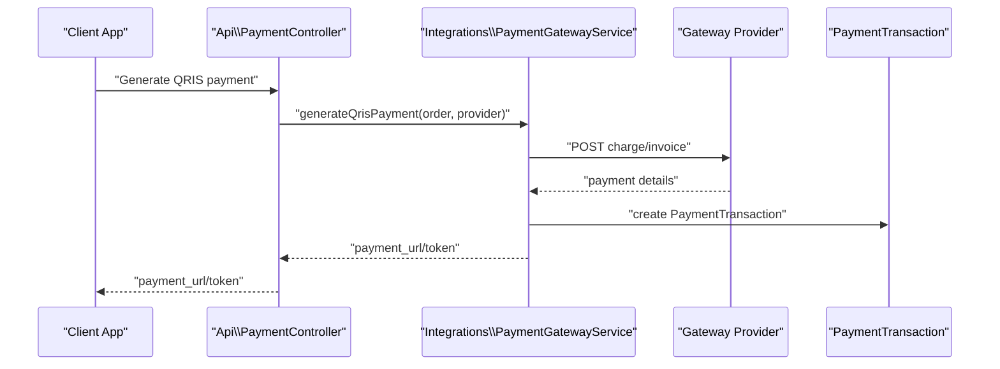

**Diagram sources**
- [PaymentController.php:23-48](file://app/Http/Controllers/Api/PaymentController.php#L23-L48)
- [PaymentGatewayService.php:15-94](file://app/Services/Integrations/PaymentGatewayService.php#L15-L94)

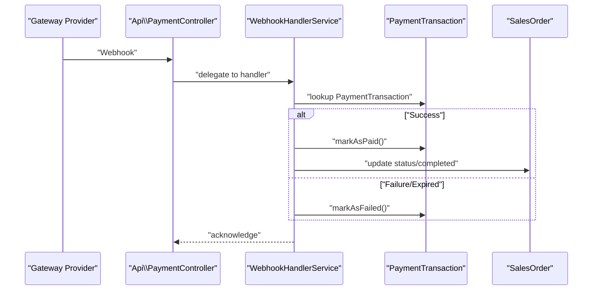

**Diagram sources**
- [PaymentController.php:110-148](file://app/Http/Controllers/Api/PaymentController.php#L110-L148)
- [WebhookHandlerService.php:21-126](file://app/Services/WebhookHandlerService.php#L21-L126)
- [PaymentTransaction.php:44-58](file://app/Models/PaymentTransaction.php#L44-L58)

## Detailed Component Analysis

### Multi-Gateway Payment Handling
- Supported providers: Midtrans, Xendit, Duitku, Tripay.
- Payment creation:
  - Midtrans: Charge endpoint with enabled payment methods; returns redirect URL and token.
  - Xendit: Invoice creation; returns invoice URL.
  - Duitku/Tripay: Provider-specific endpoints with signature handling.
- Webhook handling:
  - Midtrans: Settlement/capture marks paid; cancel/deny/expire marks failed.
  - Xendit: PAID marks paid; EXPIRED/FAILED mark failed.
  - Duitku/Tripay: Provider-specific callback parsing.

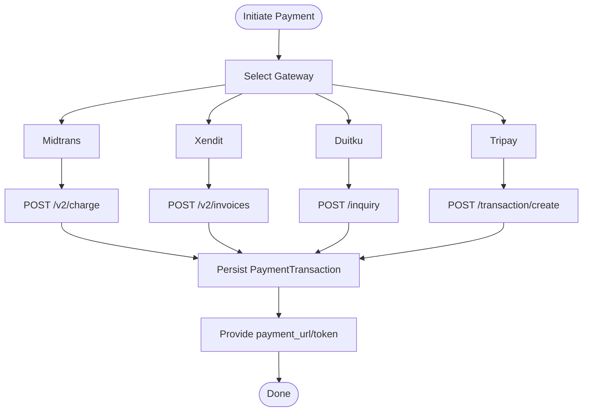

**Diagram sources**
- [PaymentGatewayService.php:15-163](file://app/Services/Integrations/PaymentGatewayService.php#L15-L163)

**Section sources**
- [PaymentGatewayService.php:1-284](file://app/Services/Integrations/PaymentGatewayService.php#L1-L284)

### Payment Method Management
- Telemedicine payment methods include QRIS, credit/debit cards, bank transfer, virtual accounts, and e-wallets.
- Method selection influences expiration times and provider-specific payload construction.
- Provider mapping:
  - Xendit channel codes for VA banks and QRIS.
  - Tripay method codes for various channels.

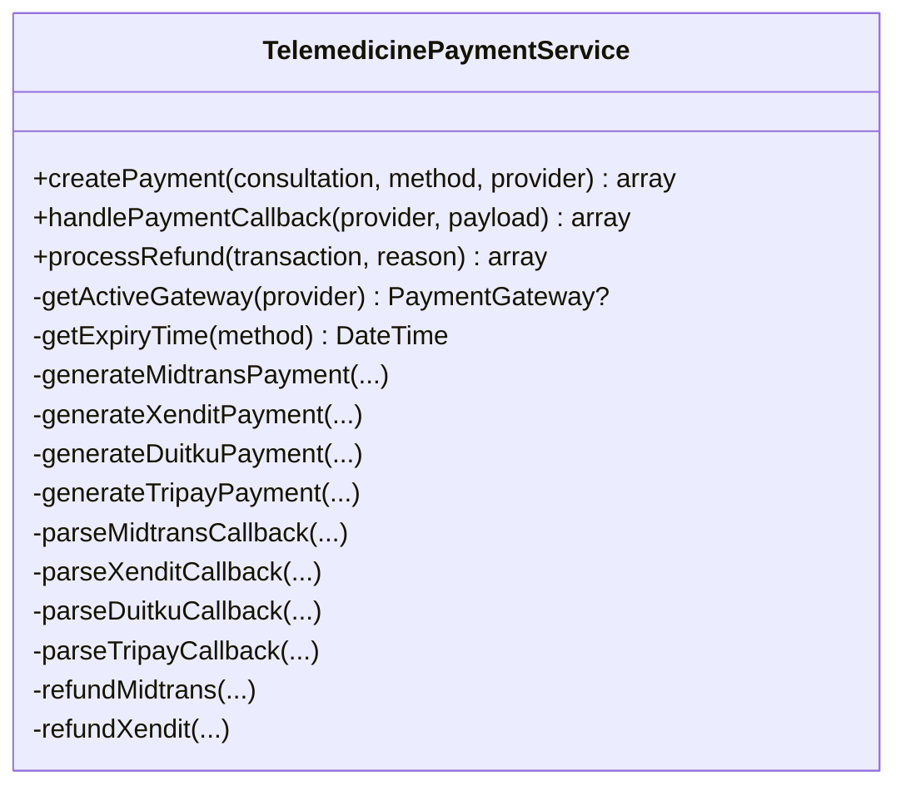

**Diagram sources**
- [TelemedicinePaymentService.php:1-674](file://app/Services/Healthcare/TelemedicinePaymentService.php#L1-L674)

**Section sources**
- [TelemedicinePaymentService.php:1-674](file://app/Services/Healthcare/TelemedicinePaymentService.php#L1-L674)
- [payment-selection-modal.blade.php:195-217](file://resources/views/components/payment-selection-modal.blade.php#L195-L217)

### Transaction Processing
- PaymentTransaction captures gateway identifiers, amounts, currency, status, timestamps, and metadata.
- Status transitions: pending → paid/settled, failed/cancelled/expired.
- Idempotency and signature verification in webhook handler prevent duplicate processing.

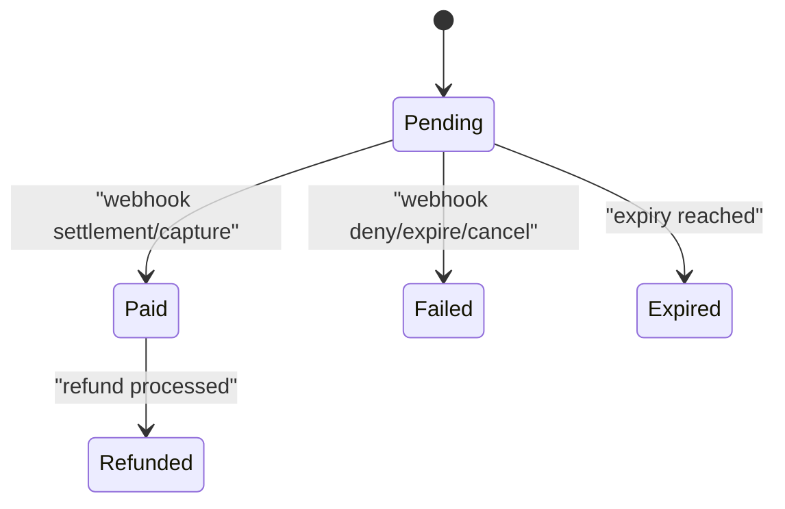

**Diagram sources**
- [PaymentTransaction.php:44-58](file://app/Models/PaymentTransaction.php#L44-L58)
- [WebhookHandlerService.php:21-126](file://app/Services/WebhookHandlerService.php#L21-L126)

**Section sources**
- [PaymentTransaction.php:1-60](file://app/Models/PaymentTransaction.php#L1-L60)
- [WebhookHandlerService.php:1-442](file://app/Services/WebhookHandlerService.php#L1-L442)

### Payment Gateway Configurations and API Integrations
- TenantPaymentGateway stores provider, environment, encrypted credentials, webhook URL, and default flag.
- PaymentGateway (legacy model) holds provider and related transactions.
- API endpoints:
  - Save/update gateway settings (credentials encrypted).
  - Test/verify credentials.
  - Toggle activation.
  - Retrieve settings (credentials hidden).
  - Webhook handler for providers.

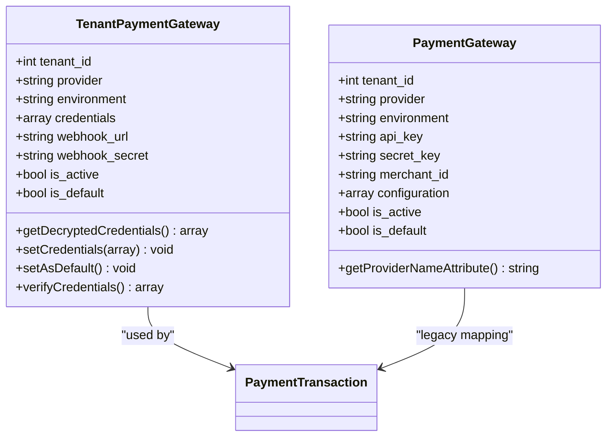

**Diagram sources**
- [TenantPaymentGateway.php:1-152](file://app/Models/TenantPaymentGateway.php#L1-L152)
- [PaymentGateway.php:1-55](file://app/Models/PaymentGateway.php#L1-L55)

**Section sources**
- [TenantPaymentGateway.php:1-152](file://app/Models/TenantPaymentGateway.php#L1-L152)
- [PaymentGateway.php:1-55](file://app/Models/PaymentGateway.php#L1-L55)
- [PaymentController.php:150-244](file://app/Http/Controllers/Api/PaymentController.php#L150-L244)
- [payment-gateways.blade.php:342-445](file://resources/views/settings/payment-gateways.blade.php#L342-L445)

### Payment Security Protocols
- Encrypted credentials: TenantPaymentGateway persists credentials securely.
- Signature verification: WebhookHandlerService verifies provider signatures and enforces idempotency.
- Idempotency service prevents duplicate processing of webhooks.
- Sensitive fields are excluded from API responses (e.g., credentials in settings retrieval).

**Section sources**
- [TenantPaymentGateway.php:44-57](file://app/Models/TenantPaymentGateway.php#L44-L57)
- [WebhookHandlerService.php:21-126](file://app/Services/WebhookHandlerService.php#L21-L126)
- [PaymentController.php:150-167](file://app/Http/Controllers/Api/PaymentController.php#L150-L167)

### Payment Reconciliation
- WebhookHandlerService updates PaymentTransaction and, when applicable, completes related SalesOrder records.
- PaymentCallback tracks incoming webhook events, verification status, and processing outcomes.
- Idempotency ensures duplicate webhooks do not cause double-processing.

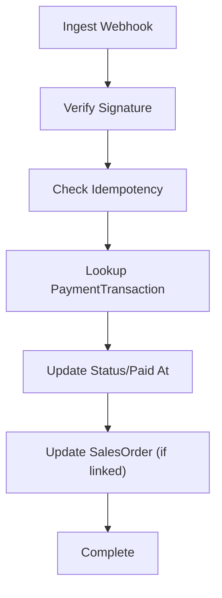

**Diagram sources**
- [WebhookHandlerService.php:21-126](file://app/Services/WebhookHandlerService.php#L21-L126)
- [PaymentCallback.php:1-86](file://app/Models/PaymentCallback.php#L1-L86)

**Section sources**
- [WebhookHandlerService.php:1-442](file://app/Services/WebhookHandlerService.php#L1-L442)
- [PaymentCallback.php:1-86](file://app/Models/PaymentCallback.php#L1-L86)

### Refund Processing
- TelemedicinePaymentService supports provider-specific refunds:
  - Midtrans: Calls refund endpoint with amount and reason.
  - Xendit: Logs refund request (manual processing in provider dashboard).
- On success, PaymentTransaction is marked refunded and associated telemedicine records are updated.

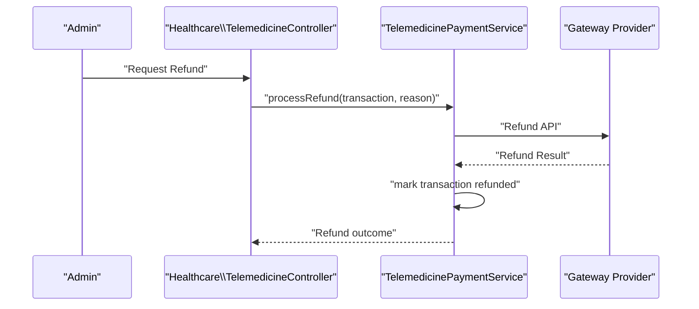

**Diagram sources**
- [TelemedicineController.php:362-377](file://app/Http/Controllers/Healthcare/TelemedicineController.php#L362-L377)
- [TelemedicinePaymentService.php:211-264](file://app/Services/Healthcare/TelemedicinePaymentService.php#L211-L264)

**Section sources**
- [TelemedicinePaymentService.php:211-264](file://app/Services/Healthcare/TelemedicinePaymentService.php#L211-L264)
- [TelemedicineController.php:362-377](file://app/Http/Controllers/Healthcare/TelemedicineController.php#L362-L377)

### Payment Failure Handling
- Webhooks for failure/expiry trigger markAsFailed on PaymentTransaction.
- Subscription payment failures notify administrators via in-app and email notifications.
- PaymentCallback records processing errors for diagnostics.

**Section sources**
- [WebhookHandlerService.php:95-126](file://app/Services/WebhookHandlerService.php#L95-L126)
- [PaymentGatewayController.php:227-273](file://app/Http/Controllers/PaymentGatewayController.php#L227-L273)
- [PaymentCallback.php:77-84](file://app/Models/PaymentCallback.php#L77-L84)

### Multi-Currency Payments
- CurrencyService and CurrencyTools provide currency conversion and rate management.
- Conversions are performed via IDR as the base currency.
- Rates are cached and stale rate detection is implemented.

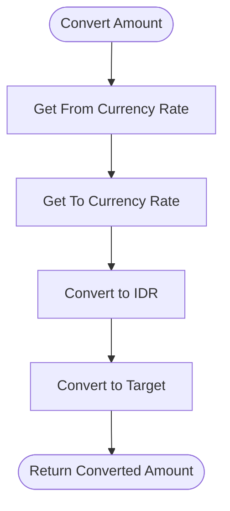

**Diagram sources**
- [CurrencyService.php:20-40](file://app/Services/CurrencyService.php#L20-L40)
- [CurrencyTools.php:51-103](file://app/Services/ERP/CurrencyTools.php#L51-L103)

**Section sources**
- [CurrencyService.php:1-52](file://app/Services/CurrencyService.php#L1-L52)
- [CurrencyTools.php:1-120](file://app/Services/ERP/CurrencyTools.php#L1-L120)

### Payment Scheduling and Automated Collection
- Subscription billing creates invoices and links to billing periods.
- Contract billing advances next billing dates based on cycles.
- Medical billing supports installment plans with scheduled payments.
- Bulk payments apply multiple invoices and post to GL.

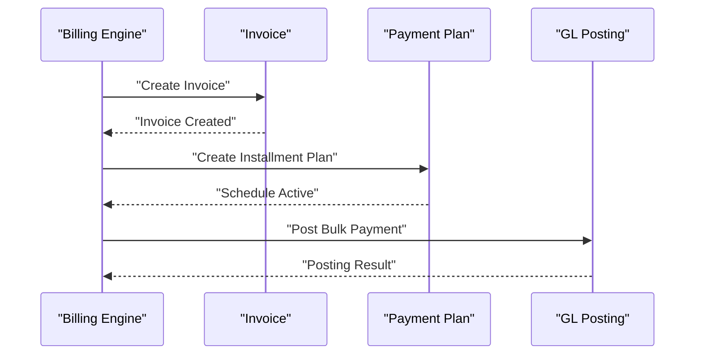

**Diagram sources**
- [SubscriptionBillingController.php:246-267](file://app/Http/Controllers/SubscriptionBillingController.php#L246-L267)
- [ContractController.php:181-207](file://app/Http/Controllers/ContractController.php#L181-L207)
- [MedicalBillingService.php:290-316](file://app/Services/MedicalBillingService.php#L290-L316)
- [InvoicePaymentService.php:248-285](file://app/Services/InvoicePaymentService.php#L248-L285)
- [GlPostingService.php:434-445](file://app/Services/GlPostingService.php#L434-L445)

**Section sources**
- [SubscriptionBillingController.php:246-267](file://app/Http/Controllers/SubscriptionBillingController.php#L246-L267)
- [ContractController.php:181-207](file://app/Http/Controllers/ContractController.php#L181-L207)
- [MedicalBillingService.php:290-316](file://app/Services/MedicalBillingService.php#L290-L316)
- [InvoicePaymentService.php:248-285](file://app/Services/InvoicePaymentService.php#L248-L285)
- [GlPostingService.php:434-445](file://app/Services/GlPostingService.php#L434-L445)

### Automated Payment Collection
- BulkPaymentController applies payments across invoices, credits overpayments to customer balances, and posts GL entries.
- GL posting integrates with general ledger for financial reporting.

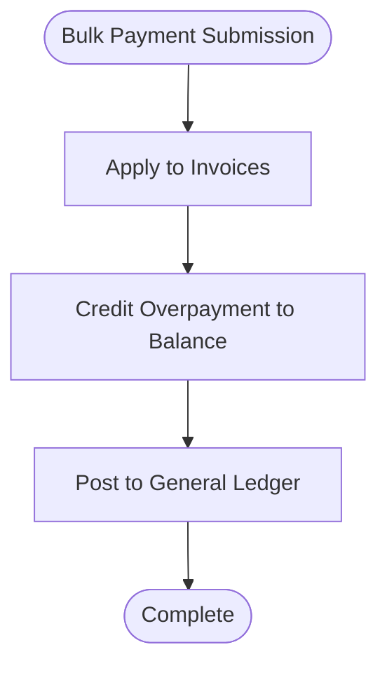

**Diagram sources**
- [BulkPaymentController.php:34-160](file://app/Http/Controllers/BulkPaymentController.php#L34-L160)
- [GlPostingService.php:434-445](file://app/Services/GlPostingService.php#L434-L445)
- [BulkPayment.php:1-150](file://app/Models/BulkPayment.php#L1-L150)
- [BulkPaymentItem.php:1-17](file://app/Models/BulkPaymentItem.php#L1-L17)

**Section sources**
- [BulkPaymentController.php:1-160](file://app/Http/Controllers/BulkPaymentController.php#L1-L160)
- [GlPostingService.php:434-445](file://app/Services/GlPostingService.php#L434-L445)
- [BulkPayment.php:1-150](file://app/Models/BulkPayment.php#L1-L150)
- [BulkPaymentItem.php:1-17](file://app/Models/BulkPaymentItem.php#L1-L17)

### Payment Tokenization and PCI Compliance
- Tokenization: Payment creation returns gateway tokens/URLs for off-session payments (e.g., Midtrans token, Xendit invoice URL).
- PCI considerations:
  - Credentials are stored encrypted in TenantPaymentGateway.
  - Sensitive fields are excluded from API responses.
  - Webhooks are verified and idempotency is enforced to reduce risk of replay attacks.

**Section sources**
- [PaymentGatewayService.php:15-163](file://app/Services/Integrations/PaymentGatewayService.php#L15-L163)
- [TenantPaymentGateway.php:44-57](file://app/Models/TenantPaymentGateway.php#L44-L57)
- [PaymentController.php:150-167](file://app/Http/Controllers/Api/PaymentController.php#L150-L167)
- [WebhookHandlerService.php:21-126](file://app/Services/WebhookHandlerService.php#L21-L126)

### Payment Analytics
- Payment analytics are integrated into broader financial insights, including cash flow prediction, receivables/payables aging, and budget variance.
- These insights help monitor payment trends and potential anomalies.

**Section sources**
- [AiInsightService.php:875-1067](file://app/Services/AiInsightService.php#L875-L1067)

## Dependency Analysis
- Controllers depend on Services for business logic and on Models for persistence.
- Services depend on external providers via HTTP client and on Models for state updates.
- WebhookHandlerService depends on TenantPaymentGateway for signature verification and on PaymentTransaction for reconciliation.
- Persistence schema includes dedicated tables for transactions and callbacks.

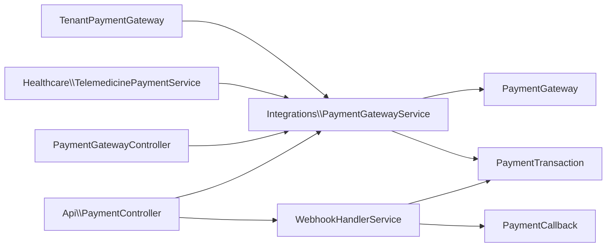

**Diagram sources**
- [PaymentController.php:1-287](file://app/Http/Controllers/Api/PaymentController.php#L1-L287)
- [PaymentGatewayController.php:1-275](file://app/Http/Controllers/PaymentGatewayController.php#L1-L275)
- [TelemedicinePaymentService.php:1-674](file://app/Services/Healthcare/TelemedicinePaymentService.php#L1-L674)
- [PaymentGatewayService.php:1-284](file://app/Services/Integrations/PaymentGatewayService.php#L1-L284)
- [WebhookHandlerService.php:1-442](file://app/Services/WebhookHandlerService.php#L1-L442)
- [PaymentGateway.php:1-55](file://app/Models/PaymentGateway.php#L1-L55)
- [TenantPaymentGateway.php:1-152](file://app/Models/TenantPaymentGateway.php#L1-L152)
- [PaymentTransaction.php:1-60](file://app/Models/PaymentTransaction.php#L1-L60)
- [PaymentCallback.php:1-86](file://app/Models/PaymentCallback.php#L1-L86)

**Section sources**
- [2026_04_04_900000_create_payment_gateway_tables.php:77-92](file://database/migrations/2026_04_04_900000_create_payment_gateway_tables.php#L77-L92)

## Performance Considerations
- Prefer asynchronous webhook processing to avoid blocking API requests.
- Use idempotency keys and signature verification to minimize retries and duplicate work.
- Cache frequently accessed currency rates and invalidate on staleness.
- Batch GL postings for bulk payments to reduce transaction overhead.

## Troubleshooting Guide
- Webhook not processed:
  - Verify webhook secret is configured and signatures match.
  - Check PaymentCallback for processing errors and retry logic.
- Duplicate webhook events:
  - Idempotency service prevents reprocessing; inspect previous callback references.
- Payment stuck in pending:
  - Confirm provider webhook delivery and status mapping.
  - Use transaction status API to reconcile.
- Credentials verification failures:
  - Ensure encrypted credentials are correctly stored and provider environment matches sandbox/production.

**Section sources**
- [WebhookHandlerService.php:21-126](file://app/Services/WebhookHandlerService.php#L21-L126)
- [PaymentCallback.php:77-84](file://app/Models/PaymentCallback.php#L77-L84)
- [PaymentController.php:215-225](file://app/Http/Controllers/Api/PaymentController.php#L215-L225)

## Conclusion
The system provides robust multi-gateway payment capabilities with strong reconciliation, security, and extensibility. It supports diverse payment methods, automated billing, and financial integration. Administrators can configure gateways securely, while developers can extend provider support and integrate analytics and automation workflows.

## Appendices

### Data Model Overview
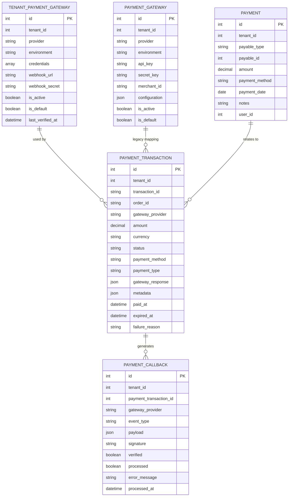

**Diagram sources**
- [TenantPaymentGateway.php:1-152](file://app/Models/TenantPaymentGateway.php#L1-L152)
- [PaymentTransaction.php:1-60](file://app/Models/PaymentTransaction.php#L1-L60)
- [PaymentCallback.php:1-86](file://app/Models/PaymentCallback.php#L1-L86)
- [PaymentGateway.php:1-55](file://app/Models/PaymentGateway.php#L1-L55)
- [Payment.php:1-49](file://app/Models/Payment.php#L1-L49)