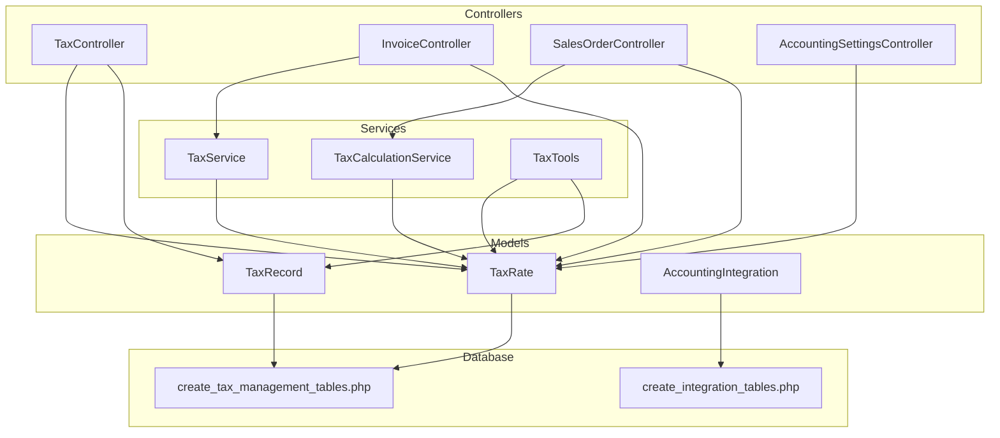
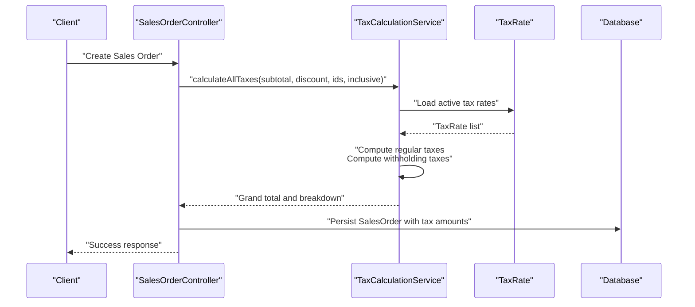
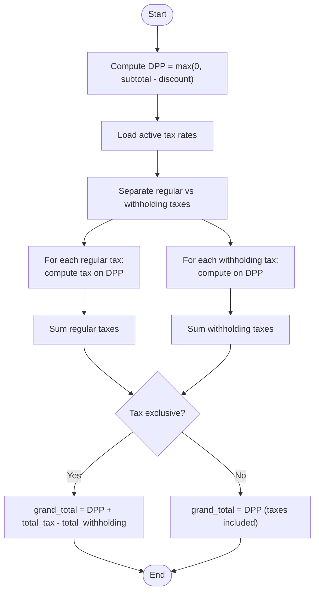
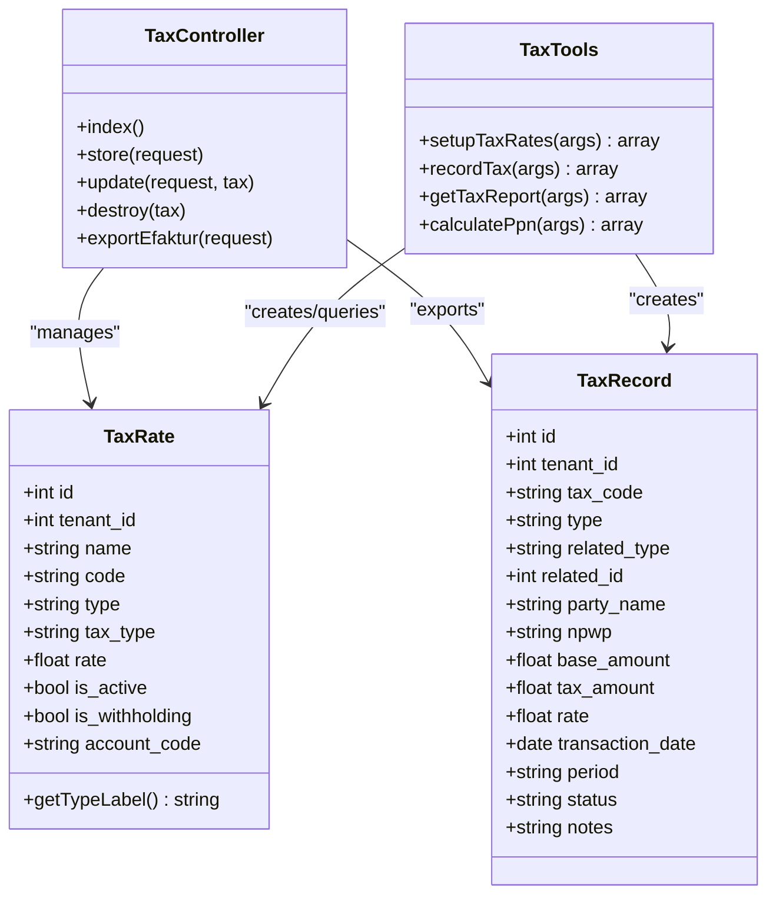
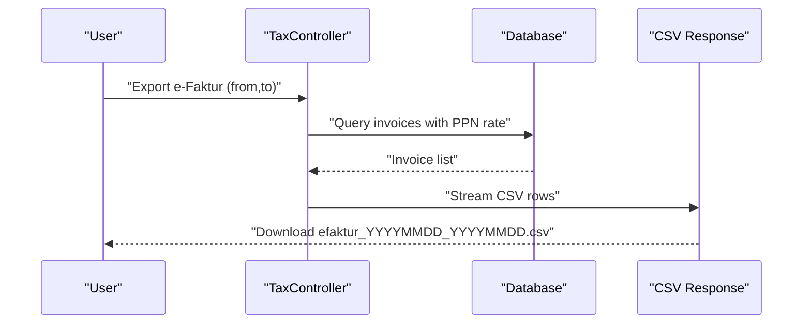
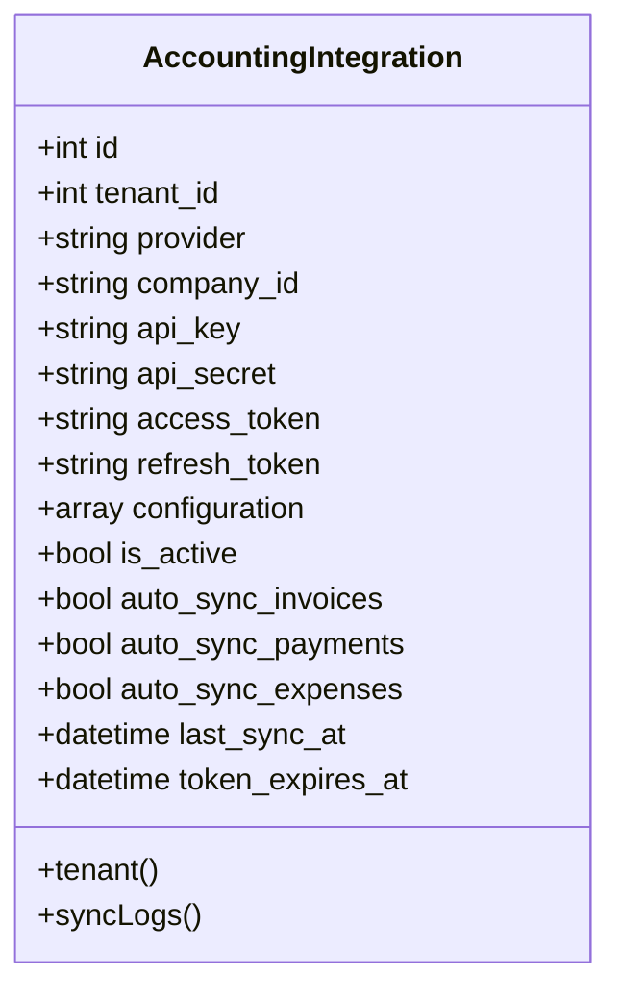
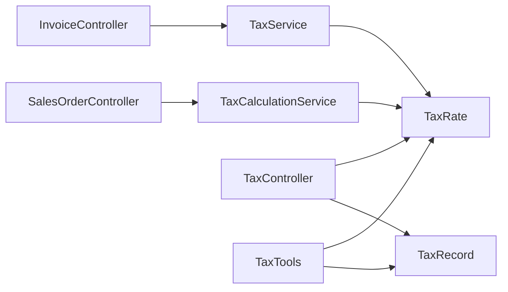
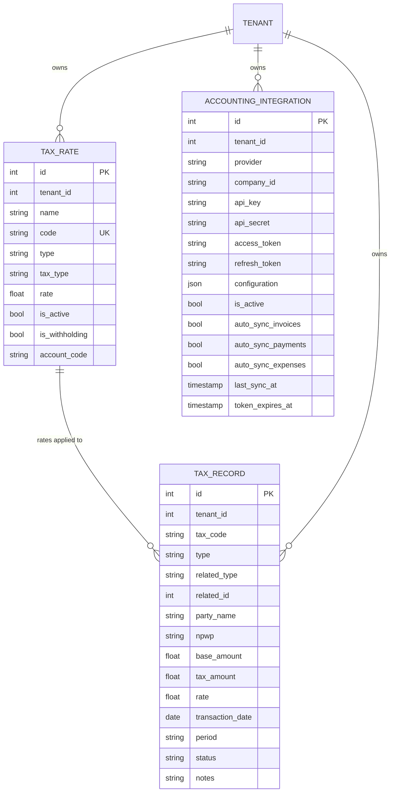

# Tax Processing & Compliance

<cite>
**Referenced Files in This Document**
- [TaxService.php](file://app/Services/TaxService.php)
- [TaxCalculationService.php](file://app/Services/TaxCalculationService.php)
- [TaxTools.php](file://app/Services/ERP/TaxTools.php)
- [TaxRate.php](file://app/Models/TaxRate.php)
- [TaxRecord.php](file://app/Models/TaxRecord.php)
- [TaxController.php](file://app/Http/Controllers/TaxController.php)
- [InvoiceController.php](file://app/Http/Controllers/InvoiceController.php)
- [SalesOrderController.php](file://app/Http/Controllers/SalesOrderController.php)
- [AccountingIntegration.php](file://app/Models/AccountingIntegration.php)
- [AccountingSettingsController.php](file://app/Http/Controllers/AccountingSettingsController.php)
- [2026_01_01_000025_create_tax_management_tables.php](file://database/migrations/2026_01_01_000025_create_tax_management_tables.php)
- [2026_04_06_070000_create_integration_tables.php](file://database/migrations/2026_04_06_070000_create_integration_tables.php)
- [GenerateComplianceReport.php](file://app/Console/Commands/GenerateComplianceReport.php)
</cite>

## Table of Contents
1. [Introduction](#introduction)
2. [Project Structure](#project-structure)
3. [Core Components](#core-components)
4. [Architecture Overview](#architecture-overview)
5. [Detailed Component Analysis](#detailed-component-analysis)
6. [Dependency Analysis](#dependency-analysis)
7. [Performance Considerations](#performance-considerations)
8. [Troubleshooting Guide](#troubleshooting-guide)
9. [Conclusion](#conclusion)
10. [Appendices](#appendices)

## Introduction
This document describes the tax processing and compliance subsystem within the ERP. It covers tax calculation engines, tax rate management, regulatory compliance, and reporting. The system supports Indonesian tax regimes including VAT (PPN), withholding taxes (PPh 21, PPh 23, PPh 4/2), and simplified final taxes. It also documents multi-jurisdiction considerations, tax exemption processing, and integration with accounting systems and tax authority reporting (e.g., e-Faktur CSV export).

## Project Structure
The tax domain spans services, models, controllers, and database migrations. Controllers orchestrate tax operations and integrate with business transactions (invoices, sales orders). Services encapsulate precise tax computations and rounding rules aligned with accounting standards. Models persist tax rates and records. Migrations define the schema for tax management and accounting integrations.

**Diagram sources**
- [TaxController.php:1-145](file://app/Http/Controllers/TaxController.php#L1-L145)
- [InvoiceController.php:80-164](file://app/Http/Controllers/InvoiceController.php#L80-L164)
- [SalesOrderController.php:150-276](file://app/Http/Controllers/SalesOrderController.php#L150-L276)
- [AccountingSettingsController.php:11-42](file://app/Http/Controllers/AccountingSettingsController.php#L11-L42)
- [TaxService.php:15-168](file://app/Services/TaxService.php#L15-L168)
- [TaxCalculationService.php:29-307](file://app/Services/TaxCalculationService.php#L29-L307)
- [TaxTools.php:9-207](file://app/Services/ERP/TaxTools.php#L9-L207)
- [TaxRate.php:9-26](file://app/Models/TaxRate.php#L9-L26)
- [TaxRecord.php:9-20](file://app/Models/TaxRecord.php#L9-L20)
- [AccountingIntegration.php:10-50](file://app/Models/AccountingIntegration.php#L10-L50)
- [2026_01_01_000025_create_tax_management_tables.php:31-48](file://database/migrations/2026_01_01_000025_create_tax_management_tables.php#L31-L48)
- [2026_04_06_070000_create_integration_tables.php:172-201](file://database/migrations/2026_04_06_070000_create_integration_tables.php#L172-L201)

**Section sources**
- [TaxController.php:1-145](file://app/Http/Controllers/TaxController.php#L1-L145)
- [TaxService.php:15-168](file://app/Services/TaxService.php#L15-L168)
- [TaxCalculationService.php:29-307](file://app/Services/TaxCalculationService.php#L29-L307)
- [TaxTools.php:9-207](file://app/Services/ERP/TaxTools.php#L9-L207)
- [TaxRate.php:9-26](file://app/Models/TaxRate.php#L9-L26)
- [TaxRecord.php:9-20](file://app/Models/TaxRecord.php#L9-L20)
- [AccountingIntegration.php:10-50](file://app/Models/AccountingIntegration.php#L10-L50)
- [2026_01_01_000025_create_tax_management_tables.php:31-48](file://database/migrations/2026_01_01_000025_create_tax_management_tables.php#L31-L48)
- [2026_04_06_070000_create_integration_tables.php:172-201](file://database/migrations/2026_04_06_070000_create_integration_tables.php#L172-L201)

## Core Components
- TaxService: Provides precise tax calculations and accounting-compliant rounding for PPN, PPh, and generic tax rates. Supports default rate retrieval and active rate listing per tenant.
- TaxCalculationService: Implements comprehensive tax computation supporting multiple tax types, withholding taxes, and tax-inclusive scenarios. Includes combined PPN + PPh 23 calculations.
- TaxTools: Offers helper operations for setting up standard Indonesian tax rates, recording tax transactions, generating tax reports, and calculating PPN.
- TaxRate and TaxRecord: Domain models for tax rate definitions and tax transaction records, including tenant scoping and metadata.
- Controllers: TaxController manages tax rate CRUD and exports e-Faktur CSV; InvoiceController and SalesOrderController integrate tax calculations into financial workflows.
- AccountingIntegration: Enables automated synchronization with external accounting systems and tracks sync logs.

**Section sources**
- [TaxService.php:15-168](file://app/Services/TaxService.php#L15-L168)
- [TaxCalculationService.php:29-307](file://app/Services/TaxCalculationService.php#L29-L307)
- [TaxTools.php:9-207](file://app/Services/ERP/TaxTools.php#L9-L207)
- [TaxRate.php:9-26](file://app/Models/TaxRate.php#L9-L26)
- [TaxRecord.php:9-20](file://app/Models/TaxRecord.php#L9-L20)
- [TaxController.php:15-145](file://app/Http/Controllers/TaxController.php#L15-L145)
- [InvoiceController.php:80-164](file://app/Http/Controllers/InvoiceController.php#L80-L164)
- [SalesOrderController.php:150-276](file://app/Http/Controllers/SalesOrderController.php#L150-L276)
- [AccountingIntegration.php:10-50](file://app/Models/AccountingIntegration.php#L10-L50)

## Architecture Overview
The tax subsystem follows a layered architecture:
- Presentation: Controllers expose endpoints for tax configuration, invoice/SO creation with tax computation, and e-Faktur export.
- Application: Services encapsulate business logic for tax computation, rounding, and reporting.
- Domain: Models represent tax rates and records with tenant isolation.
- Persistence: Migrations define tax and integration schemas.

**Diagram sources**
- [SalesOrderController.php:150-276](file://app/Http/Controllers/SalesOrderController.php#L150-L276)
- [TaxCalculationService.php:40-126](file://app/Services/TaxCalculationService.php#L40-L126)
- [TaxRate.php:9-26](file://app/Models/TaxRate.php#L9-L26)

**Section sources**
- [SalesOrderController.php:150-276](file://app/Http/Controllers/SalesOrderController.php#L150-L276)
- [TaxCalculationService.php:29-307](file://app/Services/TaxCalculationService.php#L29-L307)
- [TaxRate.php:9-26](file://app/Models/TaxRate.php#L9-L26)

## Detailed Component Analysis

### Tax Calculation Engine
The engine supports:
- DPP (Tax Base) computation from subtotal and discount.
- Regular taxes (e.g., PPN) applied to DPP.
- Withholding taxes (e.g., PPh 23) computed on gross amount before PPN.
- Tax-inclusive and tax-exclusive pricing modes.
- Accounting-compliant rounding using HALF_UP to prevent cumulative rounding errors.

**Diagram sources**
- [TaxCalculationService.php:40-126](file://app/Services/TaxCalculationService.php#L40-L126)

**Section sources**
- [TaxCalculationService.php:29-307](file://app/Services/TaxCalculationService.php#L29-L307)

### Tax Rate Management
- Tax rates are tenant-scoped with fields for name, code, type (percentage/fixed), tax_type (PPN, PPh variants, custom), rate, active flag, withholding flag, and account code.
- Controllers enforce uniqueness of tax codes per tenant and provide CRUD operations.
- TaxTools can set up standard Indonesian rates (PPN 11%, PPh 23 variants, PPh Final) and record tax transactions with periodization.

**Diagram sources**
- [TaxRate.php:9-26](file://app/Models/TaxRate.php#L9-L26)
- [TaxRecord.php:9-20](file://app/Models/TaxRecord.php#L9-L20)
- [TaxController.php:15-145](file://app/Http/Controllers/TaxController.php#L15-L145)
- [TaxTools.php:71-136](file://app/Services/ERP/TaxTools.php#L71-L136)

**Section sources**
- [TaxRate.php:9-26](file://app/Models/TaxRate.php#L9-L26)
- [TaxRecord.php:9-20](file://app/Models/TaxRecord.php#L9-L20)
- [TaxController.php:15-145](file://app/Http/Controllers/TaxController.php#L15-L145)
- [TaxTools.php:71-136](file://app/Services/ERP/TaxTools.php#L71-L136)

### Multi-Jurisdiction Tax Handling
- Tenant scoping ensures tax configurations are isolated per tenant.
- Tax-inclusive mode allows handling jurisdictions where prices include taxes; the engine extracts tax amounts accordingly.
- Standardized rounding prevents discrepancies across jurisdictions.

**Section sources**
- [TaxCalculationService.php:136-152](file://app/Services/TaxCalculationService.php#L136-L152)
- [TaxRate.php:11-13](file://app/Models/TaxRate.php#L11-L13)

### Tax Exemption Processing
- Active tax rates are filtered by is_active; inactive rates are ignored during calculations.
- Default rate selection falls back to configured defaults when no explicit rate is found.

**Section sources**
- [TaxCalculationService.php:67-70](file://app/Services/TaxCalculationService.php#L67-L70)
- [TaxService.php:149-166](file://app/Services/TaxService.php#L149-L166)
- [TaxTools.php:103-114](file://app/Services/ERP/TaxTools.php#L103-L114)

### VAT Calculations (PPN)
- PPN can be computed as part of a combined calculation or independently.
- Supports extraction from tax-inclusive totals and standard addition to DPP.

**Section sources**
- [TaxCalculationService.php:162-196](file://app/Services/TaxCalculationService.php#L162-L196)
- [TaxService.php:53-69](file://app/Services/TaxService.php#L53-L69)

### Withholding Taxes (PPh)
- PPh 23, PPh 21, and PPh 4/2 are supported as withholding taxes computed on gross amount before PPN.
- TaxTools provides setup and recording capabilities.

**Section sources**
- [TaxCalculationService.php:209-239](file://app/Services/TaxCalculationService.php#L209-L239)
- [TaxService.php:25-46](file://app/Services/TaxService.php#L25-L46)
- [TaxTools.php:103-136](file://app/Services/ERP/TaxTools.php#L103-L136)

### Sales Tax Processing
- Sales orders integrate tax calculations with optional tax-inclusive mode and multiple tax rate support.
- Invoices compute tax amounts and totals using accounting-compliant rounding.

**Section sources**
- [SalesOrderController.php:150-276](file://app/Http/Controllers/SalesOrderController.php#L150-L276)
- [InvoiceController.php:80-164](file://app/Http/Controllers/InvoiceController.php#L80-L164)

### Tax Reporting and Compliance
- TaxTools aggregates tax records by type and period, computing net PPN (output minus input).
- TaxController exports e-Faktur CSV for Indonesian tax authority reporting with required fields.
- GenerateComplianceReport command produces compliance reports for healthcare domains; while focused on healthcare, the pattern applies to tax compliance reporting.

**Diagram sources**
- [TaxController.php:84-143](file://app/Http/Controllers/TaxController.php#L84-L143)

**Section sources**
- [TaxTools.php:138-171](file://app/Services/ERP/TaxTools.php#L138-L171)
- [TaxController.php:84-143](file://app/Http/Controllers/TaxController.php#L84-L143)
- [GenerateComplianceReport.php:30-101](file://app/Console/Commands/GenerateComplianceReport.php#L30-L101)

### Integration with Accounting Systems
- AccountingIntegration model stores provider credentials and auto-sync preferences.
- Sync logs track successes and failures for invoices, payments, expenses, and journals.
- Controllers and services coordinate posting and synchronization.

**Diagram sources**
- [AccountingIntegration.php:10-50](file://app/Models/AccountingIntegration.php#L10-L50)
- [2026_04_06_070000_create_integration_tables.php:183-201](file://database/migrations/2026_04_06_070000_create_integration_tables.php#L183-L201)

**Section sources**
- [AccountingIntegration.php:10-50](file://app/Models/AccountingIntegration.php#L10-L50)
- [2026_04_06_070000_create_integration_tables.php:172-201](file://database/migrations/2026_04_06_070000_create_integration_tables.php#L172-L201)

## Dependency Analysis
- Controllers depend on services for tax computation and on models for persistence.
- Services depend on models and enforce business rules (rounding, tax-inclusive handling).
- Migrations define schema dependencies for tax and integration tables.

**Diagram sources**
- [InvoiceController.php:80-164](file://app/Http/Controllers/InvoiceController.php#L80-L164)
- [SalesOrderController.php:150-276](file://app/Http/Controllers/SalesOrderController.php#L150-L276)
- [TaxController.php:15-145](file://app/Http/Controllers/TaxController.php#L15-L145)
- [TaxService.php:15-168](file://app/Services/TaxService.php#L15-L168)
- [TaxCalculationService.php:29-307](file://app/Services/TaxCalculationService.php#L29-L307)
- [TaxTools.php:9-207](file://app/Services/ERP/TaxTools.php#L9-L207)
- [TaxRate.php:9-26](file://app/Models/TaxRate.php#L9-L26)
- [TaxRecord.php:9-20](file://app/Models/TaxRecord.php#L9-L20)

**Section sources**
- [InvoiceController.php:80-164](file://app/Http/Controllers/InvoiceController.php#L80-L164)
- [SalesOrderController.php:150-276](file://app/Http/Controllers/SalesOrderController.php#L150-L276)
- [TaxController.php:15-145](file://app/Http/Controllers/TaxController.php#L15-L145)
- [TaxService.php:15-168](file://app/Services/TaxService.php#L15-L168)
- [TaxCalculationService.php:29-307](file://app/Services/TaxCalculationService.php#L29-L307)
- [TaxTools.php:9-207](file://app/Services/ERP/TaxTools.php#L9-L207)
- [TaxRate.php:9-26](file://app/Models/TaxRate.php#L9-L26)
- [TaxRecord.php:9-20](file://app/Models/TaxRecord.php#L9-L20)

## Performance Considerations
- Use active rate queries with tenant scoping to minimize overhead.
- Prefer batch operations for e-Faktur exports and tax reporting.
- Apply database indexing on tenant_id, period, and type for efficient filtering.
- Cache frequently accessed tax rates per tenant to reduce repeated lookups.

[No sources needed since this section provides general guidance]

## Troubleshooting Guide
- Rounding discrepancies: Ensure all calculations use the accounting-compliant rounding method to avoid cumulative errors.
- Withholding tax placement: Verify that PPh is computed on gross amount before PPN addition.
- Tax-inclusive mode: Confirm whether prices include taxes; engine handles extraction or addition accordingly.
- e-Faktur export: Validate required fields and date range; confirm invoices have PPN tax rates attached.
- Integration sync: Review sync logs for failed records and retry policies.

**Section sources**
- [TaxService.php:117-125](file://app/Services/TaxService.php#L117-L125)
- [TaxCalculationService.php:94-123](file://app/Services/TaxCalculationService.php#L94-L123)
- [TaxController.php:84-143](file://app/Http/Controllers/TaxController.php#L84-L143)
- [2026_04_06_070000_create_integration_tables.php:183-201](file://database/migrations/2026_04_06_070000_create_integration_tables.php#L183-L201)

## Conclusion
The tax processing and compliance subsystem provides robust, accounting-aligned tax calculations, tenant-scoped rate management, and regulatory reporting capabilities. It supports complex scenarios like multiple taxes, withholding taxes, and tax-inclusive pricing, and integrates with accounting systems and tax authority reporting.

[No sources needed since this section summarizes without analyzing specific files]

## Appendices

### Data Model Diagram

**Diagram sources**
- [2026_01_01_000025_create_tax_management_tables.php:31-48](file://database/migrations/2026_01_01_000025_create_tax_management_tables.php#L31-L48)
- [2026_04_06_070000_create_integration_tables.php:172-201](file://database/migrations/2026_04_06_070000_create_integration_tables.php#L172-L201)