# Attendance Tracking

<cite>
**Referenced Files in This Document**
- [Attendance.php](file://app/Models/Attendance.php)
- [FingerprintAttendanceLog.php](file://app/Models/FingerprintAttendanceLog.php)
- [ShiftSchedule.php](file://app/Models/ShiftSchedule.php)
- [WorkShift.php](file://app/Models/WorkShift.php)
- [AttendanceService.php](file://app/Services/AttendanceService.php)
- [FingerprintDeviceService.php](file://app/Services/FingerprintDeviceService.php)
- [FingerprintWebhookController.php](file://app/Http/Controllers/Api/FingerprintWebhookController.php)
- [2026_04_04_000002_create_fingerprint_attendance_logs_table.php](file://database/migrations/2026_04_04_000002_create_fingerprint_attendance_logs_table.php)
- [ShiftController.php](file://app/Http/Controllers/ShiftController.php)
- [attendance.blade.php](file://resources/views/self-service/attendance.blade.php)
- [dashboard.blade.php](file://resources/views/self-service/dashboard.blade.php)
- [DashboardTools.php](file://app/Services/ERP/DashboardTools.php)
- [HrmTools.php](file://app/Services/ERP/HrmTools.php)
- [USER_MANUAL.md](file://docs/USER_MANUAL.md)
</cite>

## Table of Contents
1. [Introduction](#introduction)
2. [Project Structure](#project-structure)
3. [Core Components](#core-components)
4. [Architecture Overview](#architecture-overview)
5. [Detailed Component Analysis](#detailed-component-analysis)
6. [Dependency Analysis](#dependency-analysis)
7. [Performance Considerations](#performance-considerations)
8. [Troubleshooting Guide](#troubleshooting-guide)
9. [Conclusion](#conclusion)
10. [Appendices](#appendices)

## Introduction
This document explains the Attendance Tracking module in the system, focusing on time and attendance systems, punch-in/punch-out recording, and attendance monitoring. It covers attendance status management (present, absent, late, leave, sick), shift scheduling, and overtime tracking. It also documents fingerprint integration, mobile check-in capabilities, and location-based attendance. Analytics, reporting dashboards, and compliance tracking are included, along with policy configurations, holiday management, exception handling, and examples of attendance data import/export and biometric device integration.

## Project Structure
The Attendance Tracking system spans models, services, controllers, migrations, and views:
- Models define the core entities: Attendance, FingerprintAttendanceLog, ShiftSchedule, and WorkShift.
- Services encapsulate business logic for clock-in/out, status determination, shift-aware calculations, and fingerprint device integration.
- Controllers handle API endpoints for fingerprint webhook processing and shift conflict detection.
- Migrations define the database schema for fingerprint logs.
- Views render self-service dashboards and attendance history.

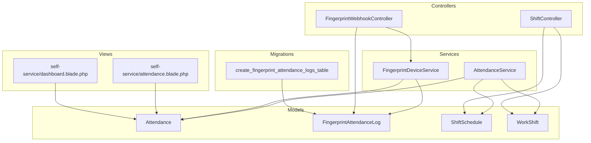

**Diagram sources**
- [Attendance.php:1-40](file://app/Models/Attendance.php#L1-L40)
- [FingerprintAttendanceLog.php:1-50](file://app/Models/FingerprintAttendanceLog.php#L1-L50)
- [ShiftSchedule.php:1-21](file://app/Models/ShiftSchedule.php#L1-L21)
- [WorkShift.php:1-53](file://app/Models/WorkShift.php#L1-L53)
- [AttendanceService.php:1-368](file://app/Services/AttendanceService.php#L1-L368)
- [FingerprintDeviceService.php:1-348](file://app/Services/FingerprintDeviceService.php#L1-L348)
- [FingerprintWebhookController.php:116-151](file://app/Http/Controllers/Api/FingerprintWebhookController.php#L116-L151)
- [ShiftController.php:259-311](file://app/Http/Controllers/ShiftController.php#L259-L311)
- [attendance.blade.php:44-169](file://resources/views/self-service/attendance.blade.php#L44-L169)
- [dashboard.blade.php:63-86](file://resources/views/self-service/dashboard.blade.php#L63-L86)
- [2026_04_04_000002_create_fingerprint_attendance_logs_table.php:1-28](file://database/migrations/2026_04_04_000002_create_fingerprint_attendance_logs_table.php#L1-L28)

**Section sources**
- [Attendance.php:1-40](file://app/Models/Attendance.php#L1-L40)
- [FingerprintAttendanceLog.php:1-50](file://app/Models/FingerprintAttendanceLog.php#L1-L50)
- [ShiftSchedule.php:1-21](file://app/Models/ShiftSchedule.php#L1-L21)
- [WorkShift.php:1-53](file://app/Models/WorkShift.php#L1-L53)
- [AttendanceService.php:1-368](file://app/Services/AttendanceService.php#L1-L368)
- [FingerprintDeviceService.php:1-348](file://app/Services/FingerprintDeviceService.php#L1-L348)
- [FingerprintWebhookController.php:116-151](file://app/Http/Controllers/Api/FingerprintWebhookController.php#L116-L151)
- [ShiftController.php:259-311](file://app/Http/Controllers/ShiftController.php#L259-L311)
- [attendance.blade.php:44-169](file://resources/views/self-service/attendance.blade.php#L44-L169)
- [dashboard.blade.php:63-86](file://resources/views/self-service/dashboard.blade.php#L63-L86)
- [2026_04_04_000002_create_fingerprint_attendance_logs_table.php:1-28](file://database/migrations/2026_04_04_000002_create_fingerprint_attendance_logs_table.php#L1-L28)

## Core Components
- Attendance model: Stores daily clock-in/clock-out, status, work minutes, overtime minutes, and links to employee and shift.
- FingerprintAttendanceLog model: Captures raw fingerprint scans, device association, and processing state.
- AttendanceService: Implements clock-in/out, shift-aware status determination, grace period handling, and overtime calculation.
- FingerprintDeviceService: Processes fingerprint logs, determines scan type, and converts logs to attendance records with timezone-aware processing.
- FingerprintWebhookController: Accepts device webhook events, persists logs, and triggers attendance processing.
- ShiftSchedule and WorkShift: Define shift definitions, working minutes, break minutes, midnight crossing, and overtime computation helpers.
- Self-service views: Render attendance history and dashboard summaries.

**Section sources**
- [Attendance.php:1-40](file://app/Models/Attendance.php#L1-L40)
- [FingerprintAttendanceLog.php:1-50](file://app/Models/FingerprintAttendanceLog.php#L1-L50)
- [AttendanceService.php:1-368](file://app/Services/AttendanceService.php#L1-L368)
- [FingerprintDeviceService.php:1-348](file://app/Services/FingerprintDeviceService.php#L1-L348)
- [FingerprintWebhookController.php:116-151](file://app/Http/Controllers/Api/FingerprintWebhookController.php#L116-L151)
- [ShiftSchedule.php:1-21](file://app/Models/ShiftSchedule.php#L1-L21)
- [WorkShift.php:1-53](file://app/Models/WorkShift.php#L1-L53)
- [attendance.blade.php:44-169](file://resources/views/self-service/attendance.blade.php#L44-L169)
- [dashboard.blade.php:63-86](file://resources/views/self-service/dashboard.blade.php#L63-L86)

## Architecture Overview
The system integrates multiple input sources (manual clock-in/out, fingerprint devices, and potentially mobile/location) into unified attendance records. Shift scheduling drives status and overtime calculations, while dashboards and tools provide analytics and compliance insights.

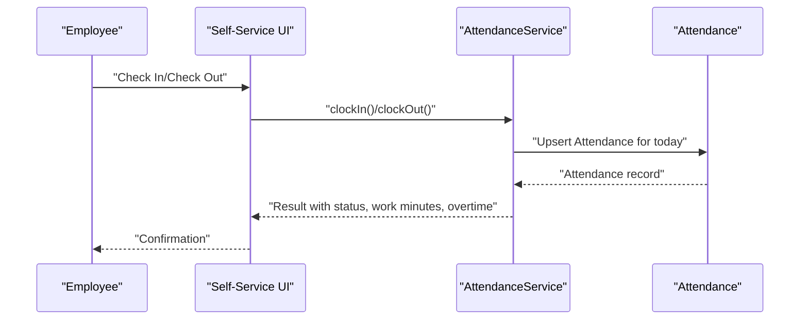

**Diagram sources**
- [AttendanceService.php:31-210](file://app/Services/AttendanceService.php#L31-L210)
- [Attendance.php:1-40](file://app/Models/Attendance.php#L1-L40)

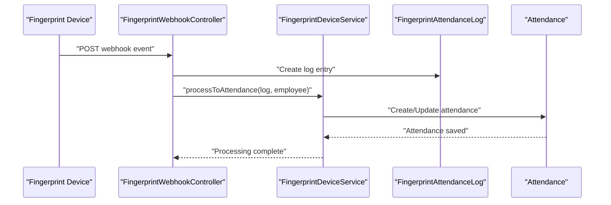

**Diagram sources**
- [FingerprintWebhookController.php:116-151](file://app/Http/Controllers/Api/FingerprintWebhookController.php#L116-L151)
- [FingerprintDeviceService.php:169-211](file://app/Services/FingerprintDeviceService.php#L169-L211)
- [FingerprintAttendanceLog.php:1-50](file://app/Models/FingerprintAttendanceLog.php#L1-L50)
- [Attendance.php:1-40](file://app/Models/Attendance.php#L1-L40)

## Detailed Component Analysis

### Attendance Model and Status Management
- Fields include tenant linkage, employee, shift, date, check-in/out timestamps, status, work minutes, overtime minutes, and notes.
- Status values include present, absent, late, leave, sick, aligning with HR policies.
- Overtime minutes are tracked and derived from shift definitions and actual check-out.

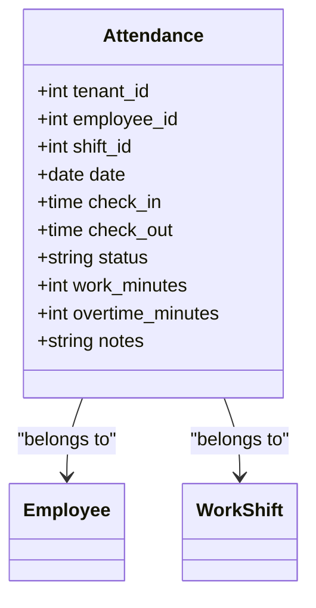

**Diagram sources**
- [Attendance.php:1-40](file://app/Models/Attendance.php#L1-L40)

**Section sources**
- [Attendance.php:1-40](file://app/Models/Attendance.php#L1-L40)

### AttendanceService: Clock-in/Clock-out and Overtime
- Timezone-aware operations: Uses tenant timezone for accurate comparisons.
- Shift-aware status: Determines present vs. late based on shift start time and configurable grace period.
- Overtime calculation: Computes positive difference between actual end and scheduled end.
- Idempotent operations: Prevents duplicate clock-ins/out for the same day.

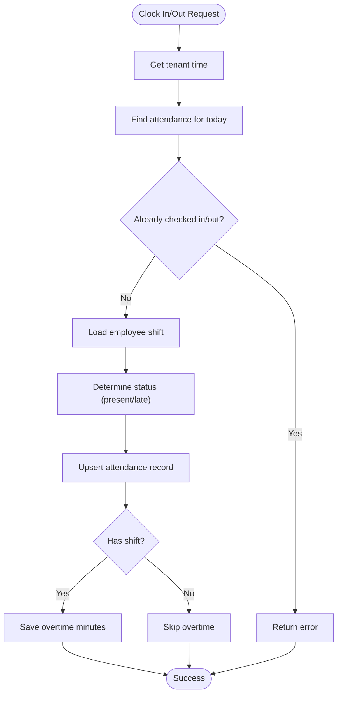

**Diagram sources**
- [AttendanceService.php:31-210](file://app/Services/AttendanceService.php#L31-L210)
- [WorkShift.php:41-51](file://app/Models/WorkShift.php#L41-L51)

**Section sources**
- [AttendanceService.php:31-210](file://app/Services/AttendanceService.php#L31-L210)
- [WorkShift.php:24-51](file://app/Models/WorkShift.php#L24-L51)

### Fingerprint Integration and Device Processing
- FingerprintWebhookController accepts device webhook events, validates scan type, persists logs, and triggers processing.
- FingerprintDeviceService:
  - Determines scan type (check-in/out/break) based on existing attendance.
  - Converts logs to attendance records with timezone-aware timestamps.
  - Supports device connection testing and registration/removal flows.

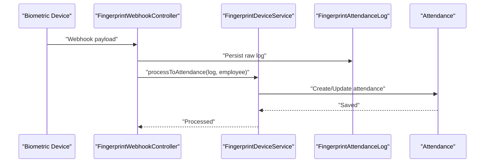

**Diagram sources**
- [FingerprintWebhookController.php:116-151](file://app/Http/Controllers/Api/FingerprintWebhookController.php#L116-L151)
- [FingerprintDeviceService.php:169-211](file://app/Services/FingerprintDeviceService.php#L169-L211)
- [FingerprintAttendanceLog.php:1-50](file://app/Models/FingerprintAttendanceLog.php#L1-L50)
- [Attendance.php:1-40](file://app/Models/Attendance.php#L1-L40)

**Section sources**
- [FingerprintWebhookController.php:116-151](file://app/Http/Controllers/Api/FingerprintWebhookController.php#L116-L151)
- [FingerprintDeviceService.php:169-211](file://app/Services/FingerprintDeviceService.php#L169-L211)
- [2026_04_04_000002_create_fingerprint_attendance_logs_table.php:13-28](file://database/migrations/2026_04_04_000002_create_fingerprint_attendance_logs_table.php#L13-L28)

### Shift Scheduling and Conflict Detection
- ShiftSchedule links employees to shifts per date; fallback to default employee shift.
- WorkShift defines shift boundaries, break minutes, and midnight crossing behavior.
- Conflict detection identifies double shifts, insufficient rest periods, and excessive weekly hours.

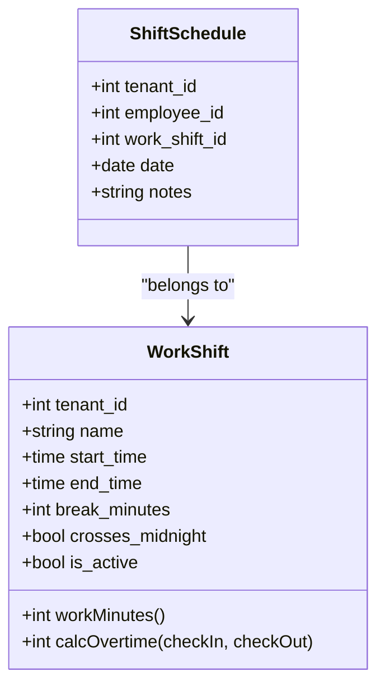

**Diagram sources**
- [ShiftSchedule.php:1-21](file://app/Models/ShiftSchedule.php#L1-L21)
- [WorkShift.php:1-53](file://app/Models/WorkShift.php#L1-L53)

**Section sources**
- [ShiftSchedule.php:1-21](file://app/Models/ShiftSchedule.php#L1-L21)
- [WorkShift.php:24-51](file://app/Models/WorkShift.php#L24-L51)
- [ShiftController.php:259-311](file://app/Http/Controllers/ShiftController.php#L259-L311)

### Attendance Monitoring and Dashboards
- Self-service dashboard displays current status, check-in/out times, and live clock.
- Attendance history view lists dates, check-in/out, durations, and status badges.
- DashboardTools aggregates attendance counts by status for reporting.

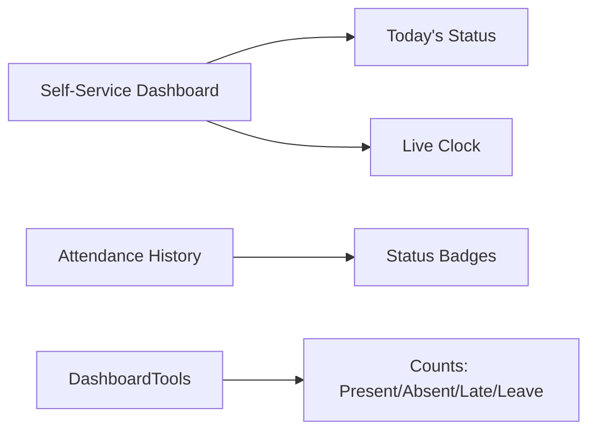

**Diagram sources**
- [dashboard.blade.php:63-86](file://resources/views/self-service/dashboard.blade.php#L63-L86)
- [attendance.blade.php:44-169](file://resources/views/self-service/attendance.blade.php#L44-L169)
- [DashboardTools.php:133-155](file://app/Services/ERP/DashboardTools.php#L133-L155)

**Section sources**
- [dashboard.blade.php:63-86](file://resources/views/self-service/dashboard.blade.php#L63-L86)
- [attendance.blade.php:44-169](file://resources/views/self-service/attendance.blade.php#L44-L169)
- [DashboardTools.php:133-155](file://app/Services/ERP/DashboardTools.php#L133-L155)

### Attendance Policy Configurations and Compliance
- AttendanceService uses configurable grace period and tenant timezone for status determination.
- Shift-based overtime ensures compliance with scheduled hours.
- Manual attendance recording via HR tools supports leave/sick/absent entries.

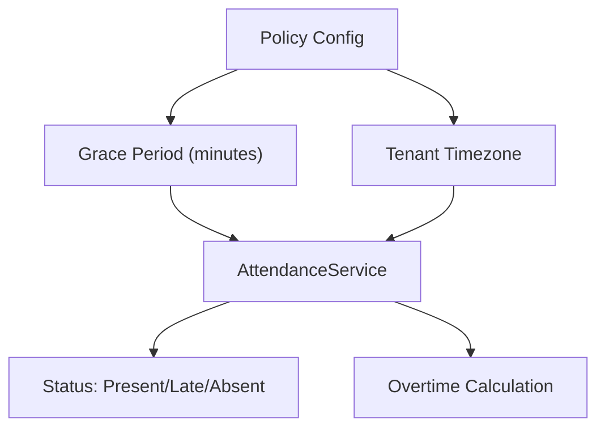

**Diagram sources**
- [AttendanceService.php:342-348](file://app/Services/AttendanceService.php#L342-L348)
- [AttendanceService.php:328-334](file://app/Services/AttendanceService.php#L328-L334)
- [WorkShift.php:41-51](file://app/Models/WorkShift.php#L41-L51)
- [HrmTools.php:84-121](file://app/Services/ERP/HrmTools.php#L84-L121)

**Section sources**
- [AttendanceService.php:328-348](file://app/Services/AttendanceService.php#L328-L348)
- [WorkShift.php:41-51](file://app/Models/WorkShift.php#L41-L51)
- [HrmTools.php:84-121](file://app/Services/ERP/HrmTools.php#L84-L121)

### Mobile Check-in and Location-Based Attendance
- User manual describes mobile check-in steps and automatic location capture when GPS is enabled.
- Self-service dashboard includes a live clock for real-time awareness.

**Section sources**
- [USER_MANUAL.md:349-364](file://docs/USER_MANUAL.md#L349-L364)
- [dashboard.blade.php:63-86](file://resources/views/self-service/dashboard.blade.php#L63-L86)

### Attendance Analytics and Reporting
- DashboardTools aggregates attendance counts by status for quick visibility.
- Analytics dashboard controller exposes endpoints for broader business analytics; attendance metrics can be integrated similarly.

**Section sources**
- [DashboardTools.php:133-155](file://app/Services/ERP/DashboardTools.php#L133-L155)
- [AnalyticsDashboardController.php:127-140](file://app/Http/Controllers/Analytics/AnalyticsDashboardController.php#L127-L140)

### Import/Export and Biometric Device Integration Examples
- Fingerprint logs migration defines the schema for storing raw device data and processing flags.
- FingerprintDeviceService simulates device connectivity and provides hooks for vendor-specific SDKs.
- FingerprintWebhookController demonstrates webhook payload ingestion and log persistence.

**Section sources**
- [2026_04_04_000002_create_fingerprint_attendance_logs_table.php:13-28](file://database/migrations/2026_04_04_000002_create_fingerprint_attendance_logs_table.php#L13-L28)
- [FingerprintDeviceService.php:17-44](file://app/Services/FingerprintDeviceService.php#L17-L44)
- [FingerprintWebhookController.php:116-151](file://app/Http/Controllers/Api/FingerprintWebhookController.php#L116-L151)

## Dependency Analysis
- AttendanceService depends on Employee, ShiftSchedule, and WorkShift to compute status and overtime.
- FingerprintDeviceService depends on Attendance and Employee to convert logs into attendance records.
- Controllers depend on services and models to orchestrate data flow.
- Views depend on Attendance records for rendering dashboards and histories.

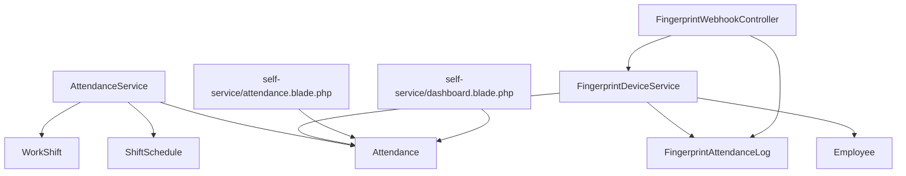

**Diagram sources**
- [AttendanceService.php:1-368](file://app/Services/AttendanceService.php#L1-L368)
- [FingerprintDeviceService.php:1-348](file://app/Services/FingerprintDeviceService.php#L1-L348)
- [FingerprintWebhookController.php:116-151](file://app/Http/Controllers/Api/FingerprintWebhookController.php#L116-L151)
- [Attendance.php:1-40](file://app/Models/Attendance.php#L1-L40)
- [FingerprintAttendanceLog.php:1-50](file://app/Models/FingerprintAttendanceLog.php#L1-L50)
- [ShiftSchedule.php:1-21](file://app/Models/ShiftSchedule.php#L1-L21)
- [WorkShift.php:1-53](file://app/Models/WorkShift.php#L1-L53)
- [attendance.blade.php:44-169](file://resources/views/self-service/attendance.blade.php#L44-L169)
- [dashboard.blade.php:63-86](file://resources/views/self-service/dashboard.blade.php#L63-L86)

**Section sources**
- [AttendanceService.php:1-368](file://app/Services/AttendanceService.php#L1-L368)
- [FingerprintDeviceService.php:1-348](file://app/Services/FingerprintDeviceService.php#L1-L348)
- [FingerprintWebhookController.php:116-151](file://app/Http/Controllers/Api/FingerprintWebhookController.php#L116-L151)
- [attendance.blade.php:44-169](file://resources/views/self-service/attendance.blade.php#L44-L169)
- [dashboard.blade.php:63-86](file://resources/views/self-service/dashboard.blade.php#L63-L86)

## Performance Considerations
- Timezone-aware processing avoids incorrect comparisons across regions.
- Grace period and shift-aware status reduce false positives for lateness.
- Indexes on fingerprint logs (tenant_id, scan_time) improve query performance for device syncs.
- Avoid redundant clock-in/out operations by checking existing records before upsert.

## Troubleshooting Guide
- Clock-in errors: Duplicate check-in attempts are rejected; ensure employees clock out before re-checking in.
- Clock-out errors: Employees must have a prior check-in; verify Attendance records for the day.
- Fingerprint logs not converting: Confirm employee UID mapping and device connection; review raw_data and error_message fields in logs.
- Overtime not recorded: Ensure shift is assigned and check-out time is after scheduled end.
- Dashboard counts: Use DashboardTools aggregation to verify status distribution.

**Section sources**
- [AttendanceService.php:44-50](file://app/Services/AttendanceService.php#L44-L50)
- [AttendanceService.php:131-145](file://app/Services/AttendanceService.php#L131-L145)
- [FingerprintDeviceService.php:169-211](file://app/Services/FingerprintDeviceService.php#L169-L211)
- [DashboardTools.php:133-155](file://app/Services/ERP/DashboardTools.php#L133-L155)

## Conclusion
The Attendance Tracking system provides robust, shift-aware time and attendance management with fingerprint integration, mobile check-in, and dashboard analytics. It supports configurable policies, accurate overtime tracking, and scalable processing of biometric logs. The modular design enables future enhancements such as location-based checks and advanced compliance reporting.

## Appendices

### Example Workflows

#### Clock-in Flow
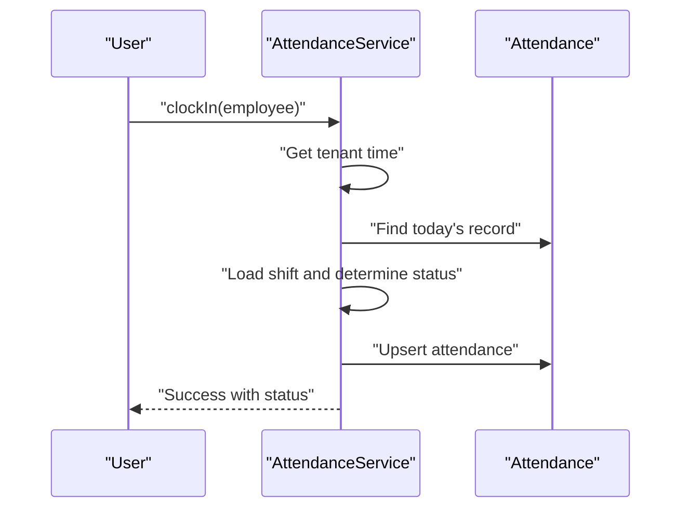

**Diagram sources**
- [AttendanceService.php:31-96](file://app/Services/AttendanceService.php#L31-L96)

#### Fingerprint Log Processing Flow
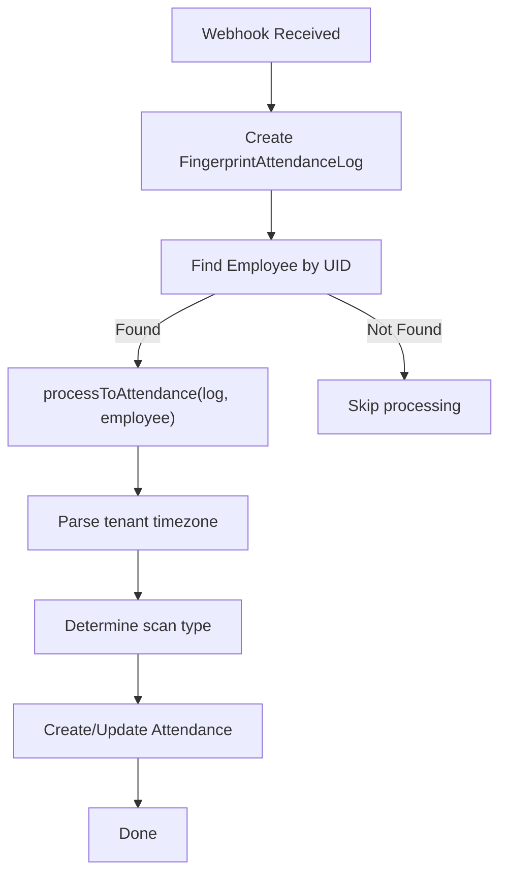

**Diagram sources**
- [FingerprintWebhookController.php:116-151](file://app/Http/Controllers/Api/FingerprintWebhookController.php#L116-L151)
- [FingerprintDeviceService.php:169-211](file://app/Services/FingerprintDeviceService.php#L169-L211)