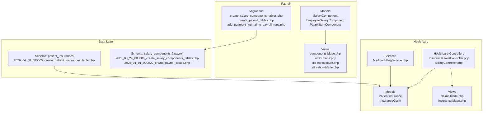
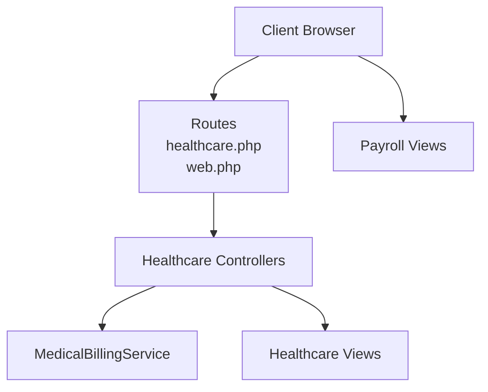
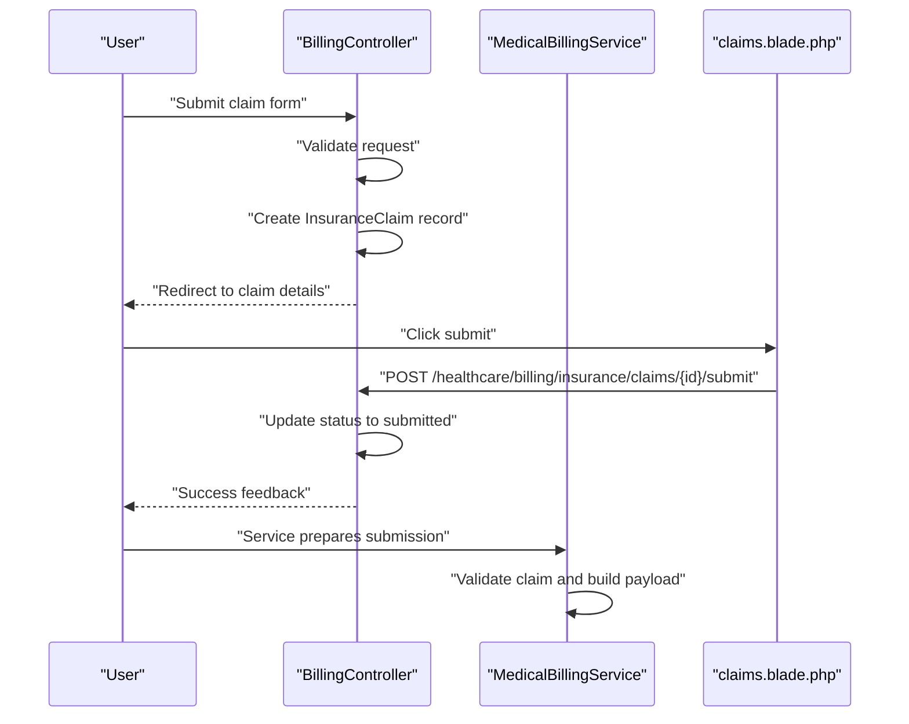
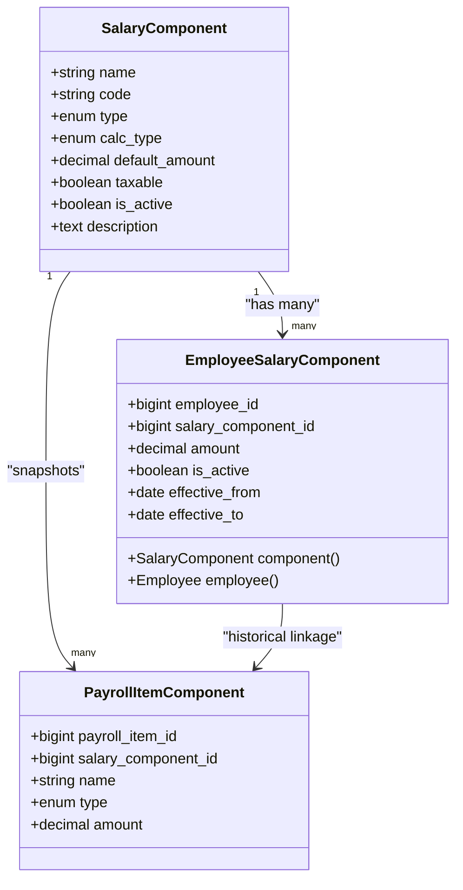
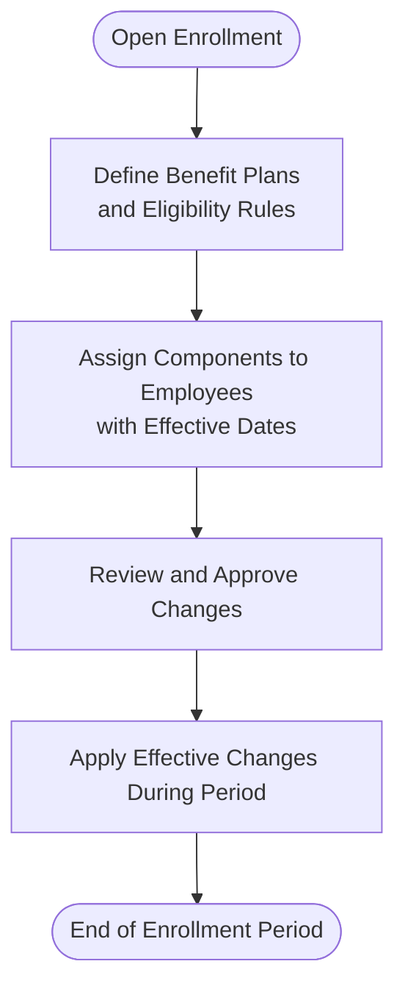
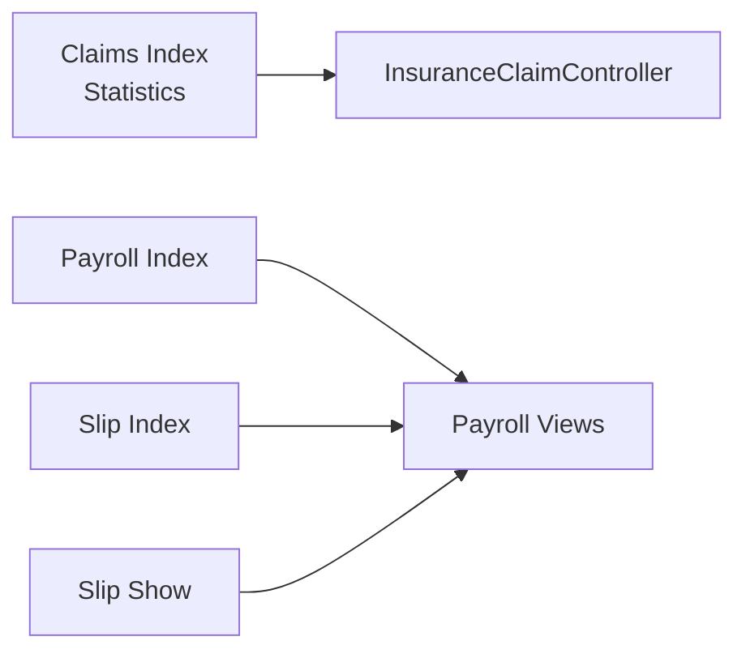
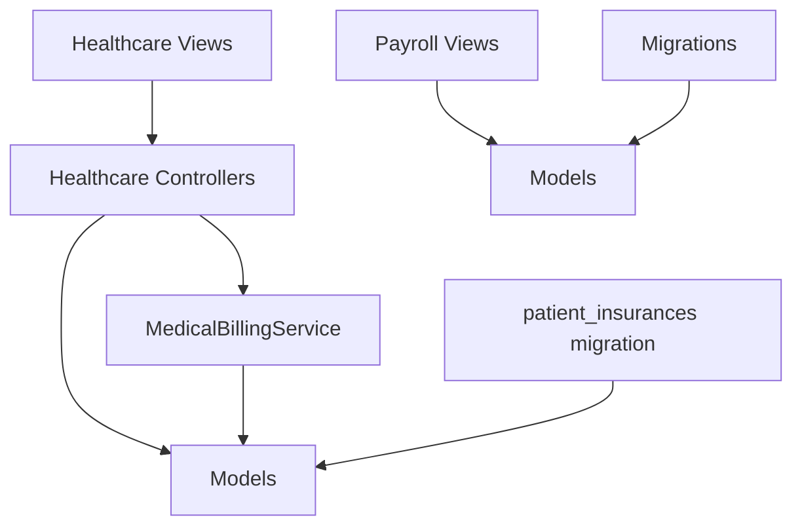
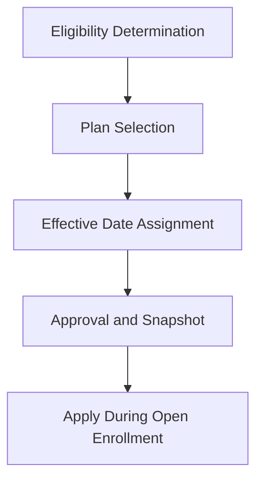
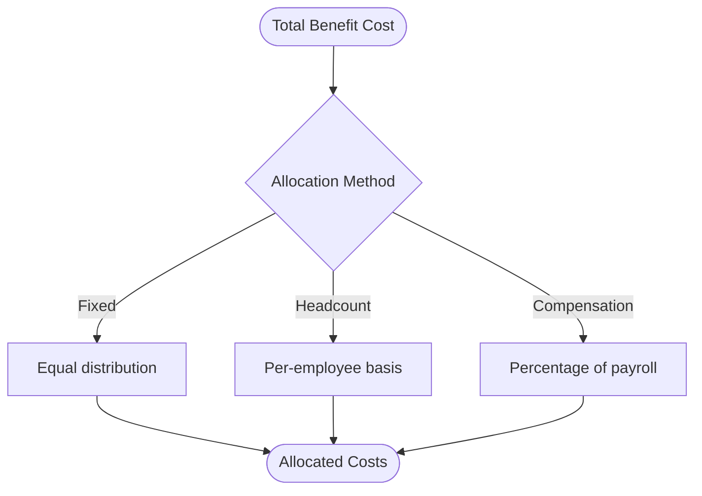

# Benefits Administration

<cite>
**Referenced Files in This Document**
- [README.md](file://README.md)
- [2026_04_08_000005_create_patient_insurances_table.php](file://database/migrations/2026_04_08_000005_create_patient_insurances_table.php)
- [2026_03_24_000006_create_salary_components_tables.php](file://database/migrations/2026_03_24_000006_create_salary_components_tables.php)
- [InsuranceClaimController.php](file://app/Http/Controllers/Healthcare/InsuranceClaimController.php)
- [BillingController.php](file://app/Http/Controllers/Healthcare/BillingController.php)
- [MedicalBillingService.php](file://app/Services/MedicalBillingService.php)
- [PayrollItemComponent.php](file://app/Models/PayrollItemComponent.php)
- [EmployeeSalaryComponent.php](file://app/Models/EmployeeSalaryComponent.php)
- [claims.blade.php](file://resources/views/healthcare/billing/insurance/claims.blade.php)
- [insurance.blade.php](file://resources/views/patients/insurance.blade.php)
- [components.blade.php](file://resources/views/payroll/components.blade.php)
- [index.blade.php](file://resources/views/payroll/index.blade.php)
- [slip-index.blade.php](file://resources/views/payroll/slip-index.blade.php)
- [slip-show.blade.php](file://resources/views/payroll/slip-show.blade.php)
- [2026_01_01_000020_create_payroll_tables.php](file://database/migrations/2026_01_01_000020_create_payroll_tables.php)
- [2026_03_25_073550_add_payment_journal_to_payroll_runs.php](file://database/migrations/2026_03_25_073550_add_payment_journal_to_payroll_runs.php)
- [2026_04_04_000003_add_fingerprint_fields_to_employees_table.php](file://database/migrations/2026_04_04_000003_add_fingerprint_fields_to_employees_table.php)
- [healthcare.php](file://routes/healthcare.php)
- [web.php](file://routes/web.php)
</cite>

## Table of Contents
1. [Introduction](#introduction)
2. [Project Structure](#project-structure)
3. [Core Components](#core-components)
4. [Architecture Overview](#architecture-overview)
5. [Detailed Component Analysis](#detailed-component-analysis)
6. [Dependency Analysis](#dependency-analysis)
7. [Performance Considerations](#performance-considerations)
8. [Troubleshooting Guide](#troubleshooting-guide)
9. [Conclusion](#conclusion)
10. [Appendices](#appendices)

## Introduction
This document describes the Benefits Administration capabilities present in the system with a focus on health insurance, payroll-related benefits (allowances/deductions), and employee benefits enrollment. The repository demonstrates:
- Health insurance coverage records and claims processing for patients
- Payroll components modeling (allowances and deductions) that underpin retirement and tax-related benefits
- Enrollment and assignment of salary components to employees
- Reporting and UI surfaces for claims and payroll components
- Supporting database schemas and routes

Where applicable, we map features to actual source files and provide diagrams that reflect real code relationships.

## Project Structure
The Benefits Administration domain spans several areas:
- Healthcare insurance and claims: models, controllers, services, and views
- Payroll components: master templates, employee assignments, and payroll snapshots
- Views and routes: UI surfaces for claims and payroll component management



**Diagram sources**
- [InsuranceClaimController.php:1-38](file://app/Http/Controllers/Healthcare/InsuranceClaimController.php#L1-L38)
- [BillingController.php:144-220](file://app/Http/Controllers/Healthcare/BillingController.php#L144-L220)
- [MedicalBillingService.php:439-479](file://app/Services/MedicalBillingService.php#L439-L479)
- [claims.blade.php:161-191](file://resources/views/healthcare/billing/insurance/claims.blade.php#L161-L191)
- [insurance.blade.php:53-143](file://resources/views/patients/insurance.blade.php#L53-L143)
- [2026_04_08_000005_create_patient_insurances_table.php:1-76](file://database/migrations/2026_04_08_000005_create_patient_insurances_table.php#L1-L76)
- [2026_03_24_000006_create_salary_components_tables.php:1-62](file://database/migrations/2026_03_24_000006_create_salary_components_tables.php#L1-L62)
- [2026_01_01_000020_create_payroll_tables.php](file://database/migrations/2026_01_01_000020_create_payroll_tables.php)
- [components.blade.php:221-247](file://resources/views/payroll/components.blade.php#L221-L247)
- [index.blade.php](file://resources/views/payroll/index.blade.php)
- [slip-index.blade.php](file://resources/views/payroll/slip-index.blade.php)
- [slip-show.blade.php](file://resources/views/payroll/slip-show.blade.php)

**Section sources**
- [README.md](file://README.md)

## Core Components
- Health insurance coverage records and claims:
  - Patient insurance schema captures provider, policy, coverage limits, deductibles, copays, validity dates, and employer/group info.
  - Claims lifecycle includes creation, submission, and statistics aggregation.
  - UI surfaces support listing, viewing, and submitting claims.
- Payroll components:
  - Master templates define component types (allowance/deduction), calculation modes (fixed/percent base), and taxability.
  - Employee-specific overrides and effective dates enable personalized benefit elections.
  - Payroll item snapshots preserve historical component amounts for reporting and audit trails.
- Enrollment and reporting:
  - Views expose component assignment modal and payroll listings/slips for transparency.

**Section sources**
- [2026_04_08_000005_create_patient_insurances_table.php:11-76](file://database/migrations/2026_04_08_000005_create_patient_insurances_table.php#L11-L76)
- [InsuranceClaimController.php:14-35](file://app/Http/Controllers/Healthcare/InsuranceClaimController.php#L14-L35)
- [BillingController.php:163-216](file://app/Http/Controllers/Healthcare/BillingController.php#L163-L216)
- [claims.blade.php:161-191](file://resources/views/healthcare/billing/insurance/claims.blade.php#L161-L191)
- [2026_03_24_000006_create_salary_components_tables.php:10-52](file://database/migrations/2026_03_24_000006_create_salary_components_tables.php#L10-L52)
- [EmployeeSalaryComponent.php:9-33](file://app/Models/EmployeeSalaryComponent.php#L9-L33)
- [PayrollItemComponent.php:7-19](file://app/Models/PayrollItemComponent.php#L7-L19)
- [components.blade.php:221-247](file://resources/views/payroll/components.blade.php#L221-L247)

## Architecture Overview
The Benefits Administration architecture integrates healthcare claims and payroll components:
- Controllers orchestrate requests and delegate to services for validation and preparation.
- Services encapsulate business rules for claim validation and submission data assembly.
- Models represent entities with appropriate relationships and casts.
- Views provide user interfaces for claims and component management.
- Migrations define schemas for persistent data.



**Diagram sources**
- [healthcare.php](file://routes/healthcare.php)
- [web.php](file://routes/web.php)
- [InsuranceClaimController.php:1-38](file://app/Http/Controllers/Healthcare/InsuranceClaimController.php#L1-L38)
- [BillingController.php:144-220](file://app/Http/Controllers/Healthcare/BillingController.php#L144-L220)
- [MedicalBillingService.php:439-479](file://app/Services/MedicalBillingService.php#L439-L479)
- [claims.blade.php:161-191](file://resources/views/healthcare/billing/insurance/claims.blade.php#L161-L191)
- [components.blade.php:221-247](file://resources/views/payroll/components.blade.php#L221-L247)

## Detailed Component Analysis

### Health Insurance Coverage Records
- Purpose: Maintain patient insurance metadata, coverage terms, validity, and claims history.
- Key schema fields:
  - Provider, policy/group/member identifiers
  - Plan name/class
  - Coverage limit, deductible, copay percentage
  - Covered/excluded services
  - Effective/expiry dates, primary/active flags
  - Employer/group admin contact info
  - Claims counters and amounts
  - Document paths for card and policy
- UI: Patient insurance view displays plan details and validity period.

```mermaid
erDiagram
PATIENT_INSURANCES {
bigint id PK
bigint patient_id FK
string insurance_provider
string insurance_type
string policy_number
string group_number
string member_id
string plan_name
string plan_class
decimal coverage_limit
decimal deductible
decimal copay_percentage
json covered_services
json excluded_services
date effective_date
date expiry_date
boolean is_active
boolean is_primary
string employer_name
string employer_contact
string group_admin_name
string group_admin_contact
integer total_claims
decimal total_claimed_amount
decimal total_approved_amount
date last_claim_date
string insurance_card_path
string policy_document_path
text notes
timestamps created_at, updated_at
}
```

**Diagram sources**
- [2026_04_08_000005_create_patient_insurances_table.php:13-65](file://database/migrations/2026_04_08_000005_create_patient_insurances_table.php#L13-L65)

**Section sources**
- [2026_04_08_000005_create_patient_insurances_table.php:11-76](file://database/migrations/2026_04_08_000005_create_patient_insurances_table.php#L11-L76)
- [insurance.blade.php:53-143](file://resources/views/patients/insurance.blade.php#L53-L143)

### Health Insurance Claims Processing
- Lifecycle:
  - Create claim with patient, bill, provider, policy number, claim amount, diagnosis/procedure codes, supporting documents, and notes.
  - Transition from draft to submitted with submission timestamp.
  - Statistics dashboard aggregates totals and statuses.
- Validation and submission:
  - Service validates required fields and positive billed amount.
  - Submission payload includes claim number, patient, policy/group numbers, service dates, diagnosis/procedure codes, billed and claim amounts.



**Diagram sources**
- [BillingController.php:163-216](file://app/Http/Controllers/Healthcare/BillingController.php#L163-L216)
- [claims.blade.php:177-189](file://resources/views/healthcare/billing/insurance/claims.blade.php#L177-L189)
- [MedicalBillingService.php:451-479](file://app/Services/MedicalBillingService.php#L451-L479)

**Section sources**
- [BillingController.php:144-220](file://app/Http/Controllers/Healthcare/BillingController.php#L144-L220)
- [InsuranceClaimController.php:14-35](file://app/Http/Controllers/Healthcare/InsuranceClaimController.php#L14-L35)
- [claims.blade.php:161-191](file://resources/views/healthcare/billing/insurance/claims.blade.php#L161-L191)
- [MedicalBillingService.php:439-479](file://app/Services/MedicalBillingService.php#L439-L479)

### Payroll Components (Allowances/Deductions)
- Master template:
  - Defines component name/code/type (allowance/deduction), calculation type (fixed/percent base), default amount, taxability, and activity flag.
- Employee assignment:
  - Overrides default amount, activation, and effective date range per employee.
- Payroll snapshot:
  - Captures component name/type/amount linked to a specific payroll item for audit trail.
- UI:
  - Components page supports adding/updating components and assigning to employees via modal.



**Diagram sources**
- [2026_03_24_000006_create_salary_components_tables.php:10-52](file://database/migrations/2026_03_24_000006_create_salary_components_tables.php#L10-L52)
- [EmployeeSalaryComponent.php:9-33](file://app/Models/EmployeeSalaryComponent.php#L9-L33)
- [PayrollItemComponent.php:7-19](file://app/Models/PayrollItemComponent.php#L7-L19)

**Section sources**
- [2026_03_24_000006_create_salary_components_tables.php:10-52](file://database/migrations/2026_03_24_000006_create_salary_components_tables.php#L10-L52)
- [EmployeeSalaryComponent.php:9-33](file://app/Models/EmployeeSalaryComponent.php#L9-L33)
- [PayrollItemComponent.php:7-19](file://app/Models/PayrollItemComponent.php#L7-L19)
- [components.blade.php:221-247](file://resources/views/payroll/components.blade.php#L221-L247)

### Benefits Enrollment and Changes
- Enrollment period:
  - Not modeled in code; enrollment windows are not represented in the schema or controllers.
- Open enrollment changes:
  - EmployeeSalaryComponent supports effective_from/effective_to to schedule changes.
- Cafeteria plans and flexible spending accounts:
  - Not modeled in code; no dedicated schema or controllers found for cafeteria/FSA.
- Wellness programs:
  - Not modeled in code; no dedicated schema or controllers found.



[No sources needed since this diagram shows conceptual workflow, not actual code structure]

**Section sources**
- [EmployeeSalaryComponent.php:17-22](file://app/Models/EmployeeSalaryComponent.php#L17-L22)

### Benefits Reporting and Compliance
- Claims reporting:
  - Claims index aggregates counts and amounts by status.
- Payroll reporting:
  - Payroll index and slip views provide listings and detail pages for pay slips.
- Compliance:
  - No explicit compliance checks or audit logs in the referenced files.



**Diagram sources**
- [InsuranceClaimController.php:24-32](file://app/Http/Controllers/Healthcare/InsuranceClaimController.php#L24-L32)
- [index.blade.php](file://resources/views/payroll/index.blade.php)
- [slip-index.blade.php](file://resources/views/payroll/slip-index.blade.php)
- [slip-show.blade.php](file://resources/views/payroll/slip-show.blade.php)

**Section sources**
- [InsuranceClaimController.php:14-35](file://app/Http/Controllers/Healthcare/InsuranceClaimController.php#L14-L35)
- [index.blade.php](file://resources/views/payroll/index.blade.php)
- [slip-index.blade.php](file://resources/views/payroll/slip-index.blade.php)
- [slip-show.blade.php](file://resources/views/payroll/slip-show.blade.php)

### Vendor Integrations
- Not modeled in code; no dedicated integration services or controllers found.

[No sources needed since this section doesn't analyze specific source files]

## Dependency Analysis
- Controllers depend on models and services for business logic.
- Services depend on models for validation and data preparation.
- Views depend on controllers for data and routes for actions.
- Migrations define schema dependencies for models.



**Diagram sources**
- [InsuranceClaimController.php:1-38](file://app/Http/Controllers/Healthcare/InsuranceClaimController.php#L1-L38)
- [BillingController.php:163-216](file://app/Http/Controllers/Healthcare/BillingController.php#L163-L216)
- [MedicalBillingService.php:451-479](file://app/Services/MedicalBillingService.php#L451-L479)
- [2026_04_08_000005_create_patient_insurances_table.php:13-65](file://database/migrations/2026_04_08_000005_create_patient_insurances_table.php#L13-L65)
- [2026_03_24_000006_create_salary_components_tables.php:10-52](file://database/migrations/2026_03_24_000006_create_salary_components_tables.php#L10-L52)

**Section sources**
- [2026_03_24_000006_create_salary_components_tables.php:10-52](file://database/migrations/2026_03_24_000006_create_salary_components_tables.php#L10-L52)
- [2026_04_08_000005_create_patient_insurances_table.php:13-65](file://database/migrations/2026_04_08_000005_create_patient_insurances_table.php#L13-L65)

## Performance Considerations
- Claims listing paginates results to reduce load.
- Indexed columns on insurance provider, policy number, and active flags improve lookup performance.
- Payroll item components are indexed by payroll item for efficient retrieval.

**Section sources**
- [InsuranceClaimController.php:22-32](file://app/Http/Controllers/Healthcare/InsuranceClaimController.php#L22-L32)
- [2026_04_08_000005_create_patient_insurances_table.php:60-65](file://database/migrations/2026_04_08_000005_create_patient_insurances_table.php#L60-L65)

## Troubleshooting Guide
- Claims submission errors:
  - Ensure policy number is present and billed amount is greater than zero.
- Claim status transitions:
  - Only draft claims can be submitted; verify current status before attempting submission.
- UI interactions:
  - Confirm CSRF token presence in AJAX submissions for claim actions.

**Section sources**
- [MedicalBillingService.php:451-460](file://app/Services/MedicalBillingService.php#L451-L460)
- [BillingController.php:204-216](file://app/Http/Controllers/Healthcare/BillingController.php#L204-L216)
- [claims.blade.php:177-189](file://resources/views/healthcare/billing/insurance/claims.blade.php#L177-L189)

## Conclusion
The repository provides a solid foundation for Benefits Administration with:
- Health insurance coverage and claims processing
- Payroll components modeling that supports allowance/deduction elections and historical tracking
- UI surfaces for claims and component management

Missing elements include:
- Cafeteria plans and flexible spending accounts
- Wellness program features
- Open enrollment scheduling and change workflows
- Vendor integrations and compliance audit logs

These gaps indicate opportunities to extend the schema and controllers to support comprehensive benefits administration.

## Appendices

### Appendix A: Example Workflows

- Benefits enrollment workflow (conceptual)


[No sources needed since this diagram shows conceptual workflow, not actual code structure]

- Cost allocation methods (conceptual)


[No sources needed since this diagram shows conceptual workflow, not actual code structure]