# Employee Management

<cite>
**Referenced Files in This Document**
- [Employee.php](file://app/Models/Employee.php)
- [EmployeeOnboarding.php](file://app/Models/EmployeeOnboarding.php)
- [EmployeeOnboardingTask.php](file://app/Models/EmployeeOnboardingTask.php)
- [EmployeeImport.php](file://app/Imports/EmployeeImport.php)
- [HrmApiController.php](file://app/Http/Controllers/Api/HrmApiController.php)
- [HrmTools.php](file://app/Services/ERP/HrmTools.php)
- [HrmController.php](file://app/Http/Controllers/HrmController.php)
- [EmployeeSelfServiceController.php](file://app/Http/Controllers/EmployeeSelfServiceController.php)
- [TenantDemoSeeder.php](file://database/seeders/TenantDemoSeeder.php)
- [2026_04_04_000003_add_fingerprint_fields_to_employees_table.php](file://database/migrations/2026_04_04_000003_add_fingerprint_fields_to_employees_table.php)
- [HrmReportExport.php](file://app/Exports/HrmReportExport.php)
- [PermissionService.php](file://app/Services/PermissionService.php)
</cite>

## Table of Contents
1. [Introduction](#introduction)
2. [Project Structure](#project-structure)
3. [Core Components](#core-components)
4. [Architecture Overview](#architecture-overview)
5. [Detailed Component Analysis](#detailed-component-analysis)
6. [Dependency Analysis](#dependency-analysis)
7. [Performance Considerations](#performance-considerations)
8. [Troubleshooting Guide](#troubleshooting-guide)
9. [Conclusion](#conclusion)
10. [Appendices](#appendices)

## Introduction
This document provides comprehensive documentation for Employee Management within the system. It covers employee record creation, updates, lifecycle management, ID generation, profile management, department assignments, status tracking, organizational structure, reporting relationships, search and filtering, onboarding and offboarding, data validation, audit trails, multi-tenant isolation, and examples of CRUD operations, bulk imports, and data exports. The goal is to enable both technical and non-technical users to understand how employee data is modeled, validated, stored, and accessed across the platform.

## Project Structure
Employee Management spans several layers:
- Models define the core entity and relationships (Employee, Onboarding, Tasks).
- Controllers expose both web and API endpoints for CRUD and HR operations.
- Services encapsulate HR tooling and AI-driven insights.
- Imports handle bulk ingestion of employee data.
- Exports support reporting and data retrieval.
- Migrations define schema evolution, including multi-tenant and fingerprint fields.
- Views provide self-service and HR dashboards.

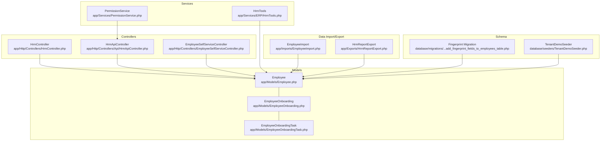

**Diagram sources**
- [Employee.php:13-99](file://app/Models/Employee.php#L13-L99)
- [EmployeeOnboarding.php:11-41](file://app/Models/EmployeeOnboarding.php#L11-L41)
- [EmployeeOnboardingTask.php:8-19](file://app/Models/EmployeeOnboardingTask.php#L8-L19)
- [HrmController.php:42-98](file://app/Http/Controllers/HrmController.php#L42-L98)
- [HrmApiController.php:18-39](file://app/Http/Controllers/Api/HrmApiController.php#L18-L39)
- [EmployeeSelfServiceController.php:25-84](file://app/Http/Controllers/EmployeeSelfServiceController.php#L25-L84)
- [HrmTools.php:9-127](file://app/Services/ERP/HrmTools.php#L9-L127)
- [EmployeeImport.php:17-84](file://app/Imports/EmployeeImport.php#L17-L84)
- [HrmReportExport.php](file://app/Exports/HrmReportExport.php)
- [2026_04_04_000003_add_fingerprint_fields_to_employees_table.php:11-29](file://database/migrations/2026_04_04_000003_add_fingerprint_fields_to_employees_table.php#L11-L29)
- [TenantDemoSeeder.php:566-584](file://database/seeders/TenantDemoSeeder.php#L566-L584)
- [PermissionService.php:43-43](file://app/Services/PermissionService.php#L43-L43)

**Section sources**
- [Employee.php:13-99](file://app/Models/Employee.php#L13-L99)
- [HrmController.php:42-98](file://app/Http/Controllers/HrmController.php#L42-L98)
- [HrmApiController.php:18-39](file://app/Http/Controllers/Api/HrmApiController.php#L18-L39)
- [EmployeeImport.php:17-84](file://app/Imports/EmployeeImport.php#L17-L84)
- [HrmTools.php:9-127](file://app/Services/ERP/HrmTools.php#L9-L127)
- [EmployeeSelfServiceController.php:25-84](file://app/Http/Controllers/EmployeeSelfServiceController.php#L25-L84)
- [2026_04_04_000003_add_fingerprint_fields_to_employees_table.php:11-29](file://database/migrations/2026_04_04_000003_add_fingerprint_fields_to_employees_table.php#L11-L29)
- [TenantDemoSeeder.php:566-584](file://database/seeders/TenantDemoSeeder.php#L566-L584)
- [PermissionService.php:43-43](file://app/Services/PermissionService.php#L43-L43)

## Core Components
- Employee model: central entity with tenant scoping, soft deletes, change audits, and relationships to attendance, leave, performance reviews, and payroll components.
- Onboarding and tasks: structured onboarding workflow with progress tracking and required/pending counts.
- Controllers: web and API endpoints for creating/updating employees, attendance, leave, payroll, and department queries.
- Services: HR tools for employee creation, attendance recording, summaries, and missing report tracking; permission service enabling HR module permissions.
- Imports: robust Excel-based import supporting deduplication by NIK, validation, and statistics.
- Self-service: employee portal for dashboard, profile updates, leave requests, attendance clock-in/out, payslips, and performance reviews.
- Schema: multi-tenant isolation via tenant_id, fingerprint fields for biometric integration, and demo seeding for initial data.

**Section sources**
- [Employee.php:13-99](file://app/Models/Employee.php#L13-L99)
- [EmployeeOnboarding.php:11-41](file://app/Models/EmployeeOnboarding.php#L11-L41)
- [EmployeeOnboardingTask.php:8-19](file://app/Models/EmployeeOnboardingTask.php#L8-L19)
- [HrmController.php:42-98](file://app/Http/Controllers/HrmController.php#L42-L98)
- [HrmApiController.php:56-100](file://app/Http/Controllers/Api/HrmApiController.php#L56-L100)
- [HrmTools.php:129-168](file://app/Services/ERP/HrmTools.php#L129-L168)
- [PermissionService.php:43-43](file://app/Services/PermissionService.php#L43-L43)
- [EmployeeImport.php:34-84](file://app/Imports/EmployeeImport.php#L34-L84)
- [EmployeeSelfServiceController.php:95-129](file://app/Http/Controllers/EmployeeSelfServiceController.php#L95-L129)

## Architecture Overview
The system enforces multi-tenant isolation at the model and controller levels. Employee records are scoped by tenant_id. Controllers validate tenant ownership and enforce permissions. Services encapsulate reusable HR operations. Imports/exports integrate with external systems and reporting.

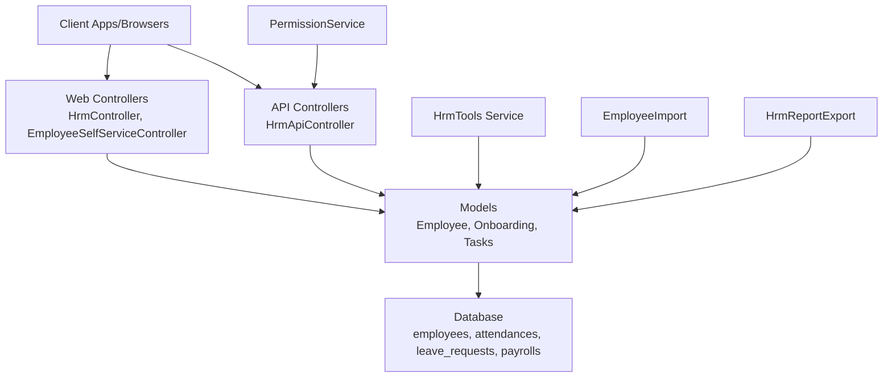

**Diagram sources**
- [HrmController.php:42-98](file://app/Http/Controllers/HrmController.php#L42-L98)
- [EmployeeSelfServiceController.php:25-84](file://app/Http/Controllers/EmployeeSelfServiceController.php#L25-L84)
- [HrmApiController.php:18-39](file://app/Http/Controllers/Api/HrmApiController.php#L18-L39)
- [HrmTools.php:9-127](file://app/Services/ERP/HrmTools.php#L9-L127)
- [EmployeeImport.php:17-84](file://app/Imports/EmployeeImport.php#L17-L84)
- [HrmReportExport.php](file://app/Exports/HrmReportExport.php)
- [PermissionService.php:43-43](file://app/Services/PermissionService.php#L43-L43)

## Detailed Component Analysis

### Employee Model and Lifecycle
- Tenant scoping and soft deletes ensure isolation and reversible removal.
- Change audits track modifications for compliance and tracing.
- Relationships include manager/subordinates, attendances, leave requests, performance reviews, and salary components.
- Remaining annual leave computation supports leave management.

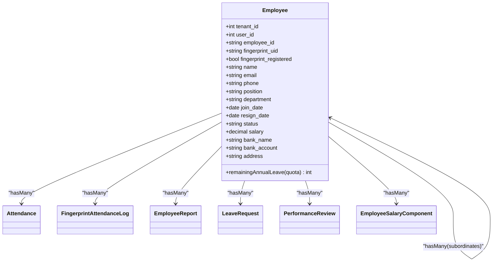

**Diagram sources**
- [Employee.php:13-99](file://app/Models/Employee.php#L13-L99)

**Section sources**
- [Employee.php:13-99](file://app/Models/Employee.php#L13-L99)

### Employee ID Generation and Profile Management
- ID generation pattern: EMP-YYYYMMDD-XXXX derived from current month and a sequential counter per tenant.
- Profile management includes personal info, contact details, and optional avatar updates.
- Self-service allows authenticated employees to update profile and manage leave/attendance.

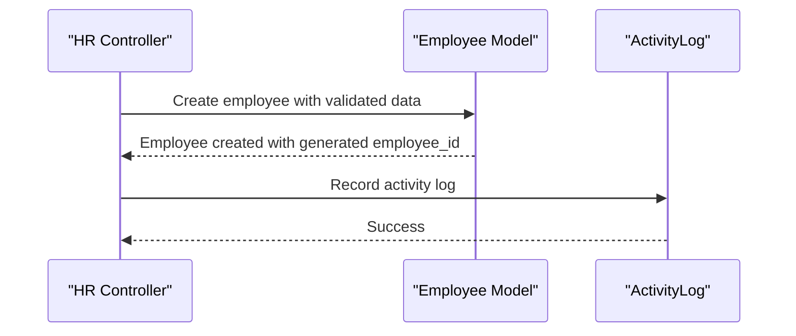

**Diagram sources**
- [HrmController.php:55-75](file://app/Http/Controllers/HrmController.php#L55-L75)

**Section sources**
- [HrmController.php:55-75](file://app/Http/Controllers/HrmController.php#L55-L75)
- [EmployeeSelfServiceController.php:95-129](file://app/Http/Controllers/EmployeeSelfServiceController.php#L95-L129)

### Department Assignments and Status Tracking
- Employees are associated with department and position via foreign keys.
- Status field supports active/inactive/resigned and extended statuses via API.
- Departments endpoint provides counts of employees per department.

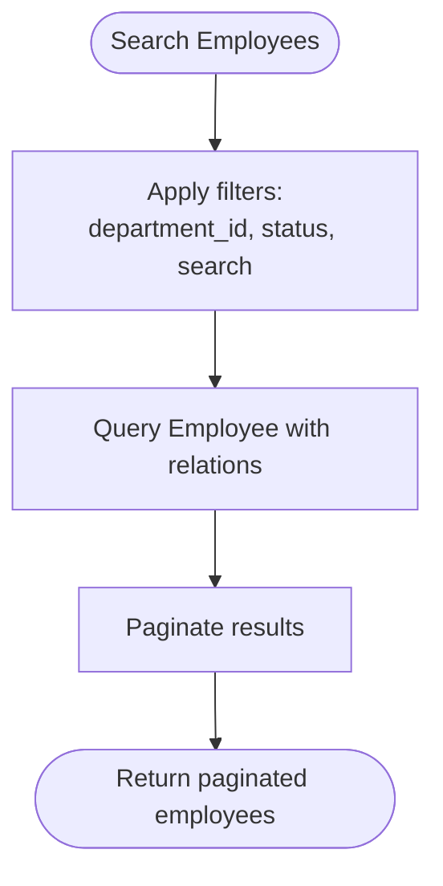

**Diagram sources**
- [HrmApiController.php:18-39](file://app/Http/Controllers/Api/HrmApiController.php#L18-L39)

**Section sources**
- [HrmApiController.php:18-39](file://app/Http/Controllers/Api/HrmApiController.php#L18-L39)

### Organizational Structure and Reporting Relationships
- Employee model defines self-referencing manager/subordinates relationships.
- Onboarding tracks progress and required tasks with due dates and completion flags.
- Reporting relationships enable visibility into team hierarchy and onboarding status.

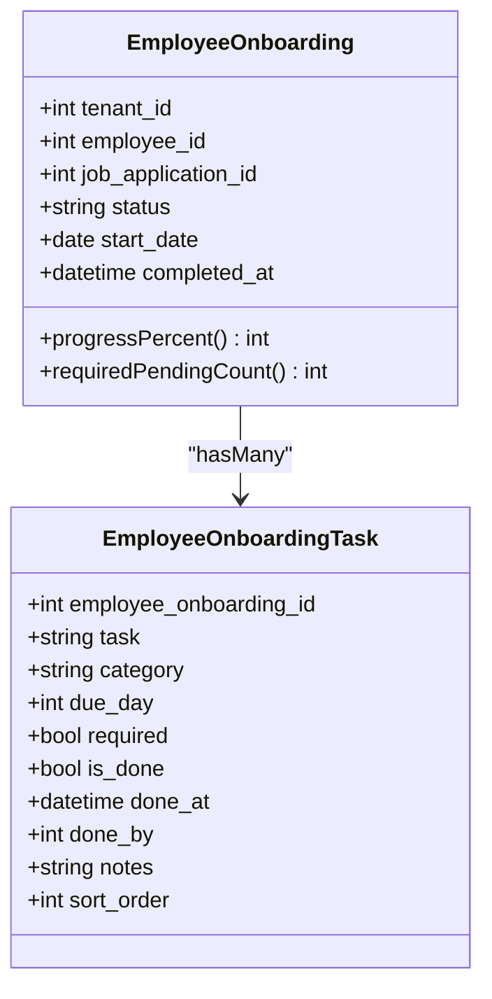

**Diagram sources**
- [EmployeeOnboarding.php:11-41](file://app/Models/EmployeeOnboarding.php#L11-L41)
- [EmployeeOnboardingTask.php:8-19](file://app/Models/EmployeeOnboardingTask.php#L8-L19)

**Section sources**
- [EmployeeOnboarding.php:11-41](file://app/Models/EmployeeOnboarding.php#L11-L41)
- [EmployeeOnboardingTask.php:8-19](file://app/Models/EmployeeOnboardingTask.php#L8-L19)

### Employee Search and Filtering
- API supports filtering by department, status, and free-text search across full_name and employee_code.
- Pagination controls page size for scalable retrieval.

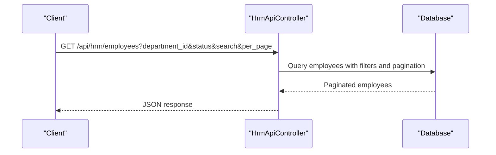

**Diagram sources**
- [HrmApiController.php:18-39](file://app/Http/Controllers/Api/HrmApiController.php#L18-L39)

**Section sources**
- [HrmApiController.php:18-39](file://app/Http/Controllers/Api/HrmApiController.php#L18-L39)

### Onboarding Processes
- Onboarding creation links a job application to an employee and seeds default tasks.
- Progress percentage and required pending tasks are computed for visibility.
- Start onboarding prevents duplicates and initializes tasks.

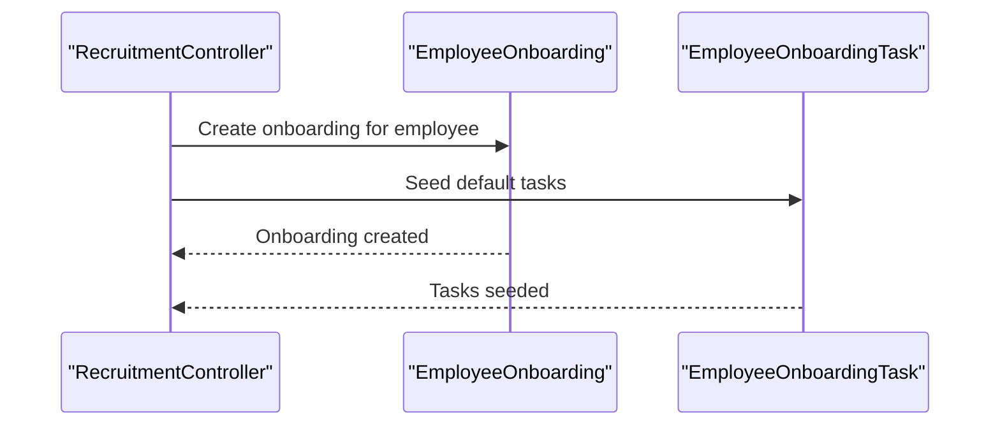

**Diagram sources**
- [HrmController.php:183-200](file://app/Http/Controllers/HrmController.php#L183-L200)
- [EmployeeOnboarding.php:29-40](file://app/Models/EmployeeOnboarding.php#L29-L40)
- [EmployeeOnboardingTask.php:10-13](file://app/Models/EmployeeOnboardingTask.php#L10-L13)

**Section sources**
- [HrmController.php:183-200](file://app/Http/Controllers/HrmController.php#L183-L200)
- [EmployeeOnboarding.php:29-40](file://app/Models/EmployeeOnboarding.php#L29-L40)
- [EmployeeOnboardingTask.php:10-13](file://app/Models/EmployeeOnboardingTask.php#L10-L13)

### Offboarding Procedures
- Employee status transitions to inactive or resigned via update endpoints.
- Self-service and HR controllers enforce tenant ownership and validation.
- Soft deletes and audits preserve historical context for compliance.

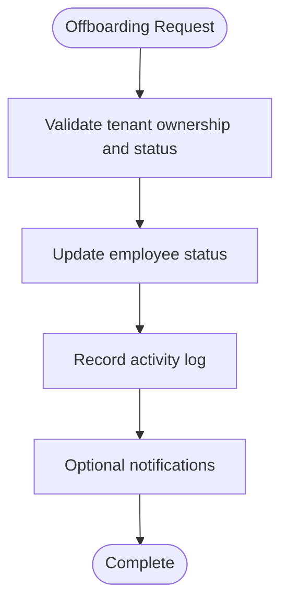

**Diagram sources**
- [HrmController.php:77-98](file://app/Http/Controllers/HrmController.php#L77-L98)

**Section sources**
- [HrmController.php:77-98](file://app/Http/Controllers/HrmController.php#L77-L98)
- [Employee.php:13-99](file://app/Models/Employee.php#L13-L99)

### Employee Data Validation and Multi-Tenant Isolation
- Controllers validate inputs and enforce tenant_id checks.
- Services and API controllers scope queries to tenant_id.
- Permission service grants HR module access rights.

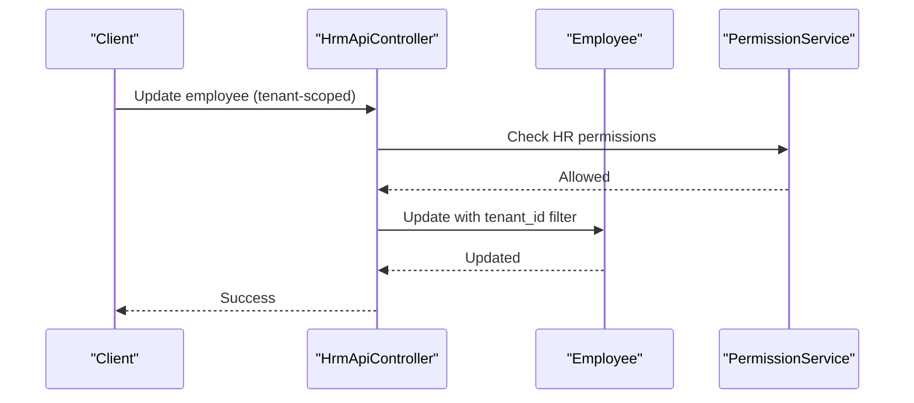

**Diagram sources**
- [HrmApiController.php:81-100](file://app/Http/Controllers/Api/HrmApiController.php#L81-L100)
- [PermissionService.php:43-43](file://app/Services/PermissionService.php#L43-L43)

**Section sources**
- [HrmApiController.php:81-100](file://app/Http/Controllers/Api/HrmApiController.php#L81-L100)
- [PermissionService.php:43-43](file://app/Services/PermissionService.php#L43-L43)

### Audit Trails and Compliance
- Employee model uses change audits to capture modifications.
- Activity logs record significant events like employee creation and updates.
- Self-service actions (profile updates, leave requests) trigger audit-friendly workflows.

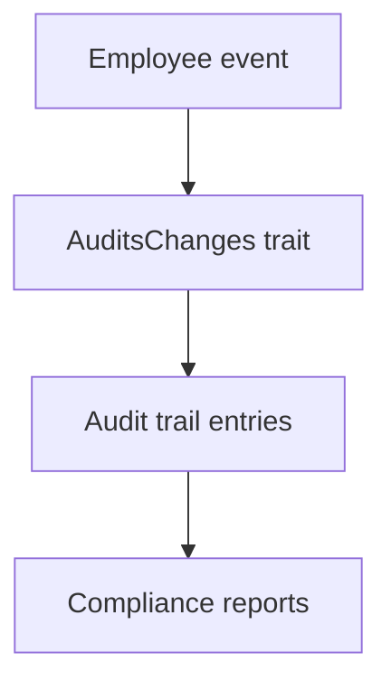

**Diagram sources**
- [Employee.php:15-16](file://app/Models/Employee.php#L15-L16)
- [HrmController.php:72-72](file://app/Http/Controllers/HrmController.php#L72-L72)

**Section sources**
- [Employee.php:15-16](file://app/Models/Employee.php#L15-L16)
- [HrmController.php:72-72](file://app/Http/Controllers/HrmController.php#L72-L72)

### Employee CRUD Operations
- Create: API and web controllers accept validated inputs and generate employee_id.
- Read: API supports listing and retrieving with relations; web provides dashboards.
- Update: Validates tenant ownership and updates attributes with audit logs.
- Delete: Soft deletes enabled via model trait.

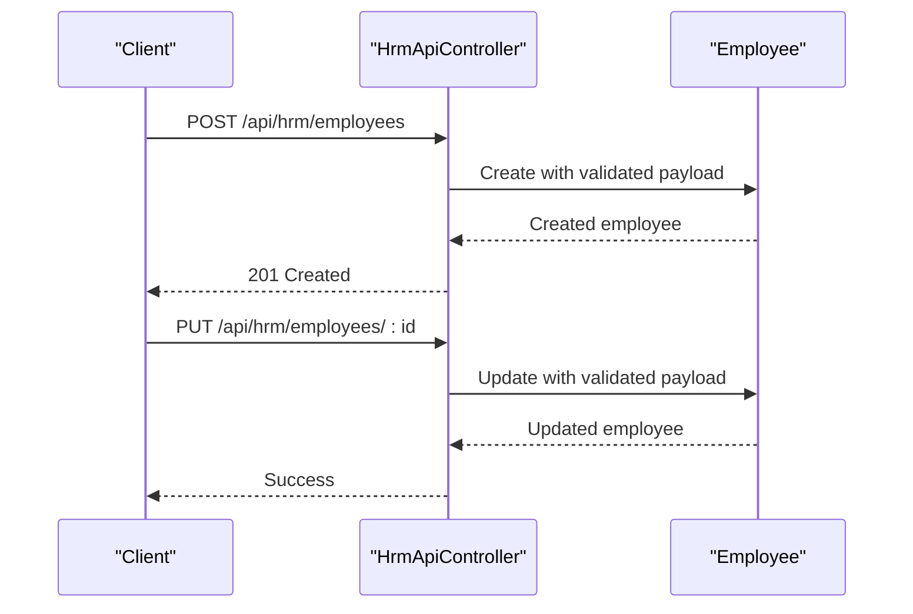

**Diagram sources**
- [HrmApiController.php:56-100](file://app/Http/Controllers/Api/HrmApiController.php#L56-L100)

**Section sources**
- [HrmApiController.php:56-100](file://app/Http/Controllers/Api/HrmApiController.php#L56-L100)
- [HrmController.php:42-98](file://app/Http/Controllers/HrmController.php#L42-L98)

### Bulk Imports and Data Exports
- EmployeeImport processes Excel sheets, normalizes fields, deduplicates by NIK, and captures errors.
- HrmReportExport supports HR analytics and reporting needs.

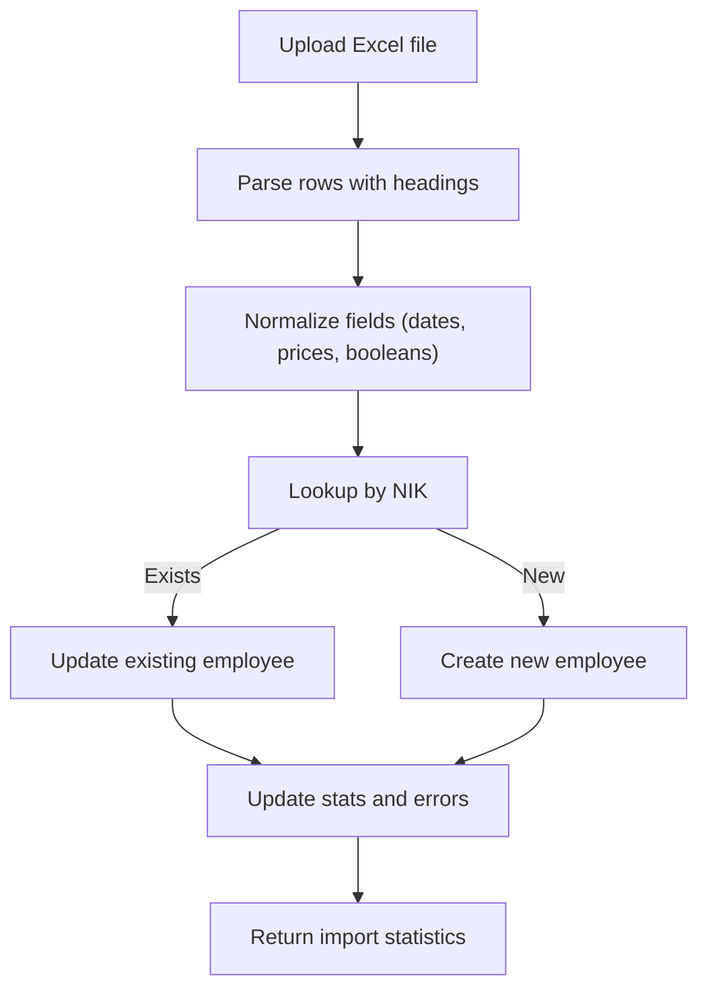

**Diagram sources**
- [EmployeeImport.php:34-84](file://app/Imports/EmployeeImport.php#L34-L84)

**Section sources**
- [EmployeeImport.php:34-84](file://app/Imports/EmployeeImport.php#L34-L84)
- [HrmReportExport.php](file://app/Exports/HrmReportExport.php)

### Employee Self-Service Portal
- Dashboard displays leave quota, attendance stats, payslips, pending overtime, and latest performance review.
- Profile update validates and updates user and employee records, including avatar handling.
- Leave request submission enforces balance checks and approval workflow.
- Attendance clock-in/out integrates with attendance service and timezone-aware logic.

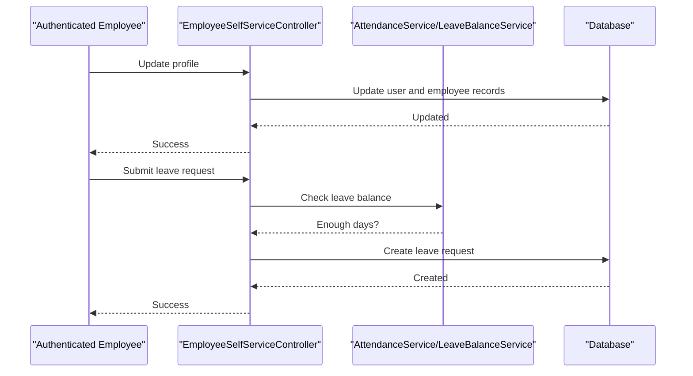

**Diagram sources**
- [EmployeeSelfServiceController.php:95-198](file://app/Http/Controllers/EmployeeSelfServiceController.php#L95-L198)

**Section sources**
- [EmployeeSelfServiceController.php:35-84](file://app/Http/Controllers/EmployeeSelfServiceController.php#L35-L84)
- [EmployeeSelfServiceController.php:95-198](file://app/Http/Controllers/EmployeeSelfServiceController.php#L95-L198)

### Biometric Integration (Fingerprint)
- Employees table extended with fingerprint_uid and fingerprint_registered fields.
- Index on tenant_id and fingerprint_uid supports efficient lookups.
- Views indicate registration status and provide management actions.

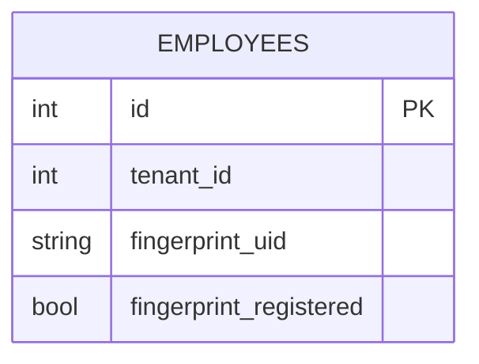

**Diagram sources**
- [2026_04_04_000003_add_fingerprint_fields_to_employees_table.php:13-18](file://database/migrations/2026_04_04_000003_add_fingerprint_fields_to_employees_table.php#L13-L18)

**Section sources**
- [2026_04_04_000003_add_fingerprint_fields_to_employees_table.php:11-29](file://database/migrations/2026_04_04_000003_add_fingerprint_fields_to_employees_table.php#L11-L29)

## Dependency Analysis
- Controllers depend on models and services for business logic.
- Services encapsulate HR operations and reduce controller complexity.
- Imports/exports depend on models and external libraries for parsing/formatting.
- Migrations evolve schema while maintaining tenant isolation and new capabilities.

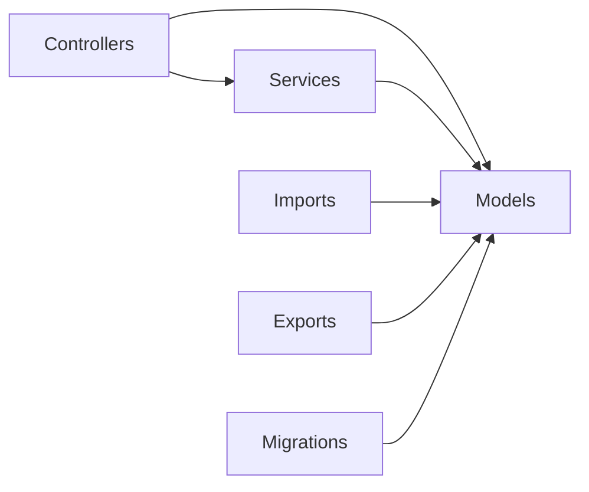

**Diagram sources**
- [HrmController.php:42-98](file://app/Http/Controllers/HrmController.php#L42-L98)
- [HrmApiController.php:18-39](file://app/Http/Controllers/Api/HrmApiController.php#L18-L39)
- [HrmTools.php:9-127](file://app/Services/ERP/HrmTools.php#L9-L127)
- [EmployeeImport.php:17-84](file://app/Imports/EmployeeImport.php#L17-L84)
- [HrmReportExport.php](file://app/Exports/HrmReportExport.php)
- [2026_04_04_000003_add_fingerprint_fields_to_employees_table.php:11-29](file://database/migrations/2026_04_04_000003_add_fingerprint_fields_to_employees_table.php#L11-L29)

**Section sources**
- [HrmController.php:42-98](file://app/Http/Controllers/HrmController.php#L42-L98)
- [HrmApiController.php:18-39](file://app/Http/Controllers/Api/HrmApiController.php#L18-L39)
- [HrmTools.php:9-127](file://app/Services/ERP/HrmTools.php#L9-L127)
- [EmployeeImport.php:17-84](file://app/Imports/EmployeeImport.php#L17-L84)
- [HrmReportExport.php](file://app/Exports/HrmReportExport.php)
- [2026_04_04_000003_add_fingerprint_fields_to_employees_table.php:11-29](file://database/migrations/2026_04_04_000003_add_fingerprint_fields_to_employees_table.php#L11-L29)

## Performance Considerations
- Use pagination for listing endpoints to avoid large result sets.
- Index tenant_id and frequently filtered columns (e.g., employee_id, department, status).
- Batch operations for imports and exports to minimize memory footprint.
- Cache frequently accessed metadata (e.g., departments) where appropriate.
- Monitor audit log growth and archive old entries periodically.

## Troubleshooting Guide
- Duplicate employee creation: Ensure uniqueness constraints and validation rules are enforced; use name similarity checks or NIK-based deduplication.
- Import errors: Inspect validation messages and error logs; normalize date/price formats and ensure required fields are present.
- Self-service access issues: Verify tenant association and user linking; confirm permissions for HR module.
- Attendance anomalies: Validate timezone handling and shift configurations; reconcile clock-in/out mismatches.
- Audit trail discrepancies: Confirm AuditsChanges trait usage and activity logging around sensitive updates.

**Section sources**
- [HrmTools.php:129-168](file://app/Services/ERP/HrmTools.php#L129-L168)
- [EmployeeImport.php:89-110](file://app/Imports/EmployeeImport.php#L89-L110)
- [EmployeeSelfServiceController.php:25-31](file://app/Http/Controllers/EmployeeSelfServiceController.php#L25-L31)
- [HrmApiController.php:134-149](file://app/Http/Controllers/Api/HrmApiController.php#L134-L149)

## Conclusion
Employee Management integrates robust modeling, tenant isolation, and comprehensive workflows spanning creation, updates, onboarding, self-service, and reporting. The modular design with controllers, services, imports, and exports enables scalability and maintainability while ensuring compliance through audits and validations.

## Appendices
- Example endpoints:
  - List employees: GET /api/hrm/employees
  - Create employee: POST /api/hrm/employees
  - Update employee: PUT /api/hrm/employees/:id
  - Attendance records: GET /api/hrm/attendance
  - Leave requests: GET /api/hrm/leave-requests
  - Departments: GET /api/hrm/departments
- Bulk import fields supported: employee_name, email, phone/mobile, nik, position/job_title, department/division, join_date/start_date, salary/base_salary, status/employment_status, address, emergency_contact/emergency_phone, bank_account/bank_number, bank_name, is_active/active.
- Self-service features: dashboard, profile update, leave requests, clock-in/clock-out, payslips, performance reviews.