# Human Resources Management (HRM)

<cite>
**Referenced Files in This Document**
- [HrmController.php](file://app/Http/Controllers/HrmController.php)
- [HrmApiController.php](file://app/Http/Controllers/Api/HrmApiController.php)
- [web.php](file://routes/web.php)
- [api.php](file://routes/api.php)
- [Employee.php](file://app/Models/Employee.php)
- [Attendance.php](file://app/Models/Attendance.php)
- [LeaveRequest.php](file://app/Models/LeaveRequest.php)
- [PayrollItem.php](file://app/Models/PayrollItem.php)
- [SalaryComponent.php](file://app/Models/SalaryComponent.php)
- [create_hrm_tables.php](file://database/migrations/2026_01_01_000004_create_hrm_tables.php)
- [create_payroll_tables.php](file://database/migrations/2026_01_01_000020_create_payroll_tables.php)
- [HrmAiService.php](file://app/Services/HrmAiService.php)
- [HrmTools.php](file://app/Services/ERP/HrmTools.php)
- [PayrollGlService.php](file://app/Services/PayrollGlService.php)
- [TaxCalculationService.php](file://app/Services/TaxCalculationService.php)
- [TaxService.php](file://app/Services/TaxService.php)
- [LeaveBalanceService.php](file://app/Services/LeaveBalanceService.php)
- [CheckInOutService.php](file://app/Services/CheckInOutService.php)
- [FingerprintDeviceService.php](file://app/Services/FingerprintDeviceService.php)
- [TrainingProgram.php](file://app/Models/TrainingProgram.php)
- [TrainingSession.php](file://app/Models/TrainingSession.php)
- [TrainingParticipant.php](file://app/Models/TrainingParticipant.php)
- [PerformanceReview.php](file://app/Models/PerformanceReview.php)
- [EmployeeSalaryComponent.php](file://app/Models/EmployeeSalaryComponent.php)
- [PayrollRun.php](file://app/Models/PayrollRun.php)
- [PayrollItemComponent.php](file://app/Models/PayrollItemComponent.php)
- [FingerprintAttendanceLog.php](file://app/Models/FingerprintAttendanceLog.php)
- [EarlyLateRequest.php](file://app/Models/EarlyLateRequest.php)
- [OvertimeRequest.php](file://app/Models/OvertimeRequest.php)
- [Department.php](file://app/Models/Department.php)
- [JobPosting.php](file://app/Models/JobPosting.php)
- [JobApplication.php](file://app/Models/JobApplication.php)
- [EmployeeOnboarding.php](file://app/Models/EmployeeOnboarding.php)
- [EmployeeOnboardingTask.php](file://app/Models/EmployeeOnboardingTask.php)
- [DisciplinaryLetter.php](file://app/Models/DisciplinaryLetter.php)
- [ShiftSchedule.php](file://app/Models/ShiftSchedule.php)
- [WorkShift.php](file://app/Models/WorkShift.php)
- [Timesheet.php](file://app/Models/Timesheet.php)
- [Payable.php](file://app/Models/Payable.php)
- [BankAccount.php](file://app/Models/BankAccount.php)
- [PayrollExport.php](file://app/Exports/PayrollExport.php)
- [HrmReportExport.php](file://app/Exports/HrmReportExport.php)
- [GenerateComplianceReport.php](file://app/Console/Commands/GenerateComplianceReport.php)
- [GenerateInsightsCommand.php](file://app/Console/Commands/GenerateInsightsCommand.php)
- [app.blade.php](file://resources/views/layouts/app.blade.php)
- [index.blade.php](file://resources/views/hrm/index.blade.php)
- [attendance.blade.php](file://resources/views/hrm/attendance.blade.php)
- [leave.blade.php](file://resources/views/hrm/leave.blade.php)
- [performance.blade.php](file://resources/views/hrm/performance.blade.php)
- [orgchart.blade.php](file://resources/views/hrm/orgchart.blade.php)
- [payroll_index.blade.php](file://resources/views/payroll/index.blade.php)
- [payroll_slip_index.blade.php](file://resources/views/payroll/slip-index.blade.php)
- [payroll_slip_show.blade.php](file://resources/views/payroll/slip-show.blade.php)
- [training_program.blade.php](file://resources/views/hrm/training-program.blade.php)
- [training_session.blade.php](file://resources/views/hrm/training-session.blade.php)
- [training_participant.blade.php](file://resources/views/hrm/training-participant.blade.php)
</cite>

## Table of Contents
1. [Introduction](#introduction)
2. [Project Structure](#project-structure)
3. [Core Components](#core-components)
4. [Architecture Overview](#architecture-overview)
5. [Detailed Component Analysis](#detailed-component-analysis)
6. [Dependency Analysis](#dependency-analysis)
7. [Performance Considerations](#performance-considerations)
8. [Troubleshooting Guide](#troubleshooting-guide)
9. [Conclusion](#conclusion)
10. [Appendices](#appendices)

## Introduction
This document describes the Human Resources Management (HRM) subsystem within the ERP, focusing on employee records, payroll processing, attendance tracking, recruitment, performance management, and benefits administration. It also documents payroll calculation engines, tax deductions, statutory contributions, compliance reporting, time and attendance systems, leave management, training programs, and organizational structure management. The content is derived from the repository’s controllers, models, migrations, services, routes, and views.

## Project Structure
The HRM functionality spans controllers, models, migrations, services, console commands, exports, and Blade views. Controllers manage user interactions for HR features, models define domain entities and relationships, migrations create persistent structures, services encapsulate business logic (including payroll and tax), routes expose APIs and web endpoints, and views render UI for HR operations.

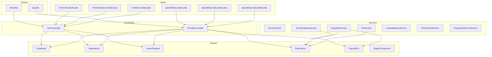

**Diagram sources**
- [HrmController.php:1-378](file://app/Http/Controllers/HrmController.php#L1-L378)
- [HrmApiController.php:1-47](file://app/Http/Controllers/Api/HrmApiController.php#L1-L47)
- [Employee.php:1-100](file://app/Models/Employee.php#L1-L100)
- [Attendance.php:1-40](file://app/Models/Attendance.php#L1-L40)
- [LeaveRequest.php:1-39](file://app/Models/LeaveRequest.php#L1-L39)
- [PayrollItem.php:1-26](file://app/Models/PayrollItem.php#L1-L26)
- [PayrollRun.php:1-200](file://app/Models/PayrollRun.php#L1-L200)
- [SalaryComponent.php:1-28](file://app/Models/SalaryComponent.php#L1-L28)
- [PayrollGlService.php](file://app/Services/PayrollGlService.php)
- [TaxCalculationService.php](file://app/Services/TaxCalculationService.php)
- [TaxService.php](file://app/Services/TaxService.php)
- [LeaveBalanceService.php](file://app/Services/LeaveBalanceService.php)
- [CheckInOutService.php](file://app/Services/CheckInOutService.php)
- [FingerprintDeviceService.php](file://app/Services/FingerprintDeviceService.php)
- [web.php:697-709](file://routes/web.php#L697-L709)
- [api.php:295-310](file://routes/api.php#L295-L310)
- [index.blade.php](file://resources/views/hrm/index.blade.php)
- [attendance.blade.php](file://resources/views/hrm/attendance.blade.php)
- [leave.blade.php](file://resources/views/hrm/leave.blade.php)
- [payroll_index.blade.php](file://resources/views/payroll/index.blade.php)
- [payroll_slip_index.blade.php](file://resources/views/payroll/slip-index.blade.php)
- [payroll_slip_show.blade.php](file://resources/views/payroll/slip-show.blade.php)

**Section sources**
- [HrmController.php:1-378](file://app/Http/Controllers/HrmController.php#L1-L378)
- [HrmApiController.php:1-47](file://app/Http/Controllers/Api/HrmApiController.php#L1-L47)
- [web.php:697-709](file://routes/web.php#L697-L709)
- [api.php:295-310](file://routes/api.php#L295-L310)

## Core Components
- Employee Records: CRUD and status management, profile attributes, and relationships to attendance, leave, performance reviews, and salary components.
- Attendance Tracking: Daily check-in/out, status tracking, and fingerprint/log integration.
- Leave Management: Request lifecycle (pending/approved/rejected), leave types, and annual leave balance computation.
- Performance Reviews: Periodic evaluations with scoring and recommendations.
- Payroll Processing: Payroll runs, items, components, tax calculations, statutory deductions, and GL posting.
- Recruitment: Job postings, applications, and onboarding workflows.
- Training Programs: Program creation, sessions, and participant tracking.
- Organizational Structure: Reporting hierarchy and manager updates.
- Compliance and Insights: Reports, exports, and console commands for compliance and analytics.

**Section sources**
- [Employee.php:1-100](file://app/Models/Employee.php#L1-L100)
- [Attendance.php:1-40](file://app/Models/Attendance.php#L1-L40)
- [LeaveRequest.php:1-39](file://app/Models/LeaveRequest.php#L1-L39)
- [PayrollItem.php:1-26](file://app/Models/PayrollItem.php#L1-L26)
- [PayrollRun.php:1-200](file://app/Models/PayrollRun.php#L1-L200)
- [SalaryComponent.php:1-28](file://app/Models/SalaryComponent.php#L1-L28)
- [HrmController.php:19-378](file://app/Http/Controllers/HrmController.php#L19-L378)
- [HrmApiController.php:1-47](file://app/Http/Controllers/Api/HrmApiController.php#L1-L47)

## Architecture Overview
The HRM subsystem follows MVC with service-layer orchestration for complex workflows. Controllers coordinate requests, models represent domain entities, services encapsulate business rules, and routes expose both web and API endpoints. Views render UI for HR operations.

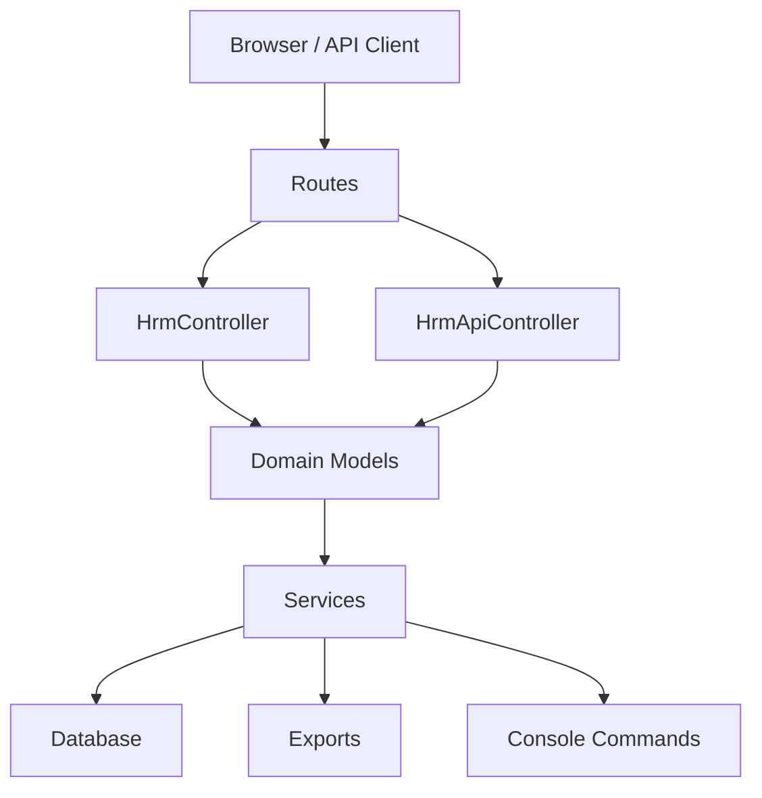

**Diagram sources**
- [web.php:697-709](file://routes/web.php#L697-L709)
- [api.php:295-310](file://routes/api.php#L295-L310)
- [HrmController.php:1-378](file://app/Http/Controllers/HrmController.php#L1-L378)
- [HrmApiController.php:1-47](file://app/Http/Controllers/Api/HrmApiController.php#L1-L47)
- [Employee.php:1-100](file://app/Models/Employee.php#L1-L100)
- [PayrollGlService.php](file://app/Services/PayrollGlService.php)
- [PayrollExport.php](file://app/Exports/PayrollExport.php)
- [GenerateComplianceReport.php](file://app/Console/Commands/GenerateComplianceReport.php)

## Detailed Component Analysis

### Employee Records
- Responsibilities: Create, update, deactivate/resign employees; maintain personal and employment details; compute remaining annual leave.
- Key relationships: Manager/subordinates, attendances, leave requests, performance reviews, salary components.
- Validation and tenant scoping are enforced via controller validation and model traits.

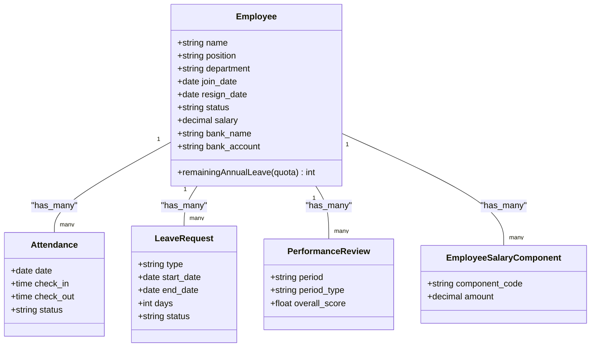

**Diagram sources**
- [Employee.php:1-100](file://app/Models/Employee.php#L1-L100)
- [Attendance.php:1-40](file://app/Models/Attendance.php#L1-L40)
- [LeaveRequest.php:1-39](file://app/Models/LeaveRequest.php#L1-L39)
- [PerformanceReview.php:1-200](file://app/Models/PerformanceReview.php#L1-L200)
- [EmployeeSalaryComponent.php:1-200](file://app/Models/EmployeeSalaryComponent.php#L1-L200)

**Section sources**
- [HrmController.php:19-106](file://app/Http/Controllers/HrmController.php#L19-L106)
- [Employee.php:89-98](file://app/Models/Employee.php#L89-L98)

### Attendance Tracking
- Features: Daily attendance capture with statuses (present, absent, late, leave, holiday), summary statistics, and fingerprint/log integration.
- Workflows: Bulk attendance recording per day; daily summaries by status.

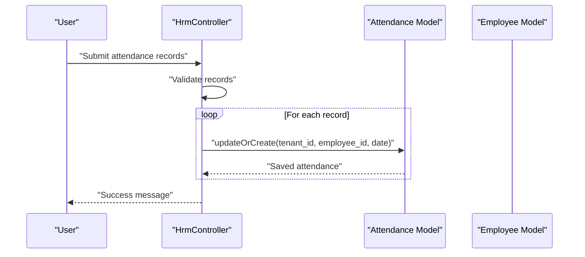

**Diagram sources**
- [HrmController.php:128-152](file://app/Http/Controllers/HrmController.php#L128-L152)
- [Attendance.php:1-40](file://app/Models/Attendance.php#L1-L40)
- [Employee.php:1-100](file://app/Models/Employee.php#L1-L100)

**Section sources**
- [HrmController.php:108-152](file://app/Http/Controllers/HrmController.php#L108-L152)
- [CheckInOutService.php](file://app/Services/CheckInOutService.php)
- [FingerprintDeviceService.php](file://app/Services/FingerprintDeviceService.php)
- [FingerprintAttendanceLog.php:1-200](file://app/Models/FingerprintAttendanceLog.php#L1-L200)

### Leave Management
- Features: Request types (annual, sick, maternity, paternity, unpaid, other), approval workflow, rejection reasons, and annual leave balance computation.
- Calculation: Working days between dates computed for leave requests.

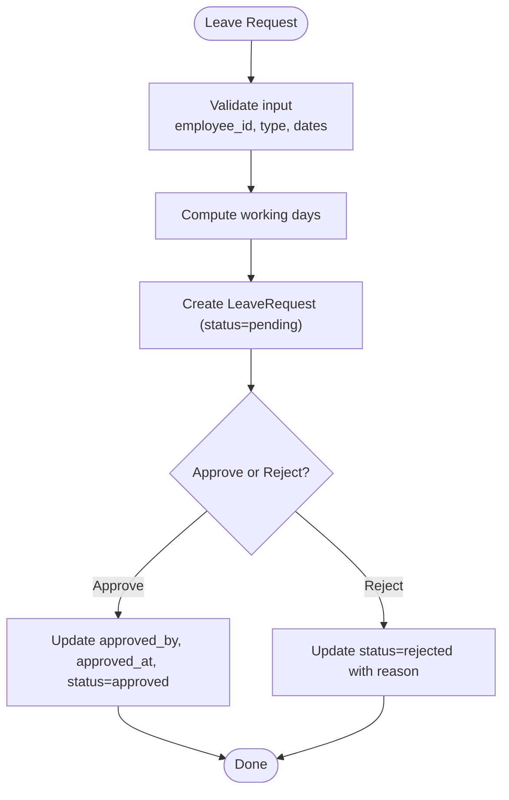

**Diagram sources**
- [HrmController.php:185-248](file://app/Http/Controllers/HrmController.php#L185-L248)
- [LeaveRequest.php:1-39](file://app/Models/LeaveRequest.php#L1-L39)
- [LeaveBalanceService.php](file://app/Services/LeaveBalanceService.php)

**Section sources**
- [HrmController.php:156-248](file://app/Http/Controllers/HrmController.php#L156-L248)
- [LeaveRequest.php:27-37](file://app/Models/LeaveRequest.php#L27-L37)
- [LeaveBalanceService.php](file://app/Services/LeaveBalanceService.php)

### Performance Management
- Features: Periodic reviews (monthly, quarterly, annual), scoring rubrics, overall score computation, acknowledgment, and deletion.
- Data: Scores for work quality, productivity, teamwork, initiative, attendance; strengths/improvements/goals; recommendation outcomes.

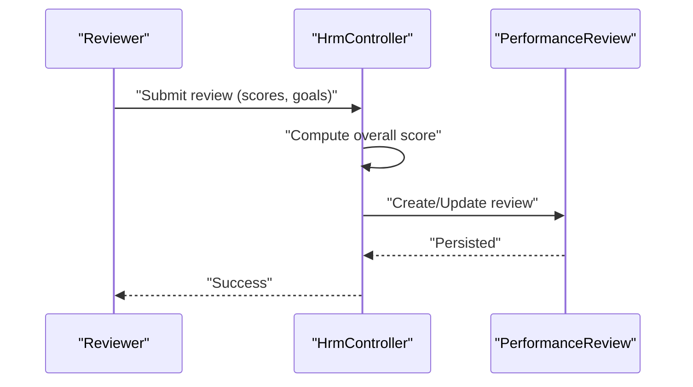

**Diagram sources**
- [HrmController.php:273-319](file://app/Http/Controllers/HrmController.php#L273-L319)
- [PerformanceReview.php:1-200](file://app/Models/PerformanceReview.php#L1-L200)

**Section sources**
- [HrmController.php:252-333](file://app/Http/Controllers/HrmController.php#L252-L333)
- [PerformanceReview.php:1-200](file://app/Models/PerformanceReview.php#L1-L200)

### Payroll Processing
- Entities: PayrollRun (period, status, totals), PayrollItem (employee-level earnings/deductions), PayrollItemComponent (line-item components).
- Calculation pipeline: Base salary, allowances, overtime, absence/lateness deductions, gross, taxes (PPH 21), statutory contributions (e.g., BPJS), net pay.
- Integration: GL posting via PayrollGlService; tax computations via TaxCalculationService and TaxService; export via PayrollExport.

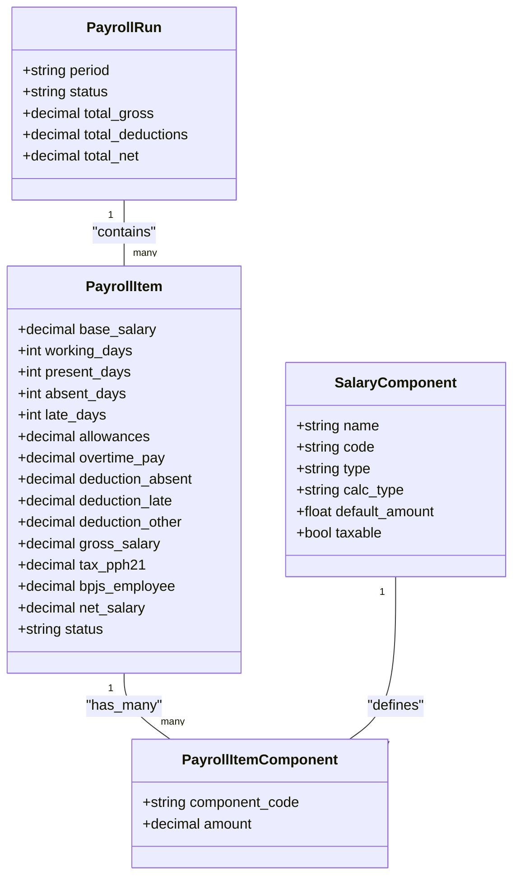

**Diagram sources**
- [PayrollRun.php:1-200](file://app/Models/PayrollRun.php#L1-L200)
- [PayrollItem.php:1-26](file://app/Models/PayrollItem.php#L1-L26)
- [PayrollItemComponent.php:1-200](file://app/Models/PayrollItemComponent.php#L1-L200)
- [SalaryComponent.php:1-28](file://app/Models/SalaryComponent.php#L1-L28)
- [PayrollGlService.php](file://app/Services/PayrollGlService.php)
- [TaxCalculationService.php](file://app/Services/TaxCalculationService.php)
- [TaxService.php](file://app/Services/TaxService.php)
- [PayrollExport.php](file://app/Exports/PayrollExport.php)

**Section sources**
- [create_payroll_tables.php:10-47](file://database/migrations/2026_01_01_000020_create_payroll_tables.php#L10-L47)
- [PayrollItem.php:12-24](file://app/Models/PayrollItem.php#L12-L24)
- [PayrollGlService.php](file://app/Services/PayrollGlService.php)
- [TaxCalculationService.php](file://app/Services/TaxCalculationService.php)
- [TaxService.php](file://app/Services/TaxService.php)
- [PayrollExport.php](file://app/Exports/PayrollExport.php)

### Recruitment and Onboarding
- Job Posting and Applications: Manage job vacancies and candidate applications.
- Onboarding: Employee onboarding tasks and tracking.
- UI navigation is exposed under “Recruitment” and “HRM” menus.

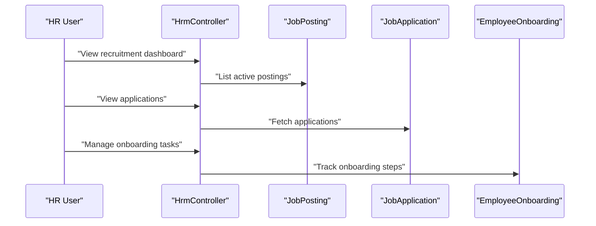

**Diagram sources**
- [web.php:708-709](file://routes/web.php#L708-L709)
- [JobPosting.php:1-200](file://app/Models/JobPosting.php#L1-L200)
- [JobApplication.php:1-200](file://app/Models/JobApplication.php#L1-L200)
- [EmployeeOnboarding.php:1-200](file://app/Models/EmployeeOnboarding.php#L1-L200)
- [EmployeeOnboardingTask.php:1-200](file://app/Models/EmployeeOnboardingTask.php#L1-L200)
- [app.blade.php:1573-1591](file://resources/views/layouts/app.blade.php#L1573-L1591)

**Section sources**
- [web.php:708-709](file://routes/web.php#L708-L709)
- [app.blade.php:1573-1591](file://resources/views/layouts/app.blade.php#L1573-L1591)

### Training Programs
- Features: Create training programs, schedule sessions, enroll participants, and track completion.
- Models: TrainingProgram, TrainingSession, TrainingParticipant.

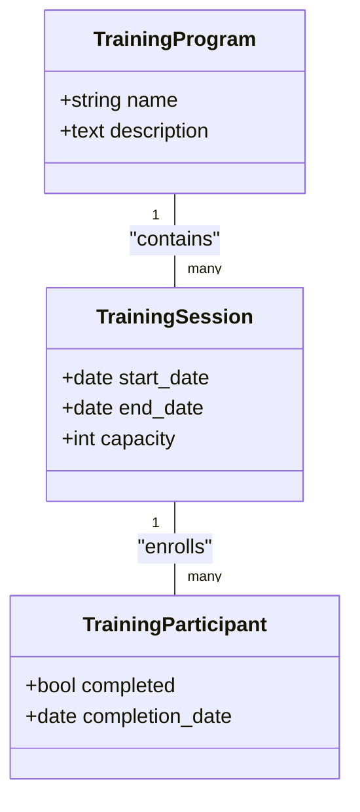

**Diagram sources**
- [TrainingProgram.php:1-200](file://app/Models/TrainingProgram.php#L1-L200)
- [TrainingSession.php:1-200](file://app/Models/TrainingSession.php#L1-L200)
- [TrainingParticipant.php:1-200](file://app/Models/TrainingParticipant.php#L1-L200)

**Section sources**
- [TrainingProgram.php:1-200](file://app/Models/TrainingProgram.php#L1-L200)
- [TrainingSession.php:1-200](file://app/Models/TrainingSession.php#L1-L200)
- [TrainingParticipant.php:1-200](file://app/Models/TrainingParticipant.php#L1-L200)

### Organizational Structure Management
- Features: View organizational chart, update manager assignments, prevent circular reporting.
- Data: Employee manager relationship modeled via self-referencing foreign key.

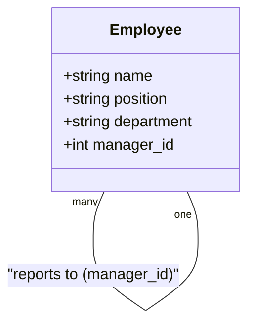

**Diagram sources**
- [Employee.php:56-62](file://app/Models/Employee.php#L56-L62)
- [HrmController.php:337-376](file://app/Http/Controllers/HrmController.php#L337-L376)

**Section sources**
- [HrmController.php:335-376](file://app/Http/Controllers/HrmController.php#L335-L376)
- [Employee.php:56-62](file://app/Models/Employee.php#L56-L62)

### Benefits Administration
- Components: SalaryComponent defines configurable components (allowances, deductions) with taxability and calculation type.
- Assignment: EmployeeSalaryComponent links employees to specific components with amounts.

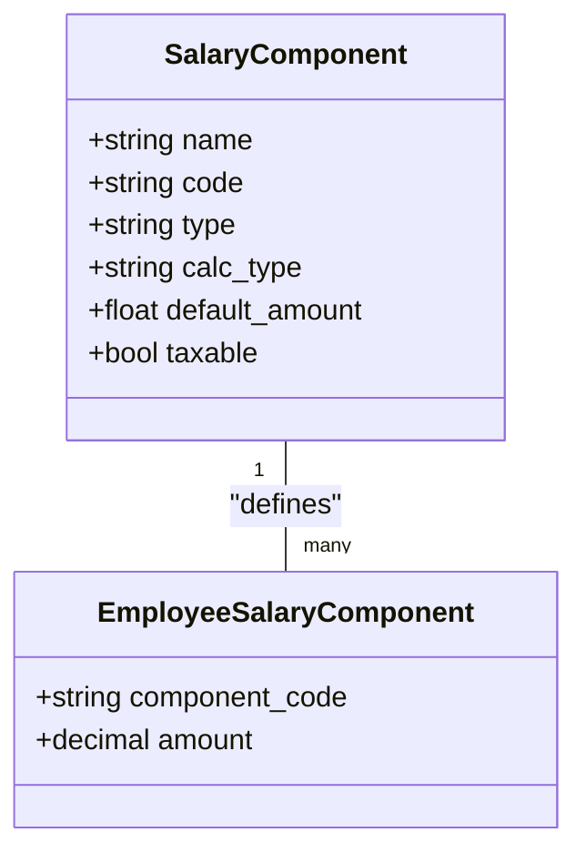

**Diagram sources**
- [SalaryComponent.php:1-28](file://app/Models/SalaryComponent.php#L1-L28)
- [EmployeeSalaryComponent.php:1-200](file://app/Models/EmployeeSalaryComponent.php#L1-L200)

**Section sources**
- [SalaryComponent.php:12-26](file://app/Models/SalaryComponent.php#L12-L26)
- [EmployeeSalaryComponent.php:1-200](file://app/Models/EmployeeSalaryComponent.php#L1-L200)

### Compliance Reporting
- Tools: GenerateComplianceReport console command; HrmReportExport for HR-specific reports; HrmTools provides AI-driven insights and definitions for assistant integrations.
- AI: HrmAiService detects attendance anomalies, suggests salary components, career paths, and turnover risk.

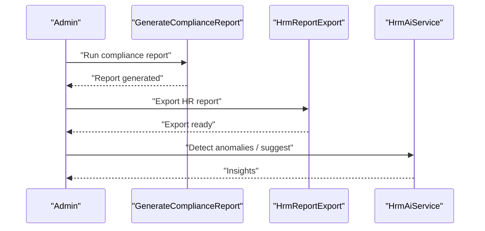

**Diagram sources**
- [GenerateComplianceReport.php](file://app/Console/Commands/GenerateComplianceReport.php)
- [HrmReportExport.php](file://app/Exports/HrmReportExport.php)
- [HrmAiService.php:17-36](file://app/Services/HrmAiService.php#L17-L36)
- [HrmTools.php:13-28](file://app/Services/ERP/HrmTools.php#L13-L28)

**Section sources**
- [GenerateComplianceReport.php](file://app/Console/Commands/GenerateComplianceReport.php)
- [HrmReportExport.php](file://app/Exports/HrmReportExport.php)
- [HrmAiService.php:17-36](file://app/Services/HrmAiService.php#L17-L36)
- [HrmTools.php:13-28](file://app/Services/ERP/HrmTools.php#L13-L28)

## Dependency Analysis
- Controllers depend on models for persistence and on services for business logic.
- Models encapsulate relationships and computed fields (e.g., remaining annual leave).
- Services depend on models and external systems (GL, tax authorities).
- Routes bind web and API endpoints to controllers.
- Views render UI for HR operations.

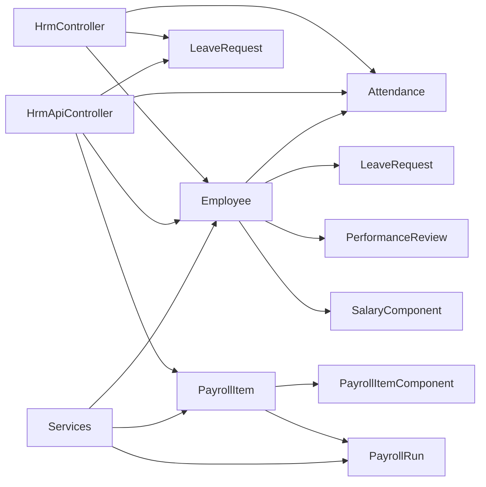

**Diagram sources**
- [HrmController.php:1-378](file://app/Http/Controllers/HrmController.php#L1-L378)
- [HrmApiController.php:1-47](file://app/Http/Controllers/Api/HrmApiController.php#L1-L47)
- [Employee.php:1-100](file://app/Models/Employee.php#L1-L100)
- [Attendance.php:1-40](file://app/Models/Attendance.php#L1-L40)
- [LeaveRequest.php:1-39](file://app/Models/LeaveRequest.php#L1-L39)
- [PayrollItem.php:1-26](file://app/Models/PayrollItem.php#L1-L26)
- [PayrollRun.php:1-200](file://app/Models/PayrollRun.php#L1-L200)
- [PayrollItemComponent.php:1-200](file://app/Models/PayrollItemComponent.php#L1-L200)
- [SalaryComponent.php:1-28](file://app/Models/SalaryComponent.php#L1-L28)
- [PerformanceReview.php:1-200](file://app/Models/PerformanceReview.php#L1-L200)

**Section sources**
- [HrmController.php:1-378](file://app/Http/Controllers/HrmController.php#L1-L378)
- [HrmApiController.php:1-47](file://app/Http/Controllers/Api/HrmApiController.php#L1-L47)
- [Employee.php:1-100](file://app/Models/Employee.php#L1-L100)

## Performance Considerations
- Indexing: Unique constraints on employee-date combinations for attendance and tenant-scoped indices improve lookup performance.
- Aggregation: Use of groupBy and pluck for daily attendance summaries reduces overhead.
- Pagination: Controllers paginate lists to limit payload sizes.
- Tenant Isolation: All models use tenant scoping to avoid cross-tenant data leakage and support multi-tenancy scaling.

[No sources needed since this section provides general guidance]

## Troubleshooting Guide
- Attendance anomalies: Use HrmAiService to detect repeated lateness, ghost employees, and unusual patterns.
- Leave approvals: Ensure only pending requests are deleted; rejections require a reason.
- Payroll processing: Verify PayrollRun status transitions and GL posting completeness.
- API rate limits: API endpoints are rate-limited; monitor quotas for write operations.
- Fingerprint integration: Ensure device registration and log synchronization are functioning.

**Section sources**
- [HrmAiService.php:17-36](file://app/Services/HrmAiService.php#L17-L36)
- [HrmController.php:242-248](file://app/Http/Controllers/HrmController.php#L242-L248)
- [api.php:295-310](file://routes/api.php#L295-L310)
- [FingerprintDeviceService.php](file://app/Services/FingerprintDeviceService.php)
- [FingerprintAttendanceLog.php:1-200](file://app/Models/FingerprintAttendanceLog.php#L1-L200)

## Conclusion
The HRM subsystem integrates employee lifecycle management, attendance, leave, performance reviews, payroll, recruitment, training, and organizational structure with robust tenant isolation, reporting, and AI-driven insights. The modular design using controllers, models, services, and migrations supports scalability and maintainability while ensuring compliance and accurate financial processing.

[No sources needed since this section summarizes without analyzing specific files]

## Appendices

### API Endpoints (HRM)
- Employees: List, detail, create, update, delete
- Attendance: List, bulk save
- Leave: List, request, approve/reject, delete
- Payroll: List runs, process, slip generation
- Departments: List departments

**Section sources**
- [api.php:295-310](file://routes/api.php#L295-L310)
- [HrmApiController.php:18-39](file://app/Http/Controllers/Api/HrmApiController.php#L18-L39)

### UI Navigation
- Recruitment, SDM & Karyawan, Leave Management, Performance, Organization Chart

**Section sources**
- [app.blade.php:1573-1591](file://resources/views/layouts/app.blade.php#L1573-L1591)

### Data Models Overview
- Employees, Attendances, LeaveRequests, PayrollRuns, PayrollItems, PayrollItemComponents, SalaryComponents, PerformanceReviews, TrainingPrograms, TrainingSessions, TrainingParticipants, Departments, JobPostings, JobApplications, EmployeeOnboardings, EmployeeOnboardingTasks, DisciplinaryLetters, ShiftSchedules, WorkShifts, Timesheets, Payables, BankAccounts

**Section sources**
- [create_hrm_tables.php:11-63](file://database/migrations/2026_01_01_000004_create_hrm_tables.php#L11-L63)
- [create_payroll_tables.php:10-47](file://database/migrations/2026_01_01_000020_create_payroll_tables.php#L10-L47)
- [Employee.php:1-100](file://app/Models/Employee.php#L1-L100)
- [Attendance.php:1-40](file://app/Models/Attendance.php#L1-L40)
- [LeaveRequest.php:1-39](file://app/Models/LeaveRequest.php#L1-L39)
- [PayrollRun.php:1-200](file://app/Models/PayrollRun.php#L1-L200)
- [PayrollItem.php:1-26](file://app/Models/PayrollItem.php#L1-L26)
- [PayrollItemComponent.php:1-200](file://app/Models/PayrollItemComponent.php#L1-L200)
- [SalaryComponent.php:1-28](file://app/Models/SalaryComponent.php#L1-L28)
- [PerformanceReview.php:1-200](file://app/Models/PerformanceReview.php#L1-L200)
- [TrainingProgram.php:1-200](file://app/Models/TrainingProgram.php#L1-L200)
- [TrainingSession.php:1-200](file://app/Models/TrainingSession.php#L1-L200)
- [TrainingParticipant.php:1-200](file://app/Models/TrainingParticipant.php#L1-L200)
- [Department.php:1-200](file://app/Models/Department.php#L1-L200)
- [JobPosting.php:1-200](file://app/Models/JobPosting.php#L1-L200)
- [JobApplication.php:1-200](file://app/Models/JobApplication.php#L1-L200)
- [EmployeeOnboarding.php:1-200](file://app/Models/EmployeeOnboarding.php#L1-L200)
- [EmployeeOnboardingTask.php:1-200](file://app/Models/EmployeeOnboardingTask.php#L1-L200)
- [DisciplinaryLetter.php:1-200](file://app/Models/DisciplinaryLetter.php#L1-L200)
- [ShiftSchedule.php:1-200](file://app/Models/ShiftSchedule.php#L1-L200)
- [WorkShift.php:1-200](file://app/Models/WorkShift.php#L1-L200)
- [Timesheet.php:1-200](file://app/Models/Timesheet.php#L1-L200)
- [Payable.php:1-200](file://app/Models/Payable.php#L1-L200)
- [BankAccount.php:1-200](file://app/Models/BankAccount.php#L1-L200)