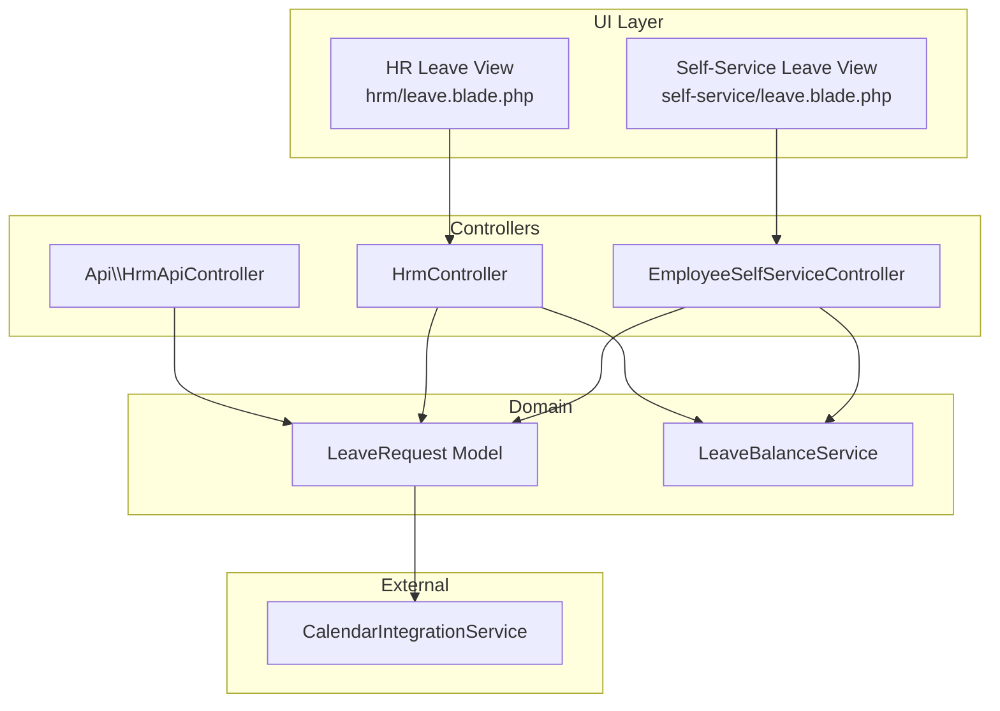
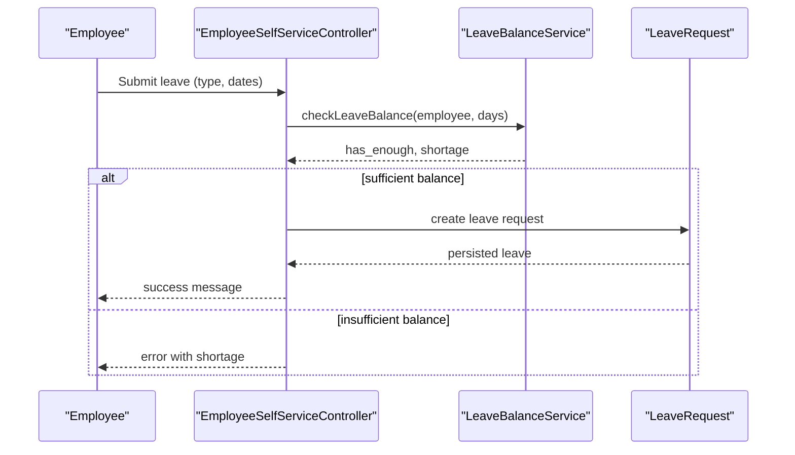
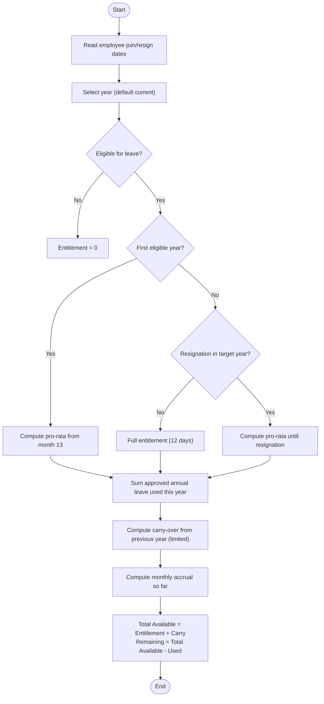
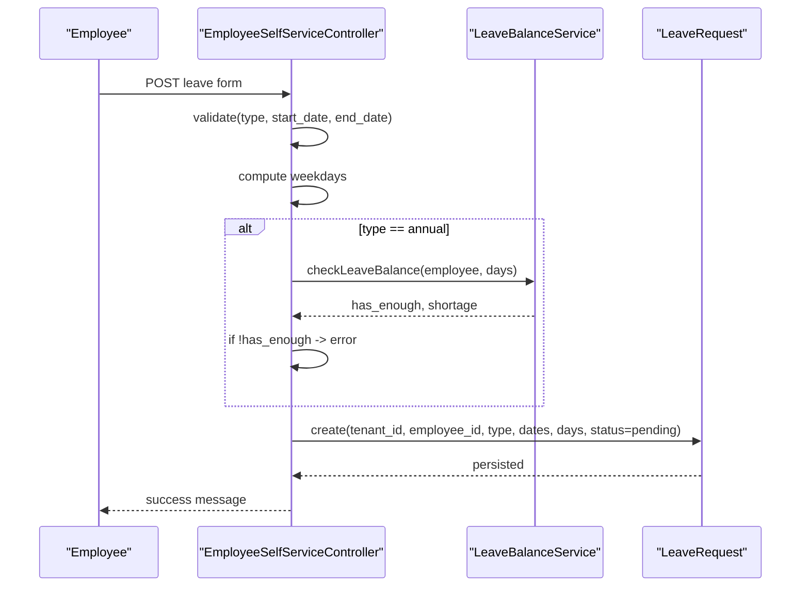
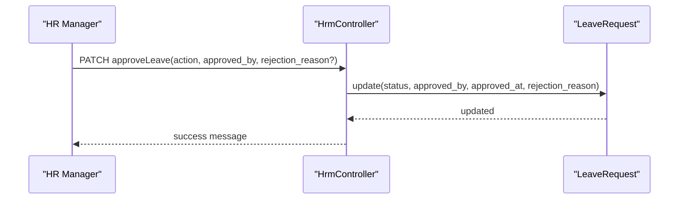
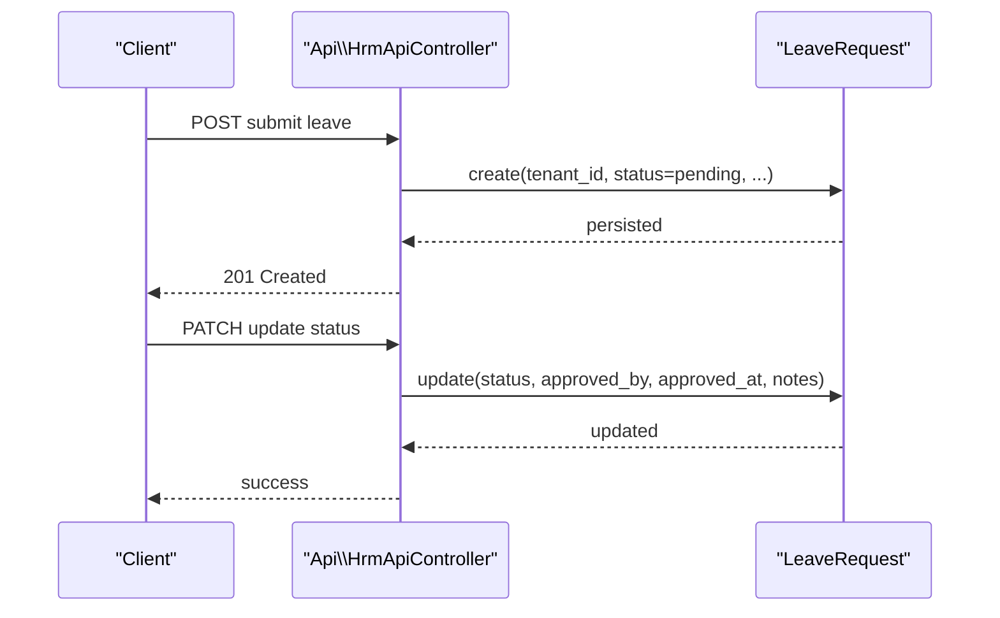
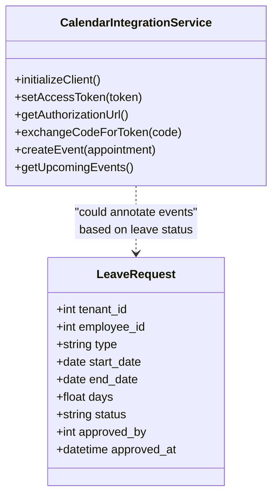
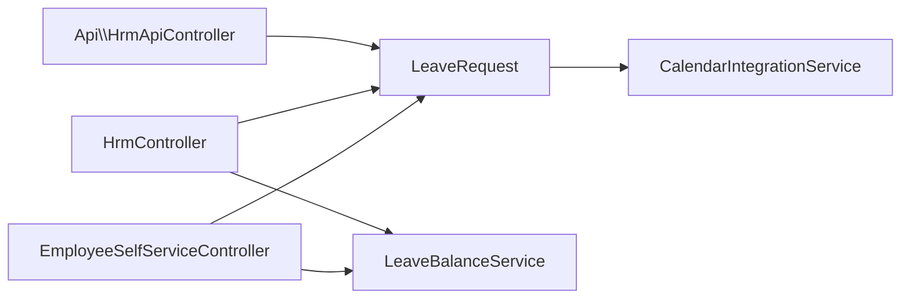

# Leave Management

<cite>
**Referenced Files in This Document**
- [LeaveRequest.php](file://app/Models/LeaveRequest.php)
- [LeaveBalanceService.php](file://app/Services/LeaveBalanceService.php)
- [EmployeeSelfServiceController.php](file://app/Http/Controllers/EmployeeSelfServiceController.php)
- [HrmController.php](file://app/Http/Controllers/HrmController.php)
- [HrmApiController.php](file://app/Http/Controllers/Api/HrmApiController.php)
- [leave.blade.php (HRM)](file://resources/views/hrm/leave.blade.php)
- [leave.blade.php (Self-Service)](file://resources/views/self-service/leave.blade.php)
- [CalendarIntegrationService.php](file://app/Services/CalendarIntegrationService.php)
</cite>

## Table of Contents
1. [Introduction](#introduction)
2. [Project Structure](#project-structure)
3. [Core Components](#core-components)
4. [Architecture Overview](#architecture-overview)
5. [Detailed Component Analysis](#detailed-component-analysis)
6. [Dependency Analysis](#dependency-analysis)
7. [Performance Considerations](#performance-considerations)
8. [Troubleshooting Guide](#troubleshooting-guide)
9. [Conclusion](#conclusion)
10. [Appendices](#appendices)

## Introduction
This document describes the Leave Management system in qalcuityERP, focusing on leave types, application processes, approval workflows, and automated calculations. It covers annual leave, sick leave, maternity/paternity leave, and special/unpaid leaves. It also documents leave balance calculations, accrual policies, carry-forward rules, leave request submission, manager approvals, calendar integration, team planning, and reporting on leave trends and utilization.

## Project Structure
The Leave Management system spans models, services, controllers, Blade views, and an API controller. The model defines the leave request entity and its attributes. The service encapsulates balance and accrual logic. Controllers handle self-service and HR-facing flows, while Blade templates render UI for leave requests and approvals. An API controller exposes endpoints for leave requests and status updates. A calendar integration service demonstrates how leave events could be synchronized with external calendars.

**Diagram sources**
- [leave.blade.php (Self-Service):1-153](file://resources/views/self-service/leave.blade.php#L1-L153)
- [leave.blade.php (HRM):1-220](file://resources/views/hrm/leave.blade.php#L1-L220)
- [EmployeeSelfServiceController.php:133-208](file://app/Http/Controllers/EmployeeSelfServiceController.php#L133-L208)
- [HrmController.php:156-248](file://app/Http/Controllers/HrmController.php#L156-L248)
- [HrmApiController.php:198-228](file://app/Http/Controllers/Api/HrmApiController.php#L198-L228)
- [LeaveRequest.php:10-38](file://app/Models/LeaveRequest.php#L10-L38)
- [LeaveBalanceService.php:24-81](file://app/Services/LeaveBalanceService.php#L24-L81)
- [CalendarIntegrationService.php:13-40](file://app/Services/CalendarIntegrationService.php#L13-L40)

**Section sources**
- [LeaveRequest.php:10-38](file://app/Models/LeaveRequest.php#L10-L38)
- [LeaveBalanceService.php:24-81](file://app/Services/LeaveBalanceService.php#L24-L81)
- [EmployeeSelfServiceController.php:133-208](file://app/Http/Controllers/EmployeeSelfServiceController.php#L133-L208)
- [HrmController.php:156-248](file://app/Http/Controllers/HrmController.php#L156-L248)
- [HrmApiController.php:198-228](file://app/Http/Controllers/Api/HrmApiController.php#L198-L228)
- [leave.blade.php (HRM):1-220](file://resources/views/hrm/leave.blade.php#L1-L220)
- [leave.blade.php (Self-Service):1-153](file://resources/views/self-service/leave.blade.php#L1-L153)
- [CalendarIntegrationService.php:13-40](file://app/Services/CalendarIntegrationService.php#L13-L40)

## Core Components
- LeaveRequest model: Stores leave applications with type, dates, days, reason, status, approver, and timestamps. Provides a localized label for leave types.
- LeaveBalanceService: Calculates leave entitlement, used days, remaining balance, pro-rata adjustments, monthly accrual, and carry-over with configurable limits.
- EmployeeSelfServiceController: Handles self-service leave submission, cancellation, and displays personal leave quota and history.
- HrmController: Manages HR-side leave listing, filtering, creation, approvals/rejections, and activity logging.
- Api/HrmApiController: Exposes endpoints to submit leave requests and update statuses.
- Views: HRM and Self-Service Blade templates provide forms, stats, and approval/modals.

**Section sources**
- [LeaveRequest.php:10-38](file://app/Models/LeaveRequest.php#L10-L38)
- [LeaveBalanceService.php:33-81](file://app/Services/LeaveBalanceService.php#L33-L81)
- [EmployeeSelfServiceController.php:133-208](file://app/Http/Controllers/EmployeeSelfServiceController.php#L133-L208)
- [HrmController.php:156-248](file://app/Http/Controllers/HrmController.php#L156-L248)
- [HrmApiController.php:198-228](file://app/Http/Controllers/Api/HrmApiController.php#L198-L228)
- [leave.blade.php (HRM):1-220](file://resources/views/hrm/leave.blade.php#L1-L220)
- [leave.blade.php (Self-Service):1-153](file://resources/views/self-service/leave.blade.php#L1-L153)

## Architecture Overview
The system follows a layered architecture:
- Presentation: Blade views for self-service and HR dashboards.
- Controllers: Route business logic for leave submission, approvals, and API endpoints.
- Domain: LeaveRequest model persists data; LeaveBalanceService encapsulates accrual and balance computation.
- External integrations: CalendarIntegrationService demonstrates calendar synchronization hooks.

**Diagram sources**
- [EmployeeSelfServiceController.php:155-198](file://app/Http/Controllers/EmployeeSelfServiceController.php#L155-L198)
- [LeaveBalanceService.php:325-341](file://app/Services/LeaveBalanceService.php#L325-L341)
- [LeaveRequest.php:13-16](file://app/Models/LeaveRequest.php#L13-L16)

**Section sources**
- [EmployeeSelfServiceController.php:155-198](file://app/Http/Controllers/EmployeeSelfServiceController.php#L155-L198)
- [LeaveBalanceService.php:325-341](file://app/Services/LeaveBalanceService.php#L325-L341)
- [LeaveRequest.php:13-16](file://app/Models/LeaveRequest.php#L13-L16)

## Detailed Component Analysis

### Leave Types and Policy Support
Supported leave types include annual, sick, maternity, paternity, unpaid, and other. The model provides a localized label mapping for display. Annual leave is the primary entitlement subject to pro-rata and carry-over rules.

- Leave types: annual, sick, maternity, paternity, unpaid, other.
- Localized labels: mapped in the model for UI rendering.
- Eligibility: 12-month continuous service required before first-year entitlement kicks in.

**Section sources**
- [LeaveRequest.php:27-37](file://app/Models/LeaveRequest.php#L27-L37)
- [LeaveBalanceService.php:95-122](file://app/Services/LeaveBalanceService.php#L95-L122)
- [LeaveBalanceService.php:204-225](file://app/Services/LeaveBalanceService.php#L204-L225)

### Leave Balance Calculations, Accrual, and Carry-Forward
The service computes:
- Annual entitlement with pro-rata for first year and resignation year.
- Used annual leave for the year.
- Carry-over from previous year with configurable limit.
- Monthly accrual earned so far in the year.
- Remaining balance and eligibility status.

**Diagram sources**
- [LeaveBalanceService.php:33-81](file://app/Services/LeaveBalanceService.php#L33-L81)
- [LeaveBalanceService.php:95-122](file://app/Services/LeaveBalanceService.php#L95-L122)
- [LeaveBalanceService.php:137-161](file://app/Services/LeaveBalanceService.php#L137-L161)
- [LeaveBalanceService.php:175-193](file://app/Services/LeaveBalanceService.php#L175-L193)
- [LeaveBalanceService.php:234-241](file://app/Services/LeaveBalanceService.php#L234-L241)
- [LeaveBalanceService.php:252-281](file://app/Services/LeaveBalanceService.php#L252-L281)
- [LeaveBalanceService.php:289-315](file://app/Services/LeaveBalanceService.php#L289-L315)

**Section sources**
- [LeaveBalanceService.php:33-81](file://app/Services/LeaveBalanceService.php#L33-L81)
- [LeaveBalanceService.php:95-122](file://app/Services/LeaveBalanceService.php#L95-L122)
- [LeaveBalanceService.php:137-161](file://app/Services/LeaveBalanceService.php#L137-L161)
- [LeaveBalanceService.php:175-193](file://app/Services/LeaveBalanceService.php#L175-L193)
- [LeaveBalanceService.php:234-241](file://app/Services/LeaveBalanceService.php#L234-L241)
- [LeaveBalanceService.php:252-281](file://app/Services/LeaveBalanceService.php#L252-L281)
- [LeaveBalanceService.php:289-315](file://app/Services/LeaveBalanceService.php#L289-L315)
- [LeaveBalanceService.php:376-389](file://app/Services/LeaveBalanceService.php#L376-L389)

### Leave Request Submission (Self-Service)
- Validates type, date range, and ensures start date is not in the past.
- Computes working days between start and end dates.
- For annual leave, checks balance via LeaveBalanceService and prevents over-request.
- Creates a pending leave request and returns success feedback.

**Diagram sources**
- [EmployeeSelfServiceController.php:155-198](file://app/Http/Controllers/EmployeeSelfServiceController.php#L155-L198)
- [LeaveBalanceService.php:325-341](file://app/Services/LeaveBalanceService.php#L325-L341)
- [LeaveRequest.php:13-16](file://app/Models/LeaveRequest.php#L13-L16)

**Section sources**
- [EmployeeSelfServiceController.php:155-198](file://app/Http/Controllers/EmployeeSelfServiceController.php#L155-L198)
- [LeaveBalanceService.php:325-341](file://app/Services/LeaveBalanceService.php#L325-L341)
- [LeaveRequest.php:13-16](file://app/Models/LeaveRequest.php#L13-L16)

### Manager Approvals and Automated Workflows
- HR view lists leave requests with filters by status and employee.
- Approve/reject actions update status, record approver, and log activity.
- Pending requests can be deleted by HR if still pending.
- Self-service allows cancellation of pending requests.

**Diagram sources**
- [HrmController.php:218-240](file://app/Http/Controllers/HrmController.php#L218-L240)
- [LeaveRequest.php:13-16](file://app/Models/LeaveRequest.php#L13-L16)

**Section sources**
- [HrmController.php:156-248](file://app/Http/Controllers/HrmController.php#L156-L248)
- [LeaveRequest.php:13-16](file://app/Models/LeaveRequest.php#L13-L16)

### API Endpoints for Leave Management
- Submit leave request: creates a pending leave request bound to the authenticated tenant.
- Update leave status: approves or rejects with optional notes and sets approver metadata.

**Diagram sources**
- [HrmApiController.php:198-208](file://app/Http/Controllers/Api/HrmApiController.php#L198-L208)
- [HrmApiController.php:213-228](file://app/Http/Controllers/Api/HrmApiController.php#L213-L228)
- [LeaveRequest.php:13-16](file://app/Models/LeaveRequest.php#L13-L16)

**Section sources**
- [HrmApiController.php:198-228](file://app/Http/Controllers/Api/HrmApiController.php#L198-L228)
- [LeaveRequest.php:13-16](file://app/Models/LeaveRequest.php#L13-L16)

### Leave Calendar Integration and Team Planning
- CalendarIntegrationService integrates with Google Calendar, enabling event creation and retrieval.
- While not directly wired to leave events, the service demonstrates how leave approvals could synchronize with external calendars (e.g., marking approved leaves as busy time for managers or team members).
- Team planning and resource allocation can leverage leave data to avoid scheduling conflicts during peak periods.

**Diagram sources**
- [CalendarIntegrationService.php:13-40](file://app/Services/CalendarIntegrationService.php#L13-L40)
- [CalendarIntegrationService.php:186-220](file://app/Services/CalendarIntegrationService.php#L186-L220)
- [CalendarIntegrationService.php:256-270](file://app/Services/CalendarIntegrationService.php#L256-L270)
- [LeaveRequest.php:13-16](file://app/Models/LeaveRequest.php#L13-L16)

**Section sources**
- [CalendarIntegrationService.php:13-40](file://app/Services/CalendarIntegrationService.php#L13-L40)
- [CalendarIntegrationService.php:186-220](file://app/Services/CalendarIntegrationService.php#L186-L220)
- [CalendarIntegrationService.php:256-270](file://app/Services/CalendarIntegrationService.php#L256-L270)
- [LeaveRequest.php:13-16](file://app/Models/LeaveRequest.php#L13-L16)

### Reporting on Leave Trends and Utilization
- HR view statistics show pending, approved, and rejected counts for the current year.
- Filtering by employee and status supports targeted reporting.
- Historical leave data enables trend analysis (e.g., seasonal patterns, departmental utilization).

**Section sources**
- [leave.blade.php (HRM):13-26](file://resources/views/hrm/leave.blade.php#L13-L26)
- [HrmController.php:164-182](file://app/Http/Controllers/HrmController.php#L164-L182)

## Dependency Analysis
Leave management depends on:
- Employee data for eligibility and accrual computations.
- LeaveRequest persistence for storing and querying leave records.
- LeaveBalanceService for accurate balance and pro-rata calculations.
- Controllers for orchestrating submission, approvals, and API interactions.
- Views for rendering UI and modals.
- CalendarIntegrationService for potential calendar synchronization.

**Diagram sources**
- [EmployeeSelfServiceController.php:146-147](file://app/Http/Controllers/EmployeeSelfServiceController.php#L146-L147)
- [HrmController.php:196-197](file://app/Http/Controllers/HrmController.php#L196-L197)
- [HrmApiController.php:202-205](file://app/Http/Controllers/Api/HrmApiController.php#L202-L205)
- [LeaveRequest.php:13-16](file://app/Models/LeaveRequest.php#L13-L16)
- [LeaveBalanceService.php:33-81](file://app/Services/LeaveBalanceService.php#L33-L81)
- [CalendarIntegrationService.php:13-40](file://app/Services/CalendarIntegrationService.php#L13-L40)

**Section sources**
- [EmployeeSelfServiceController.php:146-147](file://app/Http/Controllers/EmployeeSelfServiceController.php#L146-L147)
- [HrmController.php:196-197](file://app/Http/Controllers/HrmController.php#L196-L197)
- [HrmApiController.php:202-205](file://app/Http/Controllers/Api/HrmApiController.php#L202-L205)
- [LeaveRequest.php:13-16](file://app/Models/LeaveRequest.php#L13-L16)
- [LeaveBalanceService.php:33-81](file://app/Services/LeaveBalanceService.php#L33-L81)
- [CalendarIntegrationService.php:13-40](file://app/Services/CalendarIntegrationService.php#L13-L40)

## Performance Considerations
- Balance calculations involve summing approved annual leave per year; ensure appropriate indexing on employee_id, status, and start_date for efficient queries.
- Pro-rata and accrual computations are CPU-bound but lightweight; caching frequent balance queries can reduce repeated calculations.
- Pagination is already used in HR listing and self-service history, preventing large result sets.

## Troubleshooting Guide
Common issues and resolutions:
- Insufficient leave balance for annual leave: The system validates against computed remaining balance and returns a message indicating available vs. requested days. Ensure the employee’s hire/resign dates are correct to avoid unexpected pro-rata outcomes.
- Pending leave cannot be canceled: Only pending requests can be canceled; rejected or approved requests require reapplication or HR intervention.
- Approval errors: Ensure the approver exists and the action is either approved or rejected; rejection requires a reason when applicable.
- API submission failures: Verify tenant scoping and required fields; status updates require proper authorization and valid status values.

**Section sources**
- [EmployeeSelfServiceController.php:171-184](file://app/Http/Controllers/EmployeeSelfServiceController.php#L171-L184)
- [HrmController.php:218-240](file://app/Http/Controllers/HrmController.php#L218-L240)
- [HrmApiController.php:198-228](file://app/Http/Controllers/Api/HrmApiController.php#L198-L228)

## Conclusion
The Leave Management system provides robust support for leave types, accurate balance and accrual calculations, and streamlined approval workflows. It offers both self-service and HR dashboards, with room to integrate calendar systems and derive insights from leave trends. The modular design of the service layer and controllers ensures maintainability and extensibility for future enhancements.

## Appendices

### Examples of Leave Policies and Practices
- Annual leave: 12 days base entitlement; pro-rata for first year and partial resignation year; configurable carry-over up to a limit.
- Sick leave: Supported as a leave type; no pro-rata or carry-over implied by current implementation.
- Maternity/Paternity leave: Supported as leave types; can be combined with annual leave policies depending on company rules.
- Special/Unpaid leave: Supported as leave types; typically not accruing or carrying forward unless policy dictates otherwise.

**Section sources**
- [LeaveBalanceService.php:95-122](file://app/Services/LeaveBalanceService.php#L95-L122)
- [LeaveBalanceService.php:252-281](file://app/Services/LeaveBalanceService.php#L252-L281)
- [LeaveRequest.php:27-37](file://app/Models/LeaveRequest.php#L27-L37)

### Balance Tracking and Reporting
- Self-service dashboard shows used vs. total available leave and pending/approved counts for the current year.
- HR dashboard aggregates pending, approved, and rejected leave counts and supports filtering by employee and status.

**Section sources**
- [leave.blade.php (Self-Service):14-36](file://resources/views/self-service/leave.blade.php#L14-L36)
- [leave.blade.php (HRM):13-26](file://resources/views/hrm/leave.blade.php#L13-L26)
- [HrmController.php:174-182](file://app/Http/Controllers/HrmController.php#L174-L182)