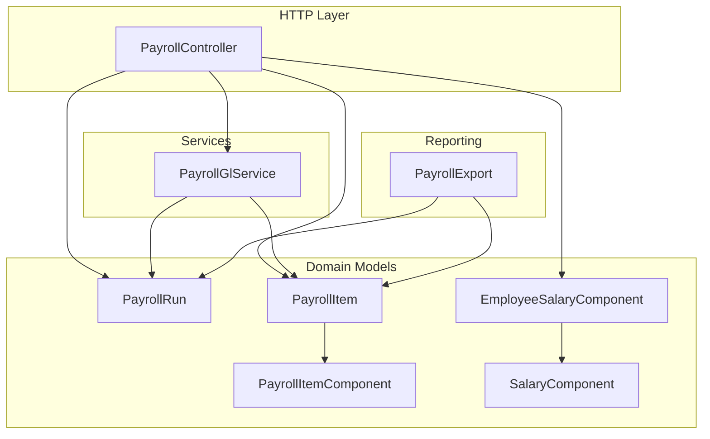
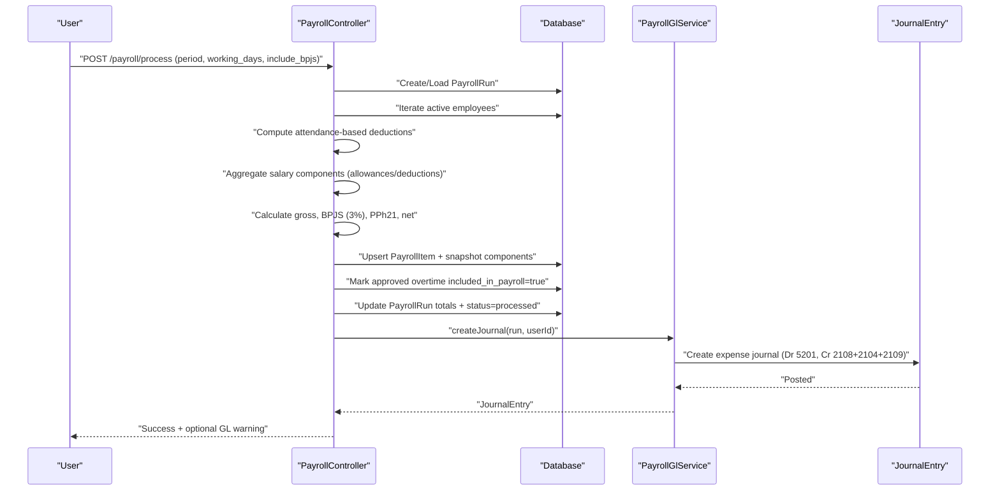
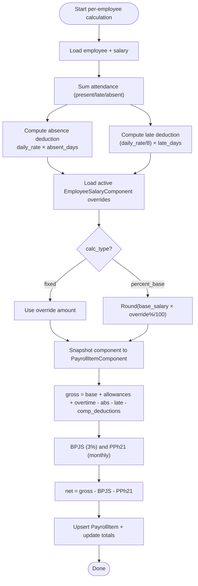
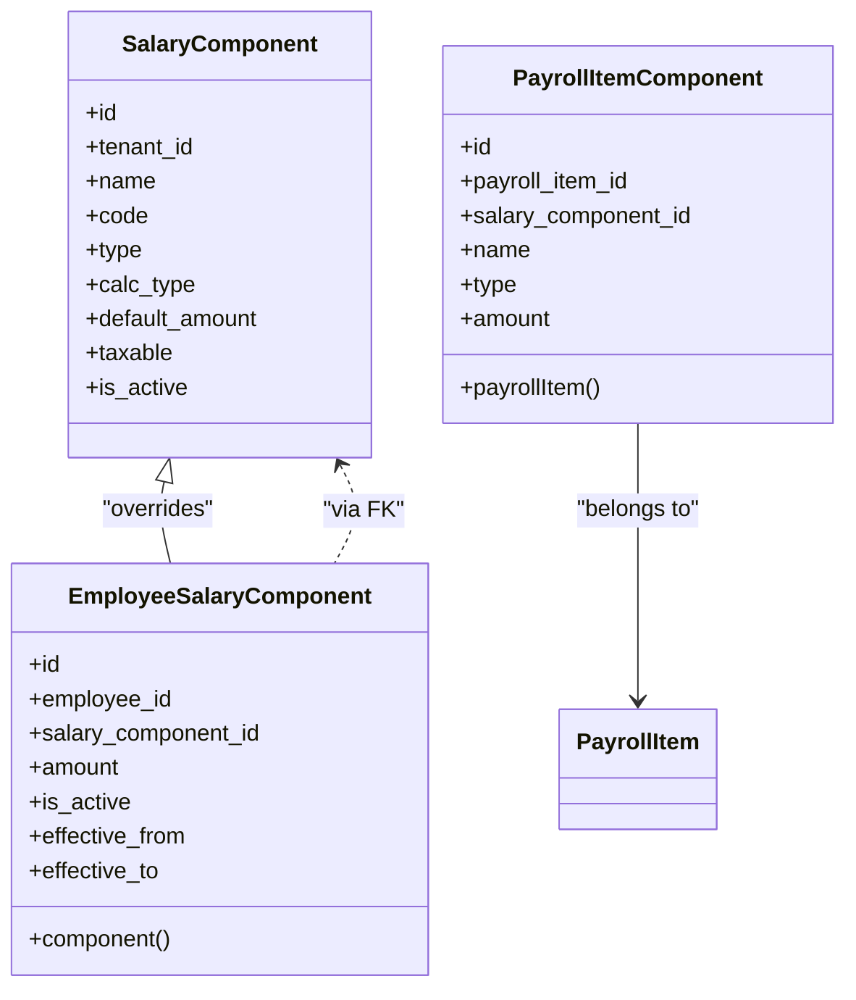
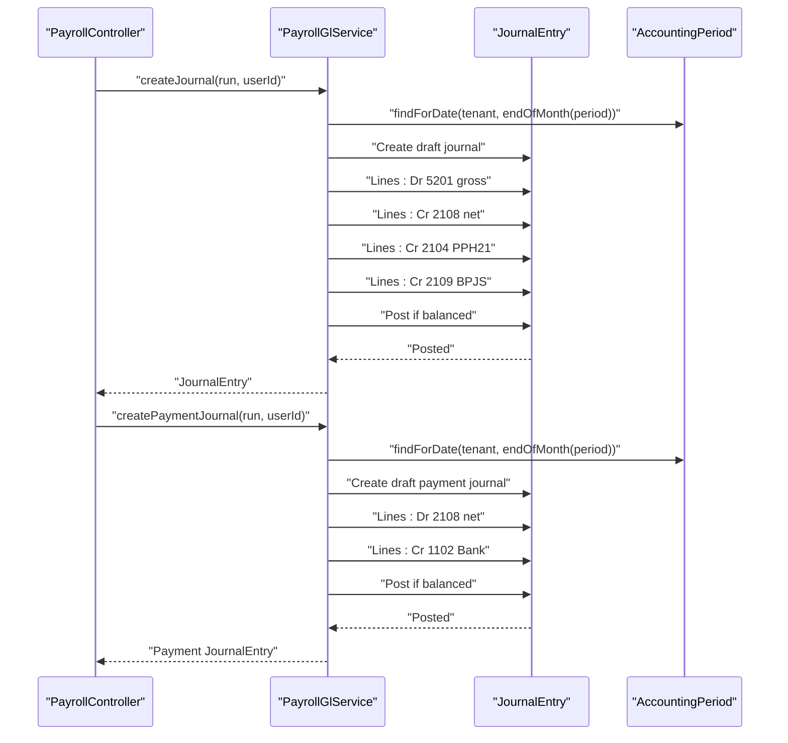
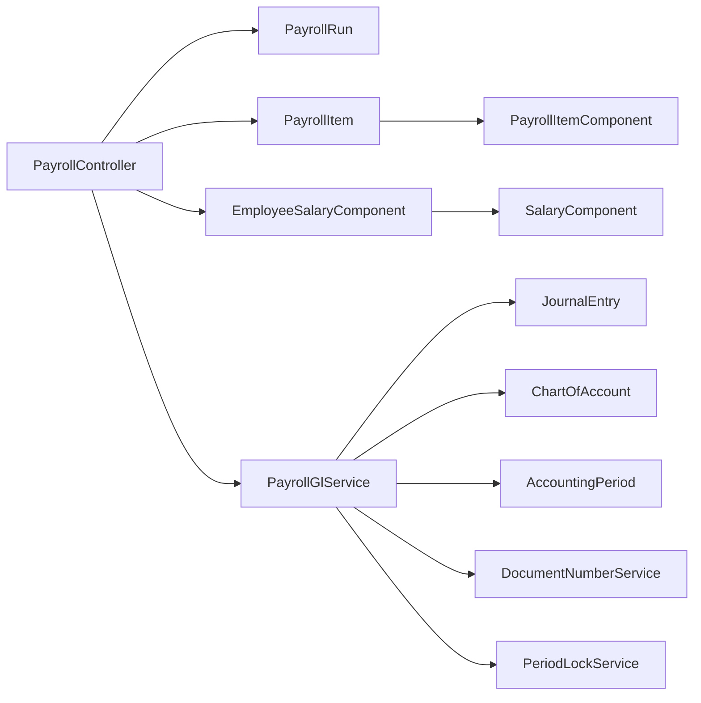

# Payroll Processing

<cite>
**Referenced Files in This Document**
- [PayrollController.php](file://app/Http/Controllers/PayrollController.php)
- [PayrollGlService.php](file://app/Services/PayrollGlService.php)
- [PayrollRun.php](file://app/Models/PayrollRun.php)
- [PayrollItem.php](file://app/Models/PayrollItem.php)
- [PayrollItemComponent.php](file://app/Models/PayrollItemComponent.php)
- [SalaryComponent.php](file://app/Models/SalaryComponent.php)
- [EmployeeSalaryComponent.php](file://app/Models/EmployeeSalaryComponent.php)
- [PayrollExport.php](file://app/Exports/PayrollExport.php)
- [PayrollGlTest.php](file://tests/Feature/PayrollGlTest.php)
- [2026_03_24_000006_create_salary_components_tables.php](file://database/migrations/2026_03_24_000006_create_salary_components_tables.php)
- [slip-show.blade.php](file://resources/views/payroll/slip-show.blade.php)
</cite>

## Table of Contents
1. [Introduction](#introduction)
2. [Project Structure](#project-structure)
3. [Core Components](#core-components)
4. [Architecture Overview](#architecture-overview)
5. [Detailed Component Analysis](#detailed-component-analysis)
6. [Dependency Analysis](#dependency-analysis)
7. [Performance Considerations](#performance-considerations)
8. [Troubleshooting Guide](#troubleshooting-guide)
9. [Conclusion](#conclusion)
10. [Appendices](#appendices)

## Introduction
This document explains the Payroll Processing module in the system, focusing on salary calculations, tax deductions, statutory contributions, and benefit deductions. It covers payroll run creation and processing workflows, integration with General Ledger (GL), salary components management, overtime calculations, leave deductions, advance payments, approval workflows, compliance reporting, statutory filings, payroll history tracking, payment processing, and reconciliation. It also provides examples of payroll configurations, batch processing, and error handling.

## Project Structure
The Payroll Processing feature spans controllers, services, models, exports, and tests:
- Controllers orchestrate payroll runs and GL posting triggers
- Services encapsulate GL journal creation and reconciliation
- Models define payroll run, item, components, and salary component entities
- Exports support payroll reporting and compliance
- Tests validate GL journal creation, balancing, and payment workflows

**Diagram sources**
- [PayrollController.php:1-337](file://app/Http/Controllers/PayrollController.php#L1-L337)
- [PayrollGlService.php:1-339](file://app/Services/PayrollGlService.php#L1-L339)
- [PayrollRun.php:1-30](file://app/Models/PayrollRun.php#L1-L30)
- [PayrollItem.php:1-26](file://app/Models/PayrollItem.php#L1-L26)
- [PayrollItemComponent.php:1-20](file://app/Models/PayrollItemComponent.php#L1-L20)
- [SalaryComponent.php:1-28](file://app/Models/SalaryComponent.php#L1-L28)
- [EmployeeSalaryComponent.php:1-34](file://app/Models/EmployeeSalaryComponent.php#L1-L34)
- [PayrollExport.php:1-81](file://app/Exports/PayrollExport.php#L1-L81)

**Section sources**
- [PayrollController.php:1-337](file://app/Http/Controllers/PayrollController.php#L1-L337)
- [PayrollGlService.php:1-339](file://app/Services/PayrollGlService.php#L1-L339)
- [PayrollRun.php:1-30](file://app/Models/PayrollRun.php#L1-L30)
- [PayrollItem.php:1-26](file://app/Models/PayrollItem.php#L1-L26)
- [PayrollItemComponent.php:1-20](file://app/Models/PayrollItemComponent.php#L1-L20)
- [SalaryComponent.php:1-28](file://app/Models/SalaryComponent.php#L1-L28)
- [EmployeeSalaryComponent.php:1-34](file://app/Models/EmployeeSalaryComponent.php#L1-L34)
- [PayrollExport.php:1-81](file://app/Exports/PayrollExport.php#L1-L81)

## Core Components
- PayrollRun: Represents a monthly payroll run with totals and status, linked to GL journals
- PayrollItem: Per-employee record containing base salary, allowances, deductions, taxes, and net
- PayrollItemComponent: Snapshot of salary components applied to an item for audit/history
- SalaryComponent: Master template for components (allowances/deductions) per tenant
- EmployeeSalaryComponent: Overrides defaults per employee with effective date range
- PayrollController: Orchestrates run creation, calculation, notifications, and GL triggers
- PayrollGlService: Creates expense and payment GL journals, resolves COA, enforces balances and period locks

**Section sources**
- [PayrollRun.php:1-30](file://app/Models/PayrollRun.php#L1-L30)
- [PayrollItem.php:1-26](file://app/Models/PayrollItem.php#L1-L26)
- [PayrollItemComponent.php:1-20](file://app/Models/PayrollItemComponent.php#L1-L20)
- [SalaryComponent.php:1-28](file://app/Models/SalaryComponent.php#L1-L28)
- [EmployeeSalaryComponent.php:1-34](file://app/Models/EmployeeSalaryComponent.php#L1-L34)
- [PayrollController.php:1-337](file://app/Http/Controllers/PayrollController.php#L1-L337)
- [PayrollGlService.php:1-339](file://app/Services/PayrollGlService.php#L1-L339)

## Architecture Overview
End-to-end payroll processing and GL integration:

**Diagram sources**
- [PayrollController.php:48-244](file://app/Http/Controllers/PayrollController.php#L48-L244)
- [PayrollGlService.php:49-182](file://app/Services/PayrollGlService.php#L49-L182)

## Detailed Component Analysis

### Payroll Calculation Engine
- Base salary and daily rate derived from employee profile
- Attendance-driven deductions:
  - Absences: absent_days × (base_salary / working_days)
  - Late arrivals: late_days × (base_salary / working_days / 8)
- Overtime: approved overtime hours for the month, not yet included in payroll
- Salary components:
  - Defaults from SalaryComponent (allowances/deductions)
  - Overrides via EmployeeSalaryComponent with effective date windows
  - Aggregated per item and snapshotted into PayrollItemComponent
- Gross salary: base + total allowances + overtime − absence/late deductions − component deductions
- Statutory deductions:
  - BPJS employee: 3% of gross (optional inclusion flag)
  - PPh21: annualized gross minus 54 million, then prorated monthly
- Net salary: gross − BPJS − PPh21

**Diagram sources**
- [PayrollController.php:96-201](file://app/Http/Controllers/PayrollController.php#L96-L201)
- [PayrollController.php:120-155](file://app/Http/Controllers/PayrollController.php#L120-L155)

**Section sources**
- [PayrollController.php:96-201](file://app/Http/Controllers/PayrollController.php#L96-L201)
- [PayrollController.php:120-155](file://app/Http/Controllers/PayrollController.php#L120-L155)

### Salary Components Management
- Master templates in SalaryComponent define component metadata (type, calc method, taxable)
- Employee overrides in EmployeeSalaryComponent allow per-employee adjustments with effective_from/effective_to windows
- At run-time, overrides are resolved and snapshotted into PayrollItemComponent for audit/history

**Diagram sources**
- [SalaryComponent.php:1-28](file://app/Models/SalaryComponent.php#L1-L28)
- [EmployeeSalaryComponent.php:1-34](file://app/Models/EmployeeSalaryComponent.php#L1-L34)
- [PayrollItemComponent.php:1-20](file://app/Models/PayrollItemComponent.php#L1-L20)

**Section sources**
- [2026_03_24_000006_create_salary_components_tables.php:10-52](file://database/migrations/2026_03_24_000006_create_salary_components_tables.php#L10-L52)
- [PayrollController.php:120-155](file://app/Http/Controllers/PayrollController.php#L120-L155)

### Payroll Run Creation and Processing
- Validates period and working days, checks existing run status
- Iterates active employees with non-null salary
- Computes attendance-based deductions and aggregates components
- Upserts PayrollItem records and snapshots components
- Marks approved overtime as included_in_payroll
- Updates PayrollRun totals and status to processed
- Attempts automatic GL expense journal creation; captures warnings for manual action

**Section sources**
- [PayrollController.php:48-244](file://app/Http/Controllers/PayrollController.php#L48-L244)

### General Ledger Integration
- Expense journal (after processing):
  - Debit: 5201 Beban Gaji (gross)
  - Credit: 2108 Hutang Gaji (net), 2104 PPh 21 Terutang (PPH21), 2109 Hutang BPJS (employee + employer)
- Payment journal (when marked paid):
  - Debit: 2108 Hutang Gaji (lunasi)
  - Credit: 1102 Bank (cash outflow)
- COA resolution:
  - Resolves required accounts by tenant code
  - Auto-creates missing accounts with defaults if not found
- Period locking:
  - Enforces accounting period lock before creating journals
- Balancing:
  - Throws if journals are unbalanced; logs differences for diagnostics

**Diagram sources**
- [PayrollGlService.php:49-182](file://app/Services/PayrollGlService.php#L49-L182)
- [PayrollGlService.php:193-276](file://app/Services/PayrollGlService.php#L193-L276)

**Section sources**
- [PayrollGlService.php:49-182](file://app/Services/PayrollGlService.php#L49-L182)
- [PayrollGlService.php:193-276](file://app/Services/PayrollGlService.php#L193-L276)
- [PayrollGlTest.php:78-125](file://tests/Feature/PayrollGlTest.php#L78-L125)

### Payroll Approval and Payment Workflows
- Approval:
  - Controller validates run status and tenant ownership
  - Prevents duplicate “paid” markings
  - Updates run status to paid and marks items as paid
- Payment journal:
  - Created upon marking paid
  - Ensures no duplicate payment journals unless reversed
  - Supports manual creation if needed

**Section sources**
- [PayrollController.php:246-290](file://app/Http/Controllers/PayrollController.php#L246-L290)
- [PayrollController.php:295-335](file://app/Http/Controllers/PayrollController.php#L295-L335)

### Compliance Reporting and Statutory Filings
- PayrollExport generates a structured Excel report per run with:
  - Employee name
  - Base salary, presence/absence days
  - Allowances, overtime pay
  - BPJS (employee), PPh21, net salary
  - Totals row
- Reports can be filtered by period in the UI and exported to Excel

**Section sources**
- [PayrollExport.php:37-79](file://app/Exports/PayrollExport.php#L37-L79)
- [resources/views/reports/index.blade.php:214-238](file://resources/views/reports/index.blade.php#L214-L238)

### Payroll History Tracking and Slip Rendering
- PayrollItemComponent snapshots capture component details per item for audit trails
- Slip rendering displays:
  - BPJS Ketenagakerjaan (3%)
  - PPh 21
  - Other deductions (including component-specific entries)
  - Total deductions and net

**Section sources**
- [PayrollItemComponent.php:1-20](file://app/Models/PayrollItemComponent.php#L1-L20)
- [slip-show.blade.php:149-177](file://resources/views/payroll/slip-show.blade.php#L149-L177)

## Dependency Analysis
- PayrollController depends on:
  - PayrollRun, PayrollItem, PayrollItemComponent models
  - EmployeeSalaryComponent and SalaryComponent for component resolution
  - PayrollGlService for GL journal creation
- PayrollGlService depends on:
  - JournalEntry, ChartOfAccount, AccountingPeriod
  - DocumentNumberService for numbering
  - PeriodLockService for period checks

**Diagram sources**
- [PayrollController.php:1-337](file://app/Http/Controllers/PayrollController.php#L1-L337)
- [PayrollGlService.php:1-339](file://app/Services/PayrollGlService.php#L1-L339)
- [PayrollRun.php:1-30](file://app/Models/PayrollRun.php#L1-L30)
- [PayrollItem.php:1-26](file://app/Models/PayrollItem.php#L1-L26)
- [PayrollItemComponent.php:1-20](file://app/Models/PayrollItemComponent.php#L1-L20)
- [SalaryComponent.php:1-28](file://app/Models/SalaryComponent.php#L1-L28)
- [EmployeeSalaryComponent.php:1-34](file://app/Models/EmployeeSalaryComponent.php#L1-L34)

**Section sources**
- [PayrollController.php:1-337](file://app/Http/Controllers/PayrollController.php#L1-L337)
- [PayrollGlService.php:1-339](file://app/Services/PayrollGlService.php#L1-L339)

## Performance Considerations
- Transaction wrapping ensures atomicity across employee processing and prevents partial states
- Component aggregation and snapshotting occur per employee; batching and indexing on tenant/employee reduce overhead
- GL journal creation is deferred until after run completion to minimize intermediate writes
- Export generation queries run by period and tenant to limit dataset size

[No sources needed since this section provides general guidance]

## Troubleshooting Guide
Common issues and resolutions:
- Duplicate processing attempts:
  - Prevented by status checks; re-processing is blocked for processed/paid runs
- Double marking as paid:
  - Controller guards against duplicate updates and existing posted payment journals
- Unbalanced GL journals:
  - Service throws exceptions with debit/credit totals and difference for diagnosis
- Period locked:
  - Journal creation fails early with a descriptive message if the accounting period is locked
- Missing COA:
  - Service auto-creates default payroll accounts; if still failing, verify tenant chart setup
- Manual GL creation:
  - Use controller actions to create expense or payment journals when needed

**Section sources**
- [PayrollController.php:61-79](file://app/Http/Controllers/PayrollController.php#L61-L79)
- [PayrollController.php:246-290](file://app/Http/Controllers/PayrollController.php#L246-L290)
- [PayrollGlService.php:154-175](file://app/Services/PayrollGlService.php#L154-L175)
- [PayrollGlService.php:213-220](file://app/Services/PayrollGlService.php#L213-L220)
- [PayrollGlService.php:300-322](file://app/Services/PayrollGlService.php#L300-L322)
- [PayrollGlTest.php:226-252](file://tests/Feature/PayrollGlTest.php#L226-L252)

## Conclusion
The Payroll Processing module provides a robust pipeline for calculating salaries, applying statutory deductions, managing flexible components, and integrating with GL. It supports batch processing, reconciliation, reporting, and compliance while enforcing safety checks such as transactional integrity, period locks, and balanced journal creation. Manual fallbacks and audit snapshots ensure reliability and traceability.

[No sources needed since this section summarizes without analyzing specific files]

## Appendices

### Example Configurations and Workflows
- Creating a payroll run:
  - Provide period (YYYY-MM), working days, and optional BPJS inclusion flag
  - Controller validates status and computes per-employee totals
- Salary components:
  - Define master components (allowances/deductions) and optionally override per employee with effective dates
- GL posting:
  - Automatic expense journal after processing; payment journal after marking paid
- Reporting:
  - Export payroll details per period to Excel for compliance and reconciliation

**Section sources**
- [PayrollController.php:48-244](file://app/Http/Controllers/PayrollController.php#L48-L244)
- [2026_03_24_000006_create_salary_components_tables.php:10-52](file://database/migrations/2026_03_24_000006_create_salary_components_tables.php#L10-L52)
- [PayrollGlService.php:49-182](file://app/Services/PayrollGlService.php#L49-L182)
- [PayrollExport.php:37-79](file://app/Exports/PayrollExport.php#L37-L79)