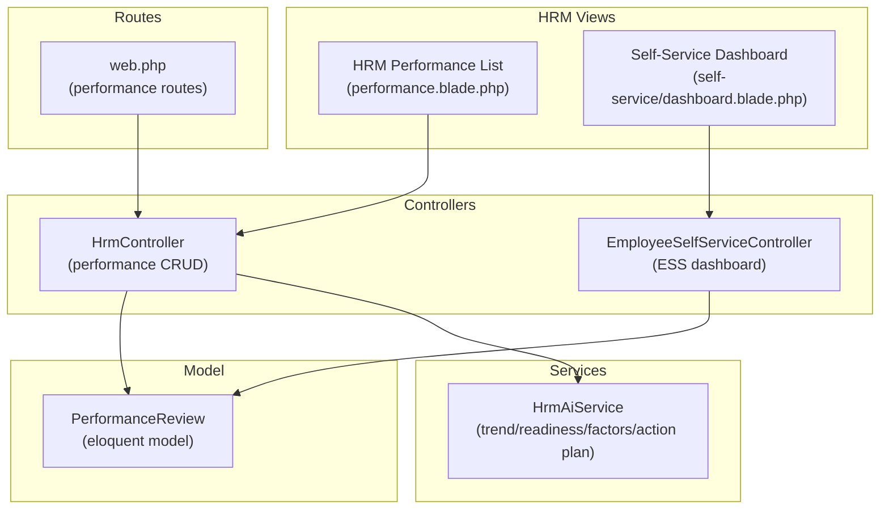
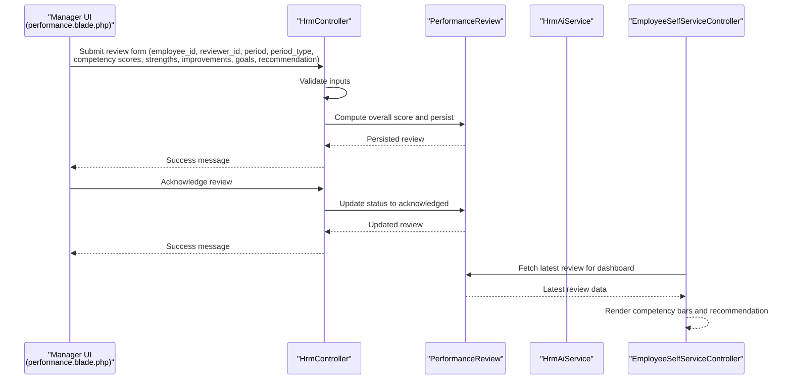
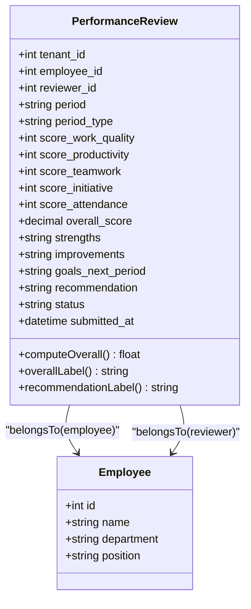
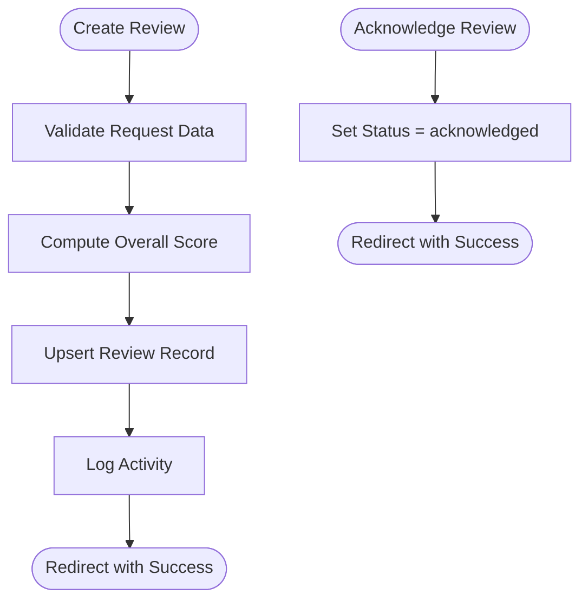
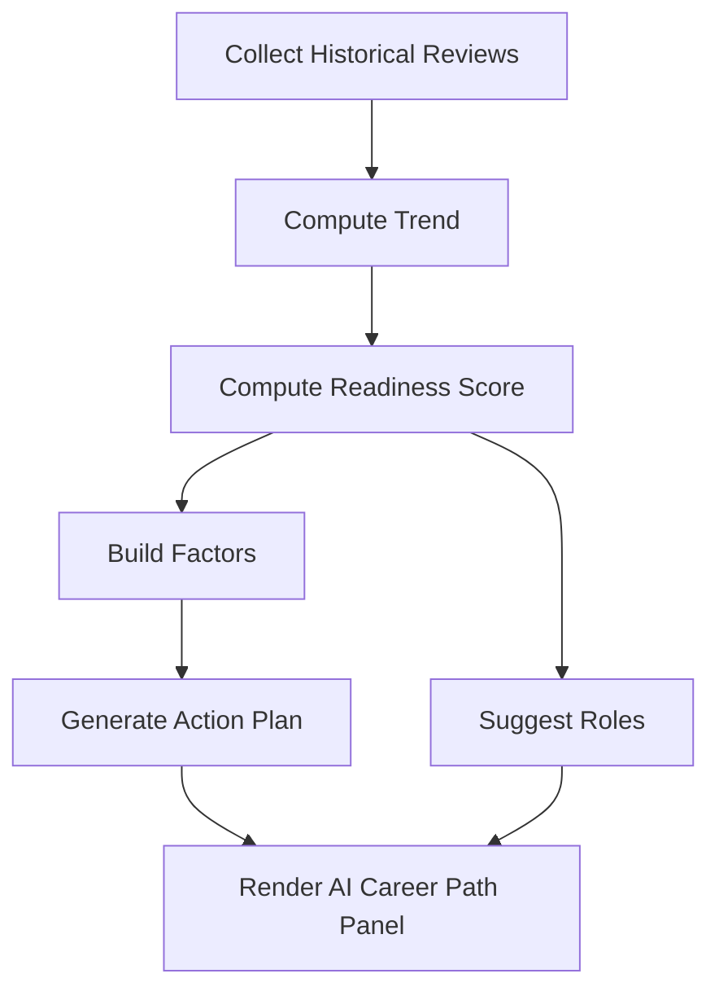
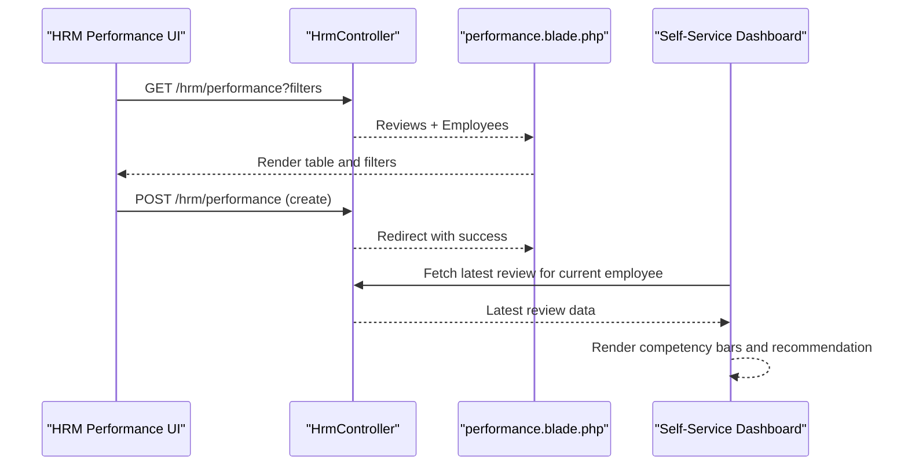
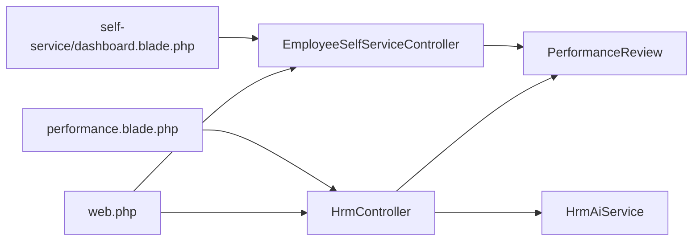

# Performance Review

<cite>
**Referenced Files in This Document**
- [PerformanceReview.php](file://app/Models/PerformanceReview.php)
- [HrmController.php](file://app/Http/Controllers/HrmController.php)
- [HrmAiService.php](file://app/Services/HrmAiService.php)
- [performance.blade.php](file://resources/views/hrm/performance.blade.php)
- [self-service/dashboard.blade.php](file://resources/views/self-service/dashboard.blade.php)
- [web.php](file://routes/web.php)
- [EmployeeSelfServiceController.php](file://app/Http/Controllers/EmployeeSelfServiceController.php)
</cite>

## Table of Contents
1. [Introduction](#introduction)
2. [Project Structure](#project-structure)
3. [Core Components](#core-components)
4. [Architecture Overview](#architecture-overview)
5. [Detailed Component Analysis](#detailed-component-analysis)
6. [Dependency Analysis](#dependency-analysis)
7. [Performance Considerations](#performance-considerations)
8. [Troubleshooting Guide](#troubleshooting-guide)
9. [Conclusion](#conclusion)
10. [Appendices](#appendices)

## Introduction
This document explains the Performance Review subsystem within the ERP, focusing on 360-degree feedback mechanisms, rating scales, evaluation criteria, review periods, reviewer assignments, competency frameworks, goal setting and tracking, development planning, workflows, manager training, and employee self-assessments. It also covers performance analytics, trend analysis, and succession planning integration, along with practical examples of templates, scoring rubrics, and improvement action plans.

## Project Structure
The Performance Review system spans models, controllers, services, routes, and views:
- Model: stores review records, computed overall scores, labels, and recommendations
- Controller: handles creation, acknowledgment, listing, and deletion of reviews
- Service: computes trends, readiness, factors, and action plans for career path prediction
- Routes: expose endpoints for listing, creating, acknowledging, and deleting reviews
- Views: present filters, forms, and dashboards for managers and employees

**Diagram sources**
- [performance.blade.php:1-404](file://resources/views/hrm/performance.blade.php#L1-L404)
- [self-service/dashboard.blade.php:180-250](file://resources/views/self-service/dashboard.blade.php#L180-L250)
- [HrmController.php:250-378](file://app/Http/Controllers/HrmController.php#L250-L378)
- [EmployeeSelfServiceController.php:1-287](file://app/Http/Controllers/EmployeeSelfServiceController.php#L1-L287)
- [HrmAiService.php:469-892](file://app/Services/HrmAiService.php#L469-L892)
- [PerformanceReview.php:1-62](file://app/Models/PerformanceReview.php#L1-L62)
- [web.php:701-713](file://routes/web.php#L701-L713)

**Section sources**
- [performance.blade.php:1-404](file://resources/views/hrm/performance.blade.php#L1-L404)
- [HrmController.php:250-378](file://app/Http/Controllers/HrmController.php#L250-L378)
- [HrmAiService.php:469-892](file://app/Services/HrmAiService.php#L469-L892)
- [PerformanceReview.php:1-62](file://app/Models/PerformanceReview.php#L1-L62)
- [web.php:701-713](file://routes/web.php#L701-L713)
- [EmployeeSelfServiceController.php:1-287](file://app/Http/Controllers/EmployeeSelfServiceController.php#L1-L287)

## Core Components
- PerformanceReview model
  - Stores reviewer and employee IDs, period, period type (monthly, quarterly, annual), individual competency scores, overall score, strengths, improvements, goals for next period, recommendation, status, and submission timestamp
  - Computes overall score and labels for performance levels
  - Provides recommendation labels for downstream actions
- HrmController
  - Lists reviews with filtering by employee and period type
  - Validates and persists reviews, computes overall score, sets status to submitted, and records activity log
  - Acknowledges reviews and deletes them
- HrmAiService
  - Computes performance trend across historical reviews
  - Builds readiness score and labels
  - Generates suggested roles and action plans
  - Produces factors (positive/negative) driving predictions
- Views
  - HRM Performance page: filter, table, modal form, and AI Career Path panel
  - Self-Service Dashboard: displays latest review, competency bars, and recommendation

**Section sources**
- [PerformanceReview.php:10-62](file://app/Models/PerformanceReview.php#L10-L62)
- [HrmController.php:252-333](file://app/Http/Controllers/HrmController.php#L252-L333)
- [HrmAiService.php:469-892](file://app/Services/HrmAiService.php#L469-L892)
- [performance.blade.php:1-404](file://resources/views/hrm/performance.blade.php#L1-L404)
- [self-service/dashboard.blade.php:180-250](file://resources/views/self-service/dashboard.blade.php#L180-L250)

## Architecture Overview
The system follows a layered MVC pattern with service-driven analytics:
- UI layer (Blade views) renders forms and dashboards
- Controller layer validates inputs, orchestrates persistence and analytics
- Service layer encapsulates AI computations for trend, readiness, roles, and action plans
- Model layer persists and exposes computed fields

**Diagram sources**
- [performance.blade.php:164-261](file://resources/views/hrm/performance.blade.php#L164-L261)
- [HrmController.php:273-333](file://app/Http/Controllers/HrmController.php#L273-L333)
- [PerformanceReview.php:29-61](file://app/Models/PerformanceReview.php#L29-L61)
- [EmployeeSelfServiceController.php:69-83](file://app/Http/Controllers/EmployeeSelfServiceController.php#L69-L83)

## Detailed Component Analysis

### PerformanceReview Model
- Fields: reviewer and employee relations, period metadata, competency scores, overall score, textual fields (strengths, improvements, goals), recommendation, status, timestamps
- Computed methods:
  - Overall score computation
  - Overall label classification
  - Recommendation label mapping

**Diagram sources**
- [PerformanceReview.php:10-62](file://app/Models/PerformanceReview.php#L10-L62)

**Section sources**
- [PerformanceReview.php:10-62](file://app/Models/PerformanceReview.php#L10-L62)

### HrmController: Performance CRUD and Workflows
- Listing reviews with filters and pagination
- Creating/updating reviews with validation and overall score computation
- Acknowledging and deleting reviews
- Activity logging on creation

**Diagram sources**
- [HrmController.php:273-333](file://app/Http/Controllers/HrmController.php#L273-L333)

**Section sources**
- [HrmController.php:252-333](file://app/Http/Controllers/HrmController.php#L252-L333)

### HrmAiService: Analytics, Trends, and Succession Planning
- Trend detection across historical scores
- Readiness scoring considering performance, trend, tenure, promotions, PIPs, terminations, attendance, lateness, and review count
- Factor building (positive/negative) and action plan generation
- Suggested roles for succession planning

**Diagram sources**
- [HrmAiService.php:469-892](file://app/Services/HrmAiService.php#L469-L892)

**Section sources**
- [HrmAiService.php:469-892](file://app/Services/HrmAiService.php#L469-L892)

### Views: HRM Performance and Self-Service Dashboards
- HRM Performance page
  - Filters by employee and period type
  - Table with employee, period, reviewer, score, recommendation, status, actions
  - Modal form to create reviews with competency sliders and optional recommendation
  - AI Career Path panel with gauge, suggested roles, factors, and action plan
- Self-Service Dashboard
  - Displays latest review, competency bars, and recommendation

**Diagram sources**
- [performance.blade.php:1-404](file://resources/views/hrm/performance.blade.php#L1-L404)
- [EmployeeSelfServiceController.php:69-83](file://app/Http/Controllers/EmployeeSelfServiceController.php#L69-L83)

**Section sources**
- [performance.blade.php:1-404](file://resources/views/hrm/performance.blade.php#L1-L404)
- [self-service/dashboard.blade.php:180-250](file://resources/views/self-service/dashboard.blade.php#L180-L250)
- [EmployeeSelfServiceController.php:69-83](file://app/Http/Controllers/EmployeeSelfServiceController.php#L69-L83)

## Dependency Analysis
- Controllers depend on Models for persistence and on Services for analytics
- Views depend on Controllers for data and on routes for endpoints
- Routes bind UI actions to controller methods

**Diagram sources**
- [web.php:701-713](file://routes/web.php#L701-L713)
- [HrmController.php:252-333](file://app/Http/Controllers/HrmController.php#L252-L333)
- [EmployeeSelfServiceController.php:69-83](file://app/Http/Controllers/EmployeeSelfServiceController.php#L69-L83)
- [PerformanceReview.php:10-62](file://app/Models/PerformanceReview.php#L10-L62)
- [HrmAiService.php:469-892](file://app/Services/HrmAiService.php#L469-L892)
- [performance.blade.php:1-404](file://resources/views/hrm/performance.blade.php#L1-L404)
- [self-service/dashboard.blade.php:180-250](file://resources/views/self-service/dashboard.blade.php#L180-L250)

**Section sources**
- [web.php:701-713](file://routes/web.php#L701-L713)
- [HrmController.php:252-333](file://app/Http/Controllers/HrmController.php#L252-L333)
- [EmployeeSelfServiceController.php:69-83](file://app/Http/Controllers/EmployeeSelfServiceController.php#L69-L83)
- [PerformanceReview.php:10-62](file://app/Models/PerformanceReview.php#L10-L62)
- [HrmAiService.php:469-892](file://app/Services/HrmAiService.php#L469-L892)
- [performance.blade.php:1-404](file://resources/views/hrm/performance.blade.php#L1-L404)
- [self-service/dashboard.blade.php:180-250](file://resources/views/self-service/dashboard.blade.php#L180-L250)

## Performance Considerations
- Indexing: Composite indexes for performance queries on tenant, employee, period, and period_type improve filtering and pagination
- Validation: Strict validation prevents invalid entries and ensures consistent scoring
- Caching: Consider caching frequently accessed dashboards (e.g., latest review) to reduce DB load
- Pagination: Default pagination limits result sets for large datasets
- Trend computation: Efficient slicing and averaging minimize overhead for trend detection

[No sources needed since this section provides general guidance]

## Troubleshooting Guide
- Review not appearing after creation
  - Verify tenant scoping and employee existence checks during creation
  - Confirm status transitions and submission timestamps
- Acknowledgment button missing
  - Ensure review status is “submitted” before acknowledgment
- Insufficient data warnings in AI Career Path
  - Add more reviews to improve accuracy; the system warns on insufficient review counts
- Self-service dashboard shows no review
  - Latest review query falls back to empty state if none exists

**Section sources**
- [HrmController.php:273-333](file://app/Http/Controllers/HrmController.php#L273-L333)
- [performance.blade.php:134-150](file://resources/views/hrm/performance.blade.php#L134-L150)
- [HrmAiService.php:566-591](file://app/Services/HrmAiService.php#L566-L591)
- [EmployeeSelfServiceController.php:69-83](file://app/Http/Controllers/EmployeeSelfServiceController.php#L69-L83)

## Conclusion
The Performance Review subsystem integrates structured rating scales, competency-based evaluation criteria, flexible review periods, and robust workflows for creation, acknowledgment, and deletion. It leverages AI-driven analytics for trend detection, readiness assessment, and succession planning, while providing dashboards for both managers and employees. The modular design supports scalability and maintainability.

[No sources needed since this section summarizes without analyzing specific files]

## Appendices

### Review Periods and Evaluation Criteria
- Period types supported: monthly, quarterly, annual
- Evaluation criteria (each scored 1–5):
  - Work quality
  - Productivity
  - Teamwork
  - Initiative
  - Attendance
- Overall score computed as the arithmetic mean of the five competencies
- Labels: Excellent, Good, Satisfactory, Needs Improvement, Unsatisfactory
- Recommendations: Promote, Retain, PIP, Terminate

**Section sources**
- [HrmController.php:275-314](file://app/Http/Controllers/HrmController.php#L275-L314)
- [PerformanceReview.php:29-61](file://app/Models/PerformanceReview.php#L29-L61)

### Reviewer Assignments and Competency Framework
- Reviewer and employee assigned via dropdowns in the creation modal
- Competency framework aligned with organizational expectations (quality, productivity, collaboration, proactivity, punctuality)
- Strengths, improvements, and goals captured for development planning

**Section sources**
- [performance.blade.php:174-252](file://resources/views/hrm/performance.blade.php#L174-L252)
- [HrmController.php:275-314](file://app/Http/Controllers/HrmController.php#L275-L314)

### Performance Goals Setting and Achievement Tracking
- Goals for the next period captured during review creation
- Self-service dashboard displays latest review and competency bars for transparency
- Managers can track progress through subsequent reviews and trend indicators

**Section sources**
- [performance.blade.php:239-252](file://resources/views/hrm/performance.blade.php#L239-L252)
- [self-service/dashboard.blade.php:184-202](file://resources/views/self-service/dashboard.blade.php#L184-L202)

### Development Planning and Improvement Action Plans
- AI Career Path panel suggests roles and builds action plans based on readiness and factors
- Action plan priorities: High, Medium, Low
- Typical actions include promotion discussions, mentorship, PIP creation, and regular 1-on-1s

**Section sources**
- [HrmAiService.php:593-626](file://app/Services/HrmAiService.php#L593-L626)
- [performance.blade.php:32-69](file://resources/views/hrm/performance.blade.php#L32-L69)

### Review Workflows and Manager Training
- Creation: Manager selects employee, reviewer, period, fills competency scores, submits
- Acknowledgment: Approver updates status to acknowledged
- Deletion: Authorized removal of draft/submitted records
- Manager training: Use AI Career Path panel to understand readiness and factors; leverage action plans for coaching

**Section sources**
- [HrmController.php:252-333](file://app/Http/Controllers/HrmController.php#L252-L333)
- [performance.blade.php:134-150](file://resources/views/hrm/performance.blade.php#L134-L150)
- [HrmAiService.php:593-626](file://app/Services/HrmAiService.php#L593-L626)

### Employee Self-Assessments
- Current implementation focuses on manager-provided scores and comments
- Optional extension: Add a dedicated self-assessment field in the review form and display it in the self-service dashboard

**Section sources**
- [performance.blade.php:206-252](file://resources/views/hrm/performance.blade.php#L206-L252)
- [self-service/dashboard.blade.php:184-202](file://resources/views/self-service/dashboard.blade.php#L184-L202)

### Performance Analytics and Trend Analysis
- Trend detection: Improving, Declining, Stable based on split-sample averages
- Readiness score: Weighted by performance, trend, tenure, promotions, PIPs, attendance, and review count
- Factors: Positive and negative drivers derived from metrics
- Action plans: Tailored recommendations by priority

**Section sources**
- [HrmAiService.php:469-484](file://app/Services/HrmAiService.php#L469-L484)
- [HrmAiService.php:486-564](file://app/Services/HrmAiService.php#L486-L564)
- [HrmAiService.php:566-591](file://app/Services/HrmAiService.php#L566-L591)
- [HrmAiService.php:593-626](file://app/Services/HrmAiService.php#L593-L626)

### Succession Planning Integration
- Suggested roles include director-level positions, C-level roles, and cross-functional rotations
- Readiness thresholds guide succession readiness and replacement planning

**Section sources**
- [HrmAiService.php:545-561](file://app/Services/HrmAiService.php#L545-L561)

### Examples and Templates
- Review Template
  - Fields: employee_id, reviewer_id, period, period_type, competency scores, strengths, improvements, goals_next_period, recommendation
  - Endpoint: POST /hrm/performance
- Scoring Rubric (1–5 scale)
  - 5: Exceptional
  - 4: Meets Expectations
  - 3: Competent
  - 2: Needs Improvement
  - 1: Unsatisfactory
- Improvement Action Plan Template
  - Priority (High/Medium/Low), Action Description, Owner, Due Date

**Section sources**
- [HrmController.php:275-314](file://app/Http/Controllers/HrmController.php#L275-L314)
- [performance.blade.php:206-252](file://resources/views/hrm/performance.blade.php#L206-L252)
- [HrmAiService.php:593-626](file://app/Services/HrmAiService.php#L593-L626)