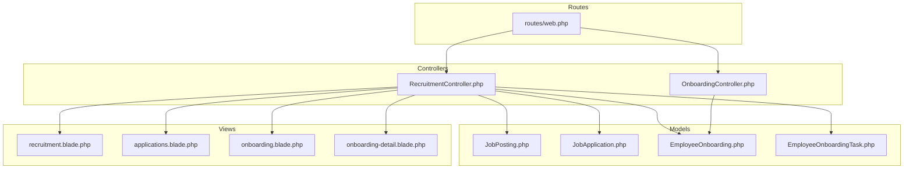
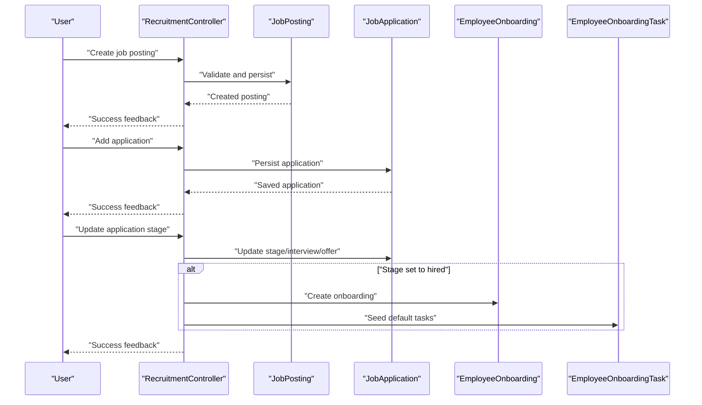
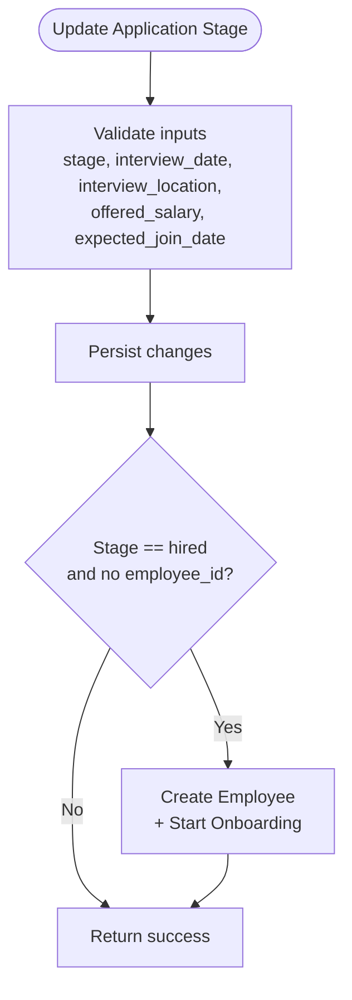
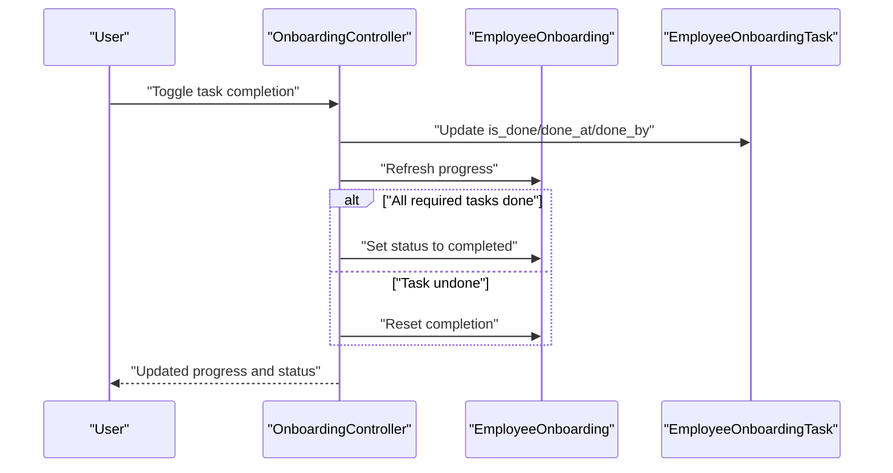
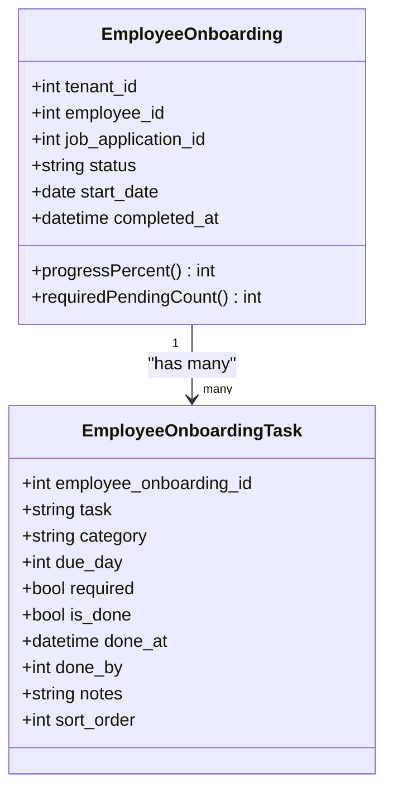
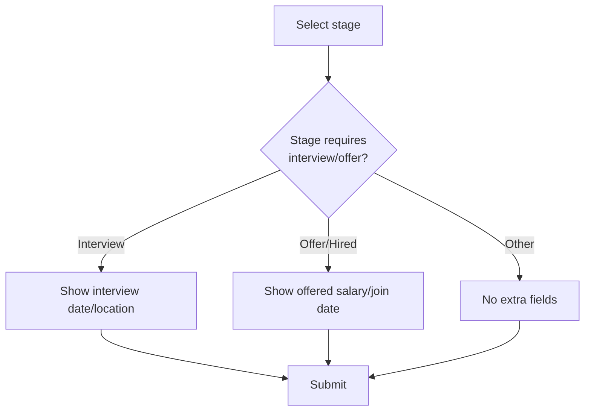
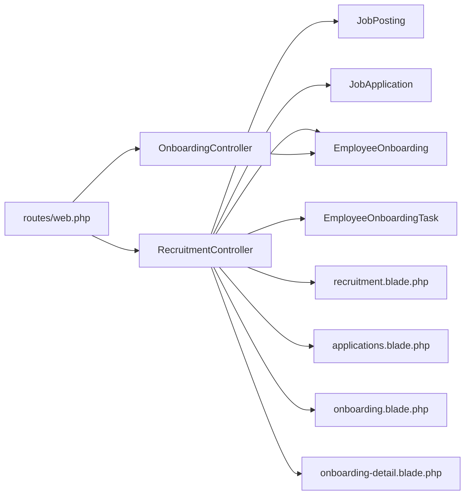

# Recruitment & Onboarding

<cite>
**Referenced Files in This Document**
- [RecruitmentController.php](file://app/Http/Controllers/RecruitmentController.php)
- [OnboardingController.php](file://app/Http/Controllers/OnboardingController.php)
- [web.php](file://routes/web.php)
- [JobPosting.php](file://app/Models/JobPosting.php)
- [JobApplication.php](file://app/Models/JobApplication.php)
- [EmployeeOnboarding.php](file://app/Models/EmployeeOnboarding.php)
- [EmployeeOnboardingTask.php](file://app/Models/EmployeeOnboardingTask.php)
- [OnboardingTools.php](file://app/Services/ERP/OnboardingTools.php)
- [recruitment.blade.php](file://resources/views/hrm/recruitment.blade.php)
- [applications.blade.php](file://resources/views/hrm/applications.blade.php)
- [onboarding.blade.php](file://resources/views/hrm/onboarding.blade.php)
- [onboarding-detail.blade.php](file://resources/views/hrm/onboarding-detail.blade.php)
</cite>

## Table of Contents
1. [Introduction](#introduction)
2. [Project Structure](#project-structure)
3. [Core Components](#core-components)
4. [Architecture Overview](#architecture-overview)
5. [Detailed Component Analysis](#detailed-component-analysis)
6. [Dependency Analysis](#dependency-analysis)
7. [Performance Considerations](#performance-considerations)
8. [Troubleshooting Guide](#troubleshooting-guide)
9. [Conclusion](#conclusion)
10. [Appendices](#appendices)

## Introduction
This document describes the Recruitment & Onboarding capabilities implemented in the system. It covers job postings, application tracking, interview scheduling, selection and hiring workflows, offer management, and onboarding preparation. It also explains onboarding tasks, orientation programs, mentor assignments, candidate communication, hiring analytics, and talent acquisition metrics. Finally, it provides examples of recruitment pipelines, onboarding checklists, and integration points with HRIS systems.

## Project Structure
The Recruitment & Onboarding feature spans controllers, models, Blade views, and routes. The primary controller orchestrates job postings, applications, and onboarding workflows. Supporting models define the domain entities. Blade templates render dashboards and forms. Routes bind URLs to controller actions.

**Diagram sources**
- [web.php:713-724](file://routes/web.php#L713-L724)
- [RecruitmentController.php:13-315](file://app/Http/Controllers/RecruitmentController.php#L13-L315)
- [OnboardingController.php:12-362](file://app/Http/Controllers/OnboardingController.php#L12-L362)
- [JobPosting.php:11-52](file://app/Models/JobPosting.php#L11-L52)
- [JobApplication.php:10-56](file://app/Models/JobApplication.php#L10-L56)
- [EmployeeOnboarding.php:11-42](file://app/Models/EmployeeOnboarding.php#L11-L42)
- [EmployeeOnboardingTask.php:8-20](file://app/Models/EmployeeOnboardingTask.php#L8-L20)
- [recruitment.blade.php:1-314](file://resources/views/hrm/recruitment.blade.php#L1-L314)
- [applications.blade.php:1-204](file://resources/views/hrm/applications.blade.php#L1-L204)
- [onboarding.blade.php:1-90](file://resources/views/hrm/onboarding.blade.php#L1-L90)
- [onboarding-detail.blade.php:1-123](file://resources/views/hrm/onboarding-detail.blade.php#L1-L123)

**Section sources**
- [web.php:713-724](file://routes/web.php#L713-L724)
- [RecruitmentController.php:13-43](file://app/Http/Controllers/RecruitmentController.php#L13-L43)
- [OnboardingController.php:12-48](file://app/Http/Controllers/OnboardingController.php#L12-L48)

## Core Components
- RecruitmentController: Manages job postings, application lifecycle, interview scheduling, offer creation, and automatic conversion to employees and onboarding initiation.
- OnboardingController: Provides onboarding setup and progress tracking for new hires.
- JobPosting: Stores job requisition metadata and labels.
- JobApplication: Tracks candidate stages, interview details, offers, and hiring outcomes.
- EmployeeOnboarding: Links a new hire to onboarding records and tracks completion.
- EmployeeOnboardingTask: Defines onboarding tasks with categories, due dates, and completion flags.
- OnboardingTools: Industry presets and automation helpers for onboarding setup.

**Section sources**
- [RecruitmentController.php:13-315](file://app/Http/Controllers/RecruitmentController.php#L13-L315)
- [OnboardingController.php:12-362](file://app/Http/Controllers/OnboardingController.php#L12-L362)
- [JobPosting.php:11-52](file://app/Models/JobPosting.php#L11-L52)
- [JobApplication.php:10-56](file://app/Models/JobApplication.php#L10-L56)
- [EmployeeOnboarding.php:11-42](file://app/Models/EmployeeOnboarding.php#L11-L42)
- [EmployeeOnboardingTask.php:8-20](file://app/Models/EmployeeOnboardingTask.php#L8-L20)
- [OnboardingTools.php:11-471](file://app/Services/ERP/OnboardingTools.php#L11-L471)

## Architecture Overview
The system follows a layered MVC pattern:
- Routes define endpoints for recruitment and onboarding.
- Controllers coordinate business logic, validate inputs, persist data, and render views.
- Models encapsulate domain entities and relationships.
- Views present dashboards and modals for interactive workflows.

**Diagram sources**
- [web.php:713-724](file://routes/web.php#L713-L724)
- [RecruitmentController.php:45-97](file://app/Http/Controllers/RecruitmentController.php#L45-L97)
- [RecruitmentController.php:118-161](file://app/Http/Controllers/RecruitmentController.php#L118-L161)
- [RecruitmentController.php:166-199](file://app/Http/Controllers/RecruitmentController.php#L166-L199)
- [RecruitmentController.php:204-237](file://app/Http/Controllers/RecruitmentController.php#L204-L237)

## Detailed Component Analysis

### Recruitment & Hiring Workflows
- Job Postings: Create, update, delete, filter by status, and list with counts.
- Application Tracking: Paginated listing per posting, stage filtering, and bulk updates.
- Interview Scheduling: Capture interview date and location per application.
- Offer Management: Capture offered salary and expected join date; auto-create employee and onboarding when promoted to hired.
- Hiring Analytics: Open postings, total applicants, scheduled interviews, and monthly hires.

**Diagram sources**
- [RecruitmentController.php:140-161](file://app/Http/Controllers/RecruitmentController.php#L140-L161)
- [RecruitmentController.php:166-199](file://app/Http/Controllers/RecruitmentController.php#L166-L199)

**Section sources**
- [RecruitmentController.php:19-43](file://app/Http/Controllers/RecruitmentController.php#L19-L43)
- [RecruitmentController.php:45-97](file://app/Http/Controllers/RecruitmentController.php#L45-L97)
- [RecruitmentController.php:101-138](file://app/Http/Controllers/RecruitmentController.php#L101-L138)
- [RecruitmentController.php:140-161](file://app/Http/Controllers/RecruitmentController.php#L140-L161)
- [RecruitmentController.php:166-199](file://app/Http/Controllers/RecruitmentController.php#L166-L199)
- [JobPosting.php:26-45](file://app/Models/JobPosting.php#L26-L45)
- [JobApplication.php:30-54](file://app/Models/JobApplication.php#L30-L54)
- [recruitment.blade.php:4-22](file://resources/views/hrm/recruitment.blade.php#L4-L22)
- [applications.blade.php:4-19](file://resources/views/hrm/applications.blade.php#L4-L19)

### Onboarding Management
- Onboarding Dashboard: Filter by status, list ongoing and completed onboarding records.
- Detail View: Group tasks by category, track progress percentage, and toggle completion.
- Task Lifecycle: Mark tasks complete/incomplete; auto-complete onboarding when required tasks finish.
- Manual Start: Create onboarding for existing employees with a start date.

**Diagram sources**
- [web.php:721-724](file://routes/web.php#L721-L724)
- [RecruitmentController.php:254-286](file://app/Http/Controllers/RecruitmentController.php#L254-L286)
- [EmployeeOnboarding.php:29-40](file://app/Models/EmployeeOnboarding.php#L29-L40)
- [EmployeeOnboardingTask.php:10-15](file://app/Models/EmployeeOnboardingTask.php#L10-L15)

**Section sources**
- [RecruitmentController.php:241-259](file://app/Http/Controllers/RecruitmentController.php#L241-L259)
- [RecruitmentController.php:261-286](file://app/Http/Controllers/RecruitmentController.php#L261-L286)
- [RecruitmentController.php:288-313](file://app/Http/Controllers/RecruitmentController.php#L288-L313)
- [onboarding.blade.php:4-15](file://resources/views/hrm/onboarding.blade.php#L4-L15)
- [onboarding-detail.blade.php:4-34](file://resources/views/hrm/onboarding-detail.blade.php#L4-L34)
- [onboarding-detail.blade.php:40-77](file://resources/views/hrm/onboarding-detail.blade.php#L40-L77)

### Onboarding Tasks and Orientation
Default onboarding tasks are seeded upon hiring, grouped by categories:
- Administrative: contract signing, document collection, health insurance registration, tax registration, bank account setup.
- IT & Access: company email, ERP/system access, device provisioning.
- Orientation: team intro, company values, policies, office tour.
- Training: ERP training, safety training.
- Evaluation: first-week check-in, probation evaluation.

**Diagram sources**
- [EmployeeOnboarding.php:11-42](file://app/Models/EmployeeOnboarding.php#L11-L42)
- [EmployeeOnboardingTask.php:8-20](file://app/Models/EmployeeOnboardingTask.php#L8-L20)

**Section sources**
- [RecruitmentController.php:204-237](file://app/Http/Controllers/RecruitmentController.php#L204-L237)

### Candidate Communication and UI
- Modals for adding applications and updating stages with dynamic fields based on selected stage.
- Stage badges and labels for visual status tracking.
- Interview scheduling fields appear conditionally when moving to the interview stage.
- Offer fields appear when moving to offer/hired stages.

**Diagram sources**
- [applications.blade.php:127-168](file://resources/views/hrm/applications.blade.php#L127-L168)
- [applications.blade.php:197-200](file://resources/views/hrm/applications.blade.php#L197-L200)

**Section sources**
- [applications.blade.php:82-115](file://resources/views/hrm/applications.blade.php#L82-L115)
- [applications.blade.php:117-180](file://resources/views/hrm/applications.blade.php#L117-L180)
- [applications.blade.php:182-202](file://resources/views/hrm/applications.blade.php#L182-L202)

### Background Checks and Offer Management
- Offer management: captured during application stage updates, including offered salary and expected join date.
- Automatic employee creation and onboarding initiation when stage transitions to hired.
- Background checks are not modeled in the current code; integration would require extending the application model and adding dedicated workflows.

**Section sources**
- [RecruitmentController.php:140-161](file://app/Http/Controllers/RecruitmentController.php#L140-L161)
- [RecruitmentController.php:166-199](file://app/Http/Controllers/RecruitmentController.php#L166-L199)

### Integration with HRIS Systems
- OnboardingTools provides industry-specific templates and automation helpers that can guide HRIS integrations.
- The system supports generating sample data and applying presets aligned with typical HRIS onboarding flows.

**Section sources**
- [OnboardingTools.php:167-241](file://app/Services/ERP/OnboardingTools.php#L167-L241)
- [OnboardingTools.php:334-441](file://app/Services/ERP/OnboardingTools.php#L334-L441)

## Dependency Analysis
- Controllers depend on models for persistence and onboarding seeding.
- Views depend on controller-provided data and route helpers.
- Routes bind UI actions to controller methods.

**Diagram sources**
- [web.php:713-724](file://routes/web.php#L713-L724)
- [RecruitmentController.php:13-315](file://app/Http/Controllers/RecruitmentController.php#L13-L315)
- [OnboardingController.php:12-362](file://app/Http/Controllers/OnboardingController.php#L12-L362)
- [JobPosting.php:11-52](file://app/Models/JobPosting.php#L11-L52)
- [JobApplication.php:10-56](file://app/Models/JobApplication.php#L10-L56)
- [EmployeeOnboarding.php:11-42](file://app/Models/EmployeeOnboarding.php#L11-L42)
- [EmployeeOnboardingTask.php:8-20](file://app/Models/EmployeeOnboardingTask.php#L8-L20)
- [recruitment.blade.php:1-314](file://resources/views/hrm/recruitment.blade.php#L1-L314)
- [applications.blade.php:1-204](file://resources/views/hrm/applications.blade.php#L1-L204)
- [onboarding.blade.php:1-90](file://resources/views/hrm/onboarding.blade.php#L1-L90)
- [onboarding-detail.blade.php:1-123](file://resources/views/hrm/onboarding-detail.blade.php#L1-L123)

**Section sources**
- [web.php:713-724](file://routes/web.php#L713-L724)
- [RecruitmentController.php:13-315](file://app/Http/Controllers/RecruitmentController.php#L13-L315)
- [OnboardingController.php:12-362](file://app/Http/Controllers/OnboardingController.php#L12-L362)

## Performance Considerations
- Use pagination for listings (postings, applications, onboarding) to limit payload sizes.
- Apply selective eager loading (with counts) to reduce N+1 queries.
- Keep stage filters and status toggles efficient with indexed tenant_id and stage fields.
- Debounce UI interactions for task toggling to avoid excessive AJAX calls.

## Troubleshooting Guide
- Authorization: Controllers enforce tenant scoping via tenant_id checks; ensure requests originate from the correct tenant context.
- Duplicate Onboarding: Prevent multiple active onboarding records per employee; the system blocks duplicates when attempting to start onboarding for an employee who already has an active record.
- Required Tasks: Onboarding auto-completes only when all required tasks are marked done; if stuck, review required flags and completion timestamps.

**Section sources**
- [RecruitmentController.php:72-72](file://app/Http/Controllers/RecruitmentController.php#L72-L72)
- [RecruitmentController.php:296-301](file://app/Http/Controllers/RecruitmentController.php#L296-L301)
- [EmployeeOnboarding.php:37-40](file://app/Models/EmployeeOnboarding.php#L37-L40)

## Conclusion
The system provides a complete Recruitment & Onboarding solution with job posting management, application tracking, interview scheduling, offer handling, and automated onboarding workflows. The modular design allows for future enhancements such as background checks, advanced analytics, and deeper HRIS integrations.

## Appendices

### Examples and Templates

- Recruitment Pipeline Example
  - Job Posting: Create, publish, and monitor applications.
  - Application Pipeline: applied → screening → interview → offer → hired.
  - Hiring Analytics: Track open positions, total applicants, scheduled interviews, and monthly hires.

- Onboarding Checklist Example
  - Day 1: Contract signing, document collection, email/ERP access, equipment provisioning.
  - Day 3: Health and labor insurance registration, bank account setup.
  - Day 5: ERP training.
  - Day 7: Safety training, first-week check-in.
  - Day 30: Probation evaluation.

- Integration with HRIS Systems
  - Use OnboardingTools to apply industry templates and generate sample data aligned with HRIS onboarding flows.
  - Extend the application model to capture background check status and integrate external services.

**Section sources**
- [recruitment.blade.php:4-22](file://resources/views/hrm/recruitment.blade.php#L4-L22)
- [applications.blade.php:4-19](file://resources/views/hrm/applications.blade.php#L4-L19)
- [RecruitmentController.php:204-237](file://app/Http/Controllers/RecruitmentController.php#L204-L237)
- [OnboardingTools.php:167-241](file://app/Services/ERP/OnboardingTools.php#L167-L241)
- [OnboardingTools.php:334-441](file://app/Services/ERP/OnboardingTools.php#L334-L441)