# Training & Development

<cite>
**Referenced Files in This Document**
- [TrainingController.php](file://app/Http/Controllers/TrainingController.php)
- [TrainingProgram.php](file://app/Models/TrainingProgram.php)
- [TrainingSession.php](file://app/Models/TrainingSession.php)
- [TrainingParticipant.php](file://app/Models/TrainingParticipant.php)
- [EmployeeCertification.php](file://app/Models/EmployeeCertification.php)
- [Employee.php](file://app/Models/Employee.php)
- [2026_03_24_000004_create_training_tables.php](file://database/migrations/2026_03_24_000004_create_training_tables.php)
- [training.blade.php](file://resources/views/hrm/training.blade.php)
- [training-session.blade.php](file://resources/views/hrm/training-session.blade.php)
- [web.php](file://routes/web.php)
- [TenantDemoSeeder.php](file://database/seeders/TenantDemoSeeder.php)
</cite>

## Table of Contents
1. [Introduction](#introduction)
2. [Project Structure](#project-structure)
3. [Core Components](#core-components)
4. [Architecture Overview](#architecture-overview)
5. [Detailed Component Analysis](#detailed-component-analysis)
6. [Dependency Analysis](#dependency-analysis)
7. [Performance Considerations](#performance-considerations)
8. [Troubleshooting Guide](#troubleshooting-guide)
9. [Conclusion](#conclusion)
10. [Appendices](#appendices)

## Introduction
This document describes the Training & Development module within the qalcuityERP system. It covers skill assessments, training program management, and learning tracking; course catalogs, instructor assignments, and session scheduling; competency frameworks, certification tracking, and professional development plans; training delivery methods, virtual classrooms, and assessment tools; learning analytics, completion tracking, and ROI measurement; and practical examples of training workflows, participant management, and compliance training requirements.

## Project Structure
The Training & Development domain is implemented as a cohesive set of models, controller actions, Blade views, and database migrations under the HRM (Human Resource Management) domain. Routes are grouped under a dedicated prefix for training and certifications.

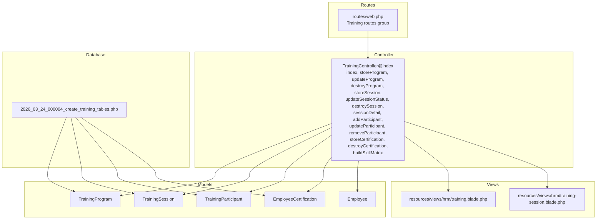

**Diagram sources**
- [web.php:779-797](file://routes/web.php#L779-L797)
- [TrainingController.php:19-74](file://app/Http/Controllers/TrainingController.php#L19-L74)
- [TrainingProgram.php:11-26](file://app/Models/TrainingProgram.php#L11-L26)
- [TrainingSession.php:11-26](file://app/Models/TrainingSession.php#L11-L26)
- [TrainingParticipant.php:10-18](file://app/Models/TrainingParticipant.php#L10-L18)
- [EmployeeCertification.php:11-24](file://app/Models/EmployeeCertification.php#L11-L24)
- [training.blade.php:1-458](file://resources/views/hrm/training.blade.php#L1-L458)
- [training-session.blade.php:1-149](file://resources/views/hrm/training-session.blade.php#L1-L149)
- [2026_03_24_000004_create_training_tables.php:11-84](file://database/migrations/2026_03_24_000004_create_training_tables.php#L11-L84)

**Section sources**
- [web.php:779-797](file://routes/web.php#L779-L797)
- [TrainingController.php:19-74](file://app/Http/Controllers/TrainingController.php#L19-L74)
- [2026_03_24_000004_create_training_tables.php:11-84](file://database/migrations/2026_03_24_000004_create_training_tables.php#L11-L84)

## Core Components
- TrainingProgram: Catalog of training programs with metadata (category, provider, duration, cost) and lifecycle (is_active).
- TrainingSession: Scheduled sessions linked to a program, with dates, location, trainer, capacity, status, and notes.
- TrainingParticipant: Tracks participant enrollment, attendance, assessment score, and status per session.
- EmployeeCertification: Manages employee certifications with issuer, issue/expiry dates, status, optional file attachment, and derived expiry badges.
- TrainingController: Orchestrates CRUD operations for programs, sessions, participants, and certifications; exposes summary statistics and skill matrix.

Key capabilities:
- Course catalogs and categories
- Session scheduling and capacity management
- Participant registration and status tracking
- Assessment scoring and pass/fail outcomes
- Certification lifecycle and expiry monitoring
- Skill matrix aggregation by department and category
- Upload and retrieval of certification documents

**Section sources**
- [TrainingProgram.php:11-26](file://app/Models/TrainingProgram.php#L11-L26)
- [TrainingSession.php:11-33](file://app/Models/TrainingSession.php#L11-L33)
- [TrainingParticipant.php:10-18](file://app/Models/TrainingParticipant.php#L10-L18)
- [EmployeeCertification.php:11-51](file://app/Models/EmployeeCertification.php#L11-L51)
- [TrainingController.php:78-271](file://app/Http/Controllers/TrainingController.php#L78-L271)

## Architecture Overview
The system follows a layered MVC pattern:
- Routes define endpoints for training and certifications.
- Controller handles requests, validates inputs, orchestrates model updates, and renders views.
- Models encapsulate domain logic (e.g., session capacity checks, certification status synchronization).
- Views render dashboards, forms, and lists for training sessions, programs, participants, and certifications.
- Database migrations define normalized tables with tenant scoping and appropriate indexes.

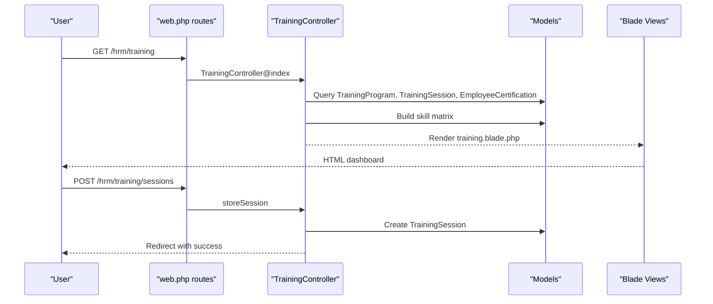

**Diagram sources**
- [web.php:779-797](file://routes/web.php#L779-L797)
- [TrainingController.php:19-132](file://app/Http/Controllers/TrainingController.php#L19-L132)
- [TrainingSession.php:11-26](file://app/Models/TrainingSession.php#L11-L26)
- [training.blade.php:40-154](file://resources/views/hrm/training.blade.php#L40-L154)

**Section sources**
- [web.php:779-797](file://routes/web.php#L779-L797)
- [TrainingController.php:19-132](file://app/Http/Controllers/TrainingController.php#L19-L132)
- [training.blade.php:40-154](file://resources/views/hrm/training.blade.php#L40-L154)

## Detailed Component Analysis

### Training Program Management
- Purpose: Maintain a catalog of training programs with category, provider, duration, cost, and activation flag.
- Operations:
  - Create/update/disable programs via controller actions.
  - Filter active programs for session creation.
- UI: Add/edit program form and list view with actions.

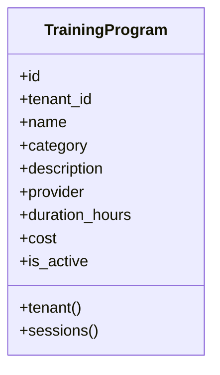

**Diagram sources**
- [TrainingProgram.php:11-26](file://app/Models/TrainingProgram.php#L11-L26)
- [2026_03_24_000004_create_training_tables.php:12-26](file://database/migrations/2026_03_24_000004_create_training_tables.php#L12-L26)

**Section sources**
- [TrainingController.php:78-114](file://app/Http/Controllers/TrainingController.php#L78-L114)
- [training.blade.php:302-397](file://resources/views/hrm/training.blade.php#L302-L397)
- [2026_03_24_000004_create_training_tables.php:12-26](file://database/migrations/2026_03_24_000004_create_training_tables.php#L12-L26)

### Session Scheduling and Instructor Assignment
- Purpose: Schedule sessions against a program, assign trainer/instructor, manage capacity, and track status.
- Operations:
  - Create sessions with date range, location, trainer, max participants, and status.
  - Update session status (scheduled, ongoing, completed, cancelled).
  - Capacity checks prevent over-registration.
- UI: Scheduler form and session list with participant counts and status badges.

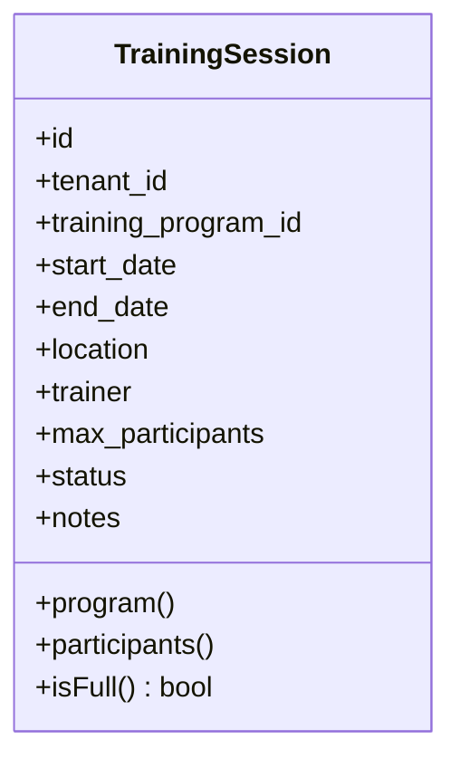

**Diagram sources**
- [TrainingSession.php:11-33](file://app/Models/TrainingSession.php#L11-L33)
- [2026_03_24_000004_create_training_tables.php:29-45](file://database/migrations/2026_03_24_000004_create_training_tables.php#L29-L45)

**Section sources**
- [TrainingController.php:118-147](file://app/Http/Controllers/TrainingController.php#L118-L147)
- [training.blade.php:44-153](file://resources/views/hrm/training.blade.php#L44-L153)
- [TrainingSession.php:28-32](file://app/Models/TrainingSession.php#L28-L32)

### Participant Management and Assessment Tools
- Purpose: Register participants, update attendance/status, capture scores, and remove participants.
- Operations:
  - Enroll employees into sessions with capacity validation.
  - Update participant status (registered, attended, passed, failed, absent).
  - Set numeric scores (0–100) per participant.
- UI: Session detail view with participant list, inline status/score updates, and removal controls.

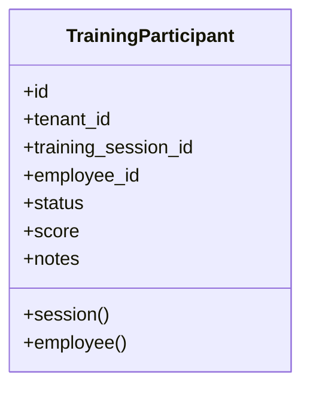

**Diagram sources**
- [TrainingParticipant.php:10-18](file://app/Models/TrainingParticipant.php#L10-L18)
- [2026_03_24_000004_create_training_tables.php:47-63](file://database/migrations/2026_03_24_000004_create_training_tables.php#L47-L63)

**Section sources**
- [TrainingController.php:151-199](file://app/Http/Controllers/TrainingController.php#L151-L199)
- [training-session.blade.php:74-146](file://resources/views/hrm/training-session.blade.php#L74-L146)
- [TrainingParticipant.php:10-18](file://app/Models/TrainingParticipant.php#L10-L18)

### Certification Tracking and Compliance
- Purpose: Track employee certifications, issuer, issue/expiry dates, status, and optional document uploads.
- Operations:
  - Create certifications with auto-status based on expiry.
  - Delete certifications and remove uploaded files.
  - Automatic status sync to expired when expiry date passes.
  - Expiry badge classification and countdown display.
- UI: Certification add form and paginated list with filters (all, expiring soon, expired).

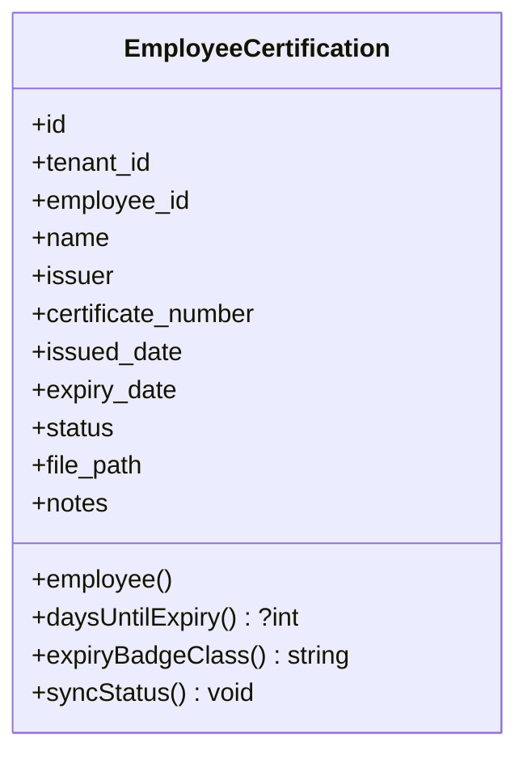

**Diagram sources**
- [EmployeeCertification.php:11-51](file://app/Models/EmployeeCertification.php#L11-L51)
- [2026_03_24_000004_create_training_tables.php:65-84](file://database/migrations/2026_03_24_000004_create_training_tables.php#L65-L84)

**Section sources**
- [TrainingController.php:203-244](file://app/Http/Controllers/TrainingController.php#L203-L244)
- [training.blade.php:157-299](file://resources/views/hrm/training.blade.php#L157-L299)
- [EmployeeCertification.php:26-50](file://app/Models/EmployeeCertification.php#L26-L50)

### Learning Analytics and Skill Matrix
- Purpose: Aggregate training outcomes by department and category to visualize competency distribution.
- Operations:
  - Build skill matrix from passed participants, joining employees, sessions, and programs.
  - Group by department and category to compute counts.
- UI: Dedicated tab displaying counts per category and totals per department.

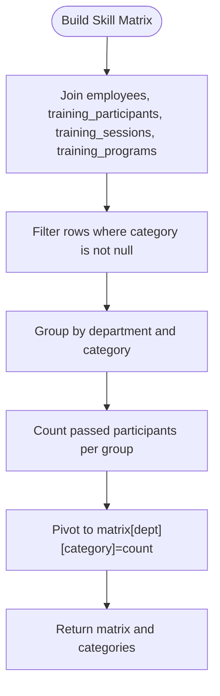

**Diagram sources**
- [TrainingController.php:248-269](file://app/Http/Controllers/TrainingController.php#L248-L269)

**Section sources**
- [TrainingController.php:248-269](file://app/Http/Controllers/TrainingController.php#L248-L269)
- [training.blade.php:399-455](file://resources/views/hrm/training.blade.php#L399-L455)

### Training Delivery Methods and Virtual Classrooms
- Current implementation supports in-person and hybrid delivery via session location and trainer fields.
- Virtual classroom capability is not present in the current schema or controller actions; future enhancements could include:
  - Online session flag and virtual room links.
  - Integration hooks for third-party platforms.
  - Attendance tracking for virtual sessions.

[No sources needed since this section provides general guidance]

### Assessment Tools and Completion Tracking
- Numeric scoring (0–100) and categorical statuses enable completion tracking and pass/fail determination.
- Status transitions (registered → attended → passed/failed → absent) support assessment workflows.
- Completion tracking is implicit via “passed” status and can be used for ROI calculations.

**Section sources**
- [TrainingController.php:182-192](file://app/Http/Controllers/TrainingController.php#L182-L192)
- [TrainingParticipant.php:10-18](file://app/Models/TrainingParticipant.php#L10-L18)

### Professional Development Plans and Competency Frameworks
- Competency frameworks can be modeled using:
  - Program categories (e.g., technical, soft skills, safety, ISO).
  - Skill matrix aggregations by department and category.
- Professional development plans can reference:
  - Employee certifications and training history.
  - Career progression indicators (e.g., performance trends) from HRM AI insights.

**Section sources**
- [TrainingProgram.php:14-16](file://app/Models/TrainingProgram.php#L14-L16)
- [TrainingController.php:248-269](file://app/Http/Controllers/TrainingController.php#L248-L269)

### Examples of Training Workflows

#### Workflow 1: Create a Training Program
- Steps:
  - Navigate to Programs tab.
  - Submit program details (name, category, provider, duration, cost).
  - Program becomes available for session scheduling.

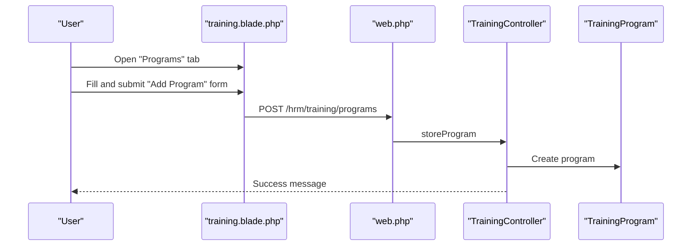

**Diagram sources**
- [training.blade.php:302-342](file://resources/views/hrm/training.blade.php#L302-L342)
- [web.php:781-784](file://routes/web.php#L781-L784)
- [TrainingController.php:78-91](file://app/Http/Controllers/TrainingController.php#L78-L91)
- [TrainingProgram.php:11-26](file://app/Models/TrainingProgram.php#L11-L26)

#### Workflow 2: Schedule a Session and Assign Trainer
- Steps:
  - Select an active program.
  - Enter session dates, location, trainer, and capacity.
  - Review scheduled sessions list.

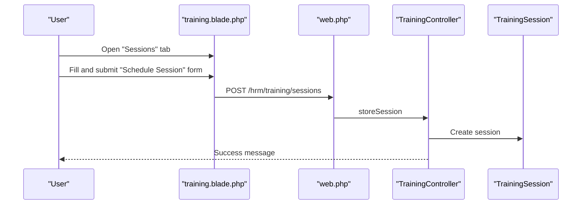

**Diagram sources**
- [training.blade.php:44-88](file://resources/views/hrm/training.blade.php#L44-L88)
- [web.php:785-789](file://routes/web.php#L785-L789)
- [TrainingController.php:118-132](file://app/Http/Controllers/TrainingController.php#L118-L132)
- [TrainingSession.php:11-26](file://app/Models/TrainingSession.php#L11-L26)

#### Workflow 3: Manage Participants and Assessments
- Steps:
  - Open session detail.
  - Add participants ensuring capacity allows.
  - Update participant status and scores.
  - Remove participants if needed.

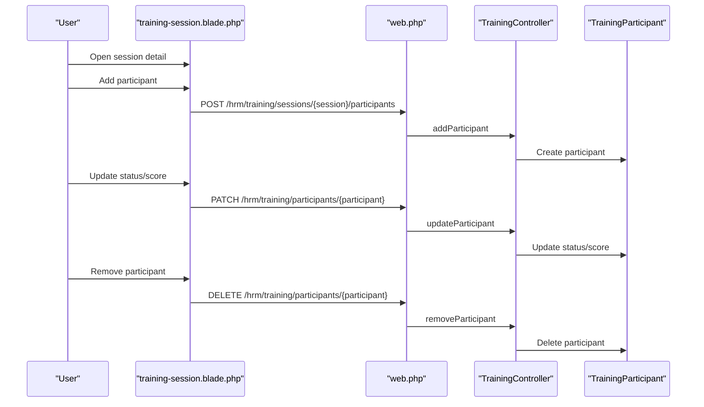

**Diagram sources**
- [training-session.blade.php:45-146](file://resources/views/hrm/training-session.blade.php#L45-L146)
- [web.php:789-793](file://routes/web.php#L789-L793)
- [TrainingController.php:165-199](file://app/Http/Controllers/TrainingController.php#L165-L199)
- [TrainingParticipant.php:10-18](file://app/Models/TrainingParticipant.php#L10-L18)

#### Workflow 4: Track Certifications and Expirations
- Steps:
  - Add employee certifications with issuer, issue/expiry dates.
  - Use filters to view expiring/expired certificates.
  - Download scanned documents if attached.

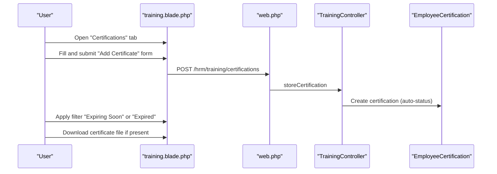

**Diagram sources**
- [training.blade.php:160-299](file://resources/views/hrm/training.blade.php#L160-L299)
- [web.php:794-796](file://routes/web.php#L794-L796)
- [TrainingController.php:203-244](file://app/Http/Controllers/TrainingController.php#L203-L244)
- [EmployeeCertification.php:11-51](file://app/Models/EmployeeCertification.php#L11-L51)

#### Workflow 5: Compliance Training Requirements
- Steps:
  - Define program categories aligned with compliance domains (e.g., safety, ISO).
  - Enroll employees into compliance sessions.
  - Track completion via “passed” status.
  - Monitor expiring certifications to maintain compliance.

**Section sources**
- [TrainingProgram.php:14-16](file://app/Models/TrainingProgram.php#L14-L16)
- [TrainingController.php:203-244](file://app/Http/Controllers/TrainingController.php#L203-L244)

## Dependency Analysis
- Controller depends on models for data access and validation.
- Views depend on controller-provided data (lists, summaries, matrices).
- Migrations define foreign keys and indexes to maintain referential integrity and performance.
- Tenant scoping ensures multi-tenancy isolation across training entities.

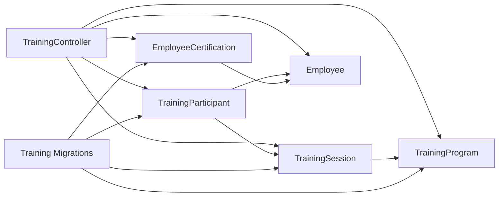

**Diagram sources**
- [TrainingController.php:5-11](file://app/Http/Controllers/TrainingController.php#L5-L11)
- [TrainingProgram.php:11-26](file://app/Models/TrainingProgram.php#L11-L26)
- [TrainingSession.php:11-26](file://app/Models/TrainingSession.php#L11-L26)
- [TrainingParticipant.php:10-18](file://app/Models/TrainingParticipant.php#L10-L18)
- [EmployeeCertification.php:11-24](file://app/Models/EmployeeCertification.php#L11-L24)
- [2026_03_24_000004_create_training_tables.php:11-84](file://database/migrations/2026_03_24_000004_create_training_tables.php#L11-L84)

**Section sources**
- [TrainingController.php:5-11](file://app/Http/Controllers/TrainingController.php#L5-L11)
- [2026_03_24_000004_create_training_tables.php:11-84](file://database/migrations/2026_03_24_000004_create_training_tables.php#L11-L84)

## Performance Considerations
- Indexes on tenant-scoped fields and frequently filtered columns (e.g., category, expiry_date, status) improve query performance.
- Pagination is used for sessions and certifications to limit result sets.
- Aggregation queries for skill matrix join multiple tables; ensure appropriate indexing exists for joins and grouping.

[No sources needed since this section provides general guidance]

## Troubleshooting Guide
Common issues and resolutions:
- Capacity exceeded when adding participants:
  - The system prevents enrollment if the session is at maximum capacity. Reduce max_participants or cancel spots.
- Invalid status transitions:
  - Ensure status values match allowed enums (registered, attended, passed, failed, absent).
- Expiration handling:
  - Certifications automatically update to expired when expiry date passes; verify dates and statuses periodically.
- File upload errors:
  - Ensure file types and sizes conform to validation rules (PDF/JPG/JPEG/PNG, max size) and storage permissions are configured.

**Section sources**
- [TrainingController.php:170-172](file://app/Http/Controllers/TrainingController.php#L170-L172)
- [TrainingController.php:182-192](file://app/Http/Controllers/TrainingController.php#L182-L192)
- [EmployeeCertification.php:44-50](file://app/Models/EmployeeCertification.php#L44-L50)
- [TrainingController.php:203-244](file://app/Http/Controllers/TrainingController.php#L203-L244)

## Conclusion
The Training & Development module provides a robust foundation for managing training programs, scheduling sessions, tracking participants, and maintaining certifications. Its tenant-aware design, skill matrix reporting, and certification lifecycle management support scalable HR training operations. Future enhancements can extend virtual classroom capabilities and integrate advanced analytics for ROI measurement.

## Appendices

### Data Model Diagram
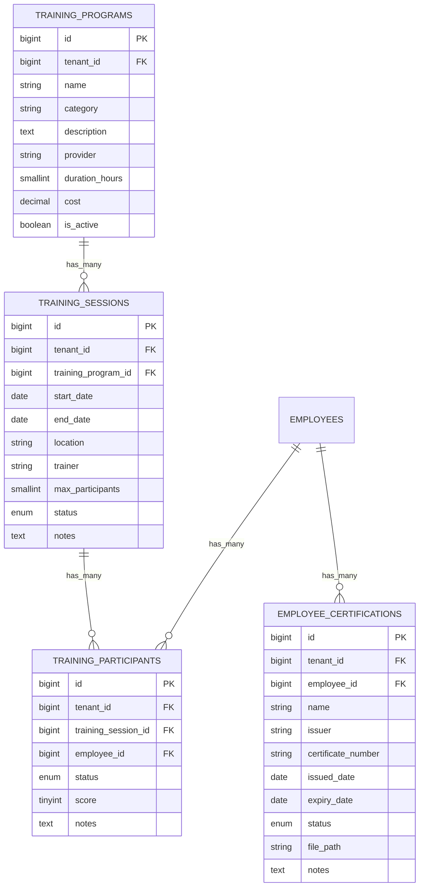

**Diagram sources**
- [2026_03_24_000004_create_training_tables.php:12-84](file://database/migrations/2026_03_24_000004_create_training_tables.php#L12-L84)
- [TrainingProgram.php:11-26](file://app/Models/TrainingProgram.php#L11-L26)
- [TrainingSession.php:11-26](file://app/Models/TrainingSession.php#L11-L26)
- [TrainingParticipant.php:10-18](file://app/Models/TrainingParticipant.php#L10-L18)
- [EmployeeCertification.php:11-24](file://app/Models/EmployeeCertification.php#L11-L24)

### Demo Seed References
- Example program, session, and certification entries are inserted during tenant demo seeding, demonstrating typical training workflows.

**Section sources**
- [TenantDemoSeeder.php:740-791](file://database/seeders/TenantDemoSeeder.php#L740-L791)