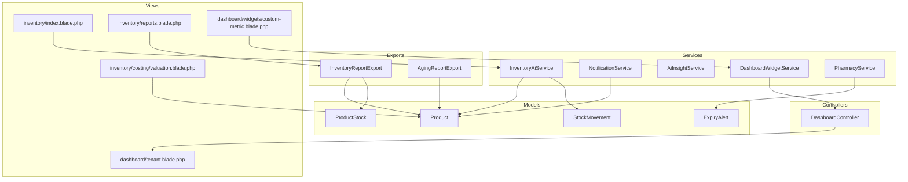
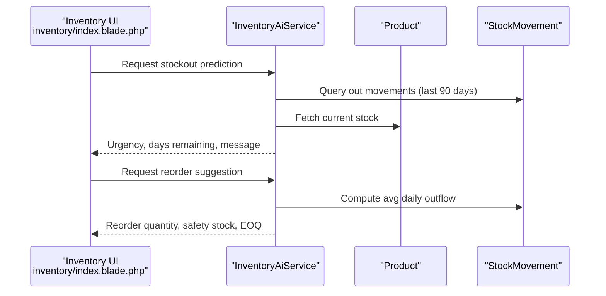
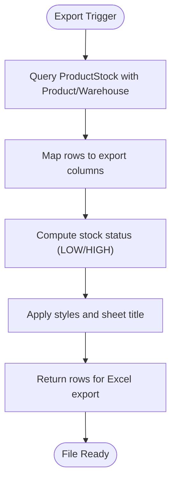
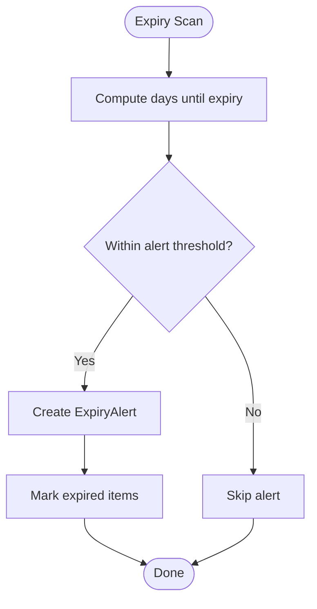
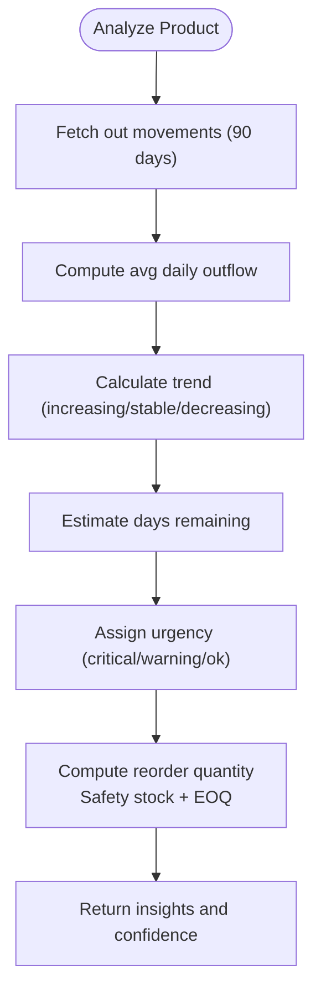
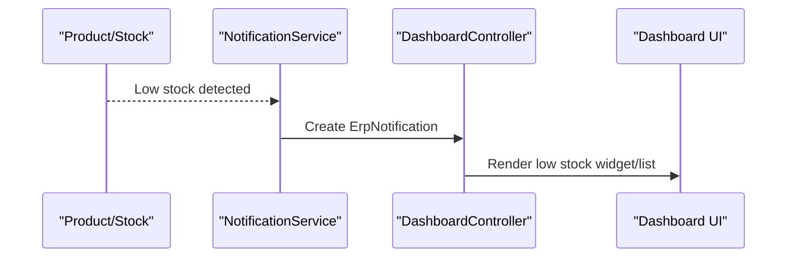
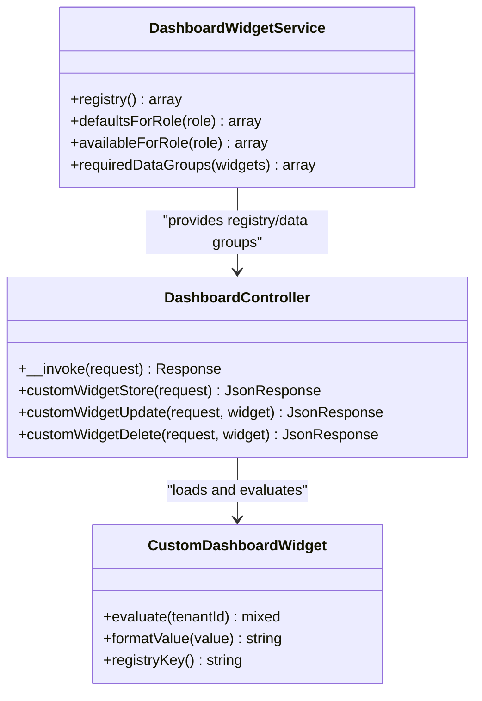
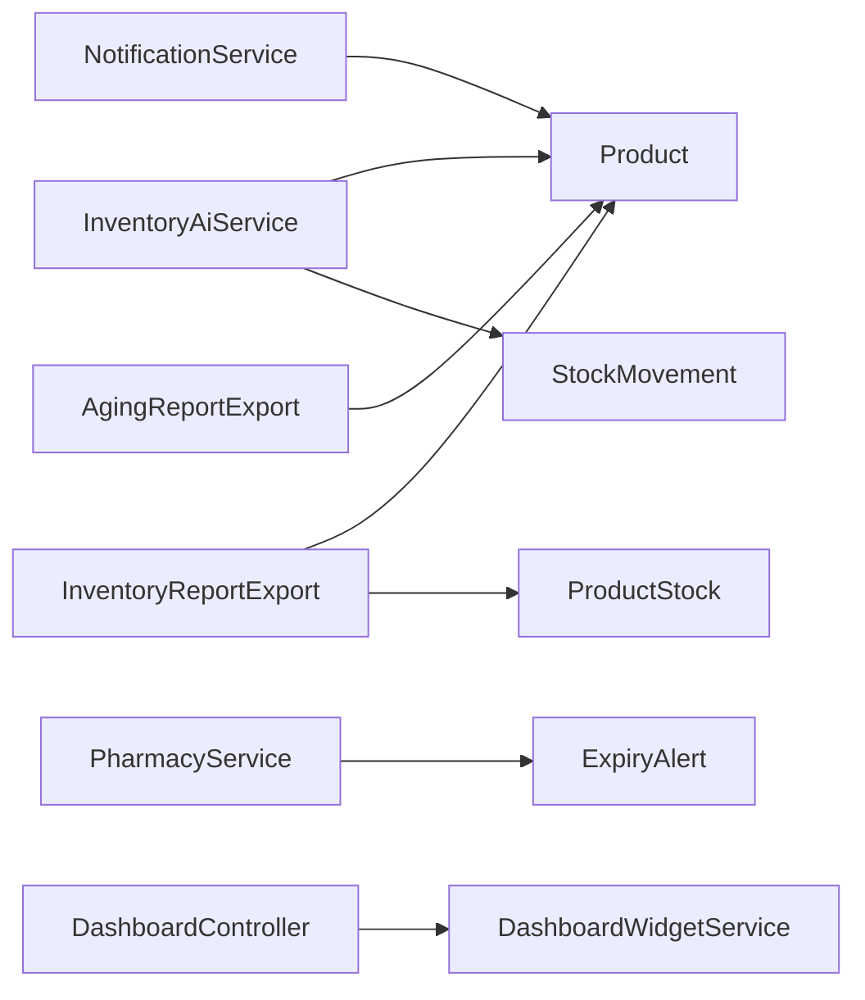

# Inventory Analytics & Reporting

<cite>
**Referenced Files in This Document**
- [InventoryAiService.php](file://app/Services/InventoryAiService.php)
- [InventoryReportExport.php](file://app/Exports/InventoryReportExport.php)
- [AgingReportExport.php](file://app/Exports/AgingReportExport.php)
- [InventoryReportExport.php](file://app/Exports/InventoryReportExport.php)
- [DashboardWidgetService.php](file://app/Services/DashboardWidgetService.php)
- [DashboardController.php](file://app/Http/Controllers/DashboardController.php)
- [2026_04_03_000001_create_custom_dashboard_widgets_table.php](file://database/migrations/2026_04_03_000001_create_custom_dashboard_widgets_table.php)
- [StockMovement.php](file://app/Models/StockMovement.php)
- [Product.php](file://app/Models/Product.php)
- [ProductStock.php](file://app/Models/ProductStock.php)
- [ExpiryAlert.php](file://app/Models/ExpiryAlert.php)
- [NotificationService.php](file://app/Services/NotificationService.php)
- [PharmacyService.php](file://app/Services/PharmacyService.php)
- [AiInsightService.php](file://app/Services/AiInsightService.php)
- [inventory/index.blade.php](file://resources/views/inventory/index.blade.php)
- [inventory/reports.blade.php](file://resources/views/inventory/reports.blade.php)
- [inventory/costing/valuation.blade.php](file://resources/views/inventory/costing/valuation.blade.php)
- [dashboard/tenant.blade.php](file://resources/views/dashboard/tenant.blade.php)
- [dashboard/widgets/custom-metric.blade.php](file://resources/views/dashboard/widgets/custom-metric.blade.php)
</cite>

## Table of Contents
1. [Introduction](#introduction)
2. [Project Structure](#project-structure)
3. [Core Components](#core-components)
4. [Architecture Overview](#architecture-overview)
5. [Detailed Component Analysis](#detailed-component-analysis)
6. [Dependency Analysis](#dependency-analysis)
7. [Performance Considerations](#performance-considerations)
8. [Troubleshooting Guide](#troubleshooting-guide)
9. [Conclusion](#conclusion)
10. [Appendices](#appendices)

## Introduction
This document explains the Inventory Analytics and Reporting capabilities implemented in the system. It covers stock aging reports, expiry tracking, turnover analysis, and demand forecasting. It also documents inventory performance metrics, safety stock calculations, reorder point optimization, automated alerts for low stock, expired inventory, and slow-moving items. Finally, it describes integration with business intelligence dashboards and export capabilities.

## Project Structure
The inventory analytics features are implemented across services, models, controllers, exports, and dashboard components:
- Services: InventoryAiService (stockout prediction, reorder suggestions), NotificationService (low stock alerts), AiInsightService (AI-driven insights), PharmacyService (expiry tracking), DashboardWidgetService (dashboard widgets), and others.
- Models: Product, ProductStock, StockMovement, ExpiryAlert.
- Controllers: DashboardController orchestrates dashboard data loading and caching.
- Exports: InventoryReportExport and AgingReportExport for report generation.
- Views: Inventory analytics pages, dashboard templates, and custom widget rendering.

**Diagram sources**
- [InventoryAiService.php:16-249](file://app/Services/InventoryAiService.php#L16-L249)
- [NotificationService.php:68-97](file://app/Services/NotificationService.php#L68-L97)
- [AiInsightService.php:39-66](file://app/Services/AiInsightService.php#L39-L66)
- [DashboardWidgetService.php:15-248](file://app/Services/DashboardWidgetService.php#L15-L248)
- [PharmacyService.php:197-241](file://app/Services/PharmacyService.php#L197-L241)
- [Product.php:12-71](file://app/Models/Product.php#L12-L71)
- [ProductStock.php:8-15](file://app/Models/ProductStock.php#L8-L15)
- [StockMovement.php:10-25](file://app/Models/StockMovement.php#L10-L25)
- [ExpiryAlert.php:50-103](file://app/Models/ExpiryAlert.php#L50-L103)
- [DashboardController.php:67-263](file://app/Http/Controllers/DashboardController.php#L67-L263)
- [InventoryReportExport.php:13-58](file://app/Exports/InventoryReportExport.php#L13-L58)
- [AgingReportExport.php:12-98](file://app/Exports/AgingReportExport.php#L12-L98)
- [inventory/index.blade.php:400-427](file://resources/views/inventory/index.blade.php#L400-L427)
- [inventory/reports.blade.php:1-35](file://resources/views/inventory/reports.blade.php#L1-L35)
- [inventory/costing/valuation.blade.php:37-128](file://resources/views/inventory/costing/valuation.blade.php#L37-L128)
- [dashboard/tenant.blade.php:881-913](file://resources/views/dashboard/tenant.blade.php#L881-L913)
- [dashboard/widgets/custom-metric.blade.php:1-35](file://resources/views/dashboard/widgets/custom-metric.blade.php#L1-L35)

**Section sources**
- [InventoryAiService.php:16-249](file://app/Services/InventoryAiService.php#L16-L249)
- [DashboardWidgetService.php:15-248](file://app/Services/DashboardWidgetService.php#L15-L248)
- [DashboardController.php:67-263](file://app/Http/Controllers/DashboardController.php#L67-L263)

## Core Components
- Inventory Analytics Engine (InventoryAiService): Provides stockout predictions, reorder quantity suggestions, and batch analysis for inventory tables. Uses historical stock movements to compute trends, average daily outflow, days remaining, and confidence levels.
- Expiry Management (PharmacyService and ExpiryAlert): Tracks expiring and expired inventory, marks expired items, and creates expiry alerts.
- Alerts and Notifications (NotificationService): Generates in-app notifications for low stock conditions.
- Dashboard Integration (DashboardWidgetService and DashboardController): Supplies inventory KPIs and lists to the dashboard, including low stock counts and lists.
- Reporting and Export (InventoryReportExport and AgingReportExport): Produces inventory and accounts receivable aging reports for download.
- Inventory Valuation (valuation.blade.php): Displays inventory valuation summaries and per-item values.

**Section sources**
- [InventoryAiService.php:16-249](file://app/Services/InventoryAiService.php#L16-L249)
- [PharmacyService.php:197-241](file://app/Services/PharmacyService.php#L197-L241)
- [ExpiryAlert.php:50-103](file://app/Models/ExpiryAlert.php#L50-L103)
- [NotificationService.php:68-97](file://app/Services/NotificationService.php#L68-L97)
- [DashboardWidgetService.php:54-98](file://app/Services/DashboardWidgetService.php#L54-L98)
- [DashboardController.php:84-85](file://app/Http/Controllers/DashboardController.php#L84-L85)
- [InventoryReportExport.php:13-58](file://app/Exports/InventoryReportExport.php#L13-L58)
- [AgingReportExport.php:12-98](file://app/Exports/AgingReportExport.php#L12-L98)
- [inventory/costing/valuation.blade.php:37-128](file://resources/views/inventory/costing/valuation.blade.php#L37-L128)

## Architecture Overview
The analytics pipeline integrates data from models (Product, ProductStock, StockMovement), computes insights via services, and surfaces results through the dashboard and export mechanisms.

**Diagram sources**
- [inventory/index.blade.php:417-427](file://resources/views/inventory/index.blade.php#L417-L427)
- [InventoryAiService.php:22-116](file://app/Services/InventoryAiService.php#L22-L116)
- [StockMovement.php:10-25](file://app/Models/StockMovement.php#L10-L25)
- [Product.php:12-71](file://app/Models/Product.php#L12-L71)

## Detailed Component Analysis

### Stock Aging Reports
- Purpose: Provide aging of inventory items by category or warehouse for financial and operational analysis.
- Implementation: InventoryReportExport aggregates ProductStock with product and warehouse details, mapping statuses (low/high stock) and pricing.
- Usage: Downloadable Excel export for internal review and planning.

**Diagram sources**
- [InventoryReportExport.php:17-58](file://app/Exports/InventoryReportExport.php#L17-L58)

**Section sources**
- [InventoryReportExport.php:13-58](file://app/Exports/InventoryReportExport.php#L13-L58)

### Expiry Tracking
- Purpose: Monitor products nearing expiry and mark expired items.
- Implementation: PharmacyService calculates days until expiry and triggers expiry alerts when thresholds are met. ExpiryAlert tracks alert state and severity.
- Usage: Alerts surfaced in dashboards and notification center.

**Diagram sources**
- [PharmacyService.php:197-241](file://app/Services/PharmacyService.php#L197-L241)
- [ExpiryAlert.php:50-103](file://app/Models/ExpiryAlert.php#L50-L103)

**Section sources**
- [PharmacyService.php:197-241](file://app/Services/PharmacyService.php#L197-L241)
- [ExpiryAlert.php:50-103](file://app/Models/ExpiryAlert.php#L50-L103)

### Turnover Analysis and Demand Forecasting
- Purpose: Measure inventory turnover and forecast future needs.
- Implementation: InventoryAiService computes average daily outflow, trends, and projections. Reorder suggestions incorporate lead time, safety stock, and EOQ.
- Usage: Real-time insights in inventory UI and batch analysis for tables.

**Diagram sources**
- [InventoryAiService.php:67-132](file://app/Services/InventoryAiService.php#L67-L132)
- [InventoryAiService.php:135-223](file://app/Services/InventoryAiService.php#L135-L223)

**Section sources**
- [InventoryAiService.php:67-132](file://app/Services/InventoryAiService.php#L67-L132)
- [InventoryAiService.php:135-223](file://app/Services/InventoryAiService.php#L135-L223)

### Inventory Performance Metrics
- Metrics computed:
  - Average daily outflow and monthly consumption
  - Days remaining before stockout
  - Trend direction (increasing/stable/decreasing)
  - Confidence level based on active days
  - Safety stock and reorder point derived from lead time and demand variability
  - Economic Order Quantity (EOQ) for cost optimization
- Data sources: StockMovement for outflows, Product for current quantities and metadata.

**Section sources**
- [InventoryAiService.php:67-132](file://app/Services/InventoryAiService.php#L67-L132)
- [InventoryAiService.php:135-223](file://app/Services/InventoryAiService.php#L135-L223)
- [StockMovement.php:10-25](file://app/Models/StockMovement.php#L10-L25)
- [Product.php:12-71](file://app/Models/Product.php#L12-L71)

### Automated Alerts
- Low Stock Alerts:
  - NotificationService creates in-app notifications when stock falls below minimum thresholds.
  - Alerts include product, warehouse, and current quantity for quick action.
- Expiry Alerts:
  - ExpiryAlert tracks unread/unactioned alerts with severity and critical flags.
  - PharmacyService marks expired items and triggers alerts based on configured thresholds.
- Slow-Moving Items:
  - AiInsightService detects sudden drops in sales velocity and generates insights.

**Diagram sources**
- [NotificationService.php:68-97](file://app/Services/NotificationService.php#L68-L97)
- [DashboardController.php:84-85](file://app/Http/Controllers/DashboardController.php#L84-L85)
- [dashboard/tenant.blade.php:897-913](file://resources/views/dashboard/tenant.blade.php#L897-L913)

**Section sources**
- [NotificationService.php:68-97](file://app/Services/NotificationService.php#L68-L97)
- [ExpiryAlert.php:50-103](file://app/Models/ExpiryAlert.php#L50-L103)
- [AiInsightService.php:439-741](file://app/Services/AiInsightService.php#L439-L741)

### Business Intelligence Dashboards Integration
- DashboardWidgetService defines built-in widgets for inventory KPIs (e.g., low stock counts, low stock list) and supports custom widgets.
- DashboardController loads required data groups (e.g., inventory), caches them, and renders widgets with partial views.
- Custom widgets are persisted via a dedicated migration and rendered through a custom metric widget template.

**Diagram sources**
- [DashboardWidgetService.php:15-248](file://app/Services/DashboardWidgetService.php#L15-L248)
- [DashboardController.php:67-263](file://app/Http/Controllers/DashboardController.php#L67-L263)
- [2026_04_03_000001_create_custom_dashboard_widgets_table.php:10-30](file://database/migrations/2026_04_03_000001_create_custom_dashboard_widgets_table.php#L10-L30)
- [dashboard/widgets/custom-metric.blade.php:1-35](file://resources/views/dashboard/widgets/custom-metric.blade.php#L1-L35)

**Section sources**
- [DashboardWidgetService.php:15-248](file://app/Services/DashboardWidgetService.php#L15-L248)
- [DashboardController.php:67-263](file://app/Http/Controllers/DashboardController.php#L67-L263)
- [2026_04_03_000001_create_custom_dashboard_widgets_table.php:10-30](file://database/migrations/2026_04_03_000001_create_custom_dashboard_widgets_table.php#L10-L30)
- [dashboard/widgets/custom-metric.blade.php:1-35](file://resources/views/dashboard/widgets/custom-metric.blade.php#L1-L35)

### Export Capabilities
- Inventory Report Export: Aggregates product stock, warehouse, and pricing for export.
- AR Aging Export: Builds aging buckets for receivables by customer.
- Usage: Users trigger exports from inventory and finance sections; files are generated and downloadable.

**Section sources**
- [InventoryReportExport.php:13-58](file://app/Exports/InventoryReportExport.php#L13-L58)
- [AgingReportExport.php:12-98](file://app/Exports/AgingReportExport.php#L12-L98)
- [inventory/reports.blade.php:1-35](file://resources/views/inventory/reports.blade.php#L1-L35)

## Dependency Analysis
- InventoryAiService depends on Product and StockMovement to compute analytics.
- NotificationService depends on Product and ErpNotification to emit low stock alerts.
- PharmacyService depends on ExpiryAlert and MedicineStock to manage expiry lifecycle.
- DashboardController depends on DashboardWidgetService and multiple data sources to render widgets.
- Exports depend on models to build tabular data for Excel.

**Diagram sources**
- [InventoryAiService.php:16-249](file://app/Services/InventoryAiService.php#L16-L249)
- [NotificationService.php:68-97](file://app/Services/NotificationService.php#L68-L97)
- [PharmacyService.php:197-241](file://app/Services/PharmacyService.php#L197-L241)
- [DashboardController.php:67-263](file://app/Http/Controllers/DashboardController.php#L67-L263)
- [InventoryReportExport.php:13-58](file://app/Exports/InventoryReportExport.php#L13-L58)
- [AgingReportExport.php:12-98](file://app/Exports/AgingReportExport.php#L12-L98)

**Section sources**
- [InventoryAiService.php:16-249](file://app/Services/InventoryAiService.php#L16-L249)
- [NotificationService.php:68-97](file://app/Services/NotificationService.php#L68-L97)
- [PharmacyService.php:197-241](file://app/Services/PharmacyService.php#L197-L241)
- [DashboardController.php:67-263](file://app/Http/Controllers/DashboardController.php#L67-L263)
- [InventoryReportExport.php:13-58](file://app/Exports/InventoryReportExport.php#L13-L58)
- [AgingReportExport.php:12-98](file://app/Exports/AgingReportExport.php#L12-L98)

## Performance Considerations
- Batch analysis: InventoryAiService performs a single grouped query for all products to reduce N+1 queries during table analysis.
- Caching: DashboardController caches inventory and other data groups to minimize repeated computation.
- Export efficiency: Exports use eager loading and aggregation to keep memory usage low.

[No sources needed since this section provides general guidance]

## Troubleshooting Guide
- Low stock alerts not appearing:
  - Verify NotificationService thresholds and recipient preferences.
  - Confirm ErpNotification entries are being created.
- Expiry alerts missing:
  - Check PharmacyService expiry scan runs and ExpiryAlert thresholds.
  - Ensure expired items are marked and alerts are unread/unactioned.
- Dashboard widgets show stale data:
  - Trigger the dashboard refresh endpoint to bust cache and reload insights.
- Export errors:
  - Validate model relationships and ensure required filters are applied.

**Section sources**
- [NotificationService.php:68-97](file://app/Services/NotificationService.php#L68-L97)
- [PharmacyService.php:197-241](file://app/Services/PharmacyService.php#L197-L241)
- [ExpiryAlert.php:50-103](file://app/Models/ExpiryAlert.php#L50-L103)
- [dashboard/tenant.blade.php:897-913](file://resources/views/dashboard/tenant.blade.php#L897-L913)

## Conclusion
The system provides robust inventory analytics through integrated services, models, and UI components. It offers actionable insights on stockout risk, reorder planning, expiry management, and dashboard KPIs, complemented by export capabilities for further analysis.

[No sources needed since this section summarizes without analyzing specific files]

## Appendices
- Inventory valuation summary and per-item values are presented in the valuation view.
- Inventory analytics UI exposes batch analysis and urgency badges for quick decision-making.

**Section sources**
- [inventory/costing/valuation.blade.php:37-128](file://resources/views/inventory/costing/valuation.blade.php#L37-L128)
- [inventory/index.blade.php:400-427](file://resources/views/inventory/index.blade.php#L400-L427)