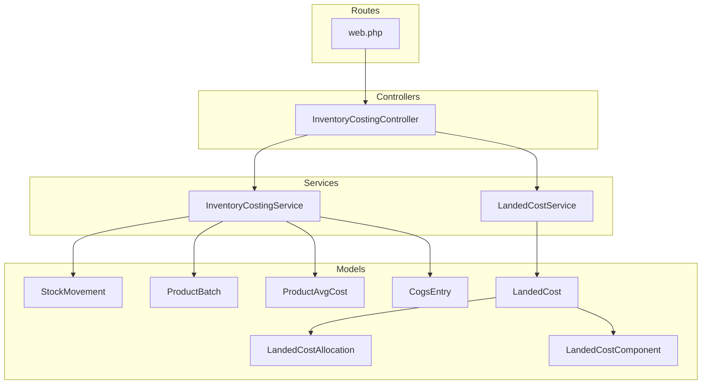
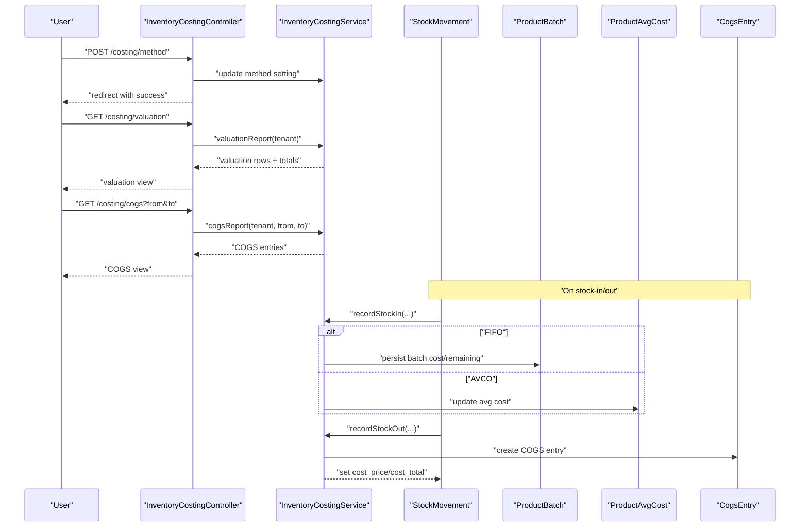
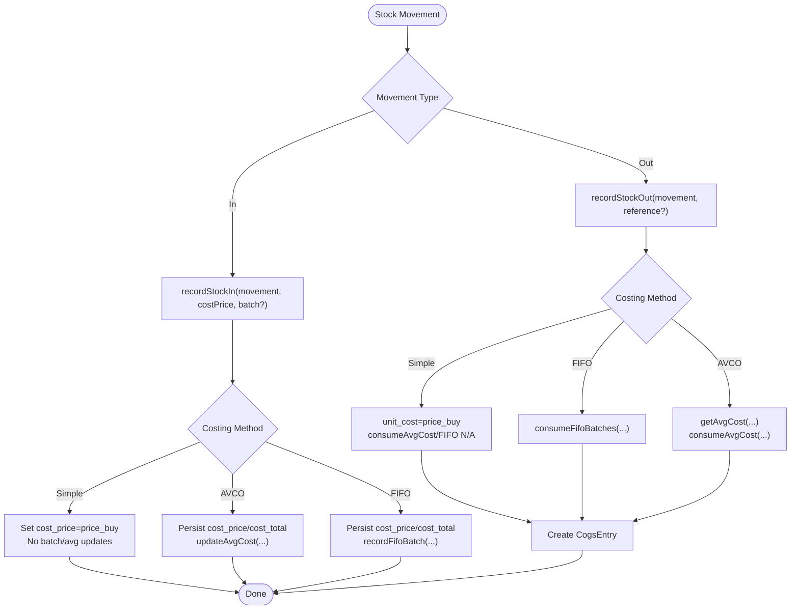
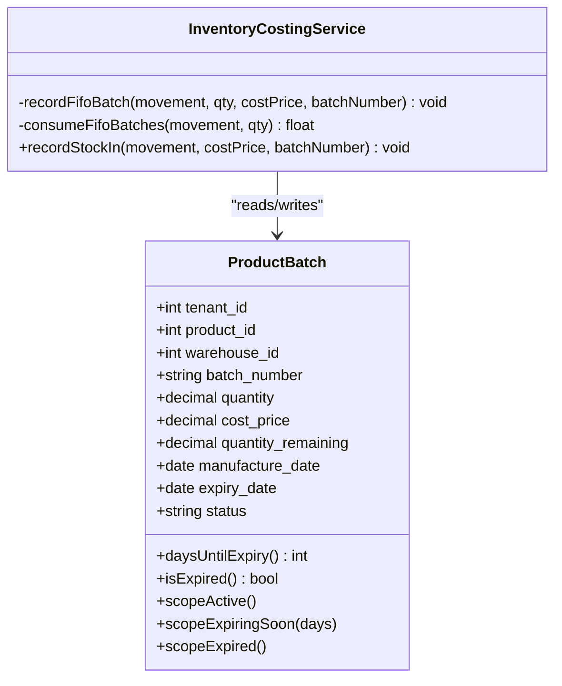
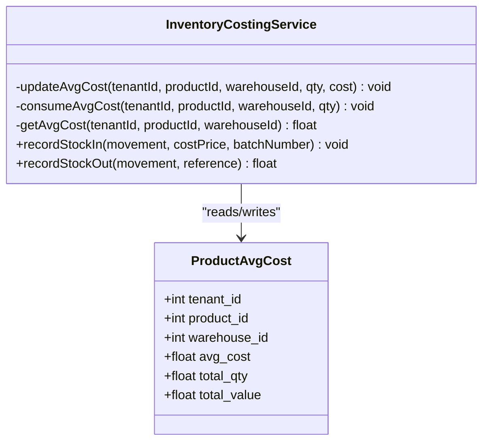
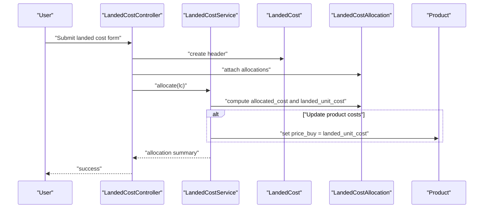
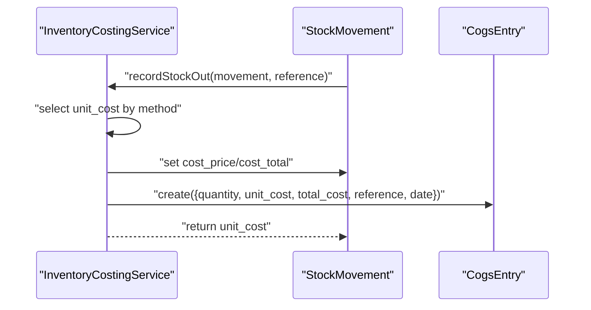
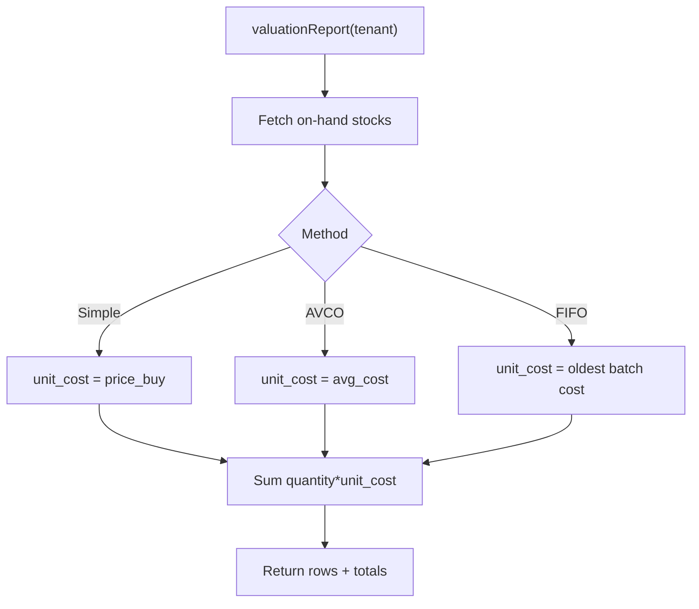
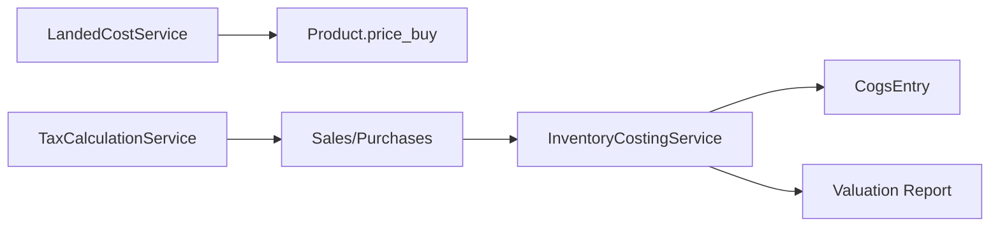
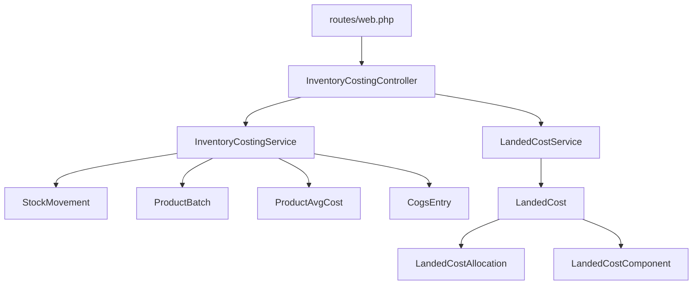

# Inventory Costing & Valuation

<cite>
**Referenced Files in This Document**
- [InventoryCostingService.php](file://app/Services/InventoryCostingService.php)
- [InventoryCostingController.php](file://app/Http/Controllers/InventoryCostingController.php)
- [LandedCostService.php](file://app/Services/LandedCostService.php)
- [LandedCost.php](file://app/Models/LandedCost.php)
- [LandedCostAllocation.php](file://app/Models/LandedCostAllocation.php)
- [LandedCostComponent.php](file://app/Models/LandedCostComponent.php)
- [CogsEntry.php](file://app/Models/CogsEntry.php)
- [ProductBatch.php](file://app/Models/ProductBatch.php)
- [ProductAvgCost.php](file://app/Models/ProductAvgCost.php)
- [StockMovement.php](file://app/Models/StockMovement.php)
- [web.php](file://routes/web.php)
- [2026_03_23_000057_add_inventory_costing.php](file://database/migrations/2026_03_23_000057_add_inventory_costing.php)
- [2026_03_25_000004_create_landed_cost_tables.php](file://database/migrations/2026_03_25_000004_create_landed_cost_tables.php)
- [TaxCalculationService.php](file://app/Services/TaxCalculationService.php)
- [InventoryReportExport.php](file://app/Exports/InventoryReportExport.php)
</cite>

## Table of Contents
1. [Introduction](#introduction)
2. [Project Structure](#project-structure)
3. [Core Components](#core-components)
4. [Architecture Overview](#architecture-overview)
5. [Detailed Component Analysis](#detailed-component-analysis)
6. [Dependency Analysis](#dependency-analysis)
7. [Performance Considerations](#performance-considerations)
8. [Troubleshooting Guide](#troubleshooting-guide)
9. [Conclusion](#conclusion)
10. [Appendices](#appendices)

## Introduction
This document explains the Inventory Costing & Valuation capabilities implemented in the system. It covers supported costing methods (simple, FIFO, AVCO), landed cost allocation, purchase price variance handling, inventory revaluation, COGS calculation, periodic inventory valuation, and cost flow assumptions. It also outlines integration points with financial reporting and tax implications.

## Project Structure
The inventory costing system spans services, models, controllers, migrations, and reports:
- Controllers expose endpoints for valuation, COGS, method updates, and current cost queries.
- Services encapsulate costing logic, FIFO batch tracking, AVCO calculations, and landed cost allocation.
- Models define persistence for stock movements, batches, average costs, COGS entries, and landed cost records.
- Migrations introduce schema elements for costing, inventory layers, and landed cost tracking.
- Reports and exports support inventory visibility and reconciliation.

**Diagram sources**
- [InventoryCostingController.php:1-56](file://app/Http/Controllers/InventoryCostingController.php#L1-L56)
- [InventoryCostingService.php:1-274](file://app/Services/InventoryCostingService.php#L1-L274)
- [LandedCostService.php:1-89](file://app/Services/LandedCostService.php#L1-L89)
- [StockMovement.php:1-25](file://app/Models/StockMovement.php#L1-L25)
- [ProductBatch.php:1-59](file://app/Models/ProductBatch.php#L1-L59)
- [ProductAvgCost.php:1-26](file://app/Models/ProductAvgCost.php#L1-L26)
- [CogsEntry.php:1-28](file://app/Models/CogsEntry.php#L1-L28)
- [LandedCost.php:1-41](file://app/Models/LandedCost.php#L1-L41)
- [LandedCostAllocation.php:1-28](file://app/Models/LandedCostAllocation.php#L1-L28)
- [LandedCostComponent.php:1-200](file://app/Models/LandedCostComponent.php#L1-L200)
- [web.php:661-665](file://routes/web.php#L661-L665)

**Section sources**
- [web.php:661-665](file://routes/web.php#L661-L665)
- [InventoryCostingController.php:1-56](file://app/Http/Controllers/InventoryCostingController.php#L1-L56)
- [InventoryCostingService.php:1-274](file://app/Services/InventoryCostingService.php#L1-L274)
- [LandedCostService.php:1-89](file://app/Services/LandedCostService.php#L1-L89)
- [2026_03_23_000057_add_inventory_costing.php:1-80](file://database/migrations/2026_03_23_000057_add_inventory_costing.php#L1-L80)
- [2026_03_25_000004_create_landed_cost_tables.php:1-64](file://database/migrations/2026_03_25_000004_create_landed_cost_tables.php#L1-L64)

## Core Components
- InventoryCostingService: Implements simple, FIFO, and AVCO methods; records stock-in/out, computes unit cost, maintains FIFO batches and AVCO averages, and generates valuation and COGS reports.
- LandedCostService: Allocates additional costs across purchase lines via configurable methods and optionally updates product purchase prices.
- Models: StockMovement, ProductBatch, ProductAvgCost, CogsEntry, LandedCost, LandedCostAllocation, LandedCostComponent.
- Controllers: InventoryCostingController exposes valuation, COGS, method update, and current cost endpoints.
- Routes: Define endpoints for inventory costing UI and APIs.

Key behaviors:
- Costing method per tenant is stored and defaults to simple.
- Stock movements persist cost_price and cost_total.
- FIFO tracks per-batch quantities and remaining quantities.
- AVCO maintains running average cost per product per warehouse.
- COGS entries are created on every outgoing movement.

**Section sources**
- [InventoryCostingService.php:12-22](file://app/Services/InventoryCostingService.php#L12-L22)
- [InventoryCostingService.php:31-98](file://app/Services/InventoryCostingService.php#L31-L98)
- [InventoryCostingService.php:103-169](file://app/Services/InventoryCostingService.php#L103-L169)
- [InventoryCostingService.php:174-180](file://app/Services/InventoryCostingService.php#L174-L180)
- [StockMovement.php:13-17](file://app/Models/StockMovement.php#L13-L17)
- [ProductBatch.php:13-17](file://app/Models/ProductBatch.php#L13-L17)
- [ProductAvgCost.php:12-15](file://app/Models/ProductAvgCost.php#L12-L15)
- [CogsEntry.php:12-16](file://app/Models/CogsEntry.php#L12-L16)
- [LandedCostService.php:15-89](file://app/Services/LandedCostService.php#L15-L89)

## Architecture Overview
The system integrates transactional events (stock movements) with costing logic and reporting. Incoming stock triggers cost recording and method-specific updates. Outgoing stock triggers COGS computation and ledger entry. Landed costs are separately processed and can adjust purchase prices.

**Diagram sources**
- [web.php:661-665](file://routes/web.php#L661-L665)
- [InventoryCostingController.php:15-39](file://app/Http/Controllers/InventoryCostingController.php#L15-L39)
- [InventoryCostingService.php:31-98](file://app/Services/InventoryCostingService.php#L31-L98)
- [ProductBatch.php:1-59](file://app/Models/ProductBatch.php#L1-L59)
- [ProductAvgCost.php:1-26](file://app/Models/ProductAvgCost.php#L1-L26)
- [CogsEntry.php:1-28](file://app/Models/CogsEntry.php#L1-L28)

## Detailed Component Analysis

### Inventory Costing Methods
- Simple method: Uses product.price_buy as the unit cost for valuation and COGS. No batch or average cost maintenance.
- FIFO method: Tracks per-batch cost and quantity. Oldest active batches are consumed first; unit cost equals the oldest remaining batch’s cost.
- AVCO method: Maintains a running average cost per product per warehouse. On stock-in, average cost is recomputed; on stock-out, COGS uses the current average.

**Diagram sources**
- [InventoryCostingService.php:31-98](file://app/Services/InventoryCostingService.php#L31-L98)
- [InventoryCostingService.php:103-169](file://app/Services/InventoryCostingService.php#L103-L169)
- [InventoryCostingService.php:269-330](file://app/Services/InventoryCostingService.php#L269-L330)
- [InventoryCostingService.php:232-265](file://app/Services/InventoryCostingService.php#L232-L265)
- [CogsEntry.php:12-16](file://app/Models/CogsEntry.php#L12-L16)

**Section sources**
- [InventoryCostingService.php:12-22](file://app/Services/InventoryCostingService.php#L12-L22)
- [InventoryCostingService.php:31-98](file://app/Services/InventoryCostingService.php#L31-L98)
- [InventoryCostingService.php:103-169](file://app/Services/InventoryCostingService.php#L103-L169)
- [ProductBatch.php:13-17](file://app/Models/ProductBatch.php#L13-L17)
- [ProductAvgCost.php:12-15](file://app/Models/ProductAvgCost.php#L12-L15)
- [CogsEntry.php:12-16](file://app/Models/CogsEntry.php#L12-L16)

### FIFO Implementation Details
- Per-batch tracking: cost_price and quantity_remaining are maintained per batch.
- Consumption: oldest active batches are selected and decremented until the required quantity is fulfilled.
- Unit cost on consumption equals the cost of the consumed batches.

**Diagram sources**
- [ProductBatch.php:1-59](file://app/Models/ProductBatch.php#L1-L59)
- [InventoryCostingService.php:269-330](file://app/Services/InventoryCostingService.php#L269-L330)

**Section sources**
- [ProductBatch.php:13-17](file://app/Models/ProductBatch.php#L13-L17)
- [ProductBatch.php:31-40](file://app/Models/ProductBatch.php#L31-L40)
- [InventoryCostingService.php:269-330](file://app/Services/InventoryCostingService.php#L269-L330)

### AVCO Implementation Details
- Running average cost maintained per product per warehouse.
- On stock-in: total_qty and total_value updated; average cost recalculated.
- On stock-out: COGS equals current average cost multiplied by quantity.

**Diagram sources**
- [ProductAvgCost.php:1-26](file://app/Models/ProductAvgCost.php#L1-L26)
- [InventoryCostingService.php:232-265](file://app/Services/InventoryCostingService.php#L232-L265)

**Section sources**
- [ProductAvgCost.php:12-15](file://app/Models/ProductAvgCost.php#L12-L15)
- [InventoryCostingService.php:232-265](file://app/Services/InventoryCostingService.php#L232-L265)

### Landed Cost Allocation and Purchase Price Variance
- LandedCostService allocates additional costs across purchase lines using methods: by value, by quantity, by weight, equal.
- Allocation distributes total additional cost proportionally to the chosen basis and computes a landed unit cost per line.
- Optionally updates product.price_buy with the computed landed unit cost.

**Diagram sources**
- [LandedCostService.php:15-89](file://app/Services/LandedCostService.php#L15-L89)
- [LandedCost.php:14-18](file://app/Models/LandedCost.php#L14-L18)
- [LandedCostAllocation.php:10-13](file://app/Models/LandedCostAllocation.php#L10-L13)
- [LandedCost.php:36-40](file://app/Models/LandedCost.php#L36-L40)

**Section sources**
- [LandedCostService.php:15-89](file://app/Services/LandedCostService.php#L15-L89)
- [LandedCost.php:14-18](file://app/Models/LandedCost.php#L14-L18)
- [LandedCostAllocation.php:10-13](file://app/Models/LandedCostAllocation.php#L10-L13)
- [2026_03_25_000004_create_landed_cost_tables.php:12-55](file://database/migrations/2026_03_25_000004_create_landed_cost_tables.php#L12-L55)

### COGS Calculation and Reporting
- On every outgoing stock movement, the service computes unit cost according to the tenant’s method and persists a CogsEntry.
- COGS reports summarize entries by date range and product.

**Diagram sources**
- [InventoryCostingService.php:60-98](file://app/Services/InventoryCostingService.php#L60-L98)
- [CogsEntry.php:12-16](file://app/Models/CogsEntry.php#L12-L16)

**Section sources**
- [InventoryCostingService.php:60-98](file://app/Services/InventoryCostingService.php#L60-L98)
- [CogsEntry.php:12-16](file://app/Models/CogsEntry.php#L12-L16)

### Periodic Inventory Valuation
- The valuation report aggregates on-hand quantities per product and warehouse, applies the appropriate unit cost (simple/AVCO/FIFO), and computes total inventory value.
- The report includes method selection and totals.

**Diagram sources**
- [InventoryCostingService.php:131-169](file://app/Services/InventoryCostingService.php#L131-L169)

**Section sources**
- [InventoryCostingService.php:131-169](file://app/Services/InventoryCostingService.php#L131-L169)

### Cost Flow Assumptions
- Simple: All outgoing units are valued at the static purchase price.
- FIFO: Cost of goods sold follows the physical flow of oldest units first.
- AVCO: Cost of goods sold reflects the weighted-average cost at the time of the sale.

These assumptions are enforced by the service’s selection logic during stock-out processing.

**Section sources**
- [InventoryCostingService.php:60-98](file://app/Services/InventoryCostingService.php#L60-L98)
- [InventoryCostingService.php:103-125](file://app/Services/InventoryCostingService.php#L103-L125)

### Integration with Financial Reporting and Tax Implications
- COGS entries are persisted for financial reporting and tax computations.
- Inventory valuation supports balance sheet presentation.
- Landed cost allocation adjusts purchase prices and can impact COGS and inventory balances.
- Tax services handle tax-inclusive pricing and withholding taxes; while separate from inventory costing, they integrate with sales and purchases that feed inventory and COGS.

**Diagram sources**
- [LandedCostService.php:77-89](file://app/Services/LandedCostService.php#L77-L89)
- [InventoryCostingService.php:60-98](file://app/Services/InventoryCostingService.php#L60-L98)
- [TaxCalculationService.php:1-307](file://app/Services/TaxCalculationService.php#L1-L307)

**Section sources**
- [CogsEntry.php:12-16](file://app/Models/CogsEntry.php#L12-L16)
- [InventoryReportExport.php:17-47](file://app/Exports/InventoryReportExport.php#L17-L47)
- [TaxCalculationService.php:13-28](file://app/Services/TaxCalculationService.php#L13-L28)

## Dependency Analysis
- Controllers depend on InventoryCostingService and LandedCostService.
- InventoryCostingService depends on StockMovement, ProductBatch, ProductAvgCost, and CogsEntry.
- LandedCostService depends on LandedCost, LandedCostAllocation, and Product.
- Routes bind controller actions to endpoints.

**Diagram sources**
- [web.php:661-665](file://routes/web.php#L661-L665)
- [InventoryCostingController.php:1-56](file://app/Http/Controllers/InventoryCostingController.php#L1-L56)
- [InventoryCostingService.php:1-274](file://app/Services/InventoryCostingService.php#L1-L274)
- [LandedCostService.php:1-89](file://app/Services/LandedCostService.php#L1-L89)
- [StockMovement.php:1-25](file://app/Models/StockMovement.php#L1-L25)
- [ProductBatch.php:1-59](file://app/Models/ProductBatch.php#L1-L59)
- [ProductAvgCost.php:1-26](file://app/Models/ProductAvgCost.php#L1-L26)
- [CogsEntry.php:1-28](file://app/Models/CogsEntry.php#L1-L28)
- [LandedCost.php:1-41](file://app/Models/LandedCost.php#L1-L41)
- [LandedCostAllocation.php:1-28](file://app/Models/LandedCostAllocation.php#L1-L28)
- [LandedCostComponent.php:1-200](file://app/Models/LandedCostComponent.php#L1-L200)

**Section sources**
- [web.php:661-665](file://routes/web.php#L661-L665)
- [InventoryCostingController.php:1-56](file://app/Http/Controllers/InventoryCostingController.php#L1-L56)
- [InventoryCostingService.php:1-274](file://app/Services/InventoryCostingService.php#L1-L274)
- [LandedCostService.php:1-89](file://app/Services/LandedCostService.php#L1-L89)

## Performance Considerations
- FIFO and AVCO maintain per-product-per-warehouse aggregates; ensure warehouse and product indexing remains efficient.
- COGS entries are created per out movement; consider batching or background processing for high-volume scenarios.
- Valuation and COGS reports scan current and historical data; use pagination and date-range filtering in UIs.
- Landed cost allocation loops through allocations; keep allocation lists reasonable in size.

## Troubleshooting Guide
Common issues and resolutions:
- Zero or negative quantities: Verify stock movements and batch remaining quantities.
- Missing cost_price on movements: Ensure recordStockIn is called for incoming movements.
- Incorrect COGS: Confirm tenant costing method and that recordStockOut is invoked for outgoing movements.
- Landed cost allocation errors: Check allocation method and bases; ensure total base is greater than zero.
- Price buy drift after landed costs: Confirm update product costs step was executed.

**Section sources**
- [InventoryCostingService.php:31-98](file://app/Services/InventoryCostingService.php#L31-L98)
- [LandedCostService.php:15-89](file://app/Services/LandedCostService.php#L15-L89)

## Conclusion
The system provides robust inventory costing with simple, FIFO, and AVCO methods, integrated landed cost allocation, and comprehensive COGS and valuation reporting. It supports financial reporting needs and can be extended to align with tax treatments for sales and purchases.

## Appendices

### API and UI Endpoints
- GET /costing/valuation
- GET /costing/cogs
- POST /costing/method
- GET /costing/current-cost

**Section sources**
- [web.php:661-665](file://routes/web.php#L661-L665)
- [InventoryCostingController.php:15-54](file://app/Http/Controllers/InventoryCostingController.php#L15-L54)

### Database Schema Highlights
- tenants.costing_method: Enum supporting simple, avco, fifo.
- stock_movements.cost_price, cost_total: Persist unit and total cost per movement.
- product_batches.cost_price, quantity_remaining: Track per-batch cost and remaining quantity.
- product_avg_costs.avg_cost, total_qty, total_value: Maintain running average cost.
- cogs_entries: Ledger of cost of goods sold per movement.

**Section sources**
- [2026_03_23_000057_add_inventory_costing.php:11-59](file://database/migrations/2026_03_23_000057_add_inventory_costing.php#L11-L59)