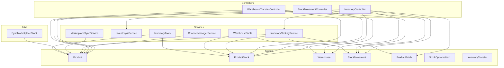
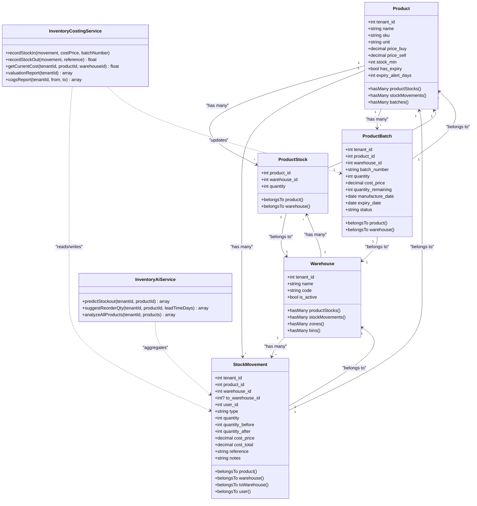
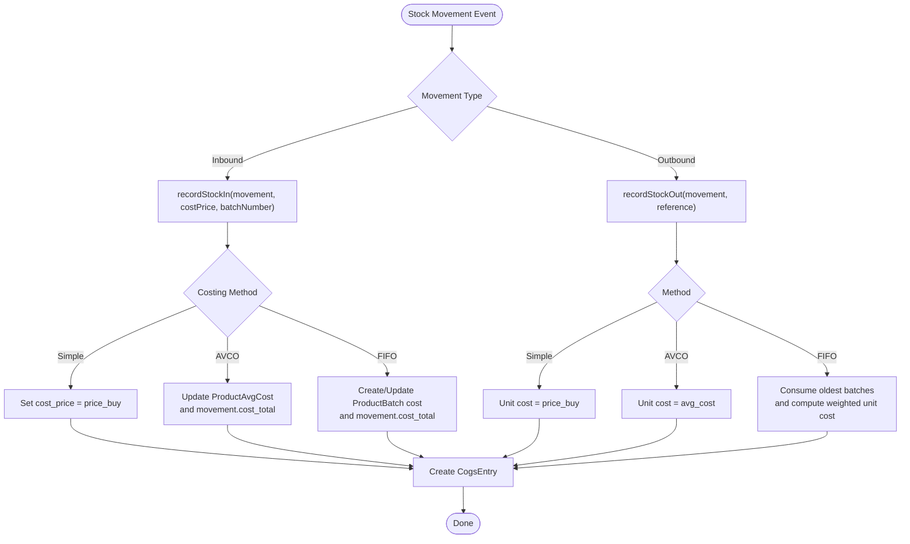
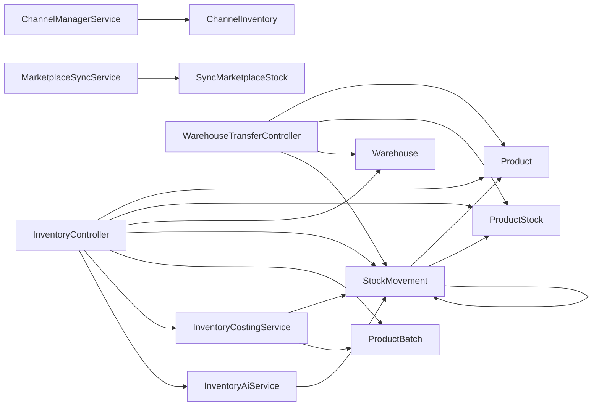
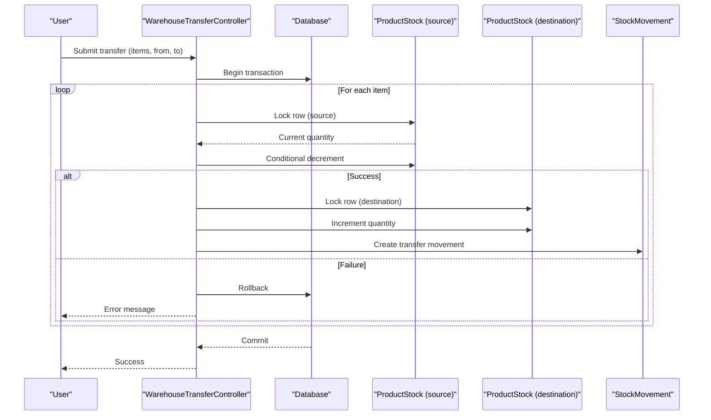

# Inventory Management

<cite>
**Referenced Files in This Document**
- [InventoryController.php](file://app/Http/Controllers/InventoryController.php)
- [StockMovementController.php](file://app/Http/Controllers/StockMovementController.php)
- [WarehouseTransferController.php](file://app/Http/Controllers/WarehouseTransferController.php)
- [Product.php](file://app/Models/Product.php)
- [ProductStock.php](file://app/Models/ProductStock.php)
- [Warehouse.php](file://app/Models/Warehouse.php)
- [StockMovement.php](file://app/Models/StockMovement.php)
- [ProductBatch.php](file://app/Models/ProductBatch.php)
- [StockOpnameItem.php](file://app/Models/StockOpnameItem.php)
- [InventoryTransfer.php](file://app/Models/InventoryTransfer.php)
- [InventoryCostingService.php](file://app/Services/InventoryCostingService.php)
- [InventoryAiService.php](file://app/Services/InventoryAiService.php)
- [InventoryReportExport.php](file://app/Exports/InventoryReportExport.php)
- [LowStockEmailNotification.php](file://app/Notifications/LowStockEmailNotification.php)
- [ProductImport.php](file://app/Imports/ProductImport.php)
- [ChannelInventory.php](file://app/Models/ChannelInventory.php)
- [ChannelManagerService.php](file://app/Services/ChannelManagerService.php)
- [MarketplaceSyncService.php](file://app/Services/MarketplaceSyncService.php)
- [SyncMarketplaceStock.php](file://app/Jobs/SyncMarketplaceStock.php)
- [GoodsReceipt.php](file://app/Models/GoodsReceipt.php)
- [GoodsReceiptItem.php](file://app/Models/GoodsReceiptItem.php)
- [SalesOrderItem.php](file://app/Models/SalesOrderItem.php)
- [PurchaseOrderItem.php](file://app/Models/PurchaseOrderItem.php)
- [ProductionOutput.php](file://app/Models/ProductionOutput.php)
- [MaterialDelivery.php](file://app/Models/MaterialDelivery.php)
- [MaterialReservation.php](file://app/Models/MaterialReservation.php)
- [PickingList.php](file://app/Models/PickingList.php)
- [PickingListItem.php](file://app/Models/PickingListItem.php)
- [StockOpnameSession.php](file://app/Models/StockOpnameSession.php)
- [StockTransfer.php](file://app/Models/StockTransfer.php)
- [WarehouseZone.php](file://app/Models/WarehouseZone.php)
- [WarehouseBin.php](file://app/Models/WarehouseBin.php)
- [BinStock.php](file://app/Models/BinStock.php)
- [PutawayRule.php](file://app/Models/PutawayRule.php)
- [WarehouseTools.php](file://app/Services/ERP/WarehouseTools.php)
- [InventoryTools.php](file://app/Services/ERP/InventoryTools.php)
</cite>

## Table of Contents
1. [Introduction](#introduction)
2. [Project Structure](#project-structure)
3. [Core Components](#core-components)
4. [Architecture Overview](#architecture-overview)
5. [Detailed Component Analysis](#detailed-component-analysis)
6. [Dependency Analysis](#dependency-analysis)
7. [Performance Considerations](#performance-considerations)
8. [Troubleshooting Guide](#troubleshooting-guide)
9. [Conclusion](#conclusion)
10. [Appendices](#appendices)

## Introduction
This document describes the Inventory Management module of qalcuityERP. It covers product catalog management, warehouse operations, stock tracking, inventory valuation, and supply chain integration. It also documents multi-location inventory handling, batch/lot tracking, FIFO/LIFO costing methods, inventory adjustments, receiving, shipping, transfers, and cycle counting processes. Finally, it explains integration points with procurement, sales, and manufacturing modules.

## Project Structure
The Inventory Management module spans controllers, models, services, jobs, and notifications. The structure follows Laravel conventions with clear separation of concerns:
- Controllers handle HTTP requests and orchestrate operations.
- Models define domain entities and relationships.
- Services encapsulate business logic (valuation, AI predictions, channel integrations).
- Jobs coordinate asynchronous tasks (marketplace sync).
- Notifications alert stakeholders (e.g., low stock).



**Diagram sources**
- [InventoryController.php:15-361](file://app/Http/Controllers/InventoryController.php#L15-L361)
- [StockMovementController.php:13-188](file://app/Http/Controllers/StockMovementController.php#L13-L188)
- [WarehouseTransferController.php:14-171](file://app/Http/Controllers/WarehouseTransferController.php#L14-L171)
- [Product.php:12-71](file://app/Models/Product.php#L12-L71)
- [ProductStock.php:8-15](file://app/Models/ProductStock.php#L8-L15)
- [Warehouse.php:12-43](file://app/Models/Warehouse.php#L12-L43)
- [StockMovement.php:10-25](file://app/Models/StockMovement.php#L10-L25)
- [ProductBatch.php:10-59](file://app/Models/ProductBatch.php#L10-L59)
- [StockOpnameItem.php:6-14](file://app/Models/StockOpnameItem.php#L6-L14)
- [InventoryTransfer.php:8-61](file://app/Models/InventoryTransfer.php#L8-L61)
- [InventoryCostingService.php:23-366](file://app/Services/InventoryCostingService.php#L23-L366)
- [InventoryAiService.php:16-307](file://app/Services/InventoryAiService.php#L16-L307)
- [ChannelManagerService.php](file://app/Services/ChannelManagerService.php)
- [MarketplaceSyncService.php](file://app/Services/MarketplaceSyncService.php)
- [SyncMarketplaceStock.php](file://app/Jobs/SyncMarketplaceStock.php)
- [WarehouseTools.php](file://app/Services/ERP/WarehouseTools.php)
- [InventoryTools.php](file://app/Services/ERP/InventoryTools.php)

**Section sources**
- [InventoryController.php:15-361](file://app/Http/Controllers/InventoryController.php#L15-L361)
- [StockMovementController.php:13-188](file://app/Http/Controllers/StockMovementController.php#L13-L188)
- [WarehouseTransferController.php:14-171](file://app/Http/Controllers/WarehouseTransferController.php#L14-L171)
- [Product.php:12-71](file://app/Models/Product.php#L12-L71)
- [ProductStock.php:8-15](file://app/Models/ProductStock.php#L8-L15)
- [Warehouse.php:12-43](file://app/Models/Warehouse.php#L12-L43)
- [StockMovement.php:10-25](file://app/Models/StockMovement.php#L10-L25)
- [ProductBatch.php:10-59](file://app/Models/ProductBatch.php#L10-L59)
- [StockOpnameItem.php:6-14](file://app/Models/StockOpnameItem.php#L6-L14)
- [InventoryTransfer.php:8-61](file://app/Models/InventoryTransfer.php#L8-L61)
- [InventoryCostingService.php:23-366](file://app/Services/InventoryCostingService.php#L23-L366)
- [InventoryAiService.php:16-307](file://app/Services/InventoryAiService.php#L16-L307)
- [ChannelManagerService.php](file://app/Services/ChannelManagerService.php)
- [MarketplaceSyncService.php](file://app/Services/MarketplaceSyncService.php)
- [SyncMarketplaceStock.php](file://app/Jobs/SyncMarketplaceStock.php)
- [WarehouseTools.php](file://app/Services/ERP/WarehouseTools.php)
- [InventoryTools.php](file://app/Services/ERP/InventoryTools.php)

## Core Components
- Product catalog: Products with SKU, unit, pricing, and expiry tracking. Related models include variants and categories.
- Warehouses and bins: Multi-location stock storage with zones and bins for physical organization.
- Stock tracking: Per-product, per-warehouse quantities and movement history.
- Batch/lot tracking: Per-batch quantities, costs, expiry dates, and statuses.
- Valuation and costing: Support for simple, AVCO, and FIFO methods; COGS entries and valuation reports.
- Movement types: Inbound receipts, outbound sales/shipping, adjustments, and inter-warehouse transfers.
- Cycle counting: Opname sessions and items to reconcile system vs actual stock.
- AI-driven insights: Stockout prediction, reorder suggestions, and batch analysis.
- Supply chain integration: Channel manager and marketplace sync for inventory visibility and updates.

**Section sources**
- [Product.php:12-71](file://app/Models/Product.php#L12-L71)
- [Warehouse.php:12-43](file://app/Models/Warehouse.php#L12-L43)
- [ProductStock.php:8-15](file://app/Models/ProductStock.php#L8-L15)
- [ProductBatch.php:10-59](file://app/Models/ProductBatch.php#L10-L59)
- [StockMovement.php:10-25](file://app/Models/StockMovement.php#L10-L25)
- [InventoryCostingService.php:23-366](file://app/Services/InventoryCostingService.php#L23-L366)
- [StockOpnameItem.php:6-14](file://app/Models/StockOpnameItem.php#L6-L14)
- [InventoryAiService.php:16-307](file://app/Services/InventoryAiService.php#L16-L307)
- [ChannelManagerService.php](file://app/Services/ChannelManagerService.php)
- [MarketplaceSyncService.php](file://app/Services/MarketplaceSyncService.php)

## Architecture Overview
The module is built around a central valuation and movement engine:
- Controllers accept inputs and delegate to services for complex logic.
- Services encapsulate costing (AVCO/FIFO), AI analytics, and channel integrations.
- Models persist domain entities and relationships.
- Jobs handle external integrations asynchronously.



**Diagram sources**
- [Product.php:12-71](file://app/Models/Product.php#L12-L71)
- [ProductStock.php:8-15](file://app/Models/ProductStock.php#L8-L15)
- [Warehouse.php:12-43](file://app/Models/Warehouse.php#L12-L43)
- [StockMovement.php:10-25](file://app/Models/StockMovement.php#L10-L25)
- [ProductBatch.php:10-59](file://app/Models/ProductBatch.php#L10-L59)
- [InventoryCostingService.php:23-366](file://app/Services/InventoryCostingService.php#L23-L366)
- [InventoryAiService.php:16-307](file://app/Services/InventoryAiService.php#L16-L307)

## Detailed Component Analysis

### Product Catalog Management
- Creation supports initial stock allocation to a warehouse, optional batch creation for expiry-enabled products, and image upload.
- Updates allow metadata changes and safe image replacement.
- Deletion enforces business rules: if a product was ever sold, it is deactivated rather than deleted.

Key behaviors:
- Initial stock creates a stock movement record and optionally a batch.
- Expiry-aware products require expiry dates during inbound operations.
- Tenant scoping ensures multi-tenancy isolation.

**Section sources**
- [InventoryController.php:61-147](file://app/Http/Controllers/InventoryController.php#L61-L147)
- [Product.php:12-71](file://app/Models/Product.php#L12-L71)
- [ProductStock.php:8-15](file://app/Models/ProductStock.php#L8-L15)
- [ProductBatch.php:10-59](file://app/Models/ProductBatch.php#L10-L59)
- [StockMovement.php:10-25](file://app/Models/StockMovement.php#L10-L25)

### Warehouse Operations and Multi-Location Inventory
- Warehouses are tenant-scoped with activation flag and nested relations for zones and bins.
- Multi-location stock is tracked via per-product-per-warehouse records.
- Controllers expose listing and creation of warehouses.

Operational highlights:
- Atomic stock increments/decrements with pessimistic locking to prevent race conditions.
- Transfer operations lock source and destination rows and use conditional atomic updates.

**Section sources**
- [Warehouse.php:12-43](file://app/Models/Warehouse.php#L12-L43)
- [WarehouseZone.php](file://app/Models/WarehouseZone.php)
- [WarehouseBin.php](file://app/Models/WarehouseBin.php)
- [BinStock.php](file://app/Models/BinStock.php)
- [PutawayRule.php](file://app/Models/PutawayRule.php)
- [WarehouseTools.php](file://app/Services/ERP/WarehouseTools.php)
- [InventoryController.php:320-348](file://app/Http/Controllers/InventoryController.php#L320-L348)
- [WarehouseTransferController.php:67-148](file://app/Http/Controllers/WarehouseTransferController.php#L67-L148)

### Stock Tracking and Movements
- Movement types include in, out, adjustment, and transfer.
- Each movement captures before/after quantities and optional reference and notes.
- Barcode lookup integrates with product discovery.

Processing logic:
- Inbound increases stock; outbound validates availability and reduces stock.
- Adjustment sets stock to an absolute value.
- Transfers update source and destination stock atomically.

**Section sources**
- [StockMovementController.php:34-101](file://app/Http/Controllers/StockMovementController.php#L34-L101)
- [StockMovement.php:10-25](file://app/Models/StockMovement.php#L10-L25)
- [ProductStock.php:8-15](file://app/Models/ProductStock.php#L8-L15)

### Batch/Lot Tracking and Expiry Management
- Batch records track quantity, cost, manufacture/expiry dates, and status.
- Methods to compute days until expiry and detect expired batches.
- Batch status lifecycle includes active, expired, recalled, consumed.

Integration points:
- On inbound stock addition for expiry-enabled products, a batch is created.
- Costing service can attach cost to batches for FIFO.

**Section sources**
- [ProductBatch.php:10-59](file://app/Models/ProductBatch.php#L10-L59)
- [InventoryController.php:262-274](file://app/Http/Controllers/InventoryController.php#L262-L274)
- [InventoryCostingService.php:269-295](file://app/Services/InventoryCostingService.php#L269-L295)

### Inventory Valuation and Costing Methods
Supported methods:
- Simple: static cost from product price_buy.
- AVCO: weighted average cost updated on every inbound.
- FIFO: oldest batches consumed first; remaining layers used for valuation.

Core flows:
- recordStockIn persists cost on movement and updates AVCO/FIFO layers.
- recordStockOut calculates COGS and writes a COGS entry.
- getCurrentCost returns unit cost for valuation.
- valuationReport and cogsReport provide summaries.



**Diagram sources**
- [InventoryCostingService.php:31-98](file://app/Services/InventoryCostingService.php#L31-L98)

**Section sources**
- [InventoryCostingService.php:23-366](file://app/Services/InventoryCostingService.php#L23-L366)
- [Product.php:12-71](file://app/Models/Product.php#L12-L71)
- [ProductBatch.php:10-59](file://app/Models/ProductBatch.php#L10-L59)
- [StockMovement.php:10-25](file://app/Models/StockMovement.php#L10-L25)

### Inventory Adjustments
- Adjustments set stock to a specific value and create a movement record.
- Validation prevents negative stock on outbound and insufficient stock scenarios.
- Atomic operations ensure consistency.

**Section sources**
- [StockMovementController.php:65-72](file://app/Http/Controllers/StockMovementController.php#L65-L72)
- [StockMovementController.php:78-90](file://app/Http/Controllers/StockMovementController.php#L78-L90)

### Receiving and Shipping
- Receiving: inbound stock additions with optional batch creation for expiry-enabled products.
- Shipping: outbound decrements validated against available stock; generates movements and updates batch consumption for FIFO.

**Section sources**
- [InventoryController.php:203-293](file://app/Http/Controllers/InventoryController.php#L203-L293)
- [StockMovementController.php:63-69](file://app/Http/Controllers/StockMovementController.php#L63-L69)
- [InventoryCostingService.php:297-333](file://app/Services/InventoryCostingService.php#L297-L333)

### Transfers Between Warehouses
- Inter-warehouse transfers lock source and destination stock rows.
- Conditional atomic decrement/increment ensure consistency.
- Single movement record captures transfer with reference and notes.

**Section sources**
- [WarehouseTransferController.php:67-148](file://app/Http/Controllers/WarehouseTransferController.php#L67-L148)
- [StockMovement.php:10-25](file://app/Models/StockMovement.php#L10-L25)

### Cycle Counting and Inventory Counts
- StockOpnameSession groups counting sessions.
- StockOpnameItem captures differences between system and actual counts per product/bin.
- Results drive adjustments and reconciliation.

**Section sources**
- [StockOpnameSession.php](file://app/Models/StockOpnameSession.php)
- [StockOpnameItem.php:6-14](file://app/Models/StockOpnameItem.php#L6-L14)

### Supply Chain Integration
- Channel inventory and channel manager service enable multi-channel stock visibility.
- Marketplace sync services and jobs keep external channels aligned with internal stock.
- Inventory exports support reporting and integration pipelines.

**Section sources**
- [ChannelInventory.php](file://app/Models/ChannelInventory.php)
- [ChannelManagerService.php](file://app/Services/ChannelManagerService.php)
- [MarketplaceSyncService.php](file://app/Services/MarketplaceSyncService.php)
- [SyncMarketplaceStock.php](file://app/Jobs/SyncMarketplaceStock.php)
- [InventoryReportExport.php](file://app/Exports/InventoryReportExport.php)

### AI-Driven Insights
- predictStockout computes days remaining, urgency, and trend based on recent out movements.
- suggestReorderQty computes safety stock, reorder point, and EOQ-like quantities.
- analyzeAllProducts aggregates per-product insights for bulk views.

**Section sources**
- [InventoryAiService.php:40-116](file://app/Services/InventoryAiService.php#L40-L116)
- [InventoryAiService.php:155-223](file://app/Services/InventoryAiService.php#L155-L223)
- [InventoryAiService.php:233-305](file://app/Services/InventoryAiService.php#L233-L305)

### Procurement, Sales, and Manufacturing Integration
- Procurement: purchase orders and goods receipt items feed inbound stock and cost layers.
- Sales: sales order items trigger outbound stock and COGS calculation.
- Manufacturing: production outputs and material deliveries/reservations integrate with inventory.

**Section sources**
- [PurchaseOrderItem.php](file://app/Models/PurchaseOrderItem.php)
- [GoodsReceipt.php](file://app/Models/GoodsReceipt.php)
- [GoodsReceiptItem.php](file://app/Models/GoodsReceiptItem.php)
- [SalesOrderItem.php](file://app/Models/SalesOrderItem.php)
- [ProductionOutput.php](file://app/Models/ProductionOutput.php)
- [MaterialDelivery.php](file://app/Models/MaterialDelivery.php)
- [MaterialReservation.php](file://app/Models/MaterialReservation.php)
- [PickingList.php](file://app/Models/PickingList.php)
- [PickingListItem.php](file://app/Models/PickingListItem.php)

## Dependency Analysis
The module exhibits strong cohesion around valuation and movement while maintaining loose coupling with external systems:
- Controllers depend on models and services.
- Services encapsulate domain logic and reduce controller complexity.
- Jobs decouple long-running tasks (marketplace sync) from request handling.
- Notifications provide reactive alerts (e.g., low stock).



**Diagram sources**
- [InventoryController.php:15-361](file://app/Http/Controllers/InventoryController.php#L15-L361)
- [StockMovementController.php:13-188](file://app/Http/Controllers/StockMovementController.php#L13-L188)
- [WarehouseTransferController.php:14-171](file://app/Http/Controllers/WarehouseTransferController.php#L14-L171)
- [InventoryCostingService.php:23-366](file://app/Services/InventoryCostingService.php#L23-L366)
- [InventoryAiService.php:16-307](file://app/Services/InventoryAiService.php#L16-L307)
- [ChannelManagerService.php](file://app/Services/ChannelManagerService.php)
- [ChannelInventory.php](file://app/Models/ChannelInventory.php)
- [MarketplaceSyncService.php](file://app/Services/MarketplaceSyncService.php)
- [SyncMarketplaceStock.php](file://app/Jobs/SyncMarketplaceStock.php)

**Section sources**
- [InventoryController.php:15-361](file://app/Http/Controllers/InventoryController.php#L15-L361)
- [StockMovementController.php:13-188](file://app/Http/Controllers/StockMovementController.php#L13-L188)
- [WarehouseTransferController.php:14-171](file://app/Http/Controllers/WarehouseTransferController.php#L14-L171)
- [InventoryCostingService.php:23-366](file://app/Services/InventoryCostingService.php#L23-L366)
- [InventoryAiService.php:16-307](file://app/Services/InventoryAiService.php#L16-L307)
- [ChannelManagerService.php](file://app/Services/ChannelManagerService.php)
- [ChannelInventory.php](file://app/Models/ChannelInventory.php)
- [MarketplaceSyncService.php](file://app/Services/MarketplaceSyncService.php)
- [SyncMarketplaceStock.php](file://app/Jobs/SyncMarketplaceStock.php)

## Performance Considerations
- Use of pessimistic locking and conditional atomic updates prevents race conditions during stock changes.
- Eager loading and selective column selection reduce query overhead in listings.
- Costing calculations leverage cached averages and batch scans with appropriate ordering.
- Asynchronous marketplace sync avoids blocking user actions.
- Recommendations:
  - Add database indexes on frequently filtered columns (tenant_id, product_id, warehouse_id, created_at).
  - Consider partitioning large movement tables by date or tenant.
  - Batch expensive operations (valuation reports) and cache results where feasible.

[No sources needed since this section provides general guidance]

## Troubleshooting Guide
Common issues and resolutions:
- Insufficient stock on outbound: Ensure source stock meets requested quantity before recording out movements.
- Transfer failures: Verify source stock availability and check for database-level errors (locks, deadlocks).
- Expiry-required products: Enforce expiry_date presence for inbound operations on expiry-enabled products.
- Batch discrepancies: Reconcile batches via cycle counting and adjust statuses accordingly.
- Low stock alerts: Configure thresholds and monitor notifications.

**Section sources**
- [StockMovementController.php:66-69](file://app/Http/Controllers/StockMovementController.php#L66-L69)
- [WarehouseTransferController.php:79-85](file://app/Http/Controllers/WarehouseTransferController.php#L79-L85)
- [InventoryController.php:216-219](file://app/Http/Controllers/InventoryController.php#L216-L219)
- [LowStockEmailNotification.php](file://app/Notifications/LowStockEmailNotification.php)

## Conclusion
The Inventory Management module provides a robust foundation for multi-location stock control, batch/lot tracking, and configurable costing methods. Its integration with procurement, sales, and manufacturing, along with AI-driven insights and supply chain sync, enables accurate, timely, and actionable inventory operations across tenants and channels.

[No sources needed since this section summarizes without analyzing specific files]

## Appendices

### Data Models Overview
```mermaid
erDiagram
PRODUCT {
int id PK
int tenant_id
string name
string sku
string unit
decimal price_buy
decimal price_sell
int stock_min
bool has_expiry
int expiry_alert_days
}
WAREHOUSE {
int id PK
int tenant_id
string name
string code
bool is_active
}
PRODUCT_STOCK {
int id PK
int product_id FK
int warehouse_id FK
int quantity
}
STOCK_MOVEMENT {
int id PK
int tenant_id
int product_id FK
int warehouse_id FK
int? to_warehouse_id FK
int user_id
string type
int quantity
int quantity_before
int quantity_after
decimal cost_price
decimal cost_total
string reference
string notes
}
PRODUCT_BATCH {
int id PK
int tenant_id
int product_id FK
int warehouse_id FK
string batch_number
int quantity
decimal cost_price
int quantity_remaining
date manufacture_date
date expiry_date
string status
}
INVENTORY_TRANSFER {
int id PK
int company_group_id
int from_tenant_id FK
int to_tenant_id FK
string transfer_number
date transfer_date
date expected_arrival_date
date actual_arrival_date
string status
string shipping_method
string tracking_number
decimal shipping_cost
string notes
int created_by_user_id FK
int received_by_user_id FK
}
PRODUCT ||--o{ PRODUCT_STOCK : "has many"
WAREHOUSE ||--o{ PRODUCT_STOCK : "has many"
PRODUCT ||--o{ STOCK_MOVEMENT : "has many"
WAREHOUSE ||--o{ STOCK_MOVEMENT : "has many"
PRODUCT ||--o{ PRODUCT_BATCH : "has many"
WAREHOUSE ||--o{ PRODUCT_BATCH : "has many"
INVENTORY_TRANSFER ||--o{ INVENTORY_TRANSFER_ITEM : "has many"
```

**Diagram sources**
- [Product.php:12-71](file://app/Models/Product.php#L12-L71)
- [Warehouse.php:12-43](file://app/Models/Warehouse.php#L12-L43)
- [ProductStock.php:8-15](file://app/Models/ProductStock.php#L8-L15)
- [StockMovement.php:10-25](file://app/Models/StockMovement.php#L10-L25)
- [ProductBatch.php:10-59](file://app/Models/ProductBatch.php#L10-L59)
- [InventoryTransfer.php:8-61](file://app/Models/InventoryTransfer.php#L8-L61)

### End-to-End Transfer Sequence


**Diagram sources**
- [WarehouseTransferController.php:67-148](file://app/Http/Controllers/WarehouseTransferController.php#L67-L148)
- [ProductStock.php:8-15](file://app/Models/ProductStock.php#L8-L15)
- [StockMovement.php:10-25](file://app/Models/StockMovement.php#L10-L25)