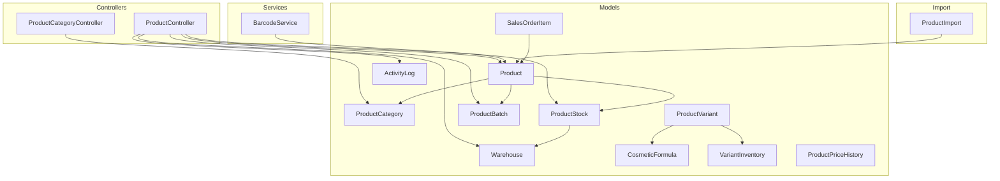
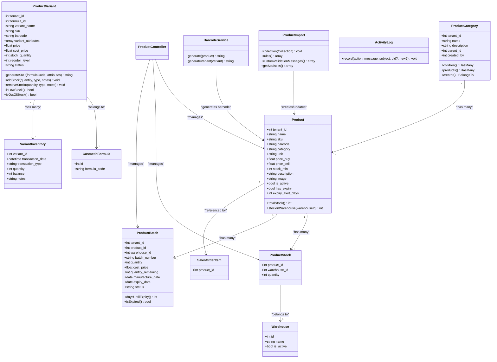
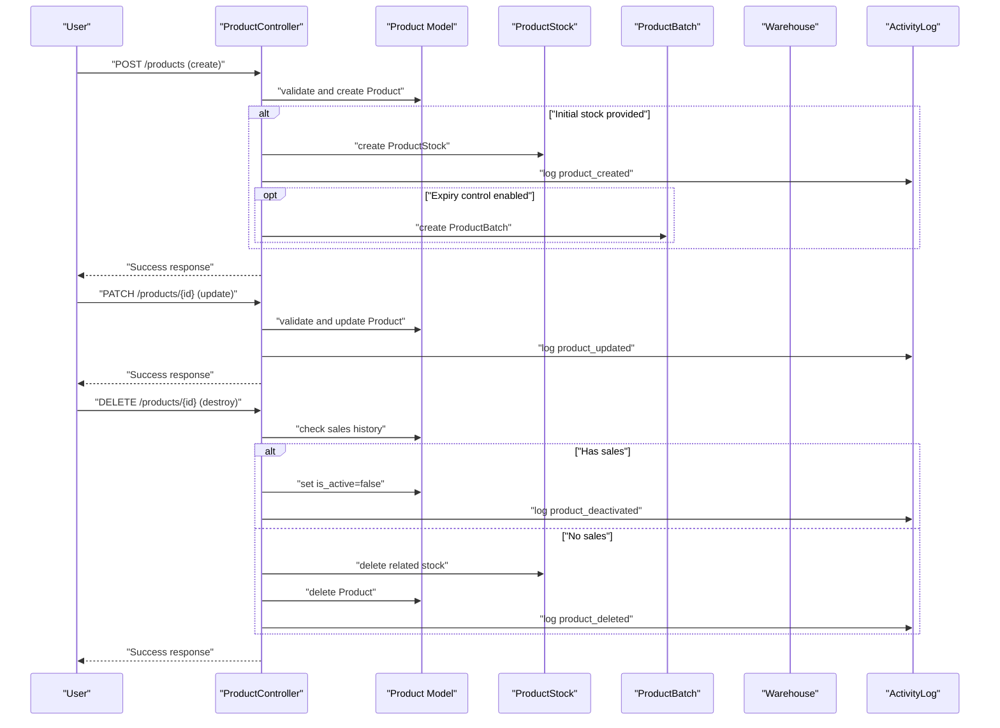
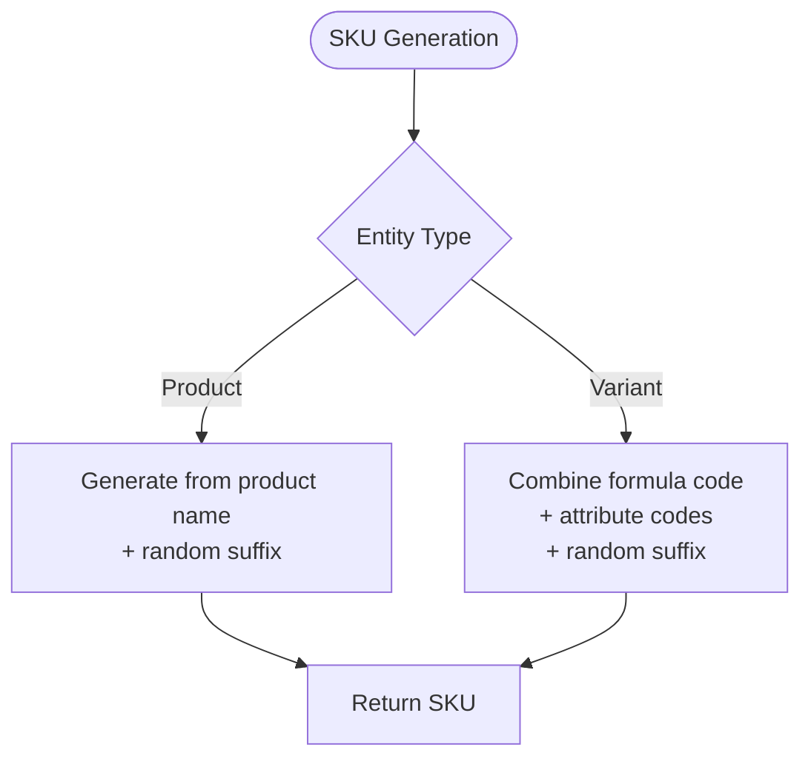
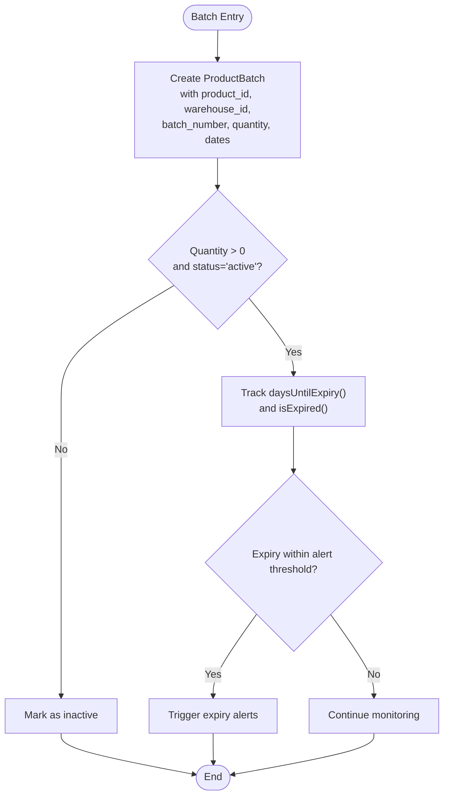
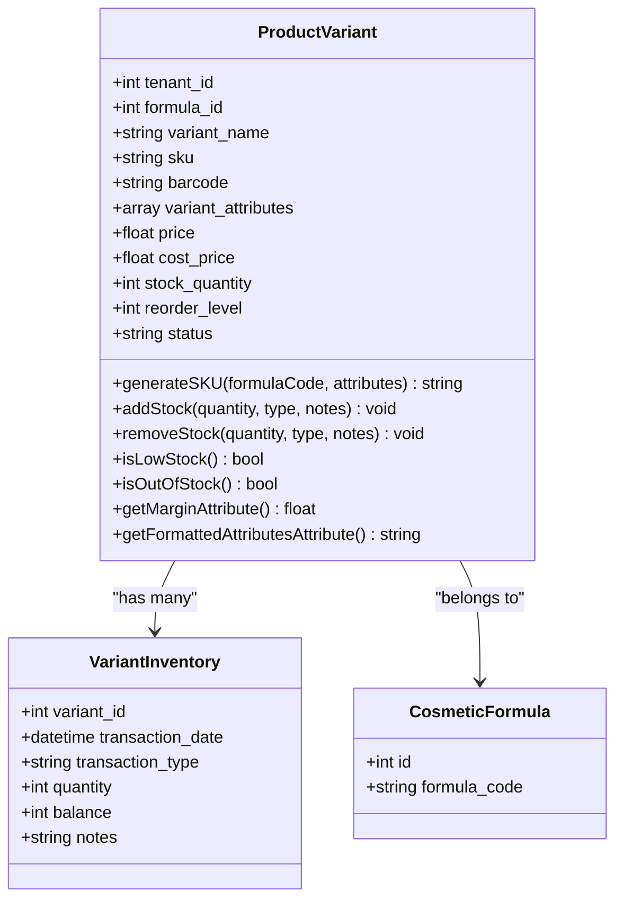
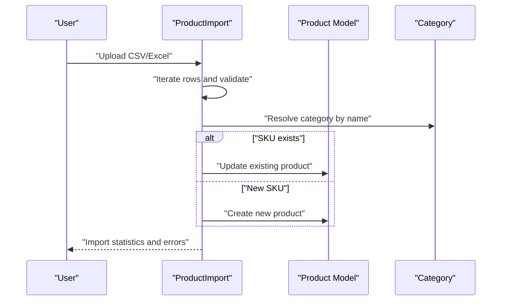
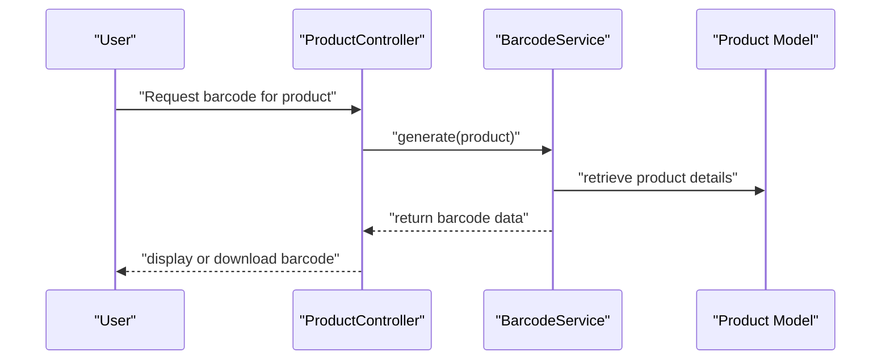
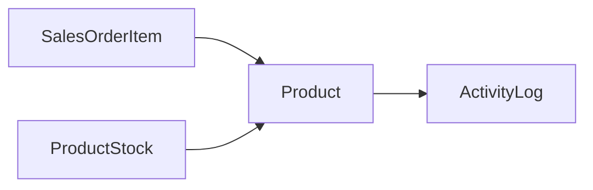
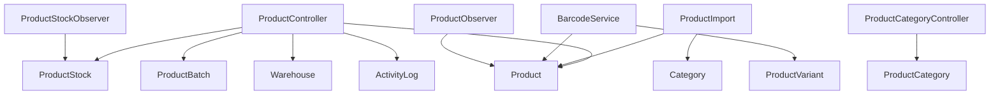

# Product Catalog Management

<cite>
**Referenced Files in This Document**
- [Product.php](file://app/Models/Product.php)
- [ProductCategory.php](file://app/Models/ProductCategory.php)
- [ProductVariant.php](file://app/Models/ProductVariant.php)
- [ProductBatch.php](file://app/Models/ProductBatch.php)
- [ProductStock.php](file://app/Models/ProductStock.php)
- [ProductController.php](file://app/Http/Controllers/ProductController.php)
- [ProductCategoryController.php](file://app/Http/Controllers/ProductCategoryController.php)
- [ProductImport.php](file://app/Imports/ProductImport.php)
- [BarcodeService.php](file://app/Services/BarcodeService.php)
- [ProductPriceHistory.php](file://app/Models/ProductPriceHistory.php)
- [VariantInventory.php](file://app/Models/VariantInventory.php)
- [CosmeticFormula.php](file://app/Models/CosmeticFormula.php)
- [Warehouse.php](file://app/Models/Warehouse.php)
- [SalesOrderItem.php](file://app/Models/SalesOrderItem.php)
- [ActivityLog.php](file://app/Models/ActivityLog.php)
- [ProductObserver.php](file://app/Observers/ProductObserver.php)
- [ProductStockObserver.php](file://app/Observers/ProductStockObserver.php)
</cite>

## Table of Contents
1. [Introduction](#introduction)
2. [Project Structure](#project-structure)
3. [Core Components](#core-components)
4. [Architecture Overview](#architecture-overview)
5. [Detailed Component Analysis](#detailed-component-analysis)
6. [Dependency Analysis](#dependency-analysis)
7. [Performance Considerations](#performance-considerations)
8. [Troubleshooting Guide](#troubleshooting-guide)
9. [Conclusion](#conclusion)

## Introduction
This document provides comprehensive documentation for Product Catalog Management within the ERP system. It covers product creation, categorization, variant management, and batch tracking for expiry-controlled products. The documentation explains the product lifecycle from creation to deactivation, SKU generation strategies, image management, and product attributes. It also details batch/lot tracking mechanisms, variant configurations for multi-attribute products, product import/export capabilities, barcode generation, and integration points with sales and purchase modules.

## Project Structure
The product catalog functionality spans models, controllers, importers, services, observers, and supporting domain models. The structure follows Laravel conventions with clear separation of concerns:
- Models define the data schema and relationships for products, categories, variants, batches, and stock.
- Controllers handle HTTP requests for CRUD operations, bulk actions, and lifecycle management.
- Importers process product data from spreadsheets with validation and error handling.
- Services encapsulate reusable business logic such as barcode generation.
- Observers monitor model events for audit trails and automated updates.

**Diagram sources**
- [ProductController.php:1-305](file://app/Http/Controllers/ProductController.php#L1-L305)
- [ProductCategoryController.php:1-69](file://app/Http/Controllers/ProductCategoryController.php#L1-L69)
- [Product.php:1-71](file://app/Models/Product.php#L1-L71)
- [ProductCategory.php:1-48](file://app/Models/ProductCategory.php#L1-L48)
- [ProductVariant.php:1-175](file://app/Models/ProductVariant.php#L1-L175)
- [ProductBatch.php:1-59](file://app/Models/ProductBatch.php#L1-L59)
- [ProductStock.php:1-15](file://app/Models/ProductStock.php#L1-L15)
- [Warehouse.php](file://app/Models/Warehouse.php)
- [CosmeticFormula.php](file://app/Models/CosmeticFormula.php)
- [VariantInventory.php](file://app/Models/VariantInventory.php)
- [ProductPriceHistory.php](file://app/Models/ProductPriceHistory.php)
- [SalesOrderItem.php](file://app/Models/SalesOrderItem.php)
- [ActivityLog.php](file://app/Models/ActivityLog.php)
- [BarcodeService.php](file://app/Services/BarcodeService.php)
- [ProductImport.php:1-171](file://app/Imports/ProductImport.php#L1-L171)

**Section sources**
- [ProductController.php:1-305](file://app/Http/Controllers/ProductController.php#L1-L305)
- [ProductCategoryController.php:1-69](file://app/Http/Controllers/ProductCategoryController.php#L1-L69)
- [Product.php:1-71](file://app/Models/Product.php#L1-L71)
- [ProductCategory.php:1-48](file://app/Models/ProductCategory.php#L1-L48)
- [ProductVariant.php:1-175](file://app/Models/ProductVariant.php#L1-L175)
- [ProductBatch.php:1-59](file://app/Models/ProductBatch.php#L1-L59)
- [ProductStock.php:1-15](file://app/Models/ProductStock.php#L1-L15)
- [ProductImport.php:1-171](file://app/Imports/ProductImport.php#L1-L171)
- [BarcodeService.php](file://app/Services/BarcodeService.php)

## Core Components
This section outlines the primary components involved in product catalog management and their responsibilities.

- Product: Central entity representing items with attributes such as name, SKU, pricing, stock thresholds, images, and expiry controls. Provides relationships to stock, batches, and movements.
- ProductCategory: Hierarchical classification system with parent-child relationships and creator attribution.
- ProductVariant: Variant management for multi-attribute products with automatic SKU generation, stock transactions, and status management.
- ProductBatch: Lot/batch tracking for expiry-controlled products with manufacturing/expiry dates and status tracking.
- ProductStock: Warehouse-level stock quantities linked to products.
- ProductImport: Excel-based importer with validation, deduplication by SKU, and error reporting.
- BarcodeService: Generates barcodes for products and variants.
- ProductPriceHistory: Historical pricing records for audit and analytics.
- VariantInventory: Transaction log for variant stock movements.
- Observers: Automatic activity logging and state synchronization for product and stock models.

**Section sources**
- [Product.php:1-71](file://app/Models/Product.php#L1-L71)
- [ProductCategory.php:1-48](file://app/Models/ProductCategory.php#L1-L48)
- [ProductVariant.php:1-175](file://app/Models/ProductVariant.php#L1-L175)
- [ProductBatch.php:1-59](file://app/Models/ProductBatch.php#L1-L59)
- [ProductStock.php:1-15](file://app/Models/ProductStock.php#L1-L15)
- [ProductImport.php:1-171](file://app/Imports/ProductImport.php#L1-L171)
- [BarcodeService.php](file://app/Services/BarcodeService.php)
- [ProductPriceHistory.php](file://app/Models/ProductPriceHistory.php)
- [VariantInventory.php](file://app/Models/VariantInventory.php)
- [ProductObserver.php](file://app/Observers/ProductObserver.php)
- [ProductStockObserver.php](file://app/Observers/ProductStockObserver.php)

## Architecture Overview
The product catalog architecture integrates controllers, models, services, and observers to support a complete lifecycle from creation to deactivation. Controllers orchestrate user interactions, models enforce data integrity and relationships, services encapsulate cross-cutting concerns like barcode generation, and observers maintain audit trails and derived state.

**Diagram sources**
- [Product.php:1-71](file://app/Models/Product.php#L1-L71)
- [ProductCategory.php:1-48](file://app/Models/ProductCategory.php#L1-L48)
- [ProductVariant.php:1-175](file://app/Models/ProductVariant.php#L1-L175)
- [ProductBatch.php:1-59](file://app/Models/ProductBatch.php#L1-L59)
- [ProductStock.php:1-15](file://app/Models/ProductStock.php#L1-L15)
- [Warehouse.php](file://app/Models/Warehouse.php)
- [CosmeticFormula.php](file://app/Models/CosmeticFormula.php)
- [VariantInventory.php](file://app/Models/VariantInventory.php)
- [ProductImport.php:1-171](file://app/Imports/ProductImport.php#L1-L171)
- [BarcodeService.php](file://app/Services/BarcodeService.php)
- [SalesOrderItem.php](file://app/Models/SalesOrderItem.php)
- [ActivityLog.php](file://app/Models/ActivityLog.php)

## Detailed Component Analysis

### Product Lifecycle Management
The product lifecycle spans creation, updates, activation/deactivation, and deletion with safeguards against disrupting existing sales.

**Diagram sources**
- [ProductController.php:157-303](file://app/Http/Controllers/ProductController.php#L157-L303)
- [Product.php:1-71](file://app/Models/Product.php#L1-L71)
- [ProductStock.php:1-15](file://app/Models/ProductStock.php#L1-L15)
- [ProductBatch.php:1-59](file://app/Models/ProductBatch.php#L1-L59)
- [Warehouse.php](file://app/Models/Warehouse.php)
- [ActivityLog.php](file://app/Models/ActivityLog.php)
- [SalesOrderItem.php](file://app/Models/SalesOrderItem.php)

Key lifecycle behaviors:
- Creation validates uniqueness by name, generates SKU if not provided, stores images, initializes stock, and optionally creates batches for expiry-controlled items.
- Updates allow image replacement and metadata changes while preserving derived state.
- Deletion checks prior sales; if any sales exist, deactivation is preferred to preserve historical integrity; otherwise, soft deletion occurs with cleanup of related stock.

**Section sources**
- [ProductController.php:157-303](file://app/Http/Controllers/ProductController.php#L157-L303)
- [Product.php:1-71](file://app/Models/Product.php#L1-L71)
- [ProductStock.php:1-15](file://app/Models/ProductStock.php#L1-L15)
- [ProductBatch.php:1-59](file://app/Models/ProductBatch.php#L1-L59)
- [ActivityLog.php](file://app/Models/ActivityLog.php)
- [SalesOrderItem.php](file://app/Models/SalesOrderItem.php)

### SKU Generation Strategies
SKU generation varies by entity:
- Products: Auto-generated from the product name with a random suffix when not provided during creation.
- Variants: Generated programmatically from a formula code and variant attribute values, ensuring uniqueness and readability.

**Diagram sources**
- [ProductController.php:184-184](file://app/Http/Controllers/ProductController.php#L184-L184)
- [ProductVariant.php:63-74](file://app/Models/ProductVariant.php#L63-L74)

**Section sources**
- [ProductController.php:184-184](file://app/Http/Controllers/ProductController.php#L184-L184)
- [ProductVariant.php:63-74](file://app/Models/ProductVariant.php#L63-L74)

### Batch/Lot Tracking for Expiry-Controlled Products
Batch tracking supports manufacturing date, expiry date, remaining quantity, and status. It includes helpers to compute days until expiry and detect expiration.

**Diagram sources**
- [ProductBatch.php:31-57](file://app/Models/ProductBatch.php#L31-L57)

**Section sources**
- [ProductBatch.php:1-59](file://app/Models/ProductBatch.php#L1-L59)

### Variant Management and Multi-Attribute Configurations
Variants enable multi-attribute product configurations with automatic SKU generation, stock transactions, and status management. Attributes are stored as arrays and formatted for display.

**Diagram sources**
- [ProductVariant.php:1-175](file://app/Models/ProductVariant.php#L1-L175)
- [VariantInventory.php](file://app/Models/VariantInventory.php)
- [CosmeticFormula.php](file://app/Models/CosmeticFormula.php)

**Section sources**
- [ProductVariant.php:1-175](file://app/Models/ProductVariant.php#L1-L175)
- [VariantInventory.php](file://app/Models/VariantInventory.php)
- [CosmeticFormula.php](file://app/Models/CosmeticFormula.php)

### Product Import/Export Functionality
Product import reads spreadsheet rows, validates fields, resolves categories by name, and either creates or updates products by SKU. Export capabilities leverage the broader export framework for inventory and financial reports.

**Diagram sources**
- [ProductImport.php:35-81](file://app/Imports/ProductImport.php#L35-L81)

**Section sources**
- [ProductImport.php:1-171](file://app/Imports/ProductImport.php#L1-L171)

### Barcode Generation
Barcodes are generated via a dedicated service integrated with product and variant entities. This enables standardized labeling and scanning across sales and inventory modules.

**Diagram sources**
- [ProductController.php:157-244](file://app/Http/Controllers/ProductController.php#L157-L244)
- [BarcodeService.php](file://app/Services/BarcodeService.php)

**Section sources**
- [ProductController.php:157-244](file://app/Http/Controllers/ProductController.php#L157-L244)
- [BarcodeService.php](file://app/Services/BarcodeService.php)

### Integration with Sales/Purchase Modules
Products integrate with sales and purchase workflows:
- SalesOrderItem references products to prevent deletion if sales exist.
- ProductStock tracks warehouse-level quantities for inventory management.
- ActivityLog records product lifecycle events for auditability.

**Diagram sources**
- [SalesOrderItem.php](file://app/Models/SalesOrderItem.php)
- [ProductStock.php:1-15](file://app/Models/ProductStock.php#L1-L15)
- [Product.php:1-71](file://app/Models/Product.php#L1-L71)
- [ActivityLog.php](file://app/Models/ActivityLog.php)

**Section sources**
- [SalesOrderItem.php](file://app/Models/SalesOrderItem.php)
- [ProductStock.php:1-15](file://app/Models/ProductStock.php#L1-L15)
- [Product.php:1-71](file://app/Models/Product.php#L1-L71)
- [ActivityLog.php](file://app/Models/ActivityLog.php)

## Dependency Analysis
The product catalog module exhibits cohesive internal dependencies and controlled external integrations:
- Controllers depend on models and services for business operations.
- Models define relationships and scopes for querying and filtering.
- Importers depend on models for persistence and validation.
- Observers depend on models and external systems for audit and notifications.
- Services encapsulate cross-cutting concerns like barcode generation.

**Diagram sources**
- [ProductController.php:1-305](file://app/Http/Controllers/ProductController.php#L1-L305)
- [ProductCategoryController.php:1-69](file://app/Http/Controllers/ProductCategoryController.php#L1-L69)
- [Product.php:1-71](file://app/Models/Product.php#L1-L71)
- [ProductStock.php:1-15](file://app/Models/ProductStock.php#L1-L15)
- [ProductBatch.php:1-59](file://app/Models/ProductBatch.php#L1-L59)
- [Warehouse.php](file://app/Models/Warehouse.php)
- [ActivityLog.php](file://app/Models/ActivityLog.php)
- [ProductImport.php:1-171](file://app/Imports/ProductImport.php#L1-L171)
- [ProductCategory.php:1-48](file://app/Models/ProductCategory.php#L1-L48)
- [BarcodeService.php](file://app/Services/BarcodeService.php)
- [ProductObserver.php](file://app/Observers/ProductObserver.php)
- [ProductStockObserver.php](file://app/Observers/ProductStockObserver.php)

**Section sources**
- [ProductController.php:1-305](file://app/Http/Controllers/ProductController.php#L1-L305)
- [ProductCategoryController.php:1-69](file://app/Http/Controllers/ProductCategoryController.php#L1-L69)
- [Product.php:1-71](file://app/Models/Product.php#L1-L71)
- [ProductStock.php:1-15](file://app/Models/ProductStock.php#L1-L15)
- [ProductBatch.php:1-59](file://app/Models/ProductBatch.php#L1-L59)
- [Warehouse.php](file://app/Models/Warehouse.php)
- [ActivityLog.php](file://app/Models/ActivityLog.php)
- [ProductImport.php:1-171](file://app/Imports/ProductImport.php#L1-L171)
- [ProductCategory.php:1-48](file://app/Models/ProductCategory.php#L1-L48)
- [BarcodeService.php](file://app/Services/BarcodeService.php)
- [ProductObserver.php](file://app/Observers/ProductObserver.php)
- [ProductStockObserver.php](file://app/Observers/ProductStockObserver.php)

## Performance Considerations
- Indexing: Ensure tenant_id, SKU, and foreign keys (product_id, warehouse_id) are indexed to optimize queries for filtering, joins, and lookups.
- Pagination: Controllers already paginate results; maintain reasonable page sizes to balance responsiveness and memory usage.
- Image Storage: Store images efficiently and consider CDN integration for reduced latency.
- Batch Operations: Use bulk actions judiciously; validate tenant ownership before processing to avoid unnecessary overhead.
- Observers: Keep observer logic lightweight to minimize impact on write operations.

## Troubleshooting Guide
Common issues and resolutions:
- Duplicate product names: Creation prevents duplicates by name within a tenant; adjust naming or use SKUs for differentiation.
- Insufficient stock for variant removal: Variant removal enforces stock availability; reconcile inventory before adjustments.
- Deletion blocked by sales: If a product has sales history, deactivate instead of deleting to preserve audit trails.
- Import errors: Review import statistics and error logs to identify malformed rows or invalid categories; correct data and re-import.
- Expiry alerts: Configure expiry alert days appropriately; use batch scopes to identify expiring items proactively.

**Section sources**
- [ProductController.php:180-182](file://app/Http/Controllers/ProductController.php#L180-L182)
- [ProductVariant.php:94-112](file://app/Models/ProductVariant.php#L94-L112)
- [ProductController.php:291-296](file://app/Http/Controllers/ProductController.php#L291-L296)
- [ProductImport.php:161-169](file://app/Imports/ProductImport.php#L161-L169)
- [ProductBatch.php:47-57](file://app/Models/ProductBatch.php#L47-L57)

## Conclusion
The Product Catalog Management system provides a robust foundation for managing products, categories, variants, and batches with strong lifecycle controls, SKU generation, image handling, and integration with sales and purchase workflows. The modular design, supported by controllers, models, importers, services, and observers, ensures scalability, maintainability, and auditability across tenants and warehouses.