# Stock Movements & Transactions

<cite>
**Referenced Files in This Document**
- [StockMovement.php](file://app/Models/StockMovement.php)
- [StockOpnameSession.php](file://app/Models/StockOpnameSession.php)
- [StockOpnameItem.php](file://app/Models/StockOpnameItem.php)
- [StockTransfer.php](file://app/Models/StockTransfer.php)
- [Warehouse.php](file://app/Models/Warehouse.php)
- [WarehouseBin.php](file://app/Models/WarehouseBin.php)
- [WarehouseZone.php](file://app/Models/WarehouseZone.php)
- [ProductStock.php](file://app/Models/ProductStock.php)
- [BinStock.php](file://app/Models/BinStock.php)
- [PickingList.php](file://app/Models/PickingList.php)
- [PickingListItem.php](file://app/Models/PickingListItem.php)
- [GoodsReceipt.php](file://app/Models/GoodsReceipt.php)
- [Shipment.php](file://app/Models/Shipment.php)
- [StockMovementController.php](file://app/Http/Controllers/StockMovementController.php)
- [InventoryCostingService.php](file://app/Services/InventoryCostingService.php)
- [BarcodeService.php](file://app/Services/BarcodeService.php)
- [GoodsReceiptValidationService.php](file://app/Services/GoodsReceiptValidationService.php)
- [picking-show.blade.php](file://resources/views/mobile/picking-show.blade.php)
- [picking-scan.blade.php](file://resources/views/wms/picking-scan.blade.php)
- [2026_01_01_000018_create_warehouse_transfer_tables.php](file://database/migrations/2026_01_01_000018_create_warehouse_transfer_tables.php)
- [2026_04_06_120000_create_multi_company_tables.php](file://database/migrations/2026_04_06_120000_create_multi_company_tables.php)
</cite>

## Table of Contents
1. [Introduction](#introduction)
2. [Project Structure](#project-structure)
3. [Core Components](#core-components)
4. [Architecture Overview](#architecture-overview)
5. [Detailed Component Analysis](#detailed-component-analysis)
6. [Dependency Analysis](#dependency-analysis)
7. [Performance Considerations](#performance-considerations)
8. [Troubleshooting Guide](#troubleshooting-guide)
9. [Conclusion](#conclusion)
10. [Appendices](#appendices)

## Introduction
This document explains the Stock Movement processing capabilities in the system, covering receiving, shipping, internal transfers, and inventory adjustments. It also documents stock opname procedures, cycle counting, discrepancy resolution, inventory valuation updates, picking and packing workflows, transfer authorization processes, real-time stock updates, barcode scanning integration, and mobile device synchronization. The goal is to provide a practical, code-backed guide for both technical and operational users.

## Project Structure
The stock movement domain spans models, controllers, services, migrations, and views:
- Models define entities such as stock movements, warehouse locations, bins/zones, product stock, picking lists, goods receipt, and shipments.
- Controllers orchestrate user actions (e.g., recording stock movements, scanning barcodes).
- Services encapsulate costing logic (valuation, COGS) and barcode generation/printing.
- Migrations define schema for stock transfers and inventory transfer items.
- Views provide mobile and WMS interfaces for scanning and picking.

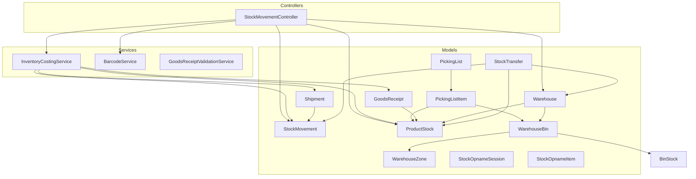

**Diagram sources**
- [StockMovement.php:1-25](file://app/Models/StockMovement.php#L1-L25)
- [ProductStock.php:1-15](file://app/Models/ProductStock.php#L1-L15)
- [Warehouse.php:1-43](file://app/Models/Warehouse.php#L1-L43)
- [WarehouseBin.php:1-24](file://app/Models/WarehouseBin.php#L1-L24)
- [WarehouseZone.php:1-18](file://app/Models/WarehouseZone.php#L1-L18)
- [PickingList.php:1-25](file://app/Models/PickingList.php#L1-L25)
- [PickingListItem.php:1-14](file://app/Models/PickingListItem.php#L1-L14)
- [GoodsReceipt.php:1-26](file://app/Models/GoodsReceipt.php#L1-L26)
- [Shipment.php:1-49](file://app/Models/Shipment.php#L1-L49)
- [StockOpnameSession.php:1-19](file://app/Models/StockOpnameSession.php#L1-L19)
- [StockOpnameItem.php:1-14](file://app/Models/StockOpnameItem.php#L1-L14)
- [StockTransfer.php:1-33](file://app/Models/StockTransfer.php#L1-L33)
- [StockMovementController.php:1-188](file://app/Http/Controllers/StockMovementController.php#L1-L188)
- [InventoryCostingService.php:1-366](file://app/Services/InventoryCostingService.php#L1-L366)
- [BarcodeService.php:1-283](file://app/Services/BarcodeService.php#L1-L283)
- [GoodsReceiptValidationService.php:1-41](file://app/Services/GoodsReceiptValidationService.php#L1-L41)

**Section sources**
- [StockMovement.php:1-25](file://app/Models/StockMovement.php#L1-L25)
- [StockMovementController.php:1-188](file://app/Http/Controllers/StockMovementController.php#L1-L188)
- [InventoryCostingService.php:1-366](file://app/Services/InventoryCostingService.php#L1-L366)
- [BarcodeService.php:1-283](file://app/Services/BarcodeService.php#L1-L283)
- [2026_01_01_000018_create_warehouse_transfer_tables.php:27-44](file://database/migrations/2026_01_01_000018_create_warehouse_transfer_tables.php#L27-L44)
- [2026_04_06_120000_create_multi_company_tables.php:189-217](file://database/migrations/2026_04_06_120000_create_multi_company_tables.php#L189-L217)

## Core Components
- StockMovement: Tracks in/out/adjustment/transfer events with quantity_before/after and cost fields.
- ProductStock: Per-product-per-warehouse quantity ledger.
- Warehouse, WarehouseZone, WarehouseBin: Location hierarchy supporting bin-level stock.
- PickingList and PickingListItem: Define picking assignments and per-item progress.
- GoodsReceipt: Captures incoming goods with acceptance/rejection tracking.
- Shipment: Manages outbound logistics and delivery metadata.
- StockOpnameSession and StockOpnameItem: Capture stock counts vs system records with differences.
- StockTransfer: Internal transfers between warehouses with authorization timestamps.
- InventoryCostingService: Implements simple, AVCO, and FIFO costing with COGS entries.
- BarcodeService: Generates barcodes and prints labels for products.
- GoodsReceiptValidationService: Prevents over-receipt against purchase orders.

**Section sources**
- [StockMovement.php:1-25](file://app/Models/StockMovement.php#L1-L25)
- [ProductStock.php:1-15](file://app/Models/ProductStock.php#L1-L15)
- [Warehouse.php:1-43](file://app/Models/Warehouse.php#L1-L43)
- [WarehouseZone.php:1-18](file://app/Models/WarehouseZone.php#L1-L18)
- [WarehouseBin.php:1-24](file://app/Models/WarehouseBin.php#L1-L24)
- [PickingList.php:1-25](file://app/Models/PickingList.php#L1-L25)
- [PickingListItem.php:1-14](file://app/Models/PickingListItem.php#L1-L14)
- [GoodsReceipt.php:1-26](file://app/Models/GoodsReceipt.php#L1-L26)
- [Shipment.php:1-49](file://app/Models/Shipment.php#L1-L49)
- [StockOpnameSession.php:1-19](file://app/Models/StockOpnameSession.php#L1-L19)
- [StockOpnameItem.php:1-14](file://app/Models/StockOpnameItem.php#L1-L14)
- [StockTransfer.php:1-33](file://app/Models/StockTransfer.php#L1-L33)
- [InventoryCostingService.php:1-366](file://app/Services/InventoryCostingService.php#L1-L366)
- [BarcodeService.php:1-283](file://app/Services/BarcodeService.php#L1-L283)
- [GoodsReceiptValidationService.php:1-41](file://app/Services/GoodsReceiptValidationService.php#L1-L41)

## Architecture Overview
The system separates concerns across models, controllers, and services:
- Controllers handle HTTP requests for stock movement creation, barcode lookup, and reporting filters.
- Services encapsulate costing logic and barcode generation.
- Models persist location hierarchy, stock levels, picking assignments, and transactions.
- Migrations define schema for internal transfers and inventory transfer items.

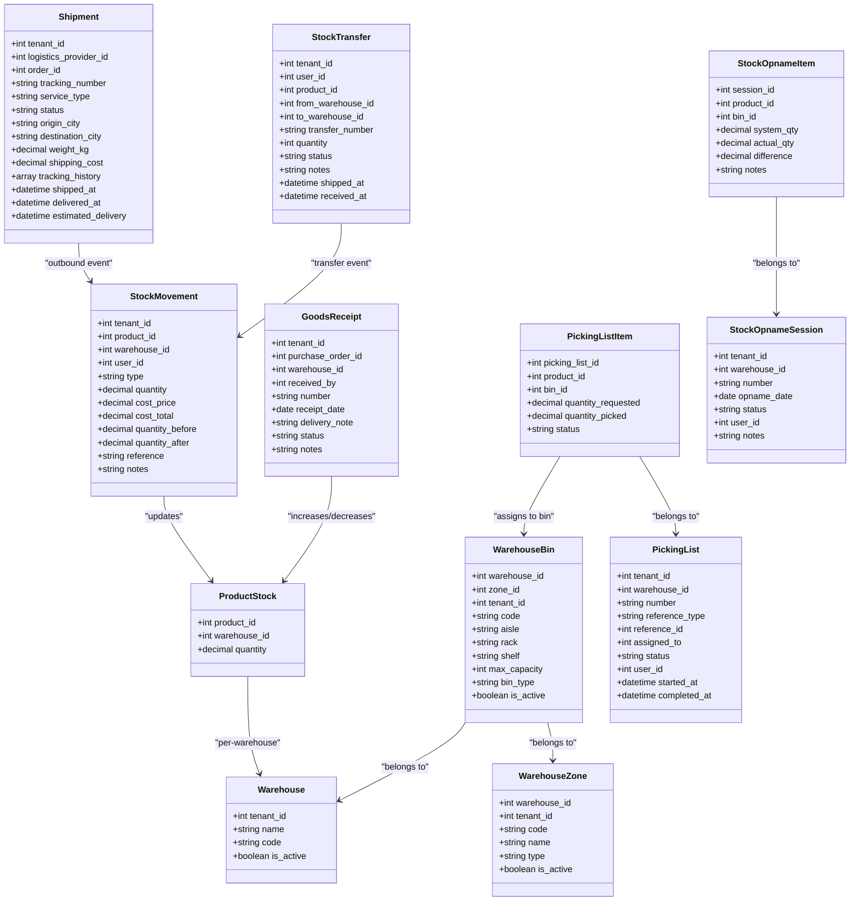

**Diagram sources**
- [StockMovement.php:1-25](file://app/Models/StockMovement.php#L1-L25)
- [ProductStock.php:1-15](file://app/Models/ProductStock.php#L1-L15)
- [Warehouse.php:1-43](file://app/Models/Warehouse.php#L1-L43)
- [WarehouseBin.php:1-24](file://app/Models/WarehouseBin.php#L1-L24)
- [WarehouseZone.php:1-18](file://app/Models/WarehouseZone.php#L1-L18)
- [PickingList.php:1-25](file://app/Models/PickingList.php#L1-L25)
- [PickingListItem.php:1-14](file://app/Models/PickingListItem.php#L1-L14)
- [GoodsReceipt.php:1-26](file://app/Models/GoodsReceipt.php#L1-L26)
- [Shipment.php:1-49](file://app/Models/Shipment.php#L1-L49)
- [StockOpnameSession.php:1-19](file://app/Models/StockOpnameSession.php#L1-L19)
- [StockOpnameItem.php:1-14](file://app/Models/StockOpnameItem.php#L1-L14)
- [StockTransfer.php:1-33](file://app/Models/StockTransfer.php#L1-L33)

## Detailed Component Analysis

### Stock Movement Recording (Receiving, Shipping, Adjustments)
- Receiving (goods receipt) increases stock and records cost depending on tenant costing method.
- Shipping decreases stock and records COGS.
- Adjustments set stock to an exact value.
- Real-time updates maintain quantity_before and quantity_after for auditability.

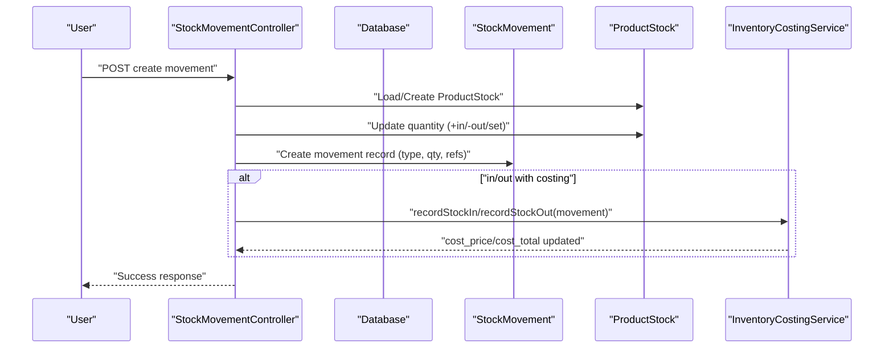

**Diagram sources**
- [StockMovementController.php:34-101](file://app/Http/Controllers/StockMovementController.php#L34-L101)
- [InventoryCostingService.php:31-98](file://app/Services/InventoryCostingService.php#L31-L98)
- [StockMovement.php:1-25](file://app/Models/StockMovement.php#L1-L25)
- [ProductStock.php:1-15](file://app/Models/ProductStock.php#L1-L15)

**Section sources**
- [StockMovementController.php:34-101](file://app/Http/Controllers/StockMovementController.php#L34-L101)
- [InventoryCostingService.php:31-98](file://app/Services/InventoryCostingService.php#L31-L98)

### Internal Transfers and Authorization
- Internal transfers are modeled via StockTransfer with from/to warehouse and authorization timestamps.
- Inventory transfer items track requested/sent/received quantities and unit costs.
- Transfer authorization flow is supported by shipped_at and received_at timestamps.

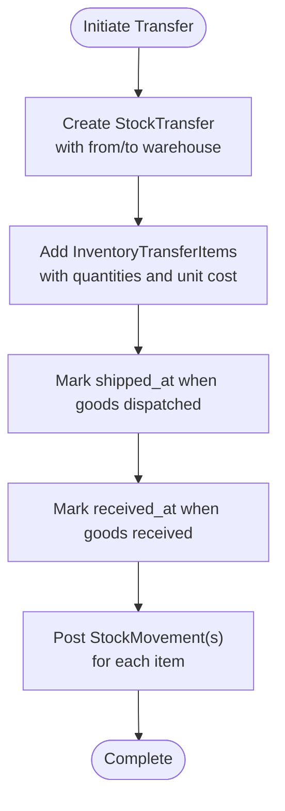

**Diagram sources**
- [StockTransfer.php:1-33](file://app/Models/StockTransfer.php#L1-L33)
- [2026_01_01_000018_create_warehouse_transfer_tables.php:27-44](file://database/migrations/2026_01_01_000018_create_warehouse_transfer_tables.php#L27-L44)
- [2026_04_06_120000_create_multi_company_tables.php:189-217](file://database/migrations/2026_04_06_120000_create_multi_company_tables.php#L189-L217)

**Section sources**
- [StockTransfer.php:1-33](file://app/Models/StockTransfer.php#L1-L33)
- [2026_01_01_000018_create_warehouse_transfer_tables.php:27-44](file://database/migrations/2026_01_01_000018_create_warehouse_transfer_tables.php#L27-L44)
- [2026_04_06_120000_create_multi_company_tables.php:189-217](file://database/migrations/2026_04_06_120000_create_multi_company_tables.php#L189-L217)

### Stock Opname and Cycle Counting
- StockOpnameSession captures session metadata (date, warehouse, status).
- StockOpnameItem compares system quantity to actual count and computes difference.
- Discrepancy resolution is supported by notes and difference tracking.

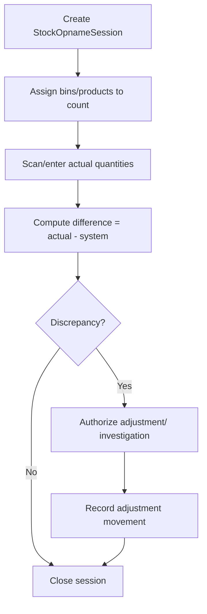

**Diagram sources**
- [StockOpnameSession.php:1-19](file://app/Models/StockOpnameSession.php#L1-L19)
- [StockOpnameItem.php:1-14](file://app/Models/StockOpnameItem.php#L1-L14)

**Section sources**
- [StockOpnameSession.php:1-19](file://app/Models/StockOpnameSession.php#L1-L19)
- [StockOpnameItem.php:1-14](file://app/Models/StockOpnameItem.php#L1-L14)

### Inventory Valuation Updates
- InventoryCostingService supports three methods:
  - simple: uses product.price_buy
  - avco: weighted average cost updated on stock-in
  - fifo: oldest batches consumed first, with synthetic layers when needed
- COGS entries are created on stock-out; valuation reports summarize per-product values.

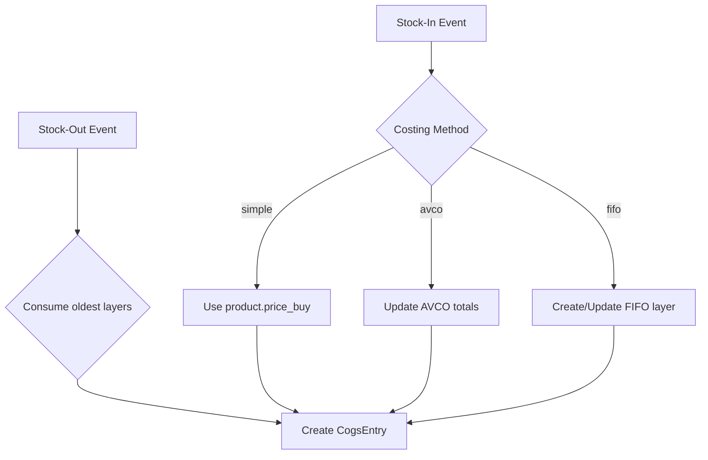

**Diagram sources**
- [InventoryCostingService.php:27-98](file://app/Services/InventoryCostingService.php#L27-L98)

**Section sources**
- [InventoryCostingService.php:27-98](file://app/Services/InventoryCostingService.php#L27-L98)

### Picking and Packing Workflows
- PickingList defines a picking assignment with status and timestamps.
- PickingListItem tracks requested vs picked quantities and links to a bin.
- Mobile and WMS views enable barcode scanning and quantity stepping.

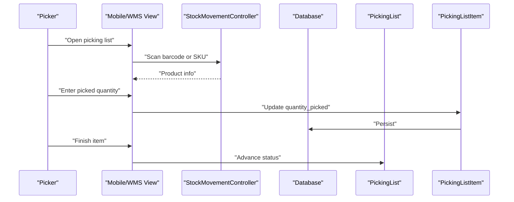

**Diagram sources**
- [picking-show.blade.php:609-644](file://resources/views/mobile/picking-show.blade.php#L609-L644)
- [picking-scan.blade.php:42-46](file://resources/views/wms/picking-scan.blade.php#L42-L46)
- [PickingList.php:1-25](file://app/Models/PickingList.php#L1-L25)
- [PickingListItem.php:1-14](file://app/Models/PickingListItem.php#L1-L14)
- [StockMovementController.php:106-131](file://app/Http/Controllers/StockMovementController.php#L106-L131)

**Section sources**
- [picking-show.blade.php:609-644](file://resources/views/mobile/picking-show.blade.php#L609-L644)
- [picking-scan.blade.php:42-46](file://resources/views/wms/picking-scan.blade.php#L42-L46)
- [PickingList.php:1-25](file://app/Models/PickingList.php#L1-L25)
- [PickingListItem.php:1-14](file://app/Models/PickingListItem.php#L1-L14)
- [StockMovementController.php:106-131](file://app/Http/Controllers/StockMovementController.php#L106-L131)

### Barcode Scanning Integration and Label Printing
- BarcodeService generates barcodes in PNG/SVG/HTML and validates formats (including EAN-13 checksum).
- StockMovementController supports barcode/SKU lookup for products.
- Views integrate scanning UI for picking and mobile devices.

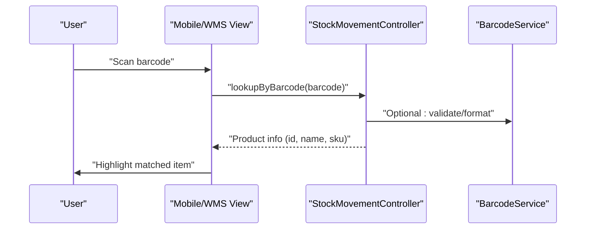

**Diagram sources**
- [BarcodeService.php:52-168](file://app/Services/BarcodeService.php#L52-L168)
- [StockMovementController.php:106-131](file://app/Http/Controllers/StockMovementController.php#L106-L131)
- [picking-show.blade.php:609-644](file://resources/views/mobile/picking-show.blade.php#L609-L644)

**Section sources**
- [BarcodeService.php:52-168](file://app/Services/BarcodeService.php#L52-L168)
- [StockMovementController.php:106-131](file://app/Http/Controllers/StockMovementController.php#L106-L131)
- [picking-show.blade.php:609-644](file://resources/views/mobile/picking-show.blade.php#L609-L644)

### Goods Receipt Validation (Preventing Over-Acceptance)
- Validates that accepted quantities do not exceed purchase order quantities across multiple goods receipts.
- Enforces cumulative tracking and allows partial receipts.

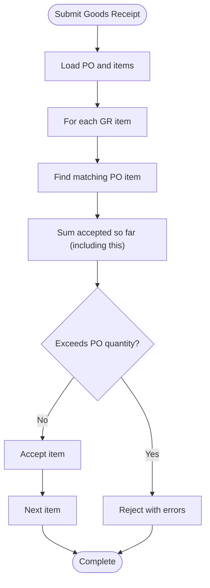

**Diagram sources**
- [GoodsReceiptValidationService.php:30-41](file://app/Services/GoodsReceiptValidationService.php#L30-L41)

**Section sources**
- [GoodsReceiptValidationService.php:30-41](file://app/Services/GoodsReceiptValidationService.php#L30-L41)

## Dependency Analysis
- Controllers depend on models and services for persistence and business logic.
- InventoryCostingService depends on StockMovement, ProductStock, and auxiliary models for costing.
- PickingList/PickingListItem depend on WarehouseBin for bin assignment.
- GoodsReceipt depends on ProductStock to reflect stock changes.
- BarcodeService is used by controllers and views for product lookup and label printing.

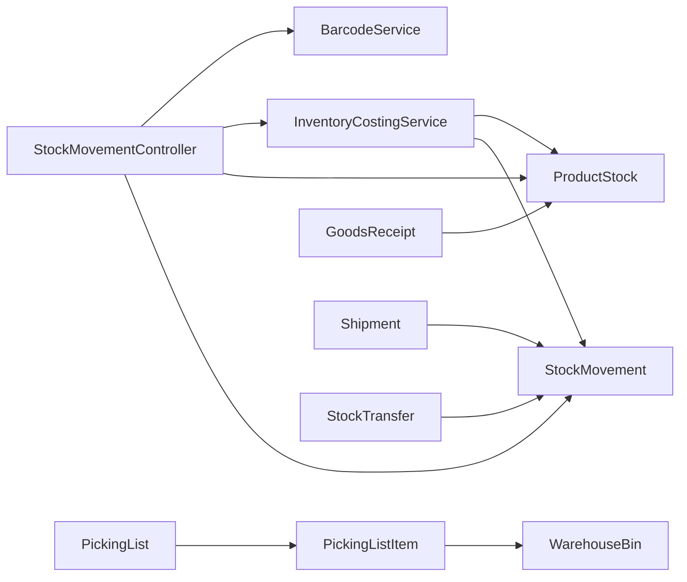

**Diagram sources**
- [StockMovementController.php:1-188](file://app/Http/Controllers/StockMovementController.php#L1-L188)
- [InventoryCostingService.php:1-366](file://app/Services/InventoryCostingService.php#L1-L366)
- [BarcodeService.php:1-283](file://app/Services/BarcodeService.php#L1-L283)
- [PickingList.php:1-25](file://app/Models/PickingList.php#L1-L25)
- [PickingListItem.php:1-14](file://app/Models/PickingListItem.php#L1-L14)
- [WarehouseBin.php:1-24](file://app/Models/WarehouseBin.php#L1-L24)
- [GoodsReceipt.php:1-26](file://app/Models/GoodsReceipt.php#L1-L26)
- [Shipment.php:1-49](file://app/Models/Shipment.php#L1-L49)
- [StockTransfer.php:1-33](file://app/Models/StockTransfer.php#L1-L33)

**Section sources**
- [StockMovementController.php:1-188](file://app/Http/Controllers/StockMovementController.php#L1-L188)
- [InventoryCostingService.php:1-366](file://app/Services/InventoryCostingService.php#L1-L366)
- [BarcodeService.php:1-283](file://app/Services/BarcodeService.php#L1-L283)
- [PickingList.php:1-25](file://app/Models/PickingList.php#L1-L25)
- [PickingListItem.php:1-14](file://app/Models/PickingListItem.php#L1-L14)
- [WarehouseBin.php:1-24](file://app/Models/WarehouseBin.php#L1-L24)
- [GoodsReceipt.php:1-26](file://app/Models/GoodsReceipt.php#L1-L26)
- [Shipment.php:1-49](file://app/Models/Shipment.php#L1-L49)
- [StockTransfer.php:1-33](file://app/Models/StockTransfer.php#L1-L33)

## Performance Considerations
- Use database transactions around stock updates to ensure atomicity.
- Prefer batch operations for barcode generation and label printing.
- Index frequently filtered fields (e.g., tenant_id, status, dates) in movement and transfer tables.
- For high-volume picking, leverage view pagination and client-side scanning to reduce server load.
- Costing calculations (AVCO/FIFO) use locking; avoid concurrent conflicting operations on the same product/batch.

[No sources needed since this section provides general guidance]

## Troubleshooting Guide
- Insufficient stock during out movement: controller enforces quantity checks and returns validation errors.
- Over-receipt prevention: GoodsReceiptValidationService prevents accepting more than PO quantities.
- Barcode lookup failures: Ensure barcode matches product barcode or SKU; validate format using BarcodeService.
- Transfer authorization gaps: Verify shipped_at and received_at timestamps are set appropriately.

**Section sources**
- [StockMovementController.php:66-69](file://app/Http/Controllers/StockMovementController.php#L66-L69)
- [GoodsReceiptValidationService.php:30-41](file://app/Services/GoodsReceiptValidationService.php#L30-L41)
- [BarcodeService.php:159-188](file://app/Services/BarcodeService.php#L159-L188)

## Conclusion
The system provides a robust foundation for stock movement processing, including receiving, shipping, internal transfers, and inventory adjustments. It integrates barcode scanning, supports multiple costing methods, and offers structured workflows for picking, packing, opname, and discrepancy resolution. Real-time stock updates and valuation are maintained through dedicated services and models, enabling accurate inventory tracking and financial reporting.

[No sources needed since this section summarizes without analyzing specific files]

## Appendices

### Data Models Overview
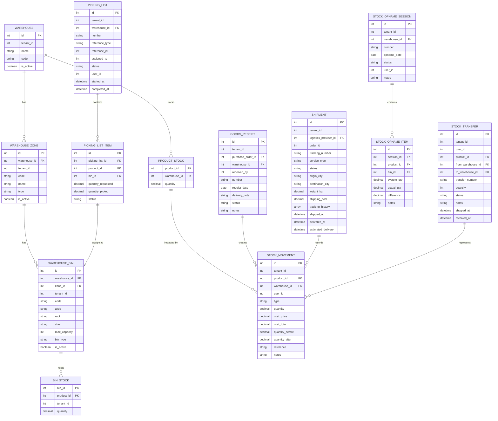

**Diagram sources**
- [Warehouse.php:1-43](file://app/Models/Warehouse.php#L1-L43)
- [WarehouseZone.php:1-18](file://app/Models/WarehouseZone.php#L1-L18)
- [WarehouseBin.php:1-24](file://app/Models/WarehouseBin.php#L1-L24)
- [ProductStock.php:1-15](file://app/Models/ProductStock.php#L1-L15)
- [BinStock.php:1-17](file://app/Models/BinStock.php#L1-L17)
- [StockMovement.php:1-25](file://app/Models/StockMovement.php#L1-L25)
- [PickingList.php:1-25](file://app/Models/PickingList.php#L1-L25)
- [PickingListItem.php:1-14](file://app/Models/PickingListItem.php#L1-L14)
- [GoodsReceipt.php:1-26](file://app/Models/GoodsReceipt.php#L1-L26)
- [Shipment.php:1-49](file://app/Models/Shipment.php#L1-L49)
- [StockOpnameSession.php:1-19](file://app/Models/StockOpnameSession.php#L1-L19)
- [StockOpnameItem.php:1-14](file://app/Models/StockOpnameItem.php#L1-L14)
- [StockTransfer.php:1-33](file://app/Models/StockTransfer.php#L1-L33)