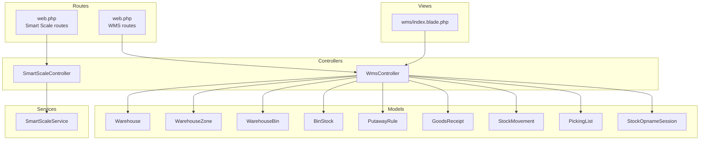
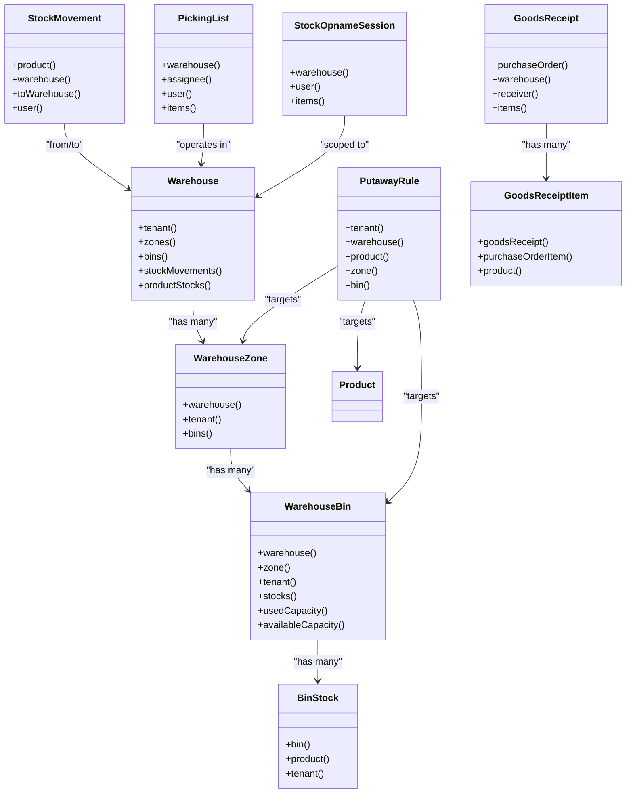
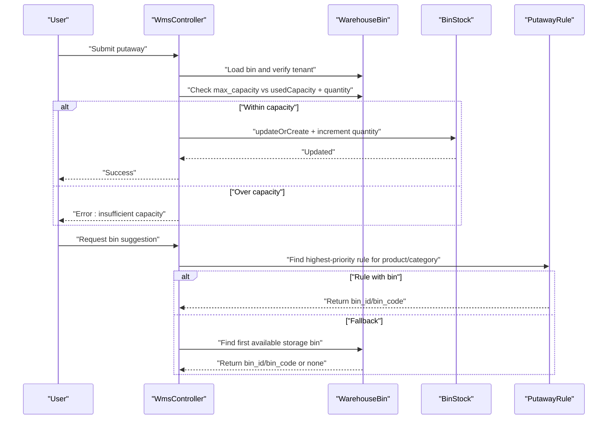
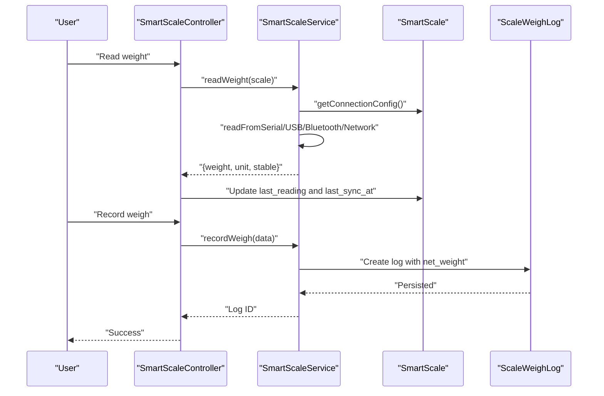
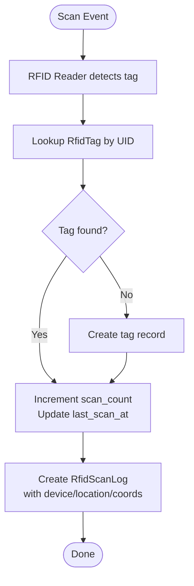
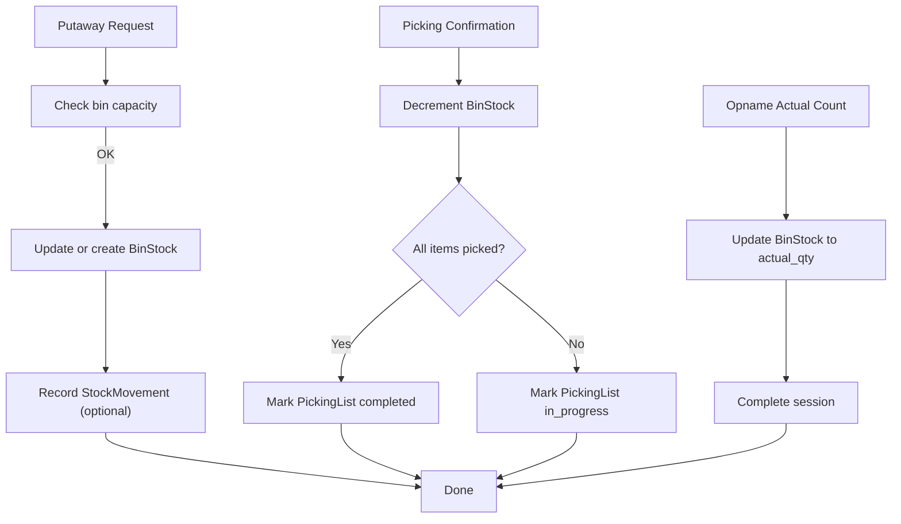
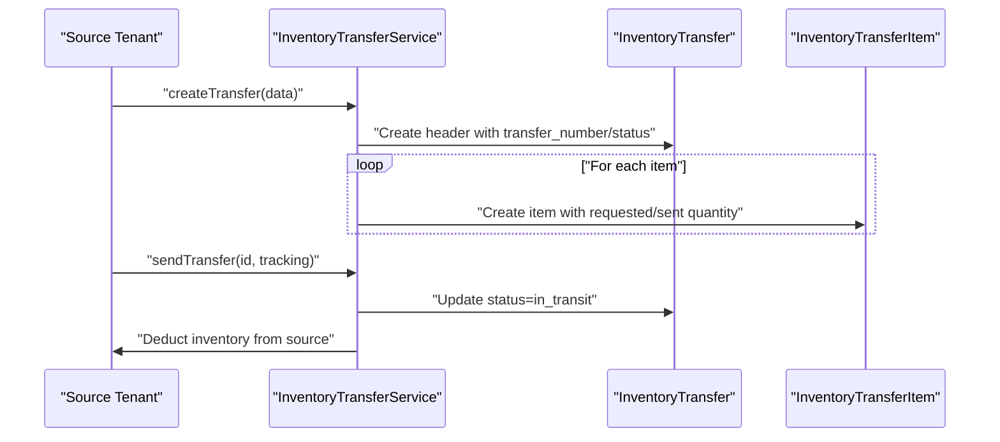
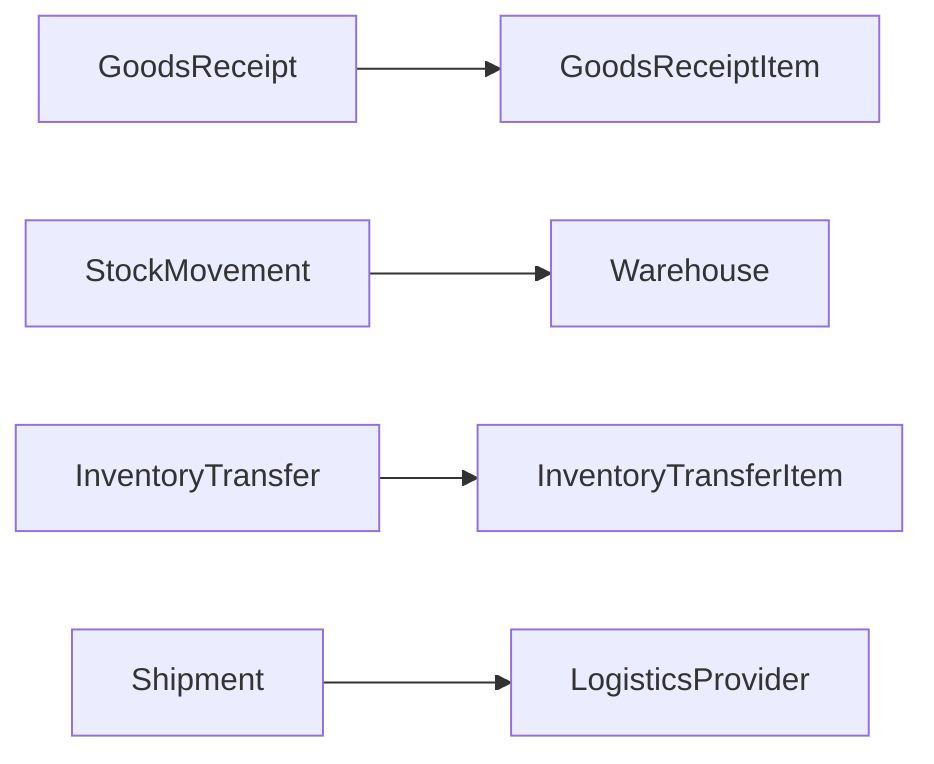
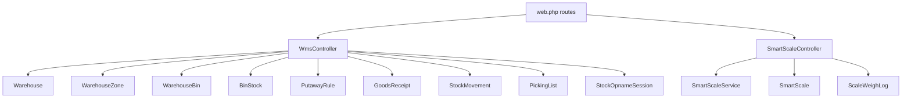

# Warehouse Operations

<cite>
**Referenced Files in This Document**
- [Warehouse.php](file://app/Models/Warehouse.php)
- [WarehouseZone.php](file://app/Models/WarehouseZone.php)
- [WarehouseBin.php](file://app/Models/WarehouseBin.php)
- [BinStock.php](file://app/Models/BinStock.php)
- [PutawayRule.php](file://app/Models/PutawayRule.php)
- [WmsController.php](file://app/Http/Controllers/WmsController.php)
- [SmartScale.php](file://app/Models/SmartScale.php)
- [SmartScaleService.php](file://app/Services/SmartScaleService.php)
- [SmartScaleController.php](file://app/Http/Controllers/Inventory/SmartScaleController.php)
- [2026_03_26_000006_create_wms_tables.php](file://database/migrations/2026_03_26_000006_create_wms_tables.php)
- [2026_04_05_155258_create_smart_scales_table.php](file://database/migrations/2026_04_05_155258_create_smart_scales_table.php)
- [RfidTag.php](file://app/Models/RfidTag.php)
- [RfidScanLog.php](file://app/Models/RfidScanLog.php)
- [RfidScannerDevice.php](file://app/Models/RfidScannerDevice.php)
- [GoodsReceipt.php](file://app/Models/GoodsReceipt.php)
- [GoodsReceiptItem.php](file://app/Models/GoodsReceiptItem.php)
- [Shipment.php](file://app/Models/Shipment.php)
- [StockMovement.php](file://app/Models/StockMovement.php)
- [StockOpnameSession.php](file://app/Models/StockOpnameSession.php)
- [StockOpnameItem.php](file://app/Models/StockOpnameItem.php)
- [PickingList.php](file://app/Models/PickingList.php)
- [web.php](file://routes/web.php)
- [index.blade.php](file://resources/views/wms/index.blade.php)
</cite>

## Table of Contents
1. [Introduction](#introduction)
2. [Project Structure](#project-structure)
3. [Core Components](#core-components)
4. [Architecture Overview](#architecture-overview)
5. [Detailed Component Analysis](#detailed-component-analysis)
6. [Dependency Analysis](#dependency-analysis)
7. [Performance Considerations](#performance-considerations)
8. [Troubleshooting Guide](#troubleshooting-guide)
9. [Conclusion](#conclusion)
10. [Appendices](#appendices)

## Introduction
This document explains the Warehouse Operations subsystem, focusing on warehouse setup, location management, bin assignments, and zone configurations. It documents smart scale integration, RFID tracking, automated inventory updates, and warehouse capacity management. It also covers multi-location inventory handling, bin optimization, and warehouse staff management, along with integrations to receiving, shipping, and internal transfer processes.

## Project Structure
Warehouse Operations spans models, controllers, services, migrations, routes, and views:
- Models define the domain entities: Warehouse, WarehouseZone, WarehouseBin, BinStock, PutawayRule, and supporting transactional entities like GoodsReceipt, StockMovement, PickingList, and StockOpnameSession.
- Controllers orchestrate UI flows for WMS (Warehouse Management Screen) and Smart Scale management.
- Services encapsulate business logic for smart scale connectivity and weigh processing.
- Migrations define the schema for WMS and smart scales.
- Routes expose endpoints for WMS and Smart Scale management.
- Views render the WMS dashboard and forms.

**Diagram sources**
- [WmsController.php:1-445](file://app/Http/Controllers/WmsController.php#L1-L445)
- [SmartScaleController.php:1-51](file://app/Http/Controllers/Inventory/SmartScaleController.php#L1-L51)
- [SmartScaleService.php:1-426](file://app/Services/SmartScaleService.php#L1-L426)
- [Warehouse.php:1-43](file://app/Models/Warehouse.php#L1-L43)
- [WarehouseZone.php:1-17](file://app/Models/WarehouseZone.php#L1-L17)
- [WarehouseBin.php:1-23](file://app/Models/WarehouseBin.php#L1-L23)
- [BinStock.php:1-17](file://app/Models/BinStock.php#L1-L17)
- [PutawayRule.php:1-19](file://app/Models/PutawayRule.php#L1-L19)
- [GoodsReceipt.php:1-26](file://app/Models/GoodsReceipt.php#L1-L26)
- [StockMovement.php:1-25](file://app/Models/StockMovement.php#L1-L25)
- [PickingList.php:1-25](file://app/Models/PickingList.php#L1-L25)
- [StockOpnameSession.php:1-19](file://app/Models/StockOpnameSession.php#L1-L19)
- [web.php:667-677](file://routes/web.php#L667-L677)
- [web.php:2698-2707](file://routes/web.php#L2698-L2707)
- [index.blade.php:20-127](file://resources/views/wms/index.blade.php#L20-L127)

**Section sources**
- [WmsController.php:1-445](file://app/Http/Controllers/WmsController.php#L1-L445)
- [SmartScaleController.php:1-51](file://app/Http/Controllers/Inventory/SmartScaleController.php#L1-L51)
- [SmartScaleService.php:1-426](file://app/Services/SmartScaleService.php#L1-L426)
- [2026_03_26_000006_create_wms_tables.php:1-54](file://database/migrations/2026_03_26_000006_create_wms_tables.php#L1-L54)
- [2026_04_05_155258_create_smart_scales_table.php:1-50](file://database/migrations/2026_04_05_155258_create_smart_scales_table.php#L1-L50)
- [web.php:667-677](file://routes/web.php#L667-L677)
- [web.php:2698-2707](file://routes/web.php#L2698-L2707)
- [index.blade.php:20-127](file://resources/views/wms/index.blade.php#L20-L127)

## Core Components
- Warehouse: Top-level entity representing a physical or logical warehouse with soft-deletes and tenant scoping.
- WarehouseZone: Logical areas within a warehouse (e.g., general, cold, hazmat, staging, returns), scoped to tenant and warehouse.
- WarehouseBin: Physical storage locations with attributes like aisle, rack, shelf, max capacity, bin type, and active flag; linked to a zone and tenant.
- BinStock: Per-bin inventory records linking a product to a bin with quantity, enabling precise stock visibility.
- PutawayRule: Business rules to auto-assign optimal bins for products or categories by zone/bin priority.
- WmsController: Orchestrates WMS UI flows including zone/bin creation, putaway, picking, stock opname, and label printing.
- SmartScale and SmartScaleService: Manage smart scale devices, read weights, tare operations, and process weigh logs for integration with receipts, opname, and production.
- RFID Entities: RfidTag, RfidScanLog, RfidScannerDevice capture tag lifecycle, scanning events, and device metadata for location-aware tracking.
- Receiving, Shipping, and Transfers: GoodsReceipt, GoodsReceiptItem, Shipment, StockMovement integrate with WMS for inbound/outbound flows and inter-warehouse movements.

**Section sources**
- [Warehouse.php:1-43](file://app/Models/Warehouse.php#L1-L43)
- [WarehouseZone.php:1-17](file://app/Models/WarehouseZone.php#L1-L17)
- [WarehouseBin.php:1-23](file://app/Models/WarehouseBin.php#L1-L23)
- [BinStock.php:1-17](file://app/Models/BinStock.php#L1-L17)
- [PutawayRule.php:1-19](file://app/Models/PutawayRule.php#L1-L19)
- [WmsController.php:1-445](file://app/Http/Controllers/WmsController.php#L1-L445)
- [SmartScale.php:1-426](file://app/Models/SmartScale.php#L1-L426)
- [SmartScaleService.php:1-426](file://app/Services/SmartScaleService.php#L1-L426)
- [RfidTag.php:1-108](file://app/Models/RfidTag.php#L1-L108)
- [RfidScanLog.php:1-67](file://app/Models/RfidScanLog.php#L1-L67)
- [RfidScannerDevice.php:1-63](file://app/Models/RfidScannerDevice.php#L1-L63)
- [GoodsReceipt.php:1-26](file://app/Models/GoodsReceipt.php#L1-L26)
- [GoodsReceiptItem.php:1-25](file://app/Models/GoodsReceiptItem.php#L1-L25)
- [Shipment.php:1-49](file://app/Models/Shipment.php#L1-L49)
- [StockMovement.php:1-25](file://app/Models/StockMovement.php#L1-L25)
- [StockOpnameSession.php:1-19](file://app/Models/StockOpnameSession.php#L1-L19)
- [StockOpnameItem.php:1-14](file://app/Models/StockOpnameItem.php#L1-L14)
- [PickingList.php:1-25](file://app/Models/PickingList.php#L1-L25)

## Architecture Overview
The WMS architecture follows a layered pattern:
- Presentation: Blade views and controller actions render dashboards and forms.
- Application: Controllers coordinate domain operations and delegate to services where applicable.
- Domain: Models encapsulate business rules (capacity checks, tenant scoping, relations).
- Persistence: Migrations define the schema for WMS, smart scales, RFID, and transactional entities.

**Diagram sources**
- [Warehouse.php:1-43](file://app/Models/Warehouse.php#L1-L43)
- [WarehouseZone.php:1-17](file://app/Models/WarehouseZone.php#L1-L17)
- [WarehouseBin.php:1-23](file://app/Models/WarehouseBin.php#L1-L23)
- [BinStock.php:1-17](file://app/Models/BinStock.php#L1-L17)
- [PutawayRule.php:1-19](file://app/Models/PutawayRule.php#L1-L19)
- [GoodsReceipt.php:1-26](file://app/Models/GoodsReceipt.php#L1-L26)
- [GoodsReceiptItem.php:1-25](file://app/Models/GoodsReceiptItem.php#L1-L25)
- [StockMovement.php:1-25](file://app/Models/StockMovement.php#L1-L25)
- [PickingList.php:1-25](file://app/Models/PickingList.php#L1-L25)
- [StockOpnameSession.php:1-19](file://app/Models/StockOpnameSession.php#L1-L19)

## Detailed Component Analysis

### Warehouse Setup and Location Management
- Warehouse: Defines tenant-scoped warehouses with activation flag and soft deletes. Provides relations to zones, bins, stock movements, and product stocks.
- WarehouseZone: Encapsulates logical zones with type classification and uniqueness per warehouse/code. Links to bins and tenant.
- WarehouseBin: Encapsulates physical locations with optional zone linkage, capacity limits, bin type, and active flag. Computes used and available capacity.

Key capabilities:
- Zone creation with validation for warehouse, code, name, and type.
- Bin creation with auto-generated code from zone prefix and aisle/rack/shelf segments; supports bulk creation across ranges.
- Capacity enforcement during putaway to prevent overfills.

**Section sources**
- [Warehouse.php:1-43](file://app/Models/Warehouse.php#L1-L43)
- [WarehouseZone.php:1-17](file://app/Models/WarehouseZone.php#L1-L17)
- [WarehouseBin.php:1-23](file://app/Models/WarehouseBin.php#L1-L23)
- [WmsController.php:28-130](file://app/Http/Controllers/WmsController.php#L28-L130)
- [2026_03_26_000006_create_wms_tables.php:11-39](file://database/migrations/2026_03_26_000006_create_wms_tables.php#L11-L39)

### Bin Assignments and Putaway
- PutawayRule: Allows assigning preferred zones/bins for products or categories with priority and activation flags.
- WmsController.putaway: Validates tenant ownership, checks capacity, and updates BinStock quantities atomically.
- WmsController.suggestBin: Applies PutawayRule precedence, then falls back to available storage bins.

**Diagram sources**
- [WmsController.php:134-183](file://app/Http/Controllers/WmsController.php#L134-L183)
- [PutawayRule.php:1-19](file://app/Models/PutawayRule.php#L1-L19)
- [WarehouseBin.php:19-23](file://app/Models/WarehouseBin.php#L19-L23)
- [BinStock.php:1-17](file://app/Models/BinStock.php#L1-L17)

**Section sources**
- [WmsController.php:132-183](file://app/Http/Controllers/WmsController.php#L132-L183)
- [PutawayRule.php:1-19](file://app/Models/PutawayRule.php#L1-L19)
- [WarehouseBin.php:19-23](file://app/Models/WarehouseBin.php#L19-L23)
- [BinStock.php:1-17](file://app/Models/BinStock.php#L1-L17)

### Zone Configurations
- Zones support classification (general, cold, hazmat, staging, returns) and are unique per warehouse/code.
- The WMS view groups bins by zones and exposes filtering and creation UI.

**Section sources**
- [WarehouseZone.php:1-17](file://app/Models/WarehouseZone.php#L1-L17)
- [2026_03_26_000006_create_wms_tables.php:11-22](file://database/migrations/2026_03_26_000006_create_wms_tables.php#L11-L22)
- [index.blade.php:25-37](file://resources/views/wms/index.blade.php#L25-L37)

### Smart Scale Integration
Smart scales are modeled and managed via dedicated entities and a service:
- SmartScale: Device metadata, connection parameters, and status.
- SmartScaleService: Reads weight from serial/USB/Bluetooth/network connections, parses vendor-specific formats, records weigh logs, and processes them based on reference type.
- SmartScaleController: CRUD operations for scales and endpoints to test connection, read weight, and tare.

**Diagram sources**
- [SmartScaleController.php:1-51](file://app/Http/Controllers/Inventory/SmartScaleController.php#L1-L51)
- [SmartScaleService.php:14-135](file://app/Services/SmartScaleService.php#L14-L135)
- [SmartScale.php:1-426](file://app/Models/SmartScale.php#L1-L426)
- [2026_04_05_155258_create_smart_scales_table.php:11-40](file://database/migrations/2026_04_05_155258_create_smart_scales_table.php#L11-L40)

**Section sources**
- [SmartScaleController.php:23-51](file://app/Http/Controllers/Inventory/SmartScaleController.php#L23-L51)
- [SmartScaleService.php:14-135](file://app/Services/SmartScaleService.php#L14-L135)
- [2026_04_05_155258_create_smart_scales_table.php:11-40](file://database/migrations/2026_04_05_155258_create_smart_scales_table.php#L11-L40)
- [web.php:667-677](file://routes/web.php#L667-L677)

### RFID Tracking
RFID enables location-aware tracking:
- RfidTag: Tag metadata, encryption, assignment to a taggable model, and scan statistics.
- RfidScanLog: Records scan events with device, location, warehouse, coordinates, and scan type.
- RfidScannerDevice: Scanner device metadata and connection status.

**Diagram sources**
- [RfidTag.php:87-98](file://app/Models/RfidTag.php#L87-L98)
- [RfidScanLog.php:1-67](file://app/Models/RfidScanLog.php#L1-L67)
- [RfidScannerDevice.php:57-61](file://app/Models/RfidScannerDevice.php#L57-L61)

**Section sources**
- [RfidTag.php:1-108](file://app/Models/RfidTag.php#L1-L108)
- [RfidScanLog.php:1-67](file://app/Models/RfidScanLog.php#L1-L67)
- [RfidScannerDevice.php:1-63](file://app/Models/RfidScannerDevice.php#L1-L63)

### Automated Inventory Updates
- Putaway: Adds or increases BinStock quantities after capacity checks.
- Picking: Decrements BinStock quantities upon confirmation and advances PickingList status.
- Stock Opname: Updates BinStock quantities to actual counts and completes sessions.
- SmartScaleService.processWeighLog: Placeholder for integrating weigh logs into receipts, opname, and production workflows.

**Diagram sources**
- [WmsController.php:134-183](file://app/Http/Controllers/WmsController.php#L134-L183)
- [WmsController.php:289-320](file://app/Http/Controllers/WmsController.php#L289-L320)
- [WmsController.php:389-407](file://app/Http/Controllers/WmsController.php#L389-L407)
- [StockMovement.php:1-25](file://app/Models/StockMovement.php#L1-L25)
- [BinStock.php:1-17](file://app/Models/BinStock.php#L1-L17)

**Section sources**
- [WmsController.php:132-183](file://app/Http/Controllers/WmsController.php#L132-L183)
- [WmsController.php:289-320](file://app/Http/Controllers/WmsController.php#L289-L320)
- [WmsController.php:389-407](file://app/Http/Controllers/WmsController.php#L389-L407)
- [StockMovement.php:1-25](file://app/Models/StockMovement.php#L1-L25)
- [BinStock.php:1-17](file://app/Models/BinStock.php#L1-L17)

### Multi-Location Inventory Handling and Internal Transfers
- StockMovement: Captures intra- and inter-warehouse movements with cost price/total and reference tracking.
- Inventory Transfer (multi-company): Supports cross-tenant transfers with statuses, shipping details, and item-level tracking.

**Diagram sources**
- [StockMovement.php:1-25](file://app/Models/StockMovement.php#L1-L25)
- [InventoryTransfer.php:1-60](file://app/Models/InventoryTransfer.php#L1-L60)
- [InventoryTransferService.php:13-74](file://app/Services/MultiCompany/InventoryTransferService.php#L13-L74)
- [web.php:2698-2707](file://routes/web.php#L2698-L2707)

**Section sources**
- [StockMovement.php:1-25](file://app/Models/StockMovement.php#L1-L25)
- [InventoryTransfer.php:1-60](file://app/Models/InventoryTransfer.php#L1-L60)
- [InventoryTransferService.php:13-74](file://app/Services/MultiCompany/InventoryTransferService.php#L13-L74)
- [web.php:2698-2707](file://routes/web.php#L2698-L2707)

### Warehouse Capacity Management
- WarehouseBin.availableCapacity: Enforces max_capacity per bin; returns null for unlimited capacity.
- Putaway rejects transactions exceeding available capacity.

**Section sources**
- [WarehouseBin.php:19-23](file://app/Models/WarehouseBin.php#L19-L23)
- [WmsController.php:145-147](file://app/Http/Controllers/WmsController.php#L145-L147)

### Bin Optimization
- PutawayRule prioritizes zone/bin assignments for products/categories.
- WmsController.suggestBin selects the best available storage bin when no rule applies.

**Section sources**
- [PutawayRule.php:1-19](file://app/Models/PutawayRule.php#L1-L19)
- [WmsController.php:157-183](file://app/Http/Controllers/WmsController.php#L157-L183)

### Warehouse Staff Management
- PickingList supports assignment to users and tracks status and timestamps.
- WmsController exposes picking list creation and scanning UI.

**Section sources**
- [PickingList.php:1-25](file://app/Models/PickingList.php#L1-L25)
- [WmsController.php:187-242](file://app/Http/Controllers/WmsController.php#L187-L242)
- [index.blade.php:189-197](file://resources/views/wms/index.blade.php#L189-L197)

### Integration with Receiving, Shipping, and Internal Transfers
- Receiving: GoodsReceipt and GoodsReceiptItem track received quantities and acceptance/rejection.
- Shipping: Shipment captures logistics provider, tracking number, weight, costs, and delivery timestamps.
- Transfers: StockMovement handles movement records; InventoryTransfer manages cross-tenant transfers.

**Diagram sources**
- [GoodsReceipt.php:1-26](file://app/Models/GoodsReceipt.php#L1-L26)
- [GoodsReceiptItem.php:1-25](file://app/Models/GoodsReceiptItem.php#L1-L25)
- [StockMovement.php:1-25](file://app/Models/StockMovement.php#L1-L25)
- [InventoryTransfer.php:1-60](file://app/Models/InventoryTransfer.php#L1-L60)
- [Shipment.php:1-49](file://app/Models/Shipment.php#L1-L49)

**Section sources**
- [GoodsReceipt.php:1-26](file://app/Models/GoodsReceipt.php#L1-L26)
- [GoodsReceiptItem.php:1-25](file://app/Models/GoodsReceiptItem.php#L1-L25)
- [StockMovement.php:1-25](file://app/Models/StockMovement.php#L1-L25)
- [InventoryTransfer.php:1-60](file://app/Models/InventoryTransfer.php#L1-L60)
- [Shipment.php:1-49](file://app/Models/Shipment.php#L1-L49)

## Dependency Analysis
- Controllers depend on models and services to enforce tenant scoping and business rules.
- Services encapsulate external integrations (smart scales) and centralize business logic.
- Migrations define schema dependencies and constraints ensuring referential integrity.

**Diagram sources**
- [WmsController.php:1-445](file://app/Http/Controllers/WmsController.php#L1-L445)
- [SmartScaleController.php:1-51](file://app/Http/Controllers/Inventory/SmartScaleController.php#L1-L51)
- [SmartScaleService.php:1-426](file://app/Services/SmartScaleService.php#L1-L426)
- [web.php:667-677](file://routes/web.php#L667-L677)
- [web.php:2698-2707](file://routes/web.php#L2698-L2707)

**Section sources**
- [WmsController.php:1-445](file://app/Http/Controllers/WmsController.php#L1-L445)
- [SmartScaleController.php:1-51](file://app/Http/Controllers/Inventory/SmartScaleController.php#L1-L51)
- [SmartScaleService.php:1-426](file://app/Services/SmartScaleService.php#L1-L426)
- [web.php:667-677](file://routes/web.php#L667-L677)
- [web.php:2698-2707](file://routes/web.php#L2698-L2707)

## Performance Considerations
- Use pagination for large bin lists and opname sessions to limit memory and response size.
- Indexes on tenant_id and frequently filtered columns (e.g., warehouse_id, status) improve query performance.
- Batch operations (bulk bin creation) reduce repeated round-trips.
- Prefer atomic increments/decrements for BinStock quantities to avoid race conditions.
- Offload heavy I/O (e.g., serial/USB/Bluetooth reads) to background jobs or external services to keep UI responsive.

## Troubleshooting Guide
- Capacity errors during putaway: Verify bin max_capacity and usedCapacity; adjust or select another bin.
- Smart scale connection failures: Confirm device_id uniqueness, connection parameters, and required PHP extensions; use test endpoint to diagnose.
- RFID scan anomalies: Check tag UID mapping, scanner device connectivity, and scan logs for missing location/coordinates.
- Opname discrepancies: Ensure actual_qty entries are captured and differences are reconciled before completing sessions.
- Cross-tenant transfers: Validate from_tenant_id and to_tenant_id; ensure inventory deductions occur on send.

**Section sources**
- [WmsController.php:145-147](file://app/Http/Controllers/WmsController.php#L145-L147)
- [SmartScaleService.php:140-164](file://app/Services/SmartScaleService.php#L140-L164)
- [RfidTag.php:87-98](file://app/Models/RfidTag.php#L87-L98)
- [WmsController.php:389-407](file://app/Http/Controllers/WmsController.php#L389-L407)
- [InventoryTransferService.php:52-74](file://app/Services/MultiCompany/InventoryTransferService.php#L52-L74)

## Conclusion
The Warehouse Operations subsystem provides robust capabilities for warehouse setup, zone and bin management, capacity control, and optimized putaway/picking workflows. Smart scale and RFID integrations enable accurate, real-time inventory updates. The design leverages tenant scoping, explicit capacity checks, and transactional models to maintain data integrity across receiving, shipping, and internal transfers.

## Appendices
- WMS Dashboard UI: Filter by warehouse and zone, manage zones/bins, and view occupancy/product stats.
- Label Printing: Generate barcode labels for individual or batch bins.

**Section sources**
- [index.blade.php:20-127](file://resources/views/wms/index.blade.php#L20-L127)
- [WmsController.php:251-287](file://app/Http/Controllers/WmsController.php#L251-L287)