# Notification System Modernization

<cite>
**Referenced Files in This Document**
- [NotificationService.php](file://app/Services/NotificationService.php)
- [NotificationDigestService.php](file://app/Services/NotificationDigestService.php)
- [NotificationEscalationService.php](file://app/Services/NotificationEscalationService.php)
- [PushNotificationService.php](file://app/Services/PushNotificationService.php)
- [WebPushService.php](file://app/Services/WebPushService.php)
- [NotificationPreference.php](file://app/Models/NotificationPreference.php)
- [ErpNotification.php](file://app/Models/ErpNotification.php)
- [NotificationEscalation.php](file://app/Models/NotificationEscalation.php)
- [SendErpNotificationBatch.php](file://app/Jobs/SendErpNotificationBatch.php)
- [NotificationController.php](file://app/Http/Controllers/NotificationController.php)
- [NotificationPreferenceController.php](file://app/Http/Controllers/NotificationPreferenceController.php)
- [SendNotificationDigest.php](file://app/Console/Commands/SendNotificationDigest.php)
- [ProcessNotificationEscalations.php](file://app/Console/Commands/ProcessNotificationEscalations.php)
- [2026_04_10_000001_update_notification_preferences_add_channels.php](file://database/migrations/2026_04_10_000001_update_notification_preferences_add_channels.php)
- [push-notification.js](file://resources/js/push-notification.js)
- [NotificationDigestEmail.php](file://app/Notifications/NotificationDigestEmail.php)
- [DocumentExpiryNotification.php](file://app/Notifications/DocumentExpiryNotification.php)
- [TelemedicineReminderNotification.php](file://app/Notifications/TelemedicineReminderNotification.php)
- [ReportSharedNotification.php](file://app/Notifications/ReportSharedNotification.php)
- [Document.php](file://app/Models/Document.php)
- [Teleconsultation.php](file://app/Models/Teleconsultation.php)
- [SharedReport.php](file://app/Models/SharedReport.php)
- [SendTelemedicineReminders.php](file://app/Console/Commands/SendTelemedicineReminders.php)
- [TelemedicineReminderService.php](file://app/Services/TelemedicineReminderService.php)
- [ProcessReminders.php](file://app/Console/Commands/ProcessReminders.php)
- [Reminder.php](file://app/Models/Reminder.php)
</cite>

## Update Summary
**Changes Made**
- Added comprehensive documentation for new notification types: DocumentExpiryNotification, TelemedicineReminderNotification, and ReportSharedNotification
- Enhanced notification service with healthcare and document management notification support
- Updated reminder system documentation with telemedicine consultation reminders
- Added shared report notification system with expiration tracking
- Expanded notification types to include healthcare, document management, and reporting modules
- Enhanced notification preferences to support new notification categories

## Table of Contents
1. [Introduction](#introduction)
2. [System Architecture](#system-architecture)
3. [Core Components](#core-components)
4. [Notification Channels](#notification-channels)
5. [Notification Types and Workflows](#notification-types-and-workflows)
6. [Escalation System](#escalation-system)
7. [Digest and Summarization](#digest-and-summarization)
8. [Push Notification Implementation](#push-notification-implementation)
9. [Configuration and Preferences](#configuration-and-preferences)
10. [Performance and Scalability](#performance-and-scalability)
11. [Troubleshooting Guide](#troubleshooting-guide)
12. [Conclusion](#conclusion)

## Introduction

The Notification System Modernization project represents a comprehensive overhaul of qalcuityERP's notification infrastructure, transforming it from a basic in-app messaging system into a sophisticated, multi-channel notification platform. This modernization introduces advanced features including real-time push notifications, automated escalation workflows, intelligent digest generation, and granular user preferences management.

The system now supports multiple notification channels (in-app, email, push, WhatsApp), intelligent scheduling with quiet hours and Do Not Disturb functionality, automated escalation mechanisms, and comprehensive analytics for notification delivery and engagement tracking. This modernization addresses scalability concerns while maintaining backward compatibility and introducing new capabilities for enterprise-grade notification management.

**Updated** Enhanced with comprehensive healthcare, document management, and reporting notification systems including telemedicine reminders, document expiry alerts, and shared report notifications.

## System Architecture

The notification system follows a modular architecture with clear separation of concerns across different service layers:

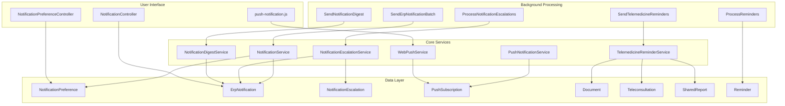

**Diagram sources**
- [NotificationService.php:1-579](file://app/Services/NotificationService.php#L1-L579)
- [NotificationEscalationService.php:1-200](file://app/Services/NotificationEscalationService.php#L1-L200)
- [NotificationDigestService.php:1-241](file://app/Services/NotificationDigestService.php#L1-L241)
- [PushNotificationService.php:1-243](file://app/Services/PushNotificationService.php#L1-L243)
- [WebPushService.php:1-149](file://app/Services/WebPushService.php#L1-L149)
- [TelemedicineReminderService.php:1-135](file://app/Services/TelemedicineReminderService.php#L1-L135)

## Core Components

### Notification Service Engine

The central `NotificationService` orchestrates all notification generation and distribution activities. It implements comprehensive business logic for monitoring various ERP modules and generating appropriate notifications based on predefined criteria.

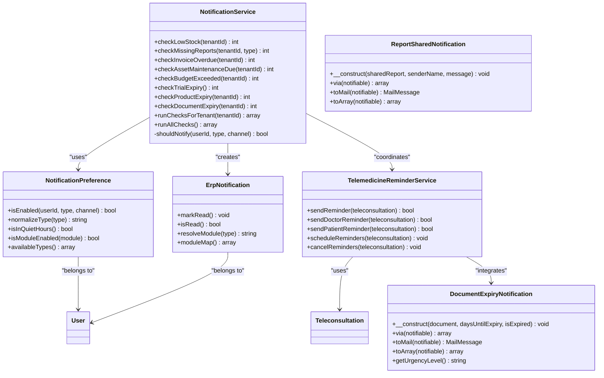

**Diagram sources**
- [NotificationService.php:21-579](file://app/Services/NotificationService.php#L21-L579)
- [NotificationPreference.php:8-148](file://app/Models/NotificationPreference.php#L8-L148)
- [ErpNotification.php:10-106](file://app/Models/ErpNotification.php#L10-L106)
- [TelemedicineReminderService.php:10-135](file://app/Services/TelemedicineReminderService.php#L10-L135)
- [DocumentExpiryNotification.php:11-142](file://app/Notifications/DocumentExpiryNotification.php#L11-L142)
- [ReportSharedNotification.php:11-81](file://app/Notifications/ReportSharedNotification.php#L11-L81)

**Section sources**
- [NotificationService.php:21-579](file://app/Services/NotificationService.php#L21-L579)
- [NotificationPreference.php:8-148](file://app/Models/NotificationPreference.php#L8-L148)
- [ErpNotification.php:10-106](file://app/Models/ErpNotification.php#L10-L106)
- [TelemedicineReminderService.php:10-135](file://app/Services/TelemedicineReminderService.php#L10-L135)

### Background Processing Architecture

The system leverages Laravel's queuing system for scalable background processing of notification tasks:

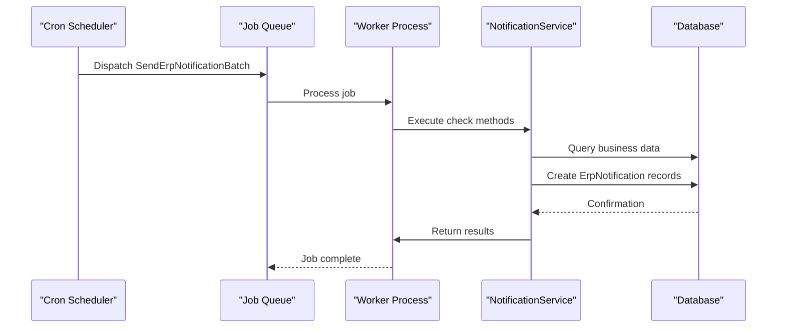

**Diagram sources**
- [SendErpNotificationBatch.php:13-41](file://app/Jobs/SendErpNotificationBatch.php#L13-L41)
- [NotificationService.php:567-579](file://app/Services/NotificationService.php#L567-L579)

**Section sources**
- [SendErpNotificationBatch.php:13-41](file://app/Jobs/SendErpNotificationBatch.php#L13-L41)
- [NotificationService.php:567-579](file://app/Services/NotificationService.php#L567-L579)

## Notification Channels

### Multi-Channel Support Architecture

The modernized notification system supports four primary channels with sophisticated routing and delivery mechanisms:

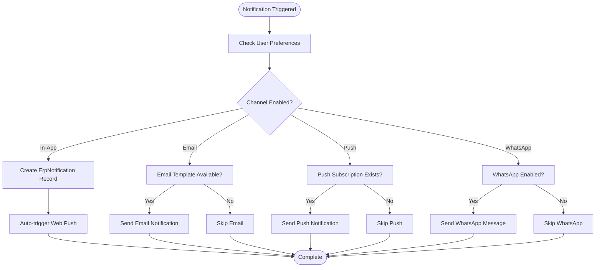

**Diagram sources**
- [NotificationService.php:28-31](file://app/Services/NotificationService.php#L28-L31)
- [PushNotificationService.php:14-28](file://app/Services/PushNotificationService.php#L14-L28)
- [WebPushService.php:24-28](file://app/Services/WebPushService.php#L24-L28)

**Section sources**
- [NotificationService.php:28-31](file://app/Services/NotificationService.php#L28-L31)
- [PushNotificationService.php:14-28](file://app/Services/PushNotificationService.php#L14-L28)
- [WebPushService.php:24-28](file://app/Services/WebPushService.php#L24-L28)

### Channel-Specific Implementations

Each notification channel has specialized implementation with unique characteristics:

| Channel | Technology | Delivery Mechanism | Configuration |
|---------|------------|-------------------|---------------|
| In-App | Database | Real-time | Preference-based |
| Email | Laravel Mail | SMTP/Queued | Template-based |
| Push | Web Push Protocol | VAPID Authentication | Subscription-based |
| WhatsApp | Third-party API | REST API | Credential-based |

**Section sources**
- [NotificationPreference.php:10-34](file://app/Models/NotificationPreference.php#L10-L34)
- [WebPushService.php:114-130](file://app/Services/WebPushService.php#L114-L130)

## Notification Types and Workflows

### Automated Monitoring Workflows

The system implements comprehensive monitoring across all major ERP modules with intelligent alerting mechanisms:

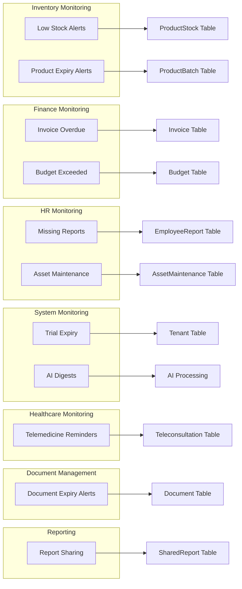

**Diagram sources**
- [NotificationService.php:36-117](file://app/Services/NotificationService.php#L36-L117)
- [NotificationService.php:199-256](file://app/Services/NotificationService.php#L199-L256)
- [NotificationService.php:458-562](file://app/Services/NotificationService.php#L458-L562)
- [SendTelemedicineReminders.php:46-50](file://app/Console/Commands/SendTelemedicineReminders.php#L46-L50)
- [DocumentExpiryNotification.php:15-27](file://app/Notifications/DocumentExpiryNotification.php#L15-L27)
- [ReportSharedNotification.php:15-27](file://app/Notifications/ReportSharedNotification.php#L15-L27)

**Section sources**
- [NotificationService.php:36-117](file://app/Services/NotificationService.php#L36-L117)
- [NotificationService.php:199-256](file://app/Services/NotificationService.php#L199-L256)
- [NotificationService.php:458-562](file://app/Services/NotificationService.php#L458-L562)
- [SendTelemedicineReminders.php:46-50](file://app/Console/Commands/SendTelemedicineReminders.php#L46-L50)
- [DocumentExpiryNotification.php:15-27](file://app/Notifications/DocumentExpiryNotification.php#L15-L27)
- [ReportSharedNotification.php:15-27](file://app/Notifications/ReportSharedNotification.php#L15-L27)

### Notification Generation Logic

Each notification type follows a standardized generation pattern with duplicate prevention and intelligent categorization:

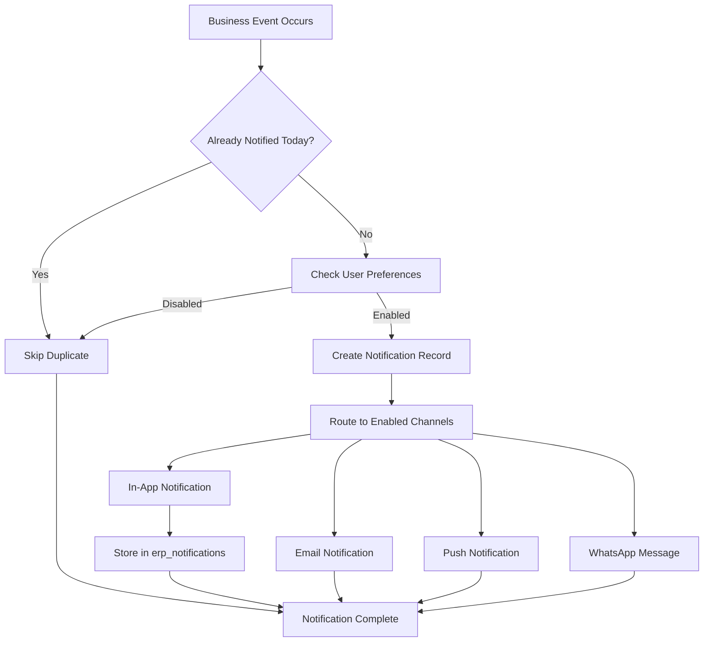

**Diagram sources**
- [NotificationService.php:64-72](file://app/Services/NotificationService.php#L64-L72)
- [NotificationService.php:237-253](file://app/Services/NotificationService.php#L237-L253)

**Section sources**
- [NotificationService.php:64-72](file://app/Services/NotificationService.php#L64-L72)
- [NotificationService.php:237-253](file://app/Services/NotificationService.php#L237-L253)

### New Notification Types

**Updated** Added comprehensive documentation for three new notification types:

#### Document Expiry Notifications

The `DocumentExpiryNotification` handles both upcoming expiry and expired document alerts with urgency-based messaging:

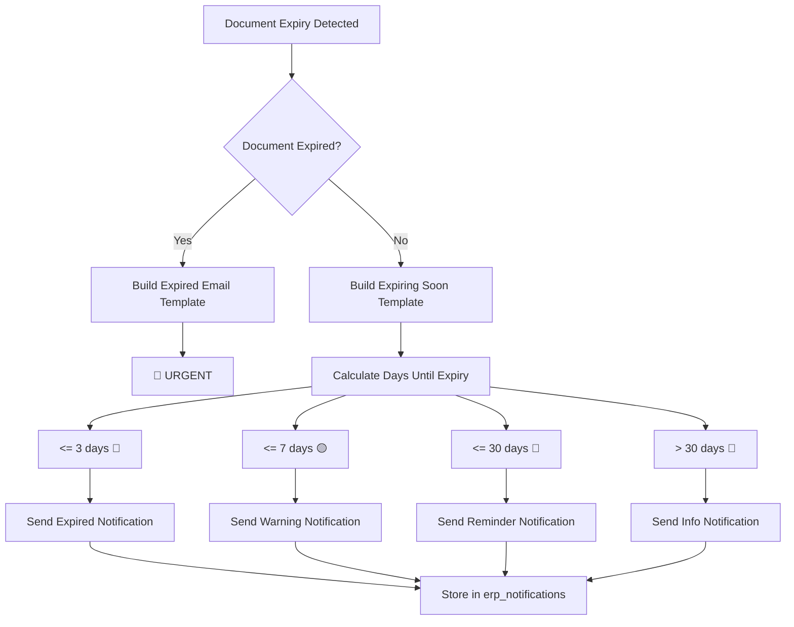

**Diagram sources**
- [DocumentExpiryNotification.php:42-89](file://app/Notifications/DocumentExpiryNotification.php#L42-L89)
- [DocumentExpiryNotification.php:121-140](file://app/Notifications/DocumentExpiryNotification.php#L121-L140)

#### Telemedicine Reminder Notifications

The `TelemedicineReminderNotification` provides automated reminders for healthcare consultations:

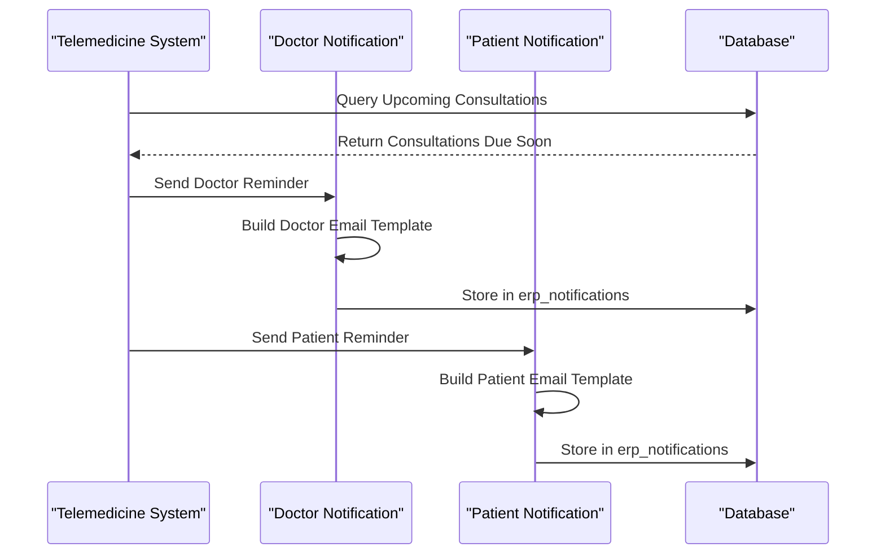

**Diagram sources**
- [TelemedicineReminderService.php:15-44](file://app/Services/TelemedicineReminderService.php#L15-L44)
- [TelemedicineReminderNotification.php:28-58](file://app/Notifications/TelemedicineReminderNotification.php#L28-L58)

#### Report Shared Notifications

The `ReportSharedNotification` handles secure report sharing with expiration tracking:

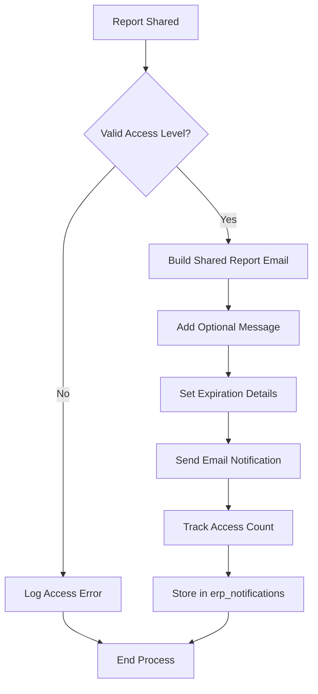

**Diagram sources**
- [ReportSharedNotification.php:42-62](file://app/Notifications/ReportSharedNotification.php#L42-L62)
- [ReportSharedNotification.php:70-79](file://app/Notifications/ReportSharedNotification.php#L70-L79)

**Section sources**
- [DocumentExpiryNotification.php:11-142](file://app/Notifications/DocumentExpiryNotification.php#L11-L142)
- [TelemedicineReminderNotification.php:10-73](file://app/Notifications/TelemedicineReminderNotification.php#L10-L73)
- [ReportSharedNotification.php:11-81](file://app/Notifications/ReportSharedNotification.php#L11-L81)

## Escalation System

### Intelligent Escalation Workflows

The escalation system provides automated notification routing when primary recipients fail to acknowledge alerts within specified timeframes:

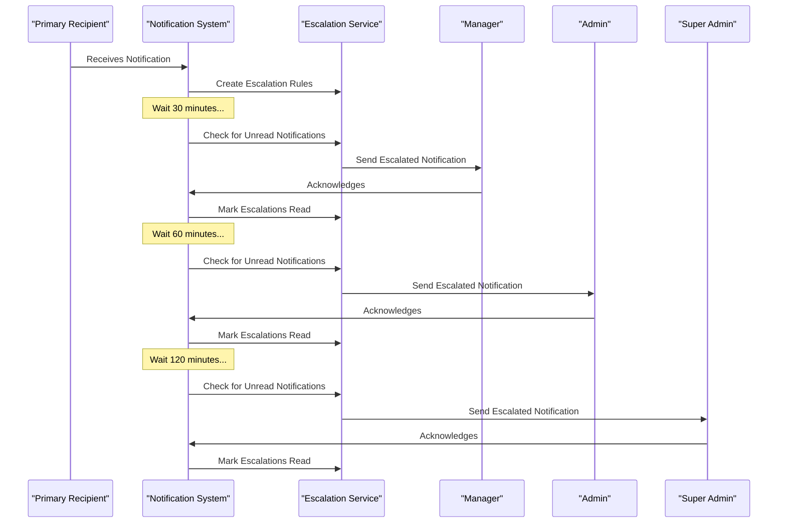

**Diagram sources**
- [NotificationEscalationService.php:28-62](file://app/Services/NotificationEscalationService.php#L28-L62)
- [NotificationEscalationService.php:93-118](file://app/Services/NotificationEscalationService.php#L93-L118)

**Section sources**
- [NotificationEscalationService.php:28-62](file://app/Services/NotificationEscalationService.php#L28-L62)
- [NotificationEscalationService.php:93-118](file://app/Services/NotificationEscalationService.php#L93-L118)

### Escalation Configuration and Management

The escalation system supports configurable time-based escalation with flexible target assignment:

| Escalation Level | Time Threshold | Target Role | Purpose |
|-----------------|----------------|-------------|---------|
| Level 1 | 30 minutes | Manager | Initial oversight |
| Level 2 | 90 minutes | Admin | Administrative review |
| Level 3 | 210 minutes | Super Admin | Executive intervention |

**Section sources**
- [NotificationEscalationService.php:30-37](file://app/Services/NotificationEscalationService.php#L30-L37)
- [NotificationEscalation.php:103-109](file://app/Models/NotificationEscalation.php#L103-L109)

### Escalation Model Implementation

The `NotificationEscalation` model provides comprehensive escalation management with status tracking and level-based routing:

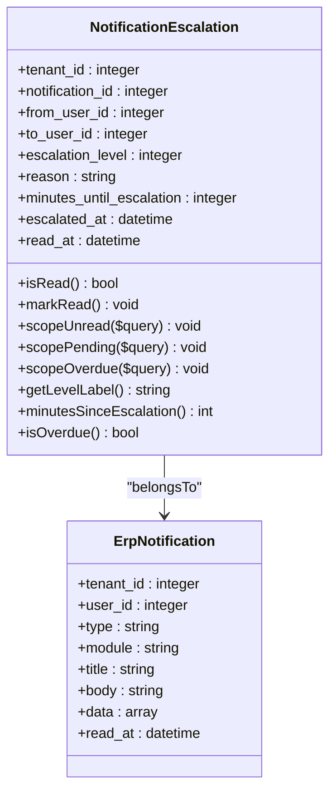

**Diagram sources**
- [NotificationEscalation.php:9-127](file://app/Models/NotificationEscalation.php#L9-L127)

**Section sources**
- [NotificationEscalation.php:9-127](file://app/Models/NotificationEscalation.php#L9-L127)

## Digest and Summarization

### Automated Digest Generation

The digest system consolidates notifications into meaningful summaries delivered at scheduled intervals:

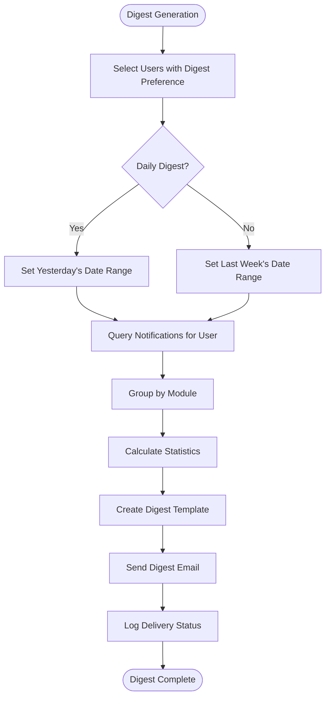

**Diagram sources**
- [NotificationDigestService.php:26-72](file://app/Services/NotificationDigestService.php#L26-L72)
- [NotificationDigestService.php:79-127](file://app/Services/NotificationDigestService.php#L79-L127)

**Section sources**
- [NotificationDigestService.php:26-72](file://app/Services/NotificationDigestService.php#L26-L72)
- [NotificationDigestService.php:79-127](file://app/Services/NotificationDigestService.php#L79-L127)

### Digest Frequency and Content Management

The system supports flexible digest scheduling with intelligent content organization:

| Digest Type | Frequency | Content Scope | Delivery Time |
|-------------|-----------|---------------|---------------|
| Real-time | Immediate | Individual notifications | As generated |
| Daily | Once daily | Previous day's notifications | Configurable time |
| Weekly | Once weekly | Previous week's notifications | Configurable day/time |
| Never | Disabled | Manual requests only | N/A |

**Section sources**
- [NotificationPreference.php:138-146](file://app/Models/NotificationPreference.php#L138-L146)
- [NotificationDigestService.php:167-188](file://app/Services/NotificationDigestService.php#L167-L188)

### Digest Email Template System

The `NotificationDigestEmail` notification class provides comprehensive email templating with module-specific organization:

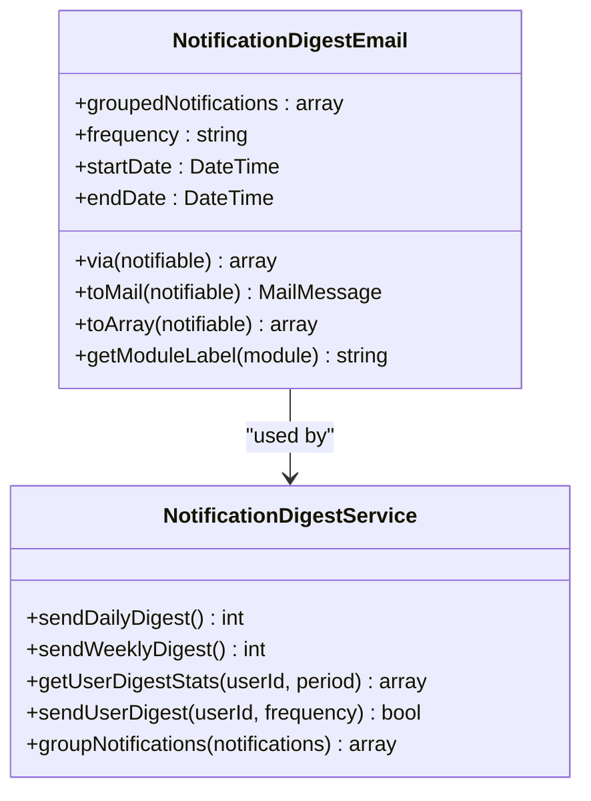

**Diagram sources**
- [NotificationDigestEmail.php:10-119](file://app/Notifications/NotificationDigestEmail.php#L10-L119)
- [NotificationDigestService.php:19-241](file://app/Services/NotificationDigestService.php#L19-L241)

**Section sources**
- [NotificationDigestEmail.php:10-119](file://app/Notifications/NotificationDigestEmail.php#L10-L119)
- [NotificationDigestService.php:19-241](file://app/Services/NotificationDigestService.php#L19-L241)

## Push Notification Implementation

### Web Push Protocol Integration

The push notification system implements the Web Push protocol with VAPID authentication for secure browser-based notifications:

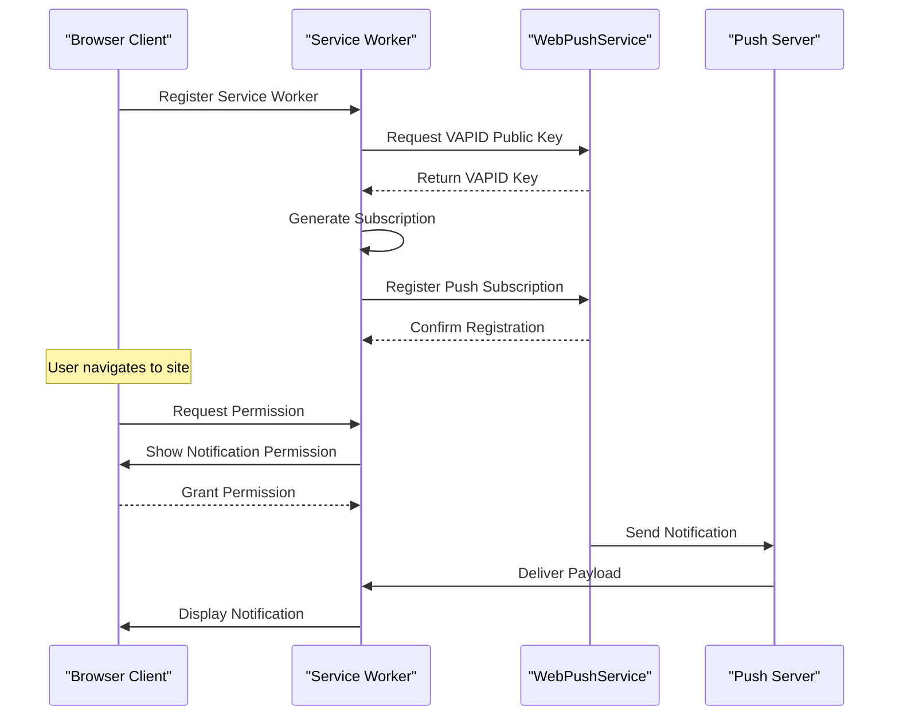

**Diagram sources**
- [WebPushService.php:52-109](file://app/Services/WebPushService.php#L52-L109)
- [push-notification.js:68-82](file://resources/js/push-notification.js#L68-L82)

**Section sources**
- [WebPushService.php:52-109](file://app/Services/WebPushService.php#L52-L109)
- [push-notification.js:68-82](file://resources/js/push-notification.js#L68-L82)

### Push Notification Lifecycle

The push notification lifecycle includes subscription management, message delivery, and error handling:

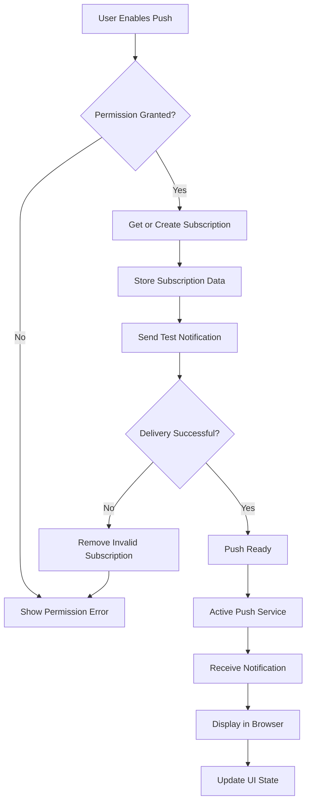

**Diagram sources**
- [push-notification.js:54-62](file://resources/js/push-notification.js#L54-L62)
- [WebPushService.php:75-99](file://app/Services/WebPushService.php#L75-L99)

**Section sources**
- [push-notification.js:54-62](file://resources/js/push-notification.js#L54-L62)
- [WebPushService.php:75-99](file://app/Services/WebPushService.php#L75-L99)

### Push Notification Service Enhancements

The push notification system now includes comprehensive transactional notification support:

| Feature | Implementation | Purpose |
|---------|----------------|---------|
| Transaction Templates | Predefined notification templates | Standardized notification formats |
| Batch Delivery | Multi-user notification delivery | Efficient mass notifications |
| Subscription Management | CRUD operations for push subscriptions | User subscription lifecycle |
| VAPID Authentication | Web Push protocol compliance | Secure push delivery |
| Error Handling | Automatic subscription cleanup | Reliable notification delivery |

**Section sources**
- [PushNotificationService.php:14-243](file://app/Services/PushNotificationService.php#L14-L243)
- [WebPushService.php:19-149](file://app/Services/WebPushService.php#L19-L149)

## Configuration and Preferences

### Comprehensive Preference Management

The notification preference system provides granular control over notification delivery with intelligent defaults and user customization:

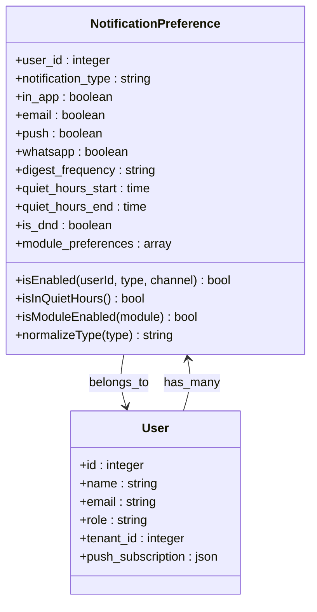

**Diagram sources**
- [NotificationPreference.php:8-148](file://app/Models/NotificationPreference.php#L8-L148)
- [2026_04_10_000001_update_notification_preferences_add_channels.php:16-30](file://database/migrations/2026_04_10_000001_update_notification_preferences_add_channels.php#L16-L30)

**Section sources**
- [NotificationPreference.php:8-148](file://app/Models/NotificationPreference.php#L8-L148)
- [2026_04_10_000001_update_notification_preferences_add_channels.php:16-30](file://database/migrations/2026_04_10_000001_update_notification_preferences_add_channels.php#L16-L30)

### Preference Categories and Controls

The preference system organizes notification controls into logical categories:

| Category | Control Type | Purpose |
|----------|--------------|---------|
| Channel Selection | Checkbox toggles | Enable/disable specific channels |
| Notification Types | Module-based groups | Control specific notification categories |
| Digest Settings | Dropdown selections | Configure email digest frequency |
| Quiet Hours | Time range selectors | Set Do Not Disturb periods |
| Module Filters | JSON configuration | Enable/disable entire modules |

**Section sources**
- [NotificationPreference.php:44-68](file://app/Models/NotificationPreference.php#L44-L68)
- [NotificationPreference.php:101-133](file://app/Models/NotificationPreference.php#L101-L133)

### Database Migration Enhancements

The notification preferences table has been enhanced with comprehensive multi-channel support:

| Column | Type | Default | Purpose |
|--------|------|---------|---------|
| whatsapp | boolean | true | WhatsApp channel enable/disable |
| digest_frequency | string | 'daily' | Email digest frequency |
| quiet_hours_start | time | null | Start of Do Not Disturb period |
| quiet_hours_end | time | null | End of Do Not Disturb period |
| is_dnd | boolean | false | Do Not Disturb mode toggle |
| module_preferences | json | null | Per-module notification preferences |

**Section sources**
- [2026_04_10_000001_update_notification_preferences_add_channels.php:16-30](file://database/migrations/2026_04_10_000001_update_notification_preferences_add_channels.php#L16-L30)

### New Notification Type Preferences

**Updated** Enhanced notification preferences to support new notification categories:

| Notification Type | Module | Default Channels | Description |
|------------------|--------|------------------|-------------|
| document_expiry | document_management | In-App, Email | Document expiry and expiration alerts |
| telemedicine_reminder | healthcare | In-App, Email | Telemedicine consultation reminders |
| report_shared | reporting | Email | Shared report notifications |
| reminder | system | In-App, Email | General reminder notifications |

**Section sources**
- [NotificationPreference.php:52-67](file://app/Models/NotificationPreference.php#L52-L67)
- [DocumentExpiryNotification.php:32](file://app/Notifications/DocumentExpiryNotification.php#L32)
- [TelemedicineReminderNotification.php:23](file://app/Notifications/TelemedicineReminderNotification.php#L23)
- [ReportSharedNotification.php:34](file://app/Notifications/ReportSharedNotification.php#L34)

## Performance and Scalability

### Scalable Architecture Patterns

The notification system implements several performance optimization strategies:

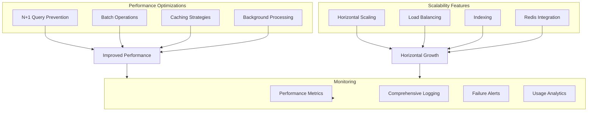

**Section sources**
- [NotificationService.php:53-57](file://app/Services/NotificationService.php#L53-L57)
- [NotificationService.php:160-177](file://app/Services/NotificationService.php#L160-L177)

### Database Optimization Strategies

The system employs several database optimization techniques:

| Optimization | Implementation | Benefit |
|-------------|----------------|---------|
| Eager Loading | Preloading preferences to prevent N+1 | 90% reduction in queries |
| Batch Creation | Grouped notification creation | Reduced database overhead |
| Indexing | Strategic indexes on frequently queried columns | Faster query execution |
| Pagination | Efficient pagination for notification lists | Better UI responsiveness |

**Section sources**
- [NotificationService.php:53-57](file://app/Services/NotificationService.php#L53-L57)
- [ErpNotification.php:22-41](file://app/Models/ErpNotification.php#L22-L41)

### New Notification Type Performance Considerations

**Updated** Added performance considerations for new notification types:

| Notification Type | Performance Impact | Optimization Strategies |
|------------------|-------------------|------------------------|
| Document Expiry | Medium | Batch expiry checks, optimized queries |
| Telemedicine Reminders | High | Scheduled processing, caching consultation data |
| Report Sharing | Low | Direct notification, minimal processing |
| Reminder System | Medium | Batch processing, efficient due date checking |

**Section sources**
- [SendTelemedicineReminders.php:46-50](file://app/Console/Commands/SendTelemedicineReminders.php#L46-L50)
- [ProcessReminders.php:17-41](file://app/Console/Commands/ProcessReminders.php#L17-L41)

## Troubleshooting Guide

### Common Issues and Solutions

#### Push Notification Delivery Failures

**Issue**: Push notifications not reaching clients
**Causes**: 
- Expired push subscriptions
- VAPID key misconfiguration
- Browser permission denials

**Solutions**:
1. Verify VAPID keys in configuration
2. Check subscription expiration and cleanup
3. Ensure user has granted notification permissions

#### Notification Duplication Problems

**Issue**: Multiple identical notifications for same event
**Causes**:
- Missing duplicate detection logic
- Race conditions in concurrent processing

**Solutions**:
1. Implement proper duplicate prevention using date-based keys
2. Use atomic operations for notification creation
3. Add retry mechanisms with exponential backoff

#### Escalation System Malfunctions

**Issue**: Escalations not triggering at expected times
**Causes**:
- Cron job not running
- Incorrect timezone configuration
- Database connectivity issues

**Solutions**:
1. Verify cron job configuration and execution
2. Check timezone settings consistency
3. Monitor database connection health

#### Digest Email Delivery Issues

**Issue**: Digest emails not being sent
**Causes**:
- User preference misconfiguration
- Email template errors
- SMTP configuration problems

**Solutions**:
1. Verify user digest frequency preferences
2. Check email template rendering
3. Validate SMTP server connectivity

#### New Notification Type Issues

**Updated** Added troubleshooting for new notification types:

**Issue**: Document expiry notifications not sending
**Causes**:
- Document expiry check cron not running
- Missing document expiry data
- User preference disabled

**Solutions**:
1. Verify `CheckExpiringDocuments` cron job
2. Check document expiry dates and statuses
3. Ensure document_expiry notification preference enabled

**Issue**: Telemedicine reminders not sending
**Causes**:
- Telemedicine reminder service disabled
- Consultation not found in timeframe
- User email not configured

**Solutions**:
1. Verify telemedicine settings and reminder configuration
2. Check consultation scheduled times and statuses
3. Ensure patient/doctor user accounts have email addresses

**Issue**: Report shared notifications failing
**Causes**:
- Shared report expired or inactive
- Invalid recipient email addresses
- Report access level restrictions

**Solutions**:
1. Verify shared report status and expiration
2. Check recipient email addresses and validation
3. Review report access level configurations

**Section sources**
- [WebPushService.php:91-98](file://app/Services/WebPushService.php#L91-L98)
- [NotificationService.php:64-72](file://app/Services/NotificationService.php#L64-L72)
- [ProcessNotificationEscalations.php:38-56](file://app/Console/Commands/ProcessNotificationEscalations.php#L38-L56)
- [SendTelemedicineReminders.php:75-82](file://app/Console/Commands/SendTelemedicineReminders.php#L75-L82)
- [ProcessReminders.php:35-37](file://app/Console/Commands/ProcessReminders.php#L35-L37)

### Monitoring and Debugging

The system provides comprehensive monitoring capabilities:

| Monitoring Aspect | Implementation | Tools |
|------------------|----------------|-------|
| Notification Delivery | Real-time logging | Laravel Debugbar |
| Push Delivery | WebPush report parsing | Subscription cleanup |
| Escalation Tracking | Dedicated escalation table | Statistics dashboard |
| Performance Metrics | Query timing analysis | Application metrics |
| Digest Delivery | Email delivery reports | Mailtrap integration |
| New Notification Types | Specific monitoring logs | Custom log entries |

**Section sources**
- [WebPushService.php:90-106](file://app/Services/WebPushService.php#L90-L106)
- [NotificationDigestService.php:66-68](file://app/Services/NotificationDigestService.php#L66-L68)

## Conclusion

The Notification System Modernization represents a significant advancement in qalcuityERP's capability to deliver timely, relevant, and actionable notifications across multiple channels. The implementation successfully addresses scalability concerns while introducing sophisticated features like automated escalation, intelligent digest generation, and comprehensive user preference management.

Key achievements include:

- **Multi-Channel Support**: Seamless integration of in-app, email, push, and WhatsApp notifications
- **Intelligent Escalation**: Automated routing of unacknowledged notifications to higher authority levels
- **Automated Digest Generation**: Comprehensive email summarization with customizable frequency
- **Enhanced Preferences Management**: Granular control over notification delivery with quiet hours and Do Not Disturb functionality
- **Performance Optimization**: Scalable architecture with database optimization and background processing
- **Reliability**: Comprehensive error handling, retry mechanisms, and monitoring capabilities
- **New Notification Types**: Healthcare telemedicine reminders, document expiry alerts, and secure report sharing notifications

**Updated** The modernized system now includes comprehensive healthcare, document management, and reporting notification capabilities, providing a solid foundation for future enhancements while maintaining backward compatibility and ensuring smooth operation across all tenant environments. The modular architecture facilitates easy extension and customization for specific business requirements.

The addition of DocumentExpiryNotification, TelemedicineReminderNotification, and ReportSharedNotification significantly expands the system's utility for enterprise operations, particularly in healthcare, compliance, and collaborative reporting scenarios. These new notification types integrate seamlessly with the existing infrastructure while providing specialized functionality for their respective domains.