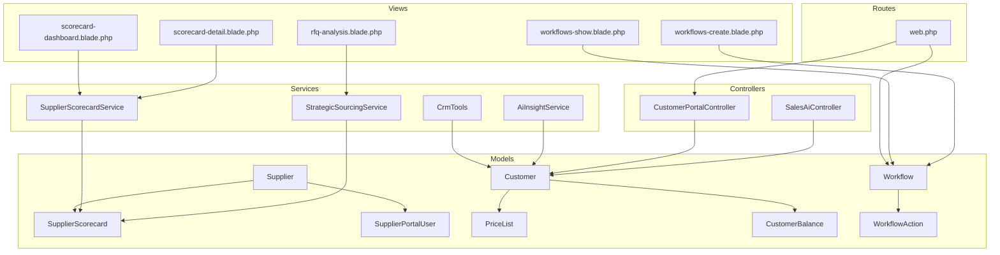
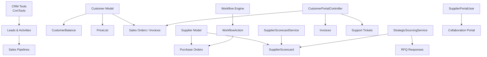
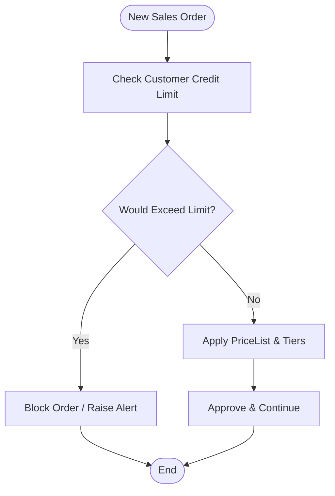
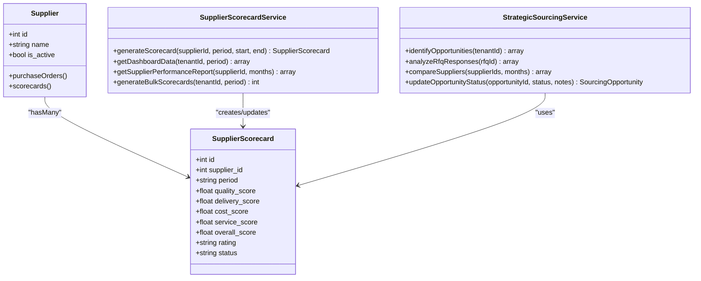
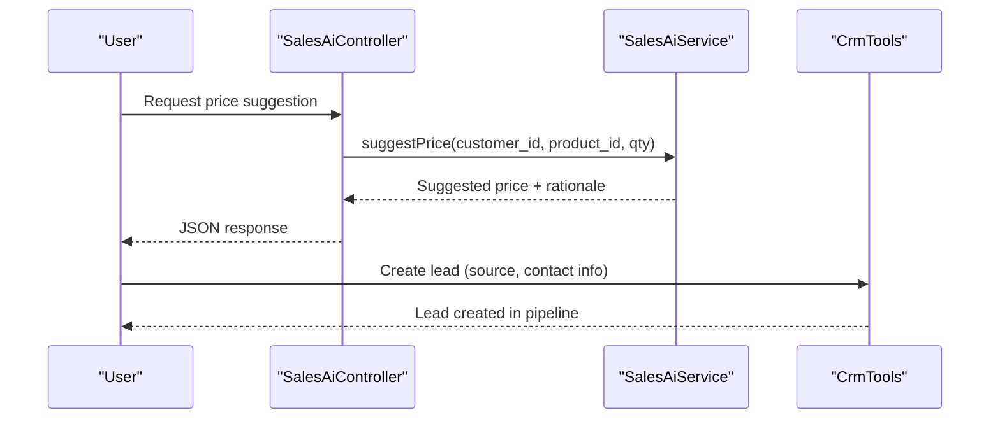
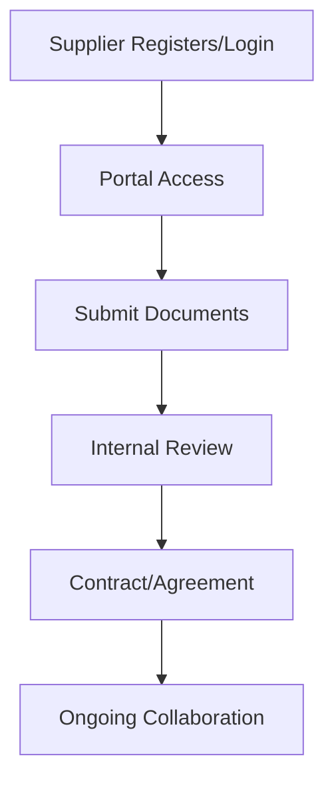
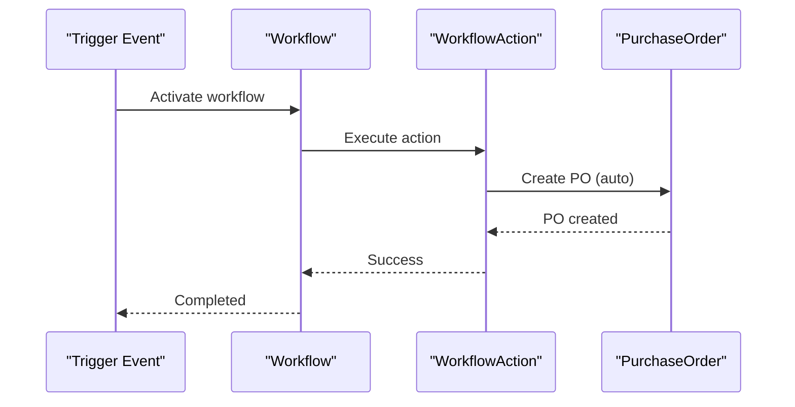
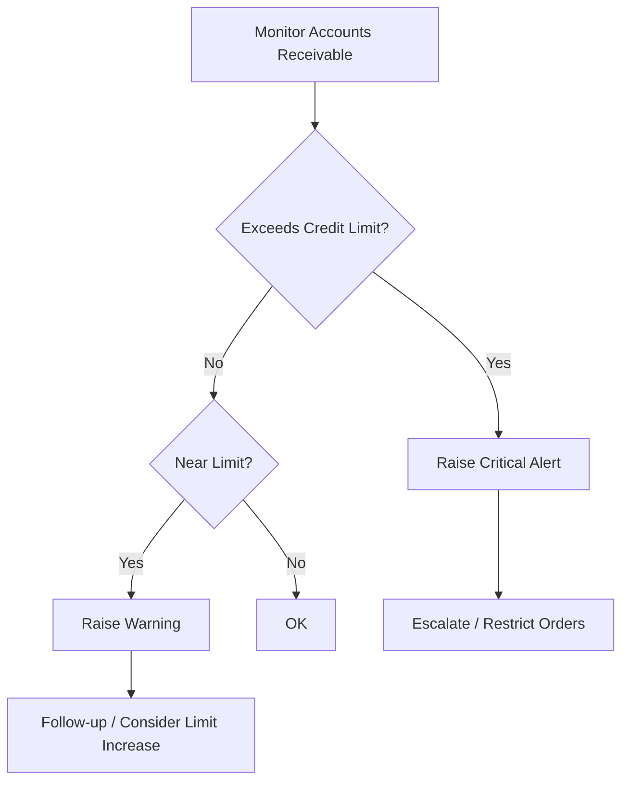
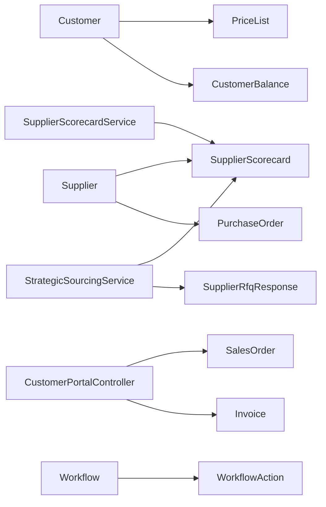

# Customer & Supplier Relationship Management

<cite>
**Referenced Files in This Document**
- [Customer.php](file://app/Models/Customer.php)
- [CustomerBalance.php](file://app/Models/CustomerBalance.php)
- [PriceList.php](file://app/Models/PriceList.php)
- [Supplier.php](file://app/Models/Supplier.php)
- [SupplierScorecard.php](file://app/Models/SupplierScorecard.php)
- [SupplierPortalUser.php](file://app/Models/SupplierPortalUser.php)
- [SupplierScorecardService.php](file://app/Services/SupplierScorecardService.php)
- [StrategicSourcingService.php](file://app/Services/StrategicSourcingService.php)
- [CrmTools.php](file://app/Services/ERP/CrmTools.php)
- [CustomerPortalController.php](file://app/Http/Controllers/Customer/CustomerPortalController.php)
- [Workflow.php](file://app/Models/Workflow.php)
- [WorkflowAction.php](file://app/Models/WorkflowAction.php)
- [2026_04_06_150000_create_supplier_scorecard_tables.php](file://database/migrations/2026_04_06_150000_create_supplier_scorecard_tables.php)
- [web.php](file://routes/web.php)
- [sales-ai-controller.php](file://app/Http/Controllers/SalesAiController.php)
- [ai-insight-service.php](file://app/Services/AiInsightService.php)
- [workflows-show.blade.php](file://resources/views/automation/workflows/show.blade.php)
- [workflows-create.blade.php](file://resources/views/automation/workflows/create.blade.php)
- [rfq-analysis.blade.php](file://resources/views/suppliers/rfq-analysis.blade.php)
- [scorecard-dashboard.blade.php](file://resources/views/suppliers/scorecard-dashboard.blade.php)
- [scorecard-detail.blade.php](file://resources/views/suppliers/scorecard-detail.blade.php)
</cite>

## Table of Contents
1. [Introduction](#introduction)
2. [Project Structure](#project-structure)
3. [Core Components](#core-components)
4. [Architecture Overview](#architecture-overview)
5. [Detailed Component Analysis](#detailed-component-analysis)
6. [Dependency Analysis](#dependency-analysis)
7. [Performance Considerations](#performance-considerations)
8. [Troubleshooting Guide](#troubleshooting-guide)
9. [Conclusion](#conclusion)
10. [Appendices](#appendices)

## Introduction
This document provides comprehensive guidance for Customer & Supplier Relationship Management within the qalcuityERP system. It covers customer acquisition and profile management (including credit limits, pricing tiers, payment terms, and preference tracking), supplier onboarding and qualification (scorecards, performance evaluation, and contract management), customer segmentation and risk assessment, and integration with CRM systems, supplier portals, and automated relationship maintenance workflows. Practical examples and best practices are included to help teams optimize relationships and maintain operational excellence.

## Project Structure
The solution spans models, services, controllers, migrations, routes, and views that collectively enable CRM, supplier scorecards, strategic sourcing, customer portals, and workflow automation.

**Diagram sources**
- [Customer.php:14-91](file://app/Models/Customer.php#L14-L91)
- [Supplier.php:13-52](file://app/Models/Supplier.php#L13-L52)
- [SupplierScorecard.php:12-53](file://app/Models/SupplierScorecard.php#L12-L53)
- [SupplierPortalUser.php:11-45](file://app/Models/SupplierPortalUser.php#L11-L45)
- [PriceList.php:12-54](file://app/Models/PriceList.php#L12-L54)
- [CustomerBalance.php:11-56](file://app/Models/CustomerBalance.php#L11-L56)
- [Workflow.php:11-108](file://app/Models/Workflow.php#L11-L108)
- [WorkflowAction.php:118-158](file://app/Models/WorkflowAction.php#L118-L158)
- [SupplierScorecardService.php:12-322](file://app/Services/SupplierScorecardService.php#L12-L322)
- [StrategicSourcingService.php:11-389](file://app/Services/StrategicSourcingService.php#L11-L389)
- [CrmTools.php:9-95](file://app/Services/ERP/CrmTools.php#L9-L95)
- [AiInsightService.php:586-666](file://app/Services/AiInsightService.php#L586-L666)
- [CustomerPortalController.php:14-483](file://app/Http/Controllers/Customer/CustomerPortalController.php#L14-L483)
- [web.php:217-247](file://routes/web.php#L217-L247)
- [workflows-show.blade.php:1-48](file://resources/views/automation/workflows/show.blade.php#L1-L48)
- [workflows-create.blade.php:1-29](file://resources/views/automation/workflows/create.blade.php#L1-L29)
- [rfq-analysis.blade.php:219-266](file://resources/views/suppliers/rfq-analysis.blade.php#L219-L266)
- [scorecard-dashboard.blade.php:185-204](file://resources/views/suppliers/scorecard-dashboard.blade.php#L185-L204)
- [scorecard-detail.blade.php:92-115](file://resources/views/suppliers/scorecard-detail.blade.php#L92-L115)

**Section sources**
- [web.php:217-247](file://routes/web.php#L217-L247)
- [2026_04_06_150000_create_supplier_scorecard_tables.php:56-211](file://database/migrations/2026_04_06_150000_create_supplier_scorecard_tables.php#L56-L211)

## Core Components
- Customer model with credit limits, outstanding balances, and price list associations.
- Supplier model with scorecards and purchase order linkage.
- SupplierScorecardService for generating and analyzing supplier performance.
- StrategicSourcingService for identifying opportunities, evaluating RFQ responses, and comparing supplier performance.
- CRM tools for lead creation and pipeline insights.
- Customer portal controller enabling self-service access to orders, invoices, and support tickets.
- Workflow engine for automating relationship maintenance tasks.
- Supplier collaboration portal for supplier users.

**Section sources**
- [Customer.php:14-91](file://app/Models/Customer.php#L14-L91)
- [Supplier.php:13-52](file://app/Models/Supplier.php#L13-L52)
- [SupplierScorecardService.php:12-322](file://app/Services/SupplierScorecardService.php#L12-L322)
- [StrategicSourcingService.php:11-389](file://app/Services/StrategicSourcingService.php#L11-L389)
- [CrmTools.php:9-95](file://app/Services/ERP/CrmTools.php#L9-L95)
- [CustomerPortalController.php:14-483](file://app/Http/Controllers/Customer/CustomerPortalController.php#L14-L483)
- [Workflow.php:11-108](file://app/Models/Workflow.php#L11-L108)
- [SupplierPortalUser.php:11-45](file://app/Models/SupplierPortalUser.php#L11-L45)

## Architecture Overview
The system integrates CRM, supplier scorecards, strategic sourcing, customer portals, and workflows to automate and optimize relationships.

**Diagram sources**
- [CrmTools.php:9-95](file://app/Services/ERP/CrmTools.php#L9-L95)
- [Customer.php:14-91](file://app/Models/Customer.php#L14-L91)
- [CustomerBalance.php:11-56](file://app/Models/CustomerBalance.php#L11-L56)
- [PriceList.php:12-54](file://app/Models/PriceList.php#L12-L54)
- [Supplier.php:13-52](file://app/Models/Supplier.php#L13-L52)
- [SupplierScorecardService.php:12-322](file://app/Services/SupplierScorecardService.php#L12-L322)
- [StrategicSourcingService.php:11-389](file://app/Services/StrategicSourcingService.php#L11-L389)
- [CustomerPortalController.php:14-483](file://app/Http/Controllers/Customer/CustomerPortalController.php#L14-L483)
- [Workflow.php:11-108](file://app/Models/Workflow.php#L11-L108)
- [WorkflowAction.php:118-158](file://app/Models/WorkflowAction.php#L118-L158)
- [SupplierPortalUser.php:11-45](file://app/Models/SupplierPortalUser.php#L11-L45)

## Detailed Component Analysis

### Customer Profile Management
Customer profile management encompasses credit limits, outstanding balances, and pricing tiers.

- Credit limits and risk checks:
  - Customer model exposes methods to compute outstanding balance and available credit, and to evaluate whether a new order would exceed the credit limit.
  - AI Insight Service generates alerts for customers nearing or exceeding credit limits, enabling proactive risk management.

- Pricing tiers and preferences:
  - PriceList model supports tiered, contract-based, and promotional pricing with validity windows.
  - Customers can be associated with multiple price lists via pivot tables, ordered by priority.

- Preference tracking:
  - Customer preferences can be modeled via custom fields and extended attributes; integration with preference services is supported through the broader system.

**Diagram sources**
- [Customer.php:69-89](file://app/Models/Customer.php#L69-L89)
- [AiInsightService.php:586-666](file://app/Services/AiInsightService.php#L586-L666)
- [PriceList.php:35-42](file://app/Models/PriceList.php#L35-L42)

**Section sources**
- [Customer.php:14-91](file://app/Models/Customer.php#L14-L91)
- [CustomerBalance.php:11-56](file://app/Models/CustomerBalance.php#L11-L56)
- [PriceList.php:12-54](file://app/Models/PriceList.php#L12-L54)
- [AiInsightService.php:586-666](file://app/Services/AiInsightService.php#L586-L666)

### Supplier Qualification, Scorecards, and Performance Evaluation
Supplier qualification and ongoing evaluation are managed through scorecards and sourcing analytics.

- Supplier scorecards:
  - Generated with weighted metrics across quality, delivery, cost, and service.
  - Provides overall score, rating, status, strengths, areas for improvement, and action items.
  - Supports bulk generation and category-wise dashboards.

- Strategic sourcing:
  - Identifies opportunities by spend analysis and single-source risks.
  - Evaluates RFQ responses using comprehensive criteria (price, lead time, supplier rating, delivery performance, payment terms).
  - Compares supplier performance over time and tracks opportunity progress.

**Diagram sources**
- [Supplier.php:13-52](file://app/Models/Supplier.php#L13-L52)
- [SupplierScorecard.php:12-53](file://app/Models/SupplierScorecard.php#L12-L53)
- [SupplierScorecardService.php:12-322](file://app/Services/SupplierScorecardService.php#L12-L322)
- [StrategicSourcingService.php:11-389](file://app/Services/StrategicSourcingService.php#L11-L389)

**Section sources**
- [SupplierScorecardService.php:12-322](file://app/Services/SupplierScorecardService.php#L12-L322)
- [StrategicSourcingService.php:11-389](file://app/Services/StrategicSourcingService.php#L11-L389)
- [Supplier.php:46-50](file://app/Models/Supplier.php#L46-L50)

### CRM Integration and Customer Acquisition
CRM tools facilitate lead creation and pipeline insights, supporting customer acquisition and nurturing.

- CRM Tools:
  - Define tool functions for creating leads and retrieving follow-ups.
  - Enable structured lead capture with source, interest, and estimated value.

- Routes and UI:
  - CRM analytics routes support customer segmentation dashboards and insights.

**Diagram sources**
- [sales-ai-controller.php:15-46](file://app/Http/Controllers/SalesAiController.php#L15-L46)
- [CrmTools.php:13-95](file://app/Services/ERP/CrmTools.php#L13-L95)
- [web.php:243-244](file://routes/web.php#L243-L244)

**Section sources**
- [CrmTools.php:9-95](file://app/Services/ERP/CrmTools.php#L9-L95)
- [web.php:243-244](file://routes/web.php#L243-L244)

### Supplier Collaboration Portal and Contract Management
Supplier collaboration portal enables secure supplier access and document management.

- Supplier Portal Users:
  - Dedicated model for supplier users with roles, verification, and activity tracking.
  - Indexes support efficient lookups by tenant and supplier.

- Supplier Documents and Intelligence:
  - Document storage and certification tracking.
  - Market intelligence reporting for competitive insights.

**Diagram sources**
- [SupplierPortalUser.php:11-45](file://app/Models/SupplierPortalUser.php#L11-L45)
- [2026_04_06_150000_create_supplier_scorecard_tables.php:64-81](file://database/migrations/2026_04_06_150000_create_supplier_scorecard_tables.php#L64-L81)

**Section sources**
- [SupplierPortalUser.php:11-45](file://app/Models/SupplierPortalUser.php#L11-L45)
- [2026_04_06_150000_create_supplier_scorecard_tables.php:84-195](file://database/migrations/2026_04_06_150000_create_supplier_scorecard_tables.php#L84-L195)

### Automated Relationship Maintenance Workflows
Automated workflows streamline routine relationship tasks such as PO generation and notifications.

- Workflow Engine:
  - Triggers, actions, and execution logs.
  - Example action creates purchase orders automatically based on configured conditions.

- UI:
  - Workflow creation and testing interfaces.

**Diagram sources**
- [Workflow.php:61-106](file://app/Models/Workflow.php#L61-L106)
- [WorkflowAction.php:118-158](file://app/Models/WorkflowAction.php#L118-L158)
- [workflows-show.blade.php:1-48](file://resources/views/automation/workflows/show.blade.php#L1-L48)
- [workflows-create.blade.php:1-29](file://resources/views/automation/workflows/create.blade.php#L1-L29)

**Section sources**
- [Workflow.php:11-108](file://app/Models/Workflow.php#L11-L108)
- [WorkflowAction.php:118-158](file://app/Models/WorkflowAction.php#L118-L158)
- [workflows-show.blade.php:1-48](file://resources/views/automation/workflows/show.blade.php#L1-L48)
- [workflows-create.blade.php:1-29](file://resources/views/automation/workflows/create.blade.php#L1-L29)

### Risk Assessment and Best Practices
- Credit limit monitoring:
  - AI Insight Service detects customers approaching or exceeding credit limits and suggests actions.
- Supplier risk scoring:
  - Strategic sourcing evaluates RFQ responses with weighted criteria to mitigate risk.
- Supplier scorecard trends:
  - Scorecard service computes trends and highlights at-risk suppliers.

**Diagram sources**
- [AiInsightService.php:586-666](file://app/Services/AiInsightService.php#L586-L666)
- [StrategicSourcingService.php:163-250](file://app/Services/StrategicSourcingService.php#L163-L250)
- [SupplierScorecardService.php:239-285](file://app/Services/SupplierScorecardService.php#L239-L285)

**Section sources**
- [AiInsightService.php:586-666](file://app/Services/AiInsightService.php#L586-L666)
- [StrategicSourcingService.php:163-250](file://app/Services/StrategicSourcingService.php#L163-L250)
- [SupplierScorecardService.php:239-285](file://app/Services/SupplierScorecardService.php#L239-L285)

## Dependency Analysis
The following diagram outlines key dependencies among components involved in CRM, supplier scorecards, and workflows.

**Diagram sources**
- [Customer.php:14-91](file://app/Models/Customer.php#L14-L91)
- [PriceList.php:12-54](file://app/Models/PriceList.php#L12-L54)
- [CustomerBalance.php:11-56](file://app/Models/CustomerBalance.php#L11-L56)
- [Supplier.php:13-52](file://app/Models/Supplier.php#L13-L52)
- [SupplierScorecard.php:12-53](file://app/Models/SupplierScorecard.php#L12-L53)
- [SupplierScorecardService.php:12-322](file://app/Services/SupplierScorecardService.php#L12-L322)
- [StrategicSourcingService.php:11-389](file://app/Services/StrategicSourcingService.php#L11-L389)
- [CustomerPortalController.php:14-483](file://app/Http/Controllers/Customer/CustomerPortalController.php#L14-L483)
- [Workflow.php:11-108](file://app/Models/Workflow.php#L11-L108)
- [WorkflowAction.php:118-158](file://app/Models/WorkflowAction.php#L118-L158)

**Section sources**
- [SupplierScorecardService.php:12-322](file://app/Services/SupplierScorecardService.php#L12-L322)
- [StrategicSourcingService.php:11-389](file://app/Services/StrategicSourcingService.php#L11-L389)
- [CustomerPortalController.php:14-483](file://app/Http/Controllers/Customer/CustomerPortalController.php#L14-L483)
- [Workflow.php:11-108](file://app/Models/Workflow.php#L11-L108)

## Performance Considerations
- Indexing:
  - Scorecards and supplier portal tables include composite indexes to accelerate queries by tenant, supplier, period, and status.
- Aggregation:
  - Scorecard service computes averages and counts efficiently using Eloquent collections and database aggregations.
- Workflow execution:
  - Execution logs capture runtime metrics to identify bottlenecks and failures.

[No sources needed since this section provides general guidance]

## Troubleshooting Guide
- Unauthorized access:
  - Customer portal enforces tenant and customer isolation; unauthorized attempts are logged and blocked.
- Workflow failures:
  - Workflow execution logs capture errors and completion timestamps for diagnostics.
- Credit limit issues:
  - AI Insight Service surfaces critical and warning thresholds; review alerts and take corrective actions.

**Section sources**
- [CustomerPortalController.php:99-108](file://app/Http/Controllers/Customer/CustomerPortalController.php#L99-L108)
- [Workflow.php:70-106](file://app/Models/Workflow.php#L70-L106)
- [AiInsightService.php:586-666](file://app/Services/AiInsightService.php#L586-L666)

## Conclusion
The qalcuityERP system provides a robust foundation for managing customer and supplier relationships through integrated CRM, supplier scorecards, strategic sourcing, customer portals, and automated workflows. By leveraging credit limit monitoring, tiered pricing, supplier evaluation frameworks, and collaboration tools, organizations can enhance customer satisfaction, optimize supplier performance, and maintain efficient, scalable operations.

[No sources needed since this section summarizes without analyzing specific files]

## Appendices

### Customer Segmentation Strategies
- Use CRM analytics routes to segment customers by RFM and profitability.
- Combine with AI insights to identify high-value and at-risk accounts.

**Section sources**
- [web.php:243-244](file://routes/web.php#L243-L244)

### Supplier Scorecards Dashboard
- Generate and review scorecards by period and category.
- Use evaluation methodology visuals to guide supplier selection.

**Section sources**
- [scorecard-dashboard.blade.php:185-204](file://resources/views/suppliers/scorecard-dashboard.blade.php#L185-L204)
- [rfq-analysis.blade.php:219-266](file://resources/views/suppliers/rfq-analysis.blade.php#L219-L266)

### Supplier Scorecard Detail
- View historical score history and trends for continuous improvement.

**Section sources**
- [scorecard-detail.blade.php:92-115](file://resources/views/suppliers/scorecard-detail.blade.php#L92-L115)