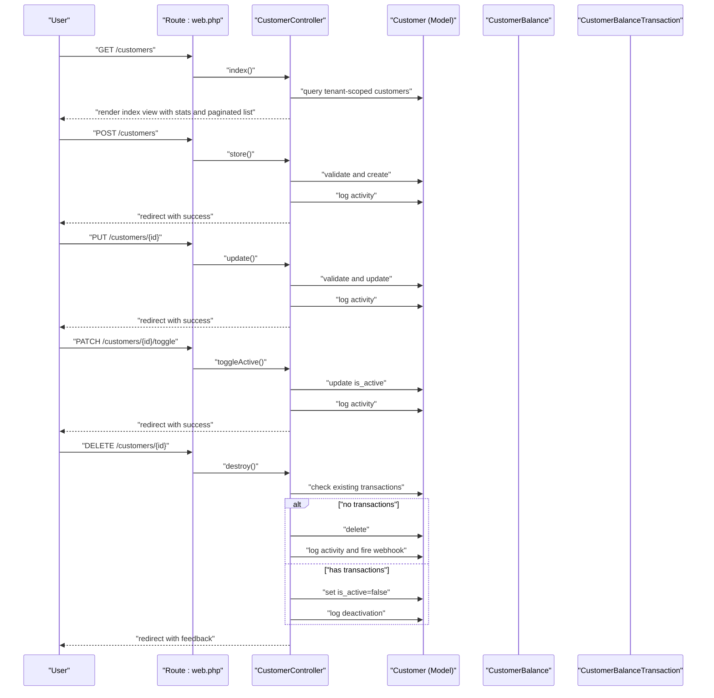
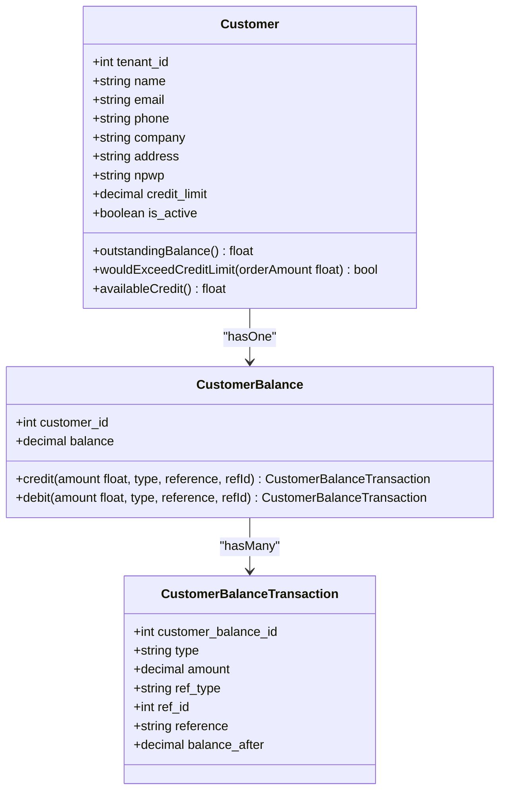
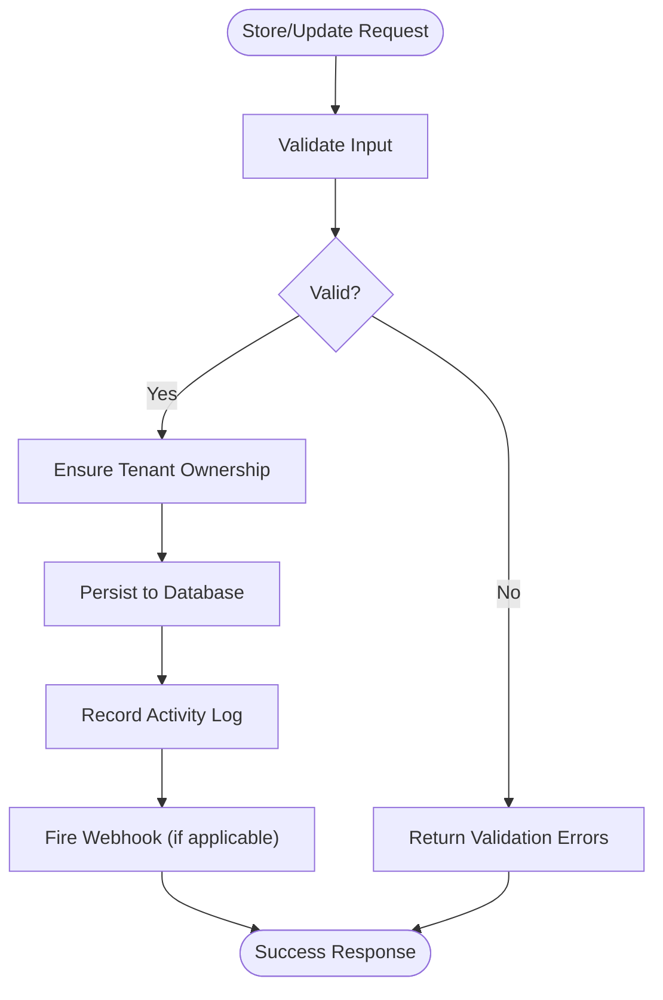
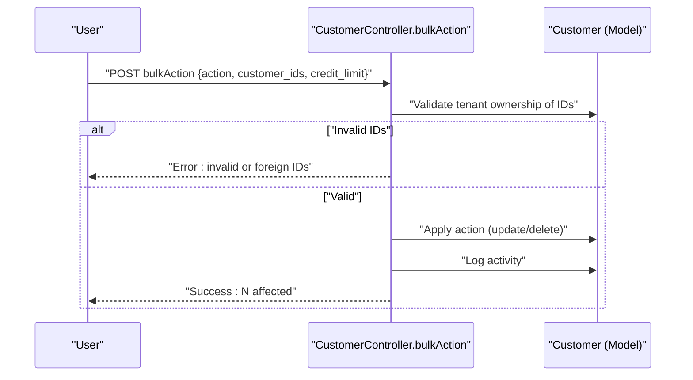
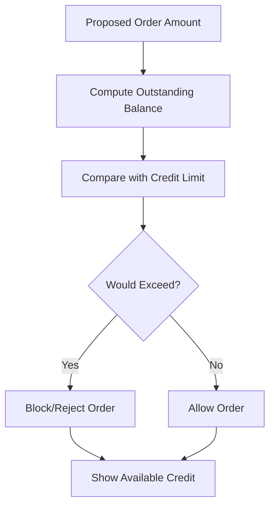
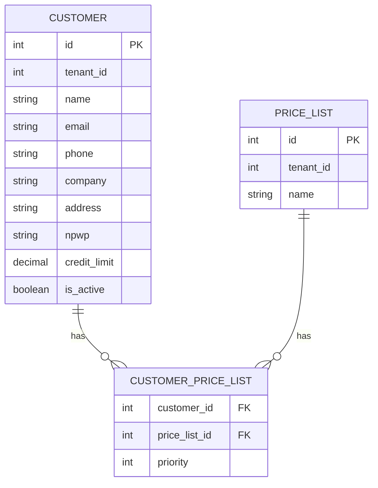
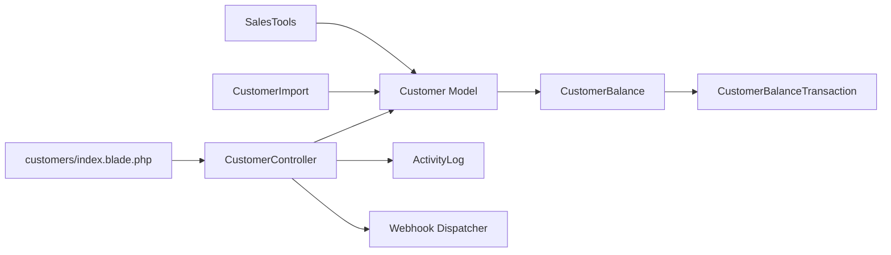

# Customer Management

<cite>
**Referenced Files in This Document**
- [Customer.php](file://app/Models/Customer.php)
- [CustomerBalance.php](file://app/Models/CustomerBalance.php)
- [CustomerBalanceTransaction.php](file://app/Models/CustomerBalanceTransaction.php)
- [CustomerController.php](file://app/Http/Controllers/CustomerController.php)
- [CustomerImport.php](file://app/Imports/CustomerImport.php)
- [SalesTools.php](file://app/Services/ERP/SalesTools.php)
- [index.blade.php](file://resources/views/customers/index.blade.php)
- [web.php](file://routes/web.php)
- [openapi.json](file://public/api-docs/openapi.json)
</cite>

## Table of Contents
1. [Introduction](#introduction)
2. [Project Structure](#project-structure)
3. [Core Components](#core-components)
4. [Architecture Overview](#architecture-overview)
5. [Detailed Component Analysis](#detailed-component-analysis)
6. [Dependency Analysis](#dependency-analysis)
7. [Performance Considerations](#performance-considerations)
8. [Troubleshooting Guide](#troubleshooting-guide)
9. [Conclusion](#conclusion)
10. [Appendices](#appendices)

## Introduction
This document describes the customer management functionality in the system, covering customer profile creation, editing, and maintenance; credit limit management; pricing tier assignments; lifecycle stages; segmentation strategies; communication channels; service history tracking; satisfaction metrics; automated workflows; and privacy/compliance considerations. The content is grounded in the repository’s models, controllers, views, imports, and supporting services.

## Project Structure
Customer management spans backend models and relations, HTTP controllers, Blade views, import utilities, and service-layer helpers. Routes define the customer CRUD surface, while views render lists, forms, and modals. Importers support bulk ingestion of customer data.

```mermaid
graph TB
subgraph "Routes"
RWEB["routes/web.php<br/>Defines customer routes"]
end
subgraph "Controllers"
CC["CustomerController.php<br/>Handles index/store/update/toggle/delete/bulk actions"]
end
subgraph "Models"
M1["Customer.php<br/>Customer entity, relations, credit checks"]
M2["CustomerBalance.php<br/>Wallet-like balance and casting"]
M3["CustomerBalanceTransaction.php<br/>Balance transaction ledger"]
end
subgraph "Views"
V1["resources/views/customers/index.blade.php<br/>List, search, status filter, modals"]
end
subgraph "Imports"
I1["app/Imports/CustomerImport.php<br/>Excel import with validation and upsert"]
end
subgraph "Services"
S1["app/Services/ERP/SalesTools.php<br/>Customer creation/update/list helpers"]
end
RWEB --> CC
CC --> M1
M1 <- --> M2
M2 <- --> M3
CC --> V1
I1 --> M1
S1 --> M1
```

**Diagram sources**
- [web.php:1128-1136](file://routes/web.php#L1128-L1136)
- [CustomerController.php:18-46](file://app/Http/Controllers/CustomerController.php#L18-L46)
- [Customer.php:14-91](file://app/Models/Customer.php#L14-L91)
- [CustomerBalance.php:11-56](file://app/Models/CustomerBalance.php#L11-L56)
- [CustomerBalanceTransaction.php:10-26](file://app/Models/CustomerBalanceTransaction.php#L10-L26)
- [index.blade.php:1-284](file://resources/views/customers/index.blade.php#L1-L284)
- [CustomerImport.php:16-156](file://app/Imports/CustomerImport.php#L16-L156)
- [SalesTools.php:504-583](file://app/Services/ERP/SalesTools.php#L504-L583)

**Section sources**
- [web.php:1128-1136](file://routes/web.php#L1128-L1136)
- [CustomerController.php:18-46](file://app/Http/Controllers/CustomerController.php#L18-L46)
- [Customer.php:14-91](file://app/Models/Customer.php#L14-L91)
- [CustomerBalance.php:11-56](file://app/Models/CustomerBalance.php#L11-L56)
- [CustomerBalanceTransaction.php:10-26](file://app/Models/CustomerBalanceTransaction.php#L10-L26)
- [index.blade.php:1-284](file://resources/views/customers/index.blade.php#L1-L284)
- [CustomerImport.php:16-156](file://app/Imports/CustomerImport.php#L16-L156)
- [SalesTools.php:504-583](file://app/Services/ERP/SalesTools.php#L504-L583)

## Core Components
- Customer model encapsulates personal/company info, contact details, tax ID, credit limit, and active flag. It exposes relations to quotations, sales orders, invoices, customer balance, and balance transactions. It also computes outstanding balances, checks credit limit exposure, and calculates available credit.
- Customer balance model maintains a decimal balance and supports credit/debit operations with typed references and balance-after snapshots.
- Customer balance transaction model records each credit/debit event with amounts and references.
- Customer controller implements listing with search/status filters, bulk actions (activate/deactivate/update credit limit/delete), single record creation, updates, toggling activation, and deletion with safeguards against deleting customers with existing transactions.
- Customer import reads Excel rows, normalizes fields, deduplicates by email, and either updates existing or creates new records per tenant.
- Sales tools service provides programmatic helpers to create, update, and list customers with tenant scoping and friendly messaging.
- Blade view renders customer listing, search/filter toolbar, mobile card layout, and modal forms for add/edit, including credit limit and active toggle.

**Section sources**
- [Customer.php:19-34](file://app/Models/Customer.php#L19-L34)
- [Customer.php:40-67](file://app/Models/Customer.php#L40-L67)
- [Customer.php:69-89](file://app/Models/Customer.php#L69-L89)
- [CustomerBalance.php:14-20](file://app/Models/CustomerBalance.php#L14-L20)
- [CustomerBalance.php:26-54](file://app/Models/CustomerBalance.php#L26-L54)
- [CustomerBalanceTransaction.php:13-21](file://app/Models/CustomerBalanceTransaction.php#L13-L21)
- [CustomerController.php:18-46](file://app/Http/Controllers/CustomerController.php#L18-L46)
- [CustomerController.php:51-124](file://app/Http/Controllers/CustomerController.php#L51-L124)
- [CustomerController.php:126-179](file://app/Http/Controllers/CustomerController.php#L126-L179)
- [CustomerController.php:181-212](file://app/Http/Controllers/CustomerController.php#L181-L212)
- [CustomerImport.php:33-85](file://app/Imports/CustomerImport.php#L33-L85)
- [SalesTools.php:504-583](file://app/Services/ERP/SalesTools.php#L504-L583)
- [index.blade.php:20-150](file://resources/views/customers/index.blade.php#L20-L150)

## Architecture Overview
The customer lifecycle is handled via HTTP routes delegating to a controller, which orchestrates model operations and emits activity logs and webhooks. Data integrity is enforced by validation and tenant isolation. Credit limit checks are performed at the model level. Importers and service helpers provide programmatic ingestion and automation-friendly APIs.



**Diagram sources**
- [web.php:1128-1136](file://routes/web.php#L1128-L1136)
- [CustomerController.php:18-46](file://app/Http/Controllers/CustomerController.php#L18-L46)
- [CustomerController.php:126-179](file://app/Http/Controllers/CustomerController.php#L126-L179)
- [CustomerController.php:181-212](file://app/Http/Controllers/CustomerController.php#L181-L212)
- [Customer.php:40-67](file://app/Models/Customer.php#L40-L67)

## Detailed Component Analysis

### Customer Entity and Relations
The Customer model defines fillable attributes for personal/company info, contact details, tax number, credit limit, and active flag. It casts credit limit and active flag appropriately. It relates to:
- Tenant (soft-deleted, audited)
- Quotations, Sales Orders, Invoices
- Customer Balance (one-to-one)
- Balance Transactions (hasManyThrough via Customer Balance)

It provides:
- Outstanding balance calculation from unpaid/partial invoices
- Credit limit check for proposed order amount
- Available credit computation



**Diagram sources**
- [Customer.php:19-34](file://app/Models/Customer.php#L19-L34)
- [Customer.php:69-89](file://app/Models/Customer.php#L69-L89)
- [CustomerBalance.php:14-20](file://app/Models/CustomerBalance.php#L14-L20)
- [CustomerBalance.php:26-54](file://app/Models/CustomerBalance.php#L26-L54)
- [CustomerBalanceTransaction.php:13-21](file://app/Models/CustomerBalanceTransaction.php#L13-L21)

**Section sources**
- [Customer.php:19-34](file://app/Models/Customer.php#L19-L34)
- [Customer.php:40-67](file://app/Models/Customer.php#L40-L67)
- [Customer.php:69-89](file://app/Models/Customer.php#L69-L89)
- [CustomerBalance.php:14-20](file://app/Models/CustomerBalance.php#L14-L20)
- [CustomerBalance.php:26-54](file://app/Models/CustomerBalance.php#L26-L54)
- [CustomerBalanceTransaction.php:13-21](file://app/Models/CustomerBalanceTransaction.php#L13-L21)

### Customer Lifecycle: Creation, Editing, and Maintenance
- Creation: Validates required fields, prevents duplicates by name per tenant, sets default active status, logs activity, and fires a webhook.
- Editing: Validates updates, enforces tenant ownership, logs changes, and fires a webhook.
- Deletion: Prevents deletion if the customer has existing transactions; otherwise deletes or deactivates accordingly and logs.



**Diagram sources**
- [CustomerController.php:126-179](file://app/Http/Controllers/CustomerController.php#L126-L179)
- [CustomerController.php:181-212](file://app/Http/Controllers/CustomerController.php#L181-L212)

**Section sources**
- [CustomerController.php:126-179](file://app/Http/Controllers/CustomerController.php#L126-L179)
- [CustomerController.php:181-212](file://app/Http/Controllers/CustomerController.php#L181-L212)

### Bulk Operations and Tenant Isolation
- Bulk actions include delete, activate, deactivate, and update credit limit.
- All affected IDs are validated to belong to the current tenant.
- Activity logs capture metadata for auditability.



**Diagram sources**
- [CustomerController.php:51-124](file://app/Http/Controllers/CustomerController.php#L51-L124)

**Section sources**
- [CustomerController.php:51-124](file://app/Http/Controllers/CustomerController.php#L51-L124)

### Credit Limit Management
- Credit limit is stored as a decimal and checked against outstanding balances before allowing new sales.
- The model exposes methods to compute total outstanding, detect if adding an order would exceed the limit, and calculate remaining available credit.



**Diagram sources**
- [Customer.php:69-89](file://app/Models/Customer.php#L69-L89)

**Section sources**
- [Customer.php:69-89](file://app/Models/Customer.php#L69-L89)

### Pricing Tier Assignments
- Customers can be associated with price lists through a pivot table with priority ordering. This enables assigning tiers and prioritizing which price list applies when multiple match.



**Diagram sources**
- [Customer.php:61-67](file://app/Models/Customer.php#L61-L67)

**Section sources**
- [Customer.php:61-67](file://app/Models/Customer.php#L61-L67)

### Customer Segmentation Strategies
- The UI includes analytics views for customer segmentation and RFM analysis, enabling cohort-based strategies and targeted campaigns.
- These views integrate with dashboards to visualize top customers and churn risk segments.

[No sources needed since this section doesn't analyze specific files]

### Customer Lifecycle Stages
- Acquisition: Onboarding via form or import; initial credit limit set; activation toggle.
- Retention: Monitoring outstanding balances, credit utilization, and payment history; targeted communications.
- Churn Prevention: Identifying high-risk customers via analytics; adjusting credit limits or engagement strategies.

[No sources needed since this section doesn't analyze specific files]

### Communication Channels and Service History
- Contact details (email, phone) enable outbound communication.
- Service history is tracked via relations to quotations, sales orders, and invoices.
- Satisfaction metrics can be integrated via dedicated survey entities and analytics dashboards.

[No sources needed since this section doesn't analyze specific files]

### Automated Workflows and Personalized Campaigns
- Programmatic helpers exist to create, update, and list customers, suitable for automation and chatbot integrations.
- Bulk actions streamline mass updates (e.g., credit limit adjustments).
- Import pipeline supports onboarding large volumes of customers.

**Section sources**
- [SalesTools.php:504-583](file://app/Services/ERP/SalesTools.php#L504-L583)
- [CustomerImport.php:33-85](file://app/Imports/CustomerImport.php#L33-L85)
- [CustomerController.php:51-124](file://app/Http/Controllers/CustomerController.php#L51-L124)

### Data Privacy and Compliance
- The system includes GDPR compliance utilities and tenant isolation traits to protect customer data.
- Activity logs capture changes for audit trails.
- Soft deletes are supported at the model level to preserve historical data.

**Section sources**
- [Customer.php:17](file://app/Models/Customer.php#L17)
- [CustomerController.php:102-111](file://app/Http/Controllers/CustomerController.php#L102-L111)

## Dependency Analysis
Customer management depends on:
- Tenant isolation and auditing traits
- Activity logging for all mutations
- Webhooks for external integrations
- Import pipeline for data ingestion
- Analytics dashboards for segmentation and churn risk



**Diagram sources**
- [CustomerController.php:11](file://app/Http/Controllers/CustomerController.php#L11)
- [Customer.php:16-17](file://app/Models/Customer.php#L16-L17)
- [CustomerBalance.php:13](file://app/Models/CustomerBalance.php#L13)
- [CustomerBalanceTransaction.php:12](file://app/Models/CustomerBalanceTransaction.php#L12)
- [CustomerImport.php:16](file://app/Imports/CustomerImport.php#L16)
- [SalesTools.php:504-583](file://app/Services/ERP/SalesTools.php#L504-L583)
- [index.blade.php:1-284](file://resources/views/customers/index.blade.php#L1-L284)

**Section sources**
- [CustomerController.php:11](file://app/Http/Controllers/CustomerController.php#L11)
- [Customer.php:16-17](file://app/Models/Customer.php#L16-L17)
- [CustomerBalance.php:13](file://app/Models/CustomerBalance.php#L13)
- [CustomerBalanceTransaction.php:12](file://app/Models/CustomerBalanceTransaction.php#L12)
- [CustomerImport.php:16](file://app/Imports/CustomerImport.php#L16)
- [SalesTools.php:504-583](file://app/Services/ERP/SalesTools.php#L504-L583)
- [index.blade.php:1-284](file://resources/views/customers/index.blade.php#L1-L284)

## Performance Considerations
- Use pagination for customer listings to avoid large result sets.
- Index tenant_id and commonly filtered fields (name, company, email, phone) in the database for efficient queries.
- Prefer bulk actions for mass updates to reduce round trips.
- Cache frequently accessed customer aggregates (counts, totals) where appropriate.
- Normalize credit limit parsing during imports to prevent type coercion overhead.

[No sources needed since this section provides general guidance]

## Troubleshooting Guide
- Duplicate customer errors occur when creating with an existing name per tenant; resolve by updating the existing record or changing the name.
- Deletion failures: If a customer has existing transactions, the system deactivates them instead of deleting; review transaction history before attempting deletion again.
- Validation failures: Ensure required fields meet constraints and emails are valid.
- Import errors: Review the importer’s error log for row-specific issues and corrected values.

**Section sources**
- [CustomerController.php:140-142](file://app/Http/Controllers/CustomerController.php#L140-L142)
- [CustomerController.php:197-205](file://app/Http/Controllers/CustomerController.php#L197-L205)
- [CustomerImport.php:77-84](file://app/Imports/CustomerImport.php#L77-L84)

## Conclusion
The customer management module provides a robust foundation for maintaining customer profiles, enforcing credit limits, associating pricing tiers, and supporting lifecycle operations. Its integration with tenant isolation, activity logging, webhooks, and import pipelines enables scalable, auditable, and automated workflows aligned with CRM and financial processes.

## Appendices

### API Surface (OpenAPI)
The OpenAPI specification documents the customer object shape and typical fields used across the system.

**Section sources**
- [openapi.json:63-85](file://public/api-docs/openapi.json#L63-L85)