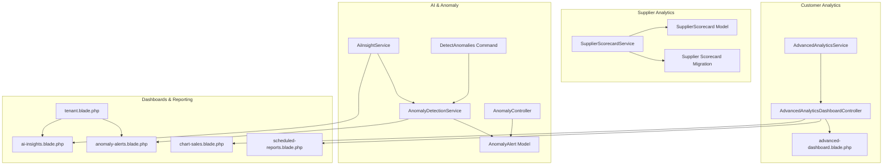
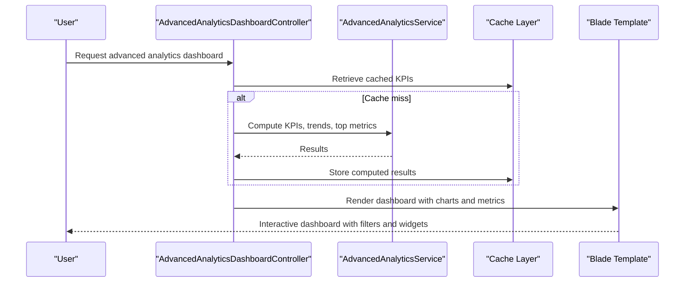
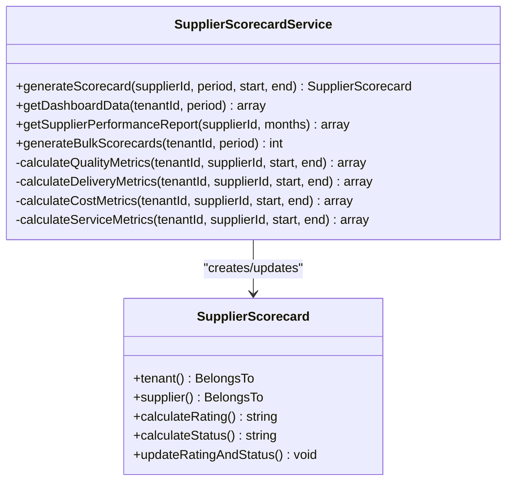
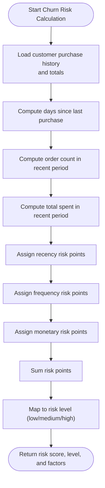
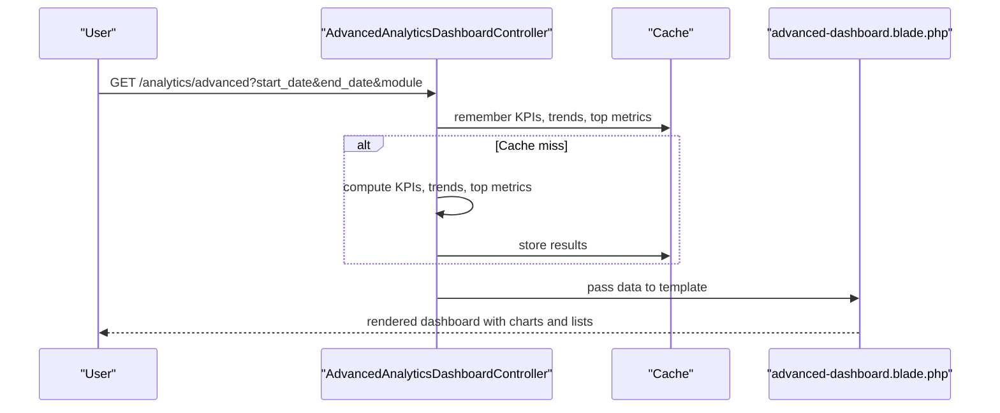
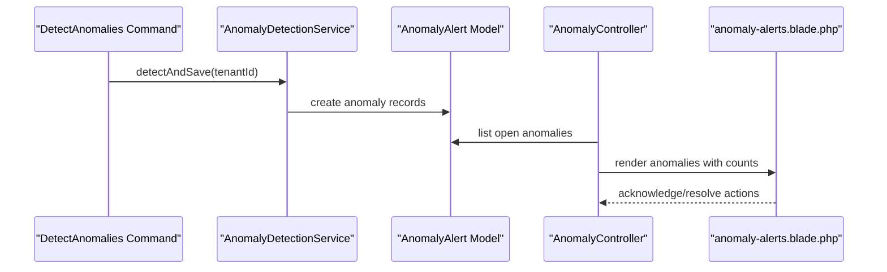
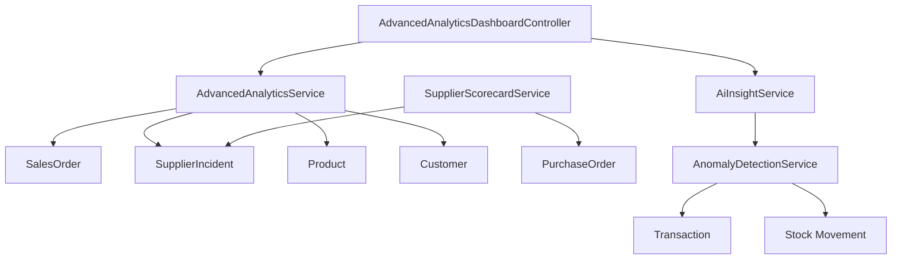

# Relationship Analytics & Insights

<cite>
**Referenced Files in This Document**
- [SupplierScorecardService.php](file://app/Services/SupplierScorecardService.php)
- [SupplierScorecard.php](file://app/Models/SupplierScorecard.php)
- [2026_04_06_150000_create_supplier_scorecard_tables.php](file://database/migrations/2026_04_06_150000_create_supplier_scorecard_tables.php)
- [AdvancedAnalyticsService.php](file://app/Services/AdvancedAnalyticsService.php)
- [AdvancedAnalyticsDashboardController.php](file://app/Http/Controllers/Analytics/AdvancedAnalyticsDashboardController.php)
- [AiInsightService.php](file://app/Services/AiInsightService.php)
- [AnomalyDetectionService.php](file://app/Services/AnomalyDetectionService.php)
- [AnomalyAlert.php](file://app/Models/AnomalyAlert.php)
- [2026_03_23_000051_create_anomalies_table.php](file://database/migrations/2026_03_23_000051_create_anomalies_table.php)
- [AnomalyController.php](file://app/Http/Controllers/AnomalyController.php)
- [DetectAnomalies.php](file://app/Console/Commands/DetectAnomalies.php)
- [advanced-dashboard.blade.php](file://resources/views/analytics/advanced-dashboard.blade.php)
- [ai-insights.blade.php](file://resources/views/dashboard/widgets/ai-insights.blade.php)
- [anomaly-alerts.blade.php](file://resources/views/dashboard/widgets/anomaly-alerts.blade.php)
- [tenant.blade.php](file://resources/views/dashboard/tenant.blade.php)
- [scheduled-reports.blade.php](file://resources/views/analytics/scheduled-reports.blade.php)
- [chart-sales.blade.php](file://resources/views/dashboard/widgets/chart-sales.blade.php)
</cite>

## Table of Contents
1. [Introduction](#introduction)
2. [Project Structure](#project-structure)
3. [Core Components](#core-components)
4. [Architecture Overview](#architecture-overview)
5. [Detailed Component Analysis](#detailed-component-analysis)
6. [Dependency Analysis](#dependency-analysis)
7. [Performance Considerations](#performance-considerations)
8. [Troubleshooting Guide](#troubleshooting-guide)
9. [Conclusion](#conclusion)
10. [Appendices](#appendices)

## Introduction
This document presents a comprehensive guide to the Relationship Analytics & Insights functionality within the qalcuityERP system. It focuses on supplier relationship analytics, customer insights, predictive analytics, automated reporting, and executive dashboards. Covered topics include supplier performance scorecards, customer lifetime value and churn prediction, segmentation algorithms, supplier risk scoring, automated alerts, and visualization techniques for real-time monitoring and benchmarking.

## Project Structure
The analytics and insights features are implemented across services, controllers, models, migrations, and Blade templates:
- Supplier relationship analytics: SupplierScorecardService, SupplierScorecard model, and migration define supplier performance metrics and scoring.
- Customer analytics: AdvancedAnalyticsService provides RFM analysis, churn risk prediction, seasonal trends, and business health scoring.
- AI-driven insights: AiInsightService aggregates anomaly detection and contextual business insights.
- Anomaly detection: AnomalyDetectionService, AnomalyAlert model, and CLI command provide automated anomaly discovery.
- Dashboards and reporting: AdvancedAnalyticsDashboardController and Blade templates render real-time KPIs, charts, scheduled reports, and widgetized dashboards.

**Diagram sources**
- [SupplierScorecardService.php:17-54](file://app/Services/SupplierScorecardService.php#L17-L54)
- [SupplierScorecard.php:74-98](file://app/Models/SupplierScorecard.php#L74-L98)
- [2026_04_06_150000_create_supplier_scorecard_tables.php:31-58](file://database/migrations/2026_04_06_150000_create_supplier_scorecard_tables.php#L31-L58)
- [AdvancedAnalyticsService.php:68-144](file://app/Services/AdvancedAnalyticsService.php#L68-L144)
- [AdvancedAnalyticsDashboardController.php:24-48](file://app/Http/Controllers/Analytics/AdvancedAnalyticsDashboardController.php#L24-L48)
- [AiInsightService.php:38-75](file://app/Services/AiInsightService.php#L38-L75)
- [AnomalyDetectionService.php:56-66](file://app/Services/AnomalyDetectionService.php#L56-L66)
- [AnomalyAlert.php:10-25](file://app/Models/AnomalyAlert.php#L10-L25)
- [AnomalyController.php:15-59](file://app/Http/Controllers/AnomalyController.php#L15-L59)
- [DetectAnomalies.php:14-41](file://app/Console/Commands/DetectAnomalies.php#L14-L41)
- [advanced-dashboard.blade.php:1-443](file://resources/views/analytics/advanced-dashboard.blade.php#L1-L443)
- [ai-insights.blade.php:1-65](file://resources/views/dashboard/widgets/ai-insights.blade.php#L1-L65)
- [anomaly-alerts.blade.php:19-104](file://resources/views/dashboard/widgets/anomaly-alerts.blade.php#L19-L104)
- [tenant.blade.php:507-1046](file://resources/views/dashboard/tenant.blade.php#L507-L1046)
- [scheduled-reports.blade.php:30-45](file://resources/views/analytics/scheduled-reports.blade.php#L30-L45)
- [chart-sales.blade.php:1-29](file://resources/views/dashboard/widgets/chart-sales.blade.php#L1-L29)

**Section sources**
- [SupplierScorecardService.php:17-54](file://app/Services/SupplierScorecardService.php#L17-L54)
- [AdvancedAnalyticsService.php:68-144](file://app/Services/AdvancedAnalyticsService.php#L68-L144)
- [AiInsightService.php:38-75](file://app/Services/AiInsightService.php#L38-L75)
- [AnomalyDetectionService.php:56-66](file://app/Services/AnomalyDetectionService.php#L56-L66)
- [AdvancedAnalyticsDashboardController.php:24-48](file://app/Http/Controllers/Analytics/AdvancedAnalyticsDashboardController.php#L24-L48)
- [advanced-dashboard.blade.php:1-443](file://resources/views/analytics/advanced-dashboard.blade.php#L1-L443)

## Core Components
- Supplier Scorecard Service: Computes supplier quality, delivery, cost, and service metrics, then derives an overall score and rating.
- Advanced Analytics Service: Implements RFM segmentation, churn risk prediction, seasonal trend analysis, and business health scoring.
- AI Insight Service: Aggregates contextual insights and anomalies into actionable notifications.
- Anomaly Detection Service: Detects unusual transactions, journal imbalances, duplicates, fraud patterns, price anomalies, and stock mismatches.
- Dashboard Controllers and Views: Render real-time KPIs, charts, top performers, scheduled reports, and widgetized dashboards.

Key performance indicators covered:
- Customer satisfaction: RFM segmentation, retention rate, churn risk.
- Supplier reliability: Quality defect rate, on-time delivery, lead time, issue resolution rate.
- Partnership success: Overall supplier score, rating, and status; business health score.

**Section sources**
- [SupplierScorecardService.php:28-54](file://app/Services/SupplierScorecardService.php#L28-L54)
- [AdvancedAnalyticsService.php:68-144](file://app/Services/AdvancedAnalyticsService.php#L68-L144)
- [AiInsightService.php:38-75](file://app/Services/AiInsightService.php#L38-L75)
- [AnomalyDetectionService.php:56-66](file://app/Services/AnomalyDetectionService.php#L56-L66)
- [AdvancedAnalyticsDashboardController.php:53-117](file://app/Http/Controllers/Analytics/AdvancedAnalyticsDashboardController.php#L53-L117)

## Architecture Overview
The analytics pipeline integrates data services, controllers, and views:
- Services encapsulate business logic for supplier and customer analytics, anomaly detection, and AI insights.
- Controllers orchestrate data retrieval, caching, and rendering for dashboards and reports.
- Models persist supplier scorecards and anomaly alerts.
- Blade templates render interactive dashboards, charts, and widgetized insights.

**Diagram sources**
- [AdvancedAnalyticsDashboardController.php:24-48](file://app/Http/Controllers/Analytics/AdvancedAnalyticsDashboardController.php#L24-L48)
- [AdvancedAnalyticsDashboardController.php:53-117](file://app/Http/Controllers/Analytics/AdvancedAnalyticsDashboardController.php#L53-L117)
- [AdvancedAnalyticsService.php:68-144](file://app/Services/AdvancedAnalyticsService.php#L68-L144)
- [advanced-dashboard.blade.php:1-443](file://resources/views/analytics/advanced-dashboard.blade.php#L1-L443)

**Section sources**
- [AdvancedAnalyticsDashboardController.php:24-48](file://app/Http/Controllers/Analytics/AdvancedAnalyticsDashboardController.php#L24-L48)
- [AdvancedAnalyticsService.php:68-144](file://app/Services/AdvancedAnalyticsService.php#L68-L144)
- [advanced-dashboard.blade.php:1-443](file://resources/views/analytics/advanced-dashboard.blade.php#L1-L443)

## Detailed Component Analysis

### Supplier Relationship Analytics
SupplierScorecardService computes supplier performance across four pillars:
- Quality: Defect rate and quality score derived from rejected quantities and total deliveries.
- Delivery: On-time percentage and average lead time from purchase orders.
- Cost: Cost score based on identified savings and total spend; price competitiveness metric.
- Service: Issue resolution rate and average response time from supplier incidents.

It also supports:
- Dashboard aggregation by period and category.
- Performance trend analysis over multiple periods.
- Bulk generation of scorecards for all active suppliers.

**Diagram sources**
- [SupplierScorecardService.php:17-54](file://app/Services/SupplierScorecardService.php#L17-L54)
- [SupplierScorecardService.php:182-234](file://app/Services/SupplierScorecardService.php#L182-L234)
- [SupplierScorecardService.php:239-285](file://app/Services/SupplierScorecardService.php#L239-L285)
- [SupplierScorecard.php:64-98](file://app/Models/SupplierScorecard.php#L64-L98)

Supplier risk scoring:
- Overall score is a weighted average of quality, delivery, cost, and service metrics.
- Rating and status are derived from thresholds to classify supplier health.

Benchmarking and trend analysis:
- Periodic scorecards enable trend comparisons across monthly/quarterly/yearly windows.
- Category-wise aggregation supports benchmarking across supplier segments.

**Section sources**
- [SupplierScorecardService.php:28-54](file://app/Services/SupplierScorecardService.php#L28-L54)
- [SupplierScorecardService.php:182-234](file://app/Services/SupplierScorecardService.php#L182-L234)
- [SupplierScorecardService.php:239-285](file://app/Services/SupplierScorecardService.php#L239-L285)
- [SupplierScorecard.php:74-98](file://app/Models/SupplierScorecard.php#L74-L98)
- [2026_04_06_150000_create_supplier_scorecard_tables.php:31-58](file://database/migrations/2026_04_06_150000_create_supplier_scorecard_tables.php#L31-L58)

### Customer Lifetime Value and Churn Prediction
AdvancedAnalyticsService provides:
- RFM segmentation: Recency, Frequency, Monetary quintile scoring and segment assignment.
- Churn risk prediction: Days since last purchase, order frequency, and monetary activity drive risk scores and levels.
- Seasonal trend analysis: Monthly revenue trends, seasonal indices, year-over-year comparisons, and peak season identification.

**Diagram sources**
- [AdvancedAnalyticsService.php:297-355](file://app/Services/AdvancedAnalyticsService.php#L297-L355)
- [AdvancedAnalyticsService.php:658-694](file://app/Services/AdvancedAnalyticsService.php#L658-L694)

Segmentation algorithms:
- Quintile scoring assigns 1–5 scores for recency, frequency, and monetary.
- Segment mapping uses composite R+F+M scores to classify customers.

Predictive analytics:
- Linear regression-based sales forecasting with confidence intervals and accuracy metrics.
- Inventory demand prediction using average daily demand and reorder thresholds.

**Section sources**
- [AdvancedAnalyticsService.php:68-144](file://app/Services/AdvancedAnalyticsService.php#L68-L144)
- [AdvancedAnalyticsService.php:297-355](file://app/Services/AdvancedAnalyticsService.php#L297-L355)
- [AdvancedAnalyticsService.php:443-477](file://app/Services/AdvancedAnalyticsService.php#L443-L477)
- [AdvancedAnalyticsService.php:710-784](file://app/Services/AdvancedAnalyticsService.php#L710-L784)

### Automated Reporting Dashboards and Executive Insights
The Advanced Analytics Dashboard renders:
- Real-time KPI cards for revenue, orders, inventory, and customers.
- Revenue and orders trend charts using ApexCharts.
- Top products, customers, and categories.
- Filters for date range and module selection.

Scheduled reports and custom report builder:
- Users can schedule recurring reports and export formats (PDF, Excel, CSV).
- Custom report builder allows selecting metrics and date ranges.

**Diagram sources**
- [AdvancedAnalyticsDashboardController.php:24-48](file://app/Http/Controllers/Analytics/AdvancedAnalyticsDashboardController.php#L24-L48)
- [AdvancedAnalyticsDashboardController.php:53-185](file://app/Http/Controllers/Analytics/AdvancedAnalyticsDashboardController.php#L53-L185)
- [advanced-dashboard.blade.php:1-443](file://resources/views/analytics/advanced-dashboard.blade.php#L1-L443)

**Section sources**
- [AdvancedAnalyticsDashboardController.php:24-48](file://app/Http/Controllers/Analytics/AdvancedAnalyticsDashboardController.php#L24-L48)
- [AdvancedAnalyticsDashboardController.php:53-185](file://app/Http/Controllers/Analytics/AdvancedAnalyticsDashboardController.php#L53-L185)
- [advanced-dashboard.blade.php:1-443](file://resources/views/analytics/advanced-dashboard.blade.php#L1-L443)
- [scheduled-reports.blade.php:30-45](file://resources/views/analytics/scheduled-reports.blade.php#L30-L45)

### AI Insights and Automated Alerts
AiInsightService transforms anomaly detections and contextual analyses into structured insights:
- Revenue trend drops/spikes, monthly revenue changes with causal factors.
- Stock depletion warnings, expense anomalies, overdue receivables.
- Credit limit monitoring and currency rate staleness alerts.
- Sales velocity stalls and top product highlights.

AnomalyDetectionService runs detectors and persists alerts:
- Unusual transactions, unbalanced journals, duplicate transactions, fraud patterns, price anomalies, stock mismatches.
- Alerts are stored in AnomalyAlert model with severity and status tracking.

**Diagram sources**
- [DetectAnomalies.php:14-41](file://app/Console/Commands/DetectAnomalies.php#L14-L41)
- [AnomalyDetectionService.php:56-66](file://app/Services/AnomalyDetectionService.php#L56-L66)
- [AnomalyAlert.php:10-25](file://app/Models/AnomalyAlert.php#L10-L25)
- [AnomalyController.php:15-59](file://app/Http/Controllers/AnomalyController.php#L15-L59)
- [anomaly-alerts.blade.php:19-104](file://resources/views/dashboard/widgets/anomaly-alerts.blade.php#L19-L104)

**Section sources**
- [AiInsightService.php:38-75](file://app/Services/AiInsightService.php#L38-L75)
- [AiInsightService.php:124-201](file://app/Services/AiInsightService.php#L124-L201)
- [AiInsightService.php:207-400](file://app/Services/AiInsightService.php#L207-L400)
- [AiInsightService.php:410-460](file://app/Services/AiInsightService.php#L410-L460)
- [AiInsightService.php:465-519](file://app/Services/AiInsightService.php#L465-L519)
- [AiInsightService.php:524-555](file://app/Services/AiInsightService.php#L524-L555)
- [AiInsightService.php:560-652](file://app/Services/AiInsightService.php#L560-L652)
- [AiInsightService.php:659-721](file://app/Services/AiInsightService.php#L659-L721)
- [AnomalyDetectionService.php:56-66](file://app/Services/AnomalyDetectionService.php#L56-L66)
- [AnomalyAlert.php:10-25](file://app/Models/AnomalyAlert.php#L10-L25)
- [AnomalyController.php:15-59](file://app/Http/Controllers/AnomalyController.php#L15-L59)
- [anomaly-alerts.blade.php:19-104](file://resources/views/dashboard/widgets/anomaly-alerts.blade.php#L19-L104)

### Data Visualization Techniques and Real-Time Monitoring
- Interactive charts: ApexCharts for revenue and orders trends; Chart.js for widgetized sales charts.
- Dark/light theme support with consistent styling and responsive layouts.
- Real-time KPI cards with growth indicators and module filtering.
- Widgetized dashboards with draggable ordering and customization.

Executive reporting:
- Scheduled reports with configurable recipients and formats.
- Custom report builder for tailored analytics exports.

**Section sources**
- [advanced-dashboard.blade.php:327-443](file://resources/views/analytics/advanced-dashboard.blade.php#L327-L443)
- [chart-sales.blade.php:1-29](file://resources/views/dashboard/widgets/chart-sales.blade.php#L1-L29)
- [tenant.blade.php:507-1046](file://resources/views/dashboard/tenant.blade.php#L507-L1046)
- [scheduled-reports.blade.php:30-45](file://resources/views/analytics/scheduled-reports.blade.php#L30-L45)

## Dependency Analysis
Supplier analytics depend on purchase order and incident data; customer analytics rely on sales orders and product stocks; AI insights integrate anomaly detection outputs; dashboards depend on caching and chart libraries.

**Diagram sources**
- [AdvancedAnalyticsService.php:68-144](file://app/Services/AdvancedAnalyticsService.php#L68-L144)
- [SupplierScorecardService.php:59-177](file://app/Services/SupplierScorecardService.php#L59-L177)
- [AiInsightService.php:38-75](file://app/Services/AiInsightService.php#L38-L75)
- [AnomalyDetectionService.php:73-76](file://app/Services/AnomalyDetectionService.php#L73-L76)
- [AdvancedAnalyticsDashboardController.php:24-48](file://app/Http/Controllers/Analytics/AdvancedAnalyticsDashboardController.php#L24-L48)

**Section sources**
- [AdvancedAnalyticsService.php:68-144](file://app/Services/AdvancedAnalyticsService.php#L68-L144)
- [SupplierScorecardService.php:59-177](file://app/Services/SupplierScorecardService.php#L59-L177)
- [AiInsightService.php:38-75](file://app/Services/AiInsightService.php#L38-L75)
- [AnomalyDetectionService.php:73-76](file://app/Services/AnomalyDetectionService.php#L73-L76)
- [AdvancedAnalyticsDashboardController.php:24-48](file://app/Http/Controllers/Analytics/AdvancedAnalyticsDashboardController.php#L24-L48)

## Performance Considerations
- Caching: Dashboard endpoints leverage caching to reduce database load and improve responsiveness.
- Aggregation queries: Supplier scorecards and customer analytics use grouped aggregations to minimize result sets.
- Linear regression: Forecasting uses lightweight statistical computations suitable for periodic execution.
- Pagination and limits: Anomaly listings and scheduled reports use pagination to manage large datasets.

[No sources needed since this section provides general guidance]

## Troubleshooting Guide
Common issues and resolutions:
- No anomalies detected: Trigger anomaly detection via the anomaly controller or CLI command to refresh alerts.
- Dashboard not updating: Refresh insights or clear cache to regenerate KPIs and charts.
- Scheduled reports not sending: Verify recipients, format, and next run timestamps; ensure scheduler is configured.

**Section sources**
- [AnomalyController.php:36-59](file://app/Http/Controllers/AnomalyController.php#L36-L59)
- [DetectAnomalies.php:14-41](file://app/Console/Commands/DetectAnomalies.php#L14-L41)
- [tenant.blade.php:507-1046](file://resources/views/dashboard/tenant.blade.php#L507-L1046)

## Conclusion
The Relationship Analytics & Insights module delivers a robust foundation for supplier and customer relationship management through supplier scorecards, RFM segmentation, churn prediction, anomaly detection, and executive dashboards. With automated reporting, trend analysis, and real-time monitoring, organizations can make data-driven decisions to improve supplier reliability, customer retention, and overall business health.

[No sources needed since this section summarizes without analyzing specific files]

## Appendices
- Key metrics and definitions:
  - Supplier quality score: Derived from defect rate.
  - Delivery score: Based on on-time percentage.
  - Cost score: Based on savings percentage and price competitiveness.
  - Service score: Based on issue resolution rate and response time.
  - Customer churn risk: Composite score mapped to low/medium/high risk.
  - Business health score: Weighted composite of revenue growth, profitability, cash flow, retention, inventory health, and employee productivity.

[No sources needed since this section provides general guidance]