# Supplier Management

<cite>
**Referenced Files in This Document**
- [Supplier.php](file://app/Models/Supplier.php)
- [SupplierScorecard.php](file://app/Models/SupplierScorecard.php)
- [SupplierDocument.php](file://app/Models/SupplierDocument.php)
- [SupplierIncident.php](file://app/Models/SupplierIncident.php)
- [SupplierRfqResponse.php](file://app/Models/SupplierRfqResponse.php)
- [SupplierPortalUser.php](file://app/Models/SupplierPortalUser.php)
- [SupplierMarketIntelligence.php](file://app/Models/SupplierMarketIntelligence.php)
- [SourcingOpportunity.php](file://app/Models/SourcingOpportunity.php)
- [SupplierController.php](file://app/Http/Controllers/SupplierController.php)
- [SupplierScorecardController.php](file://app/Http/Controllers/Suppliers/SupplierScorecardController.php)
- [SupplierScorecardService.php](file://app/Services/SupplierScorecardService.php)
- [StrategicSourcingService.php](file://app/Services/StrategicSourcingService.php)
- [2026_04_06_150000_create_supplier_scorecard_tables.php](file://database/migrations/2026_04_06_150000_create_supplier_scorecard_tables.php)
- [rfq-analysis.blade.php](file://resources/views/Suppliers/rfq-analysis.blade.php)
</cite>

## Table of Contents
1. [Introduction](#introduction)
2. [Project Structure](#project-structure)
3. [Core Components](#core-components)
4. [Architecture Overview](#architecture-overview)
5. [Detailed Component Analysis](#detailed-component-analysis)
6. [Dependency Analysis](#dependency-analysis)
7. [Performance Considerations](#performance-considerations)
8. [Troubleshooting Guide](#troubleshooting-guide)
9. [Conclusion](#conclusion)
10. [Appendices](#appendices)

## Introduction
This document describes the supplier management capabilities implemented in the system, focusing on supplier onboarding, qualification, due diligence, evaluation and performance scoring, risk assessment, contract and compliance tracking, relationship maintenance, communication and issue resolution, collaborative improvement, automated alerts, strategic sourcing, and data security and auditability. The functionality spans models, services, controllers, views, and database migrations that define supplier data structures, evaluation logic, sourcing workflows, and portal integrations.

## Project Structure
Supplier management is implemented across models, services, controllers, views, and migrations:
- Models represent supplier entities, scorecards, documents, incidents, RFQ responses, portal users, market intelligence, and sourcing opportunities.
- Services encapsulate supplier scorecard generation, evaluation, and strategic sourcing logic.
- Controllers orchestrate UI flows for supplier records, scorecards, sourcing dashboards, and RFQ analysis.
- Views render scorecard dashboards, supplier comparisons, and RFQ evaluation results.
- Migrations define the schema for supplier scorecards, collaboration portal users, supplier documents, RFQ responses, incidents, sourcing opportunities, and market intelligence.

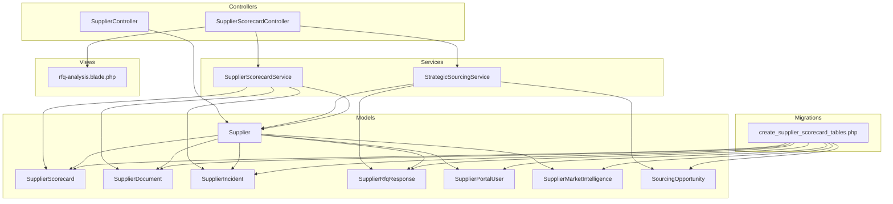

**Diagram sources**
- [Supplier.php:13-51](file://app/Models/Supplier.php#L13-L51)
- [SupplierScorecard.php:12-114](file://app/Models/SupplierScorecard.php#L12-L114)
- [SupplierDocument.php:11-64](file://app/Models/SupplierDocument.php#L11-L64)
- [SupplierIncident.php:11-70](file://app/Models/SupplierIncident.php#L11-L70)
- [SupplierRfqResponse.php:11-60](file://app/Models/SupplierRfqResponse.php#L11-L60)
- [SupplierPortalUser.php:11-45](file://app/Models/SupplierPortalUser.php#L11-L45)
- [SupplierMarketIntelligence.php:11-40](file://app/Models/SupplierMarketIntelligence.php#L11-L40)
- [SourcingOpportunity.php:11-60](file://app/Models/SourcingOpportunity.php#L11-L60)
- [SupplierController.php:9-128](file://app/Http/Controllers/SupplierController.php#L9-L128)
- [SupplierScorecardController.php:11-206](file://app/Http/Controllers/Suppliers/SupplierScorecardController.php#L11-L206)
- [SupplierScorecardService.php:12-321](file://app/Services/SupplierScorecardService.php#L12-L321)
- [StrategicSourcingService.php:185-309](file://app/Services/StrategicSourcingService.php#L185-L309)
- [2026_04_06_150000_create_supplier_scorecard_tables.php:56-211](file://database/migrations/2026_04_06_150000_create_supplier_scorecard_tables.php#L56-L211)
- [rfq-analysis.blade.php:126-266](file://resources/views/Suppliers/rfq-analysis.blade.php#L126-L266)

**Section sources**
- [Supplier.php:13-51](file://app/Models/Supplier.php#L13-L51)
- [SupplierScorecard.php:12-114](file://app/Models/SupplierScorecard.php#L12-L114)
- [SupplierController.php:9-128](file://app/Http/Controllers/SupplierController.php#L9-L128)
- [SupplierScorecardController.php:11-206](file://app/Http/Controllers/Suppliers/SupplierScorecardController.php#L11-L206)
- [SupplierScorecardService.php:12-321](file://app/Services/SupplierScorecardService.php#L12-L321)
- [StrategicSourcingService.php:185-309](file://app/Services/StrategicSourcingService.php#L185-L309)
- [2026_04_06_150000_create_supplier_scorecard_tables.php:56-211](file://database/migrations/2026_04_06_150000_create_supplier_scorecard_tables.php#L56-L211)
- [rfq-analysis.blade.php:126-266](file://resources/views/Suppliers/rfq-analysis.blade.php#L126-L266)

## Core Components
- Supplier model: Core entity with tenant scoping, soft deletes, activity auditing, and relationships to purchase orders and scorecards.
- SupplierScorecard model: Aggregates quality, delivery, cost, and service metrics with computed rating and status, and supports tenant scoping.
- SupplierScorecardService: Generates periodical scorecards, computes weighted scores, and produces dashboard and performance reports.
- StrategicSourcingService: Evaluates RFQ responses with price, lead time, supplier rating, delivery performance, and payment terms, and recommends suppliers.
- SupplierController: Manages supplier CRUD, activation/deactivation, and deletion with audit logging.
- SupplierScorecardController: Renders dashboards, supplier details, RFQ analysis, sourcing opportunities, and exports scorecards.
- Supporting models: SupplierDocument, SupplierIncident, SupplierRfqResponse, SupplierPortalUser, SupplierMarketIntelligence, SourcingOpportunity.
- Database schema: Migration defines scorecard, portal users, documents, RFQ responses, incidents, sourcing opportunities, and market intelligence tables.

**Section sources**
- [Supplier.php:13-51](file://app/Models/Supplier.php#L13-L51)
- [SupplierScorecard.php:12-114](file://app/Models/SupplierScorecard.php#L12-L114)
- [SupplierScorecardService.php:12-321](file://app/Services/SupplierScorecardService.php#L12-L321)
- [StrategicSourcingService.php:185-309](file://app/Services/StrategicSourcingService.php#L185-L309)
- [SupplierController.php:9-128](file://app/Http/Controllers/SupplierController.php#L9-L128)
- [SupplierScorecardController.php:11-206](file://app/Http/Controllers/Suppliers/SupplierScorecardController.php#L11-L206)
- [SupplierDocument.php:11-64](file://app/Models/SupplierDocument.php#L11-L64)
- [SupplierIncident.php:11-70](file://app/Models/SupplierIncident.php#L11-L70)
- [SupplierRfqResponse.php:11-60](file://app/Models/SupplierRfqResponse.php#L11-L60)
- [SupplierPortalUser.php:11-45](file://app/Models/SupplierPortalUser.php#L11-L45)
- [SupplierMarketIntelligence.php:11-40](file://app/Models/SupplierMarketIntelligence.php#L11-L40)
- [SourcingOpportunity.php:11-60](file://app/Models/SourcingOpportunity.php#L11-L60)
- [2026_04_06_150000_create_supplier_scorecard_tables.php:56-211](file://database/migrations/2026_04_06_150000_create_supplier_scorecard_tables.php#L56-L211)

## Architecture Overview
The supplier management architecture integrates domain models, evaluation services, and presentation controllers/views. Evaluation services compute supplier performance and sourcing recommendations, while controllers expose dashboards and analytical views. Tenant scoping and soft deletes ensure data isolation and auditability.

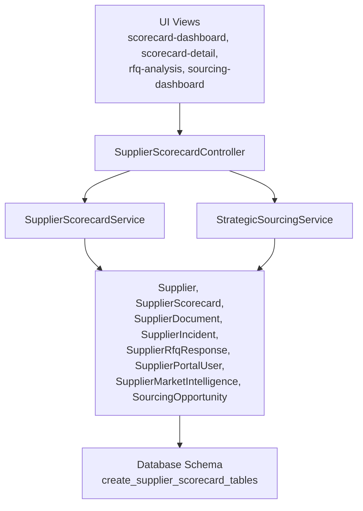

**Diagram sources**
- [SupplierScorecardController.php:11-206](file://app/Http/Controllers/Suppliers/SupplierScorecardController.php#L11-L206)
- [SupplierScorecardService.php:12-321](file://app/Services/SupplierScorecardService.php#L12-L321)
- [StrategicSourcingService.php:185-309](file://app/Services/StrategicSourcingService.php#L185-L309)
- [Supplier.php:13-51](file://app/Models/Supplier.php#L13-L51)
- [SupplierScorecard.php:12-114](file://app/Models/SupplierScorecard.php#L12-L114)
- [SupplierDocument.php:11-64](file://app/Models/SupplierDocument.php#L11-L64)
- [SupplierIncident.php:11-70](file://app/Models/SupplierIncident.php#L11-L70)
- [SupplierRfqResponse.php:11-60](file://app/Models/SupplierRfqResponse.php#L11-L60)
- [SupplierPortalUser.php:11-45](file://app/Models/SupplierPortalUser.php#L11-L45)
- [SupplierMarketIntelligence.php:11-40](file://app/Models/SupplierMarketIntelligence.php#L11-L40)
- [SourcingOpportunity.php:11-60](file://app/Models/SourcingOpportunity.php#L11-L60)
- [2026_04_06_150000_create_supplier_scorecard_tables.php:56-211](file://database/migrations/2026_04_06_150000_create_supplier_scorecard_tables.php#L56-L211)

## Detailed Component Analysis

### Supplier Onboarding and Lifecycle
- Onboarding: Create supplier records via the supplier controller with validation and tenant scoping. Activity logs capture creation events.
- Activation/Deactivation: Toggle supplier activity status; deactivation is prevented if purchase orders exist, otherwise the supplier is deleted.
- Relationship maintenance: Suppliers link to purchase orders, scorecards, documents, incidents, RFQ responses, portal users, and market intelligence.

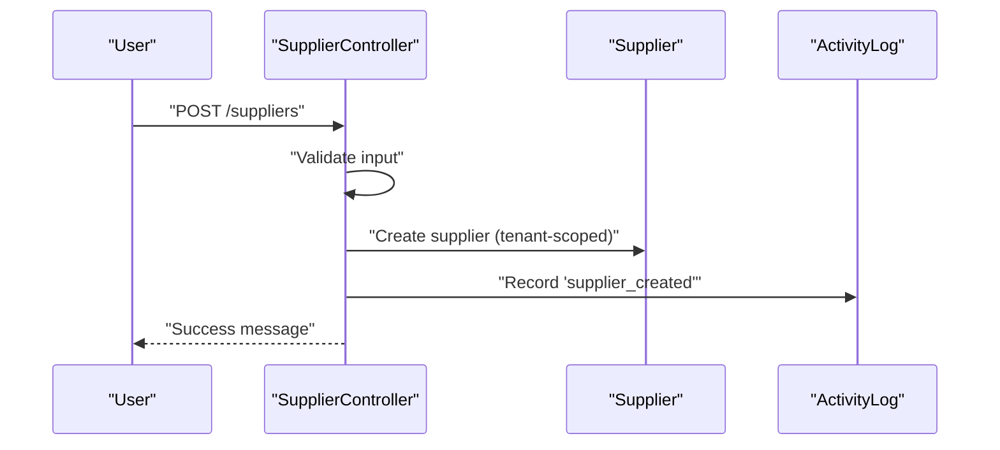

**Diagram sources**
- [SupplierController.php:46-74](file://app/Http/Controllers/SupplierController.php#L46-L74)
- [Supplier.php:13-51](file://app/Models/Supplier.php#L13-L51)

**Section sources**
- [SupplierController.php:46-127](file://app/Http/Controllers/SupplierController.php#L46-L127)
- [Supplier.php:13-51](file://app/Models/Supplier.php#L13-L51)

### Supplier Qualification and Due Diligence
- Documents and certifications: Store and track supplier documents with verification metadata and expiry dates.
- Expiry monitoring: Helper methods detect expiring or expired documents for automated alerts.
- Verification workflow: Documents support verification timestamps and assigned verifiers.

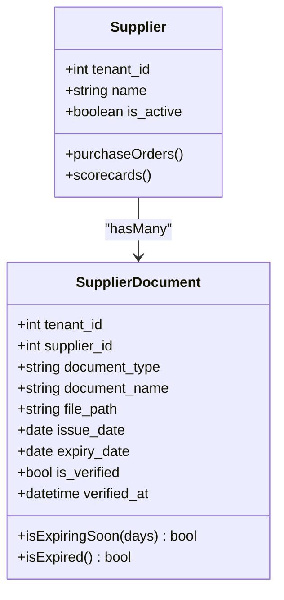

**Diagram sources**
- [SupplierDocument.php:11-64](file://app/Models/SupplierDocument.php#L11-L64)
- [Supplier.php:13-51](file://app/Models/Supplier.php#L13-L51)

**Section sources**
- [SupplierDocument.php:11-64](file://app/Models/SupplierDocument.php#L11-L64)
- [2026_04_06_150000_create_supplier_scorecard_tables.php:84-105](file://database/migrations/2026_04_06_150000_create_supplier_scorecard_tables.php#L84-L105)

### Supplier Evaluation and Performance Scoring
- Scorecard generation: Service aggregates quality, delivery, cost, and service metrics into a weighted overall score and assigns rating/status.
- Quality metrics: Defect rates and counts inform quality score.
- Delivery metrics: On-time delivery percentage and average lead time.
- Cost metrics: Spend totals, savings identification, and price competitiveness.
- Service metrics: Issue resolution rate and response time.
- Dashboard and reporting: Periodic dashboards and supplier performance trends.

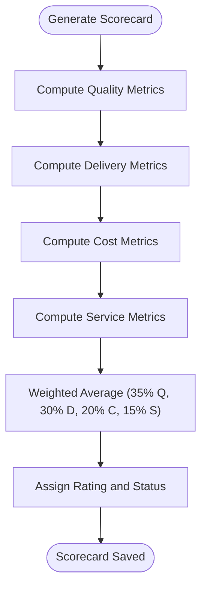

**Diagram sources**
- [SupplierScorecardService.php:17-54](file://app/Services/SupplierScorecardService.php#L17-L54)
- [SupplierScorecardService.php:59-177](file://app/Services/SupplierScorecardService.php#L59-L177)
- [SupplierScorecard.php:74-101](file://app/Models/SupplierScorecard.php#L74-L101)

**Section sources**
- [SupplierScorecardService.php:17-321](file://app/Services/SupplierScorecardService.php#L17-L321)
- [SupplierScorecard.php:12-114](file://app/Models/SupplierScorecard.php#L12-L114)

### Risk Assessment Methodologies
- Incident tracking: Incidents capture severity, impact, financial impact, and resolution status for risk profiling.
- Scorecard status: Derived from overall score thresholds to signal risk levels.
- Market intelligence: External insights on supplier financial health, capacity changes, and market share influence risk perception.

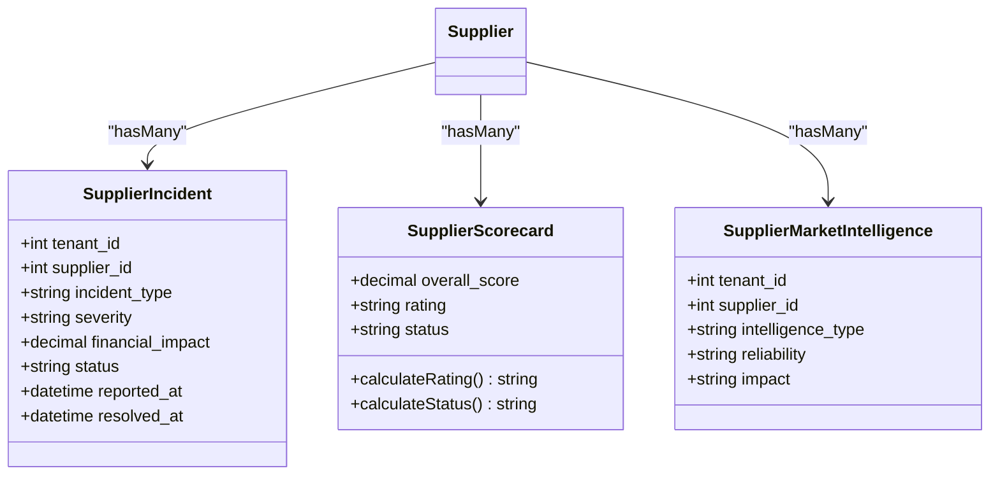

**Diagram sources**
- [SupplierIncident.php:11-70](file://app/Models/SupplierIncident.php#L11-L70)
- [SupplierScorecard.php:74-101](file://app/Models/SupplierScorecard.php#L74-L101)
- [SupplierMarketIntelligence.php:11-40](file://app/Models/SupplierMarketIntelligence.php#L11-L40)

**Section sources**
- [SupplierIncident.php:11-70](file://app/Models/SupplierIncident.php#L11-L70)
- [SupplierScorecard.php:74-101](file://app/Models/SupplierScorecard.php#L74-L101)
- [SupplierMarketIntelligence.php:11-40](file://app/Models/SupplierMarketIntelligence.php#L11-L40)

### Strategic Sourcing Decisions and RFQ Evaluation
- RFQ response scoring: Evaluates price competitiveness, lead time, supplier rating, delivery performance, and payment terms with weighted criteria.
- Recommendation engine: Selects recommended supplier based on composite scores and displays evaluation methodology.
- Sourcing opportunities: Manage sourcing projects with priority, status, estimated spend, and savings projections.

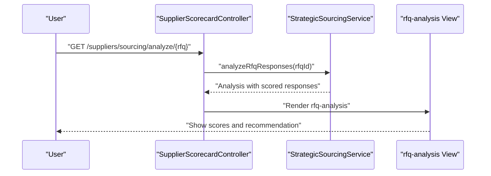

**Diagram sources**
- [SupplierScorecardController.php:89-98](file://app/Http/Controllers/Suppliers/SupplierScorecardController.php#L89-L98)
- [StrategicSourcingService.php:185-309](file://app/Services/StrategicSourcingService.php#L185-L309)
- [rfq-analysis.blade.php:126-266](file://resources/views/Suppliers/rfq-analysis.blade.php#L126-L266)

**Section sources**
- [StrategicSourcingService.php:185-309](file://app/Services/StrategicSourcingService.php#L185-L309)
- [SupplierScorecardController.php:89-98](file://app/Http/Controllers/Suppliers/SupplierScorecardController.php#L89-L98)
- [rfq-analysis.blade.php:126-266](file://resources/views/Suppliers/rfq-analysis.blade.php#L126-L266)

### Contract Management, Compliance Tracking, and Collaboration Portal
- Portal users: Supplier portal users with roles (viewer, editor, admin), tenant and supplier scoping, and last login tracking.
- Documents and certifications: Centralized storage with verification and expiry tracking for compliance.
- Market intelligence: Structured intelligence reports with reliability and impact assessments for informed contract decisions.

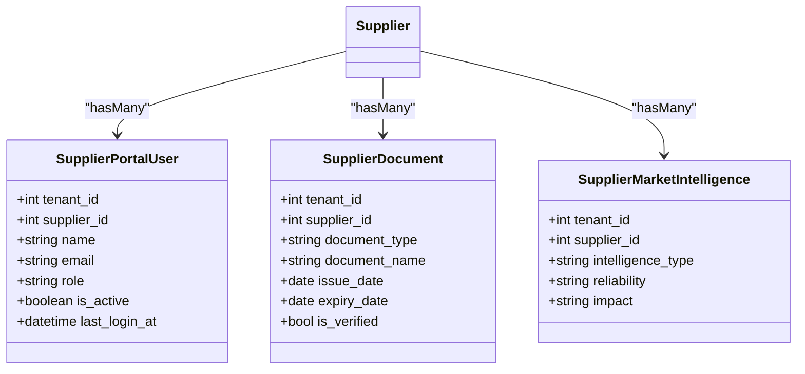

**Diagram sources**
- [SupplierPortalUser.php:11-45](file://app/Models/SupplierPortalUser.php#L11-L45)
- [SupplierDocument.php:11-64](file://app/Models/SupplierDocument.php#L11-L64)
- [SupplierMarketIntelligence.php:11-40](file://app/Models/SupplierMarketIntelligence.php#L11-L40)

**Section sources**
- [SupplierPortalUser.php:11-45](file://app/Models/SupplierPortalUser.php#L11-L45)
- [SupplierDocument.php:11-64](file://app/Models/SupplierDocument.php#L11-L64)
- [SupplierMarketIntelligence.php:11-40](file://app/Models/SupplierMarketIntelligence.php#L11-L40)
- [2026_04_06_150000_create_supplier_scorecard_tables.php:64-105](file://database/migrations/2026_04_06_150000_create_supplier_scorecard_tables.php#L64-L105)

### Supplier Communication Protocols and Issue Resolution
- Incident lifecycle: Reporting, assignment, resolution, and preventive actions with timestamps and responsible parties.
- Service metrics: Issue resolution rate and response time inform service scorecard components.
- Collaborative portal: Enables supplier access for transparency and joint improvement.

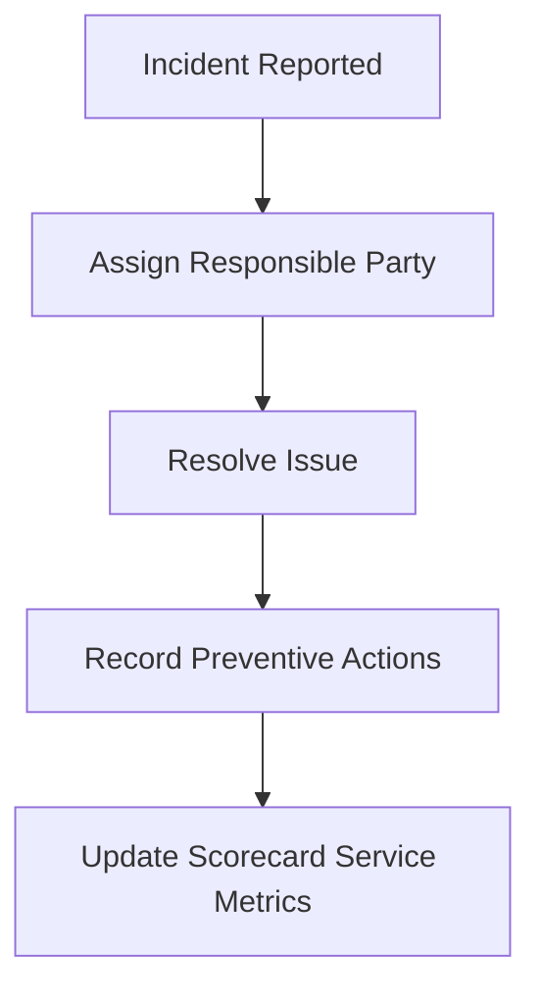

**Diagram sources**
- [SupplierIncident.php:11-70](file://app/Models/SupplierIncident.php#L11-L70)
- [SupplierScorecardService.php:153-177](file://app/Services/SupplierScorecardService.php#L153-L177)

**Section sources**
- [SupplierIncident.php:11-70](file://app/Models/SupplierIncident.php#L11-L70)
- [SupplierScorecardService.php:153-177](file://app/Services/SupplierScorecardService.php#L153-L177)

### Automated Alerts and Continuous Improvement
- Expiry alerts: Documents can flag expiring/expired items for timely renewal reminders.
- Periodic scorecards: Bulk generation runs to maintain up-to-date performance baselines.
- Market intelligence: Regular updates on supplier conditions to anticipate risks and opportunities.

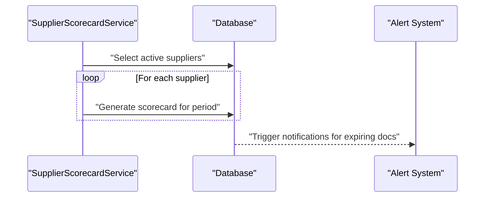

**Diagram sources**
- [SupplierScorecardService.php:289-320](file://app/Services/SupplierScorecardService.php#L289-L320)
- [SupplierDocument.php:53-63](file://app/Models/SupplierDocument.php#L53-L63)

**Section sources**
- [SupplierScorecardService.php:289-320](file://app/Services/SupplierScorecardService.php#L289-L320)
- [SupplierDocument.php:53-63](file://app/Models/SupplierDocument.php#L53-L63)

### Data Security, Audit Trails, and Tenant Isolation
- Tenant scoping: All supplier-related models use tenant scoping to isolate data per tenant.
- Soft deletes: Suppliers and related entities support soft deletion for recoverability.
- Activity auditing: Supplier creation, updates, toggles, and deletions are logged for auditability.
- Secure portal users: Passwords are handled securely; sensitive fields are hidden from serialization.

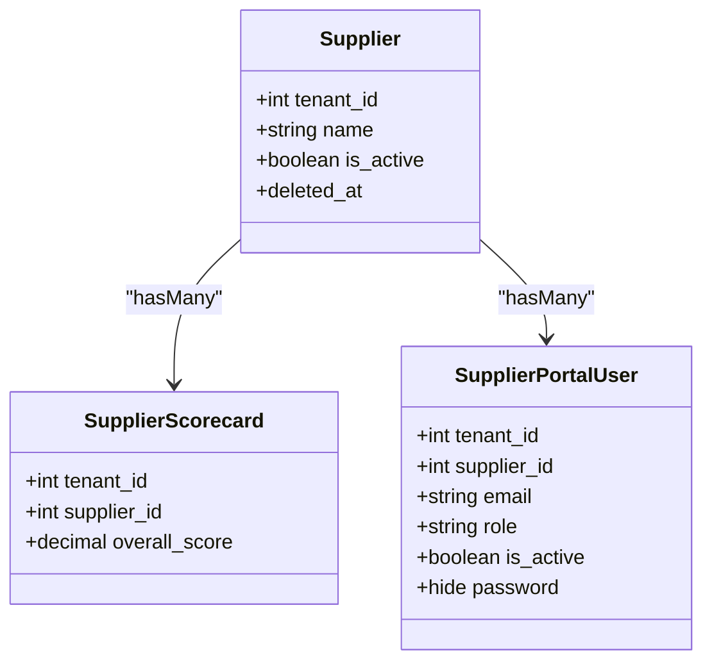

**Diagram sources**
- [Supplier.php:13-51](file://app/Models/Supplier.php#L13-L51)
- [SupplierScorecard.php:12-114](file://app/Models/SupplierScorecard.php#L12-L114)
- [SupplierPortalUser.php:11-45](file://app/Models/SupplierPortalUser.php#L11-L45)

**Section sources**
- [Supplier.php:13-51](file://app/Models/Supplier.php#L13-L51)
- [SupplierScorecard.php:12-114](file://app/Models/SupplierScorecard.php#L12-L114)
- [SupplierPortalUser.php:11-45](file://app/Models/SupplierPortalUser.php#L11-L45)

## Dependency Analysis
Supplier management components exhibit clear separation of concerns:
- Controllers depend on services for business logic.
- Services depend on models for persistence and calculations.
- Views depend on controller-provided data for rendering dashboards and analyses.
- Migrations define schema dependencies among supplier-related tables.

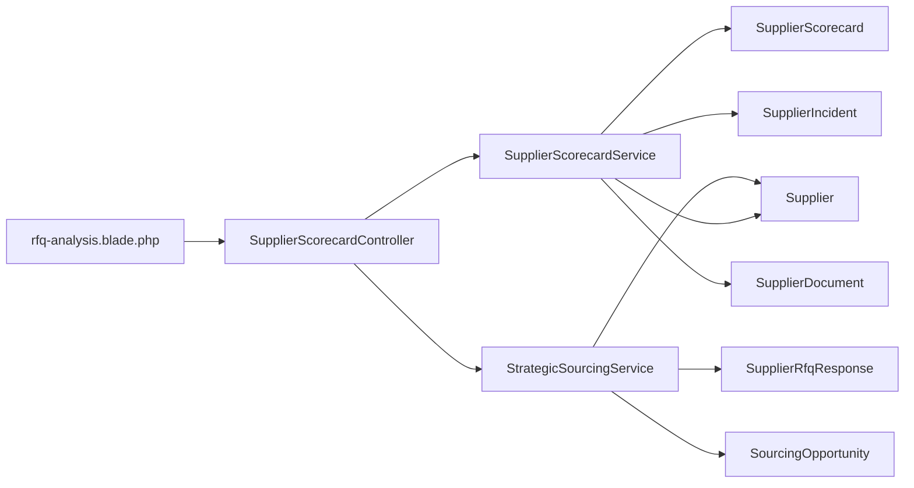

**Diagram sources**
- [SupplierScorecardController.php:11-206](file://app/Http/Controllers/Suppliers/SupplierScorecardController.php#L11-L206)
- [SupplierScorecardService.php:12-321](file://app/Services/SupplierScorecardService.php#L12-L321)
- [StrategicSourcingService.php:185-309](file://app/Services/StrategicSourcingService.php#L185-L309)
- [Supplier.php:13-51](file://app/Models/Supplier.php#L13-L51)
- [SupplierScorecard.php:12-114](file://app/Models/SupplierScorecard.php#L12-L114)
- [SupplierIncident.php:11-70](file://app/Models/SupplierIncident.php#L11-L70)
- [SupplierDocument.php:11-64](file://app/Models/SupplierDocument.php#L11-L64)
- [SupplierRfqResponse.php:11-60](file://app/Models/SupplierRfqResponse.php#L11-L60)
- [SourcingOpportunity.php:11-60](file://app/Models/SourcingOpportunity.php#L11-L60)
- [rfq-analysis.blade.php:126-266](file://resources/views/Suppliers/rfq-analysis.blade.php#L126-L266)

**Section sources**
- [SupplierScorecardController.php:11-206](file://app/Http/Controllers/Suppliers/SupplierScorecardController.php#L11-L206)
- [SupplierScorecardService.php:12-321](file://app/Services/SupplierScorecardService.php#L12-L321)
- [StrategicSourcingService.php:185-309](file://app/Services/StrategicSourcingService.php#L185-L309)

## Performance Considerations
- Indexing: Scorecards and related entities use composite indexes on tenant, supplier, and time-bound fields to accelerate queries.
- Bulk operations: Scorecard generation supports batch processing to avoid repeated scans.
- Aggregation efficiency: Scorecard metrics derive from purchase orders and incidents; ensure appropriate indexing on order dates and incident timestamps.
- Pagination: Controllers paginate lists to limit memory footprint.

[No sources needed since this section provides general guidance]

## Troubleshooting Guide
- Supplier deletion blocked: If a supplier has existing purchase orders, deactivation occurs instead of deletion; verify purchase order associations.
- Scorecard generation failures: Bulk generation catches exceptions and logs errors; check logs for specific supplier failures.
- RFQ analysis errors: Validation ensures presence of RFQ responses; confirm RFQ exists and has submissions.
- Document expiry warnings: Use document helpers to detect expiring/expired items and schedule renewals.

**Section sources**
- [SupplierController.php:113-127](file://app/Http/Controllers/SupplierController.php#L113-L127)
- [SupplierScorecardService.php:289-320](file://app/Services/SupplierScorecardService.php#L289-L320)
- [SupplierScorecardController.php:89-98](file://app/Http/Controllers/Suppliers/SupplierScorecardController.php#L89-L98)
- [SupplierDocument.php:53-63](file://app/Models/SupplierDocument.php#L53-L63)

## Conclusion
The supplier management module provides a robust foundation for onboarding, qualification, evaluation, risk assessment, strategic sourcing, and relationship maintenance. It leverages tenant scoping, soft deletes, and activity auditing for security and auditability, while services and controllers deliver scalable dashboards, automated alerts, and collaborative portals to support continuous supplier development and improvement.

[No sources needed since this section summarizes without analyzing specific files]

## Appendices

### Example: Supplier Scorecard Calculation (Conceptual)
- Quality: Based on defect rate derived from purchase orders during the period.
- Delivery: On-time delivery percentage and average lead time.
- Cost: Savings percentage and total spend.
- Service: Issue resolution rate and response time.
- Weighted overall score: 35% quality, 30% delivery, 20% cost, 15% service.

[No sources needed since this section provides conceptual guidance]

### Example: Automated Supplier Alerts (Conceptual)
- Document expiry threshold: Flag documents expiring within a defined number of days.
- Periodic scorecard generation: Automatically produce monthly/quarterly scorecards for active suppliers.

[No sources needed since this section provides conceptual guidance]

### Example: Strategic Sourcing Decision (Conceptual)
- RFQ responses scored by price competitiveness, lead time, supplier rating, delivery performance, and payment terms.
- Composite score determines recommendation and evaluation methodology transparency.

[No sources needed since this section provides conceptual guidance]