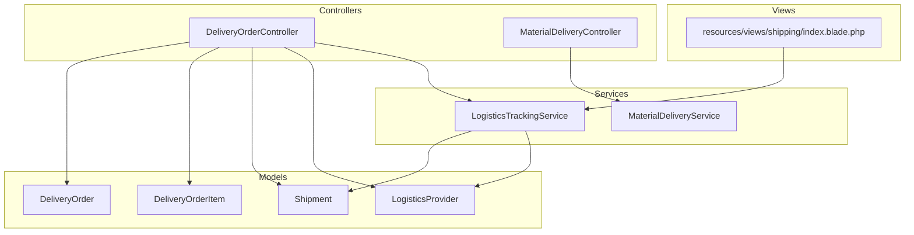
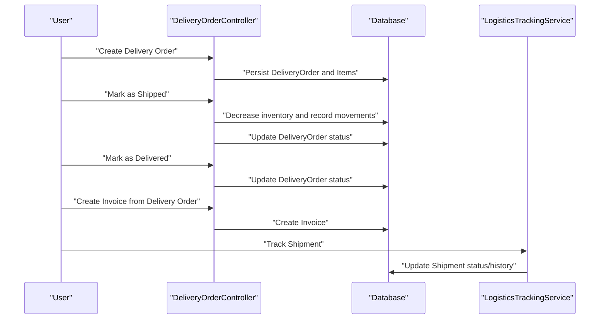
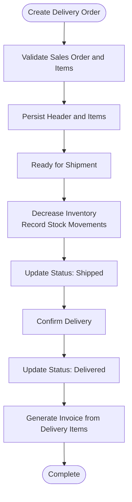
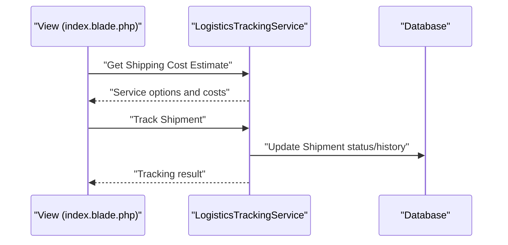
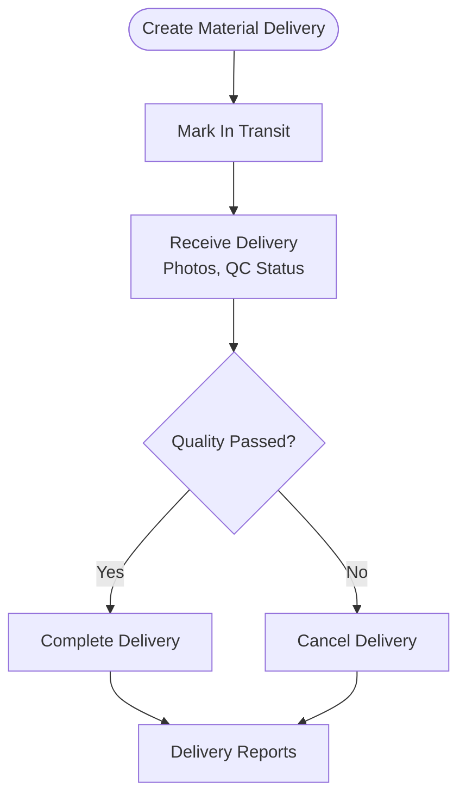
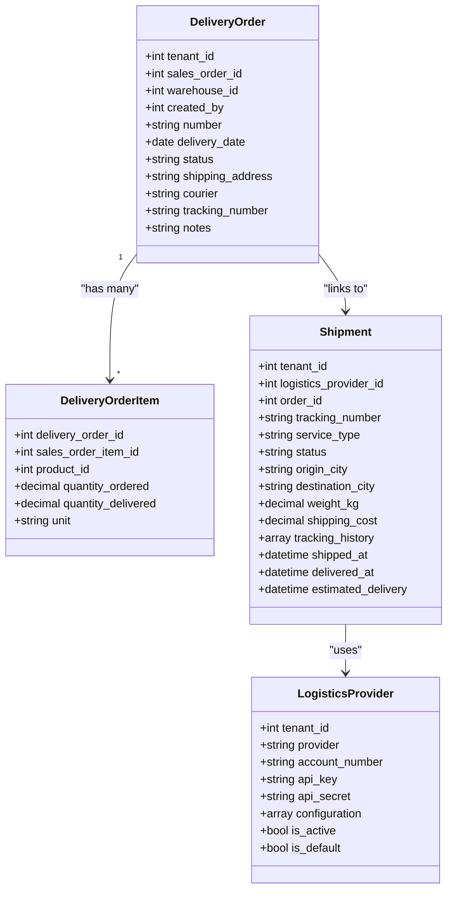
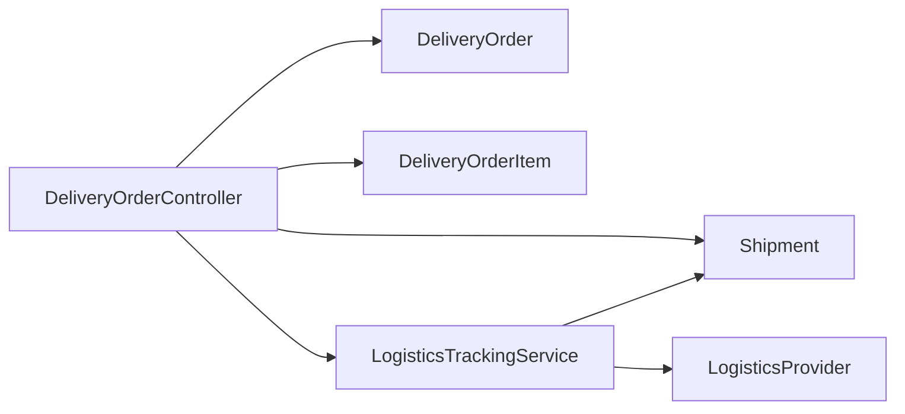

# Delivery Coordination

<cite>
**Referenced Files in This Document**
- [DeliveryOrderController.php](file://app/Http/Controllers/DeliveryOrderController.php)
- [DeliveryOrder.php](file://app/Models/DeliveryOrder.php)
- [DeliveryOrderItem.php](file://app/Models/DeliveryOrderItem.php)
- [Shipment.php](file://app/Models/Shipment.php)
- [LogisticsProvider.php](file://app/Models/LogisticsProvider.php)
- [LogisticsTrackingService.php](file://app/Services/Integrations/LodisticsTrackingService.php)
- [MaterialDeliveryService.php](file://app/Services/MaterialDeliveryService.php)
- [MaterialDeliveryController.php](file://app/Http/Controllers/Construction/MaterialDeliveryController.php)
- [index.blade.php](file://resources/views/shipping/index.blade.php)
</cite>

## Table of Contents
1. [Introduction](#introduction)
2. [Project Structure](#project-structure)
3. [Core Components](#core-components)
4. [Architecture Overview](#architecture-overview)
5. [Detailed Component Analysis](#detailed-component-analysis)
6. [Dependency Analysis](#dependency-analysis)
7. [Performance Considerations](#performance-considerations)
8. [Troubleshooting Guide](#troubleshooting-guide)
9. [Conclusion](#conclusion)
10. [Appendices](#appendices)

## Introduction
This document explains the Delivery Coordination module within the system, focusing on the end-to-end logistics workflow from order fulfillment to delivery confirmation. It covers delivery order creation, inventory allocation, shipment dispatch, carrier integration, real-time tracking, delivery confirmation, invoicing, and exception handling. It also documents warehouse management integration, shipping cost estimation, and practical strategies for carrier selection and customer preferences.

## Project Structure
The delivery coordination capability spans controllers, models, services, and views:
- Controllers orchestrate user actions and coordinate transactions across models and services.
- Models represent domain entities such as delivery orders, items, shipments, and logistics providers.
- Services encapsulate integrations (e.g., carrier tracking) and specialized workflows (e.g., construction material delivery).
- Views provide UI for shipping cost estimation and tracking.

**Diagram sources**
- [DeliveryOrderController.php:1-241](file://app/Http/Controllers/DeliveryOrderController.php#L1-L241)
- [MaterialDeliveryController.php:41-82](file://app/Http/Controllers/Construction/MaterialDeliveryController.php#L41-L82)
- [DeliveryOrder.php:1-52](file://app/Models/DeliveryOrder.php#L1-L52)
- [DeliveryOrderItem.php:1-24](file://app/Models/DeliveryOrderItem.php#L1-L24)
- [Shipment.php:1-49](file://app/Models/Shipment.php#L1-L49)
- [LogisticsProvider.php:1-40](file://app/Models/LogisticsProvider.php#L1-L40)
- [LogisticsTrackingService.php:1-191](file://app/Services/Integrations/LodisticsTrackingService.php#L1-L191)
- [MaterialDeliveryService.php:1-254](file://app/Services/MaterialDeliveryService.php#L1-L254)
- [index.blade.php:20-139](file://resources/views/shipping/index.blade.php#L20-L139)

**Section sources**
- [DeliveryOrderController.php:1-241](file://app/Http/Controllers/DeliveryOrderController.php#L1-L241)
- [DeliveryOrder.php:1-52](file://app/Models/DeliveryOrder.php#L1-L52)
- [DeliveryOrderItem.php:1-24](file://app/Models/DeliveryOrderItem.php#L1-L24)
- [Shipment.php:1-49](file://app/Models/Shipment.php#L1-L49)
- [LogisticsProvider.php:1-40](file://app/Models/LogisticsProvider.php#L1-L40)
- [LogisticsTrackingService.php:1-191](file://app/Services/Integrations/LodisticsTrackingService.php#L1-L191)
- [MaterialDeliveryService.php:1-254](file://app/Services/MaterialDeliveryService.php#L1-L254)
- [MaterialDeliveryController.php:41-82](file://app/Http/Controllers/Construction/MaterialDeliveryController.php#L41-L82)
- [index.blade.php:20-139](file://resources/views/shipping/index.blade.php#L20-L139)

## Core Components
- DeliveryOrder: Encapsulates a delivery note linked to a sales order, warehouse, and items. Supports status transitions and metadata like delivery date, courier, and tracking number.
- DeliveryOrderItem: Links delivered quantities to sales order items and products.
- Shipment: Represents a physical shipment with logistics provider, tracking number, service type, weight, cost, and tracking history.
- LogisticsProvider: Stores carrier credentials and configuration for active providers.
- LogisticsTrackingService: Handles shipment creation, tracking, and shipping cost estimation for supported carriers.
- MaterialDeliveryService: Manages construction material deliveries with quality checks, photos, and reporting.
- DeliveryOrderController: Orchestrates delivery order lifecycle, inventory adjustments, delivery confirmation, and invoice generation.
- MaterialDeliveryController: Provides UI and actions for construction material delivery tracking.
- Shipping UI: Provides client-side shipping rate estimation and tracking lookup.

**Section sources**
- [DeliveryOrder.php:1-52](file://app/Models/DeliveryOrder.php#L1-L52)
- [DeliveryOrderItem.php:1-24](file://app/Models/DeliveryOrderItem.php#L1-L24)
- [Shipment.php:1-49](file://app/Models/Shipment.php#L1-L49)
- [LogisticsProvider.php:1-40](file://app/Models/LogisticsProvider.php#L1-L40)
- [LogisticsTrackingService.php:1-191](file://app/Services/Integrations/LodisticsTrackingService.php#L1-L191)
- [MaterialDeliveryService.php:1-254](file://app/Services/MaterialDeliveryService.php#L1-L254)
- [DeliveryOrderController.php:1-241](file://app/Http/Controllers/DeliveryOrderController.php#L1-L241)
- [MaterialDeliveryController.php:41-82](file://app/Http/Controllers/Construction/MaterialDeliveryController.php#L41-L82)
- [index.blade.php:20-139](file://resources/views/shipping/index.blade.php#L20-L139)

## Architecture Overview
The delivery workflow integrates order fulfillment, inventory management, and logistics tracking:
- Orders originate as Sales Orders and are fulfilled via Delivery Orders.
- Inventory is adjusted upon shipment dispatch.
- Shipments are created and tracked against configured logistics providers.
- Tracking updates are persisted to shipment records.
- Delivery confirmation triggers invoice creation.
- Construction projects use a separate material delivery service with quality checks and reporting.

**Diagram sources**
- [DeliveryOrderController.php:116-212](file://app/Http/Controllers/DeliveryOrderController.php#L116-L212)
- [LogisticsTrackingService.php:64-89](file://app/Services/Integrations/LodisticsTrackingService.php#L64-L89)

## Detailed Component Analysis

### Delivery Order Lifecycle
- Creation: Validates sales order, warehouse, delivery date, shipping address, and items; generates a delivery number and persists header and line items.
- Shipment: Decrements product stock per item, records outbound stock movements, marks delivery order and associated sales order as shipped.
- Delivery Confirmation: Updates delivery order status to delivered.
- Invoice Generation: Creates an invoice from delivered items, computes subtotal, tax, and totals, and sets due date.

**Diagram sources**
- [DeliveryOrderController.php:64-114](file://app/Http/Controllers/DeliveryOrderController.php#L64-L114)
- [DeliveryOrderController.php:116-165](file://app/Http/Controllers/DeliveryOrderController.php#L116-L165)
- [DeliveryOrderController.php:167-212](file://app/Http/Controllers/DeliveryOrderController.php#L167-L212)

**Section sources**
- [DeliveryOrderController.php:64-114](file://app/Http/Controllers/DeliveryOrderController.php#L64-L114)
- [DeliveryOrderController.php:116-165](file://app/Http/Controllers/DeliveryOrderController.php#L116-L165)
- [DeliveryOrderController.php:167-212](file://app/Http/Controllers/DeliveryOrderController.php#L167-L212)

### Shipment Tracking and Cost Estimation
- Tracking: Accepts a tracking number and provider, delegates to provider-specific handlers, updates shipment status and history.
- Cost Estimation: Returns service options and costs for supported carriers based on origin, destination, and weight.
- UI Integration: Frontend view posts to backend endpoints to check rates and track packages.

**Diagram sources**
- [LogisticsTrackingService.php:64-89](file://app/Services/Integrations/LodisticsTrackingService.php#L64-L89)
- [LogisticsTrackingService.php:142-154](file://app/Services/Integrations/LodisticsTrackingService.php#L142-L154)
- [index.blade.php:20-139](file://resources/views/shipping/index.blade.php#L20-L139)

**Section sources**
- [LogisticsTrackingService.php:64-89](file://app/Services/Integrations/LodisticsTrackingService.php#L64-L89)
- [LogisticsTrackingService.php:142-154](file://app/Services/Integrations/LodisticsTrackingService.php#L142-L154)
- [index.blade.php:20-139](file://resources/views/shipping/index.blade.php#L20-L139)

### Construction Material Delivery
- Tracks material deliveries for construction projects with supplier, quantity ordered/delivered, expected/actual dates, vehicle/driver info, photos, and quality checks.
- Provides summaries, delay reports, and shortage analysis.

**Diagram sources**
- [MaterialDeliveryService.php:16-94](file://app/Services/MaterialDeliveryService.php#L16-L94)
- [MaterialDeliveryService.php:99-129](file://app/Services/MaterialDeliveryService.php#L99-L129)
- [MaterialDeliveryService.php:134-208](file://app/Services/MaterialDeliveryService.php#L134-L208)

**Section sources**
- [MaterialDeliveryService.php:16-94](file://app/Services/MaterialDeliveryService.php#L16-L94)
- [MaterialDeliveryService.php:99-129](file://app/Services/MaterialDeliveryService.php#L99-L129)
- [MaterialDeliveryService.php:134-208](file://app/Services/MaterialDeliveryService.php#L134-L208)
- [MaterialDeliveryController.php:41-82](file://app/Http/Controllers/Construction/MaterialDeliveryController.php#L41-L82)

### Data Models Overview

**Diagram sources**
- [DeliveryOrder.php:1-52](file://app/Models/DeliveryOrder.php#L1-L52)
- [DeliveryOrderItem.php:1-24](file://app/Models/DeliveryOrderItem.php#L1-L24)
- [Shipment.php:1-49](file://app/Models/Shipment.php#L1-L49)
- [LogisticsProvider.php:1-40](file://app/Models/LogisticsProvider.php#L1-L40)

**Section sources**
- [DeliveryOrder.php:1-52](file://app/Models/DeliveryOrder.php#L1-L52)
- [DeliveryOrderItem.php:1-24](file://app/Models/DeliveryOrderItem.php#L1-L24)
- [Shipment.php:1-49](file://app/Models/Shipment.php#L1-L49)
- [LogisticsProvider.php:1-40](file://app/Models/LogisticsProvider.php#L1-L40)

## Dependency Analysis
- Controllers depend on models and services to enforce business rules and persist state.
- Services encapsulate external integrations (carriers) and reduce controller complexity.
- Tracking updates are centralized in the tracking service and applied to shipment records.
- Inventory adjustments are performed transactionally during shipment dispatch.

**Diagram sources**
- [DeliveryOrderController.php:1-241](file://app/Http/Controllers/DeliveryOrderController.php#L1-L241)
- [LogisticsTrackingService.php:1-191](file://app/Services/Integrations/LodisticsTrackingService.php#L1-L191)
- [DeliveryOrder.php:1-52](file://app/Models/DeliveryOrder.php#L1-L52)
- [DeliveryOrderItem.php:1-24](file://app/Models/DeliveryOrderItem.php#L1-L24)
- [Shipment.php:1-49](file://app/Models/Shipment.php#L1-L49)
- [LogisticsProvider.php:1-40](file://app/Models/LogisticsProvider.php#L1-L40)

**Section sources**
- [DeliveryOrderController.php:1-241](file://app/Http/Controllers/DeliveryOrderController.php#L1-L241)
- [LogisticsTrackingService.php:1-191](file://app/Services/Integrations/LodisticsTrackingService.php#L1-L191)

## Performance Considerations
- Batch operations: Prefer bulk stock movement and shipment updates to minimize database round trips.
- Indexing: Ensure foreign keys (tenant_id, order_id, tracking_number) are indexed for fast lookups.
- Asynchronous tracking: Offload carrier API calls to queued jobs to avoid blocking requests.
- Pagination: Use pagination for delivery order lists and tracking histories to limit payload sizes.
- Caching: Cache frequently accessed carrier rate estimates for short TTLs to reduce repeated API calls.

## Troubleshooting Guide
- Tracking failures: The tracking service logs errors and returns structured failure responses; inspect logs for provider-specific issues.
- Provider configuration: Ensure the selected carrier is active and configured with valid credentials.
- Inventory discrepancies: Verify stock movements and quantities delivered align with delivery order items.
- UI tracking/rate lookup: Confirm frontend posts to correct endpoints and includes CSRF tokens.

**Section sources**
- [LogisticsTrackingService.php:85-88](file://app/Services/Integrations/LodisticsTrackingService.php#L85-L88)

## Conclusion
The Delivery Coordination module provides a robust workflow from order fulfillment to delivery confirmation, integrated with inventory management and logistics tracking. By centralizing carrier interactions and maintaining accurate shipment records, it supports real-time visibility and operational efficiency. Extending provider integrations, adding route optimization, and incorporating customer preferences will further enhance the system’s capabilities.

## Appendices

### Practical Strategies
- Carrier selection: Use shipping cost estimation to compare services by region and weight; set default provider per warehouse or customer.
- Exception handling: Implement staged delivery confirmations, partial invoicing, and quality gates for construction materials.
- Customer preferences: Allow per-customer shipping instructions, preferred carriers, and delivery windows; surface these in delivery order creation.

### Example Scenarios
- Partial delivery: Create a delivery order for subset of items; generate invoice only for delivered items; update remaining sales order status accordingly.
- Delayed delivery: Use construction material delivery reports to identify delays; escalate to supplier scorecards and adjust future sourcing decisions.
- Real-time tracking: Integrate tracking updates into dashboards; notify customers via notifications or webhooks.