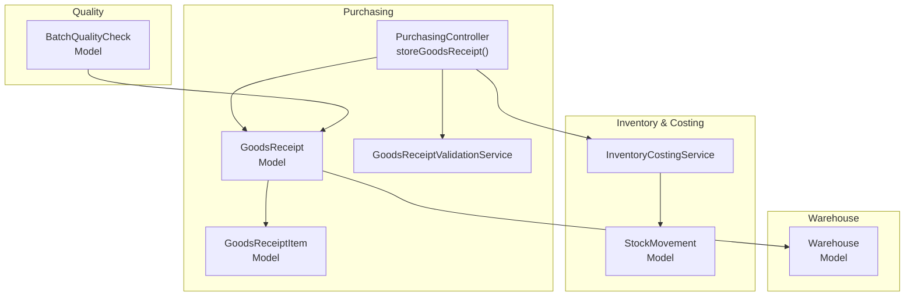
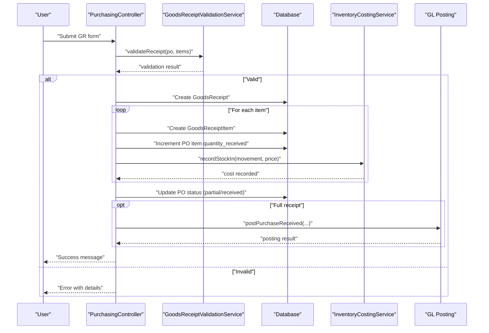
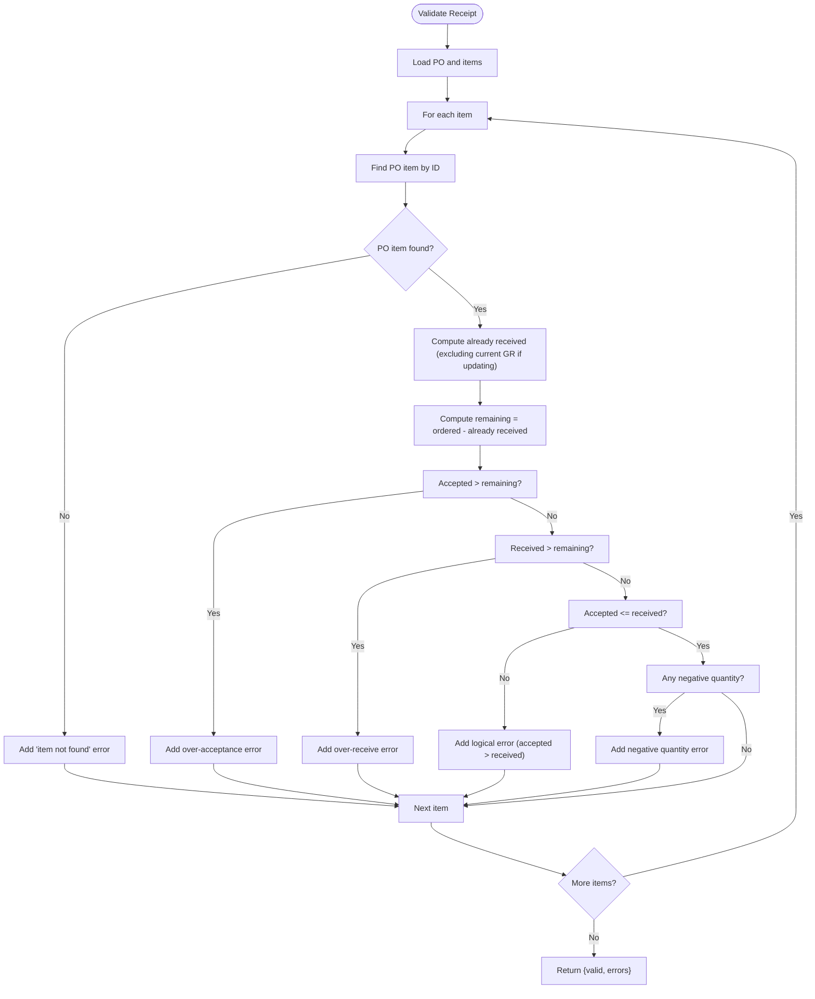
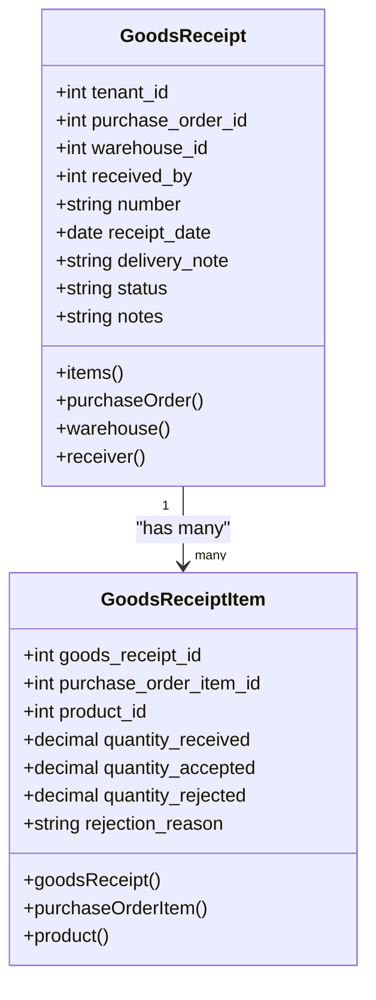
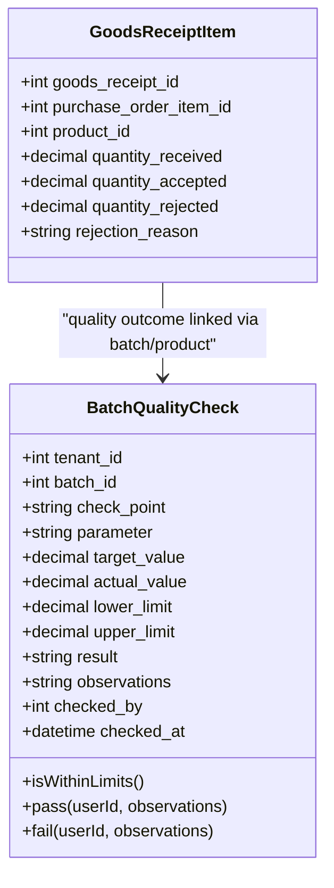
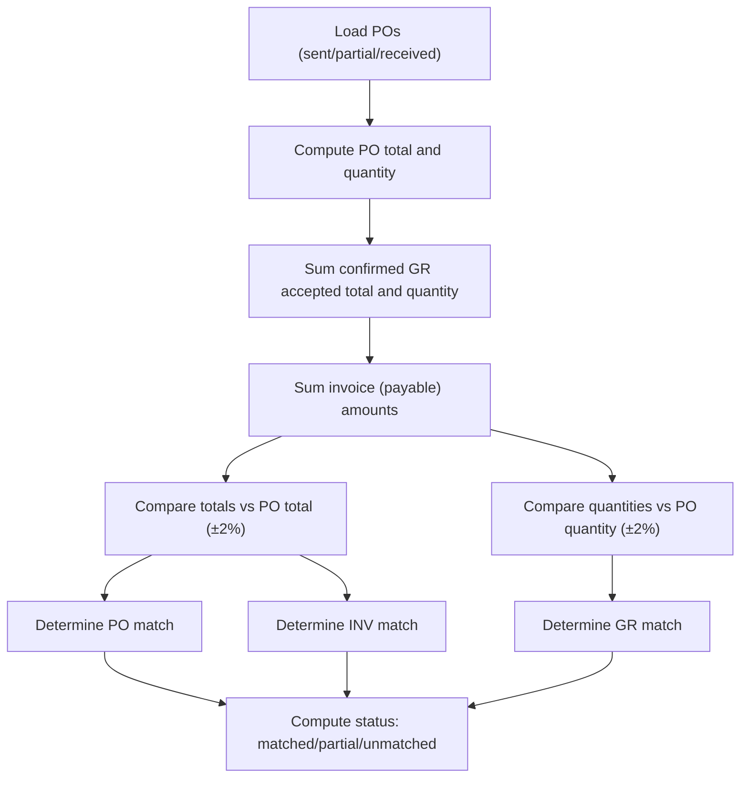
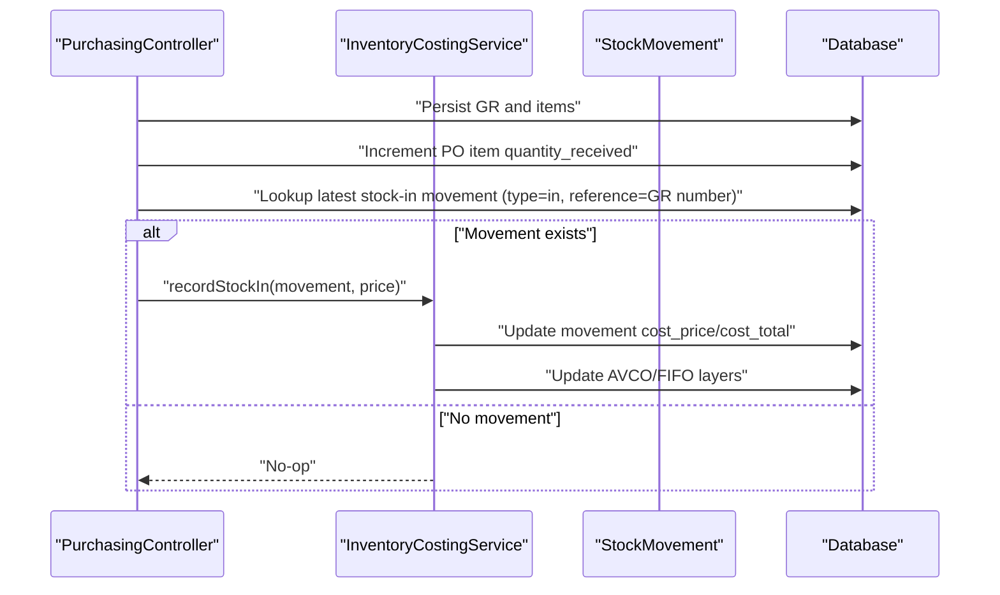
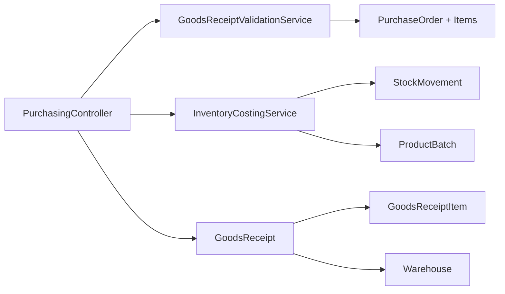

# Goods Receipt Processing

<cite>
**Referenced Files in This Document**
- [GoodsReceipt.php](file://app/Models/GoodsReceipt.php)
- [GoodsReceiptItem.php](file://app/Models/GoodsReceiptItem.php)
- [GoodsReceiptValidationService.php](file://app/Services/GoodsReceiptValidationService.php)
- [PurchasingController.php](file://app/Http/Controllers/PurchasingController.php)
- [InventoryCostingService.php](file://app/Services/InventoryCostingService.php)
- [Warehouse.php](file://app/Models/Warehouse.php)
- [StockMovement.php](file://app/Models/StockMovement.php)
- [BatchQualityCheck.php](file://app/Models/BatchQualityCheck.php)
- [goods-receipts.blade.php](file://resources/views/purchasing/goods-receipts.blade.php)
- [matching.blade.php](file://resources/views/purchasing/matching.blade.php)
</cite>

## Table of Contents
1. [Introduction](#introduction)
2. [Project Structure](#project-structure)
3. [Core Components](#core-components)
4. [Architecture Overview](#architecture-overview)
5. [Detailed Component Analysis](#detailed-component-analysis)
6. [Dependency Analysis](#dependency-analysis)
7. [Performance Considerations](#performance-considerations)
8. [Troubleshooting Guide](#troubleshooting-guide)
9. [Conclusion](#conclusion)
10. [Appendices](#appendices)

## Introduction
This document explains the end-to-end goods receipt (GR) processing and validation workflows in the system. It covers creation of goods receipts, item verification, quantity confirmation, quality inspection and rejection handling, receipt matching against purchase orders, invoice matching, and three-way matching. It also documents automated validation, exception handling, discrepancy resolution, integration with warehouse management systems, inventory updates, and stock valuation. Practical examples include receipt templates, inspection checklists, and quality assurance procedures.

## Project Structure
The GR process spans model definitions, a dedicated validation service, a purchasing controller action, inventory costing integration, and supporting UI templates for GR creation and 3-way matching.

**Diagram sources**
- [PurchasingController.php:696-804](file://app/Http/Controllers/PurchasingController.php#L696-L804)
- [GoodsReceipt.php:11-25](file://app/Models/GoodsReceipt.php#L11-L25)
- [GoodsReceiptItem.php:8-24](file://app/Models/GoodsReceiptItem.php#L8-L24)
- [GoodsReceiptValidationService.php:21-112](file://app/Services/GoodsReceiptValidationService.php#L21-L112)
- [InventoryCostingService.php:23-98](file://app/Services/InventoryCostingService.php#L23-L98)
- [StockMovement.php](file://app/Models/StockMovement.php)
- [Warehouse.php:12-42](file://app/Models/Warehouse.php#L12-L42)
- [BatchQualityCheck.php:10-52](file://app/Models/BatchQualityCheck.php#L10-L52)

**Section sources**
- [PurchasingController.php:696-804](file://app/Http/Controllers/PurchasingController.php#L696-L804)
- [GoodsReceipt.php:11-25](file://app/Models/GoodsReceipt.php#L11-L25)
- [GoodsReceiptItem.php:8-24](file://app/Models/GoodsReceiptItem.php#L8-L24)
- [GoodsReceiptValidationService.php:21-112](file://app/Services/GoodsReceiptValidationService.php#L21-L112)
- [InventoryCostingService.php:23-98](file://app/Services/InventoryCostingService.php#L23-L98)
- [Warehouse.php:12-42](file://app/Models/Warehouse.php#L12-L42)
- [BatchQualityCheck.php:10-52](file://app/Models/BatchQualityCheck.php#L10-L52)

## Core Components
- GoodsReceipt: Header-level entity capturing receipt metadata, PO linkage, warehouse, and status.
- GoodsReceiptItem: Line items recording received, accepted, rejected quantities and reasons.
- GoodsReceiptValidationService: Validates receipt quantities against PO, prevents over-acceptance, supports auto-correction and summary computation.
- PurchasingController.storeGoodsReceipt: Orchestrates validation, persistence, PO status updates, GL posting, and activity logging.
- InventoryCostingService: Integrates with stock movements to record cost-in for AVCO/FIFO/simple methods.
- Warehouse: Links receipts to warehouse locations and exposes stock movement relations.
- BatchQualityCheck: Supports quality checks aligned to batches and GR items.

**Section sources**
- [GoodsReceipt.php:11-25](file://app/Models/GoodsReceipt.php#L11-L25)
- [GoodsReceiptItem.php:8-24](file://app/Models/GoodsReceiptItem.php#L8-L24)
- [GoodsReceiptValidationService.php:21-112](file://app/Services/GoodsReceiptValidationService.php#L21-L112)
- [PurchasingController.php:696-804](file://app/Http/Controllers/PurchasingController.php#L696-L804)
- [InventoryCostingService.php:23-98](file://app/Services/InventoryCostingService.php#L23-L98)
- [Warehouse.php:12-42](file://app/Models/Warehouse.php#L12-L42)
- [BatchQualityCheck.php:10-52](file://app/Models/BatchQualityCheck.php#L10-L52)

## Architecture Overview
The GR workflow integrates validation, persistence, inventory updates, and financial posting. The controller validates incoming items against the PO, persists the receipt and items, updates PO item received quantities, records stock movements with costs, posts GL entries upon full receipt, and logs activities.

**Diagram sources**
- [PurchasingController.php:696-804](file://app/Http/Controllers/PurchasingController.php#L696-L804)
- [GoodsReceiptValidationService.php:30-112](file://app/Services/GoodsReceiptValidationService.php#L30-L112)
- [InventoryCostingService.php:31-54](file://app/Services/InventoryCostingService.php#L31-L54)

## Detailed Component Analysis

### Goods Receipt Creation and Validation
- Validation rules enforce:
  - Items belong to the selected PO.
  - Accepted quantity does not exceed remaining PO quantity.
  - Received quantity does not exceed remaining PO quantity.
  - Accepted quantity does not exceed received quantity.
  - Quantities are non-negative.
- Auto-correction mode can cap received and accepted quantities to remaining PO quantity and warn about corrections.
- Summary computation provides per-item and totals for ordered, received, remaining, and completion percentage.

**Diagram sources**
- [GoodsReceiptValidationService.php:30-112](file://app/Services/GoodsReceiptValidationService.php#L30-L112)

**Section sources**
- [GoodsReceiptValidationService.php:30-112](file://app/Services/GoodsReceiptValidationService.php#L30-L112)
- [PurchasingController.php:696-728](file://app/Http/Controllers/PurchasingController.php#L696-L728)

### Item Verification and Quantity Confirmation
- The controller validates item-level fields and enforces numeric bounds and non-negativity.
- On successful validation, items are persisted with received, accepted, and rejected quantities, plus optional rejection reason.
- PO item received quantities are incremented by accepted amounts.

**Diagram sources**
- [GoodsReceipt.php:11-25](file://app/Models/GoodsReceipt.php#L11-L25)
- [GoodsReceiptItem.php:8-24](file://app/Models/GoodsReceiptItem.php#L8-L24)

**Section sources**
- [PurchasingController.php:696-752](file://app/Http/Controllers/PurchasingController.php#L696-L752)
- [GoodsReceipt.php:11-25](file://app/Models/GoodsReceipt.php#L11-L25)
- [GoodsReceiptItem.php:8-24](file://app/Models/GoodsReceiptItem.php#L8-L24)

### Quality Inspection, Damage Reporting, and Rejection Handling
- Rejected quantities and reasons are captured per item during receipt creation.
- Batch-level quality checks support pass/fail outcomes, inspector attribution, timestamps, and tolerance comparisons.
- Integration with GR items enables traceability from receipt to quality outcomes.

**Diagram sources**
- [BatchQualityCheck.php:10-52](file://app/Models/BatchQualityCheck.php#L10-L52)
- [GoodsReceiptItem.php:8-24](file://app/Models/GoodsReceiptItem.php#L8-L24)

**Section sources**
- [PurchasingController.php:704-711](file://app/Http/Controllers/PurchasingController.php#L704-L711)
- [BatchQualityCheck.php:10-52](file://app/Models/BatchQualityCheck.php#L10-L52)

### Receipt Matching Against Purchase Orders and Three-Way Matching
- The matching view computes totals and quantities for PO, GR, and invoices, applying a ±2% tolerance for totals and quantities.
- Status classification: matched, partial, unmatched.
- The controller aggregates confirmed GR accepted quantities and invoice amounts to compare against PO totals and quantities.

**Diagram sources**
- [PurchasingController.php:808-853](file://app/Http/Controllers/PurchasingController.php#L808-L853)

**Section sources**
- [PurchasingController.php:808-853](file://app/Http/Controllers/PurchasingController.php#L808-L853)
- [matching.blade.php:1-25](file://resources/views/purchasing/matching.blade.php#L1-L25)

### Automated Receipt Validation and Exception Handling
- Validation returns structured errors with item indices, product names, attempted values, and remaining quantities.
- Auto-correction adjusts received and accepted quantities to remaining PO quantity and warns about changes.
- On validation failure, the controller returns back with aggregated error messages.

**Section sources**
- [GoodsReceiptValidationService.php:206-270](file://app/Services/GoodsReceiptValidationService.php#L206-L270)
- [PurchasingController.php:716-728](file://app/Http/Controllers/PurchasingController.php#L716-L728)

### Discrepancy Resolution Procedures
- Use the receipt summary to identify over-acceptance and remaining quantities.
- Apply auto-correction to align quantities with PO terms.
- Investigate discrepancies by reviewing PO item summaries and GR item details.
- For quality issues, leverage BatchQualityCheck outcomes to drive rework or rejection actions.

**Section sources**
- [GoodsReceiptValidationService.php:152-195](file://app/Services/GoodsReceiptValidationService.php#L152-L195)
- [GoodsReceiptValidationService.php:206-270](file://app/Services/GoodsReceiptValidationService.php#L206-L270)

### Integration with Warehouse Management Systems and Inventory Updates
- GoodsReceipt links to a Warehouse, enabling location-aware inventory tracking.
- InventoryCostingService records cost-in for stock movements, supporting simple, AVCO, and FIFO methods.
- For each accepted item, the system locates the latest matching stock-in movement and records cost details.

**Diagram sources**
- [PurchasingController.php:744-774](file://app/Http/Controllers/PurchasingController.php#L744-L774)
- [InventoryCostingService.php:31-54](file://app/Services/InventoryCostingService.php#L31-L54)

**Section sources**
- [Warehouse.php:12-42](file://app/Models/Warehouse.php#L12-L42)
- [PurchasingController.php:744-774](file://app/Http/Controllers/PurchasingController.php#L744-L774)
- [InventoryCostingService.php:23-98](file://app/Services/InventoryCostingService.php#L23-L98)

### Stock Valuation and Costing Methods
- Current unit cost retrieval supports simple (static buy price), AVCO (weighted average), and FIFO (oldest batch).
- Valuation reports aggregate per-product quantities and values by warehouse.
- COGS reporting summarizes cost of goods sold over time.

**Section sources**
- [InventoryCostingService.php:103-169](file://app/Services/InventoryCostingService.php#L103-L169)
- [InventoryCostingService.php:174-202](file://app/Services/InventoryCostingService.php#L174-L202)

### UI Templates and Forms
- Goods Receipts page provides PO selection with dynamic item loading and warehouse selection.
- Matching page displays PO, GR, and invoice totals/quantities and computed statuses.

**Section sources**
- [goods-receipts.blade.php:85-100](file://resources/views/purchasing/goods-receipts.blade.php#L85-L100)
- [matching.blade.php:1-25](file://resources/views/purchasing/matching.blade.php#L1-L25)

## Dependency Analysis
The GR workflow exhibits clear separation of concerns:
- Controller depends on validation service and inventory costing service.
- Validation service reads PO items and computes remaining quantities.
- Inventory costing service depends on tenant costing method and interacts with stock movements and product batches.
- Models encapsulate relationships and casting for quantities.

**Diagram sources**
- [PurchasingController.php:696-804](file://app/Http/Controllers/PurchasingController.php#L696-L804)
- [GoodsReceiptValidationService.php:21-112](file://app/Services/GoodsReceiptValidationService.php#L21-L112)
- [InventoryCostingService.php:23-98](file://app/Services/InventoryCostingService.php#L23-L98)
- [GoodsReceipt.php:11-25](file://app/Models/GoodsReceipt.php#L11-L25)
- [GoodsReceiptItem.php:8-24](file://app/Models/GoodsReceiptItem.php#L8-L24)
- [Warehouse.php:12-42](file://app/Models/Warehouse.php#L12-L42)

**Section sources**
- [PurchasingController.php:696-804](file://app/Http/Controllers/PurchasingController.php#L696-L804)
- [GoodsReceiptValidationService.php:21-112](file://app/Services/GoodsReceiptValidationService.php#L21-L112)
- [InventoryCostingService.php:23-98](file://app/Services/InventoryCostingService.php#L23-L98)

## Performance Considerations
- Validation loads PO items once per request and iterates items; keep item lists concise.
- Auto-correction performs per-item calculations; consider batching UI updates to reduce repeated validations.
- Inventory costing updates are conditional on movement existence; ensure movements are created consistently for accepted quantities.
- Matching computations aggregate across POs; paginate and filter effectively to limit result sets.

## Troubleshooting Guide
Common issues and resolutions:
- Over-acceptance detected: Reduce accepted quantity to remaining PO quantity; use auto-correction warnings to guide adjustments.
- Received exceeds remaining: Adjust received down to remaining; ensure PO item quantities are correct.
- Accepted exceeds received: Lower accepted to match received; logical consistency is enforced.
- Negative quantities: Correct inputs to be non-negative.
- Validation failures: Review aggregated error messages indicating product names, ordered, already received, remaining, and attempted values.
- Full receipt GL posting failures: Address warnings returned by GL posting service; reconcile postings before proceeding.

**Section sources**
- [GoodsReceiptValidationService.php:56-105](file://app/Services/GoodsReceiptValidationService.php#L56-L105)
- [PurchasingController.php:716-728](file://app/Http/Controllers/PurchasingController.php#L716-L728)
- [PurchasingController.php:795-798](file://app/Http/Controllers/PurchasingController.php#L795-L798)

## Conclusion
The system provides robust, automated goods receipt processing with strong validation against purchase orders, integrated inventory costing, and comprehensive quality and matching capabilities. By leveraging validation services, auto-correction, and standardized workflows, organizations can maintain accurate inventory records, enforce procurement policies, and streamline three-way matching processes.

## Appendices

### Examples and Templates

- Receipt Template Fields
  - Purchase order selection
  - Warehouse selection
  - Receipt date
  - Delivery note
  - Notes
  - Items: purchase order item ID, product ID, quantity received, quantity accepted, quantity rejected, rejection reason

- Quality Inspection Checklist
  - Visual inspection for damage
  - Dimension and specification checks
  - Packaging integrity
  - Batch number and expiry verification
  - Accept or reject with observations and inspector signature

- Quality Assurance Procedures
  - Define acceptance criteria per product category
  - Assign inspectors and schedule checks
  - Record outcomes in BatchQualityCheck
  - Link rejected items to GR for traceability

**Section sources**
- [PurchasingController.php:698-711](file://app/Http/Controllers/PurchasingController.php#L698-L711)
- [BatchQualityCheck.php:10-52](file://app/Models/BatchQualityCheck.php#L10-L52)