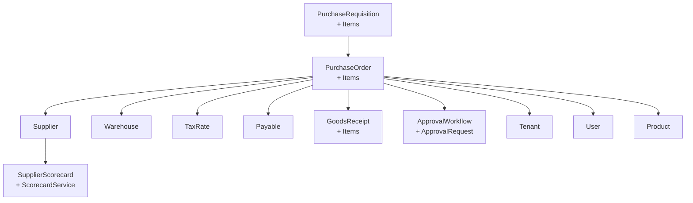
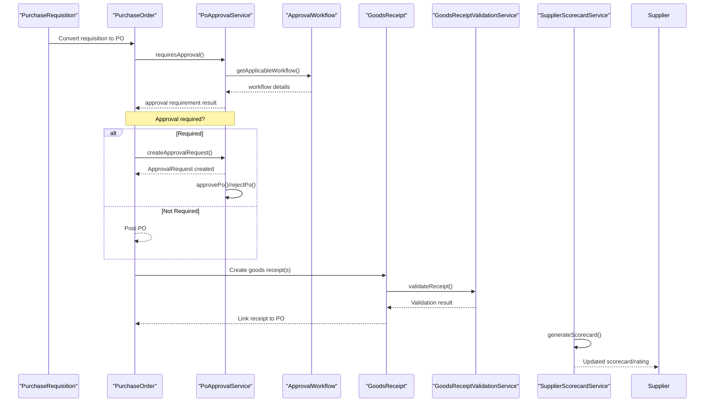
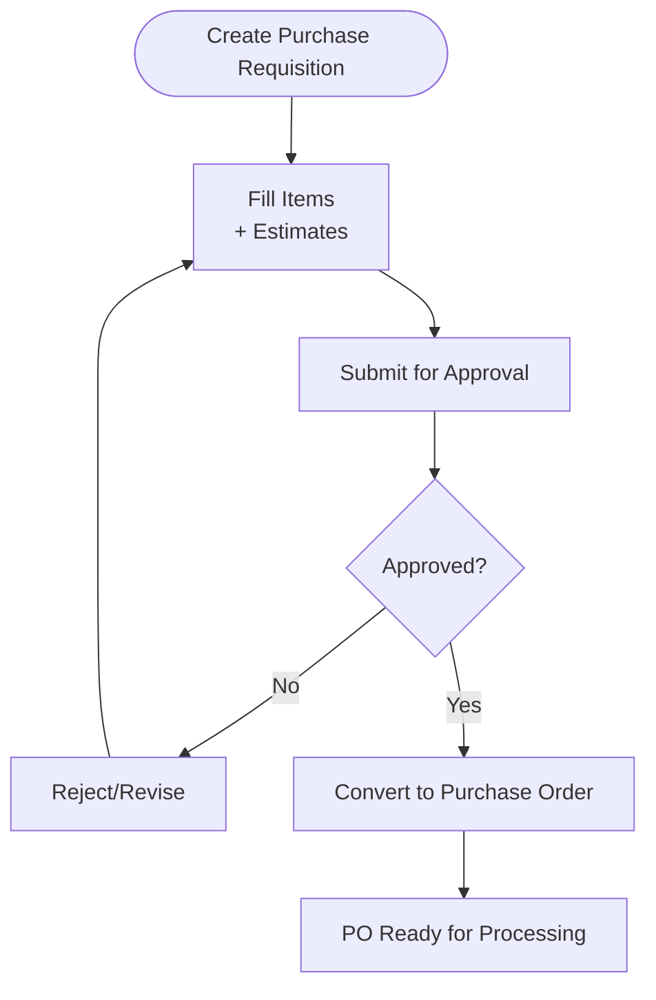
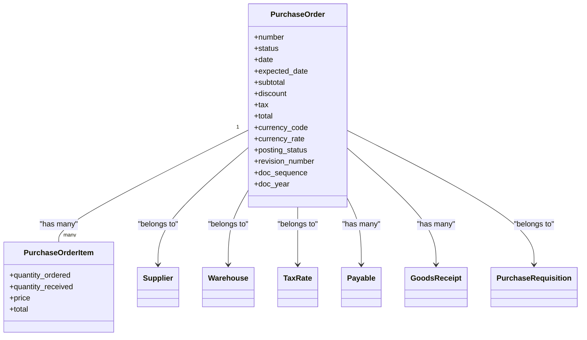
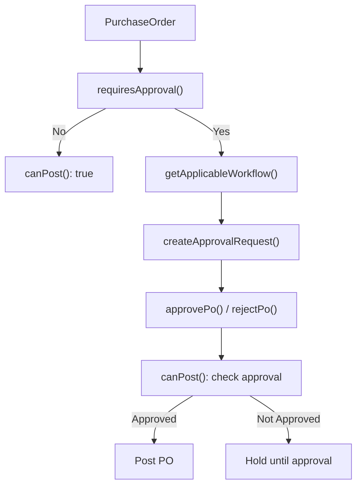
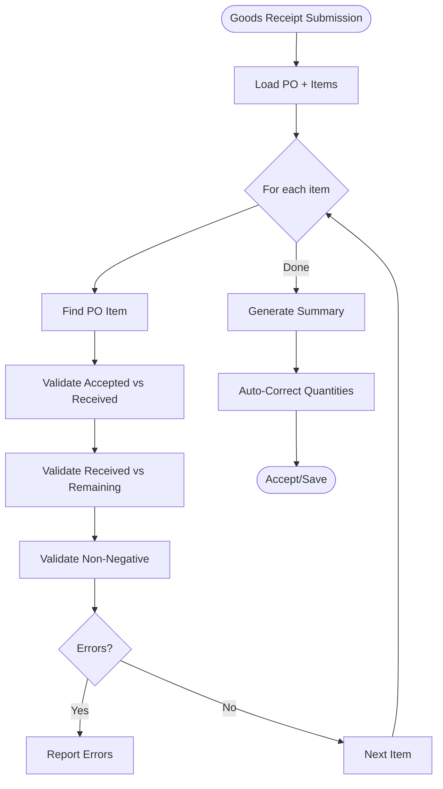
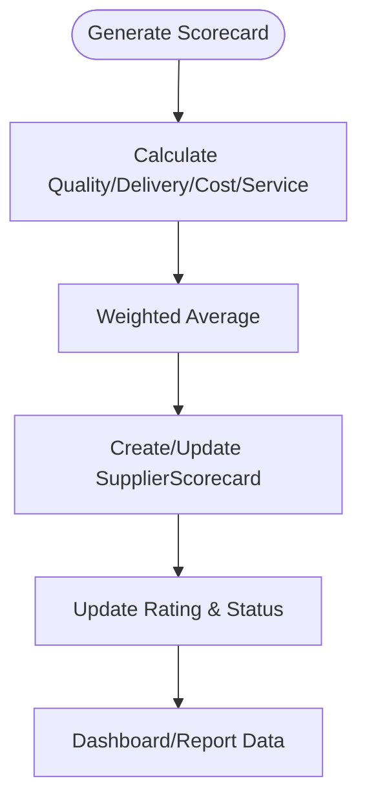
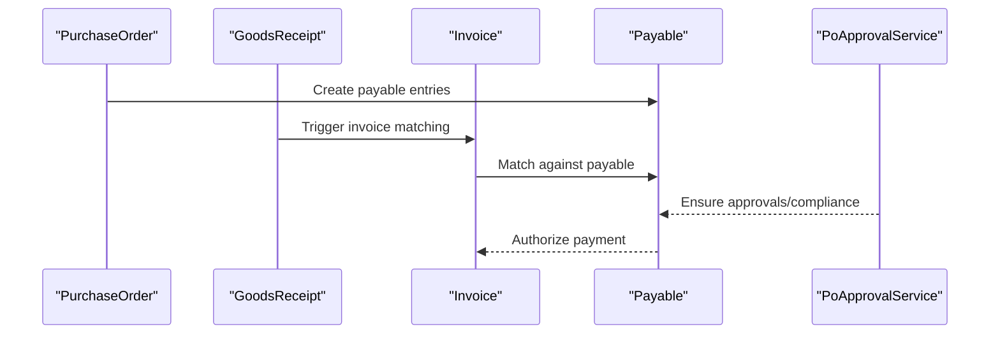
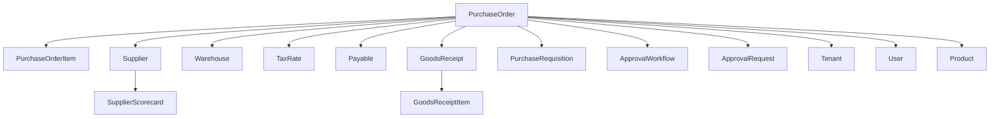

# Purchase Order Management

<cite>
**Referenced Files in This Document**
- [PurchaseOrder.php](file://app/Models/PurchaseOrder.php)
- [PurchaseOrderItem.php](file://app/Models/PurchaseOrderItem.php)
- [PurchaseRequisition.php](file://app/Models/PurchaseRequisition.php)
- [PurchaseRequisitionItem.php](file://app/Models/PurchaseRequisitionItem.php)
- [Supplier.php](file://app/Models/Supplier.php)
- [GoodsReceipt.php](file://app/Models/GoodsReceipt.php)
- [GoodsReceiptItem.php](file://app/Models/GoodsReceiptItem.php)
- [PoApprovalService.php](file://app/Services/PoApprovalService.php)
- [GoodsReceiptValidationService.php](file://app/Services/GoodsReceiptValidationService.php)
- [SupplierScorecard.php](file://app/Models/SupplierScorecard.php)
- [SupplierScorecardService.php](file://app/Services/SupplierScorecardService.php)
- [SupplierIncident.php](file://app/Models/SupplierIncident.php)
- [ApprovalWorkflow.php](file://app/Models/ApprovalWorkflow.php)
- [ApprovalRequest.php](file://app/Models/ApprovalRequest.php)
- [Payable.php](file://app/Models/Payable.php)
- [Warehouse.php](file://app/Models/Warehouse.php)
- [TaxRate.php](file://app/Models/TaxRate.php)
- [Product.php](file://app/Models/Product.php)
- [User.php](file://app/Models/User.php)
- [Tenant.php](file://app/Models/Tenant.php)
</cite>

## Table of Contents
1. [Introduction](#introduction)
2. [Project Structure](#project-structure)
3. [Core Components](#core-components)
4. [Architecture Overview](#architecture-overview)
5. [Detailed Component Analysis](#detailed-component-analysis)
6. [Dependency Analysis](#dependency-analysis)
7. [Performance Considerations](#performance-considerations)
8. [Troubleshooting Guide](#troubleshooting-guide)
9. [Conclusion](#conclusion)
10. [Appendices](#appendices)

## Introduction
This document provides comprehensive documentation for Purchase Order Management within the system. It covers the end-to-end procurement workflow from supplier selection and purchase requisition through purchase order creation, approval workflows, goods receipt processing, invoice matching, and payment authorization. It also documents supplier scorecard integration, supplier relationship management, and integration points with inventory and warehouse systems. Practical examples and best practices are included to guide configuration and operational procedures.

## Project Structure
The purchase order management domain is implemented across models, services, and supporting entities:
- Purchase requisition and purchase order models define the procurement lifecycle and financial details.
- Supplier models and scorecard services support supplier evaluation and relationship management.
- Goods receipt models and validation services enforce accurate and controlled receipt of materials.
- Approval services govern authorization thresholds and audit trails for purchase orders.
- Supporting models represent tenants, users, products, warehouses, and tax rates.

**Diagram sources**
- [PurchaseRequisition.php:12-80](file://app/Models/PurchaseRequisition.php#L12-L80)
- [PurchaseRequisitionItem.php:8-24](file://app/Models/PurchaseRequisitionItem.php#L8-L24)
- [PurchaseOrder.php:13-141](file://app/Models/PurchaseOrder.php#L13-L141)
- [PurchaseOrderItem.php:8-20](file://app/Models/PurchaseOrderItem.php#L8-L20)
- [Supplier.php:13-52](file://app/Models/Supplier.php#L13-L52)
- [Warehouse.php](file://app/Models/Warehouse.php)
- [TaxRate.php](file://app/Models/TaxRate.php)
- [Payable.php](file://app/Models/Payable.php)
- [GoodsReceipt.php:11-26](file://app/Models/GoodsReceipt.php#L11-L26)
- [GoodsReceiptItem.php](file://app/Models/GoodsReceiptItem.php)
- [SupplierScorecard.php](file://app/Models/SupplierScorecard.php)
- [SupplierScorecardService.php:12-322](file://app/Services/SupplierScorecardService.php#L12-L322)
- [PoApprovalService.php:22-361](file://app/Services/PoApprovalService.php#L22-L361)
- [ApprovalWorkflow.php](file://app/Models/ApprovalWorkflow.php)
- [ApprovalRequest.php](file://app/Models/ApprovalRequest.php)
- [Tenant.php](file://app/Models/Tenant.php)
- [User.php](file://app/Models/User.php)
- [Product.php](file://app/Models/Product.php)

**Section sources**
- [PurchaseOrder.php:13-141](file://app/Models/PurchaseOrder.php#L13-L141)
- [Supplier.php:13-52](file://app/Models/Supplier.php#L13-L52)
- [GoodsReceipt.php:11-26](file://app/Models/GoodsReceipt.php#L11-L26)
- [PoApprovalService.php:22-361](file://app/Services/PoApprovalService.php#L22-L361)
- [SupplierScorecardService.php:12-322](file://app/Services/SupplierScorecardService.php#L12-L322)

## Core Components
- Purchase Order: Central entity capturing supplier, warehouse, financials, tax, and posting/cancel status. Links to items, payables, goods receipts, and purchase requisition.
- Purchase Order Item: Line items with ordered and received quantities, unit price, and totals.
- Purchase Requisition: Request for goods/services with requester/approver metadata, status tracking, and conversion to PO.
- Supplier: Vendor profile with contact, banking, and scorecard relationships.
- Goods Receipt: Tracking of delivered items per PO with warehouse and receiver details.
- Approval Workflow: Defines thresholds and approver roles for purchase orders.
- Supplier Scorecard: Aggregated performance metrics and ratings for supplier evaluation.

**Section sources**
- [PurchaseOrder.php:17-49](file://app/Models/PurchaseOrder.php#L17-L49)
- [PurchaseOrderItem.php:10-15](file://app/Models/PurchaseOrderItem.php#L10-L15)
- [PurchaseRequisition.php:16-34](file://app/Models/PurchaseRequisition.php#L16-L34)
- [Supplier.php:18-35](file://app/Models/Supplier.php#L18-L35)
- [GoodsReceipt.php:14-19](file://app/Models/GoodsReceipt.php#L14-L19)
- [PoApprovalService.php:30-47](file://app/Services/PoApprovalService.php#L30-L47)
- [SupplierScorecardService.php:17-54](file://app/Services/SupplierScorecardService.php#L17-L54)

## Architecture Overview
The procurement workflow integrates requisition, PO creation, approval, goods receipt, and payment. Approval enforcement ensures policies are followed, while goods receipt validation prevents over-acceptance. Supplier scorecards inform strategic sourcing decisions.

**Diagram sources**
- [PurchaseRequisition.php:48-51](file://app/Models/PurchaseRequisition.php#L48-L51)
- [PurchaseOrder.php:124-135](file://app/Models/PurchaseOrder.php#L124-L135)
- [PoApprovalService.php:30-47](file://app/Services/PoApprovalService.php#L30-L47)
- [PoApprovalService.php:119-157](file://app/Services/PoApprovalService.php#L119-L157)
- [PoApprovalService.php:167-223](file://app/Services/PoApprovalService.php#L167-L223)
- [PoApprovalService.php:233-274](file://app/Services/PoApprovalService.php#L233-L274)
- [PoApprovalService.php:282-311](file://app/Services/PoApprovalService.php#L282-L311)
- [GoodsReceipt.php:21-24](file://app/Models/GoodsReceipt.php#L21-L24)
- [GoodsReceiptValidationService.php:30-112](file://app/Services/GoodsReceiptValidationService.php#L30-L112)
- [SupplierScorecardService.php:17-54](file://app/Services/SupplierScorecardService.php#L17-L54)

## Detailed Component Analysis

### Purchase Requisition and Conversion to Purchase Order
- Purpose: Capture departmental needs, requester/approver metadata, and estimated costs; convert to PO upon approval.
- Key attributes: requester, approver, required date, purpose, status, estimated totals.
- Conversion: Requisition status transitions to “converted” after PO creation; links to PO via foreign key.

**Diagram sources**
- [PurchaseRequisition.php:36-51](file://app/Models/PurchaseRequisition.php#L36-L51)
- [PurchaseRequisitionItem.php:8-24](file://app/Models/PurchaseRequisitionItem.php#L8-L24)

**Section sources**
- [PurchaseRequisition.php:16-34](file://app/Models/PurchaseRequisition.php#L16-L34)
- [PurchaseRequisition.php:57-78](file://app/Models/PurchaseRequisition.php#L57-L78)
- [PurchaseRequisitionItem.php:10-19](file://app/Models/PurchaseRequisitionItem.php#L10-L19)

### Purchase Order Creation and Financials
- Supplier selection: PO links to supplier; supplier scorecards inform selection.
- Product sourcing: PO items reference products and maintain ordered/received quantities.
- Pricing and taxes: PO stores subtotal, discount, tax, total, currency, and tax rate.
- Posting/cancel status: Draft/posted/cancelled states with posting metadata.
- Integration: Links to warehouse, user, tenant, payable, goods receipts, and purchase requisition.

**Diagram sources**
- [PurchaseOrder.php:17-49](file://app/Models/PurchaseOrder.php#L17-L49)
- [PurchaseOrderItem.php:10-15](file://app/Models/PurchaseOrderItem.php#L10-L15)
- [Supplier.php:37-44](file://app/Models/Supplier.php#L37-L44)
- [Warehouse.php](file://app/Models/Warehouse.php)
- [TaxRate.php](file://app/Models/TaxRate.php)
- [Payable.php](file://app/Models/Payable.php)
- [GoodsReceipt.php:21-24](file://app/Models/GoodsReceipt.php#L21-L24)
- [PurchaseRequisition.php:124-127](file://app/Models/PurchaseRequisition.php#L124-L127)

**Section sources**
- [PurchaseOrder.php:67-94](file://app/Models/PurchaseOrder.php#L67-L94)
- [PurchaseOrder.php:96-135](file://app/Models/PurchaseOrder.php#L96-L135)
- [PurchaseOrderItem.php:12-15](file://app/Models/PurchaseOrderItem.php#L12-L15)

### Approval Workflows and Authorization
- Threshold-based approvals: POs exceeding configured amounts require approval requests.
- Role-based authorization: Only designated roles can approve; self-approval is blocked.
- Audit trail: Approval requests capture requester, approver, timestamps, and notes.
- Posting gate: POs can be posted only after approval.

**Diagram sources**
- [PoApprovalService.php:30-47](file://app/Services/PoApprovalService.php#L30-L47)
- [PoApprovalService.php:119-157](file://app/Services/PoApprovalService.php#L119-L157)
- [PoApprovalService.php:167-223](file://app/Services/PoApprovalService.php#L167-L223)
- [PoApprovalService.php:233-274](file://app/Services/PoApprovalService.php#L233-L274)
- [PoApprovalService.php:282-311](file://app/Services/PoApprovalService.php#L282-L311)

**Section sources**
- [PoApprovalService.php:30-47](file://app/Services/PoApprovalService.php#L30-L47)
- [PoApprovalService.php:56-111](file://app/Services/PoApprovalService.php#L56-L111)
- [PoApprovalService.php:167-223](file://app/Services/PoApprovalService.php#L167-L223)
- [PoApprovalService.php:282-311](file://app/Services/PoApprovalService.php#L282-L311)

### Goods Receipt Processing and Validation
- Validation rules prevent over-acceptance and ensure logical consistency:
  - Accepted quantity cannot exceed received quantity.
  - Received quantity cannot exceed remaining PO quantity.
  - Quantities must be non-negative.
- Cumulative tracking: Already received quantities across multiple goods receipts are considered.
- Auto-correction: Overages are corrected to remaining quantities with warnings.
- Completion detection: Determines if PO is fully received.

**Diagram sources**
- [GoodsReceiptValidationService.php:30-112](file://app/Services/GoodsReceiptValidationService.php#L30-L112)
- [GoodsReceiptValidationService.php:123-144](file://app/Services/GoodsReceiptValidationService.php#L123-L144)
- [GoodsReceiptValidationService.php:152-195](file://app/Services/GoodsReceiptValidationService.php#L152-L195)
- [GoodsReceiptValidationService.php:206-270](file://app/Services/GoodsReceiptValidationService.php#L206-L270)
- [GoodsReceiptValidationService.php:278-290](file://app/Services/GoodsReceiptValidationService.php#L278-L290)

**Section sources**
- [GoodsReceiptValidationService.php:30-112](file://app/Services/GoodsReceiptValidationService.php#L30-L112)
- [GoodsReceiptValidationService.php:123-144](file://app/Services/GoodsReceiptValidationService.php#L123-L144)
- [GoodsReceiptValidationService.php:152-195](file://app/Services/GoodsReceiptValidationService.php#L152-L195)
- [GoodsReceiptValidationService.php:206-270](file://app/Services/GoodsReceiptValidationService.php#L206-L270)
- [GoodsReceiptValidationService.php:278-290](file://app/Services/GoodsReceiptValidationService.php#L278-L290)

### Supplier Scorecard Integration and Relationship Management
- Metrics calculation: Quality (defect rate), delivery (on-time %, lead time), cost (savings %, spend), service (resolution rate).
- Weighted scoring: Overall score derived from weighted categories.
- Rating and status updates: Scorecards updated and rated accordingly.
- Dashboard and reporting: Periodic dashboards, category breakdowns, and trend analysis.

**Diagram sources**
- [SupplierScorecardService.php:17-54](file://app/Services/SupplierScorecardService.php#L17-L54)
- [SupplierScorecardService.php:59-79](file://app/Services/SupplierScorecardService.php#L59-L79)
- [SupplierScorecardService.php:84-120](file://app/Services/SupplierScorecardService.php#L84-L120)
- [SupplierScorecardService.php:125-148](file://app/Services/SupplierScorecardService.php#L125-L148)
- [SupplierScorecardService.php:153-177](file://app/Services/SupplierScorecardService.php#L153-L177)
- [SupplierScorecardService.php:182-234](file://app/Services/SupplierScorecardService.php#L182-L234)
- [SupplierScorecardService.php:239-285](file://app/Services/SupplierScorecardService.php#L239-L285)
- [SupplierScorecardService.php:289-320](file://app/Services/SupplierScorecardService.php#L289-L320)

**Section sources**
- [SupplierScorecardService.php:17-54](file://app/Services/SupplierScorecardService.php#L17-L54)
- [SupplierScorecardService.php:59-79](file://app/Services/SupplierScorecardService.php#L59-L79)
- [SupplierScorecardService.php:84-120](file://app/Services/SupplierScorecardService.php#L84-L120)
- [SupplierScorecardService.php:125-148](file://app/Services/SupplierScorecardService.php#L125-L148)
- [SupplierScorecardService.php:153-177](file://app/Services/SupplierScorecardService.php#L153-L177)
- [SupplierScorecardService.php:182-234](file://app/Services/SupplierScorecardService.php#L182-L234)
- [SupplierScorecardService.php:239-285](file://app/Services/SupplierScorecardService.php#L239-L285)
- [SupplierScorecardService.php:289-320](file://app/Services/SupplierScorecardService.php#L289-L320)

### Invoice Matching and Payment Authorization
- Payables linkage: Purchase orders link to payable records for financial processing.
- Matching: Goods receipt acceptance and PO terms align with invoice matching workflows.
- Authorization: Payments follow approval and payable processing controls.

**Diagram sources**
- [PurchaseOrder.php:120-123](file://app/Models/PurchaseOrder.php#L120-L123)
- [GoodsReceipt.php:21-24](file://app/Models/GoodsReceipt.php#L21-L24)
- [PoApprovalService.php:282-311](file://app/Services/PoApprovalService.php#L282-L311)

**Section sources**
- [PurchaseOrder.php:120-123](file://app/Models/PurchaseOrder.php#L120-L123)
- [PoApprovalService.php:282-311](file://app/Services/PoApprovalService.php#L282-L311)

### Supplier Collaboration Workflows
- Supplier portal users enable collaboration and visibility into RFQs, POs, and deliveries.
- Scorecards and incidents support transparent supplier performance feedback loops.

**Section sources**
- [Supplier.php:46-50](file://app/Models/Supplier.php#L46-L50)
- [SupplierIncident.php](file://app/Models/SupplierIncident.php)

### Procurement Best Practices
- Define clear approval workflows with appropriate thresholds and roles.
- Use supplier scorecards to drive strategic sourcing and continuous improvement.
- Enforce goods receipt validation to prevent over-acceptance and maintain inventory integrity.
- Track PO completion percentages and remaining quantities for timely follow-ups.
- Maintain audit trails for all approvals and payments.

[No sources needed since this section provides general guidance]

## Dependency Analysis
The following diagram highlights key dependencies among purchase order management components:

**Diagram sources**
- [PurchaseOrder.php:116-135](file://app/Models/PurchaseOrder.php#L116-L135)
- [PurchaseOrderItem.php:17-18](file://app/Models/PurchaseOrderItem.php#L17-L18)
- [Supplier.php:41-50](file://app/Models/Supplier.php#L41-L50)
- [Warehouse.php](file://app/Models/Warehouse.php)
- [TaxRate.php](file://app/Models/TaxRate.php)
- [Payable.php](file://app/Models/Payable.php)
- [GoodsReceipt.php:21-24](file://app/Models/GoodsReceipt.php#L21-L24)
- [PurchaseRequisition.php:124-127](file://app/Models/PurchaseRequisition.php#L124-L127)
- [ApprovalWorkflow.php](file://app/Models/ApprovalWorkflow.php)
- [ApprovalRequest.php](file://app/Models/ApprovalRequest.php)
- [SupplierScorecard.php](file://app/Models/SupplierScorecard.php)
- [GoodsReceiptItem.php](file://app/Models/GoodsReceiptItem.php)
- [Tenant.php](file://app/Models/Tenant.php)
- [User.php](file://app/Models/User.php)
- [Product.php](file://app/Models/Product.php)

**Section sources**
- [PurchaseOrder.php:100-135](file://app/Models/PurchaseOrder.php#L100-L135)
- [Supplier.php:37-50](file://app/Models/Supplier.php#L37-L50)

## Performance Considerations
- Indexing: Ensure foreign keys (tenant_id, supplier_id, purchase_order_id) are indexed for fast joins and filtering.
- Aggregation queries: Supplier scorecard calculations involve sums and counts; consider periodic batch generation to reduce real-time load.
- Validation efficiency: Load PO items once per receipt submission and reuse computed remaining quantities.
- Approval workflow lookup: Cache active workflows per tenant to minimize repeated database hits.

[No sources needed since this section provides general guidance]

## Troubleshooting Guide
- Purchase order posting blocked:
  - Verify approval workflow configuration and thresholds.
  - Confirm approval request exists and status is approved.
  - Check for self-approval attempts or unauthorized role usage.
- Goods receipt rejected:
  - Review validation errors for over-acceptance or logical inconsistencies.
  - Confirm cumulative received quantities across multiple receipts.
  - Use auto-correction feature to adjust quantities to remaining PO balance.
- Supplier scorecard anomalies:
  - Validate period boundaries and metric calculations.
  - Confirm supplier activity and incident records.
- Payment authorization delays:
  - Ensure payable entries exist and approvals are recorded.
  - Align invoice matching with receipt acceptance and PO terms.

**Section sources**
- [PoApprovalService.php:282-311](file://app/Services/PoApprovalService.php#L282-L311)
- [PoApprovalService.php:167-223](file://app/Services/PoApprovalService.php#L167-L223)
- [GoodsReceiptValidationService.php:30-112](file://app/Services/GoodsReceiptValidationService.php#L30-L112)
- [GoodsReceiptValidationService.php:206-270](file://app/Services/GoodsReceiptValidationService.php#L206-L270)
- [SupplierScorecardService.php:17-54](file://app/Services/SupplierScorecardService.php#L17-L54)

## Conclusion
The purchase order management system enforces robust approval controls, validates goods receipt quantities, integrates supplier scorecards for relationship management, and connects POs to payable workflows for secure payment processing. By configuring approval workflows, leveraging scorecards, and following validation and audit practices, organizations can streamline procurement, improve supplier performance, and maintain financial and inventory integrity.

[No sources needed since this section summarizes without analyzing specific files]

## Appendices

### Purchase Order Configuration Examples
- Approval workflow configuration:
  - Define minimum and maximum amounts and approver roles per tenant.
  - Ensure only authorized roles can approve POs exceeding thresholds.
- Supplier scorecard periods:
  - Monthly, quarterly, and yearly periods with weighted scoring categories.
- Goods receipt validation:
  - Enable auto-correction to remain within remaining PO quantities.
  - Monitor warnings for over-acceptance scenarios.

**Section sources**
- [PoApprovalService.php:319-331](file://app/Services/PoApprovalService.php#L319-L331)
- [SupplierScorecardService.php:17-54](file://app/Services/SupplierScorecardService.php#L17-L54)
- [GoodsReceiptValidationService.php:206-270](file://app/Services/GoodsReceiptValidationService.php#L206-L270)