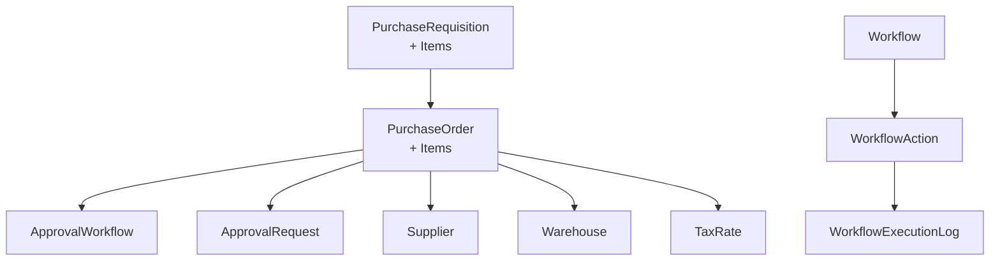
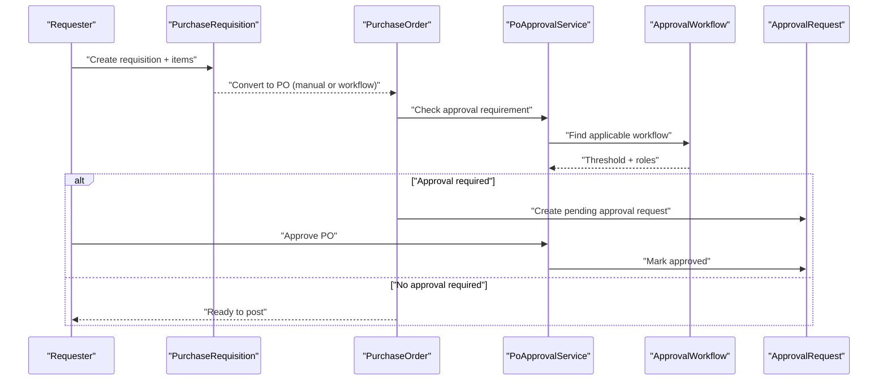
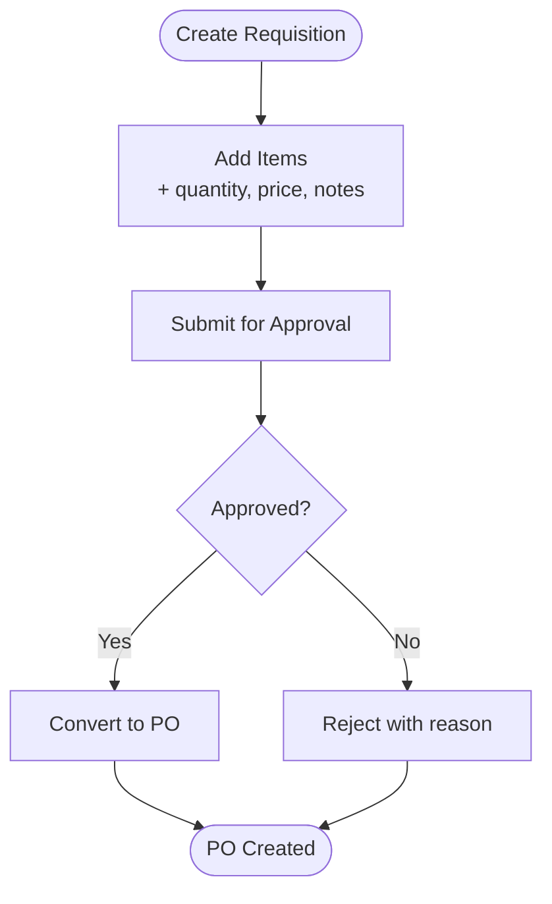
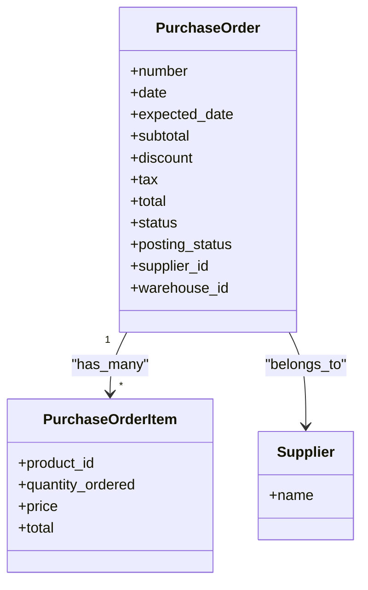
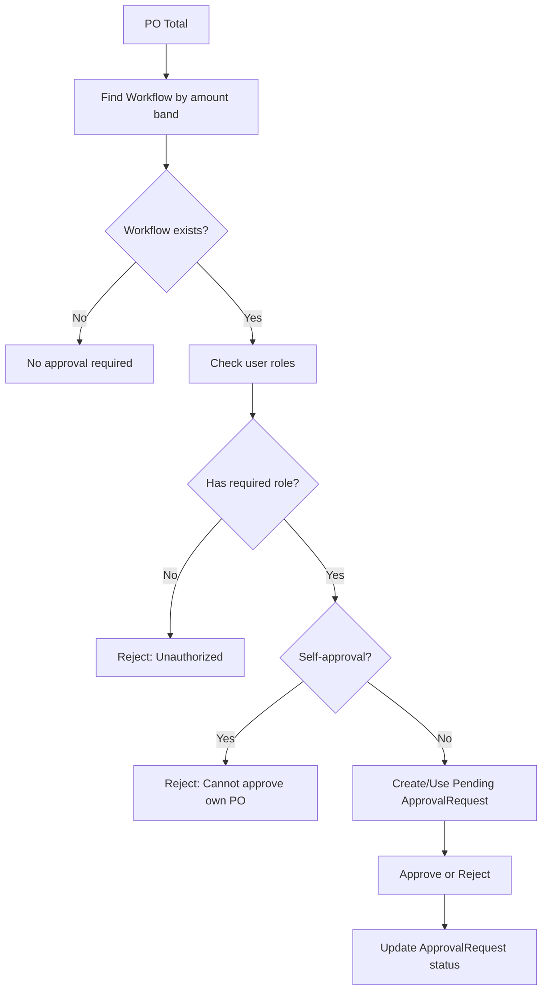
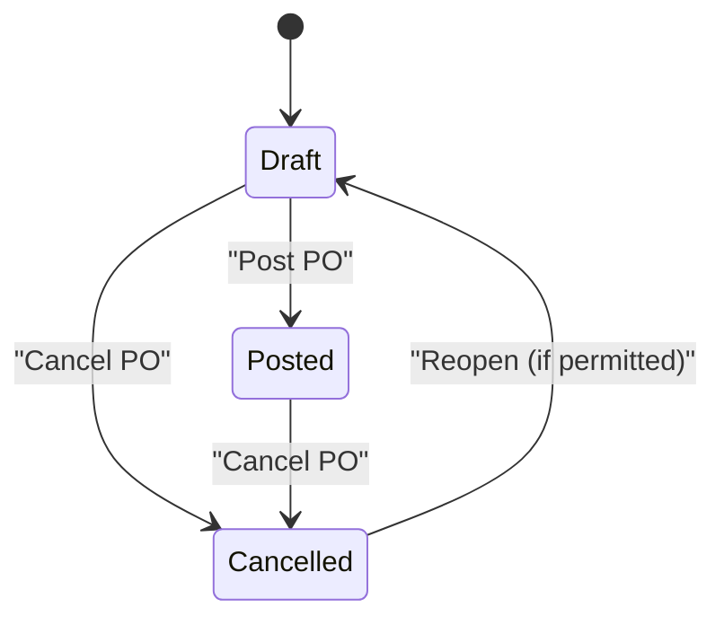
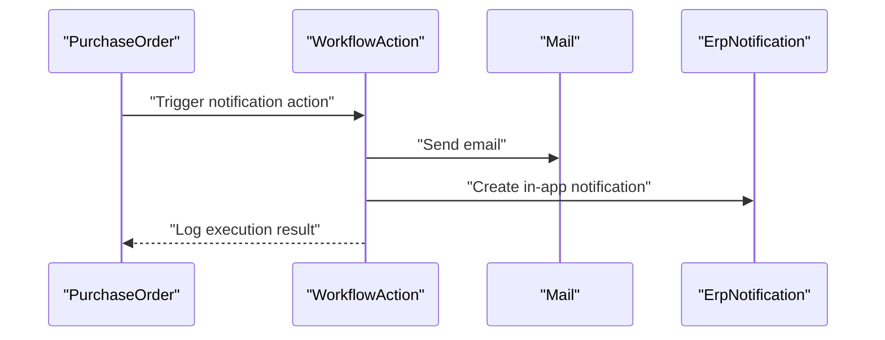
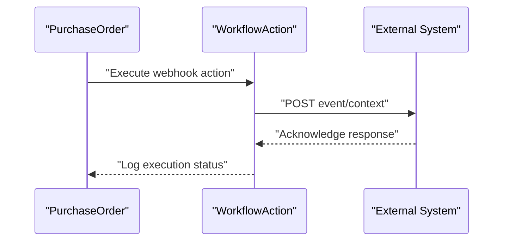
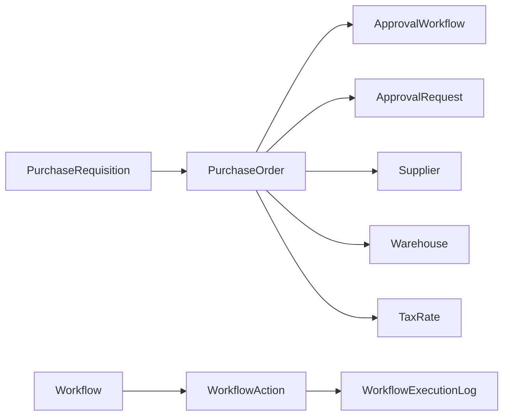

# Purchase Order Workflow

<cite>
**Referenced Files in This Document**
- [PurchaseOrder.php](file://app/Models/PurchaseOrder.php)
- [PurchaseOrderItem.php](file://app/Models/PurchaseOrderItem.php)
- [PurchaseRequisition.php](file://app/Models/PurchaseRequisition.php)
- [PurchaseRequisitionItem.php](file://app/Models/PurchaseRequisitionItem.php)
- [PoApprovalService.php](file://app/Services/PoApprovalService.php)
- [ApprovalWorkflow.php](file://app/Models/ApprovalWorkflow.php)
- [ApprovalRequest.php](file://app/Models/ApprovalRequest.php)
- [Workflow.php](file://app/Models/Workflow.php)
- [WorkflowAction.php](file://app/Models/WorkflowAction.php)
- [WorkflowExecutionLog.php](file://app/Models/WorkflowExecutionLog.php)
</cite>

## Table of Contents
1. [Introduction](#introduction)
2. [Project Structure](#project-structure)
3. [Core Components](#core-components)
4. [Architecture Overview](#architecture-overview)
5. [Detailed Component Analysis](#detailed-component-analysis)
6. [Dependency Analysis](#dependency-analysis)
7. [Performance Considerations](#performance-considerations)
8. [Troubleshooting Guide](#troubleshooting-guide)
9. [Conclusion](#conclusion)
10. [Appendices](#appendices)

## Introduction
This document describes the complete purchase order (PO) workflow in the system, covering requisition handling, supplier selection, PO generation, approvals, modifications, cancellations, status tracking, alerts, and integrations. It explains how purchase requisitions are transformed into purchase orders, how approval workflows are enforced, and how automated workflows can trigger PO creation and notifications. The goal is to provide both operational guidance and technical understanding for stakeholders across the organization.

## Project Structure
The PO workflow spans several model and service layers:
- Requisition models capture departmental needs and convert into POs.
- PO models represent vendor orders with financial totals and lifecycle states.
- Approval workflow models define thresholds and approver roles.
- Approval request records track who approved/rejected and when.
- Workflow engine models support automated triggers and actions (notifications, PO creation, webhooks).

**Diagram sources**
- [PurchaseRequisition.php:12-80](file://app/Models/PurchaseRequisition.php#L12-L80)
- [PurchaseRequisitionItem.php:8-24](file://app/Models/PurchaseRequisitionItem.php#L8-L24)
- [PurchaseOrder.php:13-141](file://app/Models/PurchaseOrder.php#L13-L141)
- [PurchaseOrderItem.php:8-20](file://app/Models/PurchaseOrderItem.php#L8-L20)
- [ApprovalWorkflow.php:9-33](file://app/Models/ApprovalWorkflow.php#L9-L33)
- [ApprovalRequest.php:9-25](file://app/Models/ApprovalRequest.php#L9-L25)
- [Workflow.php:11-108](file://app/Models/Workflow.php#L11-L108)
- [WorkflowAction.php:10-274](file://app/Models/WorkflowAction.php#L10-L274)
- [WorkflowExecutionLog.php:10-58](file://app/Models/WorkflowExecutionLog.php#L10-L58)

**Section sources**
- [PurchaseRequisition.php:12-80](file://app/Models/PurchaseRequisition.php#L12-L80)
- [PurchaseOrder.php:13-141](file://app/Models/PurchaseOrder.php#L13-L141)
- [PoApprovalService.php:22-361](file://app/Services/PoApprovalService.php#L22-L361)
- [Workflow.php:11-108](file://app/Models/Workflow.php#L11-L108)

## Core Components
- Purchase Requisition: Captures requested products, quantities, and cost estimates per department. Tracks status transitions and links to POs and RFQs.
- Purchase Order: Represents vendor orders with totals, taxes, due dates, and posting lifecycle (draft/posted/cancelled). Links to supplier, warehouse, items, and related documents.
- Approval Workflow: Tenant-scoped rules defining min/max thresholds and approver roles for PO amounts.
- Approval Request: Runtime record of approval attempts, statuses, and audit trail.
- Workflow Engine: Tenant-scoped automation with ordered actions, conditions, and execution logs.

Key implementation references:
- Requisition and items: [PurchaseRequisition.php:12-80](file://app/Models/PurchaseRequisition.php#L12-L80), [PurchaseRequisitionItem.php:8-24](file://app/Models/PurchaseRequisitionItem.php#L8-L24)
- PO and items: [PurchaseOrder.php:13-141](file://app/Models/PurchaseOrder.php#L13-L141), [PurchaseOrderItem.php:8-20](file://app/Models/PurchaseOrderItem.php#L8-L20)
- Approval workflow and requests: [ApprovalWorkflow.php:9-33](file://app/Models/ApprovalWorkflow.php#L9-L33), [ApprovalRequest.php:9-25](file://app/Models/ApprovalRequest.php#L9-L25)
- Approval enforcement service: [PoApprovalService.php:22-361](file://app/Services/PoApprovalService.php#L22-L361)
- Workflow engine: [Workflow.php:11-108](file://app/Models/Workflow.php#L11-L108), [WorkflowAction.php:10-274](file://app/Models/WorkflowAction.php#L10-L274), [WorkflowExecutionLog.php:10-58](file://app/Models/WorkflowExecutionLog.php#L10-L58)

**Section sources**
- [PurchaseRequisition.php:12-80](file://app/Models/PurchaseRequisition.php#L12-L80)
- [PurchaseRequisitionItem.php:8-24](file://app/Models/PurchaseRequisitionItem.php#L8-L24)
- [PurchaseOrder.php:13-141](file://app/Models/PurchaseOrder.php#L13-L141)
- [PurchaseOrderItem.php:8-20](file://app/Models/PurchaseOrderItem.php#L8-L20)
- [ApprovalWorkflow.php:9-33](file://app/Models/ApprovalWorkflow.php#L9-L33)
- [ApprovalRequest.php:9-25](file://app/Models/ApprovalRequest.php#L9-L25)
- [PoApprovalService.php:22-361](file://app/Services/PoApprovalService.php#L22-L361)
- [Workflow.php:11-108](file://app/Models/Workflow.php#L11-L108)
- [WorkflowAction.php:10-274](file://app/Models/WorkflowAction.php#L10-L274)
- [WorkflowExecutionLog.php:10-58](file://app/Models/WorkflowExecutionLog.php#L10-L58)

## Architecture Overview
The PO workflow integrates requisition-to-order conversion, approval gating, and optional automated actions. The diagram below maps the actual components and their relationships.

**Diagram sources**
- [PurchaseRequisition.php:12-80](file://app/Models/PurchaseRequisition.php#L12-L80)
- [PurchaseOrder.php:13-141](file://app/Models/PurchaseOrder.php#L13-L141)
- [PoApprovalService.php:22-361](file://app/Services/PoApprovalService.php#L22-L361)
- [ApprovalWorkflow.php:9-33](file://app/Models/ApprovalWorkflow.php#L9-L33)
- [ApprovalRequest.php:9-25](file://app/Models/ApprovalRequest.php#L9-L25)

## Detailed Component Analysis

### Purchase Requisition Handling
- Purpose: Capture departmental needs with estimated costs and quantities.
- Status lifecycle: draft → pending → approved → rejected → converted (to PO).
- Relationships: One-to-many with items and POs; links to requester/approver users.
- Typical flow: Requester creates items, approver reviews and approves, then converts to PO.

**Diagram sources**
- [PurchaseRequisition.php:12-80](file://app/Models/PurchaseRequisition.php#L12-L80)
- [PurchaseRequisitionItem.php:8-24](file://app/Models/PurchaseRequisitionItem.php#L8-L24)

**Section sources**
- [PurchaseRequisition.php:12-80](file://app/Models/PurchaseRequisition.php#L12-L80)
- [PurchaseRequisitionItem.php:8-24](file://app/Models/PurchaseRequisitionItem.php#L8-L24)

### Supplier Selection and PO Generation
- Supplier association: PO links to a selected supplier.
- Itemization: PO items carry product, quantity, unit price, and line totals.
- PO totals: subtotal, discount, tax, and total are maintained at header level.
- Numbering and sequences: PO supports numbering metadata for document tracking.

**Diagram sources**
- [PurchaseOrder.php:13-141](file://app/Models/PurchaseOrder.php#L13-L141)
- [PurchaseOrderItem.php:8-20](file://app/Models/PurchaseOrderItem.php#L8-L20)

**Section sources**
- [PurchaseOrder.php:13-141](file://app/Models/PurchaseOrder.php#L13-L141)
- [PurchaseOrderItem.php:8-20](file://app/Models/PurchaseOrderItem.php#L8-L20)

### PO Approval Workflows, Routing Rules, and Authorization
- Threshold-based approval: ApprovalWorkflow defines min/max amount bands and required roles.
- Authorization checks: PoApprovalService validates user roles, prevents self-approval, and enforces single-use approvals.
- Approval request lifecycle: Pending → Approved or Rejected with audit trail.
- Posting gate: PO can only be posted after successful approval.

**Diagram sources**
- [PoApprovalService.php:22-361](file://app/Services/PoApprovalService.php#L22-L361)
- [ApprovalWorkflow.php:9-33](file://app/Models/ApprovalWorkflow.php#L9-L33)
- [ApprovalRequest.php:9-25](file://app/Models/ApprovalRequest.php#L9-L25)

**Section sources**
- [PoApprovalService.php:22-361](file://app/Services/PoApprovalService.php#L22-L361)
- [ApprovalWorkflow.php:9-33](file://app/Models/ApprovalWorkflow.php#L9-L33)
- [ApprovalRequest.php:9-25](file://app/Models/ApprovalRequest.php#L9-L25)

### PO Modification Procedures, Cancellation, and Amendment Tracking
- Draft state: POs can be modified before posting.
- Posting lifecycle: posting_status tracks draft/posted/cancelled with posted_by/posted_at.
- Cancellation: PO supports cancel_reason and cancellation workflow via posting_status.
- Amendments: PO revision_number is tracked for auditability.

**Diagram sources**
- [PurchaseOrder.php:67-94](file://app/Models/PurchaseOrder.php#L67-L94)

**Section sources**
- [PurchaseOrder.php:67-94](file://app/Models/PurchaseOrder.php#L67-L94)

### PO Status Tracking, Alerts, and Workflow Notifications
- Status labels and colors: PO and Requisition expose label/color helpers for UI rendering.
- Approval history: PoApprovalService aggregates approval requests with requester/approver/workflow info.
- Workflow notifications: WorkflowAction supports sending emails, notifications, and webhooks.

**Diagram sources**
- [WorkflowAction.php:150-196](file://app/Models/WorkflowAction.php#L150-L196)
- [WorkflowExecutionLog.php:10-58](file://app/Models/WorkflowExecutionLog.php#L10-L58)

**Section sources**
- [PurchaseRequisition.php:57-78](file://app/Models/PurchaseRequisition.php#L57-L78)
- [PurchaseOrder.php:76-94](file://app/Models/PurchaseOrder.php#L76-L94)
- [PoApprovalService.php:339-359](file://app/Services/PoApprovalService.php#L339-L359)
- [WorkflowAction.php:150-196](file://app/Models/WorkflowAction.php#L150-L196)
- [WorkflowExecutionLog.php:10-58](file://app/Models/WorkflowExecutionLog.php#L10-L58)

### Integration with Supplier Systems, Electronic PO Transmission, and Acknowledgment
- Supplier linkage: POs belong to a supplier; supplier-specific data can be extended via supplier-related models.
- Webhook integration: WorkflowAction supports webhook_call to external systems for PO transmission and acknowledgment.
- Notification channels: Emails and in-app notifications can inform suppliers or internal stakeholders.

**Diagram sources**
- [WorkflowAction.php:245-260](file://app/Models/WorkflowAction.php#L245-L260)
- [WorkflowExecutionLog.php:10-58](file://app/Models/WorkflowExecutionLog.php#L10-L58)

**Section sources**
- [WorkflowAction.php:245-260](file://app/Models/WorkflowAction.php#L245-L260)
- [WorkflowExecutionLog.php:10-58](file://app/Models/WorkflowExecutionLog.php#L10-L58)

### Examples and Configurations
- PO template example: Header fields include number, date, expected_date, totals, notes, payment terms, currency, and tax details. See [PurchaseOrder.php:17-49](file://app/Models/PurchaseOrder.php#L17-L49).
- Approval workflow configuration: Define min/max thresholds and approver roles per tenant. See [ApprovalWorkflow.php:12-22](file://app/Models/ApprovalWorkflow.php#L12-L22).
- Approval scenario: Threshold exceeded → create pending approval request → authorized approver approves → PO can be posted. See [PoApprovalService.php:30-47](file://app/Services/PoApprovalService.php#L30-L47), [PoApprovalService.php:119-157](file://app/Services/PoApprovalService.php#L119-L157), [PoApprovalService.php:167-223](file://app/Services/PoApprovalService.php#L167-L223).

**Section sources**
- [PurchaseOrder.php:17-49](file://app/Models/PurchaseOrder.php#L17-L49)
- [ApprovalWorkflow.php:12-22](file://app/Models/ApprovalWorkflow.php#L12-L22)
- [PoApprovalService.php:30-47](file://app/Services/PoApprovalService.php#L30-L47)
- [PoApprovalService.php:119-157](file://app/Services/PoApprovalService.php#L119-L157)
- [PoApprovalService.php:167-223](file://app/Services/PoApprovalService.php#L167-L223)

## Dependency Analysis
The PO workflow depends on:
- Requisition models for origin data.
- Approval workflow models for policy enforcement.
- Approval request models for runtime audit.
- Workflow engine for automation and notifications.

**Diagram sources**
- [PurchaseRequisition.php:12-80](file://app/Models/PurchaseRequisition.php#L12-L80)
- [PurchaseOrder.php:13-141](file://app/Models/PurchaseOrder.php#L13-L141)
- [ApprovalWorkflow.php:9-33](file://app/Models/ApprovalWorkflow.php#L9-L33)
- [ApprovalRequest.php:9-25](file://app/Models/ApprovalRequest.php#L9-L25)
- [Workflow.php:11-108](file://app/Models/Workflow.php#L11-L108)
- [WorkflowAction.php:10-274](file://app/Models/WorkflowAction.php#L10-L274)
- [WorkflowExecutionLog.php:10-58](file://app/Models/WorkflowExecutionLog.php#L10-L58)

**Section sources**
- [PurchaseRequisition.php:12-80](file://app/Models/PurchaseRequisition.php#L12-L80)
- [PurchaseOrder.php:13-141](file://app/Models/PurchaseOrder.php#L13-L141)
- [PoApprovalService.php:22-361](file://app/Services/PoApprovalService.php#L22-L361)
- [Workflow.php:11-108](file://app/Models/Workflow.php#L11-L108)

## Performance Considerations
- Approval lookup: Workflow queries are bounded by tenant and amount range; ensure indexes on tenant_id, model_type, min_amount, max_amount for scalability.
- Approval history: Aggregation uses eager loading with requester/approver/workflow relations; keep joins efficient.
- Workflow actions: Webhook calls and notifications can be asynchronous; consider job queues for heavy integrations.
- PO posting checks: Single approval existence check per PO minimizes overhead.

## Troubleshooting Guide
- Approval denied: Verify user roles against ApprovalWorkflow approver_roles and ensure requester is not the same as approver.
- No approval workflow found: Confirm ApprovalWorkflow is active and within amount band for the PO total.
- Approval already exists: Check existing pending ApprovalRequest for the PO; only one pending request is allowed.
- Posting blocked: Ensure PO has an approved ApprovalRequest before posting; otherwise, create or approve the request first.
- Workflow action failure: Inspect WorkflowExecutionLog for error messages and action configuration.

**Section sources**
- [PoApprovalService.php:56-111](file://app/Services/PoApprovalService.php#L56-L111)
- [PoApprovalService.php:282-311](file://app/Services/PoApprovalService.php#L282-L311)
- [WorkflowExecutionLog.php:10-58](file://app/Models/WorkflowExecutionLog.php#L10-L58)

## Conclusion
The purchase order workflow combines structured requisition capture, robust approval governance, and flexible automation. By enforcing threshold-based approvals, maintaining clear audit trails, and supporting notifications and integrations, the system ensures compliant procurement while enabling scalable operations.

## Appendices

### Appendix A: PO Lifecycle Summary
- Requisition: draft → pending → approved → converted to PO
- PO: draft → posted → cancelled; revision tracking supported
- Approval: threshold-driven, role-based, self-approval prevented, single-use approvals enforced

**Section sources**
- [PurchaseRequisition.php:57-78](file://app/Models/PurchaseRequisition.php#L57-L78)
- [PurchaseOrder.php:67-94](file://app/Models/PurchaseOrder.php#L67-L94)
- [PoApprovalService.php:30-47](file://app/Services/PoApprovalService.php#L30-L47)