# Supplier Management

<cite>
**Referenced Files in This Document**
- [Supplier.php](file://app/Models/Supplier.php)
- [SupplierScorecard.php](file://app/Models/SupplierScorecard.php)
- [SupplierDocument.php](file://app/Models/SupplierDocument.php)
- [SupplierIncident.php](file://app/Models/SupplierIncident.php)
- [SupplierPortalUser.php](file://app/Models/SupplierPortalUser.php)
- [SupplierRfqResponse.php](file://app/Models/SupplierRfqResponse.php)
- [SupplierController.php](file://app/Http/Controllers/SupplierController.php)
- [SupplierScorecardController.php](file://app/Http/Controllers/Suppliers/SupplierScorecardController.php)
- [SupplierScorecardService.php](file://app/Services/SupplierScorecardService.php)
- [StrategicSourcingService.php](file://app/Services/StrategicSourcingService.php)
- [rfq-analysis.blade.php](file://resources/views/suppliers/rfq-analysis.blade.php)
</cite>

## Table of Contents
1. [Introduction](#introduction)
2. [Project Structure](#project-structure)
3. [Core Components](#core-components)
4. [Architecture Overview](#architecture-overview)
5. [Detailed Component Analysis](#detailed-component-analysis)
6. [Dependency Analysis](#dependency-analysis)
7. [Performance Considerations](#performance-considerations)
8. [Troubleshooting Guide](#troubleshooting-guide)
9. [Conclusion](#conclusion)
10. [Appendices](#appendices)

## Introduction
This document describes the supplier management capabilities implemented in the system, focusing on supplier registration and profile management, supplier categorization and evaluation via scorecards, performance metrics, strategic sourcing and RFQ evaluation, supplier onboarding workflows, due diligence and compliance verification, supplier relationship management, communication tools, contract and portal integration, risk assessment, and collaboration features. It also outlines supplier scoring algorithms, rating systems, and improvement initiatives.

## Project Structure
Supplier management spans models, controllers, services, and views:
- Models define supplier data, documents, incidents, scorecards, RFQ responses, and portal users.
- Controllers handle supplier CRUD, scorecard dashboards, sourcing dashboards, and RFQ analysis.
- Services encapsulate business logic for scorecard generation, sourcing analytics, and supplier comparisons.
- Views present dashboards, scorecard details, and RFQ evaluation results.

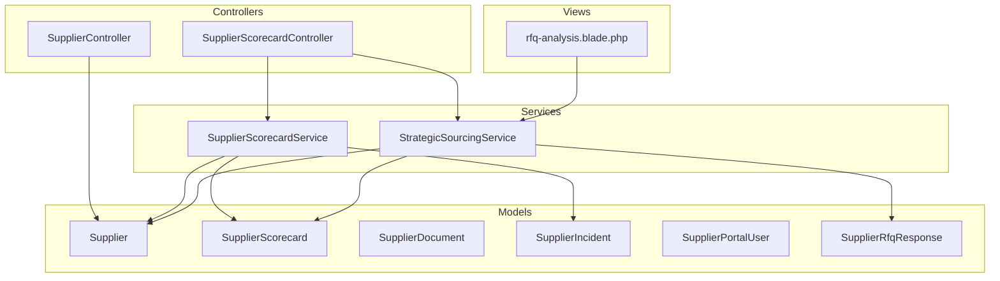

**Diagram sources**
- [Supplier.php:13-51](file://app/Models/Supplier.php#L13-L51)
- [SupplierScorecard.php:12-114](file://app/Models/SupplierScorecard.php#L12-L114)
- [SupplierDocument.php:11-64](file://app/Models/SupplierDocument.php#L11-L64)
- [SupplierIncident.php:11-70](file://app/Models/SupplierIncident.php#L11-L70)
- [SupplierPortalUser.php:11-45](file://app/Models/SupplierPortalUser.php#L11-L45)
- [SupplierRfqResponse.php:11-60](file://app/Models/SupplierRfqResponse.php#L11-L60)
- [SupplierController.php:9-128](file://app/Http/Controllers/SupplierController.php#L9-L128)
- [SupplierScorecardController.php:11-206](file://app/Http/Controllers/Suppliers/SupplierScorecardController.php#L11-L206)
- [SupplierScorecardService.php:12-321](file://app/Services/SupplierScorecardService.php#L12-L321)
- [StrategicSourcingService.php:11-388](file://app/Services/StrategicSourcingService.php#L11-L388)
- [rfq-analysis.blade.php:219-266](file://resources/views/suppliers/rfq-analysis.blade.php#L219-L266)

**Section sources**
- [Supplier.php:13-51](file://app/Models/Supplier.php#L13-L51)
- [SupplierScorecard.php:12-114](file://app/Models/SupplierScorecard.php#L12-L114)
- [SupplierController.php:9-128](file://app/Http/Controllers/SupplierController.php#L9-L128)
- [SupplierScorecardController.php:11-206](file://app/Http/Controllers/Suppliers/SupplierScorecardController.php#L11-L206)
- [SupplierScorecardService.php:12-321](file://app/Services/SupplierScorecardService.php#L12-L321)
- [StrategicSourcingService.php:11-388](file://app/Services/StrategicSourcingService.php#L11-L388)
- [rfq-analysis.blade.php:219-266](file://resources/views/suppliers/rfq-analysis.blade.php#L219-L266)

## Core Components
- Supplier model: Stores supplier profile, contact info, bank details, and active status. Includes relationships to purchase orders and scorecards.
- SupplierScorecard model: Captures quality, delivery, cost, and service metrics with computed overall score, rating, and status.
- SupplierDocument model: Manages supplier documents with verification lifecycle and expiry tracking.
- SupplierIncident model: Tracks supplier-related incidents with severity, impact, and resolution metadata.
- SupplierPortalUser model: Enables supplier portal access with role and activity tracking.
- SupplierRfqResponse model: Captures RFQ submissions with pricing, lead time, validity, and acceptance tracking.
- SupplierController: Handles supplier creation, updates, activation toggling, and deletion with tenant scoping and activity logging.
- SupplierScorecardController: Provides dashboards, scorecard generation, sourcing analytics, RFQ analysis, supplier comparison, and exports.
- SupplierScorecardService: Generates scorecards from purchase orders and incidents, computes weighted scores, and produces performance reports.
- StrategicSourcingService: Identifies sourcing opportunities, manages sourcing lifecycle, evaluates RFQ responses with multi-criteria scoring, compares suppliers, and tracks completion metrics.

**Section sources**
- [Supplier.php:13-51](file://app/Models/Supplier.php#L13-L51)
- [SupplierScorecard.php:12-114](file://app/Models/SupplierScorecard.php#L12-L114)
- [SupplierDocument.php:11-64](file://app/Models/SupplierDocument.php#L11-L64)
- [SupplierIncident.php:11-70](file://app/Models/SupplierIncident.php#L11-L70)
- [SupplierPortalUser.php:11-45](file://app/Models/SupplierPortalUser.php#L11-L45)
- [SupplierRfqResponse.php:11-60](file://app/Models/SupplierRfqResponse.php#L11-L60)
- [SupplierController.php:9-128](file://app/Http/Controllers/SupplierController.php#L9-L128)
- [SupplierScorecardController.php:11-206](file://app/Http/Controllers/Suppliers/SupplierScorecardController.php#L11-L206)
- [SupplierScorecardService.php:12-321](file://app/Services/SupplierScorecardService.php#L12-L321)
- [StrategicSourcingService.php:11-388](file://app/Services/StrategicSourcingService.php#L11-L388)

## Architecture Overview
The supplier management architecture follows layered MVC with service-driven business logic:
- Controllers orchestrate requests and delegate to services.
- Services encapsulate domain logic for scorecards, sourcing, and reporting.
- Models define persistence and relationships.
- Views render dashboards and analysis pages.

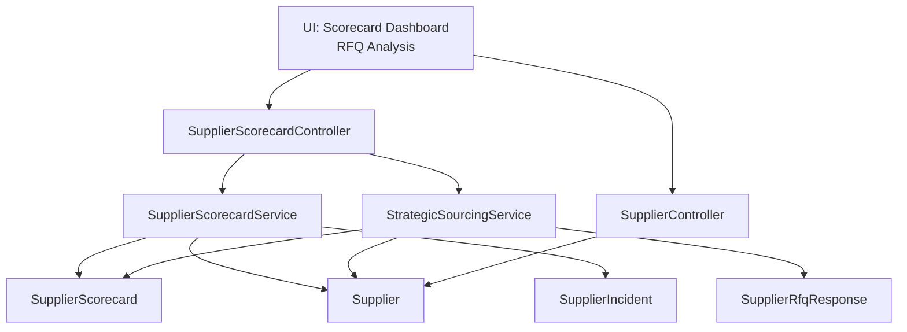

**Diagram sources**
- [SupplierScorecardController.php:11-206](file://app/Http/Controllers/Suppliers/SupplierScorecardController.php#L11-L206)
- [SupplierController.php:9-128](file://app/Http/Controllers/SupplierController.php#L9-L128)
- [SupplierScorecardService.php:12-321](file://app/Services/SupplierScorecardService.php#L12-L321)
- [StrategicSourcingService.php:11-388](file://app/Services/StrategicSourcingService.php#L11-L388)
- [SupplierScorecard.php:12-114](file://app/Models/SupplierScorecard.php#L12-L114)
- [Supplier.php:13-51](file://app/Models/Supplier.php#L13-L51)
- [SupplierIncident.php:11-70](file://app/Models/SupplierIncident.php#L11-L70)
- [SupplierRfqResponse.php:11-60](file://app/Models/SupplierRfqResponse.php#L11-L60)

## Detailed Component Analysis

### Supplier Registration and Profile Management
- Registration: Validates and creates suppliers under the current tenant, sets initial active status, and logs activity.
- Profile updates: Updates contact, company, banking, and active status with tenant scoping and change logging.
- Activation/deactivation: Toggles active flag and logs changes; prevents deletion if purchase orders exist by deactivating instead.
- Search and filtering: Index supports search across name/company/email/phone and status filters.

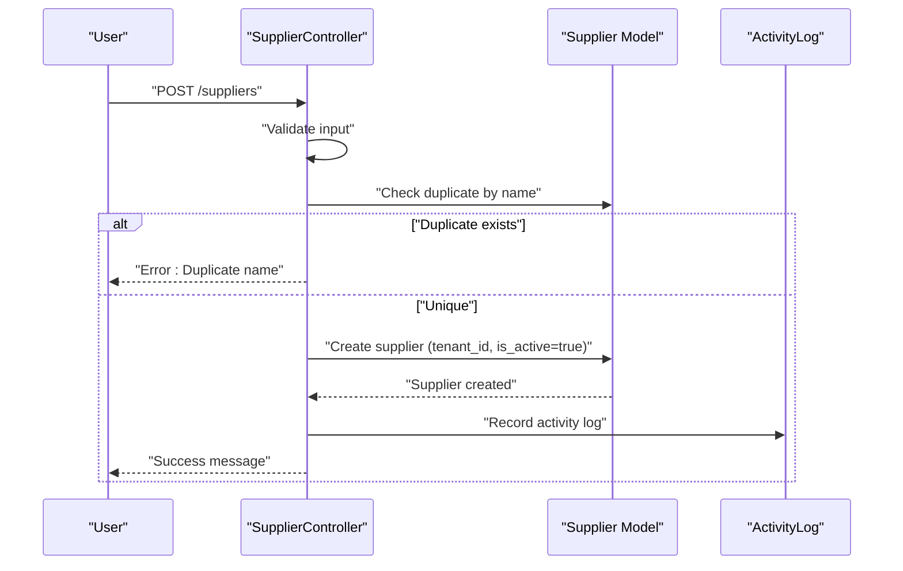

**Diagram sources**
- [SupplierController.php:46-74](file://app/Http/Controllers/SupplierController.php#L46-L74)
- [Supplier.php:13-51](file://app/Models/Supplier.php#L13-L51)

**Section sources**
- [SupplierController.php:16-127](file://app/Http/Controllers/SupplierController.php#L16-L127)
- [Supplier.php:13-51](file://app/Models/Supplier.php#L13-L51)

### Supplier Categorization and Evaluation
- Categorization: Supplier records support category-based grouping for performance segmentation.
- Scorecard generation: Computes weighted scores across quality, delivery, cost, and service metrics; derives rating and status.
- Performance trends: Tracks monthly scorecard history to detect improvements or declines.

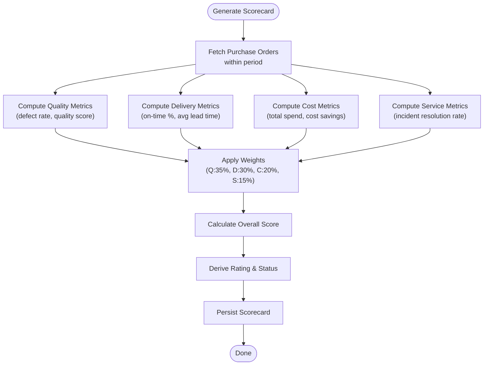

**Diagram sources**
- [SupplierScorecardService.php:17-54](file://app/Services/SupplierScorecardService.php#L17-L54)
- [SupplierScorecardService.php:59-177](file://app/Services/SupplierScorecardService.php#L59-L177)
- [SupplierScorecard.php:74-101](file://app/Models/SupplierScorecard.php#L74-L101)

**Section sources**
- [SupplierScorecardService.php:17-321](file://app/Services/SupplierScorecardService.php#L17-L321)
- [SupplierScorecard.php:12-114](file://app/Models/SupplierScorecard.php#L12-L114)

### Supplier Evaluation Processes, Scorecard Systems, and Performance Metrics
- Multi-criteria RFQ evaluation: Scores suppliers by price, lead time, supplier rating, delivery performance, and payment terms with defined weights.
- Evaluation methodology: Price (40%), lead time (25%), supplier rating (15%), delivery performance (10%), payment terms (10%).
- Supplier comparison: Compares multiple suppliers by on-time delivery rate and order value trends.

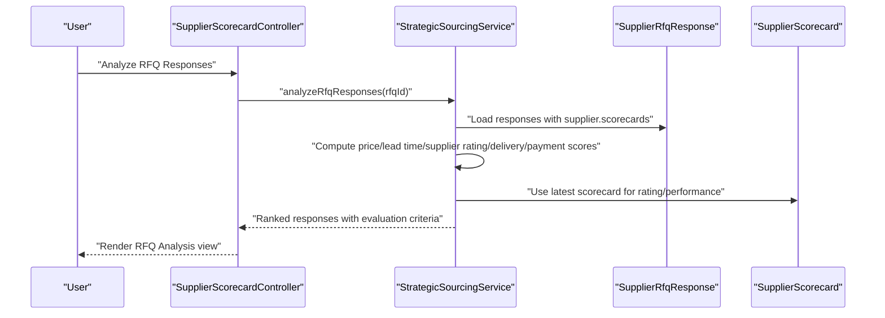

**Diagram sources**
- [SupplierScorecardController.php:89-98](file://app/Http/Controllers/Suppliers/SupplierScorecardController.php#L89-L98)
- [StrategicSourcingService.php:163-250](file://app/Services/StrategicSourcingService.php#L163-L250)
- [SupplierRfqResponse.php:11-60](file://app/Models/SupplierRfqResponse.php#L11-L60)
- [SupplierScorecard.php:12-114](file://app/Models/SupplierScorecard.php#L12-L114)

**Section sources**
- [StrategicSourcingService.php:163-326](file://app/Services/StrategicSourcingService.php#L163-L326)
- [SupplierScorecardController.php:89-98](file://app/Http/Controllers/Suppliers/SupplierScorecardController.php#L89-L98)
- [rfq-analysis.blade.php:219-266](file://resources/views/suppliers/rfq-analysis.blade.php#L219-L266)

### Supplier Onboarding Workflows and Due Diligence
- Supplier onboarding: Creation via SupplierController with initial active status and activity logging.
- Due diligence and compliance: SupplierDocument model supports document types, verification, expiry dates, and verification lifecycle.
- Risk monitoring: SupplierIncident model captures severity, financial impact, resolution, and preventive actions.

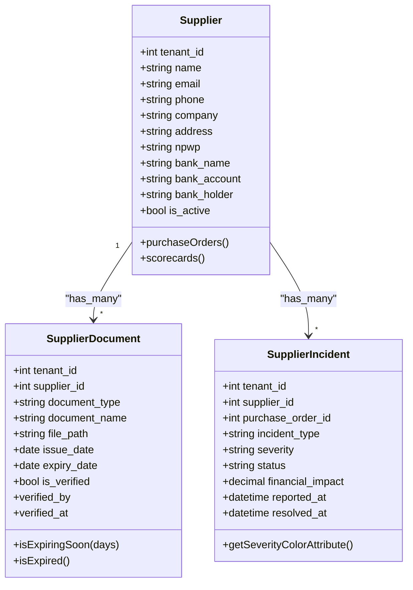

**Diagram sources**
- [Supplier.php:13-51](file://app/Models/Supplier.php#L13-L51)
- [SupplierDocument.php:11-64](file://app/Models/SupplierDocument.php#L11-L64)
- [SupplierIncident.php:11-70](file://app/Models/SupplierIncident.php#L11-L70)

**Section sources**
- [SupplierController.php:46-127](file://app/Http/Controllers/SupplierController.php#L46-L127)
- [SupplierDocument.php:11-64](file://app/Models/SupplierDocument.php#L11-L64)
- [SupplierIncident.php:11-70](file://app/Models/SupplierIncident.php#L11-L70)

### Supplier Relationship Management
- Portal integration: SupplierPortalUser enables supplier-side access with roles and activity tracking.
- Communication: SupplierIncident captures reported/resolved timestamps and resolution notes for SLA tracking.
- Collaboration: StrategicSourcingService supports sourcing opportunities, RFQ tracking, and supplier participation metrics.

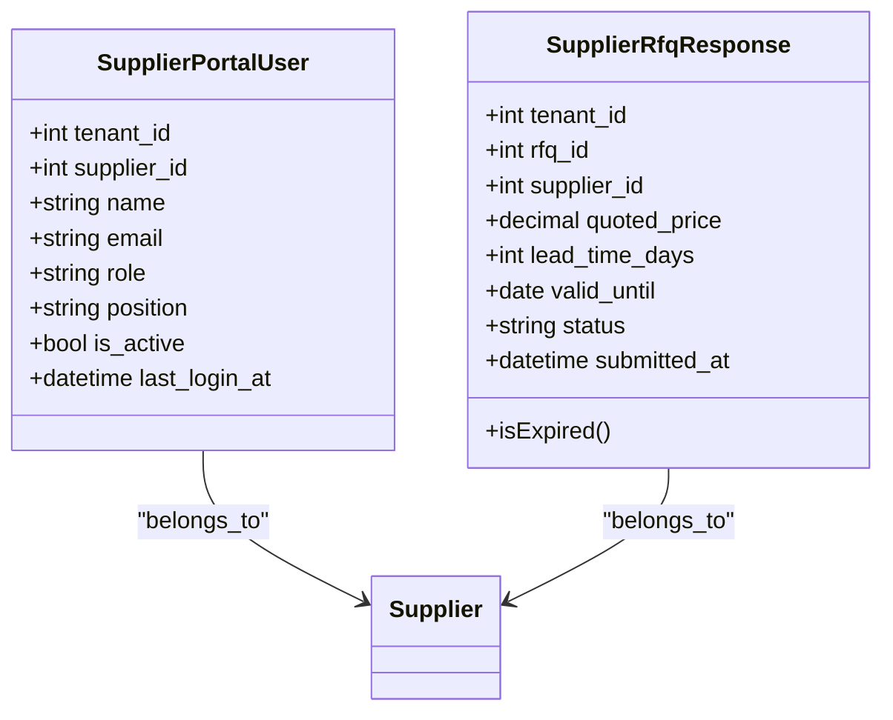

**Diagram sources**
- [SupplierPortalUser.php:11-45](file://app/Models/SupplierPortalUser.php#L11-L45)
- [SupplierRfqResponse.php:11-60](file://app/Models/SupplierRfqResponse.php#L11-L60)

**Section sources**
- [SupplierPortalUser.php:11-45](file://app/Models/SupplierPortalUser.php#L11-L45)
- [SupplierRfqResponse.php:11-60](file://app/Models/SupplierRfqResponse.php#L11-L60)
- [StrategicSourcingService.php:80-157](file://app/Services/StrategicSourcingService.php#L80-L157)

### Supplier Communication Tools, Contract Management, and Portal Integration
- Communication: SupplierIncident severity color coding and resolution tracking support SLA visibility.
- Contracts: SupplierDocument supports contract/certificates with verification and expiry checks.
- Portal: SupplierPortalUser model integrates supplier self-service and activity monitoring.

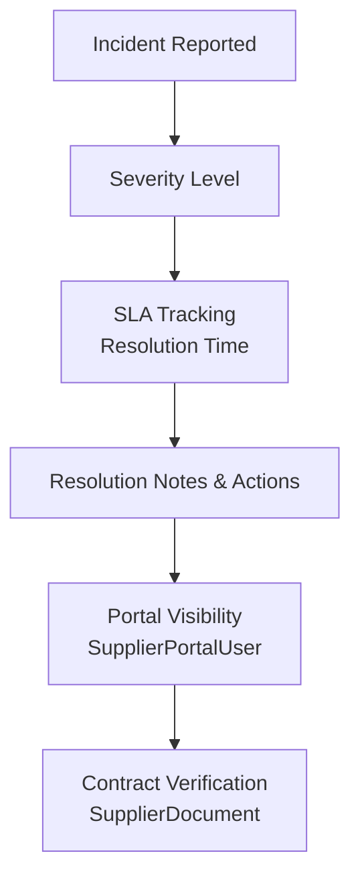

**Diagram sources**
- [SupplierIncident.php:11-70](file://app/Models/SupplierIncident.php#L11-L70)
- [SupplierPortalUser.php:11-45](file://app/Models/SupplierPortalUser.php#L11-L45)
- [SupplierDocument.php:11-64](file://app/Models/SupplierDocument.php#L11-L64)

**Section sources**
- [SupplierIncident.php:11-70](file://app/Models/SupplierIncident.php#L11-L70)
- [SupplierPortalUser.php:11-45](file://app/Models/SupplierPortalUser.php#L11-L45)
- [SupplierDocument.php:11-64](file://app/Models/SupplierDocument.php#L11-L64)

### Supplier Risk Assessment and Compliance Verification
- Risk indicators: Defect rates, late deliveries, incident counts, and financial impact inform risk profiles.
- Compliance verification: SupplierDocument tracks verification status and expiry dates to prevent non-compliant engagement.

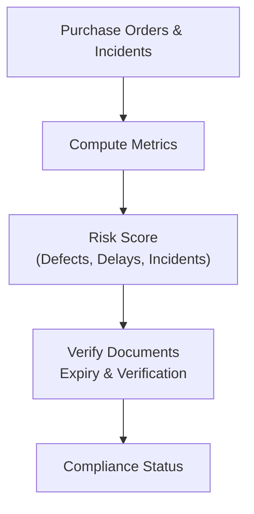

**Diagram sources**
- [SupplierScorecardService.php:59-177](file://app/Services/SupplierScorecardService.php#L59-L177)
- [SupplierDocument.php:53-63](file://app/Models/SupplierDocument.php#L53-L63)

**Section sources**
- [SupplierScorecardService.php:59-177](file://app/Services/SupplierScorecardService.php#L59-L177)
- [SupplierDocument.php:53-63](file://app/Models/SupplierDocument.php#L53-L63)

### Supplier Collaboration Features
- Sourcing opportunities: StrategicSourcingService identifies consolidation and diversification opportunities and tracks progress.
- RFQ lifecycle: SupplierRfqResponse captures submission, acceptance, and validity; evaluation dashboard ranks suppliers.
- Comparison: Supplier comparison by on-time delivery and order value helps select optimal partners.

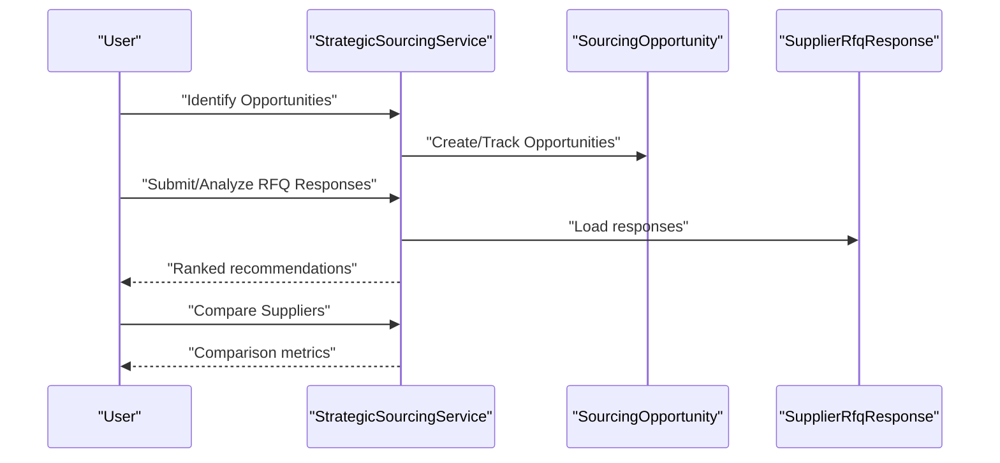

**Diagram sources**
- [StrategicSourcingService.php:16-67](file://app/Services/StrategicSourcingService.php#L16-L67)
- [StrategicSourcingService.php:163-388](file://app/Services/StrategicSourcingService.php#L163-L388)
- [SupplierRfqResponse.php:11-60](file://app/Models/SupplierRfqResponse.php#L11-L60)

**Section sources**
- [StrategicSourcingService.php:16-67](file://app/Services/StrategicSourcingService.php#L16-L67)
- [SupplierRfqResponse.php:11-60](file://app/Models/SupplierRfqResponse.php#L11-L60)

## Dependency Analysis
Supplier management components depend on:
- Models: Supplier, SupplierScorecard, SupplierDocument, SupplierIncident, SupplierPortalUser, SupplierRfqResponse.
- Controllers: SupplierController, SupplierScorecardController.
- Services: SupplierScorecardService, StrategicSourcingService.
- Views: RFQ analysis view displays evaluation methodology and weights.

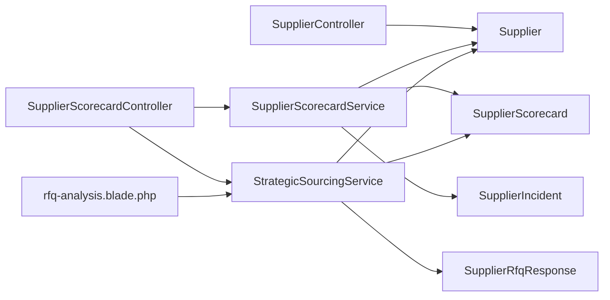

**Diagram sources**
- [SupplierController.php:9-128](file://app/Http/Controllers/SupplierController.php#L9-L128)
- [SupplierScorecardController.php:11-206](file://app/Http/Controllers/Suppliers/SupplierScorecardController.php#L11-L206)
- [SupplierScorecardService.php:12-321](file://app/Services/SupplierScorecardService.php#L12-L321)
- [StrategicSourcingService.php:11-388](file://app/Services/StrategicSourcingService.php#L11-L388)
- [Supplier.php:13-51](file://app/Models/Supplier.php#L13-L51)
- [SupplierScorecard.php:12-114](file://app/Models/SupplierScorecard.php#L12-L114)
- [SupplierIncident.php:11-70](file://app/Models/SupplierIncident.php#L11-L70)
- [SupplierRfqResponse.php:11-60](file://app/Models/SupplierRfqResponse.php#L11-L60)
- [rfq-analysis.blade.php:219-266](file://resources/views/suppliers/rfq-analysis.blade.php#L219-L266)

**Section sources**
- [SupplierController.php:9-128](file://app/Http/Controllers/SupplierController.php#L9-L128)
- [SupplierScorecardController.php:11-206](file://app/Http/Controllers/Suppliers/SupplierScorecardController.php#L11-L206)
- [SupplierScorecardService.php:12-321](file://app/Services/SupplierScorecardService.php#L12-L321)
- [StrategicSourcingService.php:11-388](file://app/Services/StrategicSourcingService.php#L11-L388)

## Performance Considerations
- Indexing: Ensure tenant_id, supplier_id, and date range fields are indexed for efficient queries on purchase orders, scorecards, incidents, and RFQ responses.
- Aggregation: Use database-level aggregations to compute defect rates, on-time percentages, and averages to minimize PHP loops.
- Background jobs: Offload bulk scorecard generation and exports to queued jobs for large datasets.
- Pagination: Controllers already paginate lists; maintain pagination for RFQ analysis and supplier comparisons.

## Troubleshooting Guide
- Duplicate supplier names: Validation prevents duplicates during creation; adjust input or check existing records.
- Deletion blocked by purchase orders: Deactivate supplier instead of deleting to preserve history.
- Expired or expiring documents: Use SupplierDocument helpers to detect expiry and trigger reminders.
- RFQ evaluation errors: Ensure RFQ has responses; otherwise, the analysis returns an error message.
- Scorecard generation failures: Wrap bulk generation in try-catch and review logs for per-supplier exceptions.

**Section sources**
- [SupplierController.php:62-64](file://app/Http/Controllers/SupplierController.php#L62-L64)
- [SupplierController.php:117-121](file://app/Http/Controllers/SupplierController.php#L117-L121)
- [SupplierDocument.php:53-63](file://app/Models/SupplierDocument.php#L53-L63)
- [SupplierScorecardController.php:93-95](file://app/Http/Controllers/Suppliers/SupplierScorecardController.php#L93-L95)
- [SupplierScorecardService.php:314-316](file://app/Services/SupplierScorecardService.php#L314-L316)

## Conclusion
The supplier management module provides a robust foundation for supplier lifecycle operations, from onboarding and profile maintenance to evaluation, risk monitoring, and strategic collaboration. The scorecard system and sourcing analytics enable data-driven decisions, while portal and document management streamline supplier engagement and compliance.

## Appendices

### Supplier Scoring Algorithms and Rating Systems
- Scorecard weights: Quality (35%), Delivery (30%), Cost (20%), Service (15%); overall score determines rating (A–F) and status (active/warning/critical).
- RFQ evaluation weights: Price (40%), Lead time (25%), Supplier rating (15%), Delivery performance (10%), Payment terms (10%).
- Improvement initiatives: Use scorecard trends and incident reports to identify areas for improvement and set action items.

**Section sources**
- [SupplierScorecardService.php:29-34](file://app/Services/SupplierScorecardService.php#L29-L34)
- [SupplierScorecard.php:74-101](file://app/Models/SupplierScorecard.php#L74-L101)
- [StrategicSourcingService.php:199-205](file://app/Services/StrategicSourcingService.php#L199-L205)
- [rfq-analysis.blade.php:219-266](file://resources/views/suppliers/rfq-analysis.blade.php#L219-L266)