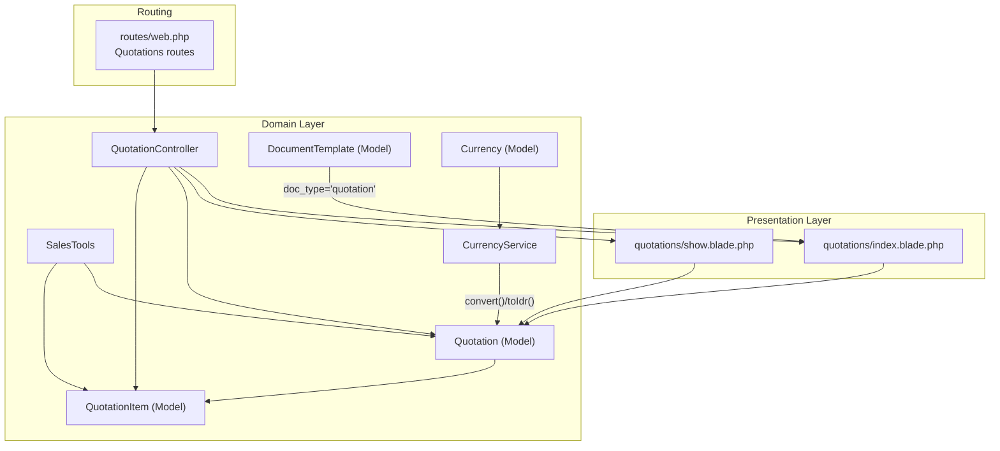
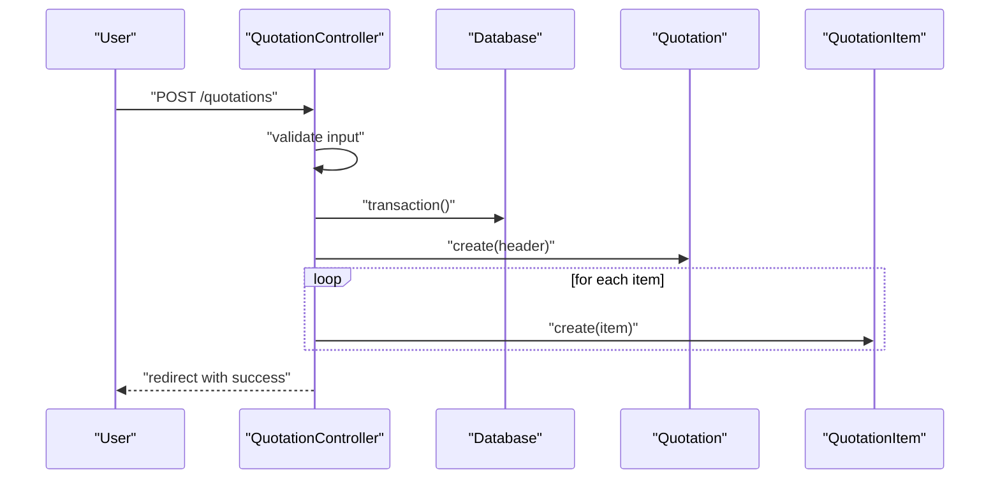
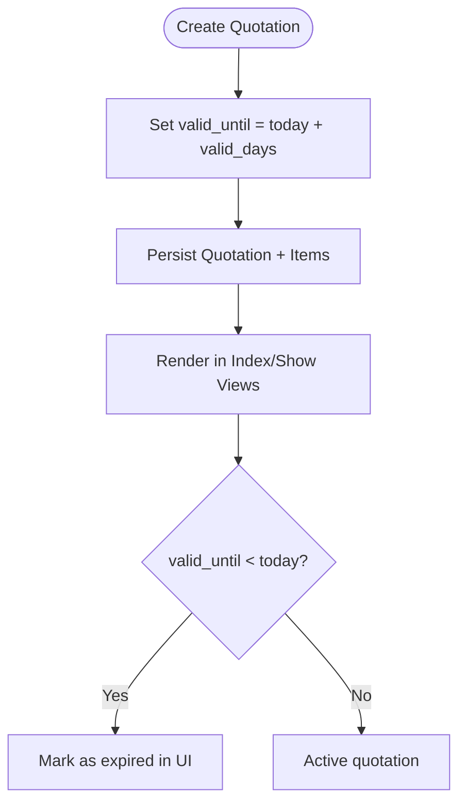
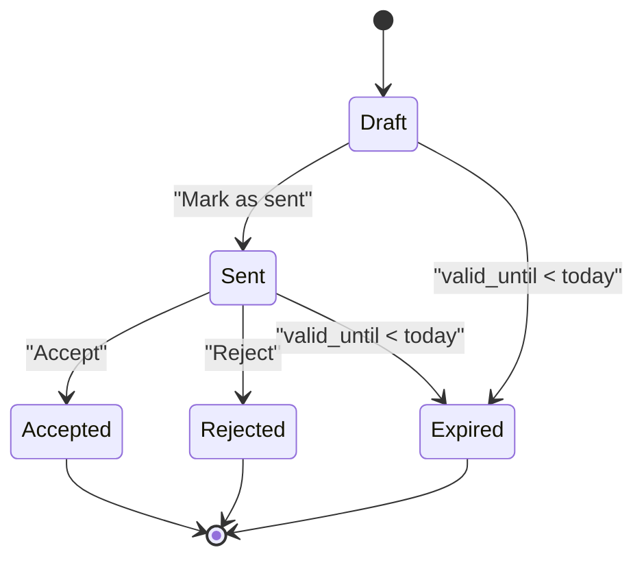
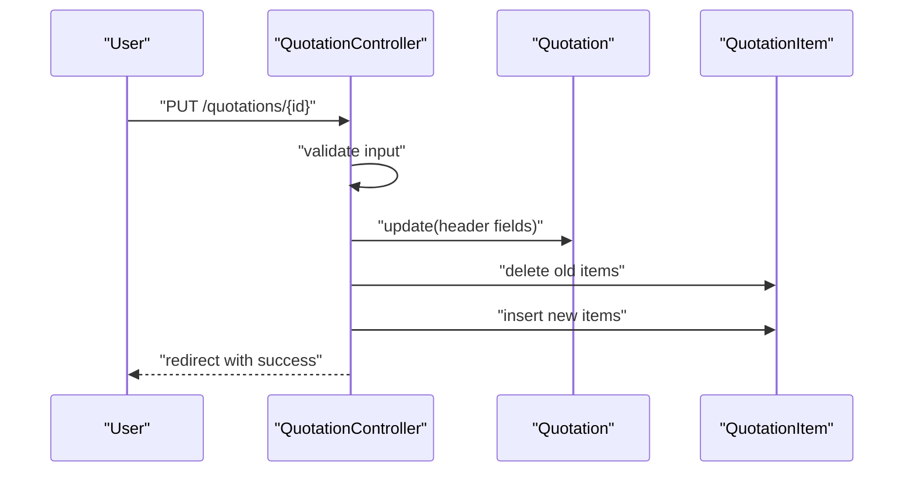
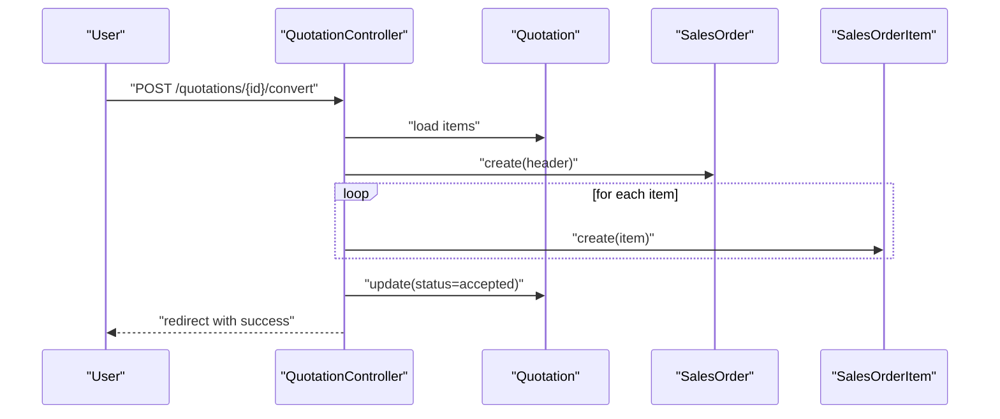
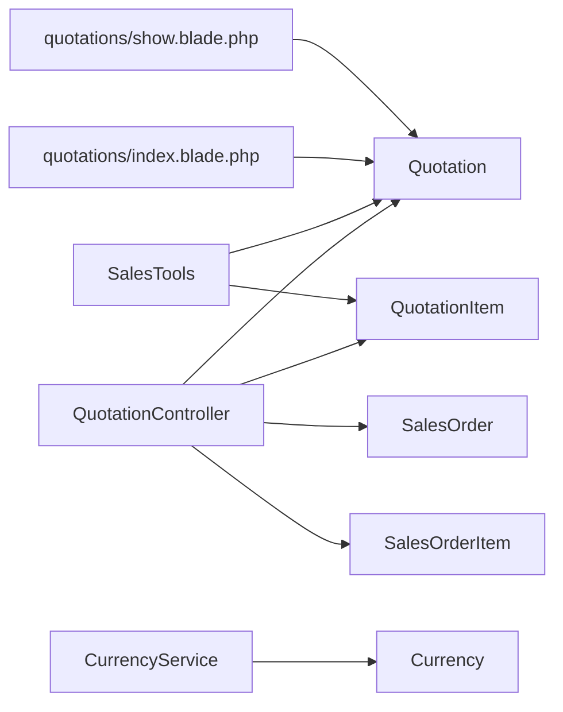

# Quotation Processing

<cite>
**Referenced Files in This Document**
- [QuotationController.php](file://app/Http/Controllers/QuotationController.php)
- [Quotation.php](file://app/Models/Quotation.php)
- [QuotationItem.php](file://app/Models/QuotationItem.php)
- [index.blade.php](file://resources/views/quotations/index.blade.php)
- [show.blade.php](file://resources/views/quotations/show.blade.php)
- [SalesTools.php](file://app/Services/ERP/SalesTools.php)
- [DocumentTemplate.php](file://app/Models/DocumentTemplate.php)
- [Currency.php](file://app/Models/Currency.php)
- [CurrencyService.php](file://app/Services/CurrencyService.php)
- [web.php](file://routes/web.php)
</cite>

## Table of Contents
1. [Introduction](#introduction)
2. [Project Structure](#project-structure)
3. [Core Components](#core-components)
4. [Architecture Overview](#architecture-overview)
5. [Detailed Component Analysis](#detailed-component-analysis)
6. [Dependency Analysis](#dependency-analysis)
7. [Performance Considerations](#performance-considerations)
8. [Troubleshooting Guide](#troubleshooting-guide)
9. [Conclusion](#conclusion)
10. [Appendices](#appendices)

## Introduction
This document explains the complete quotation lifecycle in qalcuityERP, from initial inquiry to contract conversion. It covers quotation creation (product configuration, pricing calculation, validity period setting, and customer presentation), approval workflows, revision tracking, and conversion to sales orders. It also documents template management, multi-currency support, and integration points with CRM-like customer records. Finally, it outlines analytics and metrics that can be derived from the system to track conversion rates and customer engagement.

## Project Structure
The quotation feature spans controllers, models, views, services, routing, and supporting models for templates and currencies. The primary entry points are:
- Routes under the quotations prefix
- QuotationController for CRUD and state transitions
- Blade views for listing and displaying quotations
- SalesTools service for programmatic creation of quotations
- DocumentTemplate model for templating
- Currency and CurrencyService for multi-currency support



**Diagram sources**
- [web.php:1568-1577](file://routes/web.php#L1568-L1577)
- [QuotationController.php:15-249](file://app/Http/Controllers/QuotationController.php#L15-L249)
- [index.blade.php:1-316](file://resources/views/quotations/index.blade.php#L1-L316)
- [show.blade.php:1-128](file://resources/views/quotations/show.blade.php#L1-L128)
- [SalesTools.php:13-598](file://app/Services/ERP/SalesTools.php#L13-L598)
- [Quotation.php:11-37](file://app/Models/Quotation.php#L11-L37)
- [QuotationItem.php:8-20](file://app/Models/QuotationItem.php#L8-L20)
- [DocumentTemplate.php:10-38](file://app/Models/DocumentTemplate.php#L10-L38)
- [Currency.php:14-100](file://app/Models/Currency.php#L14-L100)
- [CurrencyService.php:14-188](file://app/Services/CurrencyService.php#L14-L188)

**Section sources**
- [web.php:1568-1577](file://routes/web.php#L1568-L1577)
- [QuotationController.php:22-51](file://app/Http/Controllers/QuotationController.php#L22-L51)
- [index.blade.php:24-51](file://resources/views/quotations/index.blade.php#L24-L51)
- [show.blade.php:6-28](file://resources/views/quotations/show.blade.php#L6-L28)
- [SalesTools.php:146-176](file://app/Services/ERP/SalesTools.php#L146-L176)
- [DocumentTemplate.php:27-37](file://app/Models/DocumentTemplate.php#L27-L37)
- [Currency.php:30-37](file://app/Models/Currency.php#L30-L37)
- [CurrencyService.php:20-48](file://app/Services/CurrencyService.php#L20-L48)

## Core Components
- QuotationController: Handles listing, creation, editing, status updates, conversion to sales orders, and deletion.
- Quotation model: Represents a quotation header with tenant scoping, customer linkage, user creator, and financial totals.
- QuotationItem model: Line items linked to products or free-text descriptions, quantities, prices, discounts, and totals.
- Views: Index lists quotations with filters and actions; show displays details, status controls, and conversion options.
- SalesTools service: Programmatic creation of quotations via natural-language commands.
- DocumentTemplate: Template management with doc_type including “quotation”.
- Currency and CurrencyService: Multi-currency support with conversion and stale rate detection.

**Section sources**
- [QuotationController.php:53-110](file://app/Http/Controllers/QuotationController.php#L53-L110)
- [QuotationController.php:119-171](file://app/Http/Controllers/QuotationController.php#L119-L171)
- [QuotationController.php:173-184](file://app/Http/Controllers/QuotationController.php#L173-L184)
- [QuotationController.php:186-238](file://app/Http/Controllers/QuotationController.php#L186-L238)
- [QuotationController.php:240-247](file://app/Http/Controllers/QuotationController.php#L240-L247)
- [Quotation.php:14-36](file://app/Models/Quotation.php#L14-L36)
- [QuotationItem.php:10-19](file://app/Models/QuotationItem.php#L10-L19)
- [index.blade.php:42-117](file://resources/views/quotations/index.blade.php#L42-L117)
- [show.blade.php:62-108](file://resources/views/quotations/show.blade.php#L62-L108)
- [SalesTools.php:428-502](file://app/Services/ERP/SalesTools.php#L428-L502)
- [DocumentTemplate.php:27-37](file://app/Models/DocumentTemplate.php#L27-L37)
- [Currency.php:30-37](file://app/Models/Currency.php#L30-L37)
- [CurrencyService.php:20-48](file://app/Services/CurrencyService.php#L20-L48)

## Architecture Overview
The quotation feature follows a layered MVC pattern:
- Routing defines endpoints for quotations.
- Controller orchestrates validation, transactions, and state changes.
- Models encapsulate persistence and relationships.
- Views render UI and capture user actions.
- Services provide programmatic capabilities (e.g., SalesTools).
- Templates and currency services support presentation and financial conversions.

```mermaid
classDiagram
class QuotationController {
+index(request)
+store(request)
+show(quotation)
+update(request, quotation)
+updateStatus(request, quotation)
+convertToOrder(quotation)
+destroy(quotation)
}
class Quotation {
+tenant_id
+customer_id
+user_id
+number
+status
+date
+valid_until
+subtotal
+discount
+tax
+total
+notes
+items()
+salesOrders()
}
class QuotationItem {
+quotation_id
+product_id
+description
+quantity
+price
+discount
+total
+product()
}
class SalesTools {
+createQuotation(args)
}
class DocumentTemplate {
+name
+doc_type
+html_content
+is_default
}
class Currency {
+rate_to_idr
+toIdr(amount)
+fromIdr(idrAmount)
}
class CurrencyService {
+convert(amount, from, to)
+toIdr(amount, from)
+getRate(code)
}
QuotationController --> Quotation : "CRUD"
QuotationController --> QuotationItem : "CRUD"
SalesTools --> Quotation : "create"
SalesTools --> QuotationItem : "create"
Quotation "1" --> "*" QuotationItem : "has many"
DocumentTemplate -->|"doc_type='quotation'"| Quotation : "templating"
CurrencyService --> Currency : "reads/writes"
Quotation --> Currency : "financials"
```

**Diagram sources**
- [QuotationController.php:15-249](file://app/Http/Controllers/QuotationController.php#L15-L249)
- [Quotation.php:11-37](file://app/Models/Quotation.php#L11-L37)
- [QuotationItem.php:8-20](file://app/Models/QuotationItem.php#L8-L20)
- [SalesTools.php:428-502](file://app/Services/ERP/SalesTools.php#L428-L502)
- [DocumentTemplate.php:10-38](file://app/Models/DocumentTemplate.php#L10-L38)
- [Currency.php:14-100](file://app/Models/Currency.php#L14-L100)
- [CurrencyService.php:14-188](file://app/Services/CurrencyService.php#L14-L188)

## Detailed Component Analysis

### Quotation Creation and Pricing Calculation
- Creation validates customer existence, quantity/price ranges, and item arrays.
- Computes subtotal, applies optional discount, and sets tax to zero by default.
- Generates a unique quotation number and persists items.
- Supports both UI-driven creation and programmatic creation via SalesTools.



**Diagram sources**
- [QuotationController.php:53-110](file://app/Http/Controllers/QuotationController.php#L53-L110)
- [QuotationController.php:67-107](file://app/Http/Controllers/QuotationController.php#L67-L107)

**Section sources**
- [QuotationController.php:55-65](file://app/Http/Controllers/QuotationController.php#L55-L65)
- [QuotationController.php:67-107](file://app/Http/Controllers/QuotationController.php#L67-L107)
- [SalesTools.php:428-502](file://app/Services/ERP/SalesTools.php#L428-L502)

### Validity Period and Customer Presentation
- Validity period is set as today + valid_days during creation.
- UI displays expiration status and highlights expired rows.
- Show view renders items, totals, notes, and related sales orders.



**Diagram sources**
- [QuotationController.php:95-96](file://app/Http/Controllers/QuotationController.php#L95-L96)
- [index.blade.php:57-58](file://resources/views/quotations/index.blade.php#L57-L58)
- [show.blade.php:13-15](file://resources/views/quotations/show.blade.php#L13-L15)

**Section sources**
- [QuotationController.php:95-96](file://app/Http/Controllers/QuotationController.php#L95-L96)
- [index.blade.php:57-78](file://resources/views/quotations/index.blade.php#L57-L78)
- [show.blade.php:13-15](file://resources/views/quotations/show.blade.php#L13-L15)

### Approval Workflows and Status Transitions
- Draft → Sent: Mark as sent.
- Sent → Accepted/Rejected: Approve or reject.
- Status updates validated against allowed values.
- Conversion to sales order is disabled for rejected/expired quotations.



**Diagram sources**
- [QuotationController.php:173-184](file://app/Http/Controllers/QuotationController.php#L173-L184)
- [QuotationController.php:190-192](file://app/Http/Controllers/QuotationController.php#L190-L192)
- [show.blade.php:29-48](file://resources/views/quotations/show.blade.php#L29-L48)

**Section sources**
- [QuotationController.php:177-179](file://app/Http/Controllers/QuotationController.php#L177-L179)
- [QuotationController.php:190-192](file://app/Http/Controllers/QuotationController.php#L190-L192)
- [show.blade.php:29-48](file://resources/views/quotations/show.blade.php#L29-L48)

### Revision Tracking and Editing
- Edit is allowed only when status is not accepted.
- Items are deleted and re-inserted to refresh line items.
- Validation ensures items remain consistent.



**Diagram sources**
- [QuotationController.php:119-171](file://app/Http/Controllers/QuotationController.php#L119-L171)
- [QuotationController.php:136-168](file://app/Http/Controllers/QuotationController.php#L136-L168)

**Section sources**
- [QuotationController.php:122](file://app/Http/Controllers/QuotationController.php#L122)
- [QuotationController.php:136-168](file://app/Http/Controllers/QuotationController.php#L136-L168)

### Conversion to Sales Orders
- Conversion requires status not rejected/expired and passes credit limit check.
- Creates a sales order with identical items and updates quotation status to accepted.
- Prevents conversion if customer would exceed credit limit.



**Diagram sources**
- [QuotationController.php:186-238](file://app/Http/Controllers/QuotationController.php#L186-L238)
- [QuotationController.php:204-235](file://app/Http/Controllers/QuotationController.php#L204-L235)

**Section sources**
- [QuotationController.php:194-202](file://app/Http/Controllers/QuotationController.php#L194-L202)
- [QuotationController.php:204-235](file://app/Http/Controllers/QuotationController.php#L204-L235)

### Template Management
- DocumentTemplate supports doc_type including “quotation”.
- Use templates to standardize quotation presentations.

**Section sources**
- [DocumentTemplate.php:27-37](file://app/Models/DocumentTemplate.php#L27-L37)

### Multi-Currency Support
- Currency model stores rate_to_idr and staleness metadata.
- CurrencyService converts amounts via IDR as base and logs stale rates.
- Quotation totals are stored as decimals; currency conversion can be applied at presentation or processing stages.

**Section sources**
- [Currency.php:30-37](file://app/Models/Currency.php#L30-L37)
- [Currency.php:50-98](file://app/Models/Currency.php#L50-L98)
- [CurrencyService.php:20-48](file://app/Services/CurrencyService.php#L20-L48)
- [CurrencyService.php:76-114](file://app/Services/CurrencyService.php#L76-L114)

### Integration with CRM Systems
- Customer records are used for quotations; the system references customers by name/company.
- SalesTools integrates customer lookup and quotation creation, enabling automation similar to CRM-driven workflows.

**Section sources**
- [SalesTools.php:430-438](file://app/Services/ERP/SalesTools.php#L430-L438)
- [QuotationController.php:47](file://app/Http/Controllers/QuotationController.php#L47)

### Quotation Analytics and Metrics
- The system provides statistics for draft/sent/accepted/expired counts.
- Index view aggregates status counts for quick visibility.
- Additional analytics dashboards can be leveraged to derive conversion rates and customer engagement metrics.

**Section sources**
- [QuotationController.php:38-45](file://app/Http/Controllers/QuotationController.php#L38-L45)
- [index.blade.php:5-22](file://resources/views/quotations/index.blade.php#L5-L22)

## Dependency Analysis
- QuotationController depends on Quotation, QuotationItem, SalesOrder, and SalesOrderItem.
- Quotation has many QuotationItem and belongs to Customer/User/Tenant.
- SalesTools depends on Customer/Product/Quotation/QuotationItem.
- Views depend on models for rendering and forms for submission.
- CurrencyService/Currency support financial conversions.



**Diagram sources**
- [QuotationController.php:15-249](file://app/Http/Controllers/QuotationController.php#L15-L249)
- [SalesTools.php:428-502](file://app/Services/ERP/SalesTools.php#L428-L502)
- [index.blade.php:42-117](file://resources/views/quotations/index.blade.php#L42-L117)
- [show.blade.php:62-108](file://resources/views/quotations/show.blade.php#L62-L108)
- [CurrencyService.php:14-188](file://app/Services/CurrencyService.php#L14-L188)
- [Currency.php:14-100](file://app/Models/Currency.php#L14-L100)

**Section sources**
- [QuotationController.php:24-51](file://app/Http/Controllers/QuotationController.php#L24-L51)
- [SalesTools.php:428-502](file://app/Services/ERP/SalesTools.php#L428-L502)
- [index.blade.php:42-117](file://resources/views/quotations/index.blade.php#L42-L117)
- [show.blade.php:62-108](file://resources/views/quotations/show.blade.php#L62-L108)
- [CurrencyService.php:14-188](file://app/Services/CurrencyService.php#L14-L188)
- [Currency.php:14-100](file://app/Models/Currency.php#L14-L100)

## Performance Considerations
- Use pagination on quotation listings to avoid large result sets.
- Batch insert for quotation items to minimize round trips.
- Cache frequently accessed customer/product lists in UI forms.
- Keep validity windows reasonable to reduce expired quotation churn.
- Monitor stale currency rates to prevent incorrect conversions.

[No sources needed since this section provides general guidance]

## Troubleshooting Guide
- Credit limit exceeded during conversion: The controller checks customer credit limits and blocks conversion with a user-facing message.
- Editing accepted quotations: Editing is blocked for accepted quotations.
- Converting rejected/expired quotations: Conversion is prevented and returns an error message.
- Stale currency rates: CurrencyService logs warnings/criticals for stale rates; update rates promptly.

**Section sources**
- [QuotationController.php:194-202](file://app/Http/Controllers/QuotationController.php#L194-L202)
- [QuotationController.php:122](file://app/Http/Controllers/QuotationController.php#L122)
- [QuotationController.php:190-192](file://app/Http/Controllers/QuotationController.php#L190-L192)
- [CurrencyService.php:161-186](file://app/Services/CurrencyService.php#L161-L186)

## Conclusion
The quotation processing system in qalcuityERP provides a robust lifecycle from creation to conversion, with strong validation, status management, and integration points. It supports multi-currency operations and template-based presentation, while offering analytics hooks for conversion tracking and customer engagement insights. By following the documented workflows and best practices, teams can streamline quotation processes, improve accuracy, and enhance customer satisfaction.

## Appendices

### Example Strategies and Best Practices
- Pricing optimization: Use dynamic pricing rules and historical price lists to adjust quotation prices per customer segment.
- Customer relationship building: Personalize quotations with customer-specific notes, product recommendations, and flexible payment terms.
- Conversion rate tracking: Monitor acceptance rates by customer, product, and sales rep; use analytics dashboards to identify trends.
- Template standardization: Maintain consistent layouts and branding via DocumentTemplate with doc_type “quotation.”

[No sources needed since this section provides general guidance]