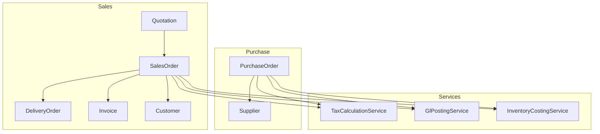
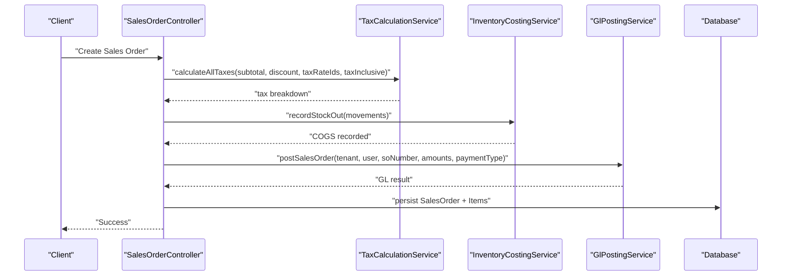
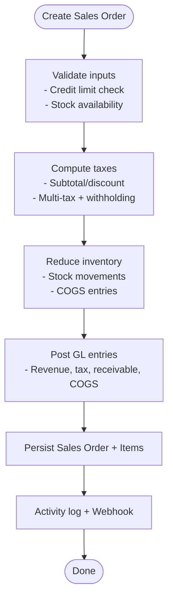
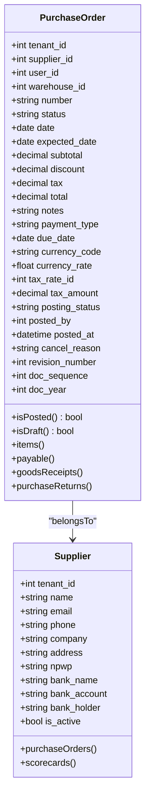
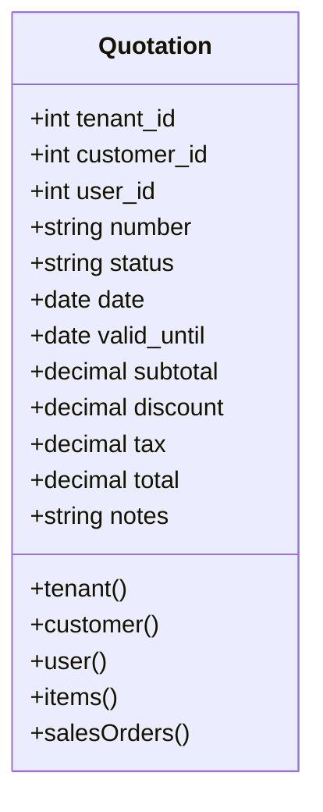
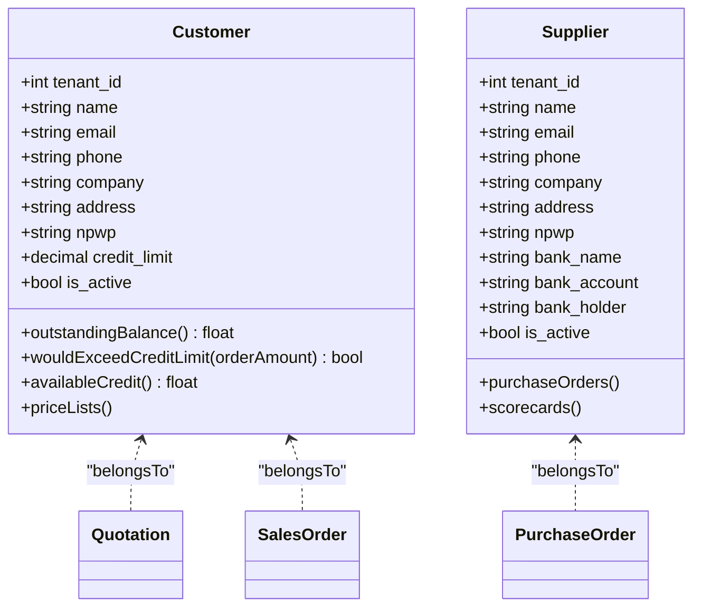
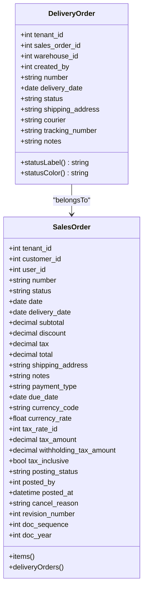
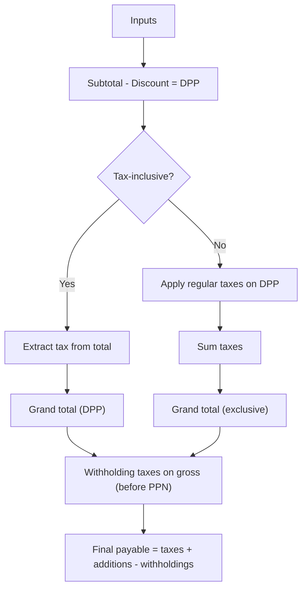
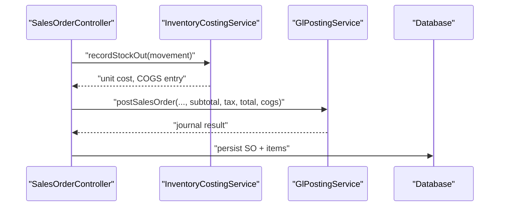
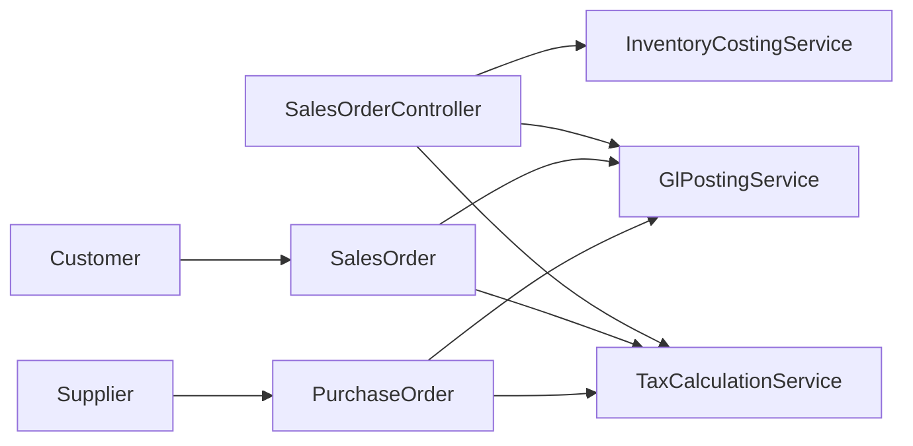

# Sales & Purchase Operations

<cite>
**Referenced Files in This Document**
- [SalesOrder.php](file://app/Models/SalesOrder.php)
- [SalesOrderController.php](file://app/Http/Controllers/SalesOrderController.php)
- [PurchaseOrder.php](file://app/Models/PurchaseOrder.php)
- [Quotation.php](file://app/Models/Quotation.php)
- [Customer.php](file://app/Models/Customer.php)
- [Supplier.php](file://app/Models/Supplier.php)
- [DeliveryOrder.php](file://app/Models/DeliveryOrder.php)
- [Invoice.php](file://app/Models/Invoice.php)
- [TaxCalculationService.php](file://app/Services/TaxCalculationService.php)
- [GlPostingService.php](file://app/Services/GlPostingService.php)
- [InventoryCostingService.php](file://app/Services/InventoryCostingService.php)
</cite>

## Table of Contents
1. [Introduction](#introduction)
2. [Project Structure](#project-structure)
3. [Core Components](#core-components)
4. [Architecture Overview](#architecture-overview)
5. [Detailed Component Analysis](#detailed-component-analysis)
6. [Dependency Analysis](#dependency-analysis)
7. [Performance Considerations](#performance-considerations)
8. [Troubleshooting Guide](#troubleshooting-guide)
9. [Conclusion](#conclusion)

## Introduction
This document describes the Sales & Purchase Operations module in qalcuityERP, focusing on order management, quotation processing, customer/supplier relationship management, and delivery coordination. It explains the sales order lifecycle, quote-to-cash processes, purchase order management, vendor relationship management, pricing strategies, discount calculations, tax handling, and integrations with inventory and accounting modules.

## Project Structure
The Sales & Purchase domain spans models, controllers, services, and supporting entities:
- Sales domain: Quotation, Sales Order, Delivery Order, Invoice, Customer
- Purchase domain: Purchase Order, Supplier
- Cross-domain services: Tax calculation, General Ledger posting, Inventory costing
- Supporting models: TaxRate, Warehouse, Product, ProductStock, StockMovement

**Diagram sources**
- [SalesOrder.php:13-122](file://app/Models/SalesOrder.php#L13-L122)
- [Quotation.php:11-36](file://app/Models/Quotation.php#L11-L36)
- [DeliveryOrder.php:12-51](file://app/Models/DeliveryOrder.php#L12-L51)
- [Invoice.php:13-182](file://app/Models/Invoice.php#L13-L182)
- [Customer.php:14-90](file://app/Models/Customer.php#L14-L90)
- [PurchaseOrder.php:13-140](file://app/Models/PurchaseOrder.php#L13-L140)
- [Supplier.php:13-51](file://app/Models/Supplier.php#L13-L51)
- [TaxCalculationService.php:29-306](file://app/Services/TaxCalculationService.php#L29-L306)
- [GlPostingService.php:26-995](file://app/Services/GlPostingService.php#L26-L995)
- [InventoryCostingService.php:23-365](file://app/Services/InventoryCostingService.php#L23-L365)

**Section sources**
- [SalesOrder.php:13-122](file://app/Models/SalesOrder.php#L13-L122)
- [PurchaseOrder.php:13-140](file://app/Models/PurchaseOrder.php#L13-L140)
- [Quotation.php:11-36](file://app/Models/Quotation.php#L11-L36)
- [Customer.php:14-90](file://app/Models/Customer.php#L14-L90)
- [Supplier.php:13-51](file://app/Models/Supplier.php#L13-L51)
- [DeliveryOrder.php:12-51](file://app/Models/DeliveryOrder.php#L12-L51)
- [Invoice.php:13-182](file://app/Models/Invoice.php#L13-L182)
- [TaxCalculationService.php:29-306](file://app/Services/TaxCalculationService.php#L29-L306)
- [GlPostingService.php:26-995](file://app/Services/GlPostingService.php#L26-L995)
- [InventoryCostingService.php:23-365](file://app/Services/InventoryCostingService.php#L23-L365)

## Core Components
- Sales Order: Encapsulates order header, items, totals, taxes, and lifecycle state. Integrates with tax calculation, inventory reduction, and GL auto-posting.
- Purchase Order: Manages vendor purchases, receipts, payable tracking, and lifecycle state.
- Quotation: Stores proposal data linked to Sales Orders.
- Customer: Relationship management, credit limits, and outstanding balances.
- Supplier: Vendor profile and scorecards.
- Delivery Order: Tracks shipping and delivery status.
- Invoice: Receivable lifecycle, aging buckets, and payment reconciliation.
- Services:
  - TaxCalculationService: Multi-tax, withholding, inclusive pricing, and rounding.
  - GlPostingService: Automated GL entries for sales, purchase, returns, payments.
  - InventoryCostingService: Costing methods (simple/AVCO/FIFO), COGS, valuation.

**Section sources**
- [SalesOrder.php:13-122](file://app/Models/SalesOrder.php#L13-L122)
- [PurchaseOrder.php:13-140](file://app/Models/PurchaseOrder.php#L13-L140)
- [Quotation.php:11-36](file://app/Models/Quotation.php#L11-L36)
- [Customer.php:14-90](file://app/Models/Customer.php#L14-L90)
- [Supplier.php:13-51](file://app/Models/Supplier.php#L13-L51)
- [DeliveryOrder.php:12-51](file://app/Models/DeliveryOrder.php#L12-L51)
- [Invoice.php:13-182](file://app/Models/Invoice.php#L13-L182)
- [TaxCalculationService.php:29-306](file://app/Services/TaxCalculationService.php#L29-L306)
- [GlPostingService.php:26-995](file://app/Services/GlPostingService.php#L26-L995)
- [InventoryCostingService.php:23-365](file://app/Services/InventoryCostingService.php#L23-L365)

## Architecture Overview
The Sales & Purchase lifecycle integrates domain models with services for tax computation, inventory adjustments, and accounting postings. Controllers orchestrate workflows, enforce validations, and trigger side effects.

**Diagram sources**
- [SalesOrderController.php:88-276](file://app/Http/Controllers/SalesOrderController.php#L88-L276)
- [TaxCalculationService.php:40-126](file://app/Services/TaxCalculationService.php#L40-L126)
- [InventoryCostingService.php:60-98](file://app/Services/InventoryCostingService.php#L60-L98)
- [GlPostingService.php:84-124](file://app/Services/GlPostingService.php#L84-L124)

## Detailed Component Analysis

### Sales Order Lifecycle and Quote-to-Cash
- Creation validates customer credit limit and stock availability, computes taxes, reduces inventory, posts GL, and fires webhooks.
- Status transitions are constrained to a defined state machine.
- Invoicing from SO creates an invoice with synchronized totals and due date.
- Deletion is restricted for shipped/completed orders.

**Diagram sources**
- [SalesOrderController.php:114-276](file://app/Http/Controllers/SalesOrderController.php#L114-L276)
- [TaxCalculationService.php:40-126](file://app/Services/TaxCalculationService.php#L40-L126)
- [InventoryCostingService.php:60-98](file://app/Services/InventoryCostingService.php#L60-L98)
- [GlPostingService.php:84-124](file://app/Services/GlPostingService.php#L84-L124)

**Section sources**
- [SalesOrderController.php:88-276](file://app/Http/Controllers/SalesOrderController.php#L88-L276)
- [SalesOrder.php:13-122](file://app/Models/SalesOrder.php#L13-L122)
- [Invoice.php:13-182](file://app/Models/Invoice.php#L13-L182)
- [Customer.php:69-90](file://app/Models/Customer.php#L69-L90)

### Purchase Order Management and Vendor Relationship
- Purchase Orders track vendor, warehouse, items, taxes, and lifecycle state.
- Integrates with payable tracking and goods receipt linkage.
- Supplier relationship includes scorecards for performance evaluation.

**Diagram sources**
- [PurchaseOrder.php:13-140](file://app/Models/PurchaseOrder.php#L13-L140)
- [Supplier.php:13-51](file://app/Models/Supplier.php#L13-L51)

**Section sources**
- [PurchaseOrder.php:13-140](file://app/Models/PurchaseOrder.php#L13-L140)
- [Supplier.php:13-51](file://app/Models/Supplier.php#L13-L51)

### Quotation Processing
- Quotations capture proposal terms, validity, and totals.
- Link to Sales Orders enables conversion to orders.

**Diagram sources**
- [Quotation.php:11-36](file://app/Models/Quotation.php#L11-L36)

**Section sources**
- [Quotation.php:11-36](file://app/Models/Quotation.php#L11-L36)

### Customer and Supplier Relationship Management
- Customer manages credit limits, outstanding balances, and price lists.
- Supplier supports scorecards for vendor evaluation.

**Diagram sources**
- [Customer.php:14-90](file://app/Models/Customer.php#L14-L90)
- [Supplier.php:13-51](file://app/Models/Supplier.php#L13-L51)
- [Quotation.php:11-36](file://app/Models/Quotation.php#L11-L36)
- [SalesOrder.php:13-122](file://app/Models/SalesOrder.php#L13-L122)
- [PurchaseOrder.php:13-140](file://app/Models/PurchaseOrder.php#L13-L140)

**Section sources**
- [Customer.php:14-90](file://app/Models/Customer.php#L14-L90)
- [Supplier.php:13-51](file://app/Models/Supplier.php#L13-L51)

### Delivery Coordination
- Delivery Orders link to Sales Orders, track warehouse, courier, and delivery status.

**Diagram sources**
- [DeliveryOrder.php:12-51](file://app/Models/DeliveryOrder.php#L12-L51)
- [SalesOrder.php:13-122](file://app/Models/SalesOrder.php#L13-L122)

**Section sources**
- [DeliveryOrder.php:12-51](file://app/Models/DeliveryOrder.php#L12-L51)
- [SalesOrder.php:13-122](file://app/Models/SalesOrder.php#L13-L122)

### Pricing Strategies, Discounts, and Taxes
- Multi-tax and withholding tax support with inclusive/exclusive pricing modes.
- Accounting-compliant rounding and detailed tax breakdowns.
- PPN (VAT) and PPh (withholding) combinations commonly used.

**Diagram sources**
- [TaxCalculationService.php:40-126](file://app/Services/TaxCalculationService.php#L40-L126)

**Section sources**
- [TaxCalculationService.php:29-306](file://app/Services/TaxCalculationService.php#L29-L306)
- [SalesOrderController.php:162-184](file://app/Http/Controllers/SalesOrderController.php#L162-L184)

### Integration with Inventory and Accounting
- InventoryCostingService records stock-in/out costs, calculates COGS, and maintains valuation per method (simple/AVCO/FIFO).
- GlPostingService auto-posts journal entries for sales orders, invoices, payments, purchase receipts, returns, and more.

**Diagram sources**
- [SalesOrderController.php:217-257](file://app/Http/Controllers/SalesOrderController.php#L217-L257)
- [InventoryCostingService.php:60-98](file://app/Services/InventoryCostingService.php#L60-L98)
- [GlPostingService.php:84-124](file://app/Services/GlPostingService.php#L84-L124)

**Section sources**
- [InventoryCostingService.php:23-365](file://app/Services/InventoryCostingService.php#L23-L365)
- [GlPostingService.php:26-995](file://app/Services/GlPostingService.php#L26-L995)

## Dependency Analysis
- Controllers depend on services for tax, inventory, and GL operations.
- Models encapsulate relationships and lifecycle helpers.
- Services coordinate cross-module effects (tax, inventory, GL).

**Diagram sources**
- [SalesOrderController.php:23-33](file://app/Http/Controllers/SalesOrderController.php#L23-L33)
- [TaxCalculationService.php:29-306](file://app/Services/TaxCalculationService.php#L29-L306)
- [InventoryCostingService.php:23-365](file://app/Services/InventoryCostingService.php#L23-L365)
- [GlPostingService.php:26-995](file://app/Services/GlPostingService.php#L26-L995)
- [SalesOrder.php:13-122](file://app/Models/SalesOrder.php#L13-L122)
- [PurchaseOrder.php:13-140](file://app/Models/PurchaseOrder.php#L13-L140)
- [Customer.php:14-90](file://app/Models/Customer.php#L14-L90)
- [Supplier.php:13-51](file://app/Models/Supplier.php#L13-L51)

**Section sources**
- [SalesOrderController.php:23-33](file://app/Http/Controllers/SalesOrderController.php#L23-L33)
- [SalesOrder.php:13-122](file://app/Models/SalesOrder.php#L13-L122)
- [PurchaseOrder.php:13-140](file://app/Models/PurchaseOrder.php#L13-L140)
- [Customer.php:14-90](file://app/Models/Customer.php#L14-L90)
- [Supplier.php:13-51](file://app/Models/Supplier.php#L13-L51)

## Performance Considerations
- Centralized tax calculation reduces duplication and ensures compliance.
- Inventory COGS recording and valuation reports support accurate financial reporting.
- GL auto-posting minimizes manual steps and reduces errors.
- Use of decimal casts and accounting rounding prevents floating-point drift.
- Consider indexing on tenant_id, status, dates, and foreign keys for large datasets.

## Troubleshooting Guide
- Sales Order status transitions: Ensure allowed transitions and terminal states (completed/cancelled) are respected.
- Credit limit exceeded: Validate customer credit limit before order creation.
- Stock availability: Ensure sufficient quantity exists before confirming orders.
- GL posting warnings: Review returned warnings and reconcile journals.
- Invoice payment status: Use updatePaymentStatus to recalculate paid/remaining/status after payments.

**Section sources**
- [SalesOrderController.php:320-384](file://app/Http/Controllers/SalesOrderController.php#L320-L384)
- [SalesOrderController.php:117-127](file://app/Http/Controllers/SalesOrderController.php#L117-L127)
- [SalesOrderController.php:129-141](file://app/Http/Controllers/SalesOrderController.php#L129-L141)
- [Invoice.php:162-175](file://app/Models/Invoice.php#L162-L175)

## Conclusion
The Sales & Purchase Operations module provides a robust, integrated solution for managing orders, quotations, deliveries, and vendor relationships. It enforces financial accuracy through multi-tax and withholding tax handling, supports flexible inventory costing methods, and automates accounting postings. Adhering to defined state machines and validations ensures reliable quote-to-cash and procurement lifecycles.