# Invoice Generation & Management

<cite>
**Referenced Files in This Document**
- [Invoice.php](file://app/Models/Invoice.php)
- [InvoiceController.php](file://app/Http/Controllers/InvoiceController.php)
- [DocumentNumberService.php](file://app/Services/DocumentNumberService.php)
- [InvoicePaymentService.php](file://app/Services/InvoicePaymentService.php)
- [TransactionStateMachine.php](file://app/Services/TransactionStateMachine.php)
- [GlPostingService.php](file://app/Services/GlPostingService.php)
- [SalesOrder.php](file://app/Models/SalesOrder.php)
- [Payment.php](file://app/Models/Payment.php)
- [ApiInvoiceController.php](file://app/Http/Controllers/Api/ApiInvoiceController.php)
- [AccountingIntegration.php](file://app/Models/AccountingIntegration.php)
- [AccountingSyncLog.php](file://app/Models/AccountingSyncLog.php)
- [2026_04_06_070000_create_integration_tables.php](file://database/migrations/2026_04_06_070000_create_integration_tables.php)
- [2026_03_23_000040_create_document_numbers_and_transaction_revisions.php](file://database/migrations/2026_03_23_000040_create_document_numbers_and_transaction_revisions.php)
- [openapi.json](file://public/api-docs/openapi.json)
- [show.blade.php](file://resources/views/invoices/show.blade.php)
- [create.blade.php](file://resources/views/invoices/create.blade.php)
- [index.blade.php](file://resources/views/billing/aging-report.blade.php)
- [payment-gateways.blade.php](file://resources/views/settings/payment-gateways.blade.php)
</cite>

## Table of Contents
1. [Introduction](#introduction)
2. [Project Structure](#project-structure)
3. [Core Components](#core-components)
4. [Architecture Overview](#architecture-overview)
5. [Detailed Component Analysis](#detailed-component-analysis)
6. [Dependency Analysis](#dependency-analysis)
7. [Performance Considerations](#performance-considerations)
8. [Troubleshooting Guide](#troubleshooting-guide)
9. [Conclusion](#conclusion)
10. [Appendices](#appendices)

## Introduction
This document explains the end-to-end invoice generation and management capabilities within the system, focusing on:
- Automatic invoice creation from sales orders
- Invoice numbering schemes and document sequencing
- Data synchronization between orders and invoices
- Invoice status management and payment tracking
- Integration with accounting systems
- Modification rules, cancellation procedures, and payment processing relationships
- Examples of invoice generation workflows, error handling for duplicate invoices, and integration with payment gateways and accounting software

## Project Structure
The invoice lifecycle spans models, controllers, services, and UI templates:
- Models define invoice, payment, sales order, and accounting integration entities
- Controllers orchestrate creation, posting, cancellation, voiding, payment recording, PDF/email, and API exposure
- Services encapsulate numbering, payment processing, state transitions, and GL posting
- Views render invoice details, aging reports, and payment configuration
- Migrations define schema for document numbering, transaction revisions, and accounting integrations
- OpenAPI documents invoice endpoints and filters

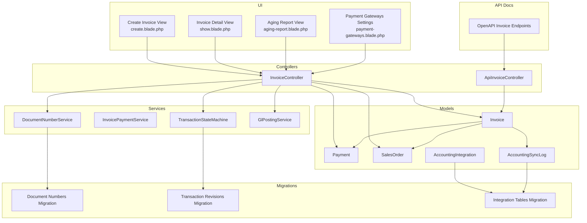

**Diagram sources**
- [InvoiceController.php:1-322](file://app/Http/Controllers/InvoiceController.php#L1-L322)
- [ApiInvoiceController.php:1-31](file://app/Http/Controllers/Api/ApiInvoiceController.php#L1-L31)
- [DocumentNumberService.php:1-133](file://app/Services/DocumentNumberService.php#L1-L133)
- [InvoicePaymentService.php:1-286](file://app/Services/InvoicePaymentService.php#L1-L286)
- [TransactionStateMachine.php:1-314](file://app/Services/TransactionStateMachine.php#L1-L314)
- [GlPostingService.php:1-996](file://app/Services/GlPostingService.php#L1-L996)
- [Invoice.php:1-183](file://app/Models/Invoice.php#L1-L183)
- [Payment.php:1-49](file://app/Models/Payment.php#L1-L49)
- [SalesOrder.php:1-123](file://app/Models/SalesOrder.php#L1-L123)
- [AccountingIntegration.php:1-49](file://app/Models/AccountingIntegration.php#L1-L49)
- [AccountingSyncLog.php:1-42](file://app/Models/AccountingSyncLog.php#L1-L42)
- [2026_03_23_000040_create_document_numbers_and_transaction_revisions.php:89-119](file://database/migrations/2026_03_23_000040_create_document_numbers_and_transaction_revisions.php#L89-L119)
- [2026_04_06_070000_create_integration_tables.php:172-201](file://database/migrations/2026_04_06_070000_create_integration_tables.php#L172-L201)
- [openapi.json:589-649](file://public/api-docs/openapi.json#L589-L649)

**Section sources**
- [InvoiceController.php:1-322](file://app/Http/Controllers/InvoiceController.php#L1-L322)
- [ApiInvoiceController.php:1-31](file://app/Http/Controllers/Api/ApiInvoiceController.php#L1-L31)
- [DocumentNumberService.php:1-133](file://app/Services/DocumentNumberService.php#L1-L133)
- [InvoicePaymentService.php:1-286](file://app/Services/InvoicePaymentService.php#L1-L286)
- [TransactionStateMachine.php:1-314](file://app/Services/TransactionStateMachine.php#L1-L314)
- [GlPostingService.php:1-996](file://app/Services/GlPostingService.php#L1-L996)
- [Invoice.php:1-183](file://app/Models/Invoice.php#L1-L183)
- [Payment.php:1-49](file://app/Models/Payment.php#L1-L49)
- [SalesOrder.php:1-123](file://app/Models/SalesOrder.php#L1-L123)
- [AccountingIntegration.php:1-49](file://app/Models/AccountingIntegration.php#L1-L49)
- [AccountingSyncLog.php:1-42](file://app/Models/AccountingSyncLog.php#L1-L42)
- [2026_03_23_000040_create_document_numbers_and_transaction_revisions.php:89-119](file://database/migrations/2026_03_23_000040_create_document_numbers_and_transaction_revisions.php#L89-L119)
- [2026_04_06_070000_create_integration_tables.php:172-201](file://database/migrations/2026_04_06_070000_create_integration_tables.php#L172-L201)
- [openapi.json:589-649](file://public/api-docs/openapi.json#L589-L649)

## Core Components
- Invoice model: central entity with financial fields, status, due date, currency, and relations to payments, sales orders, and installments
- Invoice controller: handles creation, posting, cancellation, voiding, payment recording, PDF/email, and API exposure
- DocumentNumberService: generates sequential invoice numbers with tenant-scoped prefixes and yearly/monthly periods
- InvoicePaymentService: processes payments atomically across payment creation, invoice status recalculation, GL posting, notifications, and activity logs
- TransactionStateMachine: enforces strict state transitions (draft → posted → cancelled/voided) and revision capture
- GlPostingService: auto-posts journal entries for invoice creation and payments, with robust result reporting
- SalesOrder model: supports invoice linkage and pre/posting state management
- Payment model: polymorphic payable relation to invoices and other entities
- AccountingIntegration and AccountingSyncLog: enable integration with external accounting systems and track sync outcomes
- API endpoints: expose invoice listing and detail with status and overdue filtering

**Section sources**
- [Invoice.php:1-183](file://app/Models/Invoice.php#L1-L183)
- [InvoiceController.php:1-322](file://app/Http/Controllers/InvoiceController.php#L1-L322)
- [DocumentNumberService.php:1-133](file://app/Services/DocumentNumberService.php#L1-L133)
- [InvoicePaymentService.php:1-286](file://app/Services/InvoicePaymentService.php#L1-L286)
- [TransactionStateMachine.php:1-314](file://app/Services/TransactionStateMachine.php#L1-L314)
- [GlPostingService.php:1-996](file://app/Services/GlPostingService.php#L1-L996)
- [SalesOrder.php:1-123](file://app/Models/SalesOrder.php#L1-L123)
- [Payment.php:1-49](file://app/Models/Payment.php#L1-L49)
- [AccountingIntegration.php:1-49](file://app/Models/AccountingIntegration.php#L1-L49)
- [AccountingSyncLog.php:1-42](file://app/Models/AccountingSyncLog.php#L1-L42)
- [ApiInvoiceController.php:1-31](file://app/Http/Controllers/Api/ApiInvoiceController.php#L1-L31)

## Architecture Overview
The invoice lifecycle integrates UI, controllers, services, and persistence with strict state controls and automated GL posting.

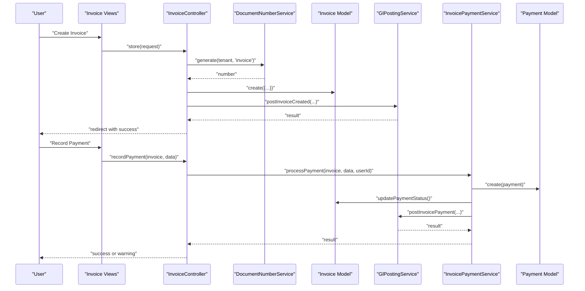

**Diagram sources**
- [InvoiceController.php:79-164](file://app/Http/Controllers/InvoiceController.php#L79-L164)
- [DocumentNumberService.php:39-76](file://app/Services/DocumentNumberService.php#L39-L76)
- [GlPostingService.php:155-184](file://app/Services/GlPostingService.php#L155-L184)
- [InvoicePaymentService.php:37-185](file://app/Services/InvoicePaymentService.php#L37-L185)
- [Payment.php:1-49](file://app/Models/Payment.php#L1-L49)
- [Invoice.php:162-175](file://app/Models/Invoice.php#L162-L175)

## Detailed Component Analysis

### Invoice Creation from Sales Orders
- Sales orders can be linked to invoices; when present, invoice totals mirror SO totals and taxes
- Creation validates period locks, computes tax and total amounts, assigns sequential invoice numbers, and initializes unpaid status
- For standalone invoices (no SO), GL posting occurs immediately upon creation; for invoices derived from SO, GL posting is handled during SO posting

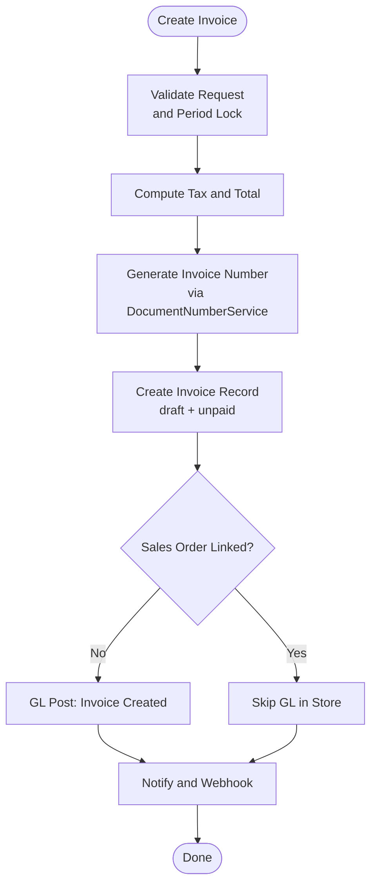

**Diagram sources**
- [InvoiceController.php:79-164](file://app/Http/Controllers/InvoiceController.php#L79-L164)
- [DocumentNumberService.php:39-76](file://app/Services/DocumentNumberService.php#L39-L76)
- [GlPostingService.php:155-184](file://app/Services/GlPostingService.php#L155-L184)

**Section sources**
- [InvoiceController.php:79-164](file://app/Http/Controllers/InvoiceController.php#L79-L164)
- [SalesOrder.php:106-113](file://app/Models/SalesOrder.php#L106-L113)

### Invoice Numbering Scheme
- Centralized, tenant-scoped, sequential numbering with yearly or monthly periods
- Default prefix for invoices is “INV”; numbers formatted as INV-YYYY-XXXX or INV-YYYYMM-XXXX
- Preview capability without increment ensures accurate numbering previews

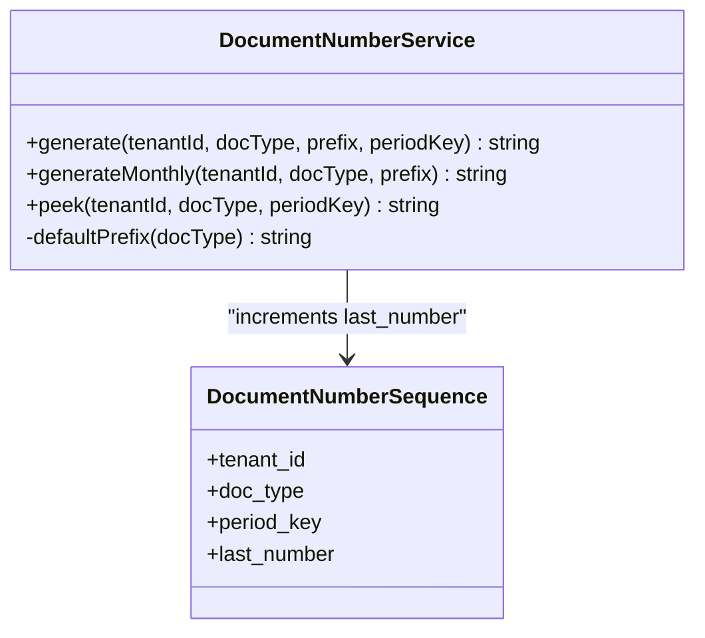

**Diagram sources**
- [DocumentNumberService.php:39-106](file://app/Services/DocumentNumberService.php#L39-L106)
- [2026_03_23_000040_create_document_numbers_and_transaction_revisions.php:89-102](file://database/migrations/2026_03_23_000040_create_document_numbers_and_transaction_revisions.php#L89-L102)

**Section sources**
- [DocumentNumberService.php:1-133](file://app/Services/DocumentNumberService.php#L1-L133)
- [2026_03_23_000040_create_document_numbers_and_transaction_revisions.php:89-119](file://database/migrations/2026_03_23_000040_create_document_numbers_and_transaction_revisions.php#L89-L119)

### Data Synchronization Between Orders and Invoices
- Sales orders maintain invoice relations; invoice creation can reference a sales order
- Invoice updates payment status by aggregating associated payments; this keeps totals and status synchronized
- Aging buckets and overdue calculations are derived from due dates and current status

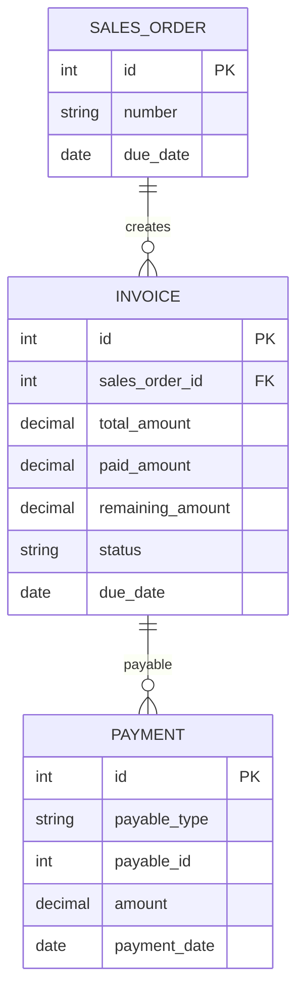

**Diagram sources**
- [SalesOrder.php:106-113](file://app/Models/SalesOrder.php#L106-L113)
- [Invoice.php:162-175](file://app/Models/Invoice.php#L162-L175)
- [Payment.php:35-39](file://app/Models/Payment.php#L35-L39)

**Section sources**
- [Invoice.php:1-183](file://app/Models/Invoice.php#L1-L183)
- [SalesOrder.php:1-123](file://app/Models/SalesOrder.php#L1-L123)
- [Payment.php:1-49](file://app/Models/Payment.php#L1-L49)

### Invoice Status Management and Payment Tracking
- Status progression: unpaid → partial → paid; remaining amount is recalculated after each payment
- Overdue aging buckets: current, 1–30, 31–60, 61–90, 90+ days
- Payment recording is atomic: payment created, invoice status updated, GL posted, notifications recorded

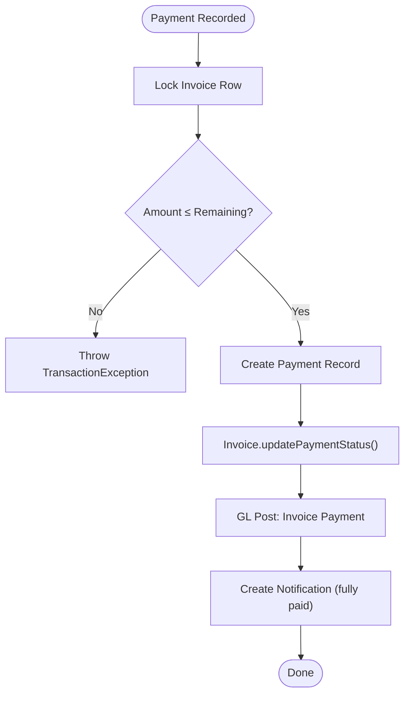

**Diagram sources**
- [InvoicePaymentService.php:56-185](file://app/Services/InvoicePaymentService.php#L56-L185)
- [Invoice.php:162-175](file://app/Models/Invoice.php#L162-L175)
- [GlPostingService.php:186-211](file://app/Services/GlPostingService.php#L186-L211)

**Section sources**
- [Invoice.php:141-181](file://app/Models/Invoice.php#L141-L181)
- [InvoicePaymentService.php:1-286](file://app/Services/InvoicePaymentService.php#L1-L286)
- [GlPostingService.php:186-211](file://app/Services/GlPostingService.php#L186-L211)

### State Machine, Modifications, Cancellation, and Voiding
- Strict transitions: draft → posted → cancelled/voided
- Cancel allowed only when no payments exist; void allowed only for posted invoices with zero payments
- Draft invoices remain editable; posted invoices require revision snapshots for changes

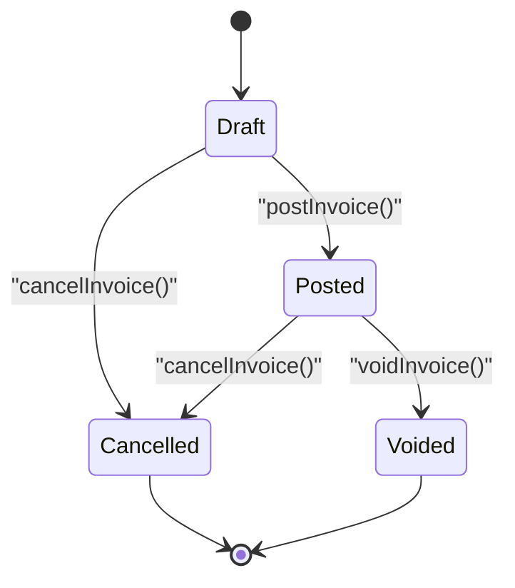

**Diagram sources**
- [TransactionStateMachine.php:36-115](file://app/Services/TransactionStateMachine.php#L36-L115)

**Section sources**
- [TransactionStateMachine.php:36-115](file://app/Services/TransactionStateMachine.php#L36-L115)
- [Invoice.php:63-97](file://app/Models/Invoice.php#L63-L97)

### Integration with Accounting Systems
- Accounting integrations support auto-sync flags for invoices and payments
- Sync logs track started/completed timestamps, status, records synced/failed, and errors
- GL posting service emits journal entries for invoice creation and payments

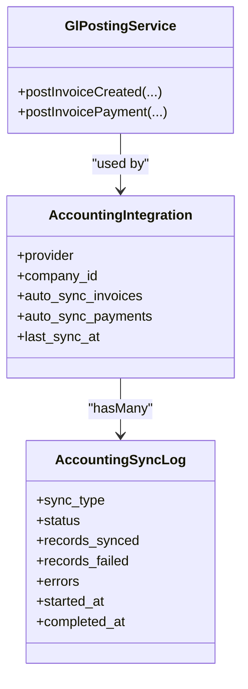

**Diagram sources**
- [AccountingIntegration.php:1-49](file://app/Models/AccountingIntegration.php#L1-L49)
- [AccountingSyncLog.php:1-42](file://app/Models/AccountingSyncLog.php#L1-L42)
- [GlPostingService.php:155-211](file://app/Services/GlPostingService.php#L155-L211)
- [2026_04_06_070000_create_integration_tables.php:182-201](file://database/migrations/2026_04_06_070000_create_integration_tables.php#L182-L201)

**Section sources**
- [AccountingIntegration.php:1-49](file://app/Models/AccountingIntegration.php#L1-L49)
- [AccountingSyncLog.php:1-42](file://app/Models/AccountingSyncLog.php#L1-L42)
- [GlPostingService.php:155-211](file://app/Services/GlPostingService.php#L155-L211)
- [2026_04_06_070000_create_integration_tables.php:172-201](file://database/migrations/2026_04_06_070000_create_integration_tables.php#L172-L201)

### API Exposure and Filters
- API endpoints list invoices with optional status and overdue filters
- Detail endpoint returns invoice with customer and installments

**Section sources**
- [openapi.json:589-649](file://public/api-docs/openapi.json#L589-L649)
- [ApiInvoiceController.php:11-31](file://app/Http/Controllers/Api/ApiInvoiceController.php#L11-L31)

### UI and Reporting
- Invoice detail view displays totals, paid/remaining amounts, and progress indicators
- Aging report categorizes receivables by overdue buckets
- Payment gateway settings UI allows configuring providers and webhook secrets

**Section sources**
- [show.blade.php:189-246](file://resources/views/invoices/show.blade.php#L189-L246)
- [index.blade.php:83-102](file://resources/views/billing/aging-report.blade.php#L83-L102)
- [payment-gateways.blade.php:342-374](file://resources/views/settings/payment-gateways.blade.php#L342-L374)

## Dependency Analysis
The following diagram highlights key dependencies among components involved in invoice generation and management.

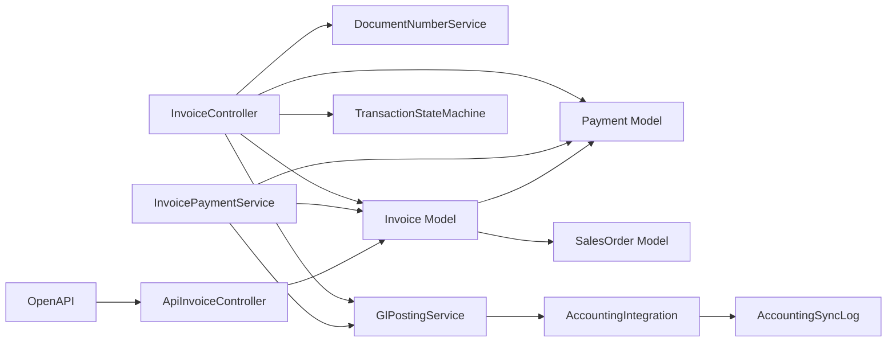

**Diagram sources**
- [InvoiceController.php:1-322](file://app/Http/Controllers/InvoiceController.php#L1-L322)
- [InvoicePaymentService.php:1-286](file://app/Services/InvoicePaymentService.php#L1-L286)
- [DocumentNumberService.php:1-133](file://app/Services/DocumentNumberService.php#L1-L133)
- [GlPostingService.php:1-996](file://app/Services/GlPostingService.php#L1-L996)
- [Invoice.php:1-183](file://app/Models/Invoice.php#L1-L183)
- [Payment.php:1-49](file://app/Models/Payment.php#L1-L49)
- [SalesOrder.php:1-123](file://app/Models/SalesOrder.php#L1-L123)
- [ApiInvoiceController.php:1-31](file://app/Http/Controllers/Api/ApiInvoiceController.php#L1-L31)
- [AccountingIntegration.php:1-49](file://app/Models/AccountingIntegration.php#L1-L49)
- [AccountingSyncLog.php:1-42](file://app/Models/AccountingSyncLog.php#L1-L42)

**Section sources**
- [InvoiceController.php:1-322](file://app/Http/Controllers/InvoiceController.php#L1-L322)
- [InvoicePaymentService.php:1-286](file://app/Services/InvoicePaymentService.php#L1-L286)
- [Invoice.php:1-183](file://app/Models/Invoice.php#L1-L183)
- [Payment.php:1-49](file://app/Models/Payment.php#L1-L49)
- [SalesOrder.php:1-123](file://app/Models/SalesOrder.php#L1-L123)
- [ApiInvoiceController.php:1-31](file://app/Http/Controllers/Api/ApiInvoiceController.php#L1-L31)
- [AccountingIntegration.php:1-49](file://app/Models/AccountingIntegration.php#L1-L49)
- [AccountingSyncLog.php:1-42](file://app/Models/AccountingSyncLog.php#L1-L42)

## Performance Considerations
- Atomic operations: payment processing wraps all steps in a single database transaction to prevent partial states
- Row-level locking: invoice rows are locked during payment to avoid race conditions
- Centralized numbering: DB-level row locks ensure sequential, conflict-free number generation
- GL posting: returns structured results; failures are logged and surfaced as warnings without breaking payment flow
- Pagination and filtering: API endpoints support status and overdue filters to reduce payload sizes

[No sources needed since this section provides general guidance]

## Troubleshooting Guide
Common issues and resolutions:
- Duplicate invoice numbers: numbering is centralized and sequential; conflicts are prevented by DB locks and row-level updates
- Payment exceeding remaining: validation throws rollback-required exceptions; adjust payment amount accordingly
- Posting/GL failures: GL posting returns failure results; payment still succeeds; review GL posting logs and warnings
- Cannot cancel/void: cancel/void requires no prior payments; collect payments first or apply returns
- Overdue aging: verify due dates and status; aging buckets reflect current status and days overdue

**Section sources**
- [DocumentNumberService.php:53-76](file://app/Services/DocumentNumberService.php#L53-L76)
- [InvoicePaymentService.php:68-78](file://app/Services/InvoicePaymentService.php#L68-L78)
- [GlPostingService.php:186-211](file://app/Services/GlPostingService.php#L186-L211)
- [TransactionStateMachine.php:67-115](file://app/Services/TransactionStateMachine.php#L67-L115)
- [Invoice.php:141-181](file://app/Models/Invoice.php#L141-L181)

## Conclusion
The system provides a robust, auditable, and integrated invoice lifecycle:
- Automatic invoice creation from sales orders with sequential numbering
- Strict state management and revision capture for immutability
- Atomic payment processing with GL posting and notifications
- Aging and overdue reporting for receivables management
- Accounting integration and API exposure for external systems

[No sources needed since this section summarizes without analyzing specific files]

## Appendices

### Example Workflows

#### Workflow: Create Invoice from Sales Order
- Select a confirmed sales order
- Controller computes tax and total, generates invoice number, creates invoice, and posts GL if standalone
- Optionally, post invoice to move from draft to posted

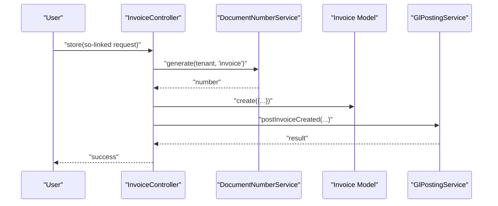

**Diagram sources**
- [InvoiceController.php:79-164](file://app/Http/Controllers/InvoiceController.php#L79-L164)
- [DocumentNumberService.php:39-76](file://app/Services/DocumentNumberService.php#L39-L76)
- [GlPostingService.php:155-184](file://app/Services/GlPostingService.php#L155-L184)

#### Workflow: Record Payment and Update Status
- Validate payment amount against remaining
- Create payment, update invoice totals/status, post GL, notify user

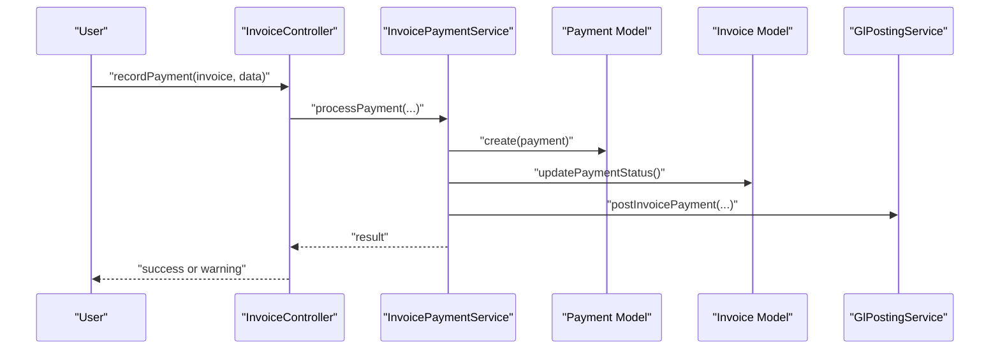

**Diagram sources**
- [InvoiceController.php:173-218](file://app/Http/Controllers/InvoiceController.php#L173-L218)
- [InvoicePaymentService.php:37-185](file://app/Services/InvoicePaymentService.php#L37-L185)
- [GlPostingService.php:186-211](file://app/Services/GlPostingService.php#L186-L211)

### API Definitions
- List invoices with optional status and overdue filters
- Retrieve invoice detail with customer and installments

**Section sources**
- [openapi.json:589-649](file://public/api-docs/openapi.json#L589-L649)
- [ApiInvoiceController.php:11-31](file://app/Http/Controllers/Api/ApiInvoiceController.php#L11-L31)