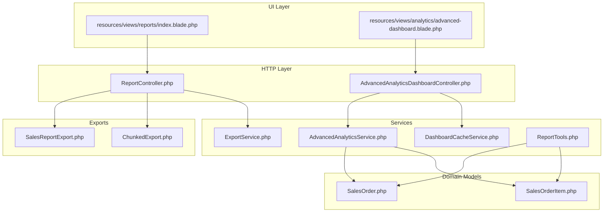
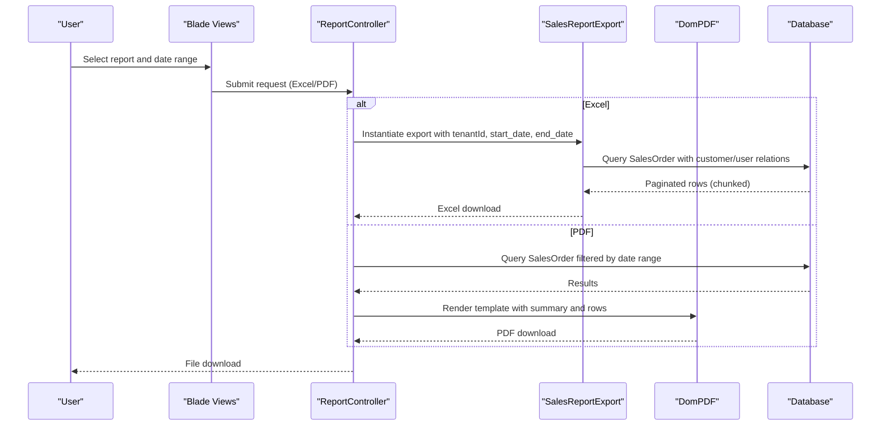
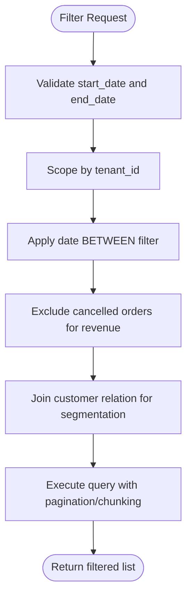
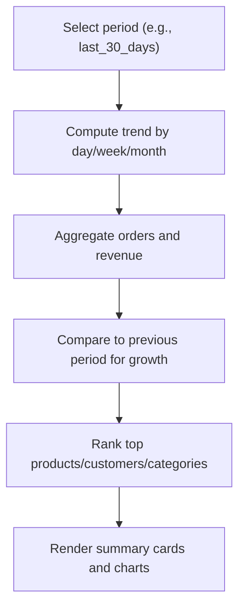
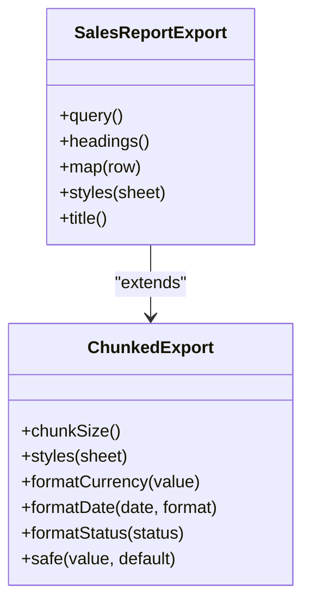
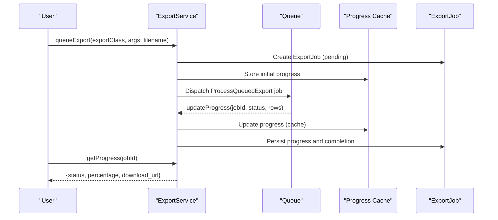
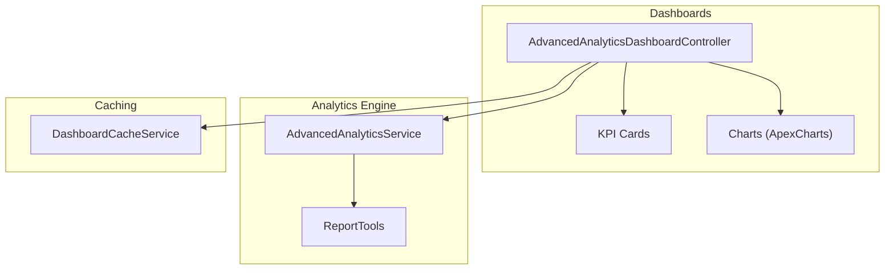
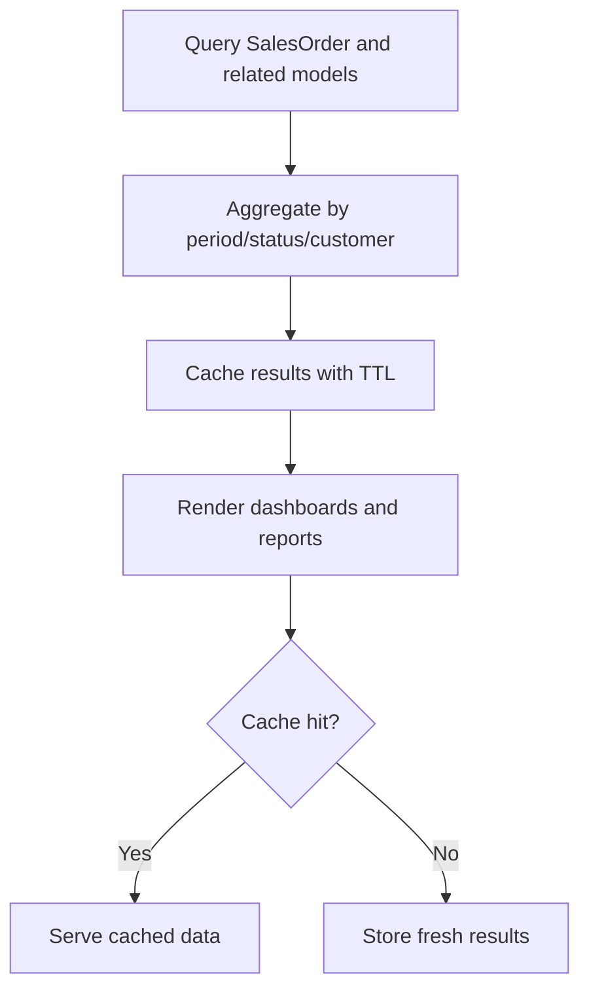
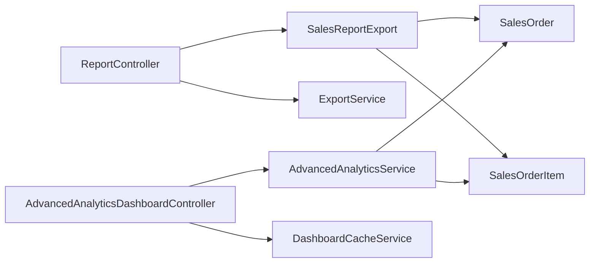

# Reporting & Analytics

<cite>
**Referenced Files in This Document**
- [ReportController.php](file://app/Http/Controllers/ReportController.php)
- [SalesReportExport.php](file://app/Exports/SalesReportExport.php)
- [ChunkedExport.php](file://app/Exports/ChunkedExport.php)
- [AdvancedAnalyticsService.php](file://app/Services/AdvancedAnalyticsService.php)
- [AdvancedAnalyticsDashboardController.php](file://app/Http/Controllers/Analytics/AdvancedAnalyticsDashboardController.php)
- [DashboardCacheService.php](file://app/Services/DashboardCacheService.php)
- [ExportService.php](file://app/Services/ExportService.php)
- [ReportTools.php](file://app/Services/ERP/ReportTools.php)
- [SalesOrder.php](file://app/Models/SalesOrder.php)
- [SalesOrderItem.php](file://app/Models/SalesOrderItem.php)
- [reports/index.blade.php](file://resources/views/reports/index.blade.php)
- [analytics/advanced-dashboard.blade.php](file://resources/views/analytics/advanced-dashboard.blade.php)
</cite>

## Table of Contents
1. [Introduction](#introduction)
2. [Project Structure](#project-structure)
3. [Core Components](#core-components)
4. [Architecture Overview](#architecture-overview)
5. [Detailed Component Analysis](#detailed-component-analysis)
6. [Dependency Analysis](#dependency-analysis)
7. [Performance Considerations](#performance-considerations)
8. [Troubleshooting Guide](#troubleshooting-guide)
9. [Conclusion](#conclusion)
10. [Appendices](#appendices)

## Introduction
This document explains the sales order reporting and analytics capabilities of the system. It covers:
- Sales order listing and filtering by status, date ranges, and customer segments
- Statistical reporting: monthly sales summaries, order volume tracking, and revenue analytics
- Export capabilities: Excel and PDF generation
- Integration points with business intelligence tools via dashboards and scheduled reports
- Examples of report customization, dashboard widgets, and performance metrics
- Underlying data aggregation processes and caching mechanisms for efficient report generation

## Project Structure
The reporting and analytics features span controllers, services, exports, models, and Blade templates:
- Controllers orchestrate requests and render reports
- Services encapsulate advanced analytics and caching
- Exports define structured data outputs for Excel/PDF
- Models represent domain entities (SalesOrder, SalesOrderItem)
- Blade templates render UI for report selection and dashboards

**Diagram sources**
- [ReportController.php:26-534](file://app/Http/Controllers/ReportController.php#L26-L534)
- [AdvancedAnalyticsDashboardController.php:19-667](file://app/Http/Controllers/Analytics/AdvancedAnalyticsDashboardController.php#L19-L667)
- [AdvancedAnalyticsService.php:13-811](file://app/Services/AdvancedAnalyticsService.php#L13-L811)
- [DashboardCacheService.php:13-72](file://app/Services/DashboardCacheService.php#L13-L72)
- [ExportService.php:17-244](file://app/Services/ExportService.php#L17-L244)
- [ReportTools.php:18-625](file://app/Services/ERP/ReportTools.php#L18-L625)
- [SalesReportExport.php:13-58](file://app/Exports/SalesReportExport.php#L13-L58)
- [ChunkedExport.php:19-83](file://app/Exports/ChunkedExport.php#L19-L83)
- [SalesOrder.php:13-123](file://app/Models/SalesOrder.php#L13-L123)
- [SalesOrderItem.php:8-20](file://app/Models/SalesOrderItem.php#L8-L20)

**Section sources**
- [ReportController.php:26-534](file://app/Http/Controllers/ReportController.php#L26-L534)
- [AdvancedAnalyticsDashboardController.php:19-667](file://app/Http/Controllers/Analytics/AdvancedAnalyticsDashboardController.php#L19-L667)
- [AdvancedAnalyticsService.php:13-811](file://app/Services/AdvancedAnalyticsService.php#L13-L811)
- [DashboardCacheService.php:13-72](file://app/Services/DashboardCacheService.php#L13-L72)
- [ExportService.php:17-244](file://app/Services/ExportService.php#L17-L244)
- [ReportTools.php:18-625](file://app/Services/ERP/ReportTools.php#L18-L625)
- [SalesReportExport.php:13-58](file://app/Exports/SalesReportExport.php#L13-L58)
- [ChunkedExport.php:19-83](file://app/Exports/ChunkedExport.php#L19-L83)
- [SalesOrder.php:13-123](file://app/Models/SalesOrder.php#L13-L123)
- [SalesOrderItem.php:8-20](file://app/Models/SalesOrderItem.php#L8-L20)
- [reports/index.blade.php:1-330](file://resources/views/reports/index.blade.php#L1-L330)
- [analytics/advanced-dashboard.blade.php:1-443](file://resources/views/analytics/advanced-dashboard.blade.php#L1-L443)

## Core Components
- Sales order listing and filters:
  - Status filter: draft, confirmed, processing, shipped, delivered, cancelled
  - Date range filter: start_date and end_date validated server-side
  - Customer segment: join with customer relationship for segmentation
- Statistical reporting:
  - Monthly sales summaries: grouped by year-month with order counts and revenue
  - Order volume tracking: daily/weekly/monthly counts
  - Revenue analytics: growth comparisons, conversion rates, top products/customers/categories
- Export capabilities:
  - Excel exports via Maatwebsite Excel with chunking support
  - PDF exports via DomPDF with prebuilt templates
  - Large exports queued with progress tracking
- BI integration:
  - Dashboards with real-time KPIs and charts
  - Custom report builder and scheduled reports
  - Caching for performance and reduced DB load

**Section sources**
- [ReportController.php:46-58](file://app/Http/Controllers/ReportController.php#L46-L58)
- [ReportController.php:62-132](file://app/Http/Controllers/ReportController.php#L62-L132)
- [ReportController.php:134-205](file://app/Http/Controllers/ReportController.php#L134-L205)
- [SalesReportExport.php:21-56](file://app/Exports/SalesReportExport.php#L21-L56)
- [ChunkedExport.php:25-82](file://app/Exports/ChunkedExport.php#L25-L82)
- [ExportService.php:28-107](file://app/Services/ExportService.php#L28-L107)
- [AdvancedAnalyticsDashboardController.php:53-185](file://app/Http/Controllers/Analytics/AdvancedAnalyticsDashboardController.php#L53-L185)
- [AdvancedAnalyticsService.php:19-630](file://app/Services/AdvancedAnalyticsService.php#L19-L630)

## Architecture Overview
The system follows a layered architecture:
- Presentation: Blade templates for report selection and dashboards
- Application: Controllers coordinate requests and delegate to services/exports
- Domain: Models encapsulate SalesOrder and SalesOrderItem entities
- Infrastructure: Exports, PDF rendering, and caching

**Diagram sources**
- [reports/index.blade.php:75-107](file://resources/views/reports/index.blade.php#L75-L107)
- [ReportController.php:62-132](file://app/Http/Controllers/ReportController.php#L62-L132)
- [SalesReportExport.php:21-56](file://app/Exports/SalesReportExport.php#L21-L56)

**Section sources**
- [ReportController.php:26-534](file://app/Http/Controllers/ReportController.php#L26-L534)
- [reports/index.blade.php:1-330](file://resources/views/reports/index.blade.php#L1-L330)

## Detailed Component Analysis

### Sales Order Listing and Filtering
- Filtering by status:
  - Use status conditions to include/exclude cancelled orders in revenue totals
  - Support for draft, confirmed, processing, shipped, delivered, cancelled
- Date range filtering:
  - Server-side validation ensures start_date ≤ end_date
  - Queries scoped to tenant_id and date boundaries
- Customer segmentation:
  - Join with customer relation to group by customer attributes
  - Enable segmentation by customer name, email, phone, and other attributes

**Diagram sources**
- [ReportController.php:46-58](file://app/Http/Controllers/ReportController.php#L46-L58)
- [ReportController.php:103-107](file://app/Http/Controllers/ReportController.php#L103-L107)
- [SalesReportExport.php:23-26](file://app/Exports/SalesReportExport.php#L23-L26)

**Section sources**
- [ReportController.php:46-58](file://app/Http/Controllers/ReportController.php#L46-L58)
- [ReportController.php:103-107](file://app/Http/Controllers/ReportController.php#L103-L107)
- [SalesReportExport.php:23-26](file://app/Exports/SalesReportExport.php#L23-L26)

### Statistical Reporting and Analytics
- Monthly sales summaries:
  - Group by year-month, compute order counts and revenue
  - Compare with previous period for growth percentage
- Order volume tracking:
  - Daily/weekly/monthly counts aggregated over selected periods
- Revenue analytics:
  - Conversion rate: completed orders / total orders
  - Average order value: total revenue / total orders
  - Top products, customers, categories by revenue

**Diagram sources**
- [ReportTools.php:212-289](file://app/Services/ERP/ReportTools.php#L212-L289)
- [AdvancedAnalyticsDashboardController.php:122-185](file://app/Http/Controllers/Analytics/AdvancedAnalyticsDashboardController.php#L122-L185)

**Section sources**
- [ReportTools.php:212-289](file://app/Services/ERP/ReportTools.php#L212-L289)
- [AdvancedAnalyticsDashboardController.php:122-185](file://app/Http/Controllers/Analytics/AdvancedAnalyticsDashboardController.php#L122-L185)

### Export Capabilities: Excel and PDF
- Excel exports:
  - SalesReportExport implements query-based export with mapped headings/styles
  - ChunkedExport base class enables chunked reading for large datasets
- PDF exports:
  - DomPDF renders predefined templates with summary and tabular data
  - Templates support landscape/portrait paper sizes and currency formatting

**Diagram sources**
- [SalesReportExport.php:13-58](file://app/Exports/SalesReportExport.php#L13-L58)
- [ChunkedExport.php:19-83](file://app/Exports/ChunkedExport.php#L19-L83)

**Section sources**
- [SalesReportExport.php:21-56](file://app/Exports/SalesReportExport.php#L21-L56)
- [ChunkedExport.php:25-82](file://app/Exports/ChunkedExport.php#L25-L82)
- [ReportController.php:98-132](file://app/Http/Controllers/ReportController.php#L98-L132)
- [ReportController.php:134-205](file://app/Http/Controllers/ReportController.php#L134-L205)

### Large Export Processing and Progress Tracking
- Queue-based exports prevent timeouts for large datasets
- Progress stored in cache and persisted in ExportJob records
- Threshold-based queuing decides when to queue vs inline export

**Diagram sources**
- [ExportService.php:28-107](file://app/Services/ExportService.php#L28-L107)
- [ExportService.php:119-159](file://app/Services/ExportService.php#L119-L159)

**Section sources**
- [ExportService.php:28-107](file://app/Services/ExportService.php#L28-L107)
- [ExportService.php:119-159](file://app/Services/ExportService.php#L119-L159)

### Business Intelligence Integration and Dashboards
- Real-time KPIs:
  - Revenue (daily/weekly/monthly), growth, orders, conversion rate, average order value
  - Inventory metrics: total products, in-stock, low stock, out-of-stock, turnover rate
  - Customer metrics: total, new this month, active, retention rate
- Predictive analytics:
  - Sales forecasting with linear regression and optional AI enhancement
  - Inventory demand prediction and churn risk modeling
- Custom report builder:
  - Define metrics, date ranges, and output format (PDF/Excel/CSV)
  - Scheduled reports with recipients and frequency

**Diagram sources**
- [AdvancedAnalyticsDashboardController.php:53-185](file://app/Http/Controllers/Analytics/AdvancedAnalyticsDashboardController.php#L53-L185)
- [AdvancedAnalyticsService.php:19-630](file://app/Services/AdvancedAnalyticsService.php#L19-L630)
- [ReportTools.php:212-289](file://app/Services/ERP/ReportTools.php#L212-L289)
- [DashboardCacheService.php:23-38](file://app/Services/DashboardCacheService.php#L23-L38)

**Section sources**
- [AdvancedAnalyticsDashboardController.php:53-185](file://app/Http/Controllers/Analytics/AdvancedAnalyticsDashboardController.php#L53-L185)
- [AdvancedAnalyticsService.php:19-630](file://app/Services/AdvancedAnalyticsService.php#L19-L630)
- [ReportTools.php:212-289](file://app/Services/ERP/ReportTools.php#L212-L289)
- [DashboardCacheService.php:23-38](file://app/Services/DashboardCacheService.php#L23-L38)

### Data Aggregation and Caching Mechanisms
- Aggregation:
  - Group by date intervals (day/week/month) for trend analysis
  - Summarize revenue, counts, and averages per segment
- Caching:
  - Cache KPIs and dashboard data with TTL to reduce DB load
  - Cache export progress for responsive UI feedback

**Diagram sources**
- [AdvancedAnalyticsDashboardController.php:57-117](file://app/Http/Controllers/Analytics/AdvancedAnalyticsDashboardController.php#L57-L117)
- [DashboardCacheService.php:23-38](file://app/Services/DashboardCacheService.php#L23-L38)

**Section sources**
- [AdvancedAnalyticsDashboardController.php:57-117](file://app/Http/Controllers/Analytics/AdvancedAnalyticsDashboardController.php#L57-L117)
- [DashboardCacheService.php:23-38](file://app/Services/DashboardCacheService.php#L23-L38)

## Dependency Analysis
- Controllers depend on:
  - Exports for Excel/PDF outputs
  - Services for analytics and caching
  - Models for data access
- Exports depend on:
  - Models for query construction
  - Excel/PDF libraries for rendering
- Services depend on:
  - Models for aggregations
  - Cache for performance
  - External integrations (e.g., AI) for predictions

**Diagram sources**
- [ReportController.php:26-534](file://app/Http/Controllers/ReportController.php#L26-L534)
- [SalesReportExport.php:13-58](file://app/Exports/SalesReportExport.php#L13-L58)
- [AdvancedAnalyticsDashboardController.php:19-667](file://app/Http/Controllers/Analytics/AdvancedAnalyticsDashboardController.php#L19-L667)
- [AdvancedAnalyticsService.php:13-811](file://app/Services/AdvancedAnalyticsService.php#L13-L811)
- [DashboardCacheService.php:13-72](file://app/Services/DashboardCacheService.php#L13-L72)
- [SalesOrder.php:13-123](file://app/Models/SalesOrder.php#L13-L123)
- [SalesOrderItem.php:8-20](file://app/Models/SalesOrderItem.php#L8-L20)

**Section sources**
- [ReportController.php:26-534](file://app/Http/Controllers/ReportController.php#L26-L534)
- [AdvancedAnalyticsDashboardController.php:19-667](file://app/Http/Controllers/Analytics/AdvancedAnalyticsDashboardController.php#L19-L667)
- [AdvancedAnalyticsService.php:13-811](file://app/Services/AdvancedAnalyticsService.php#L13-L811)
- [DashboardCacheService.php:13-72](file://app/Services/DashboardCacheService.php#L13-L72)
- [SalesReportExport.php:13-58](file://app/Exports/SalesReportExport.php#L13-L58)
- [SalesOrder.php:13-123](file://app/Models/SalesOrder.php#L13-L123)
- [SalesOrderItem.php:8-20](file://app/Models/SalesOrderItem.php#L8-L20)

## Performance Considerations
- Use chunked exports to avoid timeouts on large datasets
- Cache dashboard KPIs and trend data with appropriate TTL
- Prefer single aggregate queries over multiple small queries
- Limit joins and eager-load relations to reduce overhead
- Use pagination/chunking in exports and large report queries

[No sources needed since this section provides general guidance]

## Troubleshooting Guide
- Date range validation errors:
  - Ensure start_date and end_date are provided and end_date ≥ start_date
- Export timeouts:
  - Switch to queued export for large datasets; monitor progress via job ID
- Missing cached data:
  - Clear cache keys or adjust TTL; verify cache driver configuration
- PDF rendering issues:
  - Verify DomPDF template availability and paper size/format

**Section sources**
- [ReportController.php:46-58](file://app/Http/Controllers/ReportController.php#L46-L58)
- [ExportService.php:119-159](file://app/Services/ExportService.php#L119-L159)
- [DashboardCacheService.php:35-57](file://app/Services/DashboardCacheService.php#L35-L57)

## Conclusion
The system provides robust sales order reporting and analytics with:
- Flexible filtering by status, date ranges, and customer segments
- Comprehensive statistical reporting and BI-ready dashboards
- Reliable export capabilities with chunking and progress tracking
- Strong caching and aggregation foundations for performance

[No sources needed since this section summarizes without analyzing specific files]

## Appendices

### Examples of Report Customization and Dashboards
- Custom report builder:
  - Choose metrics, date range, and output format (PDF/Excel/CSV)
  - Schedule recurring reports with recipients
- Dashboard widgets:
  - Revenue KPI cards (daily/weekly/monthly/growth)
  - Orders and conversion rate metrics
  - Inventory and customer health indicators
  - Interactive charts for revenue trends and top performers

**Section sources**
- [AdvancedAnalyticsDashboardController.php:379-438](file://app/Http/Controllers/Analytics/AdvancedAnalyticsDashboardController.php#L379-L438)
- [analytics/advanced-dashboard.blade.php:64-324](file://resources/views/analytics/advanced-dashboard.blade.php#L64-L324)