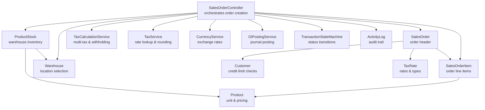
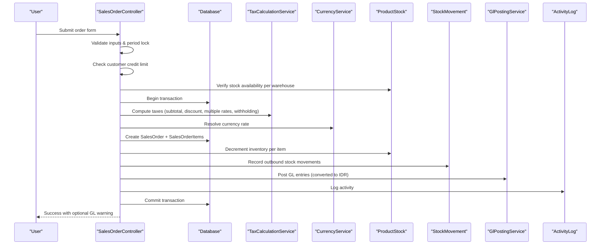
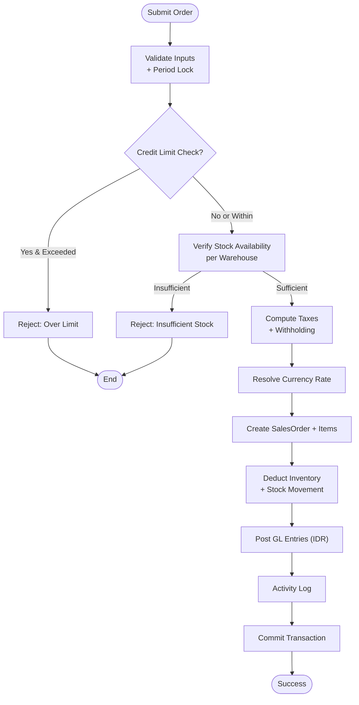
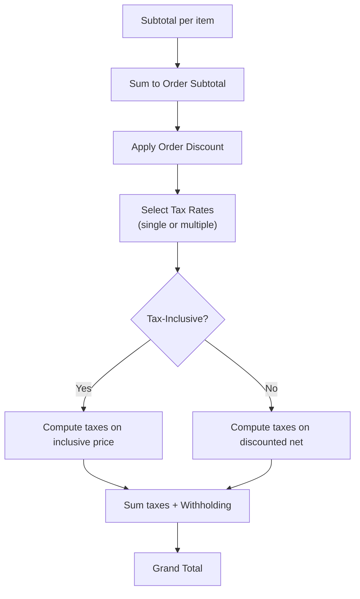
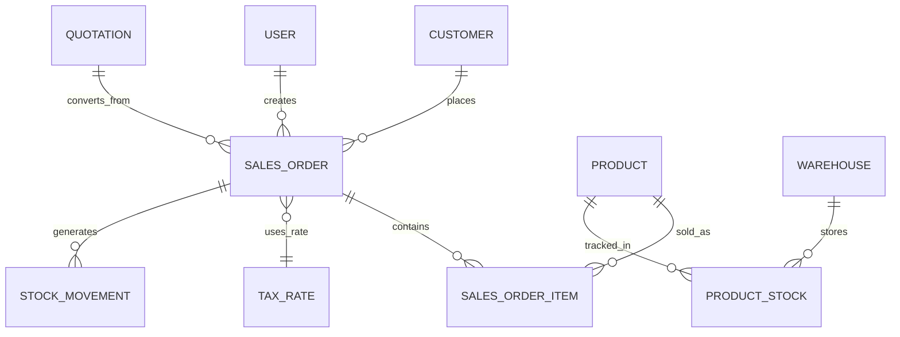
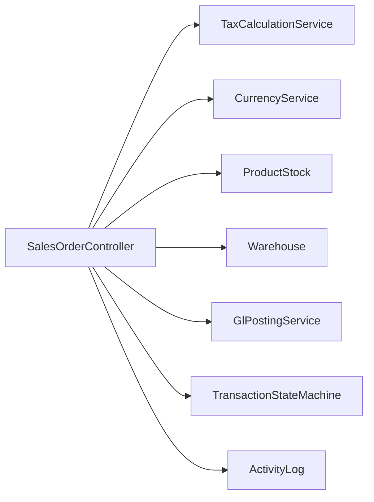

# Sales Order Creation & Validation

<cite>
**Referenced Files in This Document**
- [SalesOrderController.php](file://app/Http/Controllers/SalesOrderController.php)
- [SalesOrder.php](file://app/Models/SalesOrder.php)
- [SalesOrderItem.php](file://app/Models/SalesOrderItem.php)
- [ProductStock.php](file://app/Models/ProductStock.php)
- [Warehouse.php](file://app/Models/Warehouse.php)
- [TaxService.php](file://app/Services/TaxService.php)
- [TaxCalculationService.php](file://app/Services/TaxCalculationService.php)
- [CurrencyService.php](file://app/Services/CurrencyService.php)
- [GlPostingService.php](file://app/Services/GlPostingService.php)
- [TransactionStateMachine.php](file://app/Services/TransactionStateMachine.php)
- [2026_04_08_010902_add_withholding_tax_to_sales_orders_table.php](file://database/migrations/2026_04_08_010902_add_withholding_tax_to_sales_orders_table.php)
- [SalesOrderTest.php](file://tests/Feature/SalesOrderTest.php)
</cite>

## Table of Contents
1. [Introduction](#introduction)
2. [Project Structure](#project-structure)
3. [Core Components](#core-components)
4. [Architecture Overview](#architecture-overview)
5. [Detailed Component Analysis](#detailed-component-analysis)
6. [Dependency Analysis](#dependency-analysis)
7. [Performance Considerations](#performance-considerations)
8. [Troubleshooting Guide](#troubleshooting-guide)
9. [Conclusion](#conclusion)

## Introduction
This document explains the complete sales order creation and validation workflow in the system. It covers customer validation, product availability checks, pricing calculations, tax handling (including multiple tax rates and withholding taxes), inventory deduction, multi-currency support, discount application, warehouse selection, transaction processing, database relationships, and activity logging. Practical scenarios, validation rules, error handling, and integration points with inventory management systems are included to help both technical and non-technical users understand and operate the process effectively.

## Project Structure
The sales order lifecycle spans controller actions, model definitions, services for tax and currency, and supporting models for inventory and warehouse management. The controller orchestrates validation, transactions, inventory updates, and GL posting while delegating specialized logic to dedicated services.

**Diagram sources**
- [SalesOrderController.php:88-276](file://app/Http/Controllers/SalesOrderController.php#L88-L276)
- [SalesOrder.php:17-53](file://app/Models/SalesOrder.php#L17-L53)
- [SalesOrderItem.php:10-15](file://app/Models/SalesOrderItem.php#L10-L15)
- [ProductStock.php:10-13](file://app/Models/ProductStock.php#L10-L13)
- [Warehouse.php:15-20](file://app/Models/Warehouse.php#L15-L20)
- [TaxCalculationService.php](file://app/Services/TaxCalculationService.php)
- [TaxService.php:15-168](file://app/Services/TaxService.php#L15-L168)
- [CurrencyService.php](file://app/Services/CurrencyService.php)
- [GlPostingService.php](file://app/Services/GlPostingService.php)
- [TransactionStateMachine.php](file://app/Services/TransactionStateMachine.php)

**Section sources**
- [SalesOrderController.php:88-276](file://app/Http/Controllers/SalesOrderController.php#L88-L276)
- [SalesOrder.php:17-53](file://app/Models/SalesOrder.php#L17-L53)
- [SalesOrderItem.php:10-15](file://app/Models/SalesOrderItem.php#L10-L15)
- [ProductStock.php:10-13](file://app/Models/ProductStock.php#L10-L13)
- [Warehouse.php:15-20](file://app/Models/Warehouse.php#L15-L20)

## Core Components
- SalesOrderController: Validates input, enforces business rules (period lock, credit limits, stock availability), performs transactions, updates inventory, posts taxes and GL, records activity logs, and dispatches webhooks.
- SalesOrder and SalesOrderItem: Persist order headers and line items with proper casting and relationships.
- ProductStock and Warehouse: Track inventory per warehouse and enable stock deductions during order creation.
- TaxCalculationService and TaxService: Compute taxes, support multiple tax rates, withholding taxes, and accounting-compliant rounding.
- CurrencyService: Resolve exchange rates for multi-currency support.
- GlPostingService: Post journal entries in base currency (IDR conversion).
- TransactionStateMachine: Enforce status transitions and terminal states.

**Section sources**
- [SalesOrderController.php:88-276](file://app/Http/Controllers/SalesOrderController.php#L88-L276)
- [SalesOrder.php:17-53](file://app/Models/SalesOrder.php#L17-L53)
- [SalesOrderItem.php:10-15](file://app/Models/SalesOrderItem.php#L10-L15)
- [ProductStock.php:10-13](file://app/Models/ProductStock.php#L10-L13)
- [Warehouse.php:15-20](file://app/Models/Warehouse.php#L15-L20)
- [TaxCalculationService.php](file://app/Services/TaxCalculationService.php)
- [TaxService.php:15-168](file://app/Services/TaxService.php#L15-L168)
- [CurrencyService.php](file://app/Services/CurrencyService.php)
- [GlPostingService.php](file://app/Services/GlPostingService.php)
- [TransactionStateMachine.php](file://app/Services/TransactionStateMachine.php)

## Architecture Overview
The sales order creation flow integrates validation, computation, persistence, inventory, and financial posting within a single transaction to ensure atomicity and consistency.

**Diagram sources**
- [SalesOrderController.php:88-276](file://app/Http/Controllers/SalesOrderController.php#L88-L276)
- [TaxCalculationService.php](file://app/Services/TaxCalculationService.php)
- [CurrencyService.php](file://app/Services/CurrencyService.php)
- [ProductStock.php:10-13](file://app/Models/ProductStock.php#L10-L13)
- [GlPostingService.php](file://app/Services/GlPostingService.php)

## Detailed Component Analysis

### Sales Order Creation Workflow
- Input validation ensures required fields, date constraints, payment terms, and item integrity.
- Period lock prevents entries in closed accounting periods.
- Credit limit check blocks credit orders exceeding available customer credit.
- Stock availability verification per warehouse ensures sufficient quantities.
- Taxes computed using multi-rate support and withholding tax handling.
- Multi-currency handled via exchange rate resolution; GL posted in IDR.
- Inventory decremented and outbound movements recorded.
- Activity log captures creation event; webhooks dispatched.

**Diagram sources**
- [SalesOrderController.php:88-276](file://app/Http/Controllers/SalesOrderController.php#L88-L276)
- [TaxCalculationService.php](file://app/Services/TaxCalculationService.php)
- [CurrencyService.php](file://app/Services/CurrencyService.php)
- [ProductStock.php:10-13](file://app/Models/ProductStock.php#L10-L13)

**Section sources**
- [SalesOrderController.php:88-276](file://app/Http/Controllers/SalesOrderController.php#L88-L276)

### Validation Rules and Data Integrity
- Required fields: customer, date, warehouse, items with quantity/price/discount.
- Date constraints: delivery date after or equal order date; due date required for credit payments.
- Item integrity: each item requires product, positive quantity, non-negative price and discount.
- Period lock enforcement via PeriodLockService.
- Credit limit enforcement via Customer model method.
- Stock availability per warehouse via ProductStock lookup.

Practical examples:
- Scenario A: Credit sale exceeding credit limit → validation fails with available credit amount.
- Scenario B: Item quantity exceeds warehouse stock → validation fails with available quantity.
- Scenario C: Missing required fields → Laravel validation returns errors.

**Section sources**
- [SalesOrderController.php:90-141](file://app/Http/Controllers/SalesOrderController.php#L90-L141)
- [SalesOrderTest.php:202-228](file://tests/Feature/SalesOrderTest.php#L202-L228)

### Pricing, Discounts, and Taxes
- Line item totals computed as quantity × price minus discount per item.
- Order discount applied to subtotal.
- Tax calculation supports:
  - Single tax rate ID (legacy).
  - Multiple tax rate IDs (new).
  - Tax-inclusive pricing flag.
  - Withholding tax amounts stored separately.
- TaxService provides accounting-compliant rounding and helpers for PPN/PPH rates.

**Diagram sources**
- [SalesOrderController.php:162-184](file://app/Http/Controllers/SalesOrderController.php#L162-L184)
- [TaxCalculationService.php](file://app/Services/TaxCalculationService.php)
- [TaxService.php:15-168](file://app/Services/TaxService.php#L15-L168)

**Section sources**
- [SalesOrderController.php:162-184](file://app/Http/Controllers/SalesOrderController.php#L162-L184)
- [TaxService.php:15-168](file://app/Services/TaxService.php#L15-L168)
- [2026_04_08_010902_add_withholding_tax_to_sales_orders_table.php:15-25](file://database/migrations/2026_04_08_010902_add_withholding_tax_to_sales_orders_table.php#L15-L25)

### Multi-Currency Support
- Currency code and rate captured on order creation.
- GL posting performed in IDR by multiplying amounts by rate.
- Exchange rate retrieved via CurrencyService.

**Section sources**
- [SalesOrderController.php:186-212](file://app/Http/Controllers/SalesOrderController.php#L186-L212)
- [CurrencyService.php](file://app/Services/CurrencyService.php)

### Inventory Deduction and Movement Logging
- For each ordered item, ProductStock is decremented by quantity.
- StockMovement records outbound movement with before/after quantities and reference to order number.
- Warehouse selection enforced per order.

**Section sources**
- [SalesOrderController.php:217-238](file://app/Http/Controllers/SalesOrderController.php#L217-L238)
- [ProductStock.php:10-13](file://app/Models/ProductStock.php#L10-L13)
- [Warehouse.php:15-20](file://app/Models/Warehouse.php#L15-L20)

### Status Transitions and Terminal States
- Valid transitions: pending → confirmed → processing → shipped → completed.
- Terminal states: completed and cancelled cannot change further.
- Additional constraints: cancelled only allowed under specific conditions (no active invoice, not shipped/completed).

**Section sources**
- [SalesOrderController.php:285-384](file://app/Http/Controllers/SalesOrderController.php#L285-L384)

### Database Relationships and Models

**Diagram sources**
- [SalesOrder.php:85-121](file://app/Models/SalesOrder.php#L85-L121)
- [SalesOrderItem.php:17-18](file://app/Models/SalesOrderItem.php#L17-L18)
- [ProductStock.php:10-13](file://app/Models/ProductStock.php#L10-L13)
- [Warehouse.php:22-41](file://app/Models/Warehouse.php#L22-L41)

**Section sources**
- [SalesOrder.php:85-121](file://app/Models/SalesOrder.php#L85-L121)
- [SalesOrderItem.php:17-18](file://app/Models/SalesOrderItem.php#L17-L18)
- [ProductStock.php:10-13](file://app/Models/ProductStock.php#L10-L13)
- [Warehouse.php:22-41](file://app/Models/Warehouse.php#L22-L41)

### Transaction Processing and Activity Logging
- All order creation steps occur inside a database transaction.
- ActivityLog records creation events with formatted totals and currency.
- Optional GL warnings surfaced after commit if posting fails partially.
- Webhooks dispatched upon successful completion.

**Section sources**
- [SalesOrderController.php:143-263](file://app/Http/Controllers/SalesOrderController.php#L143-L263)

## Dependency Analysis
Key dependencies and their roles:
- SalesOrderController depends on:
  - TaxCalculationService for tax computations.
  - CurrencyService for exchange rates.
  - ProductStock and Warehouse for inventory checks/deductions.
  - GlPostingService for financial posting.
  - TransactionStateMachine for status transitions.
  - ActivityLog for audit trails.

**Diagram sources**
- [SalesOrderController.php:162-263](file://app/Http/Controllers/SalesOrderController.php#L162-L263)

**Section sources**
- [SalesOrderController.php:162-263](file://app/Http/Controllers/SalesOrderController.php#L162-L263)

## Performance Considerations
- Eager loading: ProductStock relationships are loaded selectively to avoid N+1 queries and reduce overhead.
- Single transaction: Bundles all operations to minimize partial writes and improve consistency.
- Indexes: New indexes on withholding_tax_amount and tax_inclusive improve tax-related queries.
- Rounding: Accounting-compliant rounding reduces cumulative discrepancies in financial reporting.

[No sources needed since this section provides general guidance]

## Troubleshooting Guide
Common validation failures and resolutions:
- Credit limit exceeded: Reduce order value or increase customer credit limit; available credit is shown in the error message.
- Insufficient stock: Adjust quantities or source from another warehouse; available quantities are reported per item.
- Invalid dates or missing fields: Ensure order date, delivery date, and required fields are present and valid.
- Period locked: Perform the action in an open accounting period.
- Tenant isolation gaps: Known limitation documented in tests; consider adding tenant-scoped validation rules for customer references.

Error handling specifics:
- Validation errors return back with input preserved.
- Partial GL posting results surface warnings after successful commit.
- Activity logs capture all significant events for auditability.

**Section sources**
- [SalesOrderController.php:117-141](file://app/Http/Controllers/SalesOrderController.php#L117-L141)
- [SalesOrderController.php:266-275](file://app/Http/Controllers/SalesOrderController.php#L266-L275)
- [SalesOrderTest.php:202-228](file://tests/Feature/SalesOrderTest.php#L202-L228)

## Conclusion
The sales order creation process is robustly validated, transactionally safe, and integrated with inventory and financial systems. It supports multi-currency, multiple tax rates, withholding taxes, and strict status transitions. Adhering to the validation rules and leveraging the built-in services ensures accurate, compliant, and auditable order processing.